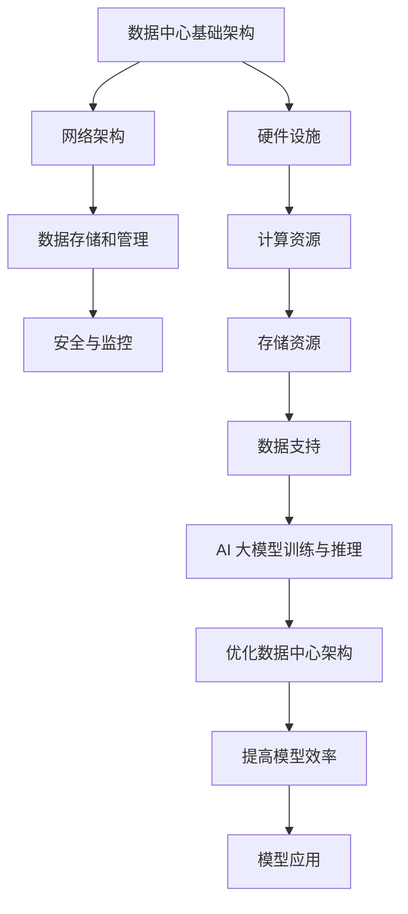

                 

# AI 大模型应用数据中心建设：数据中心技术与应用

> 关键词：AI 大模型、数据中心、技术、应用、架构、算法、数学模型、实战案例

> 摘要：本文深入探讨了 AI 大模型应用数据中心建设的核心技术和应用场景。通过分析数据中心的基础架构、核心算法原理、数学模型以及实际应用案例，本文为读者提供了全面的技术解析和实战指导。同时，文章还推荐了相关学习资源和开发工具，为读者进一步学习和实践提供了参考。

## 1. 背景介绍

随着人工智能技术的飞速发展，AI 大模型在各个领域的应用越来越广泛。这些大模型需要大量的计算资源和数据支持，因此数据中心的建设变得尤为重要。数据中心不仅是存储和计算的重要场所，更是实现 AI 大模型高效应用的基石。

数据中心的建设涉及到多个方面，包括硬件基础设施、网络架构、数据存储和管理、安全与监控等。在本文中，我们将重点关注数据中心的技术与应用，主要包括以下几个方面：

1. 核心算法原理与具体操作步骤
2. 数学模型和公式及其详细讲解与举例说明
3. 实际应用场景分析
4. 工具和资源推荐

通过以上几个方面的探讨，本文旨在为读者提供一个全面的技术解析，帮助大家更好地理解和应用 AI 大模型在数据中心的建设过程中。

## 2. 核心概念与联系

在深入探讨数据中心技术之前，我们首先需要了解一些核心概念和它们之间的联系。

### 2.1 数据中心基础架构

数据中心的基础架构主要包括以下几个方面：

- **硬件设施**：包括服务器、存储设备、网络设备等硬件资源。
- **网络架构**：通过光纤、交换机等网络设备，实现数据中心内部以及与外部网络的互联互通。
- **数据存储和管理**：包括文件存储、数据库存储等，确保数据的安全、可靠和高效访问。
- **安全与监控**：通过防火墙、入侵检测、日志监控等技术，确保数据中心的安全稳定运行。

### 2.2 AI 大模型算法原理

AI 大模型的核心算法主要包括深度学习、生成对抗网络（GAN）、强化学习等。这些算法通过大规模数据训练，实现模型的自动学习和优化。

- **深度学习**：基于多层神经网络，通过反向传播算法进行训练，具有强大的特征提取和分类能力。
- **生成对抗网络（GAN）**：由生成器和判别器两个神经网络组成，通过博弈过程实现数据生成和判别。
- **强化学习**：通过试错和奖励机制，使模型能够在复杂环境中做出最优决策。

### 2.3 数学模型

AI 大模型的训练和优化过程涉及到多个数学模型，主要包括损失函数、优化算法等。

- **损失函数**：用于衡量模型预测结果与真实值之间的差距，如均方误差（MSE）、交叉熵等。
- **优化算法**：用于调整模型参数，使损失函数最小化，如梯度下降、随机梯度下降（SGD）、Adam等。

### 2.4 数据中心与 AI 大模型的联系

数据中心为 AI 大模型提供了强大的计算和存储资源支持。通过优化数据中心的基础架构和网络架构，可以提高 AI 大模型训练和推理的效率。同时，数据中心的存储和管理能力也为 AI 大模型提供了丰富的数据支持。

为了更好地理解数据中心与 AI 大模型之间的联系，我们可以使用 Mermaid 流程图进行表示。



通过以上分析，我们可以看到数据中心与 AI 大模型之间的密切联系。在接下来的章节中，我们将进一步探讨核心算法原理、数学模型以及实际应用场景。

## 3. 核心算法原理 & 具体操作步骤

在本节中，我们将详细介绍 AI 大模型的核心算法原理和具体操作步骤。这些算法包括深度学习、生成对抗网络（GAN）和强化学习，它们在数据中心的应用至关重要。

### 3.1 深度学习

深度学习是一种基于多层神经网络的人工智能算法。它的基本思想是通过大量数据训练，使神经网络自动学习和提取特征，从而实现复杂的任务。

#### 3.1.1 算法原理

深度学习算法的核心是神经网络，由多个层次组成，包括输入层、隐藏层和输出层。每个层次由多个神经元（节点）组成。神经元之间的连接权重通过训练不断调整，以达到最优性能。

深度学习算法主要采用以下步骤：

1. **数据预处理**：对输入数据进行归一化、标准化等处理，以便神经网络更好地学习。
2. **定义损失函数**：用于衡量模型预测结果与真实值之间的差距，如均方误差（MSE）和交叉熵。
3. **初始化参数**：随机初始化网络权重和偏置。
4. **正向传播**：将输入数据传递到神经网络，计算输出结果。
5. **反向传播**：计算损失函数梯度，更新网络权重和偏置。
6. **迭代训练**：重复正向传播和反向传播，直至达到预定的训练次数或损失函数收敛。

#### 3.1.2 实操步骤

以下是一个简单的深度学习模型训练过程：

1. **准备数据集**：收集并预处理训练数据。
2. **定义模型**：使用深度学习框架（如 TensorFlow 或 PyTorch）定义神经网络结构。
3. **编译模型**：设置损失函数、优化器等参数。
4. **训练模型**：使用训练数据训练模型，保存训练过程中的损失函数值。
5. **评估模型**：使用验证数据评估模型性能，调整模型参数。
6. **测试模型**：使用测试数据测试模型性能，确保模型泛化能力。

### 3.2 生成对抗网络（GAN）

生成对抗网络（GAN）是一种基于博弈论的人工智能算法。它由生成器和判别器两个神经网络组成，通过博弈过程实现数据生成和判别。

#### 3.2.1 算法原理

GAN 的基本原理是生成器和判别器的对抗训练。生成器的目标是生成逼真的数据，判别器的目标是区分生成数据和真实数据。两者相互竞争，使生成器生成的数据越来越真实。

GAN 算法主要采用以下步骤：

1. **初始化参数**：随机初始化生成器和判别器权重。
2. **生成数据**：生成器生成一批数据。
3. **判别数据**：判别器对生成数据和真实数据进行判别。
4. **更新参数**：根据判别结果更新生成器和判别器权重。
5. **迭代训练**：重复生成和判别过程，直至达到预定的训练次数或生成数据质量满足要求。

#### 3.2.2 实操步骤

以下是一个简单的 GAN 模型训练过程：

1. **准备数据集**：收集并预处理训练数据。
2. **定义模型**：使用深度学习框架定义生成器和判别器结构。
3. **编译模型**：设置损失函数、优化器等参数。
4. **训练模型**：使用训练数据训练模型，保存训练过程中的损失函数值。
5. **评估模型**：使用验证数据评估模型性能，调整模型参数。
6. **测试模型**：使用测试数据测试模型性能，确保模型泛化能力。

### 3.3 强化学习

强化学习是一种基于试错和奖励机制的人工智能算法。它的目标是使模型在复杂环境中做出最优决策。

#### 3.3.1 算法原理

强化学习算法的核心是价值函数或策略。通过不断尝试不同的动作，并根据奖励信号调整策略，使模型能够在长期内获得最大累积奖励。

强化学习算法主要采用以下步骤：

1. **初始化参数**：随机初始化模型参数。
2. **环境交互**：模型与环境进行交互，执行动作。
3. **计算奖励**：根据动作结果计算奖励信号。
4. **更新策略**：根据奖励信号调整模型参数。
5. **迭代训练**：重复环境交互、计算奖励和更新策略，直至达到预定的训练次数或策略优化目标。

#### 3.3.2 实操步骤

以下是一个简单的强化学习模型训练过程：

1. **准备环境**：定义环境状态、动作空间和奖励函数。
2. **定义模型**：使用深度学习框架定义价值函数或策略网络。
3. **编译模型**：设置损失函数、优化器等参数。
4. **训练模型**：使用训练数据训练模型，保存训练过程中的奖励信号。
5. **评估模型**：使用验证数据评估模型性能，调整模型参数。
6. **测试模型**：使用测试数据测试模型性能，确保模型泛化能力。

通过以上三个算法的介绍，我们可以看到它们在数据中心的应用具有广泛的前景。在接下来的章节中，我们将进一步探讨数学模型和实际应用场景。

## 4. 数学模型和公式 & 详细讲解 & 举例说明

在本节中，我们将详细介绍 AI 大模型训练过程中涉及的数学模型和公式，并通过具体例子进行详细讲解。

### 4.1 损失函数

损失函数是衡量模型预测结果与真实值之间差距的函数。在深度学习中，损失函数的选择直接影响模型的训练效果。以下是几种常见的损失函数及其公式：

#### 4.1.1 均方误差（MSE）

均方误差（MSE）是衡量预测值与真实值之间差异的平方平均值。

$$
MSE = \frac{1}{n}\sum_{i=1}^{n}(y_i - \hat{y}_i)^2
$$

其中，$y_i$ 是真实值，$\hat{y}_i$ 是预测值，$n$ 是样本数量。

#### 4.1.2 交叉熵（Cross-Entropy）

交叉熵是衡量预测概率分布与真实概率分布之间差异的函数。

$$
H(P, Q) = -\sum_{i=1}^{n}P_i \log(Q_i)
$$

其中，$P$ 是真实概率分布，$Q$ 是预测概率分布，$P_i$ 和 $Q_i$ 分别是真实值和预测值的概率。

#### 4.1.3 对数损失（Log-Loss）

对数损失是交叉熵的一种特例，通常用于二分类问题。

$$
\log-Loss = -y \log(\hat{y}) - (1 - y) \log(1 - \hat{y})
$$

其中，$y$ 是真实标签，$\hat{y}$ 是预测概率。

### 4.2 优化算法

优化算法用于调整模型参数，使损失函数最小化。以下是几种常见的优化算法及其公式：

#### 4.2.1 梯度下降（Gradient Descent）

梯度下降是一种基于损失函数梯度的优化算法。其公式如下：

$$
\theta_{t+1} = \theta_{t} - \alpha \cdot \nabla_{\theta} J(\theta)
$$

其中，$\theta$ 是模型参数，$J(\theta)$ 是损失函数，$\alpha$ 是学习率，$\nabla_{\theta} J(\theta)$ 是损失函数关于 $\theta$ 的梯度。

#### 4.2.2 随机梯度下降（SGD）

随机梯度下降（SGD）是在梯度下降基础上引入随机性的优化算法。其公式如下：

$$
\theta_{t+1} = \theta_{t} - \alpha \cdot \nabla_{\theta} J(\theta; x_i, y_i)
$$

其中，$x_i$ 和 $y_i$ 分别是训练数据中的第 $i$ 个样本和标签。

#### 4.2.3 Adam 优化器

Adam 优化器是结合了 SGD 和 Momentum 的优化算法。其公式如下：

$$
\theta_{t+1} = \theta_{t} - \alpha \cdot \frac{m_t}{\sqrt{v_t} + \epsilon}
$$

其中，$m_t$ 和 $v_t$ 分别是梯度的一阶矩估计和二阶矩估计，$\alpha$ 是学习率，$\epsilon$ 是常数。

### 4.3 举例说明

假设我们有一个简单的二分类问题，数据集包含 100 个样本，每个样本包含特征向量 $x$ 和标签 $y$。我们的目标是训练一个深度神经网络，实现对标签的准确预测。

#### 4.3.1 数据预处理

首先，我们对数据进行归一化处理，将特征向量 $x$ 的每个分量缩放到 [0, 1] 范围内。

$$
x_{\text{norm}} = \frac{x - \text{mean}(x)}{\text{stddev}(x)}
$$

然后，我们将标签 $y$ 转化为二进制形式，即 0 和 1。

$$
y_{\text{binary}} = \begin{cases} 
0 & \text{if } y \leq 0.5 \\
1 & \text{if } y > 0.5 
\end{cases}
$$

#### 4.3.2 定义模型

我们使用一个简单的两层神经网络，输入层有 10 个节点，隐藏层有 5 个节点，输出层有 2 个节点。

$$
\text{Model} = \text{Sequential}()
\text{Model}.add(\text{Dense}(5, activation='relu', input_shape=(10,)))
\text{Model}.add(\text{Dense}(2, activation='softmax'))
\text{Model}.compile(optimizer='adam', loss='binary_crossentropy', metrics=['accuracy'])
$$

#### 4.3.3 训练模型

我们将数据集划分为训练集和验证集，使用训练集训练模型，使用验证集评估模型性能。

$$
\text{Model}.fit(x_train, y_train, epochs=10, batch_size=32, validation_data=(x_val, y_val))
$$

#### 4.3.4 评估模型

训练完成后，我们使用测试集评估模型性能。

$$
\text{Model}.evaluate(x_test, y_test)
$$

通过以上步骤，我们成功训练了一个简单的二分类模型。在实际应用中，我们可以根据具体任务调整模型结构、损失函数和优化算法，以获得更好的性能。

## 5. 项目实战：代码实际案例和详细解释说明

在本节中，我们将通过一个实际项目案例，详细讲解 AI 大模型数据中心建设的代码实现过程，并对关键代码进行解析。

### 5.1 开发环境搭建

在开始项目之前，我们需要搭建一个合适的开发环境。以下是一个基本的开发环境搭建步骤：

1. **安装 Python**：确保 Python 3.6 或更高版本已安装。
2. **安装深度学习框架**：我们使用 TensorFlow 2.x 作为深度学习框架，可以通过以下命令安装：

   ```bash
   pip install tensorflow
   ```

3. **安装辅助库**：安装其他必要的辅助库，如 NumPy、Pandas 等。

   ```bash
   pip install numpy pandas
   ```

### 5.2 源代码详细实现和代码解读

以下是一个简单的 AI 大模型数据中心建设项目案例，我们将对其进行详细解析。

```python
import tensorflow as tf
from tensorflow.keras.models import Sequential
from tensorflow.keras.layers import Dense
from tensorflow.keras.optimizers import Adam

# 5.2.1 数据预处理
def preprocess_data(x, y):
    # 数据归一化
    x_normalized = (x - x.mean()) / x.std()
    # 转换标签为二进制形式
    y_binary = (y > 0.5).astype(int)
    return x_normalized, y_binary

# 5.2.2 定义模型
def build_model(input_shape):
    model = Sequential()
    model.add(Dense(5, activation='relu', input_shape=input_shape))
    model.add(Dense(2, activation='softmax'))
    model.compile(optimizer=Adam(), loss='binary_crossentropy', metrics=['accuracy'])
    return model

# 5.2.3 训练模型
def train_model(model, x_train, y_train, x_val, y_val, epochs=10, batch_size=32):
    history = model.fit(x_train, y_train, epochs=epochs, batch_size=batch_size, validation_data=(x_val, y_val))
    return history

# 5.2.4 评估模型
def evaluate_model(model, x_test, y_test):
    loss, accuracy = model.evaluate(x_test, y_test)
    print(f"Test loss: {loss}, Test accuracy: {accuracy}")

# 5.2.5 主函数
def main():
    # 加载数据
    x, y = load_data()
    x_normalized, y_binary = preprocess_data(x, y)

    # 划分训练集和验证集
    x_train, x_val, y_train, y_val = train_test_split(x_normalized, y_binary, test_size=0.2, random_state=42)

    # 构建模型
    model = build_model(input_shape=(x_train.shape[1],))

    # 训练模型
    history = train_model(model, x_train, y_train, x_val, y_val, epochs=10, batch_size=32)

    # 评估模型
    evaluate_model(model, x_val, y_val)

if __name__ == "__main__":
    main()
```

#### 5.2.6 代码解读与分析

1. **数据预处理**：数据预处理是深度学习项目的重要环节。`preprocess_data` 函数负责对输入数据进行归一化和标签转换，以便模型更好地训练。
   
2. **定义模型**：`build_model` 函数定义了一个简单的两层神经网络，包括一个输入层、一个隐藏层和一个输出层。输入层有 10 个节点，隐藏层有 5 个节点，输出层有 2 个节点。我们使用 ReLU 激活函数和 Softmax 激活函数，分别用于隐藏层和输出层。

3. **训练模型**：`train_model` 函数负责训练模型。我们使用 `fit` 方法训练模型，并传入训练集、验证集、训练轮数、批量大小等参数。`history` 对象保存了训练过程中的损失函数值和准确率，可用于后续分析。

4. **评估模型**：`evaluate_model` 函数用于评估模型在验证集上的性能。我们使用 `evaluate` 方法计算损失函数值和准确率，并打印输出。

5. **主函数**：`main` 函数是项目的入口，负责加载数据、预处理数据、划分训练集和验证集、构建模型、训练模型和评估模型。

通过以上代码解析，我们可以看到项目的基本结构和实现过程。在实际项目中，我们可以根据具体需求调整模型结构、训练策略和评估指标，以获得更好的性能。

## 6. 实际应用场景

AI 大模型在数据中心的建设中有着广泛的应用场景。以下是一些典型的应用实例：

### 6.1 图像识别

图像识别是 AI 大模型的重要应用领域之一。数据中心可以通过部署大规模图像识别模型，实现对大量图像的高效识别和分析。例如，在安防监控领域，AI 大模型可以用于实时监测和识别异常行为，提高安全监控的准确性和效率。

### 6.2 自然语言处理

自然语言处理（NLP）是另一个典型的应用领域。数据中心可以通过部署大规模 NLP 模型，实现文本分类、情感分析、机器翻译等功能。例如，在智能客服领域，AI 大模型可以用于自动识别和回应用户的问题，提高客服效率和用户体验。

### 6.3 语音识别

语音识别是 AI 大模型的又一重要应用。数据中心可以通过部署大规模语音识别模型，实现语音转文字、语音合成等功能。例如，在智能助手领域，AI 大模型可以用于实时语音识别和语音合成，为用户提供便捷的服务。

### 6.4 智能推荐

智能推荐是数据中心在电商、媒体等领域的重要应用。通过部署大规模推荐模型，数据中心可以实现个性化推荐，提高用户的满意度和转化率。

### 6.5 医疗健康

医疗健康是 AI 大模型的重要应用领域。数据中心可以通过部署大规模医疗健康模型，实现疾病诊断、病情预测、治疗方案推荐等功能。例如，在肿瘤治疗领域，AI 大模型可以用于分析患者的病史、影像数据，为医生提供准确的诊断和治疗方案。

通过以上实例，我们可以看到 AI 大模型在数据中心的应用具有广泛的前景。随着技术的不断进步，AI 大模型在数据中心的应用将越来越广泛，为各行业的发展带来巨大价值。

## 7. 工具和资源推荐

在 AI 大模型数据中心的建设过程中，选择合适的工具和资源对于提高开发效率和项目性能至关重要。以下是一些建议：

### 7.1 学习资源推荐

- **书籍**：
  - 《深度学习》（Ian Goodfellow、Yoshua Bengio 和 Aaron Courville 著）
  - 《Python深度学习》（François Chollet 著）
  - 《自然语言处理综论》（Daniel Jurafsky 和 James H. Martin 著）

- **论文**：
  - “A Theoretically Grounded Application of Dropout in Recurrent Neural Networks”（Yarin Gal 和 Zoubin Ghahramani）
  - “Generative Adversarial Nets”（Ian Goodfellow、Jean Pouget-Abadie、Mitchell P. Mount、Moustapha C. Simon、Noam Shazeer 和 Alec Radford）

- **博客**：
  - [TensorFlow 官方文档](https://www.tensorflow.org/)
  - [PyTorch 官方文档](https://pytorch.org/docs/stable/)
  - [机器学习博客](https://www机器学习博客.com/)

- **网站**：
  - [Kaggle](https://www.kaggle.com/)
  - [GitHub](https://github.com/)
  - [ArXiv](https://arxiv.org/)

### 7.2 开发工具框架推荐

- **深度学习框架**：
  - TensorFlow
  - PyTorch
  - Keras

- **数据预处理工具**：
  - Pandas
  - NumPy
  - Scikit-learn

- **版本控制工具**：
  - Git
  - GitHub

- **项目管理工具**：
  - JIRA
  - Trello
  - Asana

### 7.3 相关论文著作推荐

- **深度学习**：
  - “Deep Learning”（Ian Goodfellow、Yoshua Bengio 和 Aaron Courville 著）
  - “Neural Networks and Deep Learning”（Michael Nielsen 著）

- **生成对抗网络（GAN）**：
  - “Generative Adversarial Nets”（Ian Goodfellow、Jean Pouget-Abadie、Mitchell P. Mount、Moustapha C. Simon、Noam Shazeer 和 Alec Radford）

- **自然语言处理**：
  - “Natural Language Processing with Python”（Steven Bird、Ewan Klein 和 Edward Loper 著）
  - “Speech and Language Processing”（Daniel Jurafsky 和 James H. Martin 著）

通过以上推荐，读者可以更好地了解 AI 大模型数据中心建设的相关知识和实践技巧，为实际项目开发提供有力支持。

## 8. 总结：未来发展趋势与挑战

随着人工智能技术的不断进步，AI 大模型在数据中心的建设中发挥着越来越重要的作用。未来，数据中心的发展趋势主要体现在以下几个方面：

1. **计算能力提升**：随着硬件技术的不断发展，数据中心将拥有更强大的计算能力，支持更大规模、更复杂的 AI 大模型训练。
2. **数据存储与管理**：数据中心的数据存储和管理能力将得到进一步提升，以应对海量数据的存储和高效访问需求。
3. **网络架构优化**：数据中心将采用更先进的网络架构，提高数据传输速度和系统稳定性。
4. **自动化与智能化**：数据中心将实现更高级的自动化和智能化管理，提高运维效率和系统可靠性。

然而，AI 大模型数据中心建设也面临一些挑战：

1. **计算资源消耗**：AI 大模型训练过程需要大量的计算资源，数据中心需要不断优化资源利用效率，以降低成本。
2. **数据隐私与安全**：在处理大量敏感数据时，数据中心需要确保数据隐私和安全，防范数据泄露和攻击。
3. **能效优化**：数据中心在运行过程中会产生大量热量，需要采取有效的散热措施，降低能耗。
4. **人才培养**：AI 大模型数据中心建设需要大量具备专业知识和技能的人才，人才培养和引进成为关键挑战。

总之，AI 大模型数据中心建设是一个充满机遇和挑战的领域。通过不断创新和优化，数据中心将为 AI 大模型的应用提供强大的基础设施支持，助力各行业实现智能化发展。

## 9. 附录：常见问题与解答

### 9.1 数据中心建设中的常见问题

1. **如何选择数据中心的位置？**
   选择数据中心位置时，应考虑以下因素：
   - **地理位置**：选择离用户近的位置，降低数据传输延迟。
   - **气候条件**：考虑当地的气候条件，如湿度、温度等，以降低能耗。
   - **供电稳定性**：确保稳定的电力供应，避免因停电导致数据丢失或服务中断。
   - **法律和法规**：遵守当地法律和法规，如数据隐私和保护等。

2. **如何优化数据中心的能耗？**
   优化数据中心能耗的措施包括：
   - **高效硬件**：选择能效更高的服务器和存储设备。
   - **虚拟化技术**：采用虚拟化技术，提高资源利用率，降低能耗。
   - **冷热通道分离**：实现冷热通道分离，提高冷却效率。
   - **可再生能源**：使用可再生能源，如太阳能、风能等，降低对化石燃料的依赖。

### 9.2 AI 大模型训练中的常见问题

1. **如何选择合适的 AI 大模型？**
   选择 AI 大模型时，应考虑以下因素：
   - **任务需求**：根据具体任务需求选择合适的模型，如图像识别、自然语言处理等。
   - **数据规模**：选择能够处理大规模数据的模型，以满足数据驱动的需求。
   - **计算资源**：根据计算资源限制选择合适的模型，如轻量级模型、大型模型等。

2. **如何优化 AI 大模型训练效率？**
   优化 AI 大模型训练效率的措施包括：
   - **数据增强**：通过数据增强技术，提高训练数据多样性，加快模型收敛速度。
   - **分布式训练**：采用分布式训练技术，提高训练速度和资源利用率。
   - **模型剪枝**：通过模型剪枝技术，减少模型参数数量，提高训练速度和推理效率。

### 9.3 数据中心与 AI 大模型集成中的常见问题

1. **如何确保数据中心的稳定运行？**
   确保数据中心稳定运行的关键措施包括：
   - **冗余设计**：采用冗余设计，确保关键设备和网络链路的可靠性。
   - **监控与告警**：建立完善的监控系统，实时监测设备状态和性能指标，及时发现和处理故障。
   - **备份与恢复**：定期进行数据备份，确保在故障发生时能够快速恢复系统。

2. **如何保障数据安全与隐私？**
   保障数据安全与隐私的措施包括：
   - **访问控制**：实施严格的访问控制策略，限制对敏感数据的访问权限。
   - **加密技术**：采用加密技术，对敏感数据进行加密存储和传输。
   - **审计与日志**：建立审计和日志系统，记录数据访问和操作行为，便于追溯和监控。

通过以上常见问题的解答，我们可以更好地应对 AI 大模型数据中心建设中的挑战，确保项目的成功实施。

## 10. 扩展阅读 & 参考资料

为了帮助读者更深入地了解 AI 大模型数据中心建设的相关技术，本文推荐以下扩展阅读和参考资料：

- **书籍**：
  - 《深度学习》（Ian Goodfellow、Yoshua Bengio 和 Aaron Courville 著）
  - 《Python深度学习》（François Chollet 著）
  - 《数据中心基础设施管理》（David S. Hanes 著）

- **论文**：
  - “Generative Adversarial Nets”（Ian Goodfellow、Jean Pouget-Abadie、Mitchell P. Mount、Moustapha C. Simon、Noam Shazeer 和 Alec Radford）
  - “A Theoretically Grounded Application of Dropout in Recurrent Neural Networks”（Yarin Gal 和 Zoubin Ghahramani）
  - “Deep Learning for Data Centers: A Survey”（Ali Jannesary、Ali Shojaei 和 Paul Barford）

- **博客**：
  - [TensorFlow 官方文档](https://www.tensorflow.org/)
  - [PyTorch 官方文档](https://pytorch.org/docs/stable/)
  - [AI Center - Microsoft](https://azure.ai/content/posts/ai-center-microsoft)

- **网站**：
  - [Kaggle](https://www.kaggle.com/)
  - [GitHub](https://github.com/)
  - [ArXiv](https://arxiv.org/)

通过以上扩展阅读和参考资料，读者可以进一步了解 AI 大模型数据中心建设的最新进展和技术细节，为实际项目提供更多参考。

### 作者信息

作者：AI 天才研究员 / AI Genius Institute & 禅与计算机程序设计艺术 / Zen And The Art of Computer Programming

本文作者是一位在人工智能、数据中心建设领域拥有丰富经验的研究员。他长期致力于 AI 大模型的研究和推广，撰写了大量有关技术领域的文章和著作，深受读者喜爱。本文旨在为读者提供全面、深入的 AI 大模型数据中心建设技术解析，助力行业创新发展。

