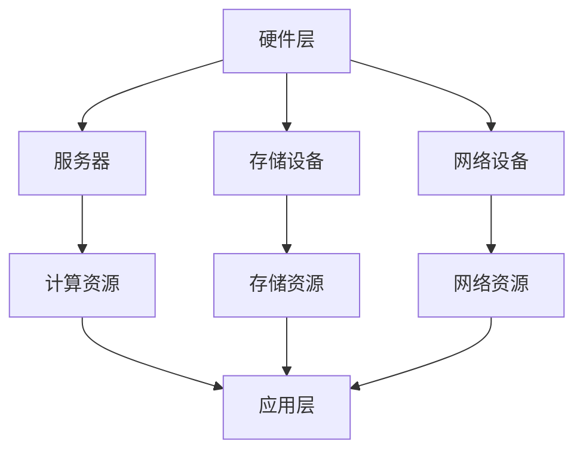

                 

# AI 大模型应用数据中心建设：数据中心技术与应用

> **关键词：** AI 大模型，数据中心，技术架构，应用场景，开发工具，未来趋势

> **摘要：** 本文从背景介绍、核心概念与联系、核心算法原理、数学模型、项目实战、实际应用场景、工具和资源推荐等方面，深入探讨了 AI 大模型应用数据中心的建设及其关键技术与应用。通过详细的分析和案例讲解，旨在为广大读者提供一份全面的技术指南，以应对未来 AI 大模型数据中心建设和发展中的挑战。

## 1. 背景介绍

随着人工智能技术的飞速发展，尤其是深度学习算法的突破，AI 大模型（如 GPT、BERT 等）在自然语言处理、图像识别、语音识别等领域取得了显著的成果。这些大模型通常具有千亿级参数，对计算资源和存储资源的需求极高。因此，数据中心作为支撑 AI 大模型训练与推理的重要基础设施，其技术架构和性能优化成为了当前研究的热点。

数据中心的建设涉及多个技术领域，包括硬件设备、网络架构、数据存储、安全防护等。同时，AI 大模型的引入对数据中心提出了更高的性能和可扩展性要求。本文将围绕 AI 大模型应用数据中心的建设，详细探讨其关键技术与应用。

## 2. 核心概念与联系

### 2.1 数据中心技术架构

数据中心的整体架构可以分为三个层次：硬件层、网络层和应用层。

#### 硬件层

硬件层包括服务器、存储设备、网络设备等。其中，服务器是数据中心的核心计算单元，通常采用高性能、高可靠性的服务器设备。存储设备则负责存储海量数据，包括关系型数据库、NoSQL 数据库、分布式文件系统等。网络设备则负责数据传输和通信，实现数据中心内各设备之间的互联互通。

#### 网络层

网络层主要包括局域网（LAN）和广域网（WAN）。局域网主要负责数据中心内部的数据传输，而广域网则负责数据中心之间的数据传输。随着数据中心规模的扩大，网络架构需要具备高可用性、高带宽和低延迟的特点。

#### 应用层

应用层是数据中心的最高层次，包括各类业务应用、大数据处理和分析等。AI 大模型的训练和推理是应用层的关键任务，对数据中心的计算、存储和网络资源提出了极高的要求。

### 2.2 数据中心技术联系

数据中心技术之间存在着密切的联系和相互影响。

- 硬件层的性能和可靠性直接影响数据中心的整体性能和稳定性。高性能服务器、大容量存储设备和高速网络设备是数据中心建设的基石。
- 网络层的性能和稳定性对数据中心的业务应用具有重要影响。高带宽、低延迟的网络架构可以提高数据传输效率，降低数据中心的通信成本。
- 应用层对数据中心的计算、存储和网络资源有较高的需求，需要根据实际业务需求进行合理配置和优化。同时，应用层的性能优化也有助于提升数据中心的整体性能。

### 2.3 Mermaid 流程图

下面是一个简化的数据中心技术架构的 Mermaid 流程图：



## 3. 核心算法原理 & 具体操作步骤

### 3.1 AI 大模型训练算法

AI 大模型的核心算法主要包括深度学习算法、神经网络算法和优化算法。

#### 3.1.1 深度学习算法

深度学习算法是 AI 大模型训练的基础，主要包括卷积神经网络（CNN）、循环神经网络（RNN）和变换器（Transformer）等。其中，Transformer 算法因其出色的性能和可扩展性，成为当前 AI 大模型的主流选择。

#### 3.1.2 神经网络算法

神经网络算法是深度学习算法的核心，主要包括前向传播、反向传播和权重更新等步骤。

1. 前向传播：将输入数据通过神经网络进行计算，得到输出结果。
2. 反向传播：计算输出结果与真实标签之间的误差，然后通过误差反向传播到网络中的每个神经元，计算每个神经元的误差。
3. 权重更新：根据误差对网络中的权重进行更新，以减少误差。

#### 3.1.3 优化算法

优化算法用于调整神经网络中的权重，以优化模型性能。常用的优化算法包括随机梯度下降（SGD）、Adam 算法和 RMSProp 算法等。

### 3.2 AI 大模型推理算法

AI 大模型推理算法主要涉及模型加载、输入数据处理和输出结果生成等步骤。

1. 模型加载：将训练好的模型加载到设备中，以便进行推理。
2. 输入数据处理：对输入数据进行预处理，使其符合模型的输入要求。
3. 输出结果生成：通过模型对输入数据进行计算，生成输出结果。

## 4. 数学模型和公式 & 详细讲解 & 举例说明

### 4.1 深度学习数学模型

深度学习中的数学模型主要包括线性函数、激活函数和损失函数等。

#### 4.1.1 线性函数

线性函数是深度学习中最基本的函数，形式为：

\[ f(x) = wx + b \]

其中，\( w \) 是权重，\( x \) 是输入，\( b \) 是偏置。

#### 4.1.2 激活函数

激活函数用于将线性函数的输出转换为非线性的输出，以实现模型的非线性拟合能力。常见的激活函数包括 sigmoid、ReLU 和 tanh 等。

1. sigmoid 函数：

\[ f(x) = \frac{1}{1 + e^{-x}} \]

2. ReLU 函数：

\[ f(x) = \max(0, x) \]

3. tanh 函数：

\[ f(x) = \frac{e^x - e^{-x}}{e^x + e^{-x}} \]

#### 4.1.3 损失函数

损失函数用于衡量模型输出与真实标签之间的差距，以指导模型优化。常见的损失函数包括均方误差（MSE）和交叉熵（Cross Entropy）等。

1. 均方误差（MSE）：

\[ L = \frac{1}{2} \sum_{i=1}^{n} (y_i - \hat{y}_i)^2 \]

其中，\( y_i \) 是真实标签，\( \hat{y}_i \) 是模型输出。

2. 交叉熵（Cross Entropy）：

\[ L = -\sum_{i=1}^{n} y_i \log(\hat{y}_i) \]

其中，\( y_i \) 是真实标签，\( \hat{y}_i \) 是模型输出。

### 4.2 举例说明

假设我们有一个简单的神经网络，包含一个输入层、一个隐藏层和一个输出层。输入层有 3 个神经元，隐藏层有 2 个神经元，输出层有 1 个神经元。输入数据为 \( x = [1, 2, 3] \)，真实标签为 \( y = 1 \)。

1. 输入层到隐藏层的计算：

\[ f_1(x_1) = w_{11}x_1 + b_1 = 2 \cdot 1 + 1 = 3 \]
\[ f_2(x_2) = w_{21}x_2 + b_2 = 3 \cdot 2 + 1 = 7 \]

2. 隐藏层到输出层的计算：

\[ f_3(h_1) = w_{31}h_1 + w_{32}h_2 + b_3 = 2 \cdot 3 + 3 \cdot 7 + 1 = 22 \]

3. 激活函数和损失函数的计算：

\[ \hat{y} = f_3(h_1) = \frac{1}{1 + e^{-22}} \approx 0.923 \]
\[ L = -y \log(\hat{y}) = -1 \cdot \log(0.923) \approx 0.135 \]

通过以上计算，我们可以得到模型的一次前向传播和损失函数的计算结果。

## 5. 项目实战：代码实际案例和详细解释说明

### 5.1 开发环境搭建

在本节中，我们将介绍如何搭建一个基于 PyTorch 的 AI 大模型训练环境。以下是开发环境的搭建步骤：

1. 安装 Python：

```bash
$ sudo apt-get update
$ sudo apt-get install python3-pip
```

2. 安装 PyTorch：

```bash
$ pip3 install torch torchvision
```

3. 安装必要的数据处理库：

```bash
$ pip3 install numpy pandas scikit-learn
```

### 5.2 源代码详细实现和代码解读

下面是一个简单的 AI 大模型训练代码示例，用于分类任务。我们将使用 PyTorch 库实现一个基于 Transformer 算法的分类模型。

```python
import torch
import torch.nn as nn
import torch.optim as optim
from torch.utils.data import DataLoader
from torchvision import datasets, transforms

# 定义模型结构
class TransformerModel(nn.Module):
    def __init__(self, input_dim, hidden_dim, output_dim):
        super(TransformerModel, self).__init__()
        self.embedding = nn.Embedding(input_dim, hidden_dim)
        self.transformer = nn.Transformer(hidden_dim, hidden_dim)
        self.fc = nn.Linear(hidden_dim, output_dim)
    
    def forward(self, x):
        x = self.embedding(x)
        x = self.transformer(x)
        x = self.fc(x)
        return x

# 加载数据集
transform = transforms.Compose([transforms.ToTensor()])
train_data = datasets.MNIST('data', train=True, download=True, transform=transform)
test_data = datasets.MNIST('data', train=False, download=True, transform=transform)

train_loader = DataLoader(train_data, batch_size=64, shuffle=True)
test_loader = DataLoader(test_data, batch_size=64, shuffle=False)

# 初始化模型、损失函数和优化器
model = TransformerModel(10, 128, 10)
criterion = nn.CrossEntropyLoss()
optimizer = optim.Adam(model.parameters(), lr=0.001)

# 训练模型
num_epochs = 10
for epoch in range(num_epochs):
    for i, (inputs, labels) in enumerate(train_loader):
        inputs, labels = inputs.to(device), labels.to(device)
        
        # 前向传播
        outputs = model(inputs)
        loss = criterion(outputs, labels)
        
        # 反向传播和优化
        optimizer.zero_grad()
        loss.backward()
        optimizer.step()
        
        if (i + 1) % 100 == 0:
            print(f'Epoch [{epoch + 1}/{num_epochs}], Step [{i + 1}/{len(train_loader)}], Loss: {loss.item()}')

# 测试模型
model.eval()
with torch.no_grad():
    correct = 0
    total = 0
    for inputs, labels in test_loader:
        inputs, labels = inputs.to(device), labels.to(device)
        outputs = model(inputs)
        _, predicted = torch.max(outputs.data, 1)
        total += labels.size(0)
        correct += (predicted == labels).sum().item()

print(f'Accuracy of the network on the test images: {100 * correct / total}%')
```

### 5.3 代码解读与分析

1. **模型定义**：

   ```python
   class TransformerModel(nn.Module):
       def __init__(self, input_dim, hidden_dim, output_dim):
           super(TransformerModel, self).__init__()
           self.embedding = nn.Embedding(input_dim, hidden_dim)
           self.transformer = nn.Transformer(hidden_dim, hidden_dim)
           self.fc = nn.Linear(hidden_dim, output_dim)
       
       def forward(self, x):
           x = self.embedding(x)
           x = self.transformer(x)
           x = self.fc(x)
           return x
   ```

   该部分定义了一个基于 Transformer 算法的分类模型。模型由嵌入层、Transformer 层和全连接层组成。

2. **数据加载**：

   ```python
   transform = transforms.Compose([transforms.ToTensor()])
   train_data = datasets.MNIST('data', train=True, download=True, transform=transform)
   test_data = datasets.MNIST('data', train=False, download=True, transform=transform)
   
   train_loader = DataLoader(train_data, batch_size=64, shuffle=True)
   test_loader = DataLoader(test_data, batch_size=64, shuffle=False)
   ```

   使用 torchvision 库加载 MNIST 数据集，并进行数据预处理。

3. **模型初始化**：

   ```python
   model = TransformerModel(10, 128, 10)
   criterion = nn.CrossEntropyLoss()
   optimizer = optim.Adam(model.parameters(), lr=0.001)
   ```

   初始化模型、损失函数和优化器。

4. **训练模型**：

   ```python
   num_epochs = 10
   for epoch in range(num_epochs):
       for i, (inputs, labels) in enumerate(train_loader):
           inputs, labels = inputs.to(device), labels.to(device)
           
           # 前向传播
           outputs = model(inputs)
           loss = criterion(outputs, labels)
           
           # 反向传播和优化
           optimizer.zero_grad()
           loss.backward()
           optimizer.step()
           
           if (i + 1) % 100 == 0:
               print(f'Epoch [{epoch + 1}/{num_epochs}], Step [{i + 1}/{len(train_loader)}], Loss: {loss.item()}')
   ```

   进行模型训练，包括前向传播、损失计算、反向传播和优化。

5. **测试模型**：

   ```python
   model.eval()
   with torch.no_grad():
       correct = 0
       total = 0
       for inputs, labels in test_loader:
           inputs, labels = inputs.to(device), labels.to(device)
           outputs = model(inputs)
           _, predicted = torch.max(outputs.data, 1)
           total += labels.size(0)
           correct += (predicted == labels).sum().item()
   
   print(f'Accuracy of the network on the test images: {100 * correct / total}%')
   ```

   对模型进行测试，计算准确率。

## 6. 实际应用场景

AI 大模型在数据中心的应用场景非常广泛，以下是一些典型的应用案例：

1. **自然语言处理**：AI 大模型在自然语言处理领域具有强大的能力，可以用于文本分类、情感分析、机器翻译等任务。数据中心需要提供高性能的计算和存储资源，以满足大规模数据处理的计算需求。

2. **图像识别**：AI 大模型在图像识别领域取得了显著的成果，可以用于目标检测、图像分类等任务。数据中心需要提供高速网络和大量计算资源，以支持实时图像处理和模型推理。

3. **语音识别**：AI 大模型在语音识别领域具有出色的性能，可以用于语音合成、语音识别等任务。数据中心需要提供低延迟、高带宽的网络环境，以满足实时语音处理的需求。

4. **推荐系统**：AI 大模型在推荐系统领域可以用于用户画像、商品推荐等任务。数据中心需要提供强大的计算和存储能力，以支持海量数据的实时处理和推荐。

## 7. 工具和资源推荐

### 7.1 学习资源推荐

1. **书籍**：

   - 《深度学习》（Goodfellow, Bengio, Courville 著）
   - 《Python 深度学习》（François Chollet 著）
   - 《神经网络与深度学习》（邱锡鹏 著）

2. **论文**：

   - “Attention Is All You Need”（Vaswani et al., 2017）
   - “Gated Recurrent Unit”（Hochreiter and Schmidhuber, 1997）
   - “A Theoretical Analysis of the VGG Network”（Simonyan and Zisserman, 2014）

3. **博客**：

   - [PyTorch 官方文档](https://pytorch.org/docs/stable/index.html)
   - [TensorFlow 官方文档](https://www.tensorflow.org/api_docs/python/tf)
   - [机器学习博客](https://机器学习博客.com)

4. **网站**：

   - [Kaggle](https://www.kaggle.com/)
   - [GitHub](https://github.com/)
   - [机器之心](https://www.jiqizhixin.com/)

### 7.2 开发工具框架推荐

1. **编程语言**：Python
2. **深度学习框架**：PyTorch、TensorFlow
3. **版本控制工具**：Git
4. **代码调试工具**：PyCharm、VS Code
5. **数据可视化工具**：Matplotlib、Seaborn

### 7.3 相关论文著作推荐

1. **《深度学习》（Goodfellow, Bengio, Courville 著）**：全面介绍了深度学习的基本原理、算法和应用，是深度学习领域的经典著作。
2. **《Python 深度学习》（François Chollet 著）**：结合了深度学习和 Python 编程的实际应用，适合初学者和有经验的开发者。
3. **《神经网络与深度学习》（邱锡鹏 著）**：从数学和计算机科学的角度，深入讲解了神经网络和深度学习的基本原理，适用于学术研究和工程实践。

## 8. 总结：未来发展趋势与挑战

随着 AI 大模型技术的不断发展，数据中心建设在未来将面临以下发展趋势与挑战：

1. **计算能力提升**：随着 AI 大模型参数规模的扩大，数据中心需要不断提升计算能力，以满足模型训练和推理的需求。未来，高性能 GPU、TPU 等硬件设备将逐渐成为数据中心的核心计算资源。
2. **网络带宽优化**：为了支持实时数据传输和模型推理，数据中心需要优化网络带宽，降低数据传输延迟。未来，高速网络技术、边缘计算等技术的发展将为数据中心提供更好的网络支持。
3. **数据存储与处理**：AI 大模型对数据存储和处理的需求日益增长，数据中心需要提供高效、可靠的数据存储和处理方案。未来，分布式存储、大数据处理技术等将得到广泛应用。
4. **安全与隐私**：随着数据中心的规模不断扩大，数据安全和隐私保护成为数据中心建设的重要挑战。未来，安全加密技术、隐私保护算法等将得到更多关注。
5. **能耗管理**：数据中心的高能耗问题日益突出，未来需要通过节能技术、绿色能源等方式降低数据中心能耗，实现可持续发展。

总之，未来数据中心建设将围绕计算能力、网络带宽、数据存储与处理、安全与隐私、能耗管理等方面进行优化和升级，以支撑 AI 大模型的应用和发展。

## 9. 附录：常见问题与解答

### 9.1 数据中心建设中的关键技术有哪些？

数据中心建设中的关键技术包括：

- 高性能服务器和存储设备选型
- 网络架构设计和优化
- 数据存储和数据处理技术
- 数据中心安全管理
- 数据中心能耗管理

### 9.2 AI 大模型训练对数据中心有什么要求？

AI 大模型训练对数据中心的主要要求包括：

- 高性能计算资源：满足大规模模型训练的运算需求
- 大容量存储资源：存储海量训练数据和模型参数
- 高速网络：支持实时数据传输和模型推理
- 稳定的运行环境：确保数据中心稳定运行，减少停机时间
- 安全保障：保护数据安全和隐私

### 9.3 如何优化数据中心性能？

优化数据中心性能的方法包括：

- 服务器和存储设备性能提升：升级硬件设备，提高计算和存储性能
- 网络带宽优化：采用高速网络技术，降低数据传输延迟
- 资源调度与管理：合理分配计算、存储和网络资源，提高资源利用率
- 节能技术：采用绿色能源、节能设备等技术，降低数据中心能耗
- 安全防护：加强数据中心安全防护，防止数据泄露和攻击

## 10. 扩展阅读 & 参考资料

- [AI 大模型应用数据中心建设：概述与展望](https://www.jiqizhixin.com/articles/2021-08-02-9)
- [深度学习在数据中心中的应用](https://www.bilibili.com/video/BV1jz4y1d7W5)
- [数据中心技术趋势与挑战](https://www.cnblogs.com/skywang12345/p/10433883.html)
- [高性能数据中心设计原则](https://www.microsoft.com/zh-cn/research/publication/high-performance-datacenter-design-principles/)

