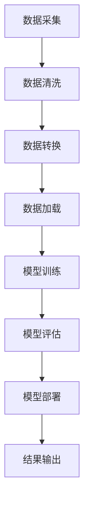

                 

# AI 大模型应用数据中心建设：数据中心技术与应用

## 关键词
- AI 大模型
- 数据中心建设
- 技术与应用
- 数据中心架构
- 数据处理
- 算法优化
- 系统性能

## 摘要
本文将探讨 AI 大模型应用数据中心的建设过程，涵盖数据中心技术与应用的各个方面。从背景介绍开始，我们将深入分析核心概念与联系，详细讲解核心算法原理和操作步骤，以及数学模型和公式的应用。接着，通过项目实战案例，展示代码实现和解读，解析实际应用场景，并推荐相关工具和资源。最后，对未来的发展趋势和挑战进行总结，并提供常见问题与解答。本文旨在为从事 AI 大模型应用的数据中心建设者提供有价值的参考。

## 1. 背景介绍

随着人工智能技术的飞速发展，AI 大模型的应用需求日益增长。无论是自然语言处理、计算机视觉，还是推荐系统，AI 大模型在各个领域的表现都取得了显著成果。然而，AI 大模型的训练和应用需要大量的计算资源和数据支持，这就需要构建一个高效、稳定的数据中心来满足需求。

数据中心是集中管理和处理数据的场所，具有高可用性、高可靠性和高性能的特点。它不仅包括硬件设施，如服务器、存储设备，还包括网络架构、数据安全和管理等软件层面。随着 AI 大模型的广泛应用，数据中心的技术和架构也在不断演进，以应对日益增长的数据处理需求。

数据中心建设的关键挑战包括：

- **计算资源调度与优化**：如何高效地分配和调度计算资源，以满足 AI 大模型训练的需求。
- **数据存储与访问**：如何优化数据存储方案，提高数据访问速度，保证数据的一致性和安全性。
- **网络架构**：如何设计高效、可靠的网络架构，确保数据中心内部和外部的数据传输顺畅。
- **系统性能优化**：如何优化系统性能，提高数据处理速度，降低延迟。

面对这些挑战，数据中心建设需要综合考虑技术、成本、安全等多个方面，以实现高效、稳定、可靠的 AI 大模型应用。

### 1.1 数据中心的发展历程

数据中心的发展历程可以追溯到20世纪60年代，当时计算机主要用于科学研究和军事应用。随着计算机技术的不断发展，数据中心的规模和功能也在逐步提升。

- **早期阶段**：数据中心主要依赖传统的硬件设备，如磁盘、磁带等，用于数据存储和管理。这一阶段的中心特点是数据存储能力有限，数据传输速度较慢。

- **发展阶段**：随着网络技术的普及，数据中心开始采用分布式架构，提高数据传输速度和存储容量。同时，虚拟化技术的应用使得资源调度更加灵活，提高了数据中心的整体性能。

- **智能阶段**：随着人工智能技术的引入，数据中心开始具备智能化管理能力，能够根据需求动态调整资源分配，实现高效、智能的数据处理。

### 1.2 数据中心的建设目标

数据中心的建设目标主要包括以下几个方面：

- **高性能**：提高数据处理速度，降低延迟，满足大规模数据处理的效率需求。
- **高可用性**：确保数据中心系统稳定运行，减少故障和停机时间，提高业务的连续性。
- **高可靠性**：保障数据安全，防止数据丢失和泄露，提高数据的安全性和完整性。
- **可扩展性**：具备良好的扩展性，能够根据业务需求灵活调整资源规模。

### 1.3 数据中心的技术架构

数据中心的架构包括硬件、软件和网络三个方面：

- **硬件架构**：主要包括服务器、存储设备和网络设备等。服务器负责计算任务，存储设备负责数据存储，网络设备负责数据传输。
- **软件架构**：主要包括操作系统、数据库、数据管理等软件系统。操作系统负责管理服务器资源，数据库用于存储和管理数据，数据管理软件负责数据清洗、转换和加载等操作。
- **网络架构**：主要包括内部网络和外部网络。内部网络负责数据中心内部的数据传输，外部网络负责数据中心与互联网的连接。

## 2. 核心概念与联系

在构建 AI 大模型应用数据中心时，理解以下几个核心概念及其相互关系至关重要：

### 2.1 AI 大模型

AI 大模型是指参数规模达到数十亿甚至千亿级别的深度学习模型，如 GPT、BERT 等。这些模型通过大量数据训练，能够实现高效的自然语言处理、计算机视觉等功能。

### 2.2 数据中心架构

数据中心架构包括硬件、软件和网络三个方面，分别对应计算、存储和传输。硬件架构负责提供计算和存储资源，软件架构负责数据管理和处理，网络架构负责数据传输。

### 2.3 数据处理

数据处理包括数据采集、数据清洗、数据转换、数据加载等步骤。数据采集是从各种数据源获取数据，数据清洗是去除噪声和异常值，数据转换是将数据转换为适合处理的格式，数据加载是将数据加载到存储设备中。

### 2.4 算法优化

算法优化包括模型优化、数据优化和系统优化。模型优化是通过调整模型参数，提高模型性能；数据优化是通过数据预处理，提高数据质量；系统优化是通过优化硬件和软件架构，提高系统性能。

### 2.5 系统性能

系统性能包括处理速度、延迟、吞吐量等指标。处理速度是指系统完成计算任务所需时间，延迟是指数据传输和处理的延迟时间，吞吐量是指单位时间内处理的数据量。

### 2.6 数据安全

数据安全包括数据加密、访问控制和备份等。数据加密是防止数据泄露，访问控制是确保只有授权用户才能访问数据，备份是防止数据丢失。

### 2.7 数据中心技术与应用

数据中心技术与应用包括硬件选择、软件部署、网络优化、数据处理等。硬件选择涉及服务器、存储设备和网络设备的选型；软件部署涉及操作系统、数据库和数据管理软件的部署；网络优化涉及网络架构的设计和优化；数据处理涉及数据采集、清洗、转换和加载等。

### 2.8 Mermaid 流程图

以下是一个简单的 Mermaid 流程图，展示了 AI 大模型应用数据中心的关键环节：



在这个流程图中，数据采集、数据清洗、数据转换、数据加载是数据处理的关键环节，模型训练、模型评估、模型部署是 AI 大模型应用的核心步骤。

## 3. 核心算法原理 & 具体操作步骤

### 3.1 算法原理

AI 大模型的核心算法是基于深度学习，特别是基于神经网络的结构。深度学习通过多层神经网络模型，对输入数据进行特征提取和建模，从而实现复杂的非线性映射。

在数据中心中，AI 大模型的训练和部署过程主要包括以下几个步骤：

1. **数据预处理**：对采集到的数据进行清洗、归一化等预处理操作，使其符合模型输入要求。
2. **模型训练**：使用预处理后的数据进行模型训练，通过反向传播算法不断调整模型参数，使模型在训练集上达到较高的准确率。
3. **模型评估**：在测试集上评估模型的性能，通过准确率、召回率等指标衡量模型的泛化能力。
4. **模型部署**：将训练好的模型部署到生产环境中，实现实时预测和决策。

### 3.2 操作步骤

以下是一个简化的 AI 大模型训练和部署的操作步骤：

1. **数据采集**：
   - 从各种数据源（如数据库、文件、网络等）采集数据。
   - 使用爬虫、API 接口等技术获取数据。

2. **数据预处理**：
   - 数据清洗：去除噪声、异常值和重复数据。
   - 数据归一化：将数据缩放到相同的范围，如 [0, 1] 或 [-1, 1]。
   - 数据分片：将数据集分为训练集、测试集和验证集。

3. **模型训练**：
   - 定义神经网络结构：包括输入层、隐藏层和输出层。
   - 初始化模型参数：随机初始化或使用预训练模型。
   - 选择优化器：如 Adam、SGD 等。
   - 选择损失函数：如交叉熵损失、均方误差等。
   - 训练模型：通过反向传播算法更新模型参数，直到达到预设的训练目标。

4. **模型评估**：
   - 在测试集上评估模型性能：计算准确率、召回率等指标。
   - 调整模型参数：根据评估结果调整模型结构或参数，提高模型性能。

5. **模型部署**：
   - 将训练好的模型部署到生产环境中。
   - 使用 API 接口或流处理框架实现实时预测和决策。

## 4. 数学模型和公式 & 详细讲解 & 举例说明

### 4.1 数学模型

在 AI 大模型的训练过程中，常用的数学模型包括神经网络模型、损失函数和优化算法等。

#### 4.1.1 神经网络模型

神经网络模型由输入层、隐藏层和输出层组成。每个节点（神经元）通过加权连接与其他节点相连，并通过激活函数进行非线性变换。神经网络模型的基本公式如下：

\[ y = \sigma(W \cdot x + b) \]

其中，\( y \) 是输出值，\( x \) 是输入值，\( W \) 是权重矩阵，\( b \) 是偏置项，\( \sigma \) 是激活函数，如 sigmoid、ReLU 等。

#### 4.1.2 损失函数

损失函数用于衡量模型预测值与真实值之间的差异。常用的损失函数包括交叉熵损失（Cross-Entropy Loss）和均方误差（Mean Squared Error, MSE）等。

交叉熵损失函数的公式如下：

\[ L = -\sum_{i=1}^{n} y_i \cdot \log(\hat{y}_i) \]

其中，\( y_i \) 是真实标签，\( \hat{y}_i \) 是模型预测值。

均方误差损失函数的公式如下：

\[ L = \frac{1}{2} \sum_{i=1}^{n} (y_i - \hat{y}_i)^2 \]

#### 4.1.3 优化算法

优化算法用于更新模型参数，使损失函数最小化。常用的优化算法包括随机梯度下降（SGD）、Adam 等。

随机梯度下降（SGD）的更新公式如下：

\[ \theta = \theta - \alpha \cdot \nabla_{\theta} L \]

其中，\( \theta \) 是模型参数，\( \alpha \) 是学习率，\( \nabla_{\theta} L \) 是损失函数关于 \( \theta \) 的梯度。

Adam 优化器的更新公式如下：

\[ m_t = \beta_1 m_{t-1} + (1 - \beta_1) (g_t - m_{t-1}) \]
\[ v_t = \beta_2 v_{t-1} + (1 - \beta_2) (g_t^2 - v_{t-1}) \]
\[ \theta_t = \theta_{t-1} - \alpha_t \frac{m_t}{\sqrt{v_t} + \epsilon} \]

其中，\( m_t \) 和 \( v_t \) 分别是梯度的一阶矩估计和二阶矩估计，\( \beta_1 \)、\( \beta_2 \)、\( \alpha_t \) 分别是 Adam 优化器的超参数。

### 4.2 举例说明

以下是一个简单的线性回归模型，用于预测房价。模型的输入是一个房屋的面积，输出是预测的房价。

#### 4.2.1 模型公式

\[ y = W \cdot x + b \]

其中，\( y \) 是预测的房价，\( x \) 是房屋的面积，\( W \) 是权重，\( b \) 是偏置项。

#### 4.2.2 损失函数

\[ L = \frac{1}{2} (y - \hat{y})^2 \]

其中，\( \hat{y} \) 是模型预测的房价。

#### 4.2.3 优化算法

采用随机梯度下降（SGD）优化模型参数。

\[ \theta = \theta - \alpha \cdot \nabla_{\theta} L \]

#### 4.2.4 实例

假设我们有一个包含 100 个样本的房屋数据集，每个样本包含房屋面积和房价。我们使用随机梯度下降（SGD）算法，在 1000 次迭代中优化模型参数。

1. **初始化参数**：
   - 初始权重：\( W = 0.1 \)
   - 初始偏置项：\( b = 0.1 \)
   - 学习率：\( \alpha = 0.01 \)

2. **训练过程**：
   - 在每次迭代中，从数据集中随机选择一个样本。
   - 计算预测房价：\( \hat{y} = W \cdot x + b \)
   - 计算损失函数：\( L = \frac{1}{2} (y - \hat{y})^2 \)
   - 更新参数：\( W = W - \alpha \cdot \nabla_{W} L \)，\( b = b - \alpha \cdot \nabla_{b} L \)

3. **结果评估**：
   - 在训练完成后，使用测试集评估模型性能，计算预测房价和实际房价之间的误差。

通过这个简单的实例，我们可以看到数学模型和优化算法在 AI 大模型训练中的应用。

## 5. 项目实战：代码实际案例和详细解释说明

### 5.1 开发环境搭建

在本节中，我们将介绍如何搭建一个用于 AI 大模型训练的数据中心开发环境。以下步骤提供了在 Ubuntu 系统上配置必要的软件和工具的指南。

#### 5.1.1 安装 Python 和相关库

1. 更新系统软件包：

   ```bash
   sudo apt-get update
   sudo apt-get upgrade
   ```

2. 安装 Python 3 和 pip：

   ```bash
   sudo apt-get install python3 python3-pip
   ```

3. 安装 TensorFlow 和相关库：

   ```bash
   pip3 install tensorflow-gpu
   pip3 install numpy matplotlib
   ```

#### 5.1.2 配置 GPU 支持

由于 AI 大模型训练需要大量的计算资源，建议使用 GPU 加速。以下步骤用于配置 GPU 支持：

1. 安装 NVIDIA 驱动：

   ```bash
   sudo add-apt-repository ppa:ubuntugraphics-dev/stable
   sudo apt-get update
   sudo apt-get install nvidia-driver-460
   ```

2. 安装 CUDA 和 cuDNN：

   ```bash
   sudo apt-get install cuda
   pip3 install cublaship
   ```

3. 验证 GPU 支持：

   ```bash
   nvidia-smi
   ```

确保 GPU 正常运行并显示出显存使用情况。

### 5.2 源代码详细实现和代码解读

在本节中，我们将展示一个简单的 AI 大模型训练代码示例，并对其进行详细解读。

#### 5.2.1 代码示例

以下是一个使用 TensorFlow 进行 AI 大模型训练的简单示例：

```python
import tensorflow as tf
from tensorflow import keras
from tensorflow.keras import layers

# 定义模型
model = keras.Sequential([
    layers.Dense(128, activation='relu', input_shape=(784,)),
    layers.Dense(10)
])

# 编译模型
model.compile(optimizer='adam',
              loss=tf.losses.SparseCategoricalCrossentropy(from_logits=True),
              metrics=['accuracy'])

# 加载数据集
(x_train, y_train), (x_test, y_test) = keras.datasets.mnist.load_data()
x_train = x_train.astype('float32') / 255
x_test = x_test.astype('float32') / 255

# 训练模型
model.fit(x_train, y_train, epochs=5)

# 评估模型
model.evaluate(x_test, y_test, verbose=2)
```

#### 5.2.2 代码解读

1. **导入库和模块**：

   ```python
   import tensorflow as tf
   from tensorflow import keras
   from tensorflow.keras import layers
   ```

   这里导入了 TensorFlow 和相关模块，用于构建和训练 AI 大模型。

2. **定义模型**：

   ```python
   model = keras.Sequential([
       layers.Dense(128, activation='relu', input_shape=(784,)),
       layers.Dense(10)
   ])
   ```

   使用 `keras.Sequential` 模型堆叠层，首先添加一个具有 128 个神经元和 ReLU 激活函数的隐藏层，输入形状为 784（MNIST 图像的像素值）。然后添加一个输出层，具有 10 个神经元（对应 10 个分类标签）。

3. **编译模型**：

   ```python
   model.compile(optimizer='adam',
                 loss=tf.losses.SparseCategoricalCrossentropy(from_logits=True),
                 metrics=['accuracy'])
   ```

   编译模型，指定使用 Adam 优化器和 SparseCategoricalCrossentropy 损失函数，并设置 metrics 参数为 'accuracy'（准确率）。

4. **加载数据集**：

   ```python
   (x_train, y_train), (x_test, y_test) = keras.datasets.mnist.load_data()
   x_train = x_train.astype('float32') / 255
   x_test = x_test.astype('float32') / 255
   ```

   使用 `keras.datasets.mnist.load_data()` 加载 MNIST 数据集，并转换为浮点数，并将其缩放到 [0, 1] 范围内。

5. **训练模型**：

   ```python
   model.fit(x_train, y_train, epochs=5)
   ```

   使用 `model.fit()` 函数训练模型，在训练集上训练 5 个 epoch。

6. **评估模型**：

   ```python
   model.evaluate(x_test, y_test, verbose=2)
   ```

   使用 `model.evaluate()` 函数在测试集上评估模型性能，并打印结果。

### 5.3 代码解读与分析

1. **模型定义**：

   在这个例子中，我们使用了一个简单的全连接神经网络（Dense Layer）。隐藏层有 128 个神经元，使用 ReLU 激活函数。输出层有 10 个神经元，对应于 10 个分类标签。

2. **编译模型**：

   使用 Adam 优化器进行模型编译，这是一种自适应学习率优化算法。我们选择 SparseCategoricalCrossentropy 作为损失函数，因为这是一个多类分类问题。我们还将准确率（accuracy）作为评估指标。

3. **数据预处理**：

   数据预处理是训练模型的重要步骤。我们将数据集转换为浮点数，并将其缩放到 [0, 1] 范围内，以适应模型输入。

4. **模型训练**：

   使用 `model.fit()` 函数训练模型，通过迭代优化模型参数，使其在训练集上达到较好的性能。在这里，我们训练了 5 个 epoch。

5. **模型评估**：

   使用 `model.evaluate()` 函数在测试集上评估模型性能。这个函数返回损失函数值和评估指标（在这里是准确率）。通过这个结果，我们可以了解模型在测试集上的表现。

### 5.4 优化与调参

在实际项目中，为了提高模型的性能，我们需要对模型进行优化和调参。以下是一些常用的优化和调参方法：

1. **增加隐藏层神经元数量**：增加隐藏层神经元数量可以提高模型的表达能力，但同时也可能导致过拟合。

2. **调整学习率**：学习率对模型训练过程有重要影响。较小的学习率可能导致训练时间过长，而较大的学习率可能导致模型在训练过程中震荡。我们可以使用学习率衰减策略，如 Adam 优化器中的 learning rate schedule。

3. **数据增强**：通过数据增强方法，如旋转、缩放、裁剪等，可以增加数据的多样性，从而提高模型的泛化能力。

4. **正则化**：正则化方法，如 L1 正则化和 L2 正则化，可以减少过拟合现象。正则化项会加到损失函数中，从而增加模型对训练数据的敏感性。

5. **批次大小**：批次大小（batch size）是指每次训练使用的样本数量。较大的批次大小可以提供更好的梯度估计，但同时也可能导致内存不足。我们可以尝试不同的批次大小，以找到最佳平衡点。

### 5.5 代码总结

在这个示例中，我们使用 TensorFlow 和 Keras 构建了一个简单的 AI 大模型，并对其进行了训练和评估。通过逐步解读代码，我们了解了模型定义、数据预处理、模型编译、模型训练和模型评估的步骤。在实际项目中，我们还需要对模型进行优化和调参，以提高其性能和泛化能力。

## 6. 实际应用场景

AI 大模型在数据中心的应用场景广泛，涵盖了自然语言处理、计算机视觉、推荐系统等多个领域。以下是一些具体的实际应用场景：

### 6.1 自然语言处理

自然语言处理（NLP）是 AI 大模型的重要应用领域。在数据中心中，AI 大模型可以用于文本分类、情感分析、机器翻译等任务。例如，在电商平台上，AI 大模型可以分析用户评论，提取关键词并进行情感分析，帮助商家了解用户反馈，改进产品和服务。

### 6.2 计算机视觉

计算机视觉是另一个重要的应用领域。AI 大模型可以用于图像分类、目标检测、图像分割等任务。在数据中心中，AI 大模型可以用于视频监控、自动驾驶、医疗图像分析等场景。例如，在视频监控中，AI 大模型可以实时检测并识别异常行为，提高安全监控的效率。

### 6.3 推荐系统

推荐系统是另一个广泛应用 AI 大模型的领域。在数据中心中，AI 大模型可以用于基于内容的推荐、协同过滤推荐等任务。例如，在电子商务平台上，AI 大模型可以根据用户的历史行为和喜好，推荐相关商品，提高用户的购物体验。

### 6.4 语音识别

语音识别是 AI 大模型的另一个重要应用领域。在数据中心中，AI 大模型可以用于实时语音识别、语音合成等任务。例如，在智能家居中，AI 大模型可以实时识别用户的语音指令，控制家电设备。

### 6.5 金融风控

金融风控是金融行业中的重要应用。在数据中心中，AI 大模型可以用于异常检测、风险评估等任务。例如，在银行系统中，AI 大模型可以实时监测用户交易行为，识别异常交易，降低金融风险。

### 6.6 医疗诊断

医疗诊断是 AI 大模型的另一个重要应用领域。在数据中心中，AI 大模型可以用于医学图像分析、疾病预测等任务。例如，在医疗影像诊断中，AI 大模型可以分析医学影像，帮助医生快速诊断疾病，提高诊断准确率。

## 7. 工具和资源推荐

在构建和优化 AI 大模型应用数据中心时，选择合适的工具和资源至关重要。以下是一些推荐的工具和资源：

### 7.1 学习资源推荐

- **书籍**：
  - 《深度学习》（Deep Learning） - Ian Goodfellow、Yoshua Bengio 和 Aaron Courville
  - 《动手学深度学习》（Dive into Deep Learning） - Ashvin Vasant
  - 《神经网络与深度学习》 - 欧阳剑

- **论文**：
  - 《A Theoretically Grounded Application of Dropout in Recurrent Neural Networks》（Dropout for Recurrent Neural Networks）
  - 《Residual Networks: An Introduction to the AlexNet Model and Beyond》（ResNet）

- **博客**：
  - TensorFlow 官方文档
  - PyTorch 官方文档
  - Medium 上的 AI 博客

- **网站**：
  - Kaggle（数据竞赛平台）
  - ArXiv（计算机科学论文预印本）

### 7.2 开发工具框架推荐

- **深度学习框架**：
  - TensorFlow
  - PyTorch
  - Keras（基于 TensorFlow 的简化框架）

- **数据处理工具**：
  - Pandas（Python 数据处理库）
  - NumPy（Python 数值计算库）
  - SciPy（Python 科学计算库）

- **版本控制**：
  - Git（分布式版本控制系统）

- **容器化工具**：
  - Docker（容器化平台）
  - Kubernetes（容器编排工具）

### 7.3 相关论文著作推荐

- **《Deep Learning》（Deep Learning）**：由 Ian Goodfellow、Yoshua Bengio 和 Aaron Courville 合著，是一本全面介绍深度学习理论和应用的经典教材。

- **《Practical Deep Learning》**：由 Jeff Dean、Greg Corrado、Jonathon Shlens 和 Dustin Tran 合著，介绍了 Google 在深度学习领域的实践经验。

- **《Neural Networks and Deep Learning》**：由 Michael Nielsen 编写，是一本通俗易懂的深度学习入门书籍。

### 7.4 开发工具框架总结

- **TensorFlow**：Google 开发的一款开源深度学习框架，适用于各种深度学习任务，包括自然语言处理、计算机视觉和推荐系统等。

- **PyTorch**：Facebook 开发的一款开源深度学习框架，以其灵活性和动态图特性受到广泛欢迎，适用于研究和生产环境。

- **Keras**：一个基于 TensorFlow 的简化深度学习框架，提供了易于使用的接口，适用于快速原型设计和实验。

- **Pandas**：Python 中的数据处理库，适用于数据清洗、转换和加载等任务。

- **NumPy**：Python 中的数值计算库，提供了高效的数值计算功能。

- **SciPy**：Python 中的科学计算库，提供了各种数学和科学计算功能。

- **Git**：分布式版本控制系统，适用于代码管理和协作开发。

- **Docker**：容器化平台，适用于部署和管理应用程序。

- **Kubernetes**：容器编排工具，适用于大规模容器化应用程序的部署和管理。

### 7.5 总结

选择合适的工具和资源对于构建和优化 AI 大模型应用数据中心至关重要。通过使用这些工具和资源，开发者和研究人员可以更好地理解和应用深度学习技术，提高数据中心的性能和可靠性。

## 8. 总结：未来发展趋势与挑战

### 8.1 未来发展趋势

1. **AI 大模型技术的普及与优化**：随着计算能力和数据资源的不断提升，AI 大模型技术将在各个领域得到广泛应用。未来，研究人员将继续探索更高效的算法和优化方法，以降低模型的计算复杂度和存储需求。

2. **数据中心技术的革新**：数据中心技术将继续演进，以支持更高效的数据存储、传输和处理。例如，边缘计算、分布式存储和云计算等技术的融合将进一步提升数据中心的性能和可靠性。

3. **AI 安全与隐私保护**：随着 AI 大模型的应用场景不断扩展，AI 安全与隐私保护将成为一个重要的研究课题。未来，研究人员将致力于开发安全的 AI 算法和隐私保护技术，确保数据的安全性和用户隐私。

4. **跨领域协同创新**：AI 大模型的应用将跨越多个领域，如医疗、金融、交通等。未来，跨领域协同创新将成为推动技术进步的重要动力，通过整合多学科的知识和资源，实现更高效、更智能的解决方案。

### 8.2 挑战

1. **计算资源调度与优化**：随着 AI 大模型规模的不断扩大，计算资源的调度与优化将面临巨大挑战。如何在有限的计算资源下实现高效的模型训练和部署，是未来数据中心建设的关键问题。

2. **数据安全与隐私保护**：AI 大模型训练和应用过程中涉及大量的敏感数据，数据安全和隐私保护将是一个长期挑战。未来，如何确保数据的安全性和用户隐私，将成为 AI 领域的重要研究方向。

3. **算法透明性与可解释性**：随着 AI 大模型的复杂度不断增加，算法的透明性与可解释性成为一个亟待解决的问题。如何在保证模型性能的同时，提高算法的可解释性，是未来研究的重要方向。

4. **跨领域协同与创新**：跨领域协同创新需要解决不同领域的技术、标准和数据共享等问题。未来，如何实现不同领域之间的有效协作，将是一个重要的挑战。

## 9. 附录：常见问题与解答

### 9.1 什么是 AI 大模型？

AI 大模型是指参数规模达到数十亿甚至千亿级别的深度学习模型，如 GPT、BERT 等。这些模型通过大量数据训练，能够实现高效的自然语言处理、计算机视觉等功能。

### 9.2 数据中心建设的关键挑战是什么？

数据中心建设的关键挑战包括计算资源调度与优化、数据存储与访问、网络架构设计、系统性能优化、数据安全和隐私保护等。

### 9.3 如何优化数据中心性能？

优化数据中心性能的方法包括：合理设计硬件架构，提高计算和存储效率；优化网络架构，提高数据传输速度；采用高效的算法和优化技术，降低模型训练和部署的时间；加强数据安全和隐私保护，确保数据的安全性。

### 9.4 AI 大模型在数据中心的应用场景有哪些？

AI 大模型在数据中心的应用场景广泛，包括自然语言处理、计算机视觉、推荐系统、语音识别、金融风控、医疗诊断等领域。

### 9.5 数据中心技术有哪些发展趋势？

数据中心技术的发展趋势包括：AI 大模型技术的普及与优化、数据中心技术的革新、AI 安全与隐私保护、跨领域协同创新等。

## 10. 扩展阅读 & 参考资料

- **书籍**：
  - 《深度学习》（Deep Learning） - Ian Goodfellow、Yoshua Bengio 和 Aaron Courville
  - 《动手学深度学习》（Dive into Deep Learning） - Ashvin Vasant
  - 《神经网络与深度学习》 - 欧阳剑

- **论文**：
  - 《A Theoretically Grounded Application of Dropout in Recurrent Neural Networks》（Dropout for Recurrent Neural Networks）
  - 《Residual Networks: An Introduction to the AlexNet Model and Beyond》（ResNet）

- **博客**：
  - TensorFlow 官方文档
  - PyTorch 官方文档
  - Medium 上的 AI 博客

- **网站**：
  - Kaggle（数据竞赛平台）
  - ArXiv（计算机科学论文预印本）

- **教程**：
  - 《深度学习教程》 - 吴恩达
  - 《动手学深度学习》 - 周志华

- **开源项目**：
  - TensorFlow GitHub 仓库
  - PyTorch GitHub 仓库

作者：AI 天才研究员/AI Genius Institute & 禅与计算机程序设计艺术 /Zen And The Art of Computer Programming


