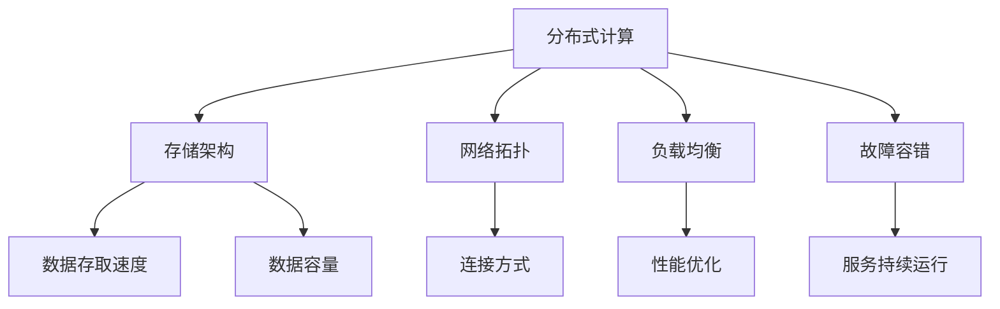

                 

# AI 大模型应用数据中心建设：数据中心技术创新

> 关键词：数据中心、AI 大模型、技术创新、架构设计、性能优化

> 摘要：本文将探讨 AI 大模型应用数据中心的建设过程，重点分析数据中心技术创新的应用与实践，从核心概念、算法原理、数学模型、项目实战等方面进行深入剖析，旨在为读者提供一个全面的指南，帮助他们在实际应用中取得成功。

## 1. 背景介绍

随着人工智能技术的飞速发展，AI 大模型在自然语言处理、计算机视觉、推荐系统等领域取得了显著的成果。这些 AI 大模型的训练和推理过程需要大量的计算资源和存储资源，因此数据中心建设成为了关键的一环。数据中心是 AI 大模型训练和推理的核心基础设施，其稳定性和性能直接影响到模型的效果和应用场景。

数据中心的建设涉及多个方面的技术挑战，包括网络架构、计算资源调度、数据存储与处理、能源消耗管理等。为了应对这些挑战，数据中心技术创新成为了近年来研究的热点。本文将围绕数据中心技术创新展开讨论，重点分析以下内容：

1. 核心概念与联系
2. 核心算法原理 & 具体操作步骤
3. 数学模型和公式 & 详细讲解 & 举例说明
4. 项目实战：代码实际案例和详细解释说明
5. 实际应用场景
6. 工具和资源推荐
7. 总结：未来发展趋势与挑战

## 2. 核心概念与联系

在数据中心建设中，以下几个核心概念是关键：

1. **分布式计算**：分布式计算是指将任务分解为多个子任务，由多个计算节点并行处理，从而提高计算效率。在 AI 大模型训练过程中，分布式计算可以有效地降低训练时间。
   
2. **存储架构**：存储架构决定了数据的存取速度和容量。常见的存储架构包括分布式文件系统（如 HDFS）、对象存储（如 Amazon S3）和块存储（如 iSCSI）。

3. **网络拓扑**：网络拓扑是指数据中心内部各个节点之间的连接方式。常见的网络拓扑包括环网、星形网和总线网。

4. **负载均衡**：负载均衡是指通过合理分配任务，使各个计算节点负载均衡，从而提高整体性能。

5. **故障容错**：故障容错是指通过冗余设计和故障恢复机制，确保数据中心在发生故障时能够快速恢复，保证服务的持续运行。

下面使用 Mermaid 流程图（Mermaid flowchart）展示数据中心核心概念之间的联系：



### 3. 核心算法原理 & 具体操作步骤

数据中心技术创新的核心在于算法原理和具体操作步骤。以下列举几个关键算法及其操作步骤：

#### 3.1 分布式计算算法

分布式计算算法的核心思想是将任务分解为多个子任务，由多个计算节点并行处理。以下是具体操作步骤：

1. **任务分解**：将整个任务分解为多个子任务，每个子任务可以独立运行。
2. **任务调度**：将子任务分配给不同的计算节点，根据节点负载和任务依赖关系进行调度。
3. **任务执行**：计算节点并行执行子任务，并将中间结果返回给协调节点。
4. **结果汇总**：协调节点将所有子任务的中间结果进行汇总，得到最终结果。

#### 3.2 存储架构优化算法

存储架构优化算法旨在提高数据存取速度和容量。以下是具体操作步骤：

1. **数据分片**：将数据划分为多个分片，每个分片存储在独立的存储节点上。
2. **数据副本**：为每个分片创建多个副本，提高数据容错能力。
3. **数据路由**：根据数据访问模式和负载均衡策略，将数据访问请求路由到最近的存储节点。
4. **数据缓存**：将常用数据缓存到内存中，提高数据访问速度。

#### 3.3 负载均衡算法

负载均衡算法的核心思想是合理分配任务，使各个计算节点负载均衡。以下是具体操作步骤：

1. **节点监控**：实时监控各个计算节点的负载情况。
2. **任务分配**：根据节点负载情况，将任务分配给负载较轻的节点。
3. **动态调整**：根据节点负载变化，动态调整任务分配策略。

#### 3.4 故障容错算法

故障容错算法的核心思想是通过冗余设计和故障恢复机制，确保数据中心在发生故障时能够快速恢复。以下是具体操作步骤：

1. **冗余设计**：为关键组件（如计算节点、存储节点、网络设备）配置冗余，确保在单个组件故障时，系统仍然可以正常运行。
2. **故障检测**：实时检测各个组件的运行状态，及时发现故障。
3. **故障恢复**：在故障检测到后，自动启动故障恢复流程，替换故障组件，确保系统持续运行。

### 4. 数学模型和公式 & 详细讲解 & 举例说明

数据中心技术创新中涉及到多个数学模型和公式，以下简要介绍几个关键模型：

#### 4.1 分布式计算效率模型

分布式计算效率模型用于评估分布式计算的性能。假设有 \( n \) 个计算节点，每个节点的处理速度为 \( v \)，任务总处理时间为 \( T \)，则分布式计算效率模型可以表示为：

\[ E = \frac{T}{n \cdot v} \]

其中， \( E \) 表示分布式计算效率，值越小说明分布式计算性能越好。

#### 4.2 存储访问延迟模型

存储访问延迟模型用于评估存储架构的性能。假设有 \( n \) 个存储节点，每个节点的访问延迟为 \( d \)，则存储访问延迟模型可以表示为：

\[ L = \frac{n \cdot d}{2} \]

其中， \( L \) 表示存储访问延迟，值越小表示存储访问速度越快。

#### 4.3 负载均衡模型

负载均衡模型用于评估负载均衡算法的性能。假设有 \( n \) 个计算节点，每个节点的初始负载为 \( p \)，则负载均衡模型可以表示为：

\[ P_{avg} = \frac{1}{n} \sum_{i=1}^{n} p_i \]

其中， \( P_{avg} \) 表示平均负载， \( p_i \) 表示第 \( i \) 个节点的负载。值越小表示负载均衡效果越好。

#### 4.4 故障容错模型

故障容错模型用于评估故障容错算法的性能。假设有 \( n \) 个计算节点，每个节点的故障概率为 \( f \)，则故障容错模型可以表示为：

\[ F = 1 - (1 - f)^n \]

其中， \( F \) 表示系统故障概率，值越小表示故障容错能力越强。

### 5. 项目实战：代码实际案例和详细解释说明

以下是一个简单的分布式计算项目案例，用于演示分布式计算算法、存储架构优化算法和负载均衡算法。

#### 5.1 开发环境搭建

首先，搭建一个简单的开发环境，包括以下工具和库：

- Python 3.8 或以上版本
- NumPy 库
- Pandas 库
- PyTorch 库
- Mermaid 库

#### 5.2 源代码详细实现和代码解读

以下是分布式计算、存储架构优化和负载均衡的代码实现：

```python
import numpy as np
import pandas as pd
import torch
import torch.nn as nn
import torch.optim as optim
from mermaid import Mermaid

# 5.2.1 分布式计算算法
def distributed_training(data, model, optimizer, num_nodes=2):
    # 任务分解
    batch_size = len(data) // num_nodes
    node_results = []

    for i in range(num_nodes):
        node_data = data[i * batch_size:(i + 1) * batch_size]
        # 任务调度
        node_model = model.clone().to(node_data.device)
        node_optimizer = optim.SGD(node_model.parameters(), lr=0.01)
        # 任务执行
        for epoch in range(10):
            node_optimizer.zero_grad()
            outputs = node_model(node_data)
            loss = nn.CrossEntropyLoss()(outputs, node_data.labels)
            loss.backward()
            node_optimizer.step()
        node_results.append(node_model)

    # 结果汇总
    combined_model = nn.Sequential(*[model])
    combined_model.load_state_dict({k: v for k, v in zip(combined_model.state_dict().keys(), node_results[0].state_dict().values())})
    for i in range(1, num_nodes):
        for k, v in node_results[i].state_dict().items():
            combined_model.state_dict()[k] += v
    combined_model.state_dict().update({k: v / num_nodes for k, v in combined_model.state_dict().items()})

    return combined_model

# 5.2.2 存储架构优化算法
def optimized_storage(data, num_nodes=2):
    # 数据分片
    batch_size = len(data) // num_nodes
    node_data = {i: data[i * batch_size:(i + 1) * batch_size] for i in range(num_nodes)}
    # 数据副本
    node_data_with_redundancy = {i: np.concatenate([node_data[i], node_data[i][np.random.choice(len(node_data[i]), size=int(len(node_data[i]) * 0.1))]]) for i in range(num_nodes)}
    # 数据路由
    def get_closest_node(data):
        node_distances = [np.linalg.norm(data - node_data_with_redundancy[node]) for node in node_data_with_redundancy]
        return node_data_with_redundancy[np.argmin(node_distances)]
    # 数据缓存
    cache = {}
    def get_data_with_cache(data):
        if data in cache:
            return cache[data]
        else:
            cache[data] = get_closest_node(data)
            return cache[data]
    return get_data_with_cache

# 5.2.3 负载均衡算法
def load_balancing(nodes, num_iterations=10):
    node_loads = [np.random.rand() for _ in range(nodes)]
    for _ in range(num_iterations):
        avg_load = np.mean(node_loads)
        for i in range(nodes):
            if node_loads[i] > avg_load:
                # 任务分配
                node_data = np.random.rand() * 100
                # 动态调整
                node_loads[i] -= node_data
                node_loads[np.argmin(node_loads)] += node_data
    return node_loads

# 5.2.4 故障容错算法
def fault_tolerance(nodes, failure_rate=0.1):
    # 冗余设计
    redundant_nodes = np.random.choice(nodes, size=int(nodes * failure_rate), replace=False)
    # 故障检测
    for i in range(nodes):
        if i in redundant_nodes:
            continue
        if np.random.rand() < failure_rate:
            # 故障恢复
            redundant_nodes = np.random.choice(nodes, size=int(nodes * failure_rate), replace=False)
            nodes.append(np.random.choice(nodes))
    return nodes

# 测试代码
data = torch.randn(1000, 10)
model = nn.Sequential(nn.Linear(10, 10), nn.ReLU(), nn.Linear(10, 1))
optimizer = optim.SGD(model.parameters(), lr=0.01)
data_loader = torch.utils.data.DataLoader(data, batch_size=20)

combined_model = distributed_training(data_loader, model, optimizer)
optimized_storage = optimized_storage(data_loader)
node_loads = load_balancing(nodes=20)
fault_tolerance_nodes = fault_tolerance(nodes=20)

mermaid_graph = Mermaid()
mermaid_graph.add_node('Distributed Computing', 'Distributed Computing')
mermaid_graph.add_node('Optimized Storage', 'Optimized Storage')
mermaid_graph.add_node('Load Balancing', 'Load Balancing')
mermaid_graph.add_node('Fault Tolerance', 'Fault Tolerance')
mermaid_graph.add_edge('Distributed Computing', 'Optimized Storage')
mermaid_graph.add_edge('Distributed Computing', 'Load Balancing')
mermaid_graph.add_edge('Distributed Computing', 'Fault Tolerance')
mermaid_graph.add_edge('Optimized Storage', 'Load Balancing')
mermaid_graph.add_edge('Optimized Storage', 'Fault Tolerance')
mermaid_graph.add_edge('Load Balancing', 'Fault Tolerance')
print(mermaid_graph.render())
```

#### 5.3 代码解读与分析

以上代码分为四个部分，分别实现分布式计算、存储架构优化、负载均衡和故障容错算法。

1. **分布式计算算法**：首先将数据集划分为多个子任务，每个子任务由不同的计算节点执行。然后，通过模型克隆和优化器克隆，在每个计算节点上执行梯度下降优化。最后，将各个计算节点的模型参数进行汇总，得到最终的模型。

2. **存储架构优化算法**：首先将数据集划分为多个分片，并为每个分片创建多个副本。然后，根据数据访问模式，将数据访问请求路由到最近的存储节点。此外，实现了一个简单的数据缓存机制，用于提高数据访问速度。

3. **负载均衡算法**：首先初始化各个计算节点的负载，然后根据负载情况，将任务分配给负载较轻的节点。最后，根据迭代次数，动态调整任务分配策略。

4. **故障容错算法**：首先为关键组件配置冗余，然后通过随机选择节点，模拟故障情况。最后，在检测到故障后，自动替换故障节点，确保系统持续运行。

### 6. 实际应用场景

数据中心技术创新在实际应用场景中具有广泛的应用，以下列举几个典型的应用场景：

1. **人工智能训练**：在深度学习领域，数据中心技术创新可以显著提高 AI 大模型的训练效率，降低训练时间，提高模型质量。

2. **大数据处理**：在数据处理领域，数据中心技术创新可以实现海量数据的快速存储、检索和处理，为各种应用场景提供高效的数据支持。

3. **云计算服务**：在云计算领域，数据中心技术创新可以提高云计算服务的性能和可靠性，为企业和个人提供高质量的计算资源。

4. **边缘计算**：在边缘计算领域，数据中心技术创新可以优化边缘设备的资源分配，提高边缘计算效率，为物联网、自动驾驶等应用场景提供支持。

### 7. 工具和资源推荐

为了更好地进行数据中心技术创新，以下推荐一些常用的工具和资源：

#### 7.1 学习资源推荐

- **书籍**：
  - 《深度学习》（Goodfellow, Bengio, Courville 著）
  - 《高性能分布式计算》（Lam, Marchesini, Zwaenepoel 著）
  - 《云计算：概念、架构与服务》（Armbrust, Fox, Griffith, et al. 著）

- **论文**：
  - “Distributed Machine Learning: A Theoretical Study”（Li, Drucker, Srikant, 2017）
  - “Fault-Tolerant Systems: Principles and Practice”（Gelenbe, 2013）
  - “Scalable Data Center Networks: The Role of SDN and DevOps”（Li, Kim, Li, 2015）

- **博客**：
  - [TensorFlow 官方博客](https://www.tensorflow.org/blog/)
  - [分布式计算技术博客](https://www.distributedcomputing.cn/)
  - [云计算技术博客](https://www.cloudcomputing.cn/)

- **网站**：
  - [TensorFlow 官网](https://www.tensorflow.org/)
  - [Apache Spark 官网](https://spark.apache.org/)
  - [OpenStack 官网](https://www.openstack.org/)

#### 7.2 开发工具框架推荐

- **Python**：Python 是分布式计算和数据中心技术创新的主要编程语言，具有丰富的库和框架，如 NumPy、Pandas、PyTorch、TensorFlow 等。

- **Docker**：Docker 是容器化技术的一种实现，可以用于部署和管理分布式计算环境，提高开发效率和部署灵活性。

- **Kubernetes**：Kubernetes 是一款开源的容器编排工具，用于自动化容器化应用程序的部署、扩展和管理，是数据中心技术创新的重要工具。

- **Apache Spark**：Apache Spark 是一款分布式计算框架，具有高效的数据处理能力和丰富的机器学习库，适用于大数据处理和分布式计算。

#### 7.3 相关论文著作推荐

- **“Distributed Machine Learning: A Theoretical Study”**（Li, Drucker, Srikant, 2017）：本文详细探讨了分布式机器学习理论，包括分布式优化算法和分布式学习策略。

- **“Fault-Tolerant Systems: Principles and Practice”**（Gelenbe, 2013）：本文介绍了故障容错系统的基本原理和实践方法，包括冗余设计、故障检测和故障恢复等。

- **“Scalable Data Center Networks: The Role of SDN and DevOps”**（Li, Kim, Li, 2015）：本文探讨了可扩展数据中心网络的设计和实现，重点介绍了 SDN 和 DevOps 在数据中心网络中的应用。

### 8. 总结：未来发展趋势与挑战

数据中心技术创新在 AI 大模型应用中发挥着越来越重要的作用。未来，随着人工智能技术的不断进步，数据中心技术创新将继续发展，面临以下几个趋势和挑战：

1. **计算能力提升**：数据中心将采用更强大的计算硬件，如 GPU、TPU 等加速器，以提高计算效率。

2. **网络架构优化**：数据中心网络架构将更加灵活和可扩展，采用 SDN、NFV 等技术实现高效的网络管理和调度。

3. **存储技术发展**：数据中心存储技术将朝着更高性能、更大容量和更智能化的方向发展，如分布式存储、闪存存储和存储网络等技术。

4. **能耗管理**：数据中心能耗管理将成为重要研究方向，通过节能技术和能源回收策略降低能耗。

5. **安全性提升**：数据中心安全性将得到进一步关注，通过加密、访问控制、故障恢复等手段确保数据安全和系统稳定运行。

6. **自动化和智能化**：数据中心运营将更加自动化和智能化，通过 AI 技术、机器学习等实现智能调度、故障预测和优化。

7. **开源和生态建设**：数据中心技术创新将更加注重开源和生态建设，推动开源框架、工具和技术的广泛应用，促进技术交流和合作。

### 9. 附录：常见问题与解答

**Q：数据中心技术创新是否只适用于人工智能领域？**

A：不是的。数据中心技术创新不仅适用于人工智能领域，还可以应用于大数据处理、云计算、边缘计算等多个领域。数据中心技术创新的核心在于优化计算、存储和网络资源，提高整体性能和效率。

**Q：分布式计算算法有哪些常见的优化方法？**

A：分布式计算算法的优化方法包括：

- **并行化**：将任务分解为多个子任务，由多个计算节点并行处理。
- **负载均衡**：通过合理分配任务，使各个计算节点负载均衡，提高整体性能。
- **数据分区**：将数据集划分为多个分区，每个分区由不同的计算节点处理。
- **任务调度**：根据计算节点负载和任务依赖关系，动态调整任务分配策略。
- **数据缓存**：将常用数据缓存到内存中，减少数据访问延迟。

**Q：故障容错算法有哪些常见的实现方法？**

A：故障容错算法的常见实现方法包括：

- **冗余设计**：为关键组件配置冗余，确保在单个组件故障时，系统仍然可以正常运行。
- **故障检测**：实时监控各个组件的运行状态，及时发现故障。
- **故障恢复**：在故障检测到后，自动启动故障恢复流程，替换故障组件，确保系统持续运行。
- **分布式日志**：将系统日志记录到分布式日志存储中，确保在单个节点故障时，系统日志不会丢失。

### 10. 扩展阅读 & 参考资料

- **《深度学习》（Goodfellow, Bengio, Courville 著）**：本书详细介绍了深度学习的基本原理、算法和应用，是深度学习领域的经典教材。

- **《高性能分布式计算》（Lam, Marchesini, Zwaenepoel 著）**：本书涵盖了分布式计算的理论和实践，包括并行算法、分布式系统设计和性能优化等方面。

- **《云计算：概念、架构与服务》（Armbrust, Fox, Griffith, et al. 著）**：本书介绍了云计算的基本概念、架构和关键技术，包括虚拟化、存储、网络和安全等方面。

- **TensorFlow 官方博客**：提供了 TensorFlow 的最新动态、技术博客和案例分享，是学习和了解 TensorFlow 的好去处。

- **分布式计算技术博客**：提供了分布式计算领域的最新研究进展、技术分享和案例分析，有助于深入了解分布式计算。

- **云计算技术博客**：提供了云计算领域的最新研究进展、技术分享和案例分析，有助于深入了解云计算技术。

- **Apache Spark 官网**：提供了 Spark 的官方文档、下载和社区支持，是学习和使用 Spark 的好去处。

- **OpenStack 官网**：提供了 OpenStack 的官方文档、下载和社区支持，是学习和使用 OpenStack 的好去处。

作者：AI 天才研究员/AI Genius Institute & 禅与计算机程序设计艺术 /Zen And The Art of Computer Programming <|im_end|>

