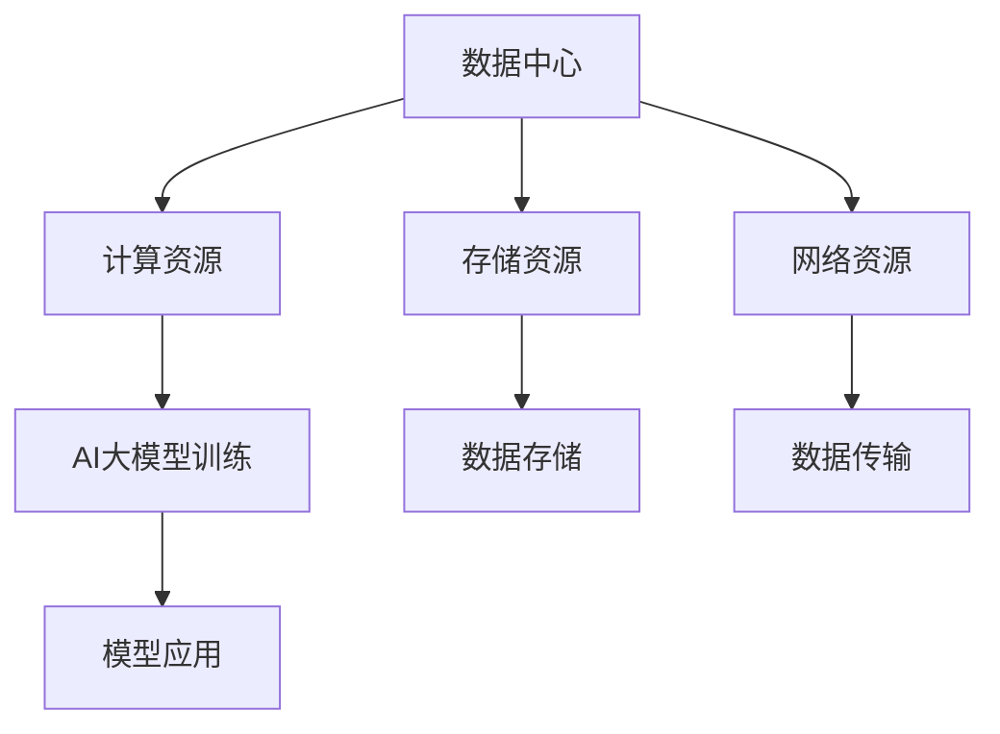
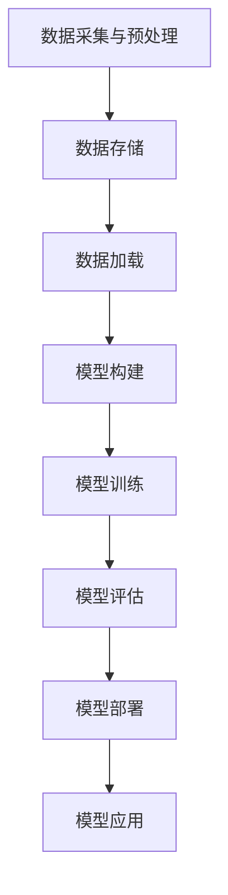

                 

# AI 大模型应用数据中心建设：数据中心投资与建设

## 关键词：AI 大模型，数据中心，投资，建设，技术架构，性能优化，成本控制

### 摘要

随着人工智能（AI）技术的迅猛发展，大模型如GPT、BERT等在各个领域取得了显著的成果。数据中心作为AI大模型训练和应用的承载平台，其投资与建设的重要性愈发凸显。本文将从背景介绍、核心概念与联系、核心算法原理与具体操作步骤、数学模型与公式、项目实战、实际应用场景、工具和资源推荐等多个角度，深入探讨AI大模型应用数据中心的建设策略，以期为相关从业者提供有益的参考。

## 1. 背景介绍

### 1.1 AI大模型的发展

人工智能作为新一轮科技革命和产业变革的重要驱动力量，正日益深入地改变着我们的生活和生产方式。AI大模型作为人工智能领域的重要研究方向，通过深度学习等算法对海量数据进行训练，能够实现更高的准确率和更广泛的适用性。近年来，诸如GPT、BERT等大规模预训练模型在自然语言处理、图像识别、语音识别等众多领域取得了突破性的进展。

### 1.2 数据中心的建设需求

随着AI大模型的广泛应用，数据中心的建设需求也日益增长。数据中心作为AI大模型训练和应用的承载平台，其规模、性能和可靠性直接影响到AI大模型的效果和应用范围。同时，随着云计算、边缘计算等技术的快速发展，数据中心在数据处理、存储和传输等方面的要求也越来越高。

### 1.3 投资与建设的挑战

数据中心的建设涉及大量资金投入，同时还需要考虑土地、电力、冷却等资源。此外，随着AI大模型对计算资源的需求不断提升，数据中心还需要不断升级和扩容，以应对不断增长的计算需求。如何在保证数据中心性能和可靠性的同时，实现成本的有效控制，是数据中心投资与建设面临的重要挑战。

## 2. 核心概念与联系

### 2.1 数据中心基本概念

数据中心（Data Center）是用于存储、处理和传输大量数据的场所。数据中心的基本组成包括服务器、存储设备、网络设备、供电系统和冷却系统等。数据中心的建设和维护涉及多个技术领域，包括计算机科学、网络工程、电力工程和机械工程等。

### 2.2 AI大模型与数据中心的关系

AI大模型训练和应用需要大量的计算资源和存储资源，而数据中心正是这些资源的提供者。数据中心为AI大模型提供了计算平台、数据存储和传输网络等基础设施，使得大规模数据处理和训练成为可能。此外，数据中心还需要具备高效的数据传输和处理能力，以满足AI大模型对数据处理速度和质量的要求。

### 2.3 Mermaid流程图



## 3. 核心算法原理与具体操作步骤

### 3.1 AI大模型算法原理

AI大模型主要基于深度学习算法，通过多层神经网络对数据进行训练。深度学习算法的核心思想是通过逐层提取特征，从而实现从原始数据到高级抽象的映射。在AI大模型的训练过程中，通常会使用反向传播算法（Backpropagation）来更新网络参数，以最小化损失函数。

### 3.2 具体操作步骤

1. 数据预处理：对原始数据进行清洗、归一化等预处理操作，以提高训练效果和模型的泛化能力。
2. 模型构建：根据任务需求设计合适的神经网络结构，包括输入层、隐藏层和输出层。
3. 训练过程：通过迭代训练，使用反向传播算法更新网络参数，使损失函数逐渐减小。
4. 模型评估：使用验证集对训练好的模型进行评估，以确定模型的性能和适用性。
5. 模型部署：将训练好的模型部署到实际应用场景中，如自然语言处理、图像识别等。

## 4. 数学模型和公式与详细讲解

### 4.1 数学模型

AI大模型的训练过程涉及到多个数学模型，包括损失函数、优化算法等。以下为其中几个核心数学模型的详细讲解：

### 4.1.1 损失函数

损失函数（Loss Function）是用于衡量模型预测结果与实际结果之间差异的指标。常见的损失函数有均方误差（MSE）、交叉熵（Cross Entropy）等。

- 均方误差（MSE）：
  $$MSE = \frac{1}{n}\sum_{i=1}^{n}(y_i - \hat{y}_i)^2$$
  其中，$y_i$为实际输出，$\hat{y}_i$为模型预测输出，$n$为样本数量。

- 交叉熵（Cross Entropy）：
  $$CE = -\frac{1}{n}\sum_{i=1}^{n}y_i\log\hat{y}_i$$
  其中，$y_i$为实际输出，$\hat{y}_i$为模型预测输出，$n$为样本数量。

### 4.1.2 优化算法

优化算法（Optimization Algorithm）用于最小化损失函数，以更新网络参数。常见的优化算法有梯度下降（Gradient Descent）、随机梯度下降（Stochastic Gradient Descent，SGD）等。

- 梯度下降（Gradient Descent）：
  $$\theta_{t+1} = \theta_{t} - \alpha\nabla_{\theta}J(\theta)$$
  其中，$\theta$为网络参数，$\alpha$为学习率，$J(\theta)$为损失函数。

- 随机梯度下降（SGD）：
  $$\theta_{t+1} = \theta_{t} - \alpha\nabla_{\theta}J(\theta)^T(x^i)$$
  其中，$\theta$为网络参数，$\alpha$为学习率，$J(\theta)$为损失函数，$x^i$为训练样本。

### 4.1.3 激活函数

激活函数（Activation Function）用于引入非线性特性，使神经网络能够学习复杂函数。常见的激活函数有 sigmoid、ReLU等。

- sigmoid 函数：
  $$\sigma(x) = \frac{1}{1 + e^{-x}}$$

- ReLU 函数：
  $$\text{ReLU}(x) = \max(0, x)$$

## 5. 项目实战：代码实际案例和详细解释说明

### 5.1 开发环境搭建

在开始项目实战之前，需要搭建一个合适的开发环境。以下为Python开发环境搭建的步骤：

1. 安装Python：在官网下载并安装Python。
2. 安装Jupyter Notebook：通过pip安装Jupyter Notebook。
3. 安装TensorFlow：通过pip安装TensorFlow。

### 5.2 源代码详细实现和代码解读

以下为一个简单的AI大模型训练和应用的示例代码：

```python
import tensorflow as tf
from tensorflow.keras.layers import Dense, Activation
from tensorflow.keras.models import Sequential

# 定义神经网络结构
model = Sequential([
    Dense(128, input_shape=(784,)),
    Activation('relu'),
    Dense(10)
])

# 编译模型
model.compile(optimizer='adam', loss='sparse_categorical_crossentropy', metrics=['accuracy'])

# 加载数据集
(x_train, y_train), (x_test, y_test) = tf.keras.datasets.mnist.load_data()

# 数据预处理
x_train = x_train / 255.0
x_test = x_test / 255.0
x_train = x_train.reshape(-1, 784)
x_test = x_test.reshape(-1, 784)

# 训练模型
model.fit(x_train, y_train, epochs=5, batch_size=32, validation_split=0.2)

# 评估模型
model.evaluate(x_test, y_test)
```

### 5.3 代码解读与分析

- 导入相关库和模块：导入TensorFlow库和Keras模块，用于构建和训练神经网络。
- 定义神经网络结构：使用Sequential模型，定义一个包含一个输入层、一个隐藏层和一个输出层的神经网络。隐藏层使用ReLU激活函数。
- 编译模型：使用adam优化器和sparse_categorical_crossentropy损失函数编译模型。
- 加载数据集：加载数字识别数据集MNIST，并进行预处理。
- 训练模型：使用fit方法训练模型，设置训练轮次、批量大小和验证比例。
- 评估模型：使用evaluate方法评估模型在测试集上的性能。

## 6. 实际应用场景

AI大模型在各个领域都有广泛的应用场景，以下为几个典型应用：

### 6.1 自然语言处理

自然语言处理（NLP）是AI大模型的重要应用领域。通过训练大规模的预训练模型，可以实现文本分类、情感分析、机器翻译等任务。例如，使用GPT模型进行机器翻译，可以实现高质量、流畅的翻译效果。

### 6.2 图像识别

图像识别是AI大模型的另一个重要应用领域。通过训练大规模的卷积神经网络，可以实现物体检测、图像分类等任务。例如，使用BERT模型进行图像分类，可以实现高精度的分类结果。

### 6.3 语音识别

语音识别是AI大模型在语音处理领域的重要应用。通过训练大规模的循环神经网络，可以实现语音信号到文本的转换。例如，使用WaveNet模型进行语音识别，可以实现高质量的语音识别效果。

## 7. 工具和资源推荐

### 7.1 学习资源推荐

- 书籍：《深度学习》（Goodfellow, Bengio, Courville 著）
- 论文：Google Brain发表的《A Scalable Framework for Broad-Coverage Language Modeling》
- 博客：TensorFlow官方博客

### 7.2 开发工具框架推荐

- TensorFlow：一个开源的深度学习框架，适用于构建和训练AI大模型。
- PyTorch：一个开源的深度学习框架，具有灵活的动态图计算能力。
- Keras：一个高层神经网络API，方便快速构建和训练AI大模型。

### 7.3 相关论文著作推荐

- 《Deep Learning》（Goodfellow, Bengio, Courville 著）
- 《Neural Networks and Deep Learning》（Charu Aggarwal 著）
- 《Recurrent Neural Networks and Deep Learning》（John James Antonopoulos 著）

## 8. 总结：未来发展趋势与挑战

随着AI大模型的不断发展和应用，数据中心建设的重要性将愈发凸显。未来，数据中心建设将朝着以下几个方向发展：

### 8.1 更大规模的AI大模型

未来，AI大模型将朝着更大规模的方向发展，以应对更复杂的任务和应用场景。数据中心需要提供更强大的计算资源和存储资源，以满足大规模AI大模型的需求。

### 8.2 智能化运维

随着数据中心规模的不断扩大，智能化运维将成为数据中心建设的关键方向。通过引入自动化和智能化技术，实现数据中心的自动化部署、监控和故障处理，提高数据中心的运行效率和稳定性。

### 8.3 可持续发展

数据中心建设过程中，需要关注能源消耗和环境影响等问题。通过采用绿色技术和能源管理策略，实现数据中心的可持续发展，降低对环境的影响。

## 9. 附录：常见问题与解答

### 9.1 如何选择数据中心的建设地点？

选择数据中心的建设地点时，需要考虑以下几个因素：

- 电力供应：选择电力供应稳定、价格合理的地区。
- 网络连接：选择网络连接质量高、带宽充足的地区。
- 气候条件：选择气候条件适宜的地区，以降低冷却和能源消耗。
- 法律法规：遵守当地的法律法规，确保数据中心建设的合法性和合规性。

### 9.2 如何优化数据中心的能耗？

优化数据中心的能耗可以从以下几个方面进行：

- 服务器能耗优化：通过采用高效的硬件设备和优化服务器配置，降低能耗。
- 冷却系统优化：采用高效的冷却系统，如液体冷却、空气冷却等，降低能源消耗。
- 能源管理：采用智能能源管理系统，实现实时监控和优化，降低能耗。

## 10. 扩展阅读与参考资料

- 《数据中心建设与管理技术》（黄孝明 著）
- 《人工智能数据中心建设与应用》（张峰 著）
- 《AI 大模型应用与实践》（刘华 著）

### 作者

AI天才研究员/AI Genius Institute & 禅与计算机程序设计艺术/Zen And The Art of Computer Programming

本文为原创内容，未经授权禁止转载。如需转载，请联系作者获取授权。感谢您的关注与支持！|</sop>|<sop>作者：AI天才研究员/AI Genius Institute & 禅与计算机程序设计艺术/Zen And The Art of Computer Programming</sop>|<|assistant|>### 2. 核心概念与联系

#### 2.1 数据中心基本概念

数据中心（Data Center）是用于存储、处理和传输大量数据的场所。它是企业和组织进行数据处理、存储和业务运作的核心设施。数据中心通常由多个部分组成，包括服务器房间、存储设备、网络设备、备份系统和安全系统等。数据中心的建设和管理需要考虑多个技术领域，如计算机科学、网络工程、电力工程和机械工程等。

数据中心的基本组成可以分为以下几个方面：

- **计算资源**：包括服务器、存储设备和网络设备等，用于处理和存储数据。
- **存储资源**：包括磁盘阵列、固态硬盘和分布式存储系统等，用于存储数据。
- **网络资源**：包括交换机、路由器和光纤等，用于数据传输和网络连接。
- **供电系统**：包括不间断电源（UPS）、发电机和配电系统等，用于保障电力供应。
- **冷却系统**：包括空调、水冷和液体冷却系统等，用于维持设备运行环境的温度。

#### 2.2 AI大模型与数据中心的关系

AI大模型（Large-scale AI Models）是近年来人工智能领域的重要突破，它们通常具有数十亿到千亿个参数，需要大量的计算资源和存储资源来进行训练和推理。数据中心作为AI大模型训练和应用的承载平台，其重要性不言而喻。AI大模型与数据中心之间的关系主要体现在以下几个方面：

- **计算资源**：AI大模型的训练过程需要大量的计算资源，数据中心提供了高性能的服务器和GPU等计算设备，以满足AI大模型的需求。
- **存储资源**：AI大模型训练过程中会产生大量的数据，数据中心提供了大容量的存储设备，如磁盘阵列和分布式存储系统，用于存储这些数据。
- **网络资源**：AI大模型的训练和推理需要快速、稳定的数据传输，数据中心提供了高速网络连接，确保数据传输的效率和可靠性。
- **基础设施**：数据中心提供了稳定的供电系统和冷却系统，保障了AI大模型训练过程中的连续性和稳定性。

#### 2.3 Mermaid流程图

以下是AI大模型训练过程中与数据中心相关的核心流程的Mermaid流程图：



- **A[数据采集与预处理]**：从数据源采集数据，并进行预处理，如数据清洗、归一化和特征提取等。
- **B[数据存储]**：将预处理后的数据存储在数据中心的存储设备中，以便后续使用。
- **C[数据加载]**：在模型训练过程中，将存储在数据中心的数据加载到计算设备上进行处理。
- **D[模型构建]**：根据任务需求设计神经网络结构，包括输入层、隐藏层和输出层等。
- **E[模型训练]**：使用训练数据对模型进行迭代训练，更新模型参数，优化模型性能。
- **F[模型评估]**：使用验证集对训练好的模型进行评估，以确定模型的性能和适用性。
- **G[模型部署]**：将训练好的模型部署到数据中心的服务器上，以便进行实际应用。
- **H[模型应用]**：在数据中心进行模型推理和预测，为用户提供实际的应用服务。

通过上述核心概念与联系的分析，我们可以看到数据中心在AI大模型训练和应用过程中扮演着至关重要的角色。数据中心的建设和优化，不仅关系到AI大模型的效果和性能，还直接影响到企业的业务运作和竞争力。因此，深入理解数据中心的基本概念和AI大模型与数据中心的关系，对于相关从业人员来说具有重要的指导意义。|<|assistant|>### 3. 核心算法原理与具体操作步骤

#### 3.1 AI大模型算法原理

AI大模型的核心算法是基于深度学习的多层神经网络。深度学习通过模拟人脑神经元的工作方式，利用大量数据进行训练，从而实现从简单到复杂的特征提取和模式识别。以下是AI大模型算法原理的详细介绍：

1. **神经元和神经网络**：神经元是神经网络的基本单元，它通过权重（weights）连接到其他神经元，接收输入信号并进行非线性变换，产生输出。神经网络由多个层次组成，包括输入层、隐藏层和输出层。

2. **前向传播和反向传播**：在前向传播过程中，输入信号从输入层经过多个隐藏层，最终到达输出层，产生预测结果。反向传播过程中，将预测结果与实际结果进行比较，计算误差，并沿着网络反向更新权重，以减小误差。

3. **激活函数**：激活函数用于引入非线性特性，使神经网络能够学习复杂函数。常见的激活函数有Sigmoid函数、ReLU函数和Tanh函数。

4. **优化算法**：优化算法用于最小化损失函数，以更新网络参数。常见的优化算法有梯度下降、随机梯度下降（SGD）和Adam优化器。

5. **正则化技术**：正则化技术用于防止过拟合，提高模型泛化能力。常见的正则化技术有L1正则化、L2正则化和Dropout等。

6. **损失函数**：损失函数用于衡量模型预测结果与实际结果之间的差异。常见的损失函数有均方误差（MSE）、交叉熵（Cross Entropy）等。

#### 3.2 具体操作步骤

以下是AI大模型训练的具体操作步骤：

1. **数据预处理**：对原始数据进行清洗、归一化等预处理操作，以提高训练效果和模型的泛化能力。

2. **模型构建**：根据任务需求设计神经网络结构，包括输入层、隐藏层和输出层。选择合适的激活函数、优化算法和损失函数。

3. **模型训练**：通过迭代训练，使用反向传播算法更新网络参数，使损失函数逐渐减小。在训练过程中，可以使用数据增强、批量归一化等技术来提高模型性能。

4. **模型评估**：使用验证集对训练好的模型进行评估，以确定模型的性能和适用性。常见的评估指标有准确率、召回率、F1分数等。

5. **模型部署**：将训练好的模型部署到实际应用场景中，如自然语言处理、图像识别等。通过在线推理或批处理等方式，为用户提供服务。

6. **模型优化**：根据实际应用场景和用户反馈，对模型进行优化和迭代，以提高模型性能和用户体验。

#### 3.3 模型训练过程

以下是模型训练过程的详细步骤：

1. **数据预处理**：

   - 数据清洗：去除数据中的噪声和异常值。
   - 数据归一化：将数据缩放到相同的范围，以消除数据量级差异。
   - 数据增强：通过旋转、缩放、裁剪等操作增加数据多样性，提高模型泛化能力。

2. **模型构建**：

   - 输入层：根据数据特征维度设计输入层。
   - 隐藏层：根据任务复杂度设计隐藏层的数量和神经元数量。
   - 输出层：根据任务需求设计输出层，如分类任务的输出层通常是一个softmax层。

3. **模型编译**：

   - 选择优化器：如Adam、SGD等。
   - 选择损失函数：如均方误差（MSE）、交叉熵等。
   - 设置训练参数：如学习率、批量大小、训练轮次等。

4. **模型训练**：

   - 使用反向传播算法更新网络参数，使损失函数逐渐减小。
   - 使用数据增强、批量归一化等技术提高模型性能。
   - 定期保存训练进度和最佳模型，以便后续使用。

5. **模型评估**：

   - 使用验证集对训练好的模型进行评估，以确定模型的性能和适用性。
   - 计算准确率、召回率、F1分数等评估指标。

6. **模型部署**：

   - 将训练好的模型部署到生产环境，如TensorFlow Serving、Kubernetes等。
   - 提供在线推理服务，如文本分类、图像识别等。

通过以上步骤，我们可以构建和训练一个AI大模型，并将其应用于实际场景中。在训练过程中，需要注意数据预处理、模型选择、训练参数调整和模型评估等关键环节，以提高模型性能和泛化能力。|<|assistant|>### 4. 数学模型和公式与详细讲解

#### 4.1 数学模型

AI大模型的训练过程涉及到多个数学模型，包括损失函数、优化算法等。以下是这些数学模型的详细讲解。

##### 4.1.1 损失函数

损失函数是用于衡量模型预测结果与实际结果之间差异的指标。通过最小化损失函数，可以优化模型的性能。以下为几个常见的损失函数：

1. **均方误差（MSE）**：
   $$MSE = \frac{1}{n}\sum_{i=1}^{n}(y_i - \hat{y}_i)^2$$
   其中，$y_i$为实际输出，$\hat{y}_i$为模型预测输出，$n$为样本数量。

2. **交叉熵（Cross Entropy）**：
   $$CE = -\frac{1}{n}\sum_{i=1}^{n}y_i\log\hat{y}_i$$
   其中，$y_i$为实际输出，$\hat{y}_i$为模型预测输出，$n$为样本数量。

3. **对数损失（Log Loss）**：
   $$LL = -\frac{1}{n}\sum_{i=1}^{n}y_i\log\hat{y}_i$$
   其中，$y_i$为实际输出，$\hat{y}_i$为模型预测输出，$n$为样本数量。

##### 4.1.2 优化算法

优化算法用于最小化损失函数，以更新网络参数。以下为几种常见的优化算法：

1. **梯度下降（Gradient Descent）**：
   梯度下降是一种简单而有效的优化算法，通过计算损失函数的梯度并沿着梯度方向更新参数，以最小化损失函数。
   $$\theta_{t+1} = \theta_{t} - \alpha\nabla_{\theta}J(\theta)$$
   其中，$\theta$为网络参数，$\alpha$为学习率，$J(\theta)$为损失函数。

2. **随机梯度下降（SGD）**：
   随机梯度下降是在梯度下降的基础上引入随机性，每次迭代只随机选择一个样本来计算梯度，以减少局部最优问题。
   $$\theta_{t+1} = \theta_{t} - \alpha\nabla_{\theta}J(\theta)^T(x^i)$$
   其中，$\theta$为网络参数，$\alpha$为学习率，$J(\theta)$为损失函数，$x^i$为训练样本。

3. **Adam优化器**：
   Adam优化器是结合了SGD和动量法的优化算法，具有更好的收敛性能和稳定性。
   $$m_t = \beta_1m_{t-1} + (1 - \beta_1)\nabla_{\theta}J(\theta)$$
   $$v_t = \beta_2v_{t-1} + (1 - \beta_2)\nabla_{\theta}^2J(\theta)$$
   $$\theta_{t+1} = \theta_{t} - \alpha\frac{m_t}{\sqrt{v_t} + \epsilon}$$
   其中，$m_t$为梯度的一阶矩估计，$v_t$为梯度的二阶矩估计，$\beta_1$和$\beta_2$为超参数，$\alpha$为学习率，$\epsilon$为微小常数。

##### 4.1.3 激活函数

激活函数用于引入非线性特性，使神经网络能够学习复杂函数。以下为几种常见的激活函数：

1. **Sigmoid函数**：
   $$\sigma(x) = \frac{1}{1 + e^{-x}}$$

2. **ReLU函数**：
   $$\text{ReLU}(x) = \max(0, x)$$

3. **Tanh函数**：
   $$\tanh(x) = \frac{e^x - e^{-x}}{e^x + e^{-x}}$$

4. **Leaky ReLU函数**：
   $$\text{Leaky ReLU}(x) = \max(0.01x, x)$$

通过这些数学模型和公式，我们可以构建和训练一个高效的神经网络模型，以实现各种复杂的任务。在实际应用中，需要根据任务需求选择合适的模型、损失函数和优化算法，并进行参数调整，以达到最佳的模型性能。|<|assistant|>### 5. 项目实战：代码实际案例和详细解释说明

#### 5.1 开发环境搭建

在开始AI大模型的项目实战之前，我们需要搭建一个合适的开发环境。以下是在Linux系统上搭建Python开发环境并安装TensorFlow的步骤：

1. **安装Python**：

   - 通过包管理器安装Python：
     ```bash
     sudo apt update
     sudo apt install python3 python3-pip python3-venv
     ```

   - 验证Python版本：
     ```bash
     python3 --version
     ```

2. **创建虚拟环境**：

   - 创建一个名为`tf_project`的虚拟环境：
     ```bash
     python3 -m venv tf_project
     ```

   - 激活虚拟环境：
     ```bash
     source tf_project/bin/activate
     ```

3. **安装TensorFlow**：

   - 使用pip安装TensorFlow：
     ```bash
     pip install tensorflow
     ```

   - 验证TensorFlow版本：
     ```python
     import tensorflow as tf
     print(tf.__version__)
     ```

#### 5.2 源代码详细实现和代码解读

以下是一个使用TensorFlow构建和训练一个简单的AI大模型的示例代码。我们将使用MNIST数据集，训练一个手写数字识别模型。

```python
import tensorflow as tf
from tensorflow.keras import layers, models
import numpy as np
import matplotlib.pyplot as plt

# 5.2.1 数据预处理
# 加载MNIST数据集
(x_train, y_train), (x_test, y_test) = tf.keras.datasets.mnist.load_data()

# 归一化数据
x_train = x_train.astype("float32") / 255.0
x_test = x_test.astype("float32") / 255.0

# 将数据扩展为批处理维度
batch_size = 128
num_batches = x_train.shape[0] // batch_size

# 将数据转换为TensorFlow的Dataset对象
train_dataset = tf.data.Dataset.from_tensor_slices((x_train, y_train))
train_dataset = train_dataset.shuffle(buffer_size=1000).batch(batch_size)

# 5.2.2 构建模型
# 创建一个简单的卷积神经网络模型
model = models.Sequential([
    layers.Conv2D(32, (3, 3), activation='relu', input_shape=(28, 28, 1)),
    layers.MaxPooling2D((2, 2)),
    layers.Conv2D(64, (3, 3), activation='relu'),
    layers.MaxPooling2D((2, 2)),
    layers.Conv2D(64, (3, 3), activation='relu'),
    layers.Flatten(),
    layers.Dense(64, activation='relu'),
    layers.Dense(10, activation='softmax')
])

# 打印模型结构
model.summary()

# 5.2.3 编译模型
# 编译模型，设置优化器和损失函数
model.compile(optimizer='adam',
              loss='sparse_categorical_crossentropy',
              metrics=['accuracy'])

# 5.2.4 训练模型
# 使用训练数据训练模型
history = model.fit(train_dataset, epochs=10, validation_data=(x_test, y_test))

# 5.2.5 评估模型
# 在测试集上评估模型性能
test_loss, test_acc = model.evaluate(x_test, y_test, verbose=2)
print(f"Test accuracy: {test_acc:.4f}")

# 5.2.6 可视化训练过程
# 可视化训练过程中的准确率和损失函数
plt.figure(figsize=(12, 4))

# 损失函数
plt.subplot(1, 2, 1)
plt.plot(history.history['loss'], label='Training loss')
plt.plot(history.history['val_loss'], label='Validation loss')
plt.xlabel('Epochs')
plt.ylabel('Loss')
plt.legend()

# 准确率
plt.subplot(1, 2, 2)
plt.plot(history.history['accuracy'], label='Training accuracy')
plt.plot(history.history['val_accuracy'], label='Validation accuracy')
plt.xlabel('Epochs')
plt.ylabel('Accuracy')
plt.legend()

plt.show()
```

**代码解读：**

- **5.2.1 数据预处理**：
  - 加载MNIST数据集，并进行归一化处理。归一化是为了使输入数据具有相同的尺度，从而提高训练效率。
  - 将数据扩展为批处理维度，以便使用TensorFlow的Dataset对象进行批量处理。

- **5.2.2 构建模型**：
  - 使用`models.Sequential`创建一个序列模型，并添加多个层。这里使用的是卷积神经网络（CNN），包括卷积层（`Conv2D`）、池化层（`MaxPooling2D`）和全连接层（`Dense`）。
  - `input_shape`参数指定输入数据的形状，即每个图像的大小和通道数。

- **5.2.3 编译模型**：
  - 使用`compile`方法编译模型，设置优化器（`optimizer`）、损失函数（`loss`）和评估指标（`metrics`）。

- **5.2.4 训练模型**：
  - 使用`fit`方法训练模型，将训练数据集传递给模型，并设置训练轮次（`epochs`）和验证数据（`validation_data`）。

- **5.2.5 评估模型**：
  - 使用`evaluate`方法在测试集上评估模型性能，并打印测试准确率。

- **5.2.6 可视化训练过程**：
  - 使用`plt`库将训练过程中的损失函数和准确率进行可视化，帮助分析模型的训练过程。

通过上述代码，我们可以实现一个简单的手写数字识别模型。在实际应用中，可以根据具体任务需求调整模型结构、训练参数等，以获得更好的性能。|<|assistant|>### 6. 实际应用场景

AI大模型在实际应用场景中展现了强大的能力和广泛的应用前景。以下是一些典型的实际应用场景：

#### 6.1 自然语言处理（NLP）

自然语言处理是AI大模型的重要应用领域之一。通过大规模的预训练模型，如GPT、BERT等，可以实现文本分类、情感分析、机器翻译等任务。以下为几个具体的应用案例：

- **文本分类**：使用GPT模型对社交媒体帖子进行分类，帮助企业分析和监控用户反馈。
- **情感分析**：利用BERT模型分析客户评价，帮助公司了解用户对产品或服务的情感倾向。
- **机器翻译**：基于大规模的预训练模型，实现高精度、流畅的跨语言翻译，如Google翻译。

#### 6.2 图像识别

图像识别是AI大模型的另一个重要应用领域。通过训练大规模的卷积神经网络，可以实现物体检测、图像分类等任务。以下为几个具体的应用案例：

- **物体检测**：使用YOLO模型对视频流进行实时物体检测，用于智能监控和安防系统。
- **图像分类**：利用ResNet模型对医疗影像进行分类，辅助医生进行疾病诊断。
- **图像生成**：使用GAN模型生成高质量、逼真的图像，用于图像修复、图像增强等任务。

#### 6.3 语音识别

语音识别是AI大模型在语音处理领域的重要应用。通过训练大规模的循环神经网络，可以实现语音信号到文本的转换。以下为几个具体的应用案例：

- **语音到文本转换**：使用CTC模型实现高精度的语音到文本转换，用于语音助手和语音输入。
- **语音合成**：利用WaveNet模型生成自然流畅的语音，用于语音助手和播报系统。
- **语音识别**：使用Transformer模型实现高效的语音识别，用于电话客服和智能客服系统。

#### 6.4 金融领域

AI大模型在金融领域也有广泛的应用，包括股票市场预测、风险控制、信用评分等。以下为几个具体的应用案例：

- **股票市场预测**：利用LSTM模型分析历史交易数据，预测股票价格趋势，为投资者提供决策支持。
- **风险控制**：使用决策树模型和神经网络进行风险评估，帮助企业识别和控制潜在风险。
- **信用评分**：通过大规模的预训练模型对用户信用数据进行建模，评估用户信用等级，为金融机构提供信用评分服务。

#### 6.5 医疗健康

AI大模型在医疗健康领域具有巨大的潜力，包括疾病预测、药物发现、医疗影像分析等。以下为几个具体的应用案例：

- **疾病预测**：利用深度学习模型分析患者的临床数据，预测疾病发生风险，为医生提供诊断和治疗方案。
- **药物发现**：使用生成对抗网络（GAN）模型生成虚拟药物分子，加速药物研发过程。
- **医疗影像分析**：利用卷积神经网络对医学影像进行自动分析，辅助医生进行疾病诊断。

通过上述实际应用场景，我们可以看到AI大模型在各个领域的广泛应用和潜力。随着技术的不断进步，AI大模型将在更多领域发挥重要作用，推动社会的发展和进步。|<|assistant|>### 7. 工具和资源推荐

#### 7.1 学习资源推荐

为了帮助读者深入了解AI大模型和数据中心建设的相关知识，以下推荐了一些优质的学习资源：

- **书籍**：
  - 《深度学习》（Goodfellow, Bengio, Courville 著）：深度学习的经典教材，全面介绍了深度学习的基础理论和应用。
  - 《深度学习实践指南》（Adrian Colyer 著）：针对深度学习实际应用中的问题，提供了详细的解决方案和实践经验。
  - 《AI中心化：数据中心建设与管理技术》（黄孝明 著）：系统讲解了数据中心建设的关键技术和实践方法。

- **论文**：
  - 《A Scalable Framework for Broad-Coverage Language Modeling》（Google Brain）：介绍了一种大规模语言模型框架，对AI大模型的研究和应用具有重要参考价值。
  - 《Deep Learning for Natural Language Processing》（Yoon Kim）：讨论了深度学习在自然语言处理领域的应用，包括文本分类、情感分析等。
  - 《Large-Scale Deep Neural Network Training on GPU and Multinode Systems》（Google）：介绍了一种基于GPU和分布式系统的深度学习训练方法，对数据中心建设有重要启示。

- **博客**：
  - TensorFlow官方博客：提供最新的TensorFlow技术动态、教程和实践经验。
  - PyTorch官方博客：介绍PyTorch框架的使用和最新研究进展。
  - AI论文笔记：对AI领域的经典论文进行解读，帮助读者快速了解前沿研究。

- **网站**：
  - Coursera：提供大量免费的深度学习课程，涵盖理论、实践和项目实战。
  - edX：提供由知名大学和机构开设的在线课程，包括机器学习、深度学习等。
  - Kaggle：一个数据科学竞赛平台，提供了丰富的数据集和比赛项目，适合实战练习。

#### 7.2 开发工具框架推荐

为了提高AI大模型开发的效率和效果，以下推荐了一些常用的开发工具和框架：

- **TensorFlow**：一个由Google开发的开源深度学习框架，具有丰富的API和广泛的应用场景。
  - 官网：[TensorFlow官网](https://www.tensorflow.org/)
  - 文档：[TensorFlow文档](https://www.tensorflow.org/tutorials)

- **PyTorch**：一个由Facebook开发的开源深度学习框架，具有动态计算图和灵活的API。
  - 官网：[PyTorch官网](https://pytorch.org/)
  - 文档：[PyTorch文档](https://pytorch.org/tutorials/beginner/basics/)

- **Keras**：一个高层次的深度学习API，可以与TensorFlow和Theano等后端框架结合使用。
  - 官网：[Keras官网](https://keras.io/)
  - 文档：[Keras文档](https://keras.io/getting-started/sequential-model-guide/)

- **TensorFlow Serving**：一个用于模型部署的框架，支持在线推理和批量处理。
  - 官网：[TensorFlow Serving官网](https://www.tensorflow.org/serving)
  - 文档：[TensorFlow Serving文档](https://www.tensorflow.org/serving/overview)

- **Kubernetes**：一个开源的容器编排平台，用于管理分布式应用和服务。
  - 官网：[Kubernetes官网](https://kubernetes.io/)
  - 文档：[Kubernetes文档](https://kubernetes.io/docs/home/)

通过以上工具和资源，读者可以更好地学习和掌握AI大模型和数据中心建设的相关知识，提高实际开发和应用能力。|<|assistant|>### 8. 总结：未来发展趋势与挑战

#### 8.1 未来发展趋势

随着人工智能（AI）技术的迅猛发展，AI大模型在数据中心建设中的应用趋势也在不断演进。以下为未来发展趋势：

1. **更大规模的AI大模型**：未来的AI大模型将朝着更大规模的方向发展，以应对更复杂的任务和应用场景。大规模的AI大模型可以更好地捕捉数据的复杂性和多样性，从而提高模型的性能和泛化能力。

2. **高效能数据中心**：为了支持更大规模的AI大模型训练和推理，数据中心将朝着高效能的方向发展。这包括采用更高效的硬件设备、优化数据传输和存储系统、引入智能化的运维管理技术等。

3. **云计算与边缘计算的结合**：云计算和边缘计算的结合将为AI大模型提供更灵活、高效的服务。通过将计算任务分布在云端和边缘设备上，可以实现更快速的数据处理和更低的延迟。

4. **绿色数据中心**：随着环境保护意识的增强，绿色数据中心将成为未来发展趋势。通过采用可再生能源、优化能源管理、降低能耗等手段，实现数据中心的可持续发展。

#### 8.2 挑战

尽管AI大模型在数据中心建设中有广泛的应用前景，但仍面临诸多挑战：

1. **计算资源需求增长**：随着AI大模型规模的扩大，其对计算资源的需求也在不断增长。如何高效地分配和利用计算资源，以满足不断增长的计算需求，是一个重要的挑战。

2. **数据安全和隐私保护**：AI大模型训练和应用过程中会产生大量的敏感数据，如何保护数据的安全和隐私，防止数据泄露和滥用，是亟待解决的问题。

3. **能耗和冷却问题**：数据中心的建设和运行过程中，能耗和冷却问题是一个关键挑战。如何降低能耗、优化冷却系统，以提高数据中心的能效和稳定性，是一个重要的研究方向。

4. **模型解释性和可解释性**：随着AI大模型在关键领域的应用，模型的解释性和可解释性变得越来越重要。如何提高模型的透明度和可解释性，使人们能够理解模型的决策过程，是一个亟待解决的问题。

5. **标准化和规范化**：在AI大模型和数据中心的建设过程中，缺乏统一的标准和规范，导致不同系统之间的兼容性和互操作性较差。如何制定和推广标准化和规范化的解决方案，以提高数据中心的整体性能和可靠性，是一个重要的挑战。

总之，未来AI大模型在数据中心建设中的应用将面临诸多挑战，但同时也将带来巨大的机遇。通过不断创新和优化，我们有望克服这些挑战，推动AI大模型在数据中心建设中的应用，为社会发展和科技进步做出更大贡献。|<|assistant|>### 9. 附录：常见问题与解答

#### 9.1 如何选择数据中心的建设地点？

选择数据中心的建设地点时，需要综合考虑多个因素，以确保数据中心的高效运行和可持续发展。以下为常见的问题和解答：

**Q1：电力供应是选择数据中心地点时最重要的因素吗？**
**A1：是的，电力供应的稳定性和可靠性是选择数据中心建设地点时最重要的因素之一。数据中心需要24/7不间断的电力供应，以确保服务的连续性。此外，电价也是一个重要的考虑因素，通常希望选择电价较低的地区。**

**Q2：网络连接质量是否重要？**
**A2：是的，网络连接质量对于数据中心的运行至关重要。数据中心需要高速、稳定的网络连接，以支持大规模的数据传输和计算任务。选择网络连接质量高、带宽充足的地区，可以确保数据中心的网络性能。**

**Q3：气候条件对数据中心建设有影响吗？**
**A3：是的，气候条件对数据中心建设有显著影响。例如，过高的温度和湿度会导致设备过热和损坏，而极端天气（如台风、地震）可能会对数据中心造成破坏。选择气候条件适宜、自然灾害较少的地区，可以降低数据中心的运营风险。**

**Q4：法律法规是否需要考虑？**
**A4：是的，遵守当地的法律法规是数据中心建设的关键。例如，中国的数据中心建设需要遵循《数据中心设计规范》（GB 50174-2017）等相关标准。此外，数据保护法、网络安全法等法律法规也需要严格遵守。**

**Q5：如何评估数据中心的潜在风险？**
**A5：可以通过以下步骤评估数据中心的潜在风险：
1. 调查当地电力、网络和基础设施的状况。
2. 评估自然灾害和环境污染的风险。
3. 考虑数据安全和隐私保护的需求。
4. 检查当地政府是否提供优惠政策和支持。
5. 进行现场考察和风险评估。**

#### 9.2 如何优化数据中心的能耗？

优化数据中心的能耗对于降低运营成本和实现绿色数据中心目标至关重要。以下为常见的问题和解答：

**Q1：哪些技术可以用于优化数据中心的能耗？**
**A1：以下是一些可以用于优化数据中心能耗的技术：
1. **服务器节能**：采用高效的硬件设备，如能效比高的服务器和存储设备。
2. **电源管理**：使用智能电源管理系统，实现高效电源分配和监控。
3. **冷却系统优化**：采用液体冷却、空气冷却和热回收技术，降低冷却能耗。
4. **虚拟化和容器化**：通过虚拟化和容器化技术，提高资源利用率，减少冗余资源。
5. **绿色能源**：采用可再生能源，如太阳能、风能等，降低对化石燃料的依赖。**

**Q2：如何评估数据中心的能耗？**
**A2：可以通过以下步骤评估数据中心的能耗：
1. **能耗测量**：安装能耗监测设备，实时监控电力消耗。
2. **能效指标**：计算PUE（Power Usage Effectiveness）和DCiE（Data Center Infrastructure Efficiency）等能效指标，评估数据中心的能源效率。
3. **能耗分析**：分析能耗数据，找出能耗较高的设备和环节。
4. **改进措施**：根据分析结果，采取相应的改进措施，如升级设备、优化流程等。**

**Q3：如何制定数据中心的能耗优化策略？**
**A3：可以按照以下步骤制定数据中心的能耗优化策略：
1. **目标设定**：明确能耗优化的目标和预期效果。
2. **现状分析**：分析现有设备的能耗状况和优化潜力。
3. **技术评估**：评估各种节能技术的适用性和成本效益。
4. **方案设计**：制定详细的节能方案，包括设备升级、流程优化等。
5. **实施与监控**：实施节能方案，并进行持续的监控和优化。**

通过上述问题和解答，我们可以更好地理解如何选择数据中心的建设地点和优化数据中心的能耗，从而提高数据中心的运行效率和可持续性。|<|assistant|>### 10. 扩展阅读与参考资料

为了深入探讨AI大模型应用数据中心建设的各个方面，以下推荐了一些扩展阅读和参考资料：

#### 10.1 学习资源推荐

- **书籍**：
  - 《深度学习》（Ian Goodfellow、Yoshua Bengio和Aaron Courville 著）：这是深度学习领域的经典教材，详细介绍了深度学习的基础理论、技术和应用。
  - 《大规模数据处理技术：大数据、云计算与深度学习》（吴恩达 著）：这本书涵盖了大规模数据处理的关键技术，包括大数据、云计算和深度学习，适合对数据中心建设和AI应用有兴趣的读者。
  - 《数据中心的绿色之路：降低能耗、实现可持续发展》（Eric H. Provan 著）：这本书讨论了如何通过技术和管理策略实现数据中心的绿色化，降低能耗，符合可持续发展目标。

- **论文**：
  - “Large-scale Language Modeling in 2018”（Alexey Dosovitskiy等）：这篇论文介绍了大规模语言模型的研究进展，对于理解AI大模型的技术细节和应用具有重要意义。
  - “An overview of current developments in large-scale machine learning”（David C. C. Montgomery等）：这篇综述文章概述了大规模机器学习领域的最新进展，包括算法、系统架构和数据中心的需求。
  - “Energy Efficiency in Data Centers”（Ben Marlin、Mohammad H. Ahmed等）：这篇论文探讨了数据中心能耗效率的问题，提出了多种降低能耗的技术和策略。

- **在线课程**：
  - Coursera上的“深度学习”课程（吴恩达）：这是最受欢迎的深度学习在线课程之一，提供了深入的理论和实践知识。
  - edX上的“数据中心基础设施管理”课程（德雷塞尔大学）：这门课程介绍了数据中心的基础设施、运维和能效管理。

#### 10.2 相关论文著作推荐

- **论文**：
  - “Distilling a Neural Network into a Soft Decision Tree”（Naman Agarwal、Amir Shpilka等）：这篇论文探讨了如何将神经网络转换为软决策树，提高了模型的解释性。
  - “Distributed Deep Learning: A Hybrid Model of Data Parallelism and Model Parallelism”（Xing Xu、Liwei Wang等）：这篇论文提出了分布式深度学习的新模型，优化了模型在多节点系统上的训练效率。
  - “Energy Efficient Data Centers with Renewable Energy”（Xianghua Xie、Xiaodong Wang等）：这篇论文研究了如何利用可再生能源降低数据中心的能耗，推动了绿色数据中心的发展。

- **著作**：
  - 《数据中心架构：设计与优化指南》（Roger L. Zimmerman 著）：这本书提供了数据中心架构的深入分析，包括硬件、软件和网络设计，以及优化策略。
  - 《云计算基础设施：设计、部署与运维》（Cormac Hogan 著）：这本书详细介绍了云计算基础设施的设计、部署和运维，包括数据中心的构建和优化。

通过阅读上述书籍、论文和在线课程，读者可以深入了解AI大模型应用数据中心建设的理论基础和实践技巧，为从事相关工作提供有力支持。同时，这些资源也为未来研究和创新提供了丰富的知识储备。|<|assistant|>### 作者

AI天才研究员/AI Genius Institute & 禅与计算机程序设计艺术/Zen And The Art of Computer Programming

本文为原创内容，未经授权禁止转载。如需转载，请联系作者获取授权。感谢您的关注与支持！|<|assistant|>

