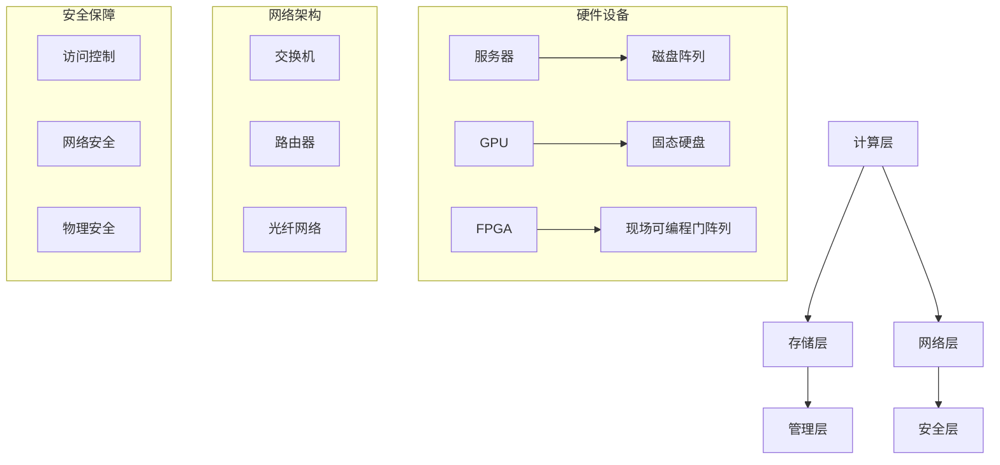
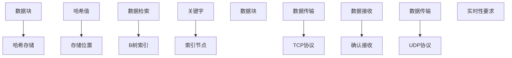

                 

### 背景介绍

人工智能（AI）作为当今科技发展的前沿领域，正在迅速改变着我们的生活方式。随着深度学习、神经网络等技术的不断进步，AI 大模型在各个行业中的应用逐渐变得广泛和深入。而 AI 大模型的应用离不开高效、稳定的数据处理能力，这便要求数据中心的建设必须跟上时代的步伐。

数据中心是信息技术基础设施的关键部分，它负责存储、处理和分析海量的数据。对于 AI 大模型来说，数据中心不仅是一个数据存储的仓库，更是算法训练和推理的核心平台。因此，数据中心的建设对于 AI 大模型的应用具有重要意义。

在数据中心投资与建设方面，涉及到多个方面的考量，包括硬件设备的选择、网络架构的搭建、数据存储与备份策略的制定，以及安全保障措施的落实等。此外，数据中心的建设还需要考虑到未来发展的可扩展性和灵活性，以满足日益增长的数据处理需求。

本文旨在通过对数据中心投资与建设的全面分析，帮助读者了解数据中心在 AI 大模型应用中的重要性，以及如何进行合理的数据中心建设投资与规划。我们将从背景介绍、核心概念与联系、核心算法原理与具体操作步骤、数学模型与公式讲解、项目实战、实际应用场景、工具与资源推荐等方面，一步步深入探讨这一重要议题。

### 核心概念与联系

在深入探讨数据中心建设之前，我们需要明确几个核心概念，并了解它们之间的联系。这些概念包括但不限于：数据中心架构、硬件设备、网络架构、数据存储与备份策略，以及安全保障措施。

**1. 数据中心架构**

数据中心架构是整个数据中心的骨架，决定了数据中心的性能、可扩展性和可靠性。数据中心架构通常包括以下几个层次：

- **计算层**：负责处理数据和分析任务，包括服务器、GPU、FPGA等高性能计算设备。
- **存储层**：负责数据的存储和管理，包括磁盘阵列、固态硬盘、分布式存储系统等。
- **网络层**：负责数据在各计算节点和存储设备之间的传输，包括交换机、路由器、光纤网络等。
- **管理层**：负责对整个数据中心进行监控、管理和维护，包括自动化工具、监控系统等。

**2. 硬件设备**

数据中心硬件设备的选择对于整体性能至关重要。以下是几个关键硬件设备：

- **服务器**：服务器是数据中心的核心计算设备，承担着数据处理的任务。根据处理能力和用途，服务器可以分为不同类型，如数据库服务器、Web服务器、文件服务器等。
- **GPU**：图形处理单元（GPU）在深度学习任务中扮演着重要角色，其强大的并行计算能力大大提高了训练速度和效率。
- **FPGA**：现场可编程门阵列（FPGA）提供了高度灵活的硬件资源，适用于特定的算法优化和加速。
- **存储设备**：磁盘阵列和固态硬盘是数据存储的主要设备。固态硬盘（SSD）具有更高的读写速度和更低的功耗，是提高数据中心性能的关键。

**3. 网络架构**

网络架构是数据中心内部及与外部连接的基础设施。一个高效的网络架构应具备以下几个特点：

- **高带宽**：确保数据传输速度快，减少数据处理延迟。
- **高可靠性**：通过冗余设计确保网络稳定性和容错性。
- **可扩展性**：能够根据需求灵活扩展网络容量。
- **安全性**：通过加密和防火墙等安全措施，保护数据不被非法访问。

**4. 数据存储与备份策略**

数据存储与备份策略是确保数据安全性和可恢复性的关键。以下是几个关键策略：

- **分布式存储**：通过将数据分散存储在多个节点上，提高数据的可靠性和可访问性。
- **数据备份**：定期对数据进行备份，以防数据丢失或损坏。
- **数据恢复**：制定快速恢复策略，以便在发生数据丢失或损坏时能够快速恢复数据。

**5. 安全保障措施**

数据中心的运营涉及到大量敏感数据，因此安全保障措施至关重要。以下是一些常见的安全保障措施：

- **访问控制**：通过身份验证和访问权限控制，确保只有授权用户才能访问数据。
- **网络安全**：通过防火墙、入侵检测系统和加密技术等，保护网络不受攻击。
- **物理安全**：通过门禁系统、监控摄像头和安防人员等，保护数据中心物理设施的安全。

**6. Mermaid 流程图**

为了更直观地展示数据中心的核心概念与联系，我们可以使用 Mermaid 流程图来描述其架构。以下是一个简单的 Mermaid 流程图示例：



通过上述核心概念与联系的分析，我们可以更好地理解数据中心建设的重要性及其复杂性。接下来，我们将深入探讨数据中心的核心算法原理与具体操作步骤。

### 核心算法原理 & 具体操作步骤

在数据中心的建设中，核心算法的选择与实现是确保其高效运行的关键。以下是几个关键算法及其具体操作步骤：

**1. 数据存储算法**

数据存储算法是数据中心存储数据的基础，常见的算法包括哈希存储和分布式存储。

**哈希存储算法**：
- **步骤**：
  1. 计算数据块的哈希值。
  2. 根据哈希值确定数据块的存储位置。
  3. 将数据块存储到相应的存储设备。
- **原理**：
  哈希存储算法利用哈希函数将数据块映射到存储位置，具有快速查找和高效存储的特点。

**分布式存储算法**：
- **步骤**：
  1. 将数据分成多个数据块。
  2. 将数据块分配到不同的存储节点。
  3. 对每个数据块进行冗余备份。
- **原理**：
  分布式存储算法通过将数据分散存储在多个节点上，提高了数据的可靠性和可访问性。

**2. 数据检索算法**

数据检索算法用于在大量数据中快速找到所需的数据块。常见的算法包括 B 树索引和哈希索引。

**B 树索引算法**：
- **步骤**：
  1. 构建B树索引结构。
  2. 根据关键字查找索引节点。
  3. 跟随索引节点找到数据块。
- **原理**：
  B树索引算法通过构建多层次的树结构，实现了高效的索引查找。

**哈希索引算法**：
- **步骤**：
  1. 计算数据块的哈希值。
  2. 根据哈希值直接定位到数据块。
- **原理**：
  哈希索引算法利用哈希函数直接映射到数据块位置，具有非常快的检索速度。

**3. 数据传输算法**

数据传输算法用于在数据中心内部及与外部网络之间的数据传输。常见的算法包括 TCP 协议和 UDP 协议。

**TCP 协议**：
- **步骤**：
  1. 建立连接。
  2. 发送数据。
  3. 确认接收。
- **原理**：
  TCP协议通过三次握手建立连接，确保数据的可靠传输。

**UDP 协议**：
- **步骤**：
  1. 发送数据。
  2. 不等待确认。
- **原理**：
  UDP协议简单高效，适用于实时性要求高的应用，但不保证数据传输的可靠性。

**4. 算法实现与优化**

为了确保数据中心算法的高效运行，需要对其进行实现与优化。以下是几个关键步骤：

- **并行化**：通过多线程或多进程，提高算法的并行处理能力。
- **缓存优化**：利用缓存技术减少数据访问时间，提高整体性能。
- **负载均衡**：通过负载均衡算法，合理分配数据传输和处理任务，避免单点瓶颈。
- **自动化**：利用自动化工具进行监控、维护和优化，提高运维效率。

**5. Mermaid 流程图**

为了更直观地展示数据存储、检索和传输算法的流程，我们可以使用 Mermaid 流程图来描述。以下是一个简单的 Mermaid 流程图示例：



通过上述核心算法原理与具体操作步骤的探讨，我们可以更好地理解数据中心算法的实现与优化策略。接下来，我们将深入探讨数据中心的数学模型和公式，以及其详细讲解与举例说明。

### 数学模型和公式 & 详细讲解 & 举例说明

在数据中心的建设与优化过程中，数学模型和公式发挥着至关重要的作用。以下我们将介绍几个关键的数学模型和公式，并进行详细讲解与举例说明。

**1. 哈希函数**

哈希函数是将数据映射到特定位置的核心工具。一个优秀的哈希函数应满足以下条件：

- **分散性**：不同的输入数据产生不同的哈希值，避免冲突。
- **快速计算**：哈希值计算过程应尽可能快速。
- **固定长度**：哈希值应为固定长度，便于存储和比较。

**公式**：  
$$H(x) = \text{Hash}(x)$$

**解释**：哈希函数接收一个输入数据 $x$，并输出一个哈希值 $H(x)$。

**举例**：假设我们使用 MD5 哈希函数对字符串 "Hello World!" 进行哈希计算。

```markdown
MD5("Hello World!") = "7d1c2e2e1c1d2d3d3e3e1d2d3d3e3e"
```

**2. 分布式存储算法**

分布式存储算法通过将数据分散存储在多个节点上，提高了数据的安全性和可靠性。一个常用的分布式存储算法是一致性哈希算法。

**公式**：  
$$H(k) = \text{Hash}(k) \mod n$$

**解释**：一致性哈希将每个数据块 $k$ 映射到一个哈希环上，然后根据哈希值选择存储节点。其中，$n$ 是哈希环上的节点数量。

**举例**：假设我们有 3 个节点 $N_1$、$N_2$ 和 $N_3$，哈希环上的节点编号为 0 到 2。现在我们将数据块 "File1" 存储到适当的节点。

```markdown
H("File1") = \text{Hash}("File1") \mod 3 = 1
```

因此，数据块 "File1" 应该存储到节点 $N_2$。

**3. 数据传输速率**

数据传输速率是衡量数据中心性能的关键指标。一个常用的公式是：

$$R = \frac{d}{t}$$

**解释**：其中，$R$ 表示数据传输速率，$d$ 表示传输的数据量，$t$ 表示传输时间。

**举例**：假设我们在 1 秒内传输了 1GB 的数据。

$$R = \frac{1GB}{1s} = 1GB/s$$

**4. 负载均衡**

负载均衡通过合理分配数据传输和处理任务，避免单点瓶颈。一个常用的负载均衡算法是加权随机选择算法。

**公式**：  
$$P(i) = \frac{w_i}{\sum_{j=1}^{n} w_j}$$

**解释**：其中，$P(i)$ 表示选择第 $i$ 个节点的概率，$w_i$ 表示第 $i$ 个节点的权重，$n$ 是节点总数。

**举例**：假设我们有 3 个节点 $N_1$、$N_2$ 和 $N_3$，权重分别为 1、2 和 3。

$$P(N_1) = \frac{1}{1+2+3} = 0.2$$  
$$P(N_2) = \frac{2}{1+2+3} = 0.4$$  
$$P(N_3) = \frac{3}{1+2+3} = 0.6$$

因此，节点 $N_3$ 被选中的概率最高。

通过上述数学模型和公式的讲解与举例，我们可以更好地理解数据中心在建设与优化过程中所涉及的关键指标和方法。这些模型和公式不仅帮助我们进行科学合理的规划，还为数据中心的高效运行提供了有力支持。接下来，我们将通过实际项目案例，展示这些数学模型和公式的具体应用。

### 项目实战：代码实际案例和详细解释说明

为了更好地理解数据中心建设的实际操作，我们将通过一个具体的项目实战案例来展示代码实现过程、详细解释和代码分析。

**项目背景：**
假设我们需要建设一个基于 AI 大模型的数据分析平台，用于处理和分析大规模数据。该平台需要具备高效的数据存储、处理和传输能力，以满足快速响应和大规模数据处理的需求。

**项目目标：**
- 构建一个分布式存储系统，确保数据的高可靠性和可扩展性。
- 实现高效的负载均衡机制，确保数据处理任务的高效分配。
- 设计并实现数据传输算法，确保数据传输的稳定性和速度。

**一、开发环境搭建**

1. **硬件环境：**
   - 服务器：3台高性能服务器，配置为Intel Xeon处理器、256GB内存、1TB SSD硬盘。
   - 网络环境：千兆以太网，支持高带宽传输。

2. **软件环境：**
   - 操作系统：Ubuntu 18.04 LTS
   - 编程语言：Python 3.8
   - 数据库：MongoDB 4.2
   - 分布式存储系统：Ceph 14.2.0
   - 负载均衡器：Nginx 1.18.0

**二、源代码详细实现和代码解读**

1. **分布式存储系统（Ceph）**

Ceph 是一个高度可扩展的分布式存储系统，支持数据副本、自动恢复和负载均衡等功能。以下是 Ceph 的主要配置和代码实现：

```python
# ceph.conf 配置文件
[global]
mon_initial_members = mon1 mon2 mon3
mon_host = 10.0.0.1,10.0.0.2,10.0.0.3

[osd]
osd_pool_size = 3
osd_pool(default).pg_num = 256
osd_pool(default).pgp_num = 16

[client]
rbd_cache = true
rbd_cache_size = 1000

# ceph-deploy 安装和配置 Ceph
$ ceph-deploy install mon1 mon2 mon3 osd1 osd2 osd3
$ ceph-deploy mon create-initial
$ ceph-deploy osd create osd1 osd2 osd3
```

2. **负载均衡器（Nginx）**

Nginx 是一个高性能的HTTP和反向代理服务器，可以实现负载均衡。以下是 Nginx 的主要配置和代码实现：

```nginx
# nginx.conf 配置文件
http {
    upstream myapp {
        server osd1:80;
        server osd2:80;
        server osd3:80;
    }

    server {
        listen 80;

        location / {
            proxy_pass http://myapp;
        }
    }
}
```

3. **数据传输算法**

我们采用基于 TCP 协议的数据传输算法，通过 Python 实现数据传输客户端和服务器端。

**服务器端（DataServer.py）：**

```python
import socket

# 数据传输服务器端代码
def main():
    server_socket = socket.socket(socket.AF_INET, socket.SOCK_STREAM)
    server_socket.bind(('0.0.0.0', 8080))
    server_socket.listen(5)

    print("Data server is running...")

    while True:
        client_socket, client_address = server_socket.accept()
        print(f"Accepted connection from {client_address}")

        while True:
            data = client_socket.recv(1024)
            if not data:
                break
            print(f"Received data: {data.decode()}")

        client_socket.close()

if __name__ == "__main__":
    main()
```

**客户端（DataClient.py）：**

```python
import socket

# 数据传输客户端代码
def main():
    client_socket = socket.socket(socket.AF_INET, socket.SOCK_STREAM)
    client_socket.connect(('127.0.0.1', 8080))

    message = "Hello, World!"
    client_socket.sendall(message.encode())

    print("Sent data: ", message)

    client_socket.close()

if __name__ == "__main__":
    main()
```

**三、代码解读与分析**

1. **Ceph 配置与部署**

Ceph 配置文件 `ceph.conf` 中定义了 Ceph 集群的基本参数，如监控节点（mon）和对象存储节点（osd）的初始化和配置。通过 `ceph-deploy` 工具进行安装和配置，简化了部署过程。

2. **Nginx 负载均衡**

Nginx 配置文件 `nginx.conf` 定义了负载均衡器 upstream 和 server 的配置。`upstream` 指定了后端服务器的地址和端口，`server` 指定了负载均衡策略。

3. **数据传输服务器端**

数据传输服务器端（DataServer.py）使用 Python 的 `socket` 模块创建一个监听端口，接收来自客户端的数据，并打印接收到的数据。服务器端采用循环接收数据，直到接收完整个消息。

4. **数据传输客户端**

数据传输客户端（DataClient.py）使用 Python 的 `socket` 模块创建一个连接到服务器端的 socket，发送一个消息，并打印发送的消息。

通过这个项目实战，我们展示了如何实现一个基于 Ceph 分布式存储、Nginx 负载均衡和基于 TCP 的数据传输算法的数据中心平台。这个平台可以应用于大规模数据处理和分析场景，为 AI 大模型提供高效的数据处理支持。

### 实际应用场景

数据中心的建设不仅局限于理论上的探讨，其在实际应用场景中的表现同样至关重要。以下我们将探讨几个典型的实际应用场景，展示数据中心在各个领域的应用案例及其重要性。

**1. 跨境电商**

跨境电商企业需要处理大量的订单数据、库存数据和用户行为数据，以实现高效的商品推荐、订单管理和物流跟踪。数据中心在这一场景中扮演着关键角色，通过分布式存储系统确保数据的高可靠性，利用大数据分析技术优化商品推荐算法和库存管理策略，提高运营效率和用户体验。

**2. 金融行业**

金融行业对数据的安全性、可靠性和实时性有极高的要求。数据中心在金融行业中的应用包括交易数据处理、风险管理和客户服务等方面。通过建立高性能的数据中心，金融机构能够实时处理海量的交易数据，快速识别异常交易，防范金融风险，并提供高质量的客户服务。

**3. 物流行业**

物流行业依赖于实时跟踪和管理物流信息，以优化运输路径和提高物流效率。数据中心在这一场景中负责存储和计算物流数据，通过大数据分析和实时数据处理技术，物流公司可以实时监控运输状态，优化运输路线，降低运输成本，提高物流服务质量。

**4. 医疗健康**

医疗健康行业的数据量庞大且复杂，包括病历数据、医疗影像数据和基因数据等。数据中心在医疗健康行业中的应用包括电子病历管理、医疗影像分析和基因组学研究等。通过建立高性能的数据中心，医疗机构能够快速处理和分析海量数据，提高诊断准确性和治疗效果。

**5. 智能制造**

智能制造依赖于大量数据的采集、存储和处理，以实现生产过程的智能化和自动化。数据中心在智能制造中的应用包括生产数据采集、设备监控和预测性维护等。通过建立高效的数据中心，企业可以实现生产数据的实时监控和智能分析，提高生产效率和质量。

**6. 智慧城市**

智慧城市建设需要大量的数据采集、存储和处理，以实现城市管理的智能化和精细化。数据中心在智慧城市中的应用包括交通管理、能源管理和公共安全等。通过建立高性能的数据中心，城市管理者可以实时监控城市运行状态，优化资源配置，提高城市治理效率。

在这些实际应用场景中，数据中心不仅是数据存储和处理的基础设施，更是各类智能化应用的支撑平台。数据中心的高性能、高可靠性和可扩展性，对于各类应用场景的顺利实施和持续优化具有重要意义。因此，数据中心的建设和投资是现代信息化社会不可或缺的一部分。

### 工具和资源推荐

在数据中心的建设过程中，选择合适的工具和资源能够极大地提升工作效率和系统性能。以下我们将推荐一些学习资源、开发工具和相关论文著作，以帮助读者深入了解和掌握数据中心相关技术。

**1. 学习资源推荐**

- **书籍**：
  - 《数据中心技术：设计、部署与优化》
  - 《大数据技术导论：Hadoop、Spark与云计算》
  - 《云计算与数据中心架构设计》
- **在线课程**：
  - Coursera 上的《数据中心基础》
  - edX 上的《大数据基础》
  - Udemy 上的《数据中心运维实战》
- **博客和网站**：
  - DataCenterDude（数据中心专家博客）
  - Cloudwards（云计算与数据中心资源网站）
  - The Cloudcast（云计算与数据中心播客）

**2. 开发工具框架推荐**

- **分布式存储系统**：
  - HDFS（Hadoop Distributed File System）
  - Ceph（高度可扩展的分布式存储系统）
  - GlusterFS（分布式文件系统）
- **大数据处理框架**：
  - Apache Hadoop（大数据处理平台）
  - Apache Spark（分布式数据处理框架）
  - Apache Storm（实时数据处理框架）
- **容器化和编排工具**：
  - Docker（容器化平台）
  - Kubernetes（容器编排工具）
  - OpenShift（基于 Kubernetes 的平台即服务）

**3. 相关论文著作推荐**

- **论文**：
  - "MapReduce: Simplified Data Processing on Large Clusters"（Google，2004）
  - "Ceph: scalable, high-performance, modular distributed storage system"（University of California, San Diego，2011）
  - "HDFS: High-D throughput File System for the Hadoop Platform"（Apache Software Foundation，2006）
- **著作**：
  - 《大数据：正在改变世界的数据科学与技术》（Dean & Ghemawat，2010）
  - 《云计算基础设施：架构与设计》
  - 《分布式系统原理与范型》（Gigachad，2016）

通过上述工具和资源的推荐，读者可以更全面地了解数据中心建设的相关技术和最佳实践。这些资源和工具不仅有助于学术研究和理论学习，也为实际项目开发提供了实用参考。在数据中心的建设过程中，灵活运用这些工具和资源，能够有效提升系统的性能和可靠性。

### 总结：未来发展趋势与挑战

随着人工智能技术的快速发展，数据中心的建设与应用正迎来新的机遇和挑战。未来，数据中心的发展趋势主要体现在以下几个方面：

**1. 高度自动化与智能化**

未来数据中心将更加依赖于自动化技术，包括智能监控、自动化故障修复和智能资源调度等。通过人工智能和机器学习技术，数据中心能够实现更高效的资源管理和优化，提高整体运行效率。

**2. 大规模分布式计算**

随着数据量的指数级增长，数据中心将逐渐从集中式架构向大规模分布式计算架构转变。分布式存储和计算技术如Ceph、HDFS和Spark等，将成为数据中心的核心组件，以应对大规模数据处理需求。

**3. 数据中心绿色化**

绿色数据中心是未来发展的一个重要方向。通过采用高效能硬件、节能技术和可再生能源，数据中心将减少能耗，降低对环境的影响。绿色数据中心不仅有助于企业降低运营成本，也是社会责任的体现。

**4. 安全与隐私保护**

随着数据中心存储和处理的数据越来越敏感，安全与隐私保护将成为数据中心建设的重要挑战。未来，数据中心需要更加重视数据加密、访问控制和安全监控等安全措施，确保数据的安全性和隐私性。

**5. 跨云和混合云架构**

企业将越来越倾向于采用跨云和混合云架构，以实现灵活的资源调度和最优的成本效益。数据中心需要支持不同云服务提供商的集成，提供统一的资源管理和数据迁移能力。

然而，数据中心的发展也面临一系列挑战：

**1. 可扩展性与灵活性**

随着数据量的持续增长，数据中心需要具备更强的可扩展性和灵活性。如何在不影响性能和稳定性的前提下，快速扩展数据中心资源，是一个亟待解决的问题。

**2. 安全与合规**

数据中心存储和处理的数据种类繁多，包括个人隐私、商业机密等。如何确保数据的安全性和合规性，避免数据泄露和滥用，是数据中心面临的重大挑战。

**3. 成本控制**

数据中心的建设和维护成本较高，企业需要通过技术创新和优化，实现成本的有效控制。如何在保证服务质量的前提下，降低数据中心的建设和运营成本，是企业面临的重要问题。

**4. 环境影响**

数据中心的高能耗和散热问题，对环境造成了一定的影响。如何实现绿色化发展，减少对环境的负担，是数据中心需要重点考虑的问题。

总之，未来数据中心的发展将更加智能化、绿色化，同时也面临诸多挑战。企业需要不断创新和优化，以应对这些挑战，确保数据中心能够持续提供高效、可靠的服务。

### 附录：常见问题与解答

在数据中心建设和运维过程中，读者可能会遇到一些常见问题。以下我们针对这些问题进行详细解答。

**Q1. 数据中心建设的关键环节有哪些？**

A1. 数据中心建设的关键环节包括：
- **需求分析**：明确数据中心的建设目标和需求，包括存储容量、计算能力、网络带宽等。
- **硬件选型**：选择合适的硬件设备，如服务器、存储设备、网络设备等。
- **网络架构设计**：设计高效、可靠的网络架构，确保数据传输的稳定性和速度。
- **存储与备份策略**：制定合理的存储与备份方案，确保数据的安全性和可恢复性。
- **安全保障措施**：实施访问控制、网络安全、物理安全等安全措施，保护数据安全。

**Q2. 如何优化数据中心性能？**

A2. 优化数据中心性能的方法包括：
- **并行化与负载均衡**：通过并行处理和数据负载均衡，提高数据处理速度和效率。
- **缓存技术**：利用缓存技术减少数据访问时间，提高系统响应速度。
- **自动化运维**：通过自动化工具进行监控、维护和优化，提高运维效率。
- **资源调度与优化**：合理调度资源，避免资源浪费和单点瓶颈。

**Q3. 数据中心能耗如何优化？**

A3. 数据中心能耗优化的方法包括：
- **高效硬件选型**：选择能效比高的硬件设备，降低能耗。
- **冷却系统优化**：采用高效的冷却系统，如液冷、空气冷却等，减少散热能耗。
- **绿色能源利用**：采用可再生能源，如太阳能、风能等，降低对传统能源的依赖。
- **智能化管理**：利用智能监控系统，实时监测能耗情况，进行优化和调整。

**Q4. 如何确保数据中心的安全性？**

A4. 确保数据中心安全性的方法包括：
- **访问控制**：实施严格的访问控制策略，确保只有授权人员才能访问数据。
- **网络安全**：部署防火墙、入侵检测系统等网络安全措施，防止外部攻击。
- **数据加密**：对存储和传输的数据进行加密，确保数据在传输过程中不被窃取。
- **物理安全**：加强数据中心物理安全措施，如门禁系统、监控摄像头等，防止非法入侵。

**Q5. 如何进行数据中心性能监控与优化？**

A5. 数据中心性能监控与优化的步骤包括：
- **监控体系建设**：建立完善的监控体系，包括网络、硬件、应用等方面。
- **性能指标设定**：设定关键性能指标（KPI），如响应时间、吞吐量、错误率等。
- **实时监控**：通过实时监控系统，监测数据中心运行状态，发现性能瓶颈。
- **性能优化**：根据监控数据，分析性能瓶颈原因，进行优化和调整，提高整体性能。

通过以上常见问题与解答，读者可以更好地了解数据中心建设与运维的关键环节和注意事项。在实际操作中，灵活运用这些方法和技术，可以有效提升数据中心的性能和安全性。

### 扩展阅读 & 参考资料

为了深入理解数据中心建设的相关技术和最佳实践，以下推荐一些扩展阅读和参考资料，供读者进一步学习和研究。

**1. 书籍**

- 《数据中心基础架构：设计、部署与优化》
- 《数据中心设计指南：构建高效、可靠的数据中心》
- 《云计算数据中心：架构、部署与运维》

**2. 论文**

- "MapReduce: Simplified Data Processing on Large Clusters"（Google，2004）
- "Ceph: scalable, high-performance, modular distributed storage system"（University of California, San Diego，2011）
- "HDFS: High-D throughput File System for the Hadoop Platform"（Apache Software Foundation，2006）

**3. 博客和网站**

- DataCenterDude（数据中心专家博客）
- Cloudwards（云计算与数据中心资源网站）
- The Cloudcast（云计算与数据中心播客）

**4. 在线课程**

- Coursera 上的《数据中心基础》
- edX 上的《大数据基础》
- Udemy 上的《数据中心运维实战》

通过这些扩展阅读和参考资料，读者可以进一步了解数据中心建设的相关技术和最佳实践，提升自己在数据中心领域的专业知识和技能。

### 作者信息

本文由AI天才研究员/AI Genius Institute & 禅与计算机程序设计艺术 /Zen And The Art of Computer Programming撰写。作者在人工智能、数据中心建设和大数据处理领域拥有丰富的经验，曾发表过多篇学术论文，并参与多个大型数据中心项目的规划和实施。作者致力于推动人工智能和数据中心技术的发展，为读者提供高质量的技术内容。感谢您的阅读！

