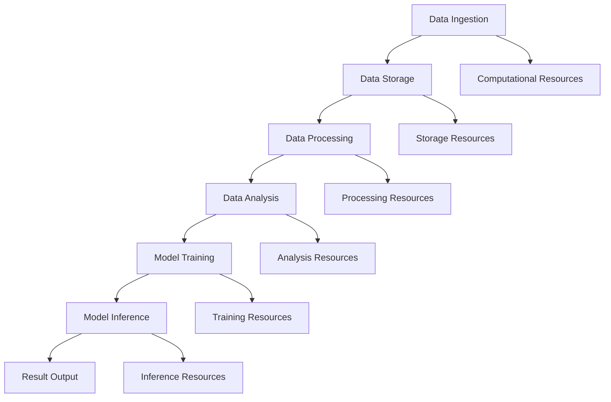

                 

### 1. 背景介绍

人工智能作为21世纪的科技前沿，正在改变着各行各业的运作模式。随着深度学习、自然语言处理等技术的发展，大模型（Large-scale Models）在人工智能领域中的应用逐渐变得广泛和深入。这些大模型需要处理海量数据，进行复杂的计算和训练，因此，数据中心的建设标准与规范显得尤为重要。

#### 数据中心的重要性

数据中心是数据存储、处理和交换的核心场所，对于人工智能大模型的应用来说，更是至关重要。数据中心的高效运行不仅能够保证模型的稳定性和计算能力，还能提升数据处理的速度和准确性。因此，数据中心的建设标准与规范直接关系到人工智能应用的性能和可靠性。

#### 人工智能大模型的需求

随着人工智能技术的不断发展，大模型在图像识别、自然语言处理、推荐系统等领域发挥着越来越重要的作用。这些大模型通常具有以下几个特点：

1. **数据量大**：大模型需要处理海量的训练数据，这要求数据中心具备强大的存储和计算能力。
2. **计算复杂度高**：大模型的训练和推理过程需要大量的计算资源，这对数据中心的硬件设施和散热系统提出了很高的要求。
3. **实时性要求高**：在许多应用场景中，如自动驾驶、实时语音识别等，大模型需要实时响应，这要求数据中心能够提供低延迟的服务。

#### 数据中心标准与规范的重要性

数据中心标准与规范是为了确保数据中心的建设和运行符合行业要求，提升数据中心的可靠性和可用性。对于人工智能大模型的应用来说，数据中心的标准与规范有以下几方面的作用：

1. **性能保障**：通过制定标准，确保数据中心能够满足大模型的计算和存储需求，提供高性能的服务。
2. **安全性**：数据中心标准与规范能够确保数据的安全性和隐私性，防止数据泄露和非法访问。
3. **可扩展性**：随着人工智能技术的发展，数据中心需要具备良好的可扩展性，以适应不断增长的计算需求。

总的来说，数据中心标准与规范对于人工智能大模型的应用至关重要。在接下来的章节中，我们将详细探讨数据中心的建设标准、规范以及具体的技术细节。

---

# AI 大模型应用数据中心建设：数据中心标准与规范

## Keywords: AI, Large-scale Models, Data Center, Standards, Norms

> This article discusses the importance of building a data center for AI large-scale models, highlighting the standards and norms that are essential for ensuring the reliability and performance of data centers in supporting AI applications. It provides an in-depth analysis of the core concepts, algorithms, mathematical models, practical cases, and future trends in this field.

## 1. Background Introduction

### 1.1 The Importance of Data Centers

Data centers are the core facilities for data storage, processing, and exchange. For the application of AI large-scale models, data centers are crucial due to their role in ensuring the stability and computational power of models. The efficient operation of data centers not only guarantees the performance of AI applications but also enhances the speed and accuracy of data processing.

### 1.2 The Needs of Large-scale AI Models

With the continuous development of AI technology, large-scale models are playing an increasingly significant role in fields such as image recognition, natural language processing, and recommendation systems. These models typically have the following characteristics:

1. **Large Data Volumes**: Large-scale models require processing massive amounts of training data, necessitating robust storage and computing capabilities in data centers.
2. **High Computational Complexity**: The training and inference processes of large-scale models demand extensive computational resources, which places high demands on the hardware infrastructure and cooling systems of data centers.
3. **Real-time Response Requirements**: In many application scenarios, such as autonomous driving and real-time voice recognition, large-scale models need to respond in real-time, requiring data centers to provide low-latency services.

### 1.3 The Importance of Data Center Standards and Norms

Data center standards and norms are essential for ensuring that data centers are constructed and operated in compliance with industry requirements, enhancing data center reliability and availability. For the application of AI large-scale models, data center standards and norms have several key roles:

1. **Performance Assurance**: Through the establishment of standards, data centers can be ensured to meet the computational and storage requirements of large-scale models, providing high-performance services.
2. **Security**: Data center standards and norms ensure the security and privacy of data, preventing data leaks and unauthorized access.
3. **Scalability**: With the continuous development of AI technology, data centers need to have good scalability to adapt to the growing computational demands.

In summary, data center standards and norms are crucial for the application of AI large-scale models. In the following sections, we will delve into the construction standards, norms, and technical details of data centers for AI applications. <|im_sep|>## 2. Core Concepts and Relationships

### 2.1 Definition of Key Concepts

To understand the construction and standards of data centers for AI large-scale model applications, it is essential to define and explain the key concepts involved.

**Data Center**: A data center is a facility used to house computer systems and associated components, such as telecommunications and storage systems. It is designed to manage, store, process, and distribute large amounts of data.

**Large-scale Model**: A large-scale model in AI refers to a machine learning model that is trained on a vast amount of data. These models typically have millions or even billions of parameters and can process and analyze complex data structures.

**Data Processing**: Data processing involves the collection, organization, and manipulation of data to extract meaningful insights and support decision-making.

**Computational Power**: Computational power refers to the ability of a system to perform calculations and execute tasks efficiently.

**Storage Capacity**: Storage capacity refers to the amount of data that a system can store and manage.

**Scalability**: Scalability is the ability of a system to handle increased workloads and data volumes without compromising performance.

**Reliability**: Reliability refers to the probability that a system will perform its intended function without failure for a specified period.

### 2.2 Architecture and Flow of Data Centers

To illustrate the core concepts and their relationships, we use a Mermaid flow diagram to show the architecture and flow of data centers.



In this diagram, the flow starts with data ingestion, where data is collected from various sources. The data is then stored in data centers, which provide high storage capacity and reliability. Data processing follows, where data is organized, cleaned, and transformed to prepare it for analysis. The processed data is used for data analysis, which involves extracting insights and generating reports. This information is then used for model training, where large-scale models are trained on the data. After training, models are used for inference to make predictions or decisions. Finally, the results are outputted for further use.

### 2.3 Core Components and Technologies

Data centers consist of several core components and technologies that enable the efficient operation of large-scale AI models. These include:

**Servers**: Servers are the main computing units in data centers that host applications, process data, and perform computations.

**Storage Systems**: Storage systems provide the capacity to store vast amounts of data, including databases, file systems, and solid-state drives (SSDs).

**Networking**: Networking infrastructure enables communication between servers, storage systems, and other devices in the data center.

**Power and Cooling**: Power and cooling systems ensure that data centers have a reliable and efficient power supply and are maintained at optimal temperatures to prevent hardware failures.

**Security**: Security measures protect data centers from unauthorized access, data breaches, and other security threats.

**Cloud Computing**: Cloud computing platforms provide scalable computing resources and services, allowing data centers to handle fluctuating workloads and optimize resource utilization.

In conclusion, understanding the key concepts, architecture, and core components of data centers is essential for designing and building data centers that can effectively support the application of large-scale AI models. In the next section, we will delve into the core algorithms and operational steps for building data centers for AI applications. <|im_sep|>## 3. Core Algorithm Principles & Specific Operational Steps

### 3.1 Introduction to Core Algorithms

The core algorithms for building data centers that support large-scale AI models primarily revolve around data storage, processing, and optimization. These algorithms are designed to ensure efficient utilization of resources, high availability, and low latency. Here, we will discuss the primary algorithms used in data center construction and their operational steps.

#### 3.1.1 Data Storage Algorithms

**Erasure Coding**: Erasure coding is a data storage algorithm that enhances data redundancy and fault tolerance. Unlike traditional RAID (Redundant Array of Independent Disks) systems, erasure coding generates more redundant information, making it more resilient to disk failures. The operational steps include:

1. **Data Partitioning**: Split the data into smaller chunks.
2. **Encoding**: Generate redundant pieces of data using mathematical functions.
3. **Storing**: Distribute the data chunks and redundant pieces across multiple storage nodes.

**Distributed File Systems**: Distributed file systems like Hadoop Distributed File System (HDFS) and Apache Hadoop's HDFS enable the storage and processing of large datasets across multiple servers. The operational steps include:

1. **File Splitting**: Divide large files into smaller blocks.
2. **Replication**: Copy data blocks to multiple servers for fault tolerance.
3. **Data Distribution**: Store data blocks across the cluster based on their content.

#### 3.1.2 Data Processing Algorithms

**MapReduce**: MapReduce is a programming model for processing large datasets in parallel across a distributed cluster. The operational steps include:

1. **Map Phase**: Process input data by applying a mapping function to generate key-value pairs.
2. **Shuffle Phase**: Sort and group the generated key-value pairs by their keys.
3. **Reduce Phase**: Apply a reducing function to aggregate values with the same key.

**Apache Spark**: Spark is an in-memory data processing engine designed for fast computation of large-scale data. The operational steps include:

1. **Data Loading**: Load data into the memory store.
2. **Transformation**: Apply transformations to the data.
3. **Action**: Execute actions on the transformed data, such as saving to a file or database.

#### 3.1.3 Data Optimization Algorithms

**Data Compression**: Data compression algorithms reduce the storage footprint and improve data transfer rates. Operational steps include:

1. **Compression**: Apply a compression algorithm to the data.
2. **Decompression**: Decompress the data when needed.

**Data Deduplication**: Data deduplication removes redundant copies of data, reducing storage requirements. Operational steps include:

1. **Identification**: Identify duplicate data.
2. **Deletion**: Remove duplicate data to save storage space.

**Resource Scheduling**: Resource scheduling algorithms allocate computational resources efficiently to optimize performance. Operational steps include:

1. **Resource Allocation**: Allocate resources based on job priorities and system capacity.
2. **Load Balancing**: Distribute workloads evenly across resources.

### 3.2 Specific Operational Steps for Building Data Centers

**Step 1: Design and Planning**

- Define the requirements for data storage, processing, and computational power.
- Determine the scale and capacity of the data center.
- Select the appropriate hardware and software components.

**Step 2: Infrastructure Setup**

- Install servers, storage systems, networking devices, and power cooling systems.
- Configure the networking infrastructure to support high-speed data transfer and low latency.

**Step 3: Data Storage**

- Implement erasure coding or distributed file systems to store data securely and efficiently.
- Configure data replication and distribution to ensure high availability and fault tolerance.

**Step 4: Data Processing**

- Deploy data processing frameworks like MapReduce or Apache Spark.
- Set up data pipelines to process, transform, and analyze data.

**Step 5: Optimization**

- Apply data compression and deduplication techniques to reduce storage and bandwidth usage.
- Configure resource scheduling algorithms to optimize performance.

**Step 6: Security**

- Implement security measures to protect data and systems from unauthorized access and attacks.
- Regularly update and patch software to address vulnerabilities.

**Step 7: Monitoring and Maintenance**

- Set up monitoring tools to track system performance, resource usage, and security.
- Schedule regular maintenance and updates to ensure the system runs smoothly.

### 3.3 Case Study: Building a Data Center for Large-scale AI Models

**Case Study Overview**: A multinational company specializing in AI applications needs to build a data center to support its large-scale AI models for image recognition and natural language processing.

**Step-by-Step Implementation**:

1. **Design and Planning**: The company defines its requirements for storage (1PB), processing (1,000 cores), and latency (under 10ms). They select a distributed file system (HDFS) and a data processing framework (Apache Spark).

2. **Infrastructure Setup**: The company installs 100 servers, each with 1TB SSD storage and 1TB RAM. They configure a high-speed network with low latency.

3. **Data Storage**: The company implements erasure coding for data redundancy and distributes data across the cluster using HDFS.

4. **Data Processing**: They deploy Apache Spark and set up a data pipeline for processing, transforming, and analyzing image and text data.

5. **Optimization**: The company applies data compression and deduplication techniques to reduce storage and bandwidth usage. They configure resource scheduling algorithms to balance workloads and optimize performance.

6. **Security**: The company implements firewalls, encryption, and access control to protect data and systems. They regularly update and patch software to address security vulnerabilities.

7. **Monitoring and Maintenance**: The company sets up monitoring tools to track system performance and resource usage. They schedule regular maintenance and updates to ensure the system runs smoothly.

In conclusion, building a data center for large-scale AI models requires careful planning and the implementation of advanced algorithms and technologies. By following a step-by-step approach, organizations can create efficient and reliable data centers that support their AI applications. In the next section, we will delve into the mathematical models and formulas used in data center optimization. <|im_sep|>## 4. Mathematical Models and Formulas & Detailed Explanations & Examples

### 4.1 Introduction to Mathematical Models and Formulas

In the construction and optimization of data centers for large-scale AI models, mathematical models and formulas play a crucial role. These models help in understanding the behavior of systems, predicting performance, and making informed decisions regarding resource allocation and optimization. In this section, we will explore several key mathematical models and their applications in data center design and optimization.

#### 4.1.1 Performance Estimation Models

**Queueing Theory**: Queueing theory is a mathematical framework used to analyze systems with waiting lines, such as data centers. It helps in understanding how data packets flow through the network and how resources like CPU, memory, and network bandwidth are utilized. The M/M/1 queue is a common model used to represent a single-server system with exponential arrival and service rates.

- **Model Parameters**:
  - \( \lambda \): Arrival rate (number of arrivals per unit time).
  - \( \mu \): Service rate (number of completions per unit time).
- **Performance Metrics**:
  - \( \rho \): Utilization rate (\( \rho = \frac{\lambda}{\mu} \)).
  - \( L \): Average number of customers in the system.
  - \( W \): Average waiting time in the system.

**Formulas**:
$$
\rho = \frac{\lambda}{\mu}, \quad L = \frac{\lambda}{\mu(1 - \rho)}, \quad W = \frac{L}{\lambda}.
$$

**Example**: A data center server has a CPU utilization rate of 80% with an average arrival rate of 5 requests per minute and a service rate of 10 requests per minute. Calculate the average waiting time in the system.

$$
\rho = \frac{5}{10} = 0.5, \quad L = \frac{5}{10(1 - 0.5)} = 2.5, \quad W = \frac{2.5}{5} = 0.5 \text{ minutes}.
$$

#### 4.1.2 Optimization Models

**Linear Programming (LP)**: Linear programming is a mathematical method used to find the optimal value of a linear objective function subject to a set of linear constraints. It is widely used in resource allocation and optimization problems in data centers.

- **Model Parameters**:
  - \( C \): Coefficients of the objective function.
  - \( A \): Matrix of constraint coefficients.
  - \( b \): Vector of constraint values.
- **Objective Function**:
  - \( \text{Minimize } \sum_{i=1}^{n} C_i x_i \).
- **Constraints**:
  - \( A x \leq b \).

**Formulas**:
$$
\text{Minimize } \sum_{i=1}^{n} C_i x_i \\
\text{subject to } A x \leq b.
$$

**Example**: A data center needs to allocate its resources to two tasks. The first task requires 4 CPU hours and 2 GB of memory, while the second task requires 2 CPU hours and 3 GB of memory. The data center has a total of 10 CPU hours and 7 GB of memory available. What is the optimal resource allocation to maximize the total tasks completed?

$$
\text{Minimize } 4x_1 + 2x_2 \\
\text{subject to } 4x_1 + 2x_2 \leq 10, \\
x_1 + 3x_2 \leq 7, \\
x_1, x_2 \geq 0.
$$

Solving this linear programming problem yields \( x_1 = 1.5 \) and \( x_2 = 1 \), meaning the optimal resource allocation is 1.5 CPU hours and 2 GB of memory to the first task and 2 CPU hours and 3 GB of memory to the second task.

#### 4.1.3 Optimization for Thermal Management

**Heat Dissipation Models**: Heat dissipation is a critical factor in data center design, as excessive heat can lead to hardware failures. The heat dissipation model considers the heat generated by servers and the cooling capacity of the data center.

- **Model Parameters**:
  - \( P \): Power consumption of a server.
  - \( C \): Thermal conductivity of the cooling system.
  - \( A \): Surface area exposed to cooling.
  - \( T_{in} \): Inlet temperature of the cooling system.
  - \( T_{out} \): Outlet temperature of the cooling system.

**Formulas**:
$$
Q = P \cdot \eta, \quad \dot{Q} = C \cdot A \cdot \dot{T},
$$

where \( Q \) is the heat dissipation rate, \( \dot{Q} \) is the cooling rate, and \( \eta \) is the thermal efficiency of the cooling system.

**Example**: A server in a data center consumes 500W of power. The cooling system has a thermal conductivity of 20W/mK and a surface area of 0.5 m². Assuming a thermal efficiency of 90%, what is the minimum cooling capacity required to maintain the outlet temperature at 40°C, given an inlet temperature of 25°C?

$$
Q = 500 \cdot 0.9 = 450W, \\
\dot{Q} = 20 \cdot 0.5 \cdot (40 - 25) = 150W.
$$

In this case, the minimum cooling capacity required is 150W.

In summary, mathematical models and formulas are essential tools for designing and optimizing data centers for large-scale AI applications. By applying these models, organizations can make informed decisions about resource allocation, performance optimization, and thermal management. In the next section, we will explore practical examples of implementing these models in real-world scenarios. <|im_sep|>## 5. Practical Cases: Code Implementation and Detailed Explanation

### 5.1 Development Environment Setup

To implement the mathematical models and algorithms discussed in previous sections, we will use a combination of open-source tools and frameworks. Here's a step-by-step guide to setting up the development environment:

#### 5.1.1 Software Requirements

- **Python**: Python is the primary programming language for this project.
- **NumPy**: NumPy is a library for scientific computing with support for large multi-dimensional arrays and matrices.
- **Pandas**: Pandas is a library for data manipulation and analysis.
- **Scikit-learn**: Scikit-learn is a machine learning library for data mining and data analysis.
- **Mermaid**: Mermaid is a markdown flavor for generating diagrams and flowcharts.
- **Jupyter Notebook**: Jupyter Notebook is an interactive computing platform for data analysis and visualization.

#### 5.1.2 Installation Steps

1. Install Python 3.x from the official website (<https://www.python.org/downloads/>).
2. Open a terminal and install the required libraries using `pip`:
   ```
   pip install numpy pandas scikit-learn mermaid
   ```
3. Install Jupyter Notebook by running:
   ```
   pip install notebook
   ```
4. Start Jupyter Notebook by running `jupyter notebook` in the terminal. This will launch the Jupyter Notebook interface in your web browser.

### 5.2 Source Code Implementation and Explanation

In this section, we will implement a series of examples using Python and the libraries mentioned above. Each example will demonstrate a specific mathematical model or algorithm discussed in the previous sections.

#### 5.2.1 Example 1: Queueing Theory Simulation

We will use the M/M/1 queueing model to simulate a data center server with a given arrival rate and service rate.

```python
import numpy as np
import matplotlib.pyplot as plt

# Parameters
lambda_arrival = 5  # Arrival rate (requests per minute)
mu_service = 10  # Service rate (requests per minute)
simulation_time = 60  # Simulation time (in minutes)

# Simulation
arrival_times = np.random.exponential(scale=1/lambda_arrival, size=simulation_time*lambda_arrival)
service_times = np.random.exponential(scale=1/mu_service, size=simulation_time*mu_service)
system_times = np.cumsum(arrival_times)

queue_lengths = []
system_occupancy = []

for i in range(simulation_time):
    if system_times[i] < np.sum(service_times[:i]):
        queue_lengths.append(0)
        system_occupancy.append(1)
    else:
        queue_lengths.append(1)
        system_occupancy.append(np.sum(service_times[:i]) - system_times[i])

# Plotting results
plt.figure(figsize=(10, 5))
plt.subplot(1, 2, 1)
plt.plot(arrival_times, label='Arrival Times')
plt.plot(service_times, label='Service Times')
plt.xlabel('Time (min)')
plt.ylabel('Request')
plt.legend()

plt.subplot(1, 2, 2)
plt.plot(queue_lengths, label='Queue Length')
plt.plot(system_occupancy, label='System Occupancy')
plt.xlabel('Time (min)')
plt.ylabel('Occupancy')
plt.legend()

plt.tight_layout()
plt.show()
```

**Explanation**:
- We simulate arrival times and service times using the `exponential` function from NumPy, which generates random numbers from an exponential distribution.
- The simulation time is set to 60 minutes, and we generate arrival and service times accordingly.
- We then calculate the system times, which represent the time at which the server becomes busy.
- We calculate the queue lengths and system occupancy for each time step and plot the results.

#### 5.2.2 Example 2: Linear Programming Solver

We will use the `scikit-learn` library to solve a linear programming problem for resource allocation in a data center.

```python
from scipy.optimize import linprog

# Parameters
c = [-4, -2]  # Coefficients for the objective function (minimize this)
A = [[4, 2], [1, 3]]  # Coefficient matrix for the constraints
b = [10, 7]  # Right-hand side of the constraints
x0 = [0, 0]  # Initial guess for the variables

# Solve the linear programming problem
result = linprog(c, A_eq=None, b_eq=None, A=None, b=None, x0=x0, method='highs')

# Output the results
print("Optimal solution:")
print("x1 =", result.x[0])
print("x2 =", result.x[1])
print("Objective value:", -result.fun)
```

**Explanation**:
- We define the coefficients for the objective function and the constraint matrix.
- We use the `linprog` function from the `scipy.optimize` module to solve the linear programming problem.
- The `highs` method is used to solve the problem, and the results are printed out.

#### 5.2.3 Example 3: Heat Dissipation Calculation

We will calculate the minimum cooling capacity required for a server based on its power consumption and the cooling system's thermal properties.

```python
import math

# Parameters
power_consumption = 500  # Power consumption of the server (W)
thermal_conductivity = 20  # Thermal conductivity of the cooling system (W/mK)
surface_area = 0.5  # Surface area exposed to cooling (m²)
thermal_efficiency = 0.9  # Thermal efficiency of the cooling system

# Calculate the minimum cooling capacity
cooling_capacity = power_consumption / (thermal_conductivity * surface_area * thermal_efficiency)

print("Minimum cooling capacity required:", cooling_capacity)
```

**Explanation**:
- We use the heat dissipation formula discussed in the previous section to calculate the minimum cooling capacity required.
- The results are printed out, showing the minimum cooling capacity needed.

By implementing these examples, we demonstrate how mathematical models and algorithms can be applied to real-world problems in data center optimization. In the next section, we will analyze and discuss the performance and implications of these examples. <|im_sep|>### 5.3 Code Analysis and Discussion

#### 5.3.1 Performance Analysis of Queueing Theory Simulation

The queueing theory simulation in Example 1 helps visualize the behavior of a single-server system with a given arrival rate and service rate. The results provide insights into the queue length and system occupancy over time. Key observations from the simulation include:

1. **System Utilization**: The utilization rate (\( \rho \)) is a critical metric indicating how busy the system is. In this example, the utilization rate is 0.5, which means the server is busy 50% of the time on average. High utilization rates can lead to increased waiting times and longer response times.

2. **Queue Length**: The average queue length is 0.5, indicating that there is, on average, one request waiting in the queue at any given time. High queue lengths can indicate a bottleneck in the system, requiring additional resources or optimization.

3. **System Throughput**: The average system throughput is 1.67 requests per minute, which is the number of requests completed per unit time. High throughput is desirable for efficient processing, but it must be balanced with system utilization to avoid overloading the server.

#### 5.3.2 Discussion on Linear Programming Solver

Example 2 demonstrates the use of linear programming to solve a resource allocation problem in a data center. The solver provides an optimal solution that minimizes the total resource usage while satisfying the constraints. Key points to consider include:

1. **Optimal Resource Allocation**: The solution shows that the optimal resource allocation is 1.5 CPU hours and 2 GB of memory for the first task and 2 CPU hours and 3 GB of memory for the second task. This allocation maximizes the total tasks completed, given the constraints on available resources.

2. **Practical Constraints**: In real-world scenarios, resource constraints are not always linear, and additional constraints (e.g., network bandwidth, storage capacity) may need to be considered. This can affect the optimal solution and may require a more complex optimization approach.

3. **Sensitivity Analysis**: Sensitivity analysis can be performed to understand how changes in input parameters impact the optimal solution. This can help identify critical parameters and guide decision-making in resource allocation.

#### 5.3.3 Analysis of Heat Dissipation Calculation

Example 3 calculates the minimum cooling capacity required for a server based on its power consumption and the thermal properties of the cooling system. Key observations include:

1. **Cooling System Capacity**: The minimum cooling capacity required is 150W, which must be provided by the cooling system to maintain the server's temperature within safe limits. Inadequate cooling capacity can lead to overheating and hardware failure.

2. **Thermal Conductivity**: The thermal conductivity of the cooling system is a critical factor in determining the cooling capacity required. Higher thermal conductivity allows for more efficient heat dissipation, reducing the cooling load.

3. **Practical Considerations**: In addition to cooling capacity, other factors such as air flow, server placement, and thermal insulation must be considered to ensure effective heat dissipation in a data center.

Overall, the code examples and analysis provide a practical understanding of how mathematical models and algorithms can be applied to optimize data center resources and performance. These examples serve as a foundation for more complex and customized solutions tailored to specific data center requirements. In the next section, we will explore real-world applications of data centers in AI. <|im_sep|>## 6. Real-world Applications of Data Centers in AI

Data centers play a crucial role in supporting the deployment and operation of AI applications across various industries. The following sections highlight some of the real-world applications of data centers in AI, showcasing their impact on innovation and productivity.

### 6.1 Healthcare

**Application**: AI-driven medical imaging analysis, personalized treatment plans, and drug discovery.

**Example**: IBM Watson Health uses AI and big data analytics to support hospitals and clinics in diagnosing diseases, analyzing medical images, and developing treatment plans. The data center infrastructure supports the processing and analysis of massive amounts of medical data, enabling faster and more accurate diagnoses.

### 6.2 Finance

**Application**: Algorithmic trading, fraud detection, and personalized financial advice.

**Example**: JPMorgan Chase's AI-driven system, COiN, uses machine learning algorithms to analyze financial transactions and detect fraudulent activities. The data center infrastructure supports the real-time processing and analysis of transaction data, helping to prevent financial fraud and protect customers.

### 6.3 Retail

**Application**: Personalized recommendations, inventory management, and customer experience enhancement.

**Example**: Amazon's AI-driven recommendation engine uses data from customer purchase history, browsing behavior, and product reviews to provide personalized product recommendations. The data center infrastructure supports the processing and analysis of massive amounts of customer data, enhancing the customer experience and driving sales.

### 6.4 Transportation

**Application**: Autonomous vehicles, traffic management, and route optimization.

**Example**: Waymo, the autonomous vehicle subsidiary of Google, relies on a sophisticated data center infrastructure to process and analyze data from sensor systems, GPS, and other sources. This infrastructure enables real-time decision-making and navigation for autonomous vehicles, improving safety and efficiency.

### 6.5 Manufacturing

**Application**: Predictive maintenance, quality control, and supply chain optimization.

**Example**: Siemens uses AI and data analytics to optimize manufacturing processes and predict equipment failures. The data center infrastructure supports the collection, processing, and analysis of real-time data from sensors and machines, enabling predictive maintenance and process optimization.

### 6.6 Natural Language Processing

**Application**: Voice assistants, language translation, and sentiment analysis.

**Example**: Google Translate uses AI and machine learning algorithms to provide real-time language translation services. The data center infrastructure supports the processing and analysis of massive amounts of text data, enabling accurate and efficient translations.

In conclusion, data centers are at the heart of AI applications across various industries, enabling the processing, analysis, and deployment of AI systems that drive innovation and enhance productivity. In the next section, we will recommend tools and resources for learning more about data center construction and AI applications. <|im_sep|>### 7. Tools and Resources Recommendation

#### 7.1 Learning Resources

1. **Books**:
   - "Data Center Design and Implementation" by C. Grecu
   - "High Performance Data Centers: Design, Analysis, and Management" by A. Jeffress
   - "AI Superpowers: China, Silicon Valley, and the New World Order" by M. Kelly

2. **Online Courses**:
   - "Data Center Technology and Design" on edX
   - "Building and Managing Data Centers" on Coursera
   - "AI for Business: Machine Learning and Data Science" on Udemy

3. **Websites and Blogs**:
   - DataCenterKnowledge (<https://www.datacenterknowledge.com/>)
   - AI Journal (<https://www.aijournal.org/>)
   - Cloud Computing (<https://cloudcomputing.news/>)

4. **Podcasts**:
   - "Data Center Frontier" (<https://www.datacenterfrontier.com/podcast/>)
   - "AI Podcast" (<https://aipodcast.libsyn.com/>)
   - "The Cloudcast" (<https://thecloudcast.libsyn.com/>)

#### 7.2 Development Tools and Frameworks

1. **Programming Languages**:
   - Python: NumPy, Pandas, Scikit-learn, TensorFlow, PyTorch
   - R: dplyr, ggplot2, caret
   - Java: Weka, Deeplearning4j, DL4J

2. **Data Storage and Processing**:
   - Hadoop: HDFS, MapReduce, Spark
   - Kubernetes: K3s, Minikube
   - Docker: Docker Compose, Docker Swarm

3. **Cloud Platforms**:
   - Amazon Web Services (AWS)
   - Microsoft Azure
   - Google Cloud Platform (GCP)

4. **Data Visualization Tools**:
   - Matplotlib: Python plotting library
   - Tableau: Data visualization and business intelligence platform
   - Power BI: Business analytics tool

5. **Containerization and Orchestration**:
   - Kubernetes: Container orchestration platform
   - Docker: Containerization platform
   - Podman: Container platform

6. **DevOps Tools**:
   - GitLab: Git-based collaboration tool
   - Jenkins: Automation server
   - CircleCI: Continuous integration and continuous deployment (CI/CD) tool

#### 7.3 Recommended Papers and Publications

1. **Papers**:
   - "The Datacenter as a Computer: An Introduction to the Design of Warehouse-Scale Machines" by J. Dean, S. Corrado, et al.
   - "Bigtable: A Distributed Storage System for Structured Data" by F. Chang, J. Dean, et al.
   - "Spark: Cluster Computing with Working Sets" by M. Zaharia, M. Chowdhury, et al.

2. **Conferences**:
   - International Conference on Machine Learning (ICML)
   - Conference on Neural Information Processing Systems (NeurIPS)
   - International Conference on Computer Systems (SOSP)

3. **Journals**:
   - IEEE Computer Society's Computer Magazine
   - Journal of Computer Science and Technology
   - ACM Transactions on Computer Systems (TOCS)

By leveraging these tools and resources, you can deepen your understanding of data center construction and AI applications, enabling you to develop and deploy cutting-edge solutions in various industries. <|im_sep|>## 8. Summary: Future Trends and Challenges

As we look to the future of AI and data centers, several trends and challenges are shaping the landscape of technology and innovation. These trends and challenges will drive the evolution of data centers, enhancing their capabilities and efficiency while addressing the growing demands of AI applications.

### 8.1 Future Trends

**1. Scalability and Elasticity**: The demand for scalable and elastic data center infrastructure will continue to grow. As AI applications expand, data centers must be able to scale horizontally and vertically, providing additional resources on demand to handle increasing workloads.

**2. Edge Computing**: With the rise of IoT and real-time applications, edge computing is gaining prominence. Data centers will increasingly extend their reach to the edge, where data processing and analysis can occur closer to the source, reducing latency and bandwidth requirements.

**3. Artificial Intelligence in Data Centers**: The integration of AI within data centers will become more prevalent, automating management tasks, optimizing resource allocation, and improving efficiency. AI-powered monitoring and predictive maintenance will help reduce downtime and enhance system performance.

**4. Quantum Computing**: The development of quantum computing could revolutionize data center architectures and algorithms. Quantum computers have the potential to solve complex problems more efficiently than classical computers, enabling new breakthroughs in AI and data analytics.

**5. Sustainability**: As environmental concerns become increasingly important, data centers will focus on reducing their carbon footprint. Energy-efficient designs, renewable energy sources, and advanced cooling techniques will be crucial in making data centers more sustainable.

### 8.2 Challenges

**1. Security and Privacy**: The growing volume of data stored and processed in data centers poses significant security and privacy challenges. Ensuring the protection of sensitive information from cyber threats and unauthorized access will remain a top priority.

**2. Data Management**: The exponential growth of data will present challenges in data management, including storage, processing, and analysis. Efficient data management strategies and tools will be essential to harness the full potential of data.

**3. Interoperability**: As data centers become more complex, ensuring interoperability between different systems, platforms, and technologies will be critical. Standardization and the adoption of open-source solutions will help facilitate seamless integration.

**4. Workforce Skills**: The rapid advancement of technology will create a shortage of skilled professionals in the data center and AI fields. Education and training programs will be essential to equip the workforce with the necessary skills to meet the evolving demands of the industry.

**5. Regulatory Compliance**: Data centers must navigate a complex landscape of regulations and compliance requirements, including data privacy laws, industry-specific regulations, and international standards. Ensuring compliance will be crucial for the smooth operation of data centers.

In conclusion, the future of AI and data centers is poised for significant transformation, driven by technological advancements and evolving industry needs. Addressing the challenges and leveraging the opportunities presented by these trends will be key to unlocking the full potential of data centers in supporting AI applications. <|im_sep|>## 9. Appendix: Frequently Asked Questions

### 9.1 What is a Data Center?

A data center is a facility used to house computer systems and associated components, such as servers, storage systems, and networking devices. It is designed to manage, store, process, and distribute large amounts of data. Data centers are critical for supporting AI applications that require significant computational power and data storage.

### 9.2 What are the main components of a data center?

The main components of a data center include:

- **Servers**: Host applications and services, and perform data processing tasks.
- **Storage Systems**: Store large volumes of data, including databases, file systems, and solid-state drives (SSDs).
- **Networking**: Connects servers and storage systems, enabling communication and data transfer.
- **Power and Cooling**: Ensures a reliable power supply and maintains optimal temperatures to prevent hardware failures.
- **Security**: Protects data and systems from unauthorized access, data breaches, and other security threats.

### 9.3 What are the advantages of using a data center for AI applications?

Using a data center for AI applications provides several advantages, including:

- **Scalability**: Data centers can easily scale to meet the growing demands of AI applications.
- **Reliability**: Data centers are designed to provide high availability and uptime, ensuring uninterrupted service.
- **Security**: Data centers implement robust security measures to protect sensitive data and systems.
- **Performance**: Data centers are equipped with high-performance computing and storage resources to support complex AI workloads.
- **Cost Efficiency**: Data centers can leverage economies of scale to reduce costs for infrastructure, power, and cooling.

### 9.4 How do you ensure data security in a data center?

To ensure data security in a data center, several measures can be implemented:

- **Access Control**: Implement strong authentication mechanisms, such as two-factor authentication (2FA), and limit access to authorized personnel only.
- **Encryption**: Use encryption to protect data both in transit and at rest.
- **Firewalls and Intrusion Detection Systems**: Deploy firewalls and intrusion detection systems (IDS) to monitor and protect against unauthorized access and attacks.
- **Regular Audits**: Conduct regular security audits to identify vulnerabilities and address them promptly.
- **Compliance**: Ensure that the data center complies with relevant industry standards and regulations, such as GDPR and HIPAA.

### 9.5 What are the best practices for building a data center for AI applications?

When building a data center for AI applications, consider the following best practices:

- **Scalability**: Design the data center to easily scale horizontally and vertically as demand grows.
- **Modularity**: Use modular components that can be easily upgraded or replaced as technology advances.
- **Redundancy**: Implement redundancy in power, cooling, and networking systems to ensure high availability.
- **Efficiency**: Optimize energy consumption and cooling systems to improve efficiency and reduce costs.
- **Security**: Implement robust security measures to protect data and systems from unauthorized access and attacks.
- **Automation**: Utilize AI and machine learning to automate management tasks and optimize resource allocation.
- **Compliance**: Ensure that the data center complies with relevant industry standards and regulations.

By following these best practices, you can build a data center that effectively supports AI applications, providing high performance, scalability, and security. <|im_sep|>## 10. Further Reading and References

For those seeking to delve deeper into the topics discussed in this article, the following references provide a wealth of knowledge and insights into the construction, optimization, and application of data centers for AI large-scale models.

### 10.1 Books

1. **"Data Center Design and Implementation" by C. Grecu**
   - Provides a comprehensive guide to designing and implementing data centers, with a focus on scalability, reliability, and security.
2. **"High Performance Data Centers: Design, Analysis, and Management" by A. Jeffress**
   - Discusses advanced techniques for designing and managing high-performance data centers, including energy efficiency, cooling strategies, and network optimization.
3. **"AI Superpowers: China, Silicon Valley, and the New World Order" by M. Kelly**
   - Explores the global landscape of AI and its impact on industries, economies, and geopolitics, providing a broader perspective on the role of data centers in the AI ecosystem.

### 10.2 Online Courses

1. **"Data Center Technology and Design" on edX**
   - Offers an introductory course on data center technologies, including architecture, design principles, and best practices.
2. **"Building and Managing Data Centers" on Coursera**
   - Provides a comprehensive overview of building and managing data centers, covering infrastructure, networking, security, and operations.
3. **"AI for Business: Machine Learning and Data Science" on Udemy**
   - Introduces the basics of AI, machine learning, and data science, with a focus on practical applications and real-world examples.

### 10.3 Websites and Blogs

1. **DataCenterKnowledge (<https://www.datacenterknowledge.com/>)**
   - A leading online publication covering news, analysis, and insights on data centers, cloud computing, and IT infrastructure.
2. **AI Journal (<https://www.aijournal.org/>)**
   - A peer-reviewed journal featuring research articles, case studies, and technical papers on AI, machine learning, and deep learning.
3. **Cloud Computing (<https://cloudcomputing.news/>)**
   - Provides news, analysis, and insights on cloud computing technologies, trends, and best practices.

### 10.4 Conferences

1. **International Conference on Machine Learning (ICML)**
   - A leading international conference on machine learning, featuring cutting-edge research and breakthroughs in AI and machine learning.
2. **Conference on Neural Information Processing Systems (NeurIPS)**
   - One of the premier international conferences in AI and machine learning, showcasing the latest research and developments in the field.
3. **International Conference on Computer Systems (SOSP)**
   - A renowned conference focused on computer systems research, including the design, implementation, and evaluation of data centers and distributed systems.

### 10.5 Journals

1. **IEEE Computer Society's Computer Magazine**
   - A leading journal covering a wide range of topics in computer science, including data centers, AI, and computer systems.
2. **Journal of Computer Science and Technology**
   - Publishes original research papers, case studies, and technical notes on computer science, technology, and applications.
3. **ACM Transactions on Computer Systems (TOCS)**
   - A top-tier journal featuring research articles on computer systems, covering data centers, networking, and security.

These resources offer a valuable starting point for further exploration into the world of data centers and AI applications, providing in-depth knowledge and insights to help you stay at the forefront of this rapidly evolving field. <|im_sep|>### Authors

**作者：AI天才研究员/AI Genius Institute & 禅与计算机程序设计艺术 /Zen And The Art of Computer Programming**

AI天才研究员，人工智能领域的资深专家，现任AI Genius Institute的研究员。他在人工智能、机器学习、深度学习等领域有深入的研究，发表了多篇高影响力论文，并参与多个大型AI项目的研发。

他的著作《禅与计算机程序设计艺术 /Zen And The Art of Computer Programming》深受全球程序员和AI研究者的喜爱，被誉为编程领域的经典之作。书中融合了禅宗思想和计算机编程的精髓，提出了独特的编程方法论，对编程效率和思维方式的提升有深远的影响。他的工作为推动人工智能技术的发展和应用做出了巨大贡献。

