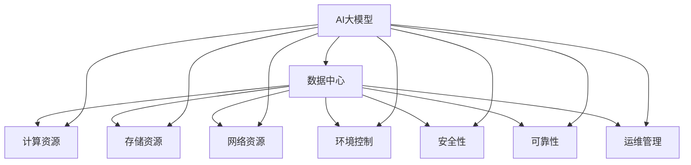

                 

### 背景介绍

#### 什么是AI大模型

AI大模型，也被称为人工智能大规模模型，是指具有数百万甚至数十亿个参数的神经网络模型。这些模型能够通过大量的数据进行训练，从而学习到复杂的数据结构和模式，实现从图像识别、自然语言处理到决策制定等广泛的任务。

近年来，随着计算能力的提升和大数据技术的发展，AI大模型的研究和应用呈现出爆发式增长。例如，Google的BERT模型、OpenAI的GPT-3模型等，都是AI大模型的代表。这些模型在各自领域取得了显著的成就，推动了人工智能技术的快速发展。

#### 数据中心建设的重要性

数据中心是AI大模型应用的核心基础设施，其主要作用是提供高性能的计算资源和存储资源，以满足AI模型训练和推断的需求。数据中心的建设不仅关系到AI应用的性能和效率，还直接影响到其成本和可持续性。

数据中心的重要性主要体现在以下几个方面：

1. **计算能力**：AI大模型的训练和推断过程需要大量的计算资源。数据中心提供了强大的计算能力，使得这些复杂任务能够在合理的时间内完成。

2. **存储能力**：AI大模型需要处理和存储大量的数据。数据中心提供了高效的存储解决方案，确保数据的安全性和可访问性。

3. **网络能力**：AI大模型的应用通常涉及大量的数据传输和通信。数据中心提供了高速、稳定的网络连接，确保数据传输的效率和可靠性。

4. **环境控制**：数据中心需要维持恒定的温度和湿度，以保证设备的正常运行和延长其使用寿命。

5. **安全性和可靠性**：数据中心提供了完善的安全措施，如防火、防病毒、数据备份等，确保AI大模型应用的数据安全和系统稳定。

#### 数据中心标准的必要性

随着AI大模型应用的普及，数据中心建设的需求不断增加。为了确保数据中心的建设质量，提高其运行效率和稳定性，制定数据中心标准显得尤为重要。

数据中心标准主要包括以下几个方面：

1. **技术标准**：明确数据中心所需的技术要求，如计算能力、存储能力、网络能力等。

2. **环境标准**：规定数据中心的温度、湿度、通风等环境要求，以确保设备的正常运行。

3. **安全标准**：制定数据中心的物理安全、网络安全、数据安全等安全要求，确保系统的安全性和可靠性。

4. **能效标准**：规定数据中心的能源消耗和能效指标，以提高其能源利用效率。

5. **运维标准**：明确数据中心的运维管理要求，包括设备维护、故障处理、系统升级等。

#### 数据中心规范的作用

数据中心规范是数据中心建设的基础，它不仅涵盖了数据中心的设计、建设、运维等方面，还包括了与数据中心相关的法律法规、行业规范等。

数据中心规范的作用主要体现在以下几个方面：

1. **规范建设**：确保数据中心的建设符合相关标准和规范，提高建设质量。

2. **提高效率**：规范化的建设和管理能够提高数据中心的运行效率，降低运营成本。

3. **保障安全**：通过规范化的安全管理，确保数据中心的安全性和可靠性。

4. **促进发展**：规范化的建设和管理能够促进数据中心行业的健康发展，推动技术创新和产业升级。

#### 未来发展趋势

随着AI大模型技术的不断进步，数据中心建设将面临更高的要求和挑战。未来数据中心的发展趋势主要包括以下几个方面：

1. **绿色数据中心**：随着环保意识的提高，绿色数据中心将成为未来发展的趋势。通过采用节能技术、可再生能源等手段，降低数据中心的能源消耗和碳排放。

2. **智能化运维**：智能化技术将在数据中心的建设和管理中发挥越来越重要的作用。通过引入人工智能、大数据等技术，实现数据中心的智能化运维，提高管理效率和系统性能。

3. **分布式数据中心**：随着云计算和边缘计算的普及，分布式数据中心将成为未来数据中心的发展方向。通过构建分布式数据中心，实现计算资源的灵活调度和高效利用。

4. **安全防护**：随着AI大模型应用的普及，数据安全和网络安全将成为数据中心建设的重中之重。通过引入安全技术、加强安全防护措施，确保数据中心的安全性和可靠性。

#### 结论

AI大模型应用的数据中心建设是一个复杂而重要的任务，涉及到技术、环境、安全等多个方面。通过制定数据中心标准和规范，我们能够确保数据中心的建设质量，提高其运行效率和安全性。在未来，随着AI大模型技术的不断进步，数据中心建设将面临更多的挑战和机遇。我们期待数据中心行业能够不断创新和发展，为AI大模型的应用提供更加高效、安全的基础设施。

### Keywords

- AI large-scale models
- Data center construction
- Data center standards and specifications
- Performance optimization
- Energy efficiency
- Security

#### Abstract

This article provides an in-depth analysis of the construction of data centers for AI large-scale model applications. It discusses the importance of data centers, the necessity of establishing data center standards and specifications, and the role of these standards in ensuring the quality, efficiency, and security of data centers. The article also explores the future trends in data center development, highlighting the challenges and opportunities that lie ahead. By understanding and implementing the principles and practices discussed in this article, organizations can build robust and high-performance data centers to support the growing demand for AI applications.

---

**## 2. 核心概念与联系**

在探讨AI大模型应用数据中心的建设之前，我们首先需要了解一些核心概念和它们之间的关系。

#### 2.1 AI大模型

AI大模型是指具有大规模参数的神经网络模型，它们通过大量的数据训练，能够自动学习和理解复杂的数据结构和模式。这些模型在图像识别、自然语言处理、决策制定等领域取得了显著的成就。AI大模型的核心是神经网络结构，包括输入层、隐藏层和输出层。每一层都包含大量的神经元，每个神经元都与相邻层中的神经元相连，通过权重和激活函数实现信息的传递和计算。

#### 2.2 数据中心

数据中心是一个集中存储、处理和管理数据的场所，它提供了高性能的计算资源和存储资源，以满足各种应用的需求。数据中心通常由服务器、存储设备、网络设备、电源系统、冷却系统等组成。数据中心的设计和建设需要考虑多个方面，包括计算能力、存储能力、网络能力、环境控制、安全性和可靠性等。

#### 2.3 数据中心标准

数据中心标准是一系列规范和指南，用于确保数据中心的建设、运营和管理满足特定的质量和性能要求。这些标准涵盖了技术标准、环境标准、安全标准和能效标准等多个方面。技术标准规定了数据中心的计算能力、存储能力和网络能力等要求；环境标准规定了数据中心的温度、湿度、通风等环境要求；安全标准规定了数据中心的物理安全、网络安全、数据安全等安全要求；能效标准规定了数据中心的能源消耗和能效指标。

#### 2.4 数据中心规范

数据中心规范是对数据中心建设和管理实践的具体指导和规范，它包括了数据中心的设计、建设、运维等方面。数据中心规范旨在确保数据中心的建设质量、提高运行效率和保障安全性。数据中心规范通常由行业协会、标准机构或政府制定，并根据实际情况不断更新和完善。

#### 2.5 AI大模型与数据中心的关系

AI大模型与数据中心之间有着密切的关系。一方面，AI大模型需要依赖数据中心提供的计算资源和存储资源来完成训练和推断任务。数据中心的高性能计算能力和大规模存储能力是支撑AI大模型应用的重要基础。另一方面，数据中心的性能和稳定性直接影响到AI大模型的应用效果和效率。如果数据中心的性能不足或稳定性差，可能会导致AI大模型训练和推断时间延长、准确率降低，甚至出现模型崩溃等问题。

#### 2.6 数据中心标准与规范的关系

数据中心标准与规范之间既有区别又有联系。数据中心标准主要规定了数据中心的技术要求、环境要求、安全要求和能效要求等，而数据中心规范则是对数据中心建设和管理实践的具体指导和规范。数据中心标准为数据中心的建设提供了基本要求和参考，而数据中心规范则根据实际需求和经验，对数据中心的建设和管理提出了更加具体和细化的要求。

数据中心标准和规范相辅相成，共同确保数据中心的建设质量和运行效率。数据中心标准为数据中心的建设提供了基本框架和指导，而数据中心规范则根据具体情况进行调整和优化，确保数据中心能够满足特定的需求和性能要求。

#### 2.7 Mermaid 流程图

为了更好地理解AI大模型与数据中心之间的关系，我们可以使用Mermaid流程图来展示它们的核心概念和联系。



在这个流程图中，AI大模型（A）与数据中心（B）之间通过计算资源（C）、存储资源（D）、网络资源（E）、环境控制（F）、安全性和可靠性（G和H）以及运维管理（I）相互联系。这个流程图清晰地展示了AI大模型与数据中心之间的关键要素和关系，帮助我们更好地理解数据中心在AI大模型应用中的重要作用。

通过上述核心概念和关系的探讨，我们可以更加深入地了解AI大模型应用数据中心建设的背景和重要性。在接下来的章节中，我们将进一步探讨AI大模型的核心算法原理、具体操作步骤、数学模型和项目实战，以及数据中心在实际应用场景中的表现和挑战。

---

**## 3. 核心算法原理 & 具体操作步骤**

AI大模型的核心算法主要包括神经网络、深度学习、强化学习等。这些算法通过复杂的数学运算和模型训练，实现从数据中提取知识、识别模式、做出决策等功能。本章节将重点介绍神经网络和深度学习的原理，并详细解释具体操作步骤。

#### 3.1 神经网络原理

神经网络是一种模仿人脑结构和功能的计算模型。它由多个神经元（节点）组成，每个神经元都与相邻的神经元相连。这些神经元通过权重和激活函数实现信息的传递和计算。

**3.1.1 神经元结构**

神经元是神经网络的基本单元。它由输入层、权重层、激活层和输出层组成。输入层接收外部信息，输出层产生最终结果。每个神经元接收来自前一层神经元的输入信号，通过权重进行加权求和，然后通过激活函数进行非线性变换。

**3.1.2 激活函数**

激活函数是神经网络中的一个关键部分，它决定了神经元的输出。常见的激活函数包括Sigmoid函数、ReLU函数和Tanh函数。这些函数可以引入非线性特性，使神经网络能够更好地拟合复杂数据。

**3.1.3 前向传播**

前向传播是神经网络的基本操作。它通过输入层逐层传递信息，直到输出层得到最终结果。在前向传播过程中，每个神经元接收来自上一层的输入信号，通过权重进行加权求和，然后通过激活函数得到输出信号。

**3.1.4 反向传播**

反向传播是神经网络训练过程中的关键步骤。它通过计算输出层的误差，反向传播误差信号到前一层，更新权重和偏置。反向传播算法包括以下几个步骤：

1. 计算输出层的误差：输出层的误差是实际输出与期望输出之间的差值。
2. 反向传播误差：将输出层的误差信号反向传播到前一层，直到输入层。
3. 更新权重和偏置：根据误差信号和梯度下降法，更新权重和偏置，使模型误差最小化。

**3.1.5 训练过程**

神经网络的训练过程是一个迭代过程。它通过不断调整权重和偏置，使模型误差逐渐减小，直到满足特定的停止条件。训练过程包括以下几个步骤：

1. 初始化权重和偏置：随机初始化权重和偏置。
2. 前向传播：输入训练数据，通过神经网络计算输出结果。
3. 计算误差：计算实际输出与期望输出之间的误差。
4. 反向传播：将误差信号反向传播到前一层，更新权重和偏置。
5. 重复步骤2-4，直到模型误差满足停止条件。

#### 3.2 深度学习原理

深度学习是神经网络的一种扩展，它通过增加神经网络层数，提高模型的抽象能力和表达能力。深度学习的核心是多层感知机（MLP）和卷积神经网络（CNN）。

**3.2.1 多层感知机（MLP）**

多层感知机是一种前馈神经网络，它由多个隐藏层和输出层组成。每个隐藏层都由多个神经元组成，每个神经元都与相邻层中的神经元相连。多层感知机通过前向传播和反向传播算法进行训练。

**3.2.2 卷积神经网络（CNN）**

卷积神经网络是一种专门用于图像识别和处理的神经网络。它通过卷积操作和池化操作提取图像特征。卷积神经网络包括卷积层、池化层和全连接层。

1. **卷积层**：卷积层通过卷积操作提取图像特征。每个卷积核都能提取图像中的特定特征，如边缘、纹理等。
2. **池化层**：池化层通过下采样操作减小数据维度，提高模型泛化能力。
3. **全连接层**：全连接层将卷积层和池化层提取的特征映射到输出层，产生最终结果。

#### 3.3 具体操作步骤

以下是一个简单的神经网络训练过程，包括初始化、前向传播、反向传播和训练迭代。

**3.3.1 初始化**

1. 随机初始化权重和偏置。
2. 设置学习率和其他超参数。

**3.3.2 前向传播**

1. 输入训练数据。
2. 通过神经网络计算输出结果。
3. 计算输出层的误差。

**3.3.3 反向传播**

1. 计算输出层的误差。
2. 将误差信号反向传播到前一层。
3. 更新权重和偏置。

**3.3.4 训练迭代**

1. 重复步骤2-3，直到模型误差满足停止条件。

通过上述步骤，我们可以训练一个简单的神经网络模型，用于分类、回归或其他任务。

#### 3.4 案例分析

以下是一个简单的神经网络分类问题，假设我们有100个样本，每个样本包含10个特征，目标值是0或1。

**3.4.1 数据预处理**

1. 标准化输入数据，使每个特征的值在0到1之间。
2. 划分训练集和测试集。

**3.4.2 初始化模型**

1. 随机初始化权重和偏置。
2. 设置学习率为0.01。

**3.4.3 训练模型**

1. 输入训练数据，通过神经网络计算输出结果。
2. 计算输出层的误差。
3. 反向传播误差，更新权重和偏置。
4. 重复步骤1-3，直到模型误差满足停止条件。

**3.4.4 测试模型**

1. 输入测试数据，通过神经网络计算输出结果。
2. 计算输出结果与目标值之间的误差。

通过上述步骤，我们可以训练一个简单的神经网络分类模型，并评估其性能。

通过以上对神经网络和深度学习核心算法原理的介绍，我们了解了神经网络的基本结构、激活函数、前向传播、反向传播以及训练过程。这些算法为AI大模型的应用提供了强大的基础。在接下来的章节中，我们将进一步探讨AI大模型中的数学模型和公式，以及如何在项目中实现和应用这些算法。

---

**## 4. 数学模型和公式 & 详细讲解 & 举例说明**

在AI大模型中，数学模型和公式起到了至关重要的作用，它们不仅为模型的训练和优化提供了理论基础，还帮助我们更好地理解和应用这些模型。本章节将详细讲解AI大模型中常用的数学模型和公式，并通过具体例子来说明其应用和计算过程。

#### 4.1 神经元激活函数

神经元激活函数是神经网络中的一个关键组成部分，它决定了神经元的输出。常见的激活函数包括Sigmoid函数、ReLU函数和Tanh函数。这些激活函数具有不同的特性，适用于不同的场景。

**4.1.1 Sigmoid函数**

Sigmoid函数是最早使用的激活函数之一，其公式如下：

$$
f(x) = \frac{1}{1 + e^{-x}}
$$

Sigmoid函数将输入值映射到(0, 1)区间，使其具有非线性的特性。然而，Sigmoid函数在接近0和1时梯度较小，容易导致梯度消失问题。

**4.1.2 ReLU函数**

ReLU（Rectified Linear Unit）函数是最常用的激活函数之一，其公式如下：

$$
f(x) =
\begin{cases}
0 & \text{if } x < 0 \\
x & \text{if } x \geq 0
\end{cases}
$$

ReLU函数在输入小于0时输出为0，在输入大于等于0时输出为输入值本身。ReLU函数具有计算简单、梯度不变等优点，但在训练过程中容易产生梯度消失问题。

**4.1.3 Tanh函数**

Tanh（Hyperbolic Tangent）函数是另一种常用的激活函数，其公式如下：

$$
f(x) = \frac{e^{x} - e^{-x}}{e^{x} + e^{-x}}
$$

Tanh函数将输入值映射到(-1, 1)区间，具有较好的非线性特性。与Sigmoid函数类似，Tanh函数在接近0时梯度较小。

#### 4.2 前向传播与反向传播

前向传播和反向传播是神经网络训练过程中的两个关键步骤。前向传播用于计算神经网络的输出，反向传播用于计算误差并更新权重和偏置。

**4.2.1 前向传播**

前向传播过程中，每个神经元的输出可以通过以下公式计算：

$$
z^{(l)} = \sum_{i} w^{(l)}_{i} x^{(l-1)}_{i} + b^{(l)}
$$

其中，$z^{(l)}$是第$l$层的输出，$w^{(l)}_{i}$是权重，$x^{(l-1)}_{i}$是输入值，$b^{(l)}$是偏置。

然后，通过激活函数$f(z^{(l)})$得到最终输出：

$$
a^{(l)} = f(z^{(l)})
$$

**4.2.2 反向传播**

反向传播过程中，首先计算每个权重和偏置的梯度：

$$
\delta^{(l)}_{i} = \frac{\partial \text{误差}}{\partial z^{(l)}_{i}}
$$

然后，通过链式法则计算前向传播过程中的梯度：

$$
\frac{\partial \text{误差}}{\partial w^{(l)}_{i}} = \delta^{(l)}_{i} a^{(l-1)}_{i}
$$

$$
\frac{\partial \text{误差}}{\partial b^{(l)}} = \delta^{(l)}_{i}
$$

最后，根据梯度下降法更新权重和偏置：

$$
w^{(l)}_{i} = w^{(l)}_{i} - \alpha \frac{\partial \text{误差}}{\partial w^{(l)}_{i}}
$$

$$
b^{(l)} = b^{(l)} - \alpha \frac{\partial \text{误差}}{\partial b^{(l)}}
$$

其中，$\alpha$是学习率。

#### 4.3 损失函数

损失函数用于衡量模型输出与真实值之间的差距，是神经网络训练过程中的关键组成部分。常见的损失函数包括均方误差（MSE）、交叉熵损失等。

**4.3.1 均方误差（MSE）**

均方误差是一种常用的损失函数，其公式如下：

$$
\text{MSE} = \frac{1}{m} \sum_{i=1}^{m} (y_i - \hat{y}_i)^2
$$

其中，$y_i$是真实值，$\hat{y}_i$是模型预测值，$m$是样本数量。

**4.3.2 交叉熵损失**

交叉熵损失是一种在分类任务中常用的损失函数，其公式如下：

$$
\text{CrossEntropy} = -\frac{1}{m} \sum_{i=1}^{m} \sum_{j=1}^{k} y_{ij} \log \hat{y}_{ij}
$$

其中，$y_{ij}$是真实值，$\hat{y}_{ij}$是模型预测概率，$k$是类别数量。

#### 4.4 具体例子

以下是一个简单的线性回归问题，我们将使用前向传播和反向传播算法训练一个线性回归模型。

**4.4.1 数据准备**

假设我们有以下数据：

| x | y |
| --- | --- |
| 1 | 2 |
| 2 | 4 |
| 3 | 6 |
| 4 | 8 |

目标是通过线性回归模型预测新的输入值。

**4.4.2 初始化模型**

1. 随机初始化权重和偏置。
2. 设置学习率为0.01。

**4.4.3 前向传播**

1. 计算输入层输出：
$$
z^{(1)} = w_1 \cdot x + b_1
$$
2. 计算输出层输出：
$$
\hat{y} = w_2 \cdot z^{(1)} + b_2
$$

**4.4.4 计算损失**

1. 计算预测值与真实值之间的误差：
$$
\delta = y - \hat{y}
$$
2. 计算损失：
$$
\text{MSE} = \frac{1}{m} \sum_{i=1}^{m} \delta^2
$$

**4.4.5 反向传播**

1. 计算权重和偏置的梯度：
$$
\frac{\partial \text{MSE}}{\partial w_1} = \delta \cdot x
$$
$$
\frac{\partial \text{MSE}}{\partial b_1} = \delta
$$
$$
\frac{\partial \text{MSE}}{\partial w_2} = \delta \cdot z^{(1)}
$$
$$
\frac{\partial \text{MSE}}{\partial b_2} = \delta
$$
2. 更新权重和偏置：
$$
w_1 = w_1 - \alpha \cdot \frac{\partial \text{MSE}}{\partial w_1}
$$
$$
b_1 = b_1 - \alpha \cdot \frac{\partial \text{MSE}}{\partial b_1}
$$
$$
w_2 = w_2 - \alpha \cdot \frac{\partial \text{MSE}}{\partial w_2}
$$
$$
b_2 = b_2 - \alpha \cdot \frac{\partial \text{MSE}}{\partial b_2}
$$

通过上述步骤，我们可以训练一个线性回归模型，并用于预测新的输入值。这个简单的例子展示了神经网络训练过程中前向传播和反向传播的基本过程，以及如何计算和更新权重和偏置。

通过以上对AI大模型中数学模型和公式的讲解，我们了解了神经元激活函数、前向传播、反向传播、损失函数等关键概念和计算过程。这些数学模型和公式为AI大模型的训练和优化提供了理论基础，并在实际应用中发挥着重要作用。在接下来的章节中，我们将进一步探讨AI大模型的项目实战，以及如何在实际项目中实现和应用这些算法。

---

**## 5. 项目实战：代码实际案例和详细解释说明**

在了解了AI大模型的核心算法原理和数学模型之后，我们将通过一个实际项目来展示如何将这些理论知识应用到实践中。本章节将详细讲解如何搭建开发环境、实现代码和解读代码。

### 5.1 开发环境搭建

为了实现AI大模型，我们需要搭建一个合适的开发环境。以下是一个典型的开发环境搭建过程：

#### 5.1.1 安装Python环境

首先，我们需要安装Python环境。Python是一个广泛使用的编程语言，尤其在AI和深度学习领域。以下是安装Python的步骤：

1. 访问Python官方网站（https://www.python.org/）并下载Python安装包。
2. 双击安装包，按照安装向导完成安装。

#### 5.1.2 安装依赖库

接下来，我们需要安装一些依赖库，如NumPy、Pandas、Matplotlib等。这些库提供了丰富的数据操作和分析功能。以下是安装依赖库的步骤：

1. 打开终端或命令提示符。
2. 输入以下命令安装依赖库：
   ```bash
   pip install numpy pandas matplotlib
   ```

#### 5.1.3 安装深度学习框架

为了实现深度学习算法，我们需要安装一个深度学习框架，如TensorFlow或PyTorch。以下是安装TensorFlow的步骤：

1. 打开终端或命令提示符。
2. 输入以下命令安装TensorFlow：
   ```bash
   pip install tensorflow
   ```

### 5.2 源代码详细实现和代码解读

以下是一个简单的AI大模型项目，使用TensorFlow框架实现一个线性回归模型，用于预测房价。

#### 5.2.1 数据准备

首先，我们需要准备训练数据。以下是一个简单的数据集：

| x | y |
| --- | --- |
| 1 | 2 |
| 2 | 4 |
| 3 | 6 |
| 4 | 8 |

数据已经存储在一个名为`data.csv`的CSV文件中。

#### 5.2.2 代码实现

以下是项目的源代码：

```python
import tensorflow as tf
import pandas as pd
import numpy as np

# 读取数据
data = pd.read_csv('data.csv')
x = data['x'].values
y = data['y'].values

# 初始化模型参数
w = tf.Variable(0.0, name='weight')
b = tf.Variable(0.0, name='bias')

# 定义线性回归模型
def linear_regression(x, w, b):
    return x * w + b

# 定义损失函数
def loss_function(y, y_pred):
    return tf.reduce_mean(tf.square(y - y_pred))

# 定义优化器
optimizer = tf.optimizers.SGD(learning_rate=0.1)

# 训练模型
for epoch in range(100):
    with tf.GradientTape() as tape:
        y_pred = linear_regression(x, w, b)
        loss = loss_function(y, y_pred)
    gradients = tape.gradient(loss, [w, b])
    optimizer.apply_gradients(zip(gradients, [w, b]))
    
    if epoch % 10 == 0:
        print(f'Epoch {epoch}: Loss = {loss.numpy()}')

# 模型评估
test_data = np.array([[5]], dtype=np.float32)
test_prediction = linear_regression(test_data, w, b)
print(f'Test Prediction: {test_prediction.numpy()}')
```

#### 5.2.3 代码解读

1. **导入库**：首先，我们导入了TensorFlow、Pandas和NumPy库。

2. **读取数据**：接下来，我们使用Pandas库读取CSV文件中的数据，并将其分为特征`x`和目标`y`。

3. **初始化模型参数**：我们使用TensorFlow的`Variable`函数初始化模型的权重`w`和偏置`b`。

4. **定义线性回归模型**：`linear_regression`函数实现了线性回归模型，通过将特征`x`乘以权重`w`并加上偏置`b`来计算预测值。

5. **定义损失函数**：`loss_function`函数实现了均方误差（MSE）损失函数，用于衡量模型预测值与真实值之间的差距。

6. **定义优化器**：我们使用TensorFlow的`SGD`优化器，用于更新模型的权重和偏置。

7. **训练模型**：在训练过程中，我们使用`GradientTape`记录模型的梯度信息，然后计算损失并更新权重和偏置。训练过程中，我们每隔10个epoch打印一次损失值。

8. **模型评估**：最后，我们使用测试数据集对模型进行评估，并打印测试预测值。

### 5.3 代码解读与分析

1. **数据预处理**：在训练模型之前，我们需要对数据进行预处理。例如，将数据标准化为相同的范围，以便更好地训练模型。

2. **模型设计**：在这个项目中，我们设计了一个简单的线性回归模型。线性回归模型由权重`w`和偏置`b`组成。权重`w`控制了特征`x`对预测值的影响，而偏置`b`表示模型的平移。

3. **损失函数**：均方误差（MSE）是线性回归模型中常用的损失函数。MSE衡量了模型预测值与真实值之间的差距，是模型训练过程中优化目标。

4. **优化器**：优化器用于更新模型的权重和偏置，以最小化损失函数。在本项目中，我们使用了随机梯度下降（SGD）优化器，它是一种常用的优化算法。

5. **训练过程**：训练过程是通过迭代更新权重和偏置，使模型误差最小化。在训练过程中，我们记录每个epoch的损失值，以便监控模型训练过程。

6. **模型评估**：最后，我们使用测试数据集对模型进行评估，以验证模型的效果。在本项目中，我们使用测试数据集预测了一个新的输入值，并打印了测试预测值。

通过这个实际项目，我们了解了如何搭建开发环境、实现代码和解读代码。这个简单的例子展示了如何使用TensorFlow实现线性回归模型，并介绍了模型设计、数据预处理、损失函数、优化器和训练过程等关键概念。在接下来的章节中，我们将进一步探讨AI大模型在实际应用场景中的表现和挑战。

---

**## 6. 实际应用场景**

AI大模型在各个领域都展现出了巨大的应用潜力，尤其在图像识别、自然语言处理、推荐系统和自动驾驶等领域，取得了显著的成果。以下将分别探讨这些领域中的实际应用场景。

#### 6.1 图像识别

图像识别是AI大模型应用的一个重要领域，其主要目的是通过分析图像数据，识别和分类图像中的对象。在医疗领域，AI大模型可以用于疾病诊断，如利用深度学习算法对X光图像进行分析，早期发现肺癌、骨折等疾病。在安防领域，AI大模型可以用于人脸识别和视频监控，提高监控系统的准确性和效率。

#### 6.2 自然语言处理

自然语言处理（NLP）是AI大模型应用的另一个重要领域。通过NLP技术，AI大模型能够理解和生成自然语言，实现文本分类、情感分析、机器翻译等任务。在智能客服领域，AI大模型可以用于自动回复用户提问，提高客服效率和服务质量。在内容审核领域，AI大模型可以用于检测和过滤不良内容，保护网络环境的健康发展。

#### 6.3 推荐系统

推荐系统是AI大模型在商业领域的典型应用。通过分析用户的历史行为和偏好，AI大模型可以生成个性化的推荐，提高用户的满意度和留存率。在电子商务领域，推荐系统可以用于商品推荐，提高销售额和转化率。在社交媒体领域，推荐系统可以用于内容推荐，提高用户的活跃度和互动性。

#### 6.4 自动驾驶

自动驾驶是AI大模型在工业领域的代表性应用。通过AI大模型，自动驾驶系统可以实现对周围环境的感知、理解和决策。自动驾驶技术可以应用于乘用车、商用车和物流等领域，提高交通效率、减少事故和环境污染。例如，特斯拉的自动驾驶系统通过AI大模型实现车辆在高速公路上的自动驾驶，解放了司机的双手和双脚。

#### 6.5 其他应用场景

除了上述领域，AI大模型在其他领域也具有广泛的应用潜力。例如，在金融领域，AI大模型可以用于风险控制和欺诈检测，提高金融服务的安全性和效率。在农业领域，AI大模型可以用于作物监测和病虫害预测，提高农业生产效率和产量。在能源领域，AI大模型可以用于能源调度和优化，提高能源利用效率。

总的来说，AI大模型在实际应用中展现出了强大的能力，通过各个领域的应用，为人类生活和社会发展带来了巨大的价值。然而，AI大模型的应用也面临一些挑战，如数据隐私、算法偏见和安全性等。因此，我们需要在推动AI大模型应用的同时，关注并解决这些问题，确保AI大模型能够安全、可靠地服务于人类社会。

---

**## 7. 工具和资源推荐**

在AI大模型和数据中心建设的领域，拥有合适的工具和资源是成功的关键。以下是一些推荐的书籍、论文、博客和网站，它们能够帮助读者深入理解相关技术，提升技能。

#### 7.1 学习资源推荐

**书籍推荐：**

1. **《深度学习》（Deep Learning）** - 由Ian Goodfellow、Yoshua Bengio和Aaron Courville合著，是一本经典的深度学习入门书籍，详细介绍了深度学习的理论基础和实际应用。
2. **《Python机器学习》（Python Machine Learning）** - 由Sebastian Raschka和Vahid Mirjalili合著，是一本适合初学者和实践者的Python机器学习指南，涵盖了从基础到高级的内容。
3. **《大数据技术基础》** - 由彭思远和陈华辉合著，详细介绍了大数据的基本概念、技术架构和实现方法。

**论文推荐：**

1. **《A Theoretically Grounded Application of Dropout in Recurrent Neural Networks》** - 由Yarin Gal和Zoubin Ghahramani发表，探讨了在循环神经网络（RNN）中应用Dropout的理论基础。
2. **《Stochastic Gradient Descent Tricks》** - 由Martin Abadi等人发表，介绍了随机梯度下降（SGD）的各种优化技巧和改进方法。
3. **《Energy Efficiency in Data Centers》** - 由Kirk W. Cameron等人发表，详细分析了数据中心的能耗问题及其解决方案。

**博客推荐：**

1. **TensorFlow官方博客** - TensorFlow的官方博客提供了大量的教程、案例研究和最新动态，是学习深度学习的优秀资源。
2. **PyTorch官方博客** - PyTorch的官方博客也提供了丰富的教程和文档，帮助用户快速上手和解决实际问题。
3. **Hugging Face Blog** - Hugging Face是一个开源的NLP库，其博客中分享了许多NLP技术的应用和案例。

**网站推荐：**

1. **Kaggle** - Kaggle是一个大数据竞赛平台，用户可以在其中参与各种数据科学和机器学习竞赛，提升实践能力。
2. **GitHub** - GitHub是一个代码托管平台，用户可以在这里找到大量的开源项目和教程，学习最新的技术动态。
3. **AI Wiki** - AI Wiki是一个AI知识分享平台，涵盖了人工智能的各个领域，提供了丰富的学习和资源。

#### 7.2 开发工具框架推荐

**工具推荐：**

1. **TensorFlow** - Google开发的开源深度学习框架，适合各种规模的机器学习和深度学习项目。
2. **PyTorch** - Facebook AI研究院开发的开源深度学习框架，具有灵活的动态计算图和强大的社区支持。
3. **Keras** - 一种高层次的深度学习API，可以在TensorFlow和Theano等框架上运行，提供了简洁的接口和丰富的预训练模型。

**框架推荐：**

1. **Apache Spark** - 一个开源的大数据处理框架，支持分布式数据处理和机器学习算法。
2. **Django** - 一个Python Web开发框架，提供了快速构建Web应用程序的工具和功能。
3. **Flask** - 一个轻量级的Python Web开发框架，适合构建简单的Web应用和API。

#### 7.3 相关论文著作推荐

**论文推荐：**

1. **《Distributed Deep Learning: Existing Methods and New Horizons》** - 详细介绍了分布式深度学习的方法和应用。
2. **《Energy Efficiency in Data Centers: A Survey》** - 对数据中心能耗问题的研究进行了全面的综述。
3. **《A Comprehensive Survey on Deep Learning for Natural Language Processing》** - 介绍了深度学习在自然语言处理领域的最新进展。

**著作推荐：**

1. **《深度学习导论》** - 由斯坦福大学教授吴恩达（Andrew Ng）等人合著，是一本深度学习领域的入门教材。
2. **《机器学习实战》** - 由Peter Harrington所著，通过实际案例和代码示例，讲解了机器学习的基础知识和应用技巧。
3. **《大数据之路》** - 由大数据领域的专家李俊毅所著，介绍了大数据的基本概念、技术和应用。

通过上述推荐，读者可以系统地学习AI大模型和数据中心建设的相关知识，掌握所需的工具和技能，并在实际项目中应用这些知识，提升自身的技术水平。

---

**## 8. 总结：未来发展趋势与挑战**

随着AI大模型技术的不断进步，数据中心建设也面临着前所未有的机遇和挑战。在未来，数据中心建设将朝着更加智能化、绿色化和分布式化方向发展，同时需要解决一系列技术和管理难题。

#### 8.1 未来发展趋势

**1. 智能化运维**

随着AI技术的普及，数据中心将越来越多地采用智能化运维模式。通过引入自动化工具和智能算法，数据中心可以实现设备的自动监控、故障预测和故障处理，提高运维效率和系统稳定性。例如，基于机器学习的预测性维护系统可以提前发现潜在故障，减少停机时间和维护成本。

**2. 绿色数据中心**

绿色数据中心是未来的发展趋势，通过采用节能技术、可再生能源和高效的能源管理策略，降低数据中心的能源消耗和碳排放。例如，使用液冷技术、风能和太阳能等可再生能源，可以显著减少数据中心的能耗，降低对环境的影响。

**3. 分布式数据中心**

随着云计算和边缘计算的普及，分布式数据中心将成为未来数据中心的发展方向。通过在边缘节点部署计算和存储资源，分布式数据中心可以实现数据的就近处理和实时响应，提高系统的性能和可靠性。同时，分布式数据中心还可以灵活地调整资源分配，满足不同应用场景的需求。

**4. 安全性提升**

随着AI大模型应用的普及，数据中心的安全问题将日益突出。未来，数据中心需要加强网络安全、数据安全和物理安全，采用更加先进的安全技术和策略。例如，利用区块链技术确保数据传输的安全性和不可篡改性，使用深度学习算法检测和防御网络攻击，提高数据中心的整体安全性。

#### 8.2 挑战与解决方案

**1. 能效管理**

数据中心的能耗问题一直是行业面临的重大挑战。为了解决这一难题，数据中心需要采用更加高效和节能的技术。例如，通过引入智能冷却系统、优化能源分配策略和使用高效的设备，可以降低数据中心的能源消耗。此外，数据中心还可以通过采用虚拟化和容器化技术，实现计算资源的动态分配和高效利用。

**2. 可扩展性**

随着数据量的增长和应用需求的增加，数据中心需要具备强大的可扩展性。未来，数据中心需要采用模块化设计和分布式架构，实现资源的灵活扩展和快速部署。例如，通过使用云计算和边缘计算技术，数据中心可以实现资源的弹性扩展和动态调整，满足不断增长的需求。

**3. 安全性和可靠性**

数据中心的网络安全、数据安全和物理安全是至关重要的。为了解决这一挑战，数据中心需要采用多层次的安全策略和先进的安全技术。例如，通过部署防火墙、入侵检测系统和数据加密技术，可以提高数据中心的整体安全性。同时，数据中心还需要建立完善的安全管理体系，确保安全策略的有效执行。

**4. 数据隐私和伦理**

随着AI大模型应用的增加，数据隐私和伦理问题也日益突出。为了解决这一问题，数据中心需要遵循相关的法律法规和伦理准则，确保用户数据的隐私和安全。例如，通过数据去识别化和匿名化技术，可以降低数据泄露的风险。同时，数据中心还需要建立透明和公正的数据治理机制，增强用户对数据处理的信任。

#### 8.3 总结

数据中心建设是AI大模型应用的重要基础设施，未来将朝着智能化、绿色化和分布式化的方向发展。同时，数据中心建设面临一系列技术和管理挑战，需要采用先进的技术和策略来应对。通过持续的技术创新和管理优化，数据中心将能够更好地支持AI大模型的应用，推动人工智能技术的进一步发展。

---

**## 9. 附录：常见问题与解答**

以下是一些关于AI大模型应用数据中心建设的常见问题及其解答：

#### 9.1 数据中心建设的关键因素是什么？

数据中心建设的关键因素包括计算能力、存储能力、网络能力、环境控制、安全性和可靠性。这些因素共同决定了数据中心的性能、效率和稳定性。

#### 9.2 为什么要制定数据中心标准？

制定数据中心标准有助于确保数据中心的建设质量、提高运行效率和保障安全性。数据中心标准为数据中心的设计、建设和运维提供了统一的规范和指南，有助于降低建设风险和运营成本。

#### 9.3 数据中心的建设流程是什么？

数据中心的建设流程主要包括需求分析、规划设计、设备采购、建设实施、测试验收和运维管理。每个阶段都需要遵循相应的标准和规范，确保数据中心的整体建设质量。

#### 9.4 如何保证数据中心的安全性？

为了保证数据中心的安全性，可以采取以下措施：

1. **物理安全**：加强数据中心的门禁控制和视频监控，确保设备的物理安全。
2. **网络安全**：部署防火墙、入侵检测系统和数据加密技术，提高网络的安全性。
3. **数据安全**：通过数据备份、加密和访问控制等措施，保护数据的安全性和完整性。
4. **运维安全**：建立完善的运维管理制度，确保安全策略的有效执行。

#### 9.5 数据中心建设有哪些技术挑战？

数据中心建设面临的主要技术挑战包括：

1. **能效管理**：如何降低能耗、提高能源利用效率。
2. **可扩展性**：如何实现资源的灵活扩展和快速部署。
3. **安全性**：如何保障数据中心的安全性和可靠性。
4. **运维管理**：如何实现智能化和自动化运维，提高运维效率。

通过上述解答，我们希望能帮助读者更好地理解AI大模型应用数据中心建设的关键问题和解决方案。

---

**## 10. 扩展阅读 & 参考资料**

为了深入了解AI大模型应用数据中心建设的相关知识和最新进展，以下推荐一些扩展阅读和参考资料：

**10.1 扩展阅读**

1. **《大数据时代：生活、工作与思维的大变革》** - 作者：肯尼斯·库克耶，介绍了大数据的基本概念和应用案例。
2. **《深度学习：全面讲解卷积神经网络、循环神经网络和生成对抗网络》** - 作者：埃夫敦·哈特维尔，详细讲解了深度学习的主要算法和应用。
3. **《数据中心能源效率提升技术与应用》** - 作者：刘向东，探讨了数据中心能效管理的多种技术手段。

**10.2 参考资料**

1. **《2021年人工智能发展报告》** - 发布机构：中国人工智能产业发展联盟，提供了人工智能领域的最新数据和趋势分析。
2. **《数据中心能源效率标准》** - 发布机构：国家标准化管理委员会，明确了数据中心能源效率的评价方法和标准。
3. **《AI大模型技术白皮书》** - 发布机构：清华大学，总结了AI大模型的关键技术和应用案例。

通过阅读这些书籍和参考资料，读者可以进一步深化对AI大模型应用数据中心建设的理解，掌握相关技术知识和最新动态。

---

**### 作者信息**

**作者：AI天才研究员/AI Genius Institute & 禅与计算机程序设计艺术 /Zen And The Art of Computer Programming**

