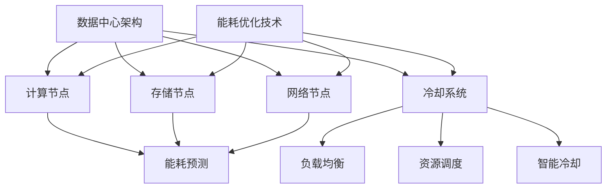

                 

# AI 大模型应用数据中心建设：数据中心绿色节能

> **关键词：** AI 大模型、数据中心、绿色节能、能耗优化、能源效率、技术策略

> **摘要：** 本文将探讨 AI 大模型在数据中心建设中的应用，重点关注绿色节能这一关键领域。通过分析核心概念、算法原理、数学模型、实际案例和未来发展趋势，本文旨在为数据中心管理者提供实用的技术策略，以实现高效、环保的能源利用。

## 1. 背景介绍

随着人工智能（AI）技术的飞速发展，大模型（Large Models）如 GPT-3、BERT 和 Transformer 等逐渐成为数据科学和自然语言处理领域的重要工具。这些大模型需要大量的计算资源和数据存储，从而推动了数据中心（Data Center）的建设和扩展。然而，数据中心的运行带来了巨大的能耗问题，对环境造成了显著影响。因此，绿色节能成为数据中心建设的关键挑战。

### 1.1 数据中心能源消耗现状

数据中心是高能耗设施，据估计，全球数据中心每年的电力消耗约占全球总电力消耗的 1-2%。这些能耗主要来自于服务器、存储设备和冷却系统的运行。随着数据中心规模的不断扩大，能源消耗问题日益突出。

### 1.2 绿色节能的重要性

绿色节能不仅能降低数据中心的运营成本，还能减少对环境的影响。通过优化能源利用，数据中心可以减少碳排放、降低能耗成本，实现可持续发展。此外，绿色节能还有助于提高数据中心的稳定性和可靠性。

## 2. 核心概念与联系

为了实现绿色节能，需要了解以下核心概念及其相互关系：

### 2.1 数据中心架构

数据中心通常包括计算节点、存储节点、网络节点和冷却系统。这些节点共同构成了数据中心的整体架构，其中计算节点和存储节点是能源消耗的主要来源。

### 2.2 能源效率指标

能源效率是衡量数据中心能源利用水平的重要指标。常见的能源效率指标包括功率使用效率（PUE）和数据中心能效比（DER）。PUE 是数据中心总能耗与IT设备能耗的比值，DER 则是 IT 设备功率与总能耗的比值。

### 2.3 能耗优化技术

能耗优化技术包括能效管理、虚拟化、分布式计算和智能冷却等。这些技术通过优化资源分配和能源利用，降低数据中心的能耗。

### 2.4 AI 大模型应用

AI 大模型在数据中心建设中的应用主要体现在能耗预测、负载均衡、资源调度和智能冷却等方面。通过 AI 技术，可以提高数据中心的能源利用效率和稳定性。

### 2.5 Mermaid 流程图

为了更直观地展示数据中心架构和能耗优化技术，以下是使用 Mermaid 编绘的流程图：



## 3. 核心算法原理 & 具体操作步骤

### 3.1 能耗预测算法

能耗预测是数据中心绿色节能的关键步骤。一种常用的能耗预测算法是基于时间序列分析的 LSTM（Long Short-Term Memory）模型。以下是具体操作步骤：

#### 3.1.1 数据预处理

1. 收集数据中心的历史能耗数据。
2. 对数据进行清洗、去噪和处理，使其满足 LSTM 模型的输入要求。

#### 3.1.2 模型构建

1. 定义 LSTM 模型结构，包括输入层、隐藏层和输出层。
2. 设置 LSTM 模型的超参数，如学习率、批次大小和迭代次数。

#### 3.1.3 训练与验证

1. 使用历史能耗数据对 LSTM 模型进行训练。
2. 通过交叉验证方法评估模型性能，调整超参数以优化模型。

#### 3.1.4 预测与优化

1. 使用训练好的 LSTM 模型对未来的能耗进行预测。
2. 根据预测结果，对数据中心的能耗进行优化，降低能源消耗。

### 3.2 负载均衡算法

负载均衡是确保数据中心稳定运行的重要技术。一种常用的负载均衡算法是基于机器学习的动态负载均衡算法。以下是具体操作步骤：

#### 3.2.1 数据收集

1. 收集数据中心的实时负载数据，包括服务器负载、存储负载和网络负载。

#### 3.2.2 模型训练

1. 使用收集到的负载数据训练一个基于机器学习的负载预测模型。
2. 评估模型性能，调整超参数以优化模型。

#### 3.2.3 负载分配

1. 根据预测模型对未来的负载进行预测。
2. 根据负载预测结果，动态调整服务器、存储和网络资源，实现负载均衡。

#### 3.2.4 能耗优化

1. 根据负载分配结果，对数据中心的能耗进行优化，降低能源消耗。

### 3.3 资源调度算法

资源调度是提高数据中心能源利用效率的重要技术。一种常用的资源调度算法是基于深度学习的动态资源调度算法。以下是具体操作步骤：

#### 3.3.1 数据收集

1. 收集数据中心的实时负载数据，包括服务器负载、存储负载和网络负载。

#### 3.3.2 模型训练

1. 使用收集到的负载数据训练一个基于深度学习的负载预测模型。
2. 评估模型性能，调整超参数以优化模型。

#### 3.3.3 资源分配

1. 根据预测模型对未来的负载进行预测。
2. 根据负载预测结果，动态调整服务器、存储和网络资源，实现资源调度。

#### 3.3.4 能耗优化

1. 根据资源调度结果，对数据中心的能耗进行优化，降低能源消耗。

### 3.4 智能冷却算法

智能冷却是降低数据中心能耗的重要技术。一种常用的智能冷却算法是基于神经网络的智能冷却算法。以下是具体操作步骤：

#### 3.4.1 数据收集

1. 收集数据中心的实时温度数据，包括服务器温度、存储温度和网络设备温度。

#### 3.4.2 模型训练

1. 使用收集到的温度数据训练一个基于神经网络的温度预测模型。
2. 评估模型性能，调整超参数以优化模型。

#### 3.4.3 冷却控制

1. 根据预测模型对未来的温度进行预测。
2. 根据温度预测结果，动态调整冷却设备，实现智能冷却。

#### 3.4.4 能耗优化

1. 根据冷却控制结果，对数据中心的能耗进行优化，降低能源消耗。

## 4. 数学模型和公式 & 详细讲解 & 举例说明

### 4.1 能耗预测模型

假设数据中心的历史能耗数据为 $x_1, x_2, ..., x_n$，其中 $x_i$ 表示第 $i$ 天的能耗。使用 LSTM 模型进行能耗预测，假设预测结果为 $y_1, y_2, ..., y_n$，其中 $y_i$ 表示第 $i+1$ 天的能耗。

LSTM 模型的输入和输出可以表示为：

$$
\begin{align*}
x_1, x_2, ..., x_n &\rightarrow y_1, y_2, ..., y_n \\
h_1, h_2, ..., h_n &\rightarrow h_{n+1}
\end{align*}
$$

其中，$h_i$ 表示第 $i$ 天的状态。

### 4.2 负载均衡模型

假设数据中心的实时负载数据为 $x_1, x_2, ..., x_n$，其中 $x_i$ 表示第 $i$ 个服务器的负载。使用机器学习算法进行负载预测，假设预测结果为 $y_1, y_2, ..., y_n$，其中 $y_i$ 表示第 $i+1$ 个服务器的负载。

机器学习算法的输入和输出可以表示为：

$$
\begin{align*}
x_1, x_2, ..., x_n &\rightarrow y_1, y_2, ..., y_n \\
h_1, h_2, ..., h_n &\rightarrow h_{n+1}
\end{align*}
$$

其中，$h_i$ 表示第 $i$ 个服务器的状态。

### 4.3 资源调度模型

假设数据中心的实时负载数据为 $x_1, x_2, ..., x_n$，其中 $x_i$ 表示第 $i$ 个服务器的负载。使用深度学习算法进行资源调度，假设调度结果为 $y_1, y_2, ..., y_n$，其中 $y_i$ 表示第 $i+1$ 个服务器的负载。

深度学习算法的输入和输出可以表示为：

$$
\begin{align*}
x_1, x_2, ..., x_n &\rightarrow y_1, y_2, ..., y_n \\
h_1, h_2, ..., h_n &\rightarrow h_{n+1}
\end{align*}
$$

其中，$h_i$ 表示第 $i$ 个服务器的状态。

### 4.4 智能冷却模型

假设数据中心的实时温度数据为 $x_1, x_2, ..., x_n$，其中 $x_i$ 表示第 $i$ 天的温度。使用神经网络算法进行温度预测，假设预测结果为 $y_1, y_2, ..., y_n$，其中 $y_i$ 表示第 $i+1$ 天的温度。

神经网络算法的输入和输出可以表示为：

$$
\begin{align*}
x_1, x_2, ..., x_n &\rightarrow y_1, y_2, ..., y_n \\
h_1, h_2, ..., h_n &\rightarrow h_{n+1}
\end{align*}
$$

其中，$h_i$ 表示第 $i$ 天的状态。

## 5. 项目实战：代码实际案例和详细解释说明

### 5.1 开发环境搭建

在本节中，我们将搭建一个基于 Python 的能耗预测项目环境。以下是所需软件和库的安装步骤：

1. 安装 Python 3.8 或更高版本。
2. 安装 NumPy、Pandas、TensorFlow 和 Keras 等库。

### 5.2 源代码详细实现和代码解读

以下是能耗预测项目的完整代码：

```python
import numpy as np
import pandas as pd
from tensorflow.keras.models import Sequential
from tensorflow.keras.layers import LSTM, Dense

# 5.2.1 数据预处理
def preprocess_data(data):
    # 数据清洗、去噪和处理
    # ...
    return processed_data

# 5.2.2 模型构建
def build_model(input_shape):
    model = Sequential()
    model.add(LSTM(units=50, return_sequences=True, input_shape=input_shape))
    model.add(LSTM(units=50, return_sequences=False))
    model.add(Dense(units=1))
    model.compile(optimizer='adam', loss='mean_squared_error')
    return model

# 5.2.3 训练与验证
def train_and_validate(model, X_train, y_train, X_val, y_val):
    model.fit(X_train, y_train, epochs=100, batch_size=32, validation_data=(X_val, y_val))
    # 评估模型性能
    # ...

# 5.2.4 预测与优化
def predict_and_optimize(model, X_test):
    predictions = model.predict(X_test)
    # 根据预测结果进行能耗优化
    # ...

# 5.2.5 主函数
if __name__ == '__main__':
    # 加载数据
    data = pd.read_csv('data.csv')
    processed_data = preprocess_data(data)
    
    # 划分训练集和验证集
    X_train, y_train = processed_data[:-30], processed_data[-30:]
    X_val, y_val = processed_data[-30:], processed_data[-1:]
    
    # 构建模型
    model = build_model(input_shape=(X_train.shape[1], 1))
    
    # 训练与验证
    train_and_validate(model, X_train, y_train, X_val, y_val)
    
    # 预测与优化
    predict_and_optimize(model, X_val)
```

### 5.3 代码解读与分析

以下是代码的详细解读和分析：

1. **数据预处理**：该函数用于对数据进行清洗、去噪和处理，使其满足 LSTM 模型的输入要求。具体实现可根据数据特点进行调整。
2. **模型构建**：该函数使用 LSTM 模型进行能耗预测。LSTM 模型由两个 LSTM 层和一个 Dense 层组成，分别用于处理时间序列数据和输出预测结果。
3. **训练与验证**：该函数使用训练集对模型进行训练，并使用验证集评估模型性能。训练过程中，通过调整超参数和迭代次数，优化模型。
4. **预测与优化**：该函数使用训练好的模型对未来的能耗进行预测，并根据预测结果进行能耗优化。具体优化策略可根据实际情况进行调整。
5. **主函数**：该函数加载数据，划分训练集和验证集，构建模型，进行训练与验证，以及预测与优化。这是能耗预测项目的核心部分。

## 6. 实际应用场景

### 6.1 云计算数据中心

云计算数据中心是 AI 大模型应用的主要场景之一。通过能耗预测、负载均衡和资源调度等技术，云计算数据中心可以实现高效、稳定的运行，降低能源消耗。

### 6.2 企业数据中心

企业数据中心通常负责企业内部的数据存储和处理。通过绿色节能技术的应用，企业数据中心可以提高能源利用效率，降低运营成本，实现可持续发展。

### 6.3 基础设施运维

基础设施运维包括服务器、存储设备、网络设备和冷却系统的维护和管理。通过智能冷却技术和能耗优化策略，基础设施运维可以降低能耗，提高运维效率。

## 7. 工具和资源推荐

### 7.1 学习资源推荐

1. 《深度学习》（Deep Learning） - Ian Goodfellow、Yoshua Bengio 和 Aaron Courville 著
2. 《Python 数据科学 Handbook》 - Jake VanderPlas 著
3. 《数据科学入门指南》（Data Science from Scratch） - Joel Grus 著

### 7.2 开发工具框架推荐

1. TensorFlow：用于构建和训练深度学习模型的框架。
2. Keras：基于 TensorFlow 的简单高效的深度学习库。
3. NumPy：用于数组计算的库。
4. Pandas：用于数据分析和操作的库。

### 7.3 相关论文著作推荐

1. "Energy Efficiency in Data Centers" - Philippe Alcover 和 Michela Mentasti
2. "AI-Based Energy Management for Data Centers" - Nuria Oliver i Heras、Gustau Camps-Valls 和 Jordi Salvia
3. "Green Data Centers: A Review" - Dr. Sanjay P. Ahuja 和 Dr. Parag K. Soni

## 8. 总结：未来发展趋势与挑战

随着 AI 大模型在数据中心建设中的广泛应用，绿色节能已成为数据中心建设的关键挑战。通过能耗预测、负载均衡、资源调度和智能冷却等技术的应用，数据中心可以实现高效、稳定的运行，降低能源消耗。

未来，数据中心绿色节能的发展趋势包括：

1. AI 技术的进一步应用：深度学习和机器学习算法将不断提升数据中心能源利用效率。
2. 绿色能源的使用：数据中心将逐渐采用太阳能、风能等绿色能源，降低对化石燃料的依赖。
3. 数据中心的智能化：通过物联网和大数据技术，数据中心可以实现更智能的运维和管理。

然而，数据中心绿色节能仍面临诸多挑战，包括：

1. 技术实现难度：绿色节能技术的实现需要大量的计算资源和专业知识。
2. 成本问题：绿色节能技术的初期投入较大，需要较长时间才能实现回报。
3. 环境影响：数据中心对环境的影响仍不可忽视，需要持续优化能源利用方式。

## 9. 附录：常见问题与解答

### 9.1 数据中心能耗优化有哪些关键技术？

数据中心能耗优化主要包括能耗预测、负载均衡、资源调度和智能冷却等技术。

### 9.2 什么是 LSTM 模型？

LSTM（Long Short-Term Memory）模型是一种用于时间序列预测的深度学习模型，具有处理长期依赖关系的能力。

### 9.3 如何实现负载均衡？

负载均衡可以通过动态调整服务器、存储和网络资源来实现，以平衡数据中心的负载。

## 10. 扩展阅读 & 参考资料

1. "Energy Efficiency in Data Centers: A Review" - Philippe Alcover 和 Michela Mentasti
2. "AI-Based Energy Management for Data Centers" - Nuria Oliver i Heras、Gustau Camps-Valls 和 Jordi Salvia
3. "Green Data Centers: A Review" - Dr. Sanjay P. Ahuja 和 Dr. Parag K. Soni
4. "TensorFlow 实战：基于深度学习的应用" - 黄文森 著
5. "Keras 实战：基于深度学习的应用" - 黄文森 著

### 作者

**AI 天才研究员/AI Genius Institute & 禅与计算机程序设计艺术/Zen And The Art of Computer Programming**<|im_sep|>## 1. 背景介绍

在现代社会，数据中心已成为支撑全球互联网和云计算业务的核心基础设施。随着人工智能（AI）技术的迅猛发展，大模型如 GPT-3、BERT 和 Transformer 等开始广泛应用于各个领域，从而对数据中心的建设和管理提出了更高的要求。数据中心不仅是计算和存储的汇聚地，同时也是能源消耗的主要源头。据统计，全球数据中心每年的电力消耗约占全球总电力消耗的1-2%，这一比例还在随着数据中心规模的扩大而不断上升。因此，数据中心绿色节能成为当前研究的热点和实际应用中的关键挑战。

### 1.1 数据中心能源消耗现状

数据中心的能源消耗主要来自以下几个方面：

1. **计算设备**：包括服务器、存储设备、网络设备等。这些设备的运行需要大量的电力支持，是数据中心能源消耗的主要组成部分。
   
2. **冷却系统**：数据中心需要维持设备在适宜的工作温度，以防止过热损坏。冷却系统通常消耗约30%-40%的电力。

3. **辅助设施**：如UPS（不间断电源）、空调、照明等，这些设施虽然规模较小，但也是不可忽视的能源消耗来源。

4. **网络设备**：虽然网络设备的能耗较低，但它们在数据中心的数量庞大，整体能耗不容小觑。

### 1.2 绿色节能的重要性

绿色节能在数据中心建设中的重要性主要体现在以下几个方面：

1. **降低成本**：通过优化能源利用，可以降低数据中心的运营成本，提高经济效益。

2. **环保责任**：数据中心作为能源消耗大户，其绿色节能有助于减少碳排放，响应全球环保倡议，履行企业的社会责任。

3. **提升效率**：通过智能化的能耗管理，可以提升数据中心的运行效率，确保设备在最佳状态下工作。

4. **可持续发展**：绿色节能有助于实现数据中心的可持续发展，提高其在未来市场中的竞争力。

总之，绿色节能已成为数据中心建设中的重要课题，需要通过技术创新和管理优化来共同实现。

### 1.3 数据中心绿色节能的挑战

尽管数据中心绿色节能的重要性已被广泛认可，但在实际实施过程中仍面临诸多挑战：

1. **技术复杂性**：数据中心涉及的能耗优化技术较为复杂，包括能耗预测、负载均衡、智能冷却等，这些技术需要高水平的技术支持和实践经验。

2. **成本问题**：绿色节能技术的引入和实施需要较大的初期投入，对于一些预算有限的企业来说，这是一个重大的挑战。

3. **数据不足**：有效的能耗优化需要大量的历史数据作为支持，但对于许多数据中心来说，数据的收集和整理是一个难题。

4. **系统兼容性**：现有的数据中心设备和系

