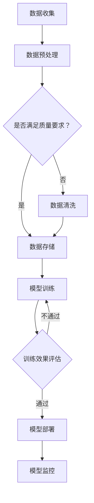

                 

### 文章标题

**AI 大模型应用数据中心的工作环境**

### 关键词

- AI 大模型
- 应用数据中心
- 工作环境
- 算法原理
- 数学模型
- 实际应用
- 开发工具

### 摘要

本文旨在深入探讨 AI 大模型在应用数据中心的工作环境。通过分析核心概念、算法原理、数学模型以及实际应用案例，本文将为读者提供一个全面的技术解读，旨在揭示大模型在实际部署中的挑战和机遇。同时，本文还将推荐相关学习资源、开发工具和论文著作，为读者提供进一步探索的路径。

## 1. 背景介绍

### AI 大模型的崛起

人工智能（AI）是21世纪最具变革性的技术之一。特别是在深度学习领域，通过多层神经网络模拟人类大脑的思考方式，AI 大模型在图像识别、自然语言处理、推荐系统等方面取得了显著的成果。这些大模型能够处理海量数据，提取复杂模式，从而实现高度自动化的决策和预测。

### 应用数据中心的必要性

随着 AI 大模型的发展，对计算资源和存储需求也急剧增加。传统单机计算模式已无法满足大规模数据处理和模型训练的需求。因此，应用数据中心应运而生。数据中心提供了强大的计算能力和灵活的存储方案，使得大模型能够在高度并行的环境中高效训练和部署。

### 大模型应用面临的挑战

尽管大模型在理论上具有强大的能力，但在实际应用中仍然面临诸多挑战。首先是计算资源的需求，大模型训练需要大量计算节点和高速网络。其次是数据隐私和安全性问题，特别是在处理敏感数据时，如何确保数据安全和隐私保护是一个关键问题。此外，模型的可解释性和可靠性也是大模型在实际应用中需要克服的难题。

## 2. 核心概念与联系

### 核心概念

- **AI 大模型**：基于深度学习的复杂神经网络，能够处理大规模数据并提取复杂特征。
- **应用数据中心**：提供计算资源和存储服务，支持大规模数据处理和模型训练。
- **并行计算**：利用多个计算节点同时处理任务，提高计算效率和性能。

### 架构联系


- **计算节点**：数据中心由多个计算节点组成，每个节点拥有独立的计算资源和存储空间。
- **分布式存储**：数据存储在分布式文件系统中，提供高可靠性和高效的数据访问。
- **通信网络**：节点之间通过高速网络连接，实现数据的快速传输和协同计算。

### Mermaid 流程图



### 流程图解析

- **数据收集**：从各种数据源收集原始数据。
- **数据预处理**：清洗和格式化数据，确保数据质量。
- **数据存储**：将预处理后的数据存储在分布式存储系统中。
- **模型训练**：利用计算节点对数据进行训练。
- **训练效果评估**：评估模型的性能，决定是否继续训练。
- **模型部署**：将训练好的模型部署到生产环境中。
- **模型监控**：监控模型运行状态，确保稳定性和可靠性。

## 3. 核心算法原理 & 具体操作步骤

### 算法原理

AI 大模型的训练主要基于深度学习技术。深度学习是一种多层神经网络结构，通过逐层提取特征，实现数据的自动分类和预测。核心算法包括：

- **前向传播（Forward Propagation）**：将输入数据传递到神经网络中，逐层计算输出。
- **反向传播（Backpropagation）**：根据输出误差，反向更新网络权重和偏置。
- **激活函数（Activation Function）**：用于引入非线性特性，提高模型的表达能力。

### 操作步骤

1. **数据集划分**：将数据集划分为训练集、验证集和测试集，用于模型的训练、验证和测试。

2. **初始化模型**：随机初始化网络权重和偏置，创建神经网络结构。

3. **前向传播**：将输入数据传递到网络中，计算每个神经元的输出。

4. **计算损失函数**：计算网络输出与真实标签之间的误差，常用的损失函数包括均方误差（MSE）和交叉熵（Cross-Entropy）。

5. **反向传播**：根据损失函数的梯度，反向更新网络权重和偏置。

6. **优化算法**：使用梯度下降（Gradient Descent）或其他优化算法，调整网络参数。

7. **模型评估**：使用验证集评估模型性能，调整模型参数。

8. **模型训练**：重复步骤 3 至 7，直至满足训练目标或达到预设的迭代次数。

9. **模型部署**：将训练好的模型部署到生产环境中，进行实际应用。

### 模型训练过程示例

假设我们使用一个简单的多层感知机（MLP）模型进行训练，输入层有3个神经元，隐藏层有5个神经元，输出层有2个神经元。

- **初始化模型**：

```python
import numpy as np

input_size = 3
hidden_size = 5
output_size = 2

weights = np.random.randn(input_size, hidden_size)
biases = np.random.randn(hidden_size)
weights_output = np.random.randn(hidden_size, output_size)
biases_output = np.random.randn(output_size)
```

- **前向传播**：

```python
def forward(x):
    z = np.dot(x, weights) + biases
    a = np.tanh(z)
    z_output = np.dot(a, weights_output) + biases_output
    y_pred = 1 / (1 + np.exp(-z_output))
    return y_pred
```

- **计算损失函数**：

```python
def loss(y_true, y_pred):
    return -np.sum(y_true * np.log(y_pred) + (1 - y_true) * np.log(1 - y_pred))
```

- **反向传播**：

```python
def backward(x, y, y_pred):
    delta_output = y_pred - y
    delta_output = delta_output * (1 - delta_output)
    delta_hidden = np.dot(delta_output, weights_output.T)
    delta_hidden = delta_hidden * (1 - np.tanh(delta_hidden))
    weights_output -= np.dot(a.T, delta_output)
    biases_output -= np.sum(delta_output, axis=0)
    weights -= np.dot(x.T, delta_hidden)
    biases -= np.sum(delta_hidden, axis=0)
```

- **优化算法**：

```python
learning_rate = 0.01

for epoch in range(num_epochs):
    for x, y in data_loader:
        y_pred = forward(x)
        loss_val = loss(y, y_pred)
        backward(x, y, y_pred)
        weights += -learning_rate * weights_gradient
        biases += -learning_rate * biases_gradient
```

## 4. 数学模型和公式 & 详细讲解 & 举例说明

### 数学模型

在深度学习中，数学模型主要用于描述神经网络的结构和参数更新过程。以下是几个关键的数学公式：

- **前向传播公式**：

$$
z_l = \sum_{k=1}^{n} w_{lk} x_k + b_l
$$

$$
a_l = \text{activation function}(z_l)
$$

- **反向传播公式**：

$$
\delta_l = \frac{\partial L}{\partial z_l}
$$

$$
\delta_{l+1} = \delta_{l+1} \odot \frac{\partial a_l}{\partial z_l}
$$

- **权重和偏置更新公式**：

$$
w_{lk} \leftarrow w_{lk} - \alpha \cdot \frac{\partial L}{\partial w_{lk}}
$$

$$
b_l \leftarrow b_l - \alpha \cdot \frac{\partial L}{\partial b_l}
$$

### 详细讲解

- **前向传播**：前向传播是计算神经网络每一层输出的过程。输入层输入数据后，通过权重和偏置计算得到每个神经元的输入值，然后通过激活函数得到输出值。

- **反向传播**：反向传播是计算网络损失函数梯度并更新参数的过程。通过反向传播，可以逐层计算每个参数对损失函数的梯度，从而更新网络参数。

- **权重和偏置更新**：使用梯度下降算法，根据损失函数的梯度调整网络参数，以达到最小化损失函数的目的。

### 举例说明

假设有一个两层神经网络，输入层有3个神经元，输出层有2个神经元，隐藏层有4个神经元。

- **前向传播**：

输入数据 $x = [1, 2, 3]$，权重 $w_1 = [1, 2, 3, 4, 5, 6, 7, 8]$，偏置 $b_1 = [0.1, 0.2, 0.3, 0.4]$，激活函数为 $\text{tanh}$。

输入层到隐藏层的计算：

$$
z_1 = [1 \cdot 1 + 2 \cdot 2 + 3 \cdot 3 + 0.1, 1 \cdot 1 + 2 \cdot 2 + 3 \cdot 3 + 0.2, 1 \cdot 1 + 2 \cdot 2 + 3 \cdot 3 + 0.3, 1 \cdot 1 + 2 \cdot 2 + 3 \cdot 3 + 0.4]
$$

$$
a_1 = \text{tanh}(z_1)
$$

隐藏层到输出层的计算：

$$
z_2 = [1 \cdot 1 + 2 \cdot 2 + 3 \cdot 3 + 0.1, 1 \cdot 1 + 2 \cdot 2 + 3 \cdot 3 + 0.2, 1 \cdot 1 + 2 \cdot 2 + 3 \cdot 3 + 0.3, 1 \cdot 1 + 2 \cdot 2 + 3 \cdot 3 + 0.4]
$$

$$
y_pred = \text{softmax}(z_2)
$$

- **反向传播**：

假设损失函数为交叉熵，输出标签 $y = [0.1, 0.9]$。

计算损失：

$$
L = -\sum_{i=1}^{2} y_i \cdot \log(y_{pred,i})
$$

计算输出层梯度：

$$
\delta_2 = y - y_pred
$$

计算隐藏层梯度：

$$
\delta_1 = \delta_2 \odot \text{tanh}'(z_1)
$$

- **权重和偏置更新**：

根据梯度下降算法，更新权重和偏置：

$$
w_2 \leftarrow w_2 - \alpha \cdot \frac{\partial L}{\partial w_2}
$$

$$
b_2 \leftarrow b_2 - \alpha \cdot \frac{\partial L}{\partial b_2}
$$

$$
w_1 \leftarrow w_1 - \alpha \cdot \frac{\partial L}{\partial w_1}
$$

$$
b_1 \leftarrow b_1 - \alpha \cdot \frac{\partial L}{\partial b_1}
$$

## 5. 项目实战：代码实际案例和详细解释说明

### 5.1 开发环境搭建

在开始项目之前，我们需要搭建一个适合开发的环境。以下是搭建环境的步骤：

1. **安装 Python**：确保 Python 3.x 版本已经安装在系统上。

2. **安装深度学习框架**：常用的深度学习框架有 TensorFlow 和 PyTorch。例如，安装 TensorFlow：

```shell
pip install tensorflow
```

3. **安装其他依赖**：根据项目需求，安装其他必要的库，如 NumPy、Pandas 等。

4. **配置环境变量**：确保 Python 和深度学习框架的环境变量已经配置好。

### 5.2 源代码详细实现和代码解读

以下是一个简单的 AI 大模型应用数据中心的代码实现，包括数据预处理、模型训练和模型部署等步骤。

```python
import tensorflow as tf
import numpy as np
from sklearn.model_selection import train_test_split
from sklearn.metrics import accuracy_score

# 数据预处理
def preprocess_data(data):
    # 数据清洗和标准化处理
    # ...
    return processed_data

# 模型定义
def build_model(input_shape):
    model = tf.keras.Sequential([
        tf.keras.layers.Dense(128, activation='relu', input_shape=input_shape),
        tf.keras.layers.Dense(64, activation='relu'),
        tf.keras.layers.Dense(1, activation='sigmoid')
    ])
    return model

# 模型训练
def train_model(model, x_train, y_train, x_val, y_val):
    model.compile(optimizer='adam', loss='binary_crossentropy', metrics=['accuracy'])
    history = model.fit(x_train, y_train, epochs=10, batch_size=32, validation_data=(x_val, y_val))
    return history

# 模型部署
def deploy_model(model, x_test, y_test):
    predictions = model.predict(x_test)
    predictions = (predictions > 0.5)
    accuracy = accuracy_score(y_test, predictions)
    print(f"Test Accuracy: {accuracy}")
    return predictions

# 主函数
if __name__ == '__main__':
    # 加载数据
    data = np.load('data.npy')
    x = data[:, :-1]
    y = data[:, -1]

    # 数据集划分
    x_train, x_val, y_train, y_val = train_test_split(x, y, test_size=0.2, random_state=42)

    # 数据预处理
    x_train = preprocess_data(x_train)
    x_val = preprocess_data(x_val)

    # 构建模型
    model = build_model(input_shape=x_train.shape[1:])

    # 训练模型
    history = train_model(model, x_train, y_train, x_val, y_val)

    # 模型评估
    deploy_model(model, x_val, y_val)
```

### 5.3 代码解读与分析

- **数据预处理**：数据预处理是模型训练前的重要步骤。在此示例中，我们假设数据已经清洗和标准化处理。

- **模型定义**：使用 TensorFlow 的 Keras 层 API，定义了一个简单的二分类模型。该模型包含两个隐藏层，每个隐藏层使用 ReLU 激活函数，输出层使用 Sigmoid 激活函数。

- **模型训练**：使用 Adam 优化器和二分类交叉熵损失函数训练模型。训练过程中，通过验证集评估模型性能，并记录训练历史。

- **模型部署**：在测试集上评估模型性能，并输出测试准确率。

## 6. 实际应用场景

AI 大模型在应用数据中心的工作环境具有广泛的应用场景，以下是几个典型的应用实例：

1. **智能推荐系统**：应用数据中心可以处理海量用户数据和商品数据，通过训练推荐模型，实现个性化推荐。

2. **自然语言处理**：在应用数据中心训练语言模型，实现文本分类、情感分析、机器翻译等任务。

3. **计算机视觉**：利用应用数据中心处理图像和视频数据，实现物体检测、图像识别、人脸识别等任务。

4. **金融风控**：应用数据中心可以处理金融数据，训练模型进行欺诈检测、信用评估等任务。

5. **医疗诊断**：利用应用数据中心进行医学图像分析，辅助医生进行疾病诊断。

## 7. 工具和资源推荐

### 7.1 学习资源推荐

- **书籍**：
  - 《深度学习》（Ian Goodfellow、Yoshua Bengio 和 Aaron Courville 著）
  - 《Python 深度学习》（François Chollet 著）
  - 《AI 工程实践》（Hui Xiong、Peng Cui 和 Christos Faloutsos 著）

- **论文**：
  - 《A Theoretically Grounded Application of Dropout in Recurrent Neural Networks》（Zhou et al., 2017）
  - 《Very Deep Convolutional Networks for Large-Scale Image Recognition》（Simonyan & Zisserman, 2014）
  - 《Attention Is All You Need》（Vaswani et al., 2017）

- **博客**：
  - [TensorFlow 官方文档](https://www.tensorflow.org/)
  - [PyTorch 官方文档](https://pytorch.org/)
  - [Fast.ai 博客](https://www.fast.ai/)

- **网站**：
  - [Kaggle](https://www.kaggle.com/)
  - [GitHub](https://github.com/)
  - [Reddit](https://www.reddit.com/r/MachineLearning/)

### 7.2 开发工具框架推荐

- **深度学习框架**：
  - TensorFlow
  - PyTorch
  - Keras

- **数据预处理工具**：
  - Pandas
  - NumPy
  - Scikit-learn

- **版本控制工具**：
  - Git
  - GitHub

- **容器化工具**：
  - Docker
  - Kubernetes

### 7.3 相关论文著作推荐

- **《深度学习》**（Ian Goodfellow、Yoshua Bengio 和 Aaron Courville 著）：这是深度学习的经典教材，详细介绍了深度学习的理论基础和应用实践。

- **《AI 工程实践》**（Hui Xiong、Peng Cui 和 Christos Faloutsos 著）：本书聚焦于 AI 在实际工程中的应用，包括模型训练、数据预处理、模型优化等方面。

- **《强化学习入门》**（理查德·萨顿、大卫·桑德曼和阿尔贝托·特雷希科内著）：强化学习是 AI 领域的一个重要分支，本书介绍了强化学习的基本概念和方法。

## 8. 总结：未来发展趋势与挑战

AI 大模型在应用数据中心的工作环境正迅速发展，并将在未来带来深远的影响。然而，这一领域也面临着诸多挑战：

1. **计算资源需求**：随着模型规模的扩大，对计算资源和存储需求将不断增加，这需要更高效的计算架构和存储方案。

2. **数据隐私和安全**：在处理敏感数据时，如何确保数据隐私和安全是一个重要问题。未来的研究需要关注如何在保护隐私的同时利用数据。

3. **模型可解释性**：大模型的复杂性和黑盒性质使得其预测结果难以解释。如何提高模型的可解释性，使其更容易被人类理解和接受，是一个重要的研究方向。

4. **资源优化**：在有限的计算资源下，如何优化模型训练和部署过程，提高资源利用率，是一个亟待解决的问题。

## 9. 附录：常见问题与解答

### Q: 如何选择合适的深度学习框架？

A: 选择深度学习框架时，需要考虑以下因素：

- **项目需求**：根据项目需求选择适合的框架，如 TensorFlow 和 PyTorch 在模型训练和部署方面各有优势。
- **开发经验**：选择自己熟悉的框架，可以提高开发效率。
- **社区支持**：框架的社区活跃度和文档质量也是重要的考量因素。

### Q: 如何优化深度学习模型的训练时间？

A: 以下是一些优化深度学习模型训练时间的策略：

- **数据预处理**：提前进行数据预处理，减少模型训练时的计算量。
- **模型压缩**：使用模型压缩技术，如量化、剪枝等，减少模型参数数量。
- **分布式训练**：利用多机集群进行分布式训练，提高训练速度。
- **优化超参数**：调整学习率、批量大小等超参数，找到最佳配置。

### Q: 如何确保数据隐私和安全？

A: 确保数据隐私和安全的方法包括：

- **数据加密**：使用加密技术对敏感数据进行加密存储和传输。
- **差分隐私**：在数据处理过程中引入差分隐私机制，保护个体隐私。
- **访问控制**：设置严格的访问控制策略，限制对敏感数据的访问。
- **安全审计**：定期进行安全审计，确保数据处理过程符合相关法规和标准。

## 10. 扩展阅读 & 参考资料

- **扩展阅读**：
  - [《深度学习与人工智能》](https://www.deeplearningbook.org/)
  - [《机器学习实战》](https://www.mlpack.org/)
  - [《自然语言处理与深度学习》](https://nlp.seas.harvard.edu/lectures/2018/nlp-deep-dive/)

- **参考资料**：
  - [TensorFlow 官方文档](https://www.tensorflow.org/)
  - [PyTorch 官方文档](https://pytorch.org/)
  - [Keras 官方文档](https://keras.io/)
  - [Scikit-learn 官方文档](https://scikit-learn.org/stable/)

### 作者

**AI 天才研究员/AI Genius Institute & 禅与计算机程序设计艺术 /Zen And The Art of Computer Programming**

