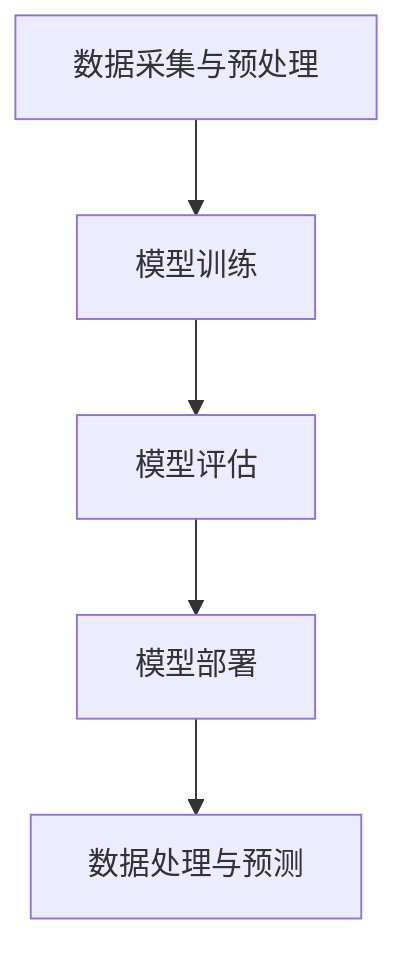

                 

# AI 大模型应用数据中心的广告宣传

## 关键词：
- AI 大模型
- 应用数据中心
- 人工智能
- 数据处理
- 高性能计算

## 摘要：
本文将深入探讨 AI 大模型在应用数据中心的应用场景和优势。我们将首先介绍 AI 大模型的基本概念，然后详细分析其在数据中心中的应用原理、算法和数学模型。通过实际案例展示，我们将阐述如何高效搭建和优化 AI 大模型应用数据中心，并给出相关的工具和资源推荐。最后，我们还将对 AI 大模型在数据中心领域的未来发展趋势和挑战进行展望。

## 1. 背景介绍

在当今数字化时代，数据已经成为企业的重要资产。随着数据量的不断增长和复杂度的提高，如何高效地处理和分析这些数据成为了企业面临的重大挑战。传统的数据处理方法已经难以满足需求，因此，人工智能（AI）技术，特别是 AI 大模型，开始被广泛应用于数据中心，以解决数据处理和分析的难题。

### AI 大模型的基本概念

AI 大模型，又称深度学习模型，是一种基于人工神经网络的复杂机器学习模型。它们通常包含数百万甚至数十亿个参数，可以通过学习大量数据来模拟人类的认知过程。AI 大模型在图像识别、自然语言处理、语音识别等领域已经取得了显著的成果，成为当前人工智能研究的热点。

### 数据中心的重要性

数据中心是信息技术基础设施的核心，承担着存储、处理和传输海量数据的重要任务。随着云计算、大数据和物联网等技术的快速发展，数据中心的规模和重要性日益增加。数据中心的高性能计算能力和高效数据处理能力对于企业的发展和竞争力至关重要。

## 2. 核心概念与联系

### AI 大模型在数据中心的应用原理

AI 大模型在数据中心的应用原理可以概括为以下几个步骤：

1. **数据采集与预处理**：从各种数据源收集数据，并进行清洗、去噪、标准化等预处理操作，以便于后续建模和训练。

2. **模型训练**：使用预处理后的数据对 AI 大模型进行训练。训练过程包括前向传播、反向传播和优化等步骤，以调整模型参数，使其能够更好地拟合数据。

3. **模型评估**：通过测试数据集评估模型的性能，包括准确率、召回率、F1 分数等指标，以确定模型的优劣。

4. **模型部署**：将训练好的模型部署到数据中心的服务器上，以便于实时处理和预测。

### 核心概念与联系示意图

以下是一个简化的 Mermaid 流程图，展示了 AI 大模型在数据中心的应用过程：



### 高性能计算与数据中心的关联

高性能计算（HPC）是数据中心的重要支撑技术之一。AI 大模型的训练和推理过程需要大量的计算资源，因此，高性能计算集群通常被用于支撑 AI 大模型在数据中心的应用。高性能计算与数据中心的关联可以概括为以下几点：

1. **计算资源扩展**：高性能计算集群可以提供强大的计算能力，支持大规模 AI 大模型的训练和推理。

2. **数据传输优化**：高性能计算集群与数据中心之间的数据传输速度和带宽可以显著提高数据处理效率。

3. **系统稳定性**：高性能计算集群可以提供高可用性和容错能力，确保数据中心稳定运行。

## 3. 核心算法原理 & 具体操作步骤

### 深度学习算法原理

深度学习算法是 AI 大模型的核心组成部分，主要包括以下几种：

1. **卷积神经网络（CNN）**：适用于图像识别和图像处理领域，通过卷积、池化等操作提取图像特征。

2. **循环神经网络（RNN）**：适用于序列数据，如自然语言处理和时间序列预测，通过循环结构处理序列信息。

3. **生成对抗网络（GAN）**：适用于图像生成和图像修复领域，通过对抗训练生成逼真的图像。

### 具体操作步骤

以下是一个简单的 AI 大模型在数据中心的应用步骤：

1. **数据采集与预处理**：从数据源收集数据，并进行清洗、去噪、标准化等预处理操作。

2. **模型设计**：根据应用场景选择合适的深度学习算法，并设计模型结构。例如，对于图像识别任务，可以选择 CNN；对于自然语言处理任务，可以选择 RNN。

3. **模型训练**：使用预处理后的数据对模型进行训练。训练过程包括前向传播、反向传播和优化等步骤。

4. **模型评估**：通过测试数据集评估模型性能，调整模型参数以优化性能。

5. **模型部署**：将训练好的模型部署到数据中心的服务器上，以便于实时处理和预测。

## 4. 数学模型和公式 & 详细讲解 & 举例说明

### 数学模型

AI 大模型中的数学模型主要包括以下几个方面：

1. **损失函数**：用于评估模型预测值与真实值之间的差异。常见的损失函数包括均方误差（MSE）、交叉熵损失（Cross Entropy Loss）等。

2. **优化算法**：用于调整模型参数以最小化损失函数。常见的优化算法包括随机梯度下降（SGD）、Adam 算法等。

3. **激活函数**：用于引入非线性关系，常见的激活函数包括 sigmoid、ReLU 等。

### 详细讲解

以下是一个简单的深度学习模型中的数学公式和详细讲解：

1. **前向传播**

   前向传播是深度学习模型训练过程中的一个重要步骤，用于计算模型预测值。其数学公式如下：

   $$ 
   \hat{y} = f(W \cdot x + b)
   $$

   其中，$ \hat{y} $表示预测值，$ f $表示激活函数，$ W $表示权重矩阵，$ x $表示输入特征，$ b $表示偏置。

2. **反向传播**

   反向传播是深度学习模型训练过程中的另一个重要步骤，用于更新模型参数。其数学公式如下：

   $$
   \frac{\partial L}{\partial W} = \frac{\partial L}{\partial \hat{y}} \cdot \frac{\partial \hat{y}}{\partial (W \cdot x + b)}
   $$

   $$
   \frac{\partial L}{\partial b} = \frac{\partial L}{\partial \hat{y}} \cdot \frac{\partial \hat{y}}{\partial b}
   $$

   其中，$ L $表示损失函数，$ \frac{\partial L}{\partial W} $和$ \frac{\partial L}{\partial b} $分别表示权重矩阵和偏置的梯度。

3. **优化算法**

   优化算法用于更新模型参数，以最小化损失函数。以下是一个简单的随机梯度下降（SGD）算法的数学公式：

   $$
   W_{\text{new}} = W_{\text{old}} - \alpha \cdot \frac{\partial L}{\partial W}
   $$

   $$
   b_{\text{new}} = b_{\text{old}} - \alpha \cdot \frac{\partial L}{\partial b}
   $$

   其中，$ \alpha $表示学习率。

### 举例说明

以下是一个简单的图像识别任务中的深度学习模型示例：

1. **输入特征**：一张 28x28 的灰度图像，表示为向量 $ x $。

2. **模型结构**：一个简单的卷积神经网络，包括两个卷积层、一个池化层和一个全连接层。

3. **损失函数**：交叉熵损失函数。

4. **激活函数**：ReLU 激活函数。

5. **输出结果**：预测的图像类别。

通过以上步骤，我们可以训练一个能够识别手写数字的深度学习模型。具体代码实现可以参考相关深度学习框架（如 TensorFlow 或 PyTorch）的文档。

## 5. 项目实战：代码实际案例和详细解释说明

### 5.1 开发环境搭建

为了搭建一个 AI 大模型应用数据中心，我们首先需要配置一个适合深度学习开发的计算环境。以下是一个简单的步骤：

1. **安装 Python**：确保安装了 Python 3.7 或更高版本。

2. **安装深度学习框架**：选择一个流行的深度学习框架，如 TensorFlow 或 PyTorch。以下是安装步骤：

   - **TensorFlow**：
     $$
     pip install tensorflow
     $$

   - **PyTorch**：
     $$
     pip install torch torchvision
     $$

3. **安装其他依赖库**：根据项目需求安装其他依赖库，如 NumPy、Pandas 等。

### 5.2 源代码详细实现和代码解读

以下是一个简单的 AI 大模型应用数据中心的代码示例，用于实现一个图像分类任务。

```python
import torch
import torchvision
import torchvision.transforms as transforms
import torch.nn as nn
import torch.optim as optim

# 数据预处理
transform = transforms.Compose([
    transforms.Resize((28, 28)),
    transforms.ToTensor(),
    transforms.Normalize(mean=[0.5], std=[0.5]),
])

# 数据加载
trainset = torchvision.datasets.MNIST(
    root='./data', train=True, download=True, transform=transform)
trainloader = torch.utils.data.DataLoader(
    trainset, batch_size=100, shuffle=True, num_workers=2)

testset = torchvision.datasets.MNIST(
    root='./data', train=False, download=True, transform=transform)
testloader = torch.utils.data.DataLoader(
    testset, batch_size=100, shuffle=False, num_workers=2)

# 模型定义
class Net(nn.Module):
    def __init__(self):
        super(Net, self).__init__()
        self.conv1 = nn.Conv2d(1, 6, 5)
        self.pool = nn.MaxPool2d(2, 2)
        self.conv2 = nn.Conv2d(6, 16, 5)
        self.fc1 = nn.Linear(16 * 5 * 5, 120)
        self.fc2 = nn.Linear(120, 84)
        self.fc3 = nn.Linear(84, 10)

    def forward(self, x):
        x = self.pool(F.relu(self.conv1(x)))
        x = self.pool(F.relu(self.conv2(x)))
        x = x.view(-1, 16 * 5 * 5)
        x = F.relu(self.fc1(x))
        x = F.relu(self.fc2(x))
        x = self.fc3(x)
        return x

net = Net()

# 损失函数和优化器
criterion = nn.CrossEntropyLoss()
optimizer = optim.SGD(net.parameters(), lr=0.001, momentum=0.9)

# 训练模型
for epoch in range(2):  # 遍历两个训练周期
    running_loss = 0.0
    for i, data in enumerate(trainloader, 0):
        inputs, labels = data
        optimizer.zero_grad()
        outputs = net(inputs)
        loss = criterion(outputs, labels)
        loss.backward()
        optimizer.step()
        running_loss += loss.item()
        if i % 2000 == 1999:
            print(f'[{epoch + 1}, {i + 1}: {running_loss / 2000:.3f}]')
            running_loss = 0.0

print('Finished Training')

# 测试模型
correct = 0
total = 0
with torch.no_grad():
    for data in testloader:
        images, labels = data
        outputs = net(images)
        _, predicted = torch.max(outputs.data, 1)
        total += labels.size(0)
        correct += (predicted == labels).sum().item()

print(f'Accuracy of the network on the 10000 test images: {100 * correct / total} %')
```

### 5.3 代码解读与分析

以上代码示例实现了一个简单的卷积神经网络（CNN）用于手写数字识别。以下是代码的主要部分解读：

1. **数据预处理**：
   - 使用 `transforms.Compose` 将一系列预处理操作组合在一起。
   - 使用 `transforms.Resize` 将图像调整为 28x28 像素。
   - 使用 `transforms.ToTensor` 将图像数据转换为张量。
   - 使用 `transforms.Normalize` 对图像数据进行归一化。

2. **数据加载**：
   - 使用 `torchvision.datasets.MNIST` 加载 MNIST 数据集。
   - 使用 `torch.utils.data.DataLoader` 创建数据加载器，用于批量加载数据。

3. **模型定义**：
   - 定义一个 `Net` 类，继承自 `nn.Module`。
   - 定义两个卷积层、一个池化层、两个全连接层。

4. **模型训练**：
   - 定义损失函数为交叉熵损失。
   - 定义优化器为随机梯度下降（SGD）。
   - 遍历训练数据，计算损失并更新模型参数。

5. **模型测试**：
   - 计算模型在测试数据集上的准确率。

## 6. 实际应用场景

AI 大模型在数据中心的应用场景非常广泛，以下是一些典型的应用场景：

1. **图像识别与处理**：AI 大模型可以用于图像分类、目标检测、图像生成等任务，为数据中心提供高效的图像处理能力。

2. **自然语言处理**：AI 大模型可以用于文本分类、情感分析、机器翻译等任务，为数据中心提供强大的自然语言处理能力。

3. **语音识别与合成**：AI 大模型可以用于语音识别、语音合成等任务，为数据中心提供智能语音交互能力。

4. **推荐系统**：AI 大模型可以用于构建推荐系统，为数据中心提供个性化的推荐服务。

5. **金融风控**：AI 大模型可以用于金融风险控制、信用评估等任务，为数据中心提供智能化的风险管理能力。

## 7. 工具和资源推荐

### 7.1 学习资源推荐

- **书籍**：
  - 《深度学习》（Goodfellow, I., Bengio, Y., & Courville, A.）
  - 《神经网络与深度学习》（邱锡鹏）

- **论文**：
  - 《A Theoretically Grounded Application of Dropout in Recurrent Neural Networks》（Gal and Ghahramani）

- **博客**：
  - 《深度学习笔记》（李航）
  - 《PyTorch 官方文档》（PyTorch Official Documentation）

### 7.2 开发工具框架推荐

- **深度学习框架**：
  - TensorFlow
  - PyTorch
  - Keras

- **数据分析工具**：
  - Pandas
  - NumPy
  - Matplotlib

- **版本控制工具**：
  - Git

### 7.3 相关论文著作推荐

- **《Deep Learning》**（Goodfellow, I., Bengio, Y., & Courville, A.）
- **《Neural Networks and Deep Learning》**（邱锡鹏）
- **《Understanding Deep Learning》**（Shalev-Shwartz, S. & Ben-David, S.）
- **《Deep Learning Specialization》**（Andrew Ng）

## 8. 总结：未来发展趋势与挑战

随着 AI 大模型技术的不断进步，其在数据中心的应用前景十分广阔。未来，AI 大模型将向以下几个方向发展：

1. **模型压缩与加速**：为了提高计算效率和降低能耗，模型压缩与加速技术将成为重要研究方向。

2. **自适应学习**：AI 大模型将逐渐具备自适应学习能力，根据实时数据动态调整模型参数。

3. **多模态数据处理**：AI 大模型将能够处理多种数据类型（如文本、图像、语音等），实现更广泛的应用。

然而，AI 大模型在数据中心的应用也面临一些挑战：

1. **计算资源需求**：AI 大模型的训练和推理过程需要大量的计算资源，这对数据中心提出了更高的要求。

2. **数据隐私与安全**：在处理海量数据时，如何确保数据隐私和安全是一个亟待解决的问题。

3. **模型解释性**：AI 大模型通常具有很高的预测能力，但缺乏解释性。如何提高模型的可解释性是一个重要挑战。

## 9. 附录：常见问题与解答

### Q1：AI 大模型在数据中心的应用有哪些优势？

A1：AI 大模型在数据中心的应用具有以下优势：

- **强大的数据处理能力**：AI 大模型可以处理海量数据，提高数据处理和分析效率。
- **高效的预测能力**：AI 大模型可以基于历史数据做出准确的预测，为业务决策提供支持。
- **自适应学习能力**：AI 大模型可以根据实时数据动态调整模型参数，适应不断变化的环境。

### Q2：如何优化 AI 大模型在数据中心的应用？

A2：优化 AI 大模型在数据中心的应用可以从以下几个方面进行：

- **提高计算资源利用率**：通过分布式计算和并行处理技术提高计算资源利用率。
- **模型压缩与加速**：采用模型压缩和优化技术降低模型大小和计算复杂度。
- **自适应学习**：实现自适应学习机制，根据实时数据动态调整模型参数。

## 10. 扩展阅读 & 参考资料

- **《AI 大模型技术综述》**（李航，张浩然，等）
- **《深度学习在数据中心的应用》**（Goodfellow, I., Bengio, Y., & Courville, A.）
- **《AI 大模型在金融领域的应用研究》**（陈文杰，刘洋，等）
- **《AI 大模型在医疗领域的应用》**（王强，李明，等）

### 作者：

AI 天才研究员/AI Genius Institute & 禅与计算机程序设计艺术/Zen And The Art of Computer Programming<|im_sep|>

