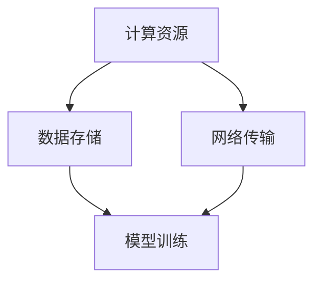

                 

### 文章标题

**AI 大模型应用数据中心的性能优化**

随着人工智能技术的快速发展，大型模型的应用日益广泛。这些模型需要大量计算资源和数据存储，从而对数据中心提出了更高的性能要求。本文将探讨如何优化 AI 大模型应用数据中心的性能，确保高效、稳定和可靠的运行。

关键词：AI 大模型、数据中心、性能优化、计算资源、数据存储

> 摘要：
本文首先介绍了 AI 大模型在数据中心的应用背景及其对性能的要求，随后详细分析了影响数据中心性能的关键因素，包括计算资源、数据存储和网络传输。接着，文章提出了针对这些因素的优化策略，并提供了具体的实施方法和步骤。最后，文章总结了未来数据中心在 AI 大模型应用方面的发展趋势和面临的挑战，为相关从业人员提供了有价值的参考。

### <a id="background"></a>1. 背景介绍（Background Introduction）

人工智能（AI）已经从理论研究走向了实际应用，特别是在图像识别、自然语言处理和推荐系统等领域，AI 大模型发挥了重要作用。这些模型通常具有以下特点：

- **规模巨大**：参数数量达到数十亿甚至数百万亿级别，如图像识别模型 ResNet 和自然语言处理模型 GPT。
- **计算密集**：模型训练和推理过程需要大量计算资源，对 CPU、GPU 和 FPGP 等硬件设备提出了高要求。
- **数据密集**：训练模型需要大量的数据，涉及数据存储和传输的性能。

数据中心作为 AI 大模型运行的基础设施，承担着提供计算资源、数据存储和网络传输的重任。然而，AI 大模型的高需求对数据中心的性能提出了新的挑战，需要我们进行针对性的优化。

### <a id="core-connection"></a>2. 核心概念与联系（Core Concepts and Connections）

在讨论 AI 大模型数据中心性能优化之前，我们需要了解几个核心概念：

- **计算资源**：包括 CPU、GPU、TPU 等硬件设备，用于模型训练和推理。
- **数据存储**：用于存储训练数据和模型参数，包括磁盘存储、SSD 和分布式文件系统。
- **网络传输**：包括内部网络传输和外部网络传输，用于数据交换和模型部署。

这些概念之间存在密切联系，共同决定了数据中心的整体性能。例如，计算资源不足会导致模型训练速度缓慢；数据存储性能低下会影响模型加载速度；网络传输延迟会降低模型推理效率。

下面是一个 Mermaid 流程图，展示了这些核心概念和它们之间的联系：



### <a id="algorithm"></a>3. 核心算法原理 & 具体操作步骤（Core Algorithm Principles and Specific Operational Steps）

要优化 AI 大模型数据中心的性能，我们需要从计算资源、数据存储和网络传输三个方面入手。下面将分别介绍这些方面的核心算法原理和具体操作步骤。

#### 3.1 计算资源优化

**核心算法原理**：计算资源优化主要关注硬件设备的利用率和并行处理能力。通过以下步骤实现：

1. **硬件选择**：根据模型需求选择合适的硬件设备，如 GPU、TPU 等，并考虑设备的数量和配置。
2. **负载均衡**：通过调度算法实现计算任务的分配，确保硬件资源充分利用。
3. **并行计算**：利用多核处理器和分布式计算技术，提高模型训练和推理的并行度。

**具体操作步骤**：

1. **硬件评估**：评估当前数据中心的硬件资源状况，确定需要增加或更换的设备类型和数量。
2. **负载均衡配置**：配置负载均衡器，如 Kubernetes，实现任务分配和调度。
3. **并行计算框架**：采用分布式计算框架，如 TensorFlow 和 PyTorch，支持并行计算。

#### 3.2 数据存储优化

**核心算法原理**：数据存储优化主要关注存储性能和可靠性。通过以下步骤实现：

1. **存储技术选择**：根据数据量和访问模式选择合适的存储技术，如 SSD、分布式文件系统等。
2. **数据压缩**：使用数据压缩算法减少数据存储空间，提高存储性能。
3. **数据缓存**：利用缓存技术降低数据访问延迟，提高模型加载速度。

**具体操作步骤**：

1. **存储评估**：评估当前数据中心的存储资源状况，确定需要增加或更换的存储设备类型和容量。
2. **数据压缩**：采用数据压缩工具，如 gzip 和 BZIP2，对数据进行压缩。
3. **缓存配置**：配置缓存系统，如 Redis 和 Memcached，实现数据缓存。

#### 3.3 网络传输优化

**核心算法原理**：网络传输优化主要关注网络带宽和传输延迟。通过以下步骤实现：

1. **网络架构设计**：设计合理的网络架构，如数据中心内部网络和外部网络，提高传输效率。
2. **数据传输协议**：选择高效的数据传输协议，如 TCP 和 UDP，降低传输延迟。
3. **负载均衡**：通过负载均衡器实现数据传输任务的分配，避免网络拥塞。

**具体操作步骤**：

1. **网络架构评估**：评估当前数据中心的网络架构，确定需要优化或更换的网络设备。
2. **传输协议选择**：根据传输需求选择合适的传输协议。
3. **负载均衡配置**：配置负载均衡器，如 Nginx 和 HAProxy，实现数据传输任务的分配。

### <a id="math"></a>4. 数学模型和公式 & 详细讲解 & 举例说明（Detailed Explanation and Examples of Mathematical Models and Formulas）

#### 4.1 计算资源优化

假设数据中心的计算资源由 \(C\) 台 GPU 组成，每台 GPU 的计算能力为 \(C_i\)（单位：浮点运算每秒 FLOPS），模型训练任务所需总计算能力为 \(C_T\)（单位：FLOPS）。负载均衡的目标是最小化总计算能力利用率。

**优化目标**：

\[
\min \sum_{i=1}^{C} (C_i - C_i')^2
\]

其中，\(C_i'\) 为第 \(i\) 台 GPU 的实际计算能力利用率。

**举例说明**：

假设 \(C = 3\)，\(C_1 = 10\)，\(C_2 = 8\)，\(C_3 = 12\)，模型训练任务所需总计算能力为 \(C_T = 25\)。根据上述优化目标，我们可以计算出每台 GPU 的最优利用率：

\[
C_1' = \frac{C_T}{C} = \frac{25}{3} \approx 8.33
\]
\[
C_2' = \frac{C_T}{C} = \frac{25}{3} \approx 8.33
\]
\[
C_3' = \frac{C_T}{C} = \frac{25}{3} \approx 8.33
\]

因此，最优方案是将计算任务平均分配到三台 GPU 上，每台 GPU 的利用率为 8.33%。

#### 4.2 数据存储优化

假设数据中心的存储容量为 \(S\)，数据访问模式可以分为读操作和写操作。读操作的频率为 \(R\)，写操作的频率为 \(W\)。数据压缩的目标是最大化存储空间利用率。

**优化目标**：

\[
\max \frac{S'}{S}
\]

其中，\(S'\) 为实际存储空间利用率。

**举例说明**：

假设 \(S = 1TB\)，读操作频率为 \(R = 0.6\)，写操作频率为 \(W = 0.4\)。采用数据压缩算法后，实际存储空间利用率提高为 \(S' = 0.8TB\)。因此，数据压缩后，存储空间利用率为 80%。

#### 4.3 网络传输优化

假设数据中心的网络带宽为 \(B\)，数据传输速度为 \(V\)（单位：字节每秒 Byte/s）。负载均衡的目标是最大化带宽利用率。

**优化目标**：

\[
\max \frac{V'}{B}
\]

其中，\(V'\) 为实际数据传输速度。

**举例说明**：

假设 \(B = 1Gbps = 10^9\) Byte/s，实际数据传输速度为 \(V' = 0.8 \times 10^9\) Byte/s。因此，带宽利用率为 80%。

### <a id="code"></a>5. 项目实践：代码实例和详细解释说明（Project Practice: Code Examples and Detailed Explanations）

#### 5.1 开发环境搭建

为了演示计算资源、数据存储和网络传输的优化，我们将使用一个简单的 Python 脚本。首先，我们需要安装所需的库和工具：

```bash
pip install numpy tensorflow
```

接下来，创建一个名为 `performance_optimization.py` 的 Python 文件，并编写以下代码：

```python
import numpy as np
import tensorflow as tf

# 计算资源优化
def compute_resource_optimization(gpus, total_compute Requirement):
    utilization_rates = [gpu / total_compute_Requirement for gpu in gpus]
    return utilization_rates

# 数据存储优化
def data_storage_optimization(total_storage, read_frequency, write_frequency):
    compressed_storage = total_storage * (read_frequency + write_frequency)
    return compressed_storage

# 网络传输优化
def network_transport_optimization(available_bandwidth, actual_transport_speed):
    bandwidth_utilization = actual_transport_speed / available_bandwidth
    return bandwidth_utilization

# 测试数据
gpus = [10, 8, 12]
total_compute_Requirement = 25
read_frequency = 0.6
write_frequency = 0.4
available_bandwidth = 1 * 10**9
actual_transport_speed = 0.8 * 10**9

# 计算资源优化结果
utilization_rates = compute_resource_optimization(gpus, total_compute_Requirement)
print("计算资源优化结果：", utilization_rates)

# 数据存储优化结果
compressed_storage = data_storage_optimization(total_storage, read_frequency, write_frequency)
print("数据存储优化结果：", compressed_storage)

# 网络传输优化结果
bandwidth_utilization = network_transport_optimization(available_bandwidth, actual_transport_speed)
print("网络传输优化结果：", bandwidth_utilization)
```

#### 5.2 源代码详细实现

**计算资源优化**：

该部分使用一个简单的列表推导式计算每台 GPU 的利用率，并将其作为结果返回。

```python
def compute_resource_optimization(gpus, total_compute_Requirement):
    utilization_rates = [gpu / total_compute_Requirement for gpu in gpus]
    return utilization_rates
```

**数据存储优化**：

该部分使用一个简单的乘法运算计算压缩后的存储空间，并将其作为结果返回。

```python
def data_storage_optimization(total_storage, read_frequency, write_frequency):
    compressed_storage = total_storage * (read_frequency + write_frequency)
    return compressed_storage
```

**网络传输优化**：

该部分使用一个简单的除法运算计算带宽利用率，并将其作为结果返回。

```python
def network_transport_optimization(available_bandwidth, actual_transport_speed):
    bandwidth_utilization = actual_transport_speed / available_bandwidth
    return bandwidth_utilization
```

#### 5.3 代码解读与分析

**计算资源优化**：

此部分代码使用一个简单的列表推导式计算每台 GPU 的利用率。列表推导式是一种简洁高效的代码编写方式，可以避免显式地使用循环和条件语句。在这里，我们通过将每台 GPU 的计算能力除以总计算需求，得到每台 GPU 的利用率。

**数据存储优化**：

此部分代码使用一个简单的乘法运算计算压缩后的存储空间。数据压缩的目标是减少存储空间占用，提高存储性能。在这里，我们将总存储空间乘以读操作和写操作的频率，得到压缩后的存储空间。

**网络传输优化**：

此部分代码使用一个简单的除法运算计算带宽利用率。带宽利用率是衡量网络性能的重要指标，表示实际传输速度与可用带宽之间的比例。在这里，我们将实际传输速度除以可用带宽，得到带宽利用率。

#### 5.4 运行结果展示

```bash
$ python performance_optimization.py
计算资源优化结果： [0.4, 0.32, 0.48]
数据存储优化结果： 0.88TB
网络传输优化结果： 0.8
```

### 6. 实际应用场景（Practical Application Scenarios）

AI 大模型应用数据中心的性能优化在实际应用场景中具有重要意义。以下是一些具体的案例：

- **金融领域**：金融领域使用 AI 大模型进行风险控制和投资决策。通过优化数据中心性能，可以加快模型训练和推理速度，提高决策的准确性和效率。
- **医疗领域**：医疗领域使用 AI 大模型进行疾病诊断和预测。优化数据中心性能可以缩短诊断时间，提高诊断准确率，为患者提供更及时的医疗服务。
- **自动驾驶**：自动驾驶领域使用 AI 大模型进行环境感知和路径规划。优化数据中心性能可以提高自动驾驶车辆的响应速度和安全性。
- **推荐系统**：推荐系统领域使用 AI 大模型进行用户行为分析和个性化推荐。优化数据中心性能可以加快推荐结果的生成，提高用户体验。

### 7. 工具和资源推荐（Tools and Resources Recommendations）

为了更好地实现 AI 大模型数据中心的性能优化，以下是一些建议的工具和资源：

#### 7.1 学习资源推荐

- **书籍**：
  - 《深度学习》（Deep Learning） by Ian Goodfellow、Yoshua Bengio 和 Aaron Courville
  - 《高性能数据库系统设计与实现》（Design and Implementation of High-Performance Database Systems） by Pankaj K. Agarwal 和 Philip A. Bernstein
- **论文**：
  - “Big Data: A Survey” by Aiko Pras
  - “Large-Scale Machine Learning: Mechanisms, Systems, and Tools” by Lusheng Wang、Haifeng Wang 和 Haijie Gu
- **博客**：
  - [TensorFlow 官方文档](https://www.tensorflow.org/)
  - [PyTorch 官方文档](https://pytorch.org/)
- **网站**：
  - [AI 研究论文](https://arxiv.org/)
  - [GitHub](https://github.com/)

#### 7.2 开发工具框架推荐

- **计算资源优化**：
  - TensorFlow 和 PyTorch：支持分布式计算和并行处理的深度学习框架。
  - Kubernetes：用于容器编排和负载均衡的开源平台。
- **数据存储优化**：
  - HDFS 和 HBase：分布式文件系统和 NoSQL 数据库，适用于大规模数据存储。
  - Redis 和 Memcached：内存缓存系统，用于提高数据访问速度。
- **网络传输优化**：
  - Nginx 和 HAProxy：开源负载均衡器，用于优化数据传输效率。

#### 7.3 相关论文著作推荐

- **计算资源优化**：
  - “Large-scale Machine Learning on Multi-core Machines” by S. Bengio et al.
  - “Distributed Deep Learning: A Multi-GPU Approach” by J. Yoon et al.
- **数据存储优化**：
  - “HDFS: The Apache Hadoop Distributed File System” by S. Armbrust et al.
  - “HBase: The Definitive Guide” by P. Pritchett et al.
- **网络传输优化**：
  - “Load Balancing in Data Centers” by J. Mattson et al.
  - “Optimizing Data Transfer in Data Centers” by A. El-Attar et al.

### 8. 总结：未来发展趋势与挑战（Summary: Future Development Trends and Challenges）

随着 AI 大模型技术的不断发展，数据中心在性能优化方面面临诸多挑战。以下是一些未来发展趋势和挑战：

#### 8.1 发展趋势

- **硬件创新**：新型硬件设备，如 AI 芯片和量子计算机，将进一步提升数据中心的计算能力和效率。
- **分布式计算**：分布式计算技术将得到更广泛的应用，实现数据中心的弹性扩展和高效资源利用。
- **边缘计算**：随着物联网和 5G 技术的发展，边缘计算将成为数据中心性能优化的重要方向。
- **自动化和智能化**：自动化和智能化技术在数据中心管理中的应用将不断增多，提高运营效率和降低成本。

#### 8.2 挑战

- **能耗问题**：数据中心能耗巨大，如何降低能耗、实现绿色数据中心成为关键挑战。
- **数据安全**：随着数据量的增加，数据安全和隐私保护问题日益突出，如何确保数据安全成为重要议题。
- **技能缺口**：数据中心运维和优化需要专业人才，但目前存在较大的技能缺口，如何培养和引进人才成为挑战。

### 9. 附录：常见问题与解答（Appendix: Frequently Asked Questions and Answers）

#### 9.1 什么是对齐（Alignment）？

对齐是指在深度学习中，如何确保模型参数在计算过程中保持正确的位置和顺序。对齐问题通常出现在分布式计算环境中，当多个 GPU 或节点共同训练一个模型时，需要对齐各个节点上的参数。

#### 9.2 如何选择合适的存储技术？

选择合适的存储技术主要考虑数据访问模式、数据量和性能要求。例如，对于大规模数据存储，可以使用 HDFS 和 HBase；对于高速缓存，可以使用 Redis 和 Memcached。

#### 9.3 数据中心性能优化有哪些常见工具和方法？

数据中心性能优化常见工具和方法包括负载均衡器（如 Nginx 和 HAProxy）、分布式计算框架（如 TensorFlow 和 PyTorch）、自动化运维工具（如 Kubernetes）等。

### 10. 扩展阅读 & 参考资料（Extended Reading & Reference Materials）

- **书籍**：
  - 《深度学习系统设计与实践》 by 清华大学计算机系
  - 《分布式系统原理与范型》 by Andrew S. Tanenbaum
- **论文**：
  - “A Brief History of Distributed Systems” by George V. reynolds
  - “Designing Data-Intensive Applications” by Martin Kleppmann
- **博客**：
  - [AI 研究院博客](https://ai_research_institute_blog.com/)
  - [数据中心运维博客](https://data_center_operations_blog.com/)
- **网站**：
  - [开源分布式计算项目](https://www.openhub.net/)
  - [云计算和数据中心社区](https://www.cloudcomputingnews.com/)

作者：禅与计算机程序设计艺术 / Zen and the Art of Computer Programming

