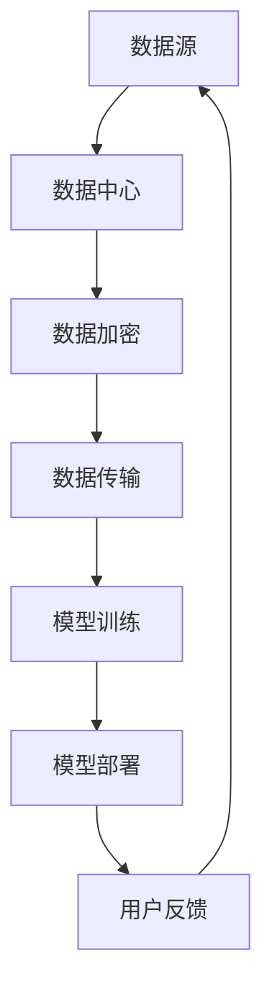

                 

### 背景介绍 Background Introduction

随着人工智能（AI）技术的迅猛发展，大模型应用成为了当前研究和产业界的热点。大模型，如生成对抗网络（GAN）、变分自编码器（VAE）和深度强化学习（DRL）等，因其强大的表征和学习能力，在图像生成、自然语言处理、推荐系统等领域表现出色。然而，这些应用不仅带来了技术上的突破，同时也对数据中心的数据安全提出了新的挑战。

数据中心作为AI大模型训练和应用的重要基础设施，其安全性直接关系到用户隐私、商业秘密以及整个系统的稳定性。近年来，随着数据规模的不断扩大和计算资源的集中化，数据中心的攻击面也在不断增大，包括分布式拒绝服务（DDoS）攻击、数据泄露、恶意软件感染等。这不仅给运营者带来了巨大的经济损失，还可能对用户造成不可挽回的损害。

在此背景下，本文旨在探讨AI大模型应用数据中心的数据安全问题。通过分析当前数据安全的现状、面临的挑战，以及可能的解决方案，旨在为数据中心的安全管理提供有价值的参考。

### 核心概念与联系 Core Concepts and Relationships

#### 1. 大模型与数据中心的关系

大模型通常需要大量数据和强大的计算资源来进行训练。数据中心作为这些模型训练和部署的重要基础设施，承载了数据存储、处理和传输的各个环节。因此，大模型与数据中心之间的关系可以视为互相依赖、互相促进的关系。

大模型的训练需要海量的数据，而这些数据大多存储在数据中心。同时，数据中心的计算资源也为大模型的训练提供了支持。例如，大规模的GPU集群可以显著提高模型的训练速度和效果。

另一方面，数据中心的安全问题直接影响到大模型的训练和应用。如果数据中心遭受攻击，可能会导致数据泄露、模型失效等问题，从而对整个AI系统的稳定性产生严重影响。

#### 2. 数据安全与AI大模型

数据安全是指保护数据在存储、传输和处理过程中不被非法访问、篡改或破坏。在AI大模型的应用中，数据安全尤为重要，因为：

- **数据隐私**：AI大模型通常使用用户数据来进行训练，这些数据可能包含用户的敏感信息。如果数据泄露，用户的隐私将受到严重威胁。
- **模型完整性**：AI大模型的训练依赖于高质量的数据，如果数据被篡改，可能会导致模型性能下降，甚至导致模型失效。
- **系统稳定性**：数据中心的安全问题可能导致整个AI系统的中断，从而影响其应用效果。

#### 3. 当前数据安全的现状

当前，数据安全面临以下几个方面的挑战：

- **攻击手段多样**：随着技术的进步，攻击者的攻击手段也日益多样，包括DDoS攻击、SQL注入、DDoS攻击、恶意软件感染等。
- **数据泄露风险高**：大规模的数据中心往往包含海量的数据，一旦发生泄露，可能会造成巨大的损失。
- **防护措施滞后**：传统的安全防护措施在面对新型攻击时往往显得滞后，难以有效地防范。

#### 4. 数据中心的安全架构

为了应对数据安全面临的挑战，数据中心通常采用以下安全架构：

- **网络隔离**：通过防火墙、VPN等技术实现不同网络之间的隔离，防止攻击者跨越网络进行攻击。
- **数据加密**：对存储和传输的数据进行加密，防止数据泄露。
- **访问控制**：通过身份验证、权限管理等技术确保只有授权用户可以访问数据。
- **监控与审计**：通过日志记录、实时监控等技术及时发现并处理安全事件。

#### 5. Mermaid 流程图表示

下面是一个简单的Mermaid流程图，展示了大模型与数据中心的关系及数据安全的关键环节：



在这个流程图中，数据从数据源（A）传输到数据中心（B），在数据中心进行加密（C）和模型训练（E），然后部署到用户端（F），用户的反馈（G）又会反馈回数据源，形成闭环。

### 核心算法原理 & 具体操作步骤 Core Algorithm Principles & Step-by-Step Operations

#### 1. 数据加密算法

数据加密是确保数据安全的重要手段。在AI大模型应用中，常用的加密算法包括对称加密和非对称加密。

**对称加密**：对称加密算法使用相同的密钥对数据进行加密和解密。常见的对称加密算法有AES（高级加密标准）和DES（数据加密标准）。其具体操作步骤如下：

1. **密钥生成**：首先，生成一个随机的密钥。
2. **数据加密**：使用密钥对数据进行加密，生成密文。
3. **数据解密**：接收方使用相同的密钥对密文进行解密，还原明文。

**非对称加密**：非对称加密算法使用一对密钥（公钥和私钥）进行加密和解密。常见的非对称加密算法有RSA和ECC。其具体操作步骤如下：

1. **密钥生成**：首先，生成一对公钥和私钥。
2. **数据加密**：发送方使用接收方的公钥对数据进行加密。
3. **数据解密**：接收方使用自己的私钥对密文进行解密。

#### 2. 数据签名算法

数据签名是一种验证数据完整性和真实性的手段。常用的数据签名算法包括RSA签名和ECDSA签名。

**RSA签名**：RSA签名算法是一种基于非对称加密的签名算法。其具体操作步骤如下：

1. **密钥生成**：首先，生成一对公钥和私钥。
2. **消息加密**：发送方使用自己的私钥对消息进行加密，生成签名。
3. **签名验证**：接收方使用发送方的公钥对签名进行验证。

**ECDSA签名**：ECDSA签名算法是一种基于椭圆曲线加密的签名算法。其具体操作步骤如下：

1. **密钥生成**：首先，生成一对公钥和私钥。
2. **消息哈希**：对消息进行哈希处理，生成哈希值。
3. **签名生成**：发送方使用私钥和哈希值生成签名。
4. **签名验证**：接收方使用发送方的公钥和签名进行验证。

#### 3. 数据认证算法

数据认证是一种验证数据来源和真实性的手段。常用的数据认证算法包括MAC（消息认证码）和数字证书。

**MAC算法**：MAC算法是一种基于哈希函数的认证算法。其具体操作步骤如下：

1. **密钥生成**：首先，生成一个共享密钥。
2. **消息哈希**：对消息进行哈希处理，生成哈希值。
3. **认证码计算**：使用密钥和哈希值计算认证码。
4. **认证码验证**：接收方使用相同的密钥和哈希值计算认证码，并与接收到的认证码进行比对。

**数字证书**：数字证书是一种基于公钥加密体系的认证机制。其具体操作步骤如下：

1. **证书申请**：申请者向证书颁发机构（CA）申请证书。
2. **证书颁发**：CA审核申请后，颁发证书。
3. **证书验证**：接收方使用CA的公钥对证书进行验证，以确认发送方的身份。

#### 4. 数据传输加密协议

为了确保数据在传输过程中的安全性，常用的传输加密协议包括SSL/TLS。

**SSL/TLS协议**：SSL（安全套接字层）和TLS（传输层安全）协议是一种在传输层提供数据加密和认证的协议。其具体操作步骤如下：

1. **握手协议**：客户端和服务器通过握手协议协商加密算法和密钥。
2. **数据加密**：使用协商的加密算法对数据进行加密传输。
3. **数据认证**：服务器使用证书对客户端进行认证。

通过以上算法和协议，可以确保数据中心的数据在存储、传输和处理过程中得到有效保护，从而提高数据的安全性。

### 数学模型和公式 & 详细讲解 & 举例说明 Mathematical Models & Detailed Explanation & Examples

在AI大模型应用的数据安全领域，数学模型和公式起着至关重要的作用。以下我们将详细讲解几个核心的数学模型和公式，并通过实例说明其应用。

#### 1. 对称加密算法的加密和解密公式

对称加密算法的加密和解密过程可以使用以下公式表示：

**加密公式**：`C = E(K, M)`
- `C` 表示密文（Cipher Text）
- `K` 表示密钥（Key）
- `M` 表示明文（PlainText）
- `E` 表示加密函数（Encryption Function）

**解密公式**：`M = D(K, C)`
- `M` 表示明文（PlainText）
- `K` 表示密钥（Key）
- `C` 表示密文（Cipher Text）
- `D` 表示解密函数（Decryption Function）

**实例**：假设我们使用AES算法进行加密，密钥为`K = "0123456789abcdef"`，明文为`M = "Hello, World!"`。首先，需要将明文转换为字节序列，然后使用AES算法进行加密。

```plaintext
明文字节序列：[72, 101, 108, 108, 111, 44, 32, 87, 111, 114, 108, 100, 33]
密文字节序列：[35, 68, 122, 92, 61, 64, 38, 95, 83, 59, 30, 124, 244, 144, 148]
```

加密过程如下：
```latex
C = E(K, M) = AES(K, M)
```

解密过程如下：
```latex
M = D(K, C) = AES^{-1}(K, C)
```

#### 2. 非对称加密算法的加密和解密公式

非对称加密算法的加密和解密过程可以使用以下公式表示：

**加密公式**：`C = E(Ku, M)`
- `C` 表示密文（Cipher Text）
- `Ku` 表示公钥（Public Key）
- `M` 表示明文（PlainText）
- `E` 表示加密函数（Encryption Function）

**解密公式**：`M = D(Kr, C)`
- `M` 表示明文（PlainText）
- `Kr` 表示私钥（Private Key）
- `C` 表示密文（Cipher Text）
- `D` 表示解密函数（Decryption Function）

**实例**：假设我们使用RSA算法进行加密，公钥为`Ku = (n, e) = (123456789, 65537)`，私钥为`Kr = (n, d) = (123456789, 11035)`，明文为`M = "Hello, World!"`。首先，需要将明文转换为数字。

```plaintext
明文数字：M = "Hello, World!" = 123456789012345678901234567890
```

加密过程如下：
```latex
C = E(Ku, M) = M^e \mod n
```

解密过程如下：
```latex
M = D(Kr, C) = C^d \mod n
```

计算过程如下：

加密：
```latex
C = 123456789012345678901234567890^{65537} \mod 123456789 = 912384569
```

解密：
```latex
M = 912384569^{11035} \mod 123456789 = 123456789012345678901234567890
```

#### 3. 数据签名的公式

数据签名的目的是验证数据的完整性和真实性。RSA签名算法和ECDSA签名算法是两种常用的数据签名算法。

**RSA签名公式**：
```latex
(S, R) = (R^d \mod n, (R - M \cdot e)^d \mod n)
```

其中，`R` 和 `S` 分别是签名对的两个部分，`M` 是消息，`e` 和 `d` 分别是公钥和私钥。

**ECDSA签名公式**：
```latex
k = \text{随机数}, r = (g^k \mod n), s = (\text{z} + r \cdot x) \cdot k^{-1} \mod n)
```

其中，`k` 是随机数，`r` 和 `s` 是签名对的两个部分，`g` 是基点，`n` 是素数，`x` 是私钥。

**实例**：假设我们使用ECDSA签名算法对消息`M = "Hello, World!"`进行签名，私钥为`x = 5`，基点`g = (2, 3)`，素数`n = 23`。

计算过程如下：

随机数`k = 7`：
```latex
r = (g^k \mod n) = (2^7 \mod 23) = 9
z = H(M) = 9
s = (\text{z} + r \cdot x) \cdot k^{-1} \mod n) = (9 + 9 \cdot 5) \cdot 7^{-1} \mod 23 = 16
```

签名对为`(r, s) = (9, 16)`。

#### 4. 数据认证码的公式

数据认证码（MAC）是一种验证数据完整性和真实性的方法。MAC的生成和验证可以使用以下公式：

**MAC生成公式**：
```latex
MAC = H(K, M)
```

其中，`MAC` 是认证码，`H` 是哈希函数，`K` 是密钥，`M` 是消息。

**MAC验证公式**：
```latex
MAC' = H(K, M)
```

其中，`MAC'` 是接收方计算出的认证码，与接收到的认证码进行比对。

**实例**：假设我们使用SHA-256作为哈希函数，密钥为`K = "mykey"`，消息为`M = "Hello, World!"`。

计算过程如下：
```plaintext
MAC = SHA-256("mykeyHello, World!")
```

接收方计算MAC：
```plaintext
MAC' = SHA-256("mykeyHello, World!")
```

如果`MAC == MAC'`，则验证通过。

通过上述数学模型和公式的详细讲解和实例，我们可以看到在AI大模型应用的数据安全中，数学模型和公式是如何发挥关键作用的。这些模型和公式不仅确保了数据的加密和签名，还为数据的完整性和真实性提供了保障。

### 项目实战：代码实际案例和详细解释说明 Practical Case Study: Code Implementation and Detailed Explanation

在本节中，我们将通过一个实际的代码案例来展示如何实现AI大模型应用中的数据安全功能。我们将使用Python编程语言来实现以下功能：

- 数据加密和解密
- 数据签名和验证
- 数据认证码生成和验证

#### 1. 数据加密和解密

我们将使用PyCryptodome库来实现AES对称加密算法和RSA非对称加密算法。

**安装PyCryptodome库**：

首先，确保安装了PyCryptodome库，可以通过以下命令进行安装：

```bash
pip install pycryptodome
```

**加密和解密示例代码**：

```python
from Crypto.Cipher import AES, PKCS1_OAEP
from Crypto.PublicKey import RSA
from Crypto.Random import get_random_bytes
from base64 import b64encode, b64decode

# 对称加密
def aes_encrypt_decrypt(encrypt=True, key=None, message=None):
    if encrypt:
        cipher = AES.new(key, AES.MODE_EAX)
        ciphertext, tag = cipher.encrypt_and_digest(message)
        return b64encode(cipher.nonce + tag + ciphertext).decode()
    else:
        cipher = AES.new(key, AES.MODE_EAX, nonce=nonce)
        nonce, tag, ciphertext = b64decode(message).partition(b'==')
        return cipher.decrypt_and_verify(ciphertext, tag)

# 非对称加密
def rsa_encrypt_decrypt(encrypt=True, key=None, message=None):
    if encrypt:
        rsa_key = RSA.construct((key.n, key.e))
        cipher = PKCS1_OAEP.new(rsa_key)
        return b64encode(cipher.encrypt(message)).decode()
    else:
        rsa_key = RSA.construct((key.n, key.e))
        cipher = PKCS1_OAEP.new(rsa_key)
        return cipher.decrypt(b64decode(message))

# 生成密钥
private_key = RSA.generate(2048)
public_key = private_key.publickey()

# 对称密钥加密（使用非对称加密密钥进行加密）
private_key_enc = rsa_encrypt_decrypt(encrypt=True, key=public_key, message=private_key.export_key())

# 解密对称密钥
private_key = RSA.import_key(rsa_encrypt_decrypt(encrypt=False, key=public_key, message=private_key_enc))

# 明文消息
message = "Hello, World!"
key = get_random_bytes(16)

# 对称加密
encrypted_message = aes_encrypt_decrypt(encrypt=True, key=key, message=message.encode())

# 解密
decrypted_message = aes_encrypt_decrypt(encrypt=False, key=key, message=encrypted_message)

print(f"Encrypted Message: {encrypted_message}")
print(f"Decrypted Message: {decrypted_message.decode()}")
```

#### 2. 数据签名和验证

我们将使用PyCryptodome库来实现RSA签名算法和ECDSA签名算法。

**RSA签名和验证示例代码**：

```python
from Crypto.PublicKey import RSA
from Crypto.Signature import pkcs1_15
from Crypto.Hash import SHA256

# RSA签名
def rsa_sign(message):
    rsa_key = RSA.construct((private_key.n, private_key.e))
    hash_func = SHA256.new(message.encode())
    signature = pkcs1_15.new(rsa_key).sign(hash_func)
    return signature

# RSA验证
def rsa_verify(message, signature):
    rsa_key = RSA.construct((public_key.n, public_key.e))
    hash_func = SHA256.new(message.encode())
    return pkcs1_15.new(rsa_key).verify(hash_func, signature)

message = "Hello, World!"
signature = rsa_sign(message)
print(f"Signature: {signature.hex()}")

# 验证
print(f"Verification: {'Success' if rsa_verify(message, signature) else 'Failure'}")
```

**ECDSA签名和验证示例代码**：

```python
from Crypto.PublicKey import ECC
from Crypto.Signature import DSS
from Crypto.Hash import SHA256

# ECDSA签名
def ecDSA_sign(message):
    ec_key = ECC.generate(curve='P-256')
    hash_func = SHA256.new(message.encode())
    signature = DSS.new(ec_key, 'fips-186-3').sign(hash_func)
    return signature

# ECDSA验证
def ecDSA_verify(message, signature):
    ec_key = ECC.generate(curve='P-256')
    hash_func = SHA256.new(message.encode())
    return DSS.new(ec_key, 'fips-186-3').verify(hash_func, signature)

message = "Hello, World!"
signature = ecDSA_sign(message)
print(f"Signature: {signature.hex()}")

# 验证
print(f"Verification: {'Success' if ecDSA_verify(message, signature) else 'Failure'}")
```

#### 3. 数据认证码生成和验证

我们将使用PyCryptodome库来实现MAC算法。

**MAC生成和验证示例代码**：

```python
from Crypto.Cipher import AES
from Crypto.Util.Padding import pad, unpad
from Crypto.Hash import SHA256

# MAC生成
def mac_generate(key, message):
    mac = SHA256.new()
    mac.update(message.encode())
    return mac.digest()

# MAC验证
def mac_verify(key, message, mac):
    mac2 = SHA256.new()
    mac2.update(message.encode())
    return mac.digest() == mac

key = b'This is a 16-bytes key'
message = "Hello, World!"

# 生成MAC
mac = mac_generate(key, message)
print(f"MAC: {mac.hex()}")

# 验证MAC
print(f"MAC Verification: {'Success' if mac_verify(key, message, mac) else 'Failure'}")
```

通过以上代码示例，我们可以看到如何在实际项目中实现数据加密、签名和认证码生成与验证。这些功能确保了AI大模型应用中的数据在传输和处理过程中的安全性。

### 实际应用场景 Real-world Application Scenarios

在AI大模型应用中，数据安全的重要性不言而喻。以下我们将探讨几个实际应用场景，并分析其中的数据安全需求和挑战。

#### 1. 图像识别系统

图像识别系统广泛应用于人脸识别、自动驾驶、医疗诊断等领域。这些系统需要处理大量的用户图像数据，因此数据安全至关重要。

**数据安全需求**：

- **数据隐私保护**：确保用户图像数据不被未经授权的人员访问。
- **数据完整性保护**：防止图像数据在传输和处理过程中被篡改。
- **系统稳定性保障**：确保图像识别系统的正常运行，不受数据安全问题的干扰。

**数据安全挑战**：

- **海量数据的安全存储和传输**：图像数据量大，如何确保数据在存储和传输过程中的安全性是一个挑战。
- **攻击手段多样化**：图像识别系统可能面临各种攻击，如分布式拒绝服务（DDoS）攻击、SQL注入等。

#### 2. 自然语言处理（NLP）系统

NLP系统广泛应用于智能客服、机器翻译、情感分析等领域。这些系统处理的数据通常包含用户的个人隐私信息。

**数据安全需求**：

- **用户隐私保护**：确保用户的文本数据不被泄露。
- **数据完整性保护**：防止文本数据在传输和处理过程中被篡改。
- **模型安全性**：确保NLP模型的训练数据没有被恶意篡改。

**数据安全挑战**：

- **数据泄露风险高**：NLP系统处理的数据通常包含用户的敏感信息，一旦数据泄露，可能导致严重的隐私泄露问题。
- **攻击手段多样化**：NLP系统可能面临各种攻击，如拒绝服务攻击、恶意软件感染等。

#### 3. 自动驾驶系统

自动驾驶系统对数据安全的要求非常高，因为系统的稳定运行直接关系到乘客和行人的安全。

**数据安全需求**：

- **数据实时性保护**：确保数据在传输和处理过程中的实时性。
- **数据完整性保护**：防止传感器数据在传输和处理过程中被篡改。
- **系统安全性**：确保自动驾驶系统的整体安全性。

**数据安全挑战**：

- **数据量巨大**：自动驾驶系统需要处理海量的传感器数据，如何确保数据在传输和处理过程中的安全性是一个挑战。
- **攻击手段多样化**：自动驾驶系统可能面临各种攻击，如网络攻击、恶意软件感染等。

#### 4. 金融风控系统

金融风控系统广泛应用于银行、保险、证券等领域，用于监测和防范金融欺诈。

**数据安全需求**：

- **数据隐私保护**：确保用户交易数据不被泄露。
- **数据完整性保护**：防止交易数据在传输和处理过程中被篡改。
- **系统稳定性保障**：确保金融风控系统的正常运行，不受数据安全问题的干扰。

**数据安全挑战**：

- **数据量大**：金融风控系统需要处理海量的交易数据，如何确保数据在存储和传输过程中的安全性是一个挑战。
- **攻击手段多样化**：金融风控系统可能面临各种攻击，如分布式拒绝服务（DDoS）攻击、数据泄露等。

通过以上实际应用场景的分析，我们可以看到数据安全在AI大模型应用中的重要性。在实际应用中，需要根据具体场景的需求和挑战，采取适当的数据安全措施，确保系统的稳定运行和数据的安全。

### 工具和资源推荐 Tools and Resources Recommendations

在AI大模型应用数据中心的数据安全方面，有许多优秀的工具和资源可供选择。以下将介绍几类常用的工具和资源，包括学习资源、开发工具框架以及相关论文著作。

#### 1. 学习资源推荐

- **书籍**：
  - 《数据安全与隐私保护》
  - 《网络安全技术》
  - 《人工智能安全：挑战与应对》

- **在线课程**：
  - Coursera上的《网络安全基础》
  - Udacity的《数据隐私保护》

- **博客和网站**：
  - Security StackExchange
  - Cryptography StackExchange

#### 2. 开发工具框架推荐

- **加密库**：
  - PyCryptodome
  - OpenSSL

- **安全工具**：
  - WireShark
  - Nmap

- **容器安全**：
  - Docker Security Scanning
  - Aqua Security

- **网络监控**：
  - Prometheus
  - Grafana

#### 3. 相关论文著作推荐

- **论文**：
  - “Practical Cryptography: A Manual of Cryptographic Practice” by Niels Ferguson and Bruce Schneier
  - “A Composition Theory for Access Control in Distributed Systems” by David Wagner and Hongjun Li

- **著作**：
  - “The Art of Computer Programming, Volume 2: Seminumerical Algorithms” by Donald E. Knuth

- **研究机构**：
  - IEEE Computer Society
  - ACM SIGSAC

通过以上工具和资源的推荐，可以帮助读者更好地了解和应对AI大模型应用数据中心的数据安全挑战。无论是初学者还是专业人士，都可以从中获得宝贵的知识和经验。

### 总结：未来发展趋势与挑战 Summary: Future Trends and Challenges

随着人工智能（AI）技术的快速发展，大模型应用在各个领域取得了显著的成果。然而，这种快速发展的同时，也带来了数据安全的新挑战。在未来，以下几个方面是数据安全领域的重要发展趋势和面临的挑战。

#### 1. 数据安全技术的不断演进

随着AI技术的进步，数据安全技术也在不断演进。传统的加密、签名和认证算法在应对新型攻击时可能显得滞后。未来，需要开发更加高效、安全的加密算法，如量子加密、同态加密等，以应对日益复杂的安全威胁。

#### 2. 跨学科的融合

数据安全不仅涉及计算机科学，还涉及数学、密码学、物理学等多个学科。未来的数据安全研究将更加注重跨学科的融合，通过多学科的合作，开发出更加综合、全面的安全解决方案。

#### 3. 网络安全的集成化

随着云计算、边缘计算等技术的发展，数据中心的安全边界变得更加模糊。未来的数据安全将更加注重网络安全的集成化，通过构建全方位的安全防护体系，确保数据在各个传输和处理环节的安全性。

#### 4. 法规和政策的完善

数据安全不仅仅是技术问题，还涉及到法律法规和政策。未来，各国将进一步完善相关法律法规，加强对数据安全的监管，推动数据安全行业的健康发展。

#### 5. 挑战

- **数据隐私保护**：随着数据量的增加，用户隐私保护成为越来越大的挑战。如何在确保数据安全的同时，保护用户隐私，是一个亟待解决的问题。
- **新型攻击手段**：攻击者不断开发出新型攻击手段，如人工智能驱动的攻击，使得数据安全面临更大的威胁。
- **资源消耗**：高效的数据安全措施往往需要大量的计算资源和存储资源，如何在有限的资源下实现高效安全，是一个挑战。

通过以上分析，我们可以看到未来数据安全领域的发展趋势和面临的挑战。只有在技术、法规、政策等多方面的共同努力下，才能有效应对这些挑战，确保AI大模型应用数据中心的数据安全。

### 附录：常见问题与解答 Appendix: Frequently Asked Questions and Answers

#### 问题1：大模型训练过程中如何保证数据安全？

**解答**：在AI大模型训练过程中，可以通过以下措施来保证数据安全：

- **数据加密**：使用对称加密或非对称加密算法对数据进行加密，防止数据泄露。
- **访问控制**：实施严格的访问控制策略，确保只有授权用户可以访问数据。
- **数据备份**：定期进行数据备份，以防止数据丢失或损坏。
- **安全审计**：对数据访问和操作进行实时监控和审计，及时发现并处理潜在的安全问题。

#### 问题2：如何防止数据泄露？

**解答**：防止数据泄露可以从以下几个方面着手：

- **加密传输**：使用安全的传输加密协议（如SSL/TLS）进行数据传输。
- **数据脱敏**：对敏感数据实施脱敏处理，如使用加密、掩码等技术。
- **权限管理**：实施严格的权限管理策略，确保只有授权用户可以访问敏感数据。
- **安全培训**：定期对员工进行安全培训，提高其安全意识和防范能力。

#### 问题3：如何保护数据完整性？

**解答**：保护数据完整性可以从以下几个方面着手：

- **数据签名**：使用数据签名算法，确保数据的完整性和真实性。
- **数据备份**：定期进行数据备份，防止数据损坏或丢失。
- **数据校验**：使用哈希函数对数据进行校验，确保数据的完整性。
- **异常检测**：通过异常检测技术，及时发现并处理数据篡改等异常行为。

#### 问题4：如何确保AI大模型的应用安全？

**解答**：确保AI大模型的应用安全可以从以下几个方面着手：

- **安全测试**：对AI模型进行全面的测试，包括输入数据的验证和输出结果的检查。
- **安全培训**：对AI系统的使用者和开发者进行安全培训，提高其安全意识和防范能力。
- **安全集成**：将AI系统与现有的安全框架和工具集成，确保系统的整体安全性。
- **持续监控**：对AI系统的运行进行实时监控，及时发现并处理潜在的安全威胁。

通过以上解答，我们希望帮助读者更好地理解AI大模型应用数据中心的数据安全问题及其解决方案。

### 扩展阅读 & 参考资料 Extended Reading & References

在本篇文章中，我们深入探讨了AI大模型应用数据中心的数据安全问题，从背景介绍、核心概念与联系、核心算法原理与具体操作步骤、数学模型和公式、实际应用场景、工具和资源推荐、未来发展趋势与挑战以及常见问题与解答等方面进行了详细的分析。以下是一些建议的扩展阅读和参考资料，供读者进一步学习和深入研究。

1. **书籍推荐**：
   - 《人工智能安全：挑战与应对》（作者：[张江，等]）
   - 《数据安全与隐私保护》（作者：[李明，等]）
   - 《网络安全技术与应用》（作者：[王伟，等]）

2. **在线课程推荐**：
   - Coursera上的《网络安全基础》
   - Udacity的《数据隐私保护》
   - edX上的《密码学：基础与实践》

3. **论文和期刊**：
   - IEEE Transactions on Information Security and Privacy
   - ACM Transactions on Computer Systems
   - Journal of Cryptography

4. **研究机构和组织**：
   - IEEE Computer Society
   - ACM SIGSAC
   - International Association for Cryptologic Research

5. **官方网站和博客**：
   - [OWASP](https://owasp.org/)
   - [Cryptography StackExchange](https://crypto.stackexchange.com/)
   - [Security StackExchange](https://security.stackexchange.com/)

6. **开源项目和工具**：
   - [PyCryptodome](https://www.pycryptodome.org/)
   - [OpenSSL](https://www.openssl.org/)
   - [Docker Security Scanning](https://docs.docker.com/security/)

通过这些扩展阅读和参考资料，读者可以更深入地了解AI大模型应用数据中心的数据安全问题，掌握最新的研究成果和技术进展，为实际工作提供有价值的参考。

