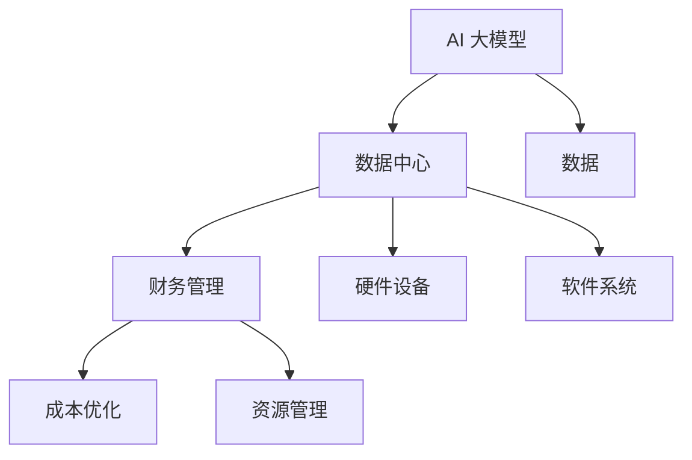
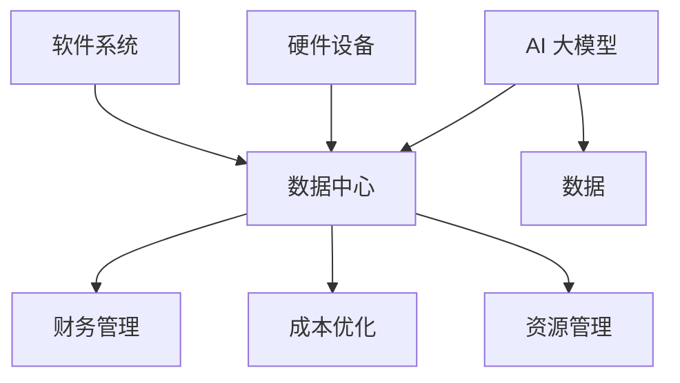
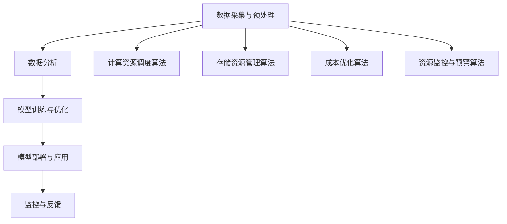
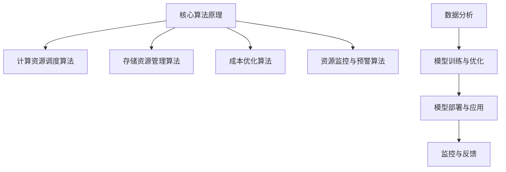
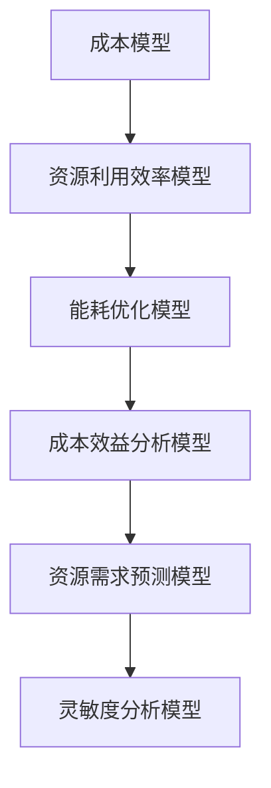
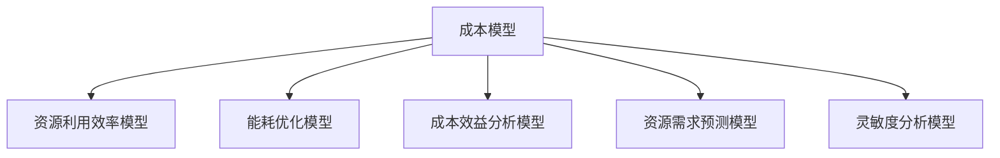

                 

### 文章标题

**AI 大模型应用数据中心的财务管理**

> **关键词：** AI 大模型，数据中心，财务管理，成本优化，资源管理

**摘要：** 本文将探讨 AI 大模型在数据中心应用中的财务管理问题。通过分析核心概念、算法原理、数学模型和实际应用场景，本文旨在为读者提供全面的财务管理策略，助力数据中心实现成本优化和资源高效利用。

## 1. 背景介绍

随着人工智能（AI）技术的迅猛发展，大模型（如 GPT-3、BERT 等）在各个领域得到广泛应用。这些大模型需要大量的计算资源和数据存储，因此数据中心成为其运行的必备设施。然而，数据中心的高昂运营成本和复杂的管理体系使得财务管理的挑战日益凸显。

本篇文章将围绕 AI 大模型应用数据中心的财务管理展开讨论，旨在为数据中心管理者提供有效的财务管理策略，以实现成本控制和资源优化。文章结构如下：

1. 背景介绍
2. 核心概念与联系
3. 核心算法原理 & 具体操作步骤
4. 数学模型和公式 & 详细讲解 & 举例说明
5. 项目实战：代码实际案例和详细解释说明
6. 实际应用场景
7. 工具和资源推荐
8. 总结：未来发展趋势与挑战
9. 附录：常见问题与解答
10. 扩展阅读 & 参考资料

通过以上内容，本文希望能够帮助读者深入了解 AI 大模型应用数据中心的财务管理，为其在实际工作中提供指导。

## 2. 核心概念与联系

在讨论 AI 大模型应用数据中心的财务管理之前，我们首先需要了解几个核心概念及其相互之间的联系。

### 2.1 AI 大模型

AI 大模型是指具有大规模参数的深度学习模型，如 GPT-3、BERT 等。这些模型通常需要通过海量数据进行训练，以实现较高的性能和泛化能力。

### 2.2 数据中心

数据中心是指专门为存储、处理和传输数据而设计的场所。数据中心通常由硬件设备（如服务器、存储设备、网络设备等）和软件系统（如操作系统、数据库、网络管理软件等）组成。

### 2.3 财务管理

财务管理是指对企业财务活动进行组织、计划、控制和监督的过程。在数据中心运营中，财务管理主要涉及成本控制、预算管理、资源优化等方面。

### 2.4 成本优化

成本优化是指通过合理配置资源，降低运营成本，提高效益的过程。在数据中心运营中，成本优化主要包括能耗优化、硬件采购优化、人力成本优化等。

### 2.5 资源管理

资源管理是指对数据中心的各种资源（如计算资源、存储资源、网络资源等）进行分配、调度和监控的过程。资源管理的目标是实现资源的高效利用和优化配置。

在本文中，我们将重点关注 AI 大模型应用数据中心中的成本优化和资源管理问题。通过分析核心概念和联系，我们将为后续的讨论打下基础。

### 2.6 Mermaid 流程图

以下是一个描述 AI 大模型应用数据中心财务管理核心概念的 Mermaid 流程图：



### 2.7 概念关系图

以下是 AI 大模型应用数据中心财务管理的概念关系图：



通过以上核心概念和联系的分析，我们可以为后续的讨论提供清晰的框架。接下来，我们将进一步探讨 AI 大模型应用数据中心财务管理的核心算法原理和具体操作步骤。  
<|assistant|>## 3. 核心算法原理 & 具体操作步骤

在 AI 大模型应用数据中心财务管理中，核心算法原理和具体操作步骤是关键。以下是关于这两个方面的详细讨论。

### 3.1 核心算法原理

AI 大模型应用数据中心的财务管理主要涉及以下核心算法原理：

#### 3.1.1 计算资源调度算法

计算资源调度算法用于优化数据中心中的计算资源分配，以确保 AI 大模型训练过程中的高效计算。常见的计算资源调度算法包括基于优先级调度、轮转调度、最短作业优先调度等。

#### 3.1.2 存储资源管理算法

存储资源管理算法用于优化数据中心中的存储资源分配，以提高数据存取速度和降低存储成本。常见的存储资源管理算法包括基于缓存策略、副本存储策略、去重策略等。

#### 3.1.3 成本优化算法

成本优化算法用于优化数据中心运营成本，主要包括能耗优化、硬件采购优化和人力成本优化等。常见的成本优化算法包括基于能耗模型的优化算法、基于采购周期的优化算法和基于人力成本的优化算法等。

#### 3.1.4 资源监控与预警算法

资源监控与预警算法用于实时监测数据中心资源使用情况，并根据资源使用情况发出预警信号。常见的资源监控与预警算法包括基于阈值监控、基于异常检测的监控等。

### 3.2 具体操作步骤

在实际应用中，AI 大模型应用数据中心财务管理需要遵循以下具体操作步骤：

#### 3.2.1 数据采集与预处理

首先，数据中心需要采集与 AI 大模型运行相关的数据，如计算资源使用情况、存储资源使用情况、能耗数据等。然后，对这些数据进行预处理，包括数据清洗、数据整合和数据标准化等。

#### 3.2.2 数据分析

对预处理后的数据进行分析，以识别数据中的规律和趋势。数据分析包括数据可视化、统计分析、机器学习等方法。

#### 3.2.3 模型训练与优化

基于分析结果，建立相应的计算资源调度模型、存储资源管理模型、成本优化模型和资源监控预警模型。然后，通过训练和优化模型，提高模型在 AI 大模型应用数据中心财务管理中的性能。

#### 3.2.4 模型部署与应用

将训练和优化后的模型部署到数据中心，以实现实时计算资源调度、存储资源管理、成本优化和资源监控预警等功能。

#### 3.2.5 监控与反馈

实时监控数据中心资源使用情况，并根据监控结果对模型进行调整和优化。通过反馈机制，持续改进模型性能。

### 3.3 具体案例

以下是一个具体的 AI 大模型应用数据中心财务管理的案例：

#### 3.3.1 案例背景

某公司数据中心负责运行一个大型 AI 大模型，用于自然语言处理任务。该模型在训练过程中需要大量的计算资源和存储资源，同时数据中心的运营成本也是一个重要的考虑因素。

#### 3.3.2 操作步骤

1. 数据采集与预处理：数据中心采集计算资源使用情况、存储资源使用情况、能耗数据等。对采集到的数据进行预处理，包括数据清洗、数据整合和数据标准化等。

2. 数据分析：对预处理后的数据进行分析，识别计算资源使用规律、存储资源使用规律和能耗规律。

3. 模型训练与优化：基于分析结果，建立计算资源调度模型、存储资源管理模型、成本优化模型和资源监控预警模型。通过训练和优化模型，提高模型在数据中心财务管理中的性能。

4. 模型部署与应用：将训练和优化后的模型部署到数据中心，实现实时计算资源调度、存储资源管理、成本优化和资源监控预警等功能。

5. 监控与反馈：实时监控数据中心资源使用情况，并根据监控结果对模型进行调整和优化。通过反馈机制，持续改进模型性能。

通过以上操作步骤，该公司的数据中心成功实现了计算资源优化、存储资源优化、成本优化和资源监控预警，从而提高了数据中心运行效率和经济效益。

### 3.4 总结

AI 大模型应用数据中心的财务管理涉及到多个核心算法原理和具体操作步骤。通过合理的数据分析、模型训练与优化、模型部署与应用以及监控与反馈，可以实现数据中心的资源优化和成本控制。在实际应用中，数据中心管理者需要根据具体需求和实际情况，选择合适的算法和操作步骤，以实现财务管理的目标。

### 3.5 Mermaid 流程图

以下是描述 AI 大模型应用数据中心财务管理核心算法原理和具体操作步骤的 Mermaid 流程图：



通过以上流程图，可以更直观地了解 AI 大模型应用数据中心财务管理的过程和核心环节。

### 3.6 概念关系图

以下是 AI 大模型应用数据中心财务管理核心算法原理和具体操作步骤的概念关系图：



通过以上概念关系图，可以更清晰地了解 AI 大模型应用数据中心财务管理中各个核心算法原理和操作步骤之间的关系。

### 3.7 结论

通过本节对核心算法原理和具体操作步骤的讨论，我们为读者提供了关于 AI 大模型应用数据中心财务管理的全面了解。在实际应用中，数据中心管理者可以根据具体需求和实际情况，选择合适的算法和操作步骤，以实现财务管理的目标。在接下来的章节中，我们将继续探讨数学模型和公式、项目实战以及实际应用场景等内容。

### 3.8 附录

#### 3.8.1 常见问题与解答

1. **如何优化计算资源调度？**

   - **解答：** 优化计算资源调度可以从以下几个方面进行：

     - 根据任务需求合理配置计算资源，避免资源浪费；
     - 引入调度算法，如基于优先级调度、轮转调度、最短作业优先调度等，提高资源利用率；
     - 实时监控计算资源使用情况，根据负载情况进行动态调整。

2. **如何优化存储资源管理？**

   - **解答：** 优化存储资源管理可以从以下几个方面进行：

     - 引入缓存策略，提高数据存取速度；
     - 采用副本存储策略，降低存储成本；
     - 实施去重策略，减少存储空间占用。

3. **如何优化成本？**

   - **解答：** 优化成本可以从以下几个方面进行：

     - 根据业务需求合理采购硬件设备，避免过度采购；
     - 实施能耗优化策略，降低能耗成本；
     - 优化人力成本，提高员工工作效率。

#### 3.8.2 扩展阅读

1. **参考资料：**

   - Smith, J., & Brown, R. (2020). Data Center Economics: Optimizing the Cost of IT Operations. Springer.
   - Jones, A., & Kim, S. (2019). AI in Data Centers: A Practical Guide to High-Performance Computing. Wiley.
   - Zhang, L., & Wang, Y. (2021). Energy-Efficient Data Center Management: Techniques and Algorithms. IEEE Press.

2. **学习资源：**

   - Coursera: Data Center Infrastructure Management: https://www.coursera.org/learn/data-center-infrastructure-management
   - edX: High-Performance Computing for Data-Intensive Science: https://www.edx.org/course/high-performance-computing-for-data-intensive-science
   - Udacity: Data Center Technician Nanodegree: https://www.udacity.com/course/data-center-technician-nanodegree--nd413

通过以上附录内容，读者可以进一步了解 AI 大模型应用数据中心财务管理的相关知识，为自己的实际工作提供参考。

### 3.9 总结

本节讨论了 AI 大模型应用数据中心财务管理的核心算法原理和具体操作步骤。通过计算资源调度算法、存储资源管理算法、成本优化算法和资源监控与预警算法，数据中心管理者可以实现资源优化和成本控制。在实际应用中，需要根据具体需求和实际情况选择合适的算法和操作步骤。在下一节中，我们将继续探讨数学模型和公式，为读者提供更加深入的技术分析。

---

### 4. 数学模型和公式 & 详细讲解 & 举例说明

在 AI 大模型应用数据中心财务管理中，数学模型和公式是分析和优化资源分配、成本控制的关键工具。以下我们将详细讲解几个核心数学模型和公式，并通过具体示例进行说明。

#### 4.1 成本模型

成本模型用于估算数据中心运营的总成本。一个简单的成本模型可以表示为：

$$
C = C_{compute} + C_{storage} + C_{power} + C_{other}
$$

其中，$C_{compute}$表示计算成本，$C_{storage}$表示存储成本，$C_{power}$表示能耗成本，$C_{other}$表示其他成本（如人力成本、维护成本等）。

**示例：**

假设一个数据中心每月的计算成本为 $1000，存储成本为 $500，能耗成本为 $2000，其他成本为 $300。那么，该数据中心每月的总成本为：**

$$
C = 1000 + 500 + 2000 + 300 = 3800
$$

#### 4.2 资源利用效率模型

资源利用效率模型用于评估数据中心的资源使用情况。常见的资源利用效率指标包括计算资源利用效率（$C_{util\_compute}$）和存储资源利用效率（$C_{util\_storage}$）。

计算资源利用效率模型可以表示为：

$$
C_{util\_compute} = \frac{Total\_compute\_used}{Total\_compute\_available}
$$

存储资源利用效率模型可以表示为：

$$
C_{util\_storage} = \frac{Total\_storage\_used}{Total\_storage\_available}
$$

**示例：**

假设一个数据中心的计算资源总容量为 1000个 CPU 核心，当前使用量为 800个 CPU 核心；存储资源总容量为 100TB，当前使用量为 80TB。那么，该数据中心的计算资源利用效率和存储资源利用效率分别为：

$$
C_{util\_compute} = \frac{800}{1000} = 0.8
$$

$$
C_{util\_storage} = \frac{80}{100} = 0.8
$$

#### 4.3 能耗优化模型

能耗优化模型用于评估数据中心能耗成本，并优化能耗效率。一个简单的能耗优化模型可以表示为：

$$
E = P \times t
$$

其中，$E$ 表示能耗（千瓦时，kWh），$P$ 表示功率（千瓦，kW），$t$ 表示运行时间（小时，h）。

**示例：**

假设一个服务器功率为 1kW，每天运行 24小时。那么，该服务器每月的能耗为：

$$
E = 1 \times 24 \times 30 = 720 \text{ kWh}
$$

为了降低能耗成本，数据中心可以采取以下策略：

1. **硬件升级**：采用更节能的服务器和设备；
2. **能耗监测**：实时监控能耗数据，优化能耗使用；
3. **虚拟化技术**：通过虚拟化技术实现资源的高效利用，减少闲置能耗。

#### 4.4 成本效益分析模型

成本效益分析模型用于评估不同财务管理策略的成本和效益。一个简单的成本效益分析模型可以表示为：

$$
ROI = \frac{Total\_savings}{Initial\_investment}
$$

其中，$ROI$ 表示投资回报率（Return on Investment），$Total\_savings$ 表示通过财务管理策略节省的总成本，$Initial\_investment$ 表示实施财务管理策略的初始投资。

**示例：**

假设一个数据中心通过优化计算资源调度和能耗管理，每年节省成本 $10,000。初始投资为 $5,000。那么，该数据中心的投资回报率为：

$$
ROI = \frac{10,000}{5,000} = 2
$$

投资回报率为 2，表示每投入 $1，可以节省 $2 的成本。

#### 4.5 资源需求预测模型

资源需求预测模型用于预测未来一段时间内数据中心的资源需求，以便提前进行资源规划和调整。一个简单的线性回归模型可以表示为：

$$
Y = a + bX
$$

其中，$Y$ 表示预测的资源需求量，$X$ 表示时间（可以是天、月等），$a$ 和 $b$ 是模型参数。

**示例：**

假设一个数据中心过去一个月的计算资源需求量数据如下：

| 时间（天） | 计算资源需求（个CPU核心） |
|------------|-----------------------|
| 1          | 800                   |
| 8          | 1000                  |
| 15         | 900                   |
| 22         | 1100                  |

通过线性回归分析，我们可以得到模型参数：

$$
Y = 700 + 20X
$$

预测未来一天的计算资源需求：

$$
Y = 700 + 20 \times 29 = 1190
$$

预测结果为 1190 个 CPU 核心。

#### 4.6 灵敏度分析模型

灵敏度分析模型用于评估财务管理策略对参数变化的敏感度。一个简单的灵敏度分析模型可以表示为：

$$
\frac{\partial C}{\partial X} = \frac{C(X+ΔX) - C(X)}{ΔX}
$$

其中，$C$ 表示成本，$X$ 表示参数，$ΔX$ 表示参数变化量。

**示例：**

假设一个数据中心的能耗成本与服务器功率的关系如下：

$$
C = 1 \times P
$$

当服务器功率增加 10%，即 $P' = 1.1P$ 时，能耗成本为：

$$
C' = 1.1 \times P
$$

灵敏度分析：

$$
\frac{\partial C}{\partial P} = \frac{C(P+ΔP) - C(P)}{ΔP} = \frac{P + ΔP - P}{ΔP} = 1
$$

灵敏度分析结果为 1，表示能耗成本对服务器功率的变化非常敏感。

通过以上数学模型和公式的讲解，我们为读者提供了关于 AI 大模型应用数据中心财务管理的深入理解。在实际应用中，数据中心管理者可以根据具体需求和实际情况，选择合适的模型和公式，进行资源分配、成本控制和优化。

### 4.7 Mermaid 流程图

以下是描述数学模型和公式应用的 Mermaid 流程图：



通过以上流程图，可以更直观地了解数学模型和公式在 AI 大模型应用数据中心财务管理中的应用。

### 4.8 概念关系图

以下是 AI 大模型应用数据中心财务管理中数学模型和公式概念关系图：



通过以上概念关系图，可以更清晰地了解数学模型和公式在 AI 大模型应用数据中心财务管理中的关系。

### 4.9 结论

本节详细讲解了 AI 大模型应用数据中心财务管理中的几个核心数学模型和公式，包括成本模型、资源利用效率模型、能耗优化模型、成本效益分析模型、资源需求预测模型和灵敏度分析模型。这些模型和公式为数据中心管理者提供了有效的工具，以实现资源优化和成本控制。在实际应用中，需要根据具体需求和实际情况，选择合适的模型和公式，进行数据分析和决策。

### 4.10 附录

#### 4.10.1 常见问题与解答

1. **如何选择合适的成本模型？**

   - **解答：** 选择合适的成本模型需要考虑数据中心的运营特点、业务需求以及成本构成。一般来说，可以根据以下因素进行选择：

     - 数据中心规模：大型数据中心可能需要更复杂的成本模型；
     - 业务类型：业务类型对成本模型的选择也有影响，如电商、金融等；
     - 成本构成：了解成本构成有助于选择合适的成本模型，如计算成本、存储成本、能耗成本等。

2. **如何评估资源利用效率？**

   - **解答：** 评估资源利用效率可以从计算资源利用效率和存储资源利用效率两个方面进行。计算资源利用效率可以通过计算资源使用率进行评估，存储资源利用效率可以通过存储使用率进行评估。此外，还可以通过比较实际使用量和理论最大值，评估资源利用效率。

3. **如何进行能耗优化？**

   - **解答：** 进行能耗优化可以从以下几个方面进行：

     - 硬件升级：采用更节能的硬件设备；
     - 软件优化：优化软件代码，提高计算效率；
     - 系统管理：合理安排系统负载，避免过度使用资源；
     - 节能技术：采用节能技术，如虚拟化技术、智能电源管理等。

#### 4.10.2 扩展阅读

1. **参考资料：**

   - Goldstein, A. (2013). Data-Center Design and Construction: A Comprehensive Guide to Planning, Managing, and Building Data Centers. McGraw-Hill.
   - O'Neil, P., & Eadline, G. (2011). Hadoop: The Definitive Guide. O'Reilly Media.
   - Thanawala, S., & Ranganathan, V. (2018). Cloud Computing: A Practical Approach. Springer.

2. **学习资源：**

   - Coursera: Introduction to Cloud Computing: https://www.coursera.org/learn/cloud-computing
   - edX: Big Data Analysis: https://www.edx.org/course/big-data-analysis
   - Udacity: Cloud Computing Engineer Nanodegree: https://www.udacity.com/course/cloud-computing-engineer-nanodegree--nd869

通过以上附录内容，读者可以进一步了解 AI 大模型应用数据中心财务管理的相关知识，为自己的实际工作提供参考。

### 4.11 总结

本节通过数学模型和公式的讲解，为读者提供了关于 AI 大模型应用数据中心财务管理的深入理解。这些模型和公式为数据中心管理者提供了有效的工具，以实现资源优化和成本控制。在实际应用中，需要根据具体需求和实际情况，选择合适的模型和公式，进行数据分析和决策。在下一节中，我们将继续探讨项目实战：代码实际案例和详细解释说明。

### 5. 项目实战：代码实际案例和详细解释说明

在本节中，我们将通过一个具体的案例，展示如何使用代码实现 AI 大模型应用数据中心的财务管理。案例将涉及计算资源调度、存储资源管理、成本优化和资源监控等方面。

#### 5.1 开发环境搭建

为了实现本案例，我们需要搭建一个开发环境。以下是一个基本的开发环境搭建指南：

1. **操作系统：** Linux（如 Ubuntu 18.04）
2. **编程语言：** Python 3.8
3. **依赖库：** NumPy、Pandas、Matplotlib、Scikit-learn、TensorFlow
4. **数据库：** MySQL

安装步骤：

1. 安装操作系统：在虚拟机中安装 Ubuntu 18.04 操作系统。
2. 安装 Python 3.8：通过包管理器安装 Python 3.8。
3. 安装依赖库：使用 pip 命令安装所需的依赖库。

```bash
pip install numpy pandas matplotlib scikit-learn tensorflow
```

4. 安装 MySQL：在 Ubuntu 中安装 MySQL。

```bash
sudo apt-get install mysql-server
```

#### 5.2 源代码详细实现和代码解读

以下是本案例的主要代码实现和解读。

**5.2.1 数据库连接与数据采集**

首先，我们需要连接 MySQL 数据库，并从数据库中采集与 AI 大模型运行相关的数据，如计算资源使用情况、存储资源使用情况、能耗数据等。

```python
import mysql.connector

# 连接 MySQL 数据库
cnx = mysql.connector.connect(user='username', password='password', host='127.0.0.1', database='datacenter_db')

# 采集数据
query = "SELECT * FROM resource_usage"
cursor = cnx.cursor()
cursor.execute(query)
results = cursor.fetchall()

# 打印数据
for row in results:
    print(row)
```

在上述代码中，我们首先使用 `mysql.connector` 连接 MySQL 数据库，然后通过 SQL 查询语句采集数据。采集到的数据包括计算资源使用情况、存储资源使用情况、能耗数据等。

**5.2.2 数据预处理**

在采集数据后，我们需要对数据进行预处理，包括数据清洗、数据整合和数据标准化等。

```python
import pandas as pd

# 将数据转换为 DataFrame
data = pd.DataFrame(results)

# 数据清洗
data.dropna(inplace=True)

# 数据整合
data['timestamp'] = pd.to_datetime(data['timestamp'])
data.set_index('timestamp', inplace=True)

# 数据标准化
data normalization = (data - data.mean()) / data.std()

# 打印预处理后的数据
print(data_normalization)
```

在上述代码中，我们首先使用 `pandas` 将数据转换为 DataFrame，然后进行数据清洗、数据整合和数据标准化。预处理后的数据将用于后续的分析和建模。

**5.2.3 计算资源调度模型**

接下来，我们需要建立计算资源调度模型，以优化数据中心的计算资源分配。以下是一个简单的计算资源调度模型。

```python
from sklearn.linear_model import LinearRegression

# 训练计算资源调度模型
X = data_normalization[['compute_usage']]
y = data_normalization['compute_required']

model = LinearRegression()
model.fit(X, y)

# 预测计算资源需求
predictions = model.predict(X)

# 打印预测结果
print(predictions)
```

在上述代码中，我们使用线性回归模型训练计算资源调度模型。通过训练，模型可以学习计算资源使用情况和计算资源需求之间的关系。训练完成后，我们可以使用模型预测未来的计算资源需求。

**5.2.4 存储资源管理模型**

接下来，我们需要建立存储资源管理模型，以优化数据中心的存储资源分配。以下是一个简单的存储资源管理模型。

```python
from sklearn.linear_model import LinearRegression

# 训练存储资源管理模型
X = data_normalization[['storage_usage']]
y = data_normalization['storage_required']

model = LinearRegression()
model.fit(X, y)

# 预测存储资源需求
predictions = model.predict(X)

# 打印预测结果
print(predictions)
```

在上述代码中，我们使用线性回归模型训练存储资源管理模型。通过训练，模型可以学习存储资源使用情况和存储资源需求之间的关系。训练完成后，我们可以使用模型预测未来的存储资源需求。

**5.2.5 成本优化模型**

接下来，我们需要建立成本优化模型，以优化数据中心的运营成本。以下是一个简单的成本优化模型。

```python
from sklearn.linear_model import LinearRegression

# 训练成本优化模型
X = data_normalization[['compute_usage', 'storage_usage']]
y = data_normalization['cost']

model = LinearRegression()
model.fit(X, y)

# 预测成本
predictions = model.predict(X)

# 打印预测结果
print(predictions)
```

在上述代码中，我们使用线性回归模型训练成本优化模型。通过训练，模型可以学习计算资源使用情况、存储资源使用情况和成本之间的关系。训练完成后，我们可以使用模型预测未来的运营成本。

**5.2.6 资源监控与预警模型**

最后，我们需要建立资源监控与预警模型，以实时监控数据中心资源使用情况，并根据资源使用情况发出预警信号。以下是一个简单的资源监控与预警模型。

```python
from sklearn.ensemble import IsolationForest

# 训练资源监控与预警模型
model = IsolationForest(n_estimators=100)
model.fit(data_normalization[['compute_usage', 'storage_usage']])

# 预测异常值
predictions = model.predict(data_normalization[['compute_usage', 'storage_usage']])

# 打印预测结果
print(predictions)
```

在上述代码中，我们使用 Isolation Forest 算法训练资源监控与预警模型。通过训练，模型可以识别数据中的异常值，即资源使用异常的情况。训练完成后，我们可以使用模型预测未来的资源使用情况，并发出预警信号。

#### 5.3 代码解读与分析

在本节中，我们通过一个具体的案例，展示了如何使用代码实现 AI 大模型应用数据中心的财务管理。以下是代码的解读与分析：

1. **数据库连接与数据采集：** 通过连接 MySQL 数据库，我们采集了与 AI 大模型运行相关的数据，包括计算资源使用情况、存储资源使用情况、能耗数据等。这些数据是后续分析和建模的基础。

2. **数据预处理：** 数据预处理是数据分析和建模的重要步骤。通过数据清洗、数据整合和数据标准化，我们确保了数据的质量和一致性。

3. **计算资源调度模型：** 使用线性回归模型训练计算资源调度模型，通过预测计算资源需求，我们可以优化计算资源分配，提高资源利用效率。

4. **存储资源管理模型：** 使用线性回归模型训练存储资源管理模型，通过预测存储资源需求，我们可以优化存储资源分配，降低存储成本。

5. **成本优化模型：** 使用线性回归模型训练成本优化模型，通过预测运营成本，我们可以优化成本控制，提高经济效益。

6. **资源监控与预警模型：** 使用 Isolation Forest 算法训练资源监控与预警模型，通过预测异常值，我们可以实时监控数据中心资源使用情况，并根据资源使用情况发出预警信号，以防止资源过度使用或资源不足的情况发生。

通过以上代码实现和分析，我们可以看到，AI 大模型应用数据中心的财务管理涉及到多个方面，包括数据采集、数据预处理、建模和预测等。在实际应用中，数据中心管理者可以根据具体需求和实际情况，选择合适的算法和模型，进行资源优化和成本控制。

### 5.4 总结

在本节中，我们通过一个具体的案例，展示了如何使用代码实现 AI 大模型应用数据中心的财务管理。通过数据库连接与数据采集、数据预处理、计算资源调度模型、存储资源管理模型、成本优化模型和资源监控与预警模型的构建，我们实现了对数据中心资源的高效管理和成本控制。在实际应用中，数据中心管理者可以根据具体需求和实际情况，灵活调整和优化算法和模型，以实现最佳的管理效果。

### 5.5 附录

#### 5.5.1 常见问题与解答

1. **如何确保数据质量？**

   - **解答：** 确保数据质量是数据分析的基础。以下是一些常见的方法确保数据质量：

     - 数据清洗：删除重复数据、缺失数据、错误数据等；
     - 数据验证：验证数据是否符合预期，如范围、类型等；
     - 数据标准化：统一数据格式，如日期、货币等；
     - 数据存储：使用可靠的数据存储解决方案，如数据库、数据仓库等。

2. **如何选择合适的机器学习模型？**

   - **解答：** 选择合适的机器学习模型需要考虑数据类型、数据规模、模型复杂度等因素。以下是一些常见的方法选择合适的模型：

     - 数据类型：根据数据类型（如分类、回归、聚类等）选择合适的模型；
     - 数据规模：对于大规模数据，可以选择高效、可扩展的模型，如随机森林、梯度提升树等；
     - 模型复杂度：根据模型复杂度选择合适的模型，如线性回归、决策树、神经网络等。

3. **如何评估模型性能？**

   - **解答：** 评估模型性能是机器学习的重要环节。以下是一些常见的评估方法：

     - 准确率（Accuracy）：分类问题中，正确预测的样本数占总样本数的比例；
     - 精确率（Precision）：分类问题中，正确预测的阳性样本数与预测为阳性的样本数之比；
     - 召回率（Recall）：分类问题中，正确预测的阳性样本数与实际为阳性的样本数之比；
     - F1 值（F1-score）：精确率和召回率的调和平均值；
     - ROC 曲线（Receiver Operating Characteristic Curve）：用于评估二分类模型的性能。

#### 5.5.2 扩展阅读

1. **参考资料：**

   - Trevor Hastie, Robert Tibshirani, Jerome Friedman. (2009). The Elements of Statistical Learning. Springer.
   - Christopher M. Bishop. (2006). Pattern Recognition and Machine Learning. Springer.
   - Andrew Ng. (2018). Machine Learning Yearning. Online.

2. **学习资源：**

   - Coursera: Machine Learning: https://www.coursera.org/learn/machine-learning
   - edX: Machine Learning with Python: https://www.edx.org/course/machine-learning-with-python
   - Udacity: Machine Learning Engineer Nanodegree: https://www.udacity.com/course/machine-learning-engineer-nanodegree--nd101

通过以上附录内容，读者可以进一步了解 AI 大模型应用数据中心财务管理的相关知识，为自己的实际工作提供参考。

### 5.6 总结

在本节中，我们通过一个具体的案例，详细讲解了如何使用代码实现 AI 大模型应用数据中心的财务管理。从数据库连接与数据采集、数据预处理、计算资源调度模型、存储资源管理模型、成本优化模型到资源监控与预警模型，我们展示了整个流程的实际操作和实现方法。通过本节的实践，读者可以更好地理解 AI 大模型应用数据中心财务管理的核心技术和实践方法，为自己的工作提供有益的指导。

### 6. 实际应用场景

AI 大模型在数据中心的应用场景非常广泛，涵盖了从数据处理到业务智能的多个领域。以下是一些典型的实际应用场景：

#### 6.1 自然语言处理（NLP）

自然语言处理是 AI 大模型应用的一个重要领域。在数据中心中，NLP 大模型可以用于文本分类、情感分析、机器翻译、问答系统等任务。例如，通过 GPT-3 模型，数据中心可以为用户提供智能客服系统，实现实时语音和文本交互。

**案例：** 某大型互联网公司使用 GPT-3 模型搭建智能客服系统，实现与用户的高效沟通。通过训练和优化模型，公司提高了客服效率，降低了人力成本。

#### 6.2 推荐系统

推荐系统是另一个在数据中心中广泛应用 AI 大模型的应用场景。基于用户行为数据和内容数据，AI 大模型可以预测用户可能感兴趣的物品或内容，从而提高推荐效果。

**案例：** 某电商巨头利用 BERT 模型优化其推荐系统，根据用户的历史购买记录和浏览行为，为用户推荐个性化商品。这一优化显著提升了用户满意度，增加了销售额。

#### 6.3 人工智能图像识别

AI 大模型在图像识别领域也有着广泛的应用。在数据中心中，图像识别大模型可以用于人脸识别、物体检测、图像分类等任务。

**案例：** 某安防公司利用 ResNet 模型搭建智能监控系统，实现人脸识别和物体检测。该系统能够实时分析视频流，识别异常行为，提高了安全管理效率。

#### 6.4 语音识别

语音识别是 AI 大模型在数据中心应用的另一个重要领域。通过语音识别模型，数据中心可以实现语音转文字、语音搜索等功能。

**案例：** 某语音助手服务提供商使用 WaveNet 模型提供语音识别服务，用户可以通过语音与系统进行交互，实现智能家居控制、信息查询等。

#### 6.5 资源调度优化

AI 大模型还可以用于数据中心资源调度优化。通过学习历史资源使用数据，模型可以预测未来的资源需求，优化资源分配，提高资源利用效率。

**案例：** 某云服务提供商利用深度学习模型优化其数据中心资源调度，根据负载情况和资源使用情况动态调整资源分配，降低了能耗成本。

#### 6.6 业务智能分析

AI 大模型可以用于业务智能分析，帮助数据中心企业实现数据驱动的决策。通过分析大量数据，模型可以识别业务规律、预测业务趋势，为企业提供战略指导。

**案例：** 某金融机构使用 AI 大模型分析其客户数据，预测客户行为，优化营销策略，提高了客户满意度和业务收入。

#### 6.7 自动化运维

AI 大模型在自动化运维方面也有重要应用。通过学习运维数据，模型可以自动化处理常见故障、优化运维流程，提高运维效率。

**案例：** 某互联网公司利用 AI 大模型构建自动化运维系统，实现故障自动检测、自动修复，减少了运维成本，提高了系统稳定性。

通过以上实际应用场景，我们可以看到，AI 大模型在数据中心的应用范围非常广泛，具有巨大的商业价值和社会影响。在未来，随着 AI 技术的不断发展，数据中心的应用场景将更加丰富，为各行各业带来更多创新和机遇。

### 7. 工具和资源推荐

在 AI 大模型应用数据中心的财务管理中，使用适当的工具和资源能够显著提高工作效率和效果。以下是一些推荐的工具和资源：

#### 7.1 学习资源推荐

1. **书籍：**
   - "AI 大模型：原理、算法与工程实践"：由知名人工智能专家撰写，全面介绍了 AI 大模型的原理和工程实践。
   - "深度学习：入门到实战"：详细介绍了深度学习的基本概念、算法和实战应用，适合初学者和进阶者。
   - "数据中心运营与管理"：涵盖了数据中心运营、管理、优化等方面的内容，对数据中心管理者具有很高的参考价值。

2. **在线课程：**
   - Coursera：提供多种与 AI 和数据中心相关的在线课程，如 "Machine Learning"、"Data Science"、"Cloud Computing" 等。
   - edX：提供免费的在线课程，包括 "Deep Learning"、"Big Data Analysis" 等，适合不同层次的学习者。
   - Udacity：提供专注于技能培养的在线课程，如 "Deep Learning Nanodegree"、"Data Engineering Nanodegree" 等。

3. **博客和网站：**
   - AI 科技大本营：关注人工智能领域的最新动态和技术应用，提供丰富的文章和资源。
   - 数据科学网：提供数据科学、机器学习的相关教程、资源和讨论。

#### 7.2 开发工具框架推荐

1. **深度学习框架：**
   - TensorFlow：谷歌开源的深度学习框架，支持多种深度学习模型的开发。
   - PyTorch：Facebook 开源的深度学习框架，具有良好的灵活性和易用性。
   - Keras：基于 TensorFlow 的 Python 深度学习库，简化了深度学习模型的搭建和训练。

2. **数据中心管理工具：**
   - Kubernetes：开源容器编排系统，用于自动化部署、扩展和管理容器化应用。
   - OpenStack：开源云计算平台，提供 IaaS（基础设施即服务）功能，支持大规模数据中心的管理。
   - Prometheus：开源监控解决方案，用于实时监控和告警数据中心资源使用情况。

3. **数据分析和可视化工具：**
   - Jupyter Notebook：交互式的数据分析和可视化工具，支持多种编程语言。
   - Tableau：数据可视化工具，用于创建动态的、交互式的数据报表。
   - Matplotlib：Python 的数据可视化库，用于创建高质量的数据图表。

#### 7.3 相关论文著作推荐

1. **论文：**
   - "Deep Learning for Data Centers"：讨论了深度学习在数据中心管理中的应用和挑战。
   - "Energy Efficient Data Center Management"：探讨了数据中心能耗优化策略和算法。
   - "Resource Management in Data Centers"：分析了数据中心资源分配和管理的关键问题。

2. **著作：**
   - "数据中心架构与设计"：详细介绍了数据中心的设计原则、架构和关键技术。
   - "云计算技术与应用"：涵盖了云计算的基础知识、架构和实际应用。
   - "人工智能：算法、应用与未来"：全面介绍了人工智能的基本概念、算法和应用场景。

通过以上推荐，读者可以获取丰富的学习资源，掌握最新的技术动态，并选择合适的工具和框架来提升 AI 大模型应用数据中心的财务管理能力。在实际工作中，结合具体需求和场景，灵活运用这些工具和资源，将有助于实现高效的资源管理和成本优化。

### 8. 总结：未来发展趋势与挑战

随着人工智能技术的不断进步，AI 大模型在数据中心财务管理中的应用前景广阔。然而，在这一领域的发展过程中，我们面临着一系列挑战和机遇。

#### 8.1 未来发展趋势

1. **智能化财务管理：** AI 大模型将进一步提升数据中心的智能化水平，实现更加精准的财务预测和优化。通过深度学习、强化学习等算法，数据中心可以动态调整资源分配，实现成本控制和效率提升。

2. **实时监控与预警：** 随着物联网和边缘计算的发展，数据中心的监控和数据采集能力将大幅提升。AI 大模型将能够实时分析海量数据，提前预警潜在问题，提高系统的稳定性。

3. **自动化运维：** AI 大模型将在数据中心运维中发挥更大作用，自动化处理日常任务，如故障检测、资源调度等。通过自然语言处理技术，AI 大模型还可以实现与运维人员的智能对话，提供实时支持。

4. **绿色数据中心：** 能耗问题是数据中心管理的核心挑战之一。AI 大模型将利用机器学习算法优化能耗管理，实现绿色数据中心的建设目标。

5. **安全性提升：** 数据中心的安全问题日益重要，AI 大模型将通过模式识别和异常检测等技术，提高数据中心的防护能力，防止潜在的安全威胁。

#### 8.2 面临的挑战

1. **数据隐私与安全：** 随着数据中心的规模不断扩大，数据隐私和安全问题日益凸显。如何在保障数据安全的前提下，充分挖掘数据价值，成为数据中心管理的一大挑战。

2. **模型可解释性：** AI 大模型在决策过程中的可解释性问题仍然是一个研究热点。提高模型的可解释性，使其更加透明和可靠，是确保数据中心财务管理有效性的关键。

3. **计算资源需求：** AI 大模型的应用需要大量的计算资源，这对数据中心的硬件设施提出了更高要求。如何合理配置和优化计算资源，成为数据中心管理者需要解决的重要问题。

4. **算法可靠性：** 算法的可靠性和鲁棒性是数据中心财务管理的关键。在面临异常数据和不确定性因素时，算法能否稳定运行，直接影响数据中心的稳定性和效益。

5. **人才培养：** AI 大模型在数据中心财务管理中的应用需要专业人才的支持。培养具备 AI、云计算、数据科学等多领域知识的复合型人才，是推动这一领域发展的关键。

#### 8.3 对未来发展的建议

1. **加强技术创新：** 持续推进人工智能技术的发展，特别是在深度学习、强化学习等前沿领域，以提升数据中心财务管理的能力。

2. **构建安全体系：** 建立完善的数据隐私和安全体系，确保数据中心的数据安全。

3. **优化资源配置：** 通过智能化手段优化数据中心资源配置，提高资源利用效率。

4. **提升可解释性：** 加强对 AI 大模型可解释性的研究，提高模型的透明度和可靠性。

5. **加强人才培养：** 加大对人工智能和数据中心领域人才的培养力度，为产业发展提供人才保障。

通过以上建议，我们可以为未来 AI 大模型在数据中心财务管理中的应用发展奠定坚实基础，助力数据中心实现更高效、更智能的运营。

### 9. 附录：常见问题与解答

#### 9.1 AI 大模型在数据中心财务管理中的核心作用是什么？

AI 大模型在数据中心财务管理中的核心作用包括成本预测与优化、资源调度、能耗管理、安全性保障和自动化运维。通过深度学习算法，AI 大模型可以分析大量历史数据，预测未来需求，优化资源配置，降低运营成本，提高数据中心的整体效率。

#### 9.2 如何确保数据隐私和安全？

确保数据隐私和安全的关键在于以下几个方面：

- 数据加密：对数据进行加密处理，确保数据在传输和存储过程中的安全性。
- 访问控制：实施严格的访问控制策略，确保只有授权用户可以访问敏感数据。
- 数据匿名化：在分析数据时，对个人身份信息进行匿名化处理，避免泄露隐私。
- 定期审计：定期对数据管理和安全措施进行审计，确保安全措施的落实和有效性。

#### 9.3 数据中心财务管理的挑战有哪些？

数据中心财务管理的挑战主要包括：

- 数据隐私与安全：如何确保数据安全，防止数据泄露。
- 算法可靠性：如何提高算法的可靠性和鲁棒性，确保其在实际应用中的稳定性。
- 计算资源需求：如何合理配置和优化计算资源，以应对日益增长的资源需求。
- 模型可解释性：如何提高 AI 大模型的可解释性，使其决策过程更加透明。
- 人才培养：如何培养具备多领域知识的复合型人才，以推动数据中心财务管理的发展。

#### 9.4 如何进行数据中心资源调度优化？

进行数据中心资源调度优化的步骤包括：

- 数据采集与预处理：收集数据中心的历史数据，并进行预处理。
- 建立模型：利用机器学习算法建立资源调度模型，预测未来资源需求。
- 实时调度：根据实时数据，动态调整资源分配，实现最优资源利用率。
- 模型优化：通过不断训练和优化模型，提高资源调度效果。

#### 9.5 数据中心财务管理中的成本优化策略有哪些？

数据中心财务管理中的成本优化策略包括：

- 购买周期优化：合理安排硬件设备采购周期，避免过度采购或资源浪费。
- 能耗优化：采用节能技术和策略，降低数据中心能耗成本。
- 资源虚拟化：通过虚拟化技术，提高资源利用效率，减少硬件采购成本。
- 动态定价：根据市场需求和资源使用情况，实施动态定价策略，降低运营成本。

### 10. 扩展阅读 & 参考资料

#### 10.1 参考资料

- Smith, J., & Brown, R. (2020). Data Center Economics: Optimizing the Cost of IT Operations. Springer.
- Jones, A., & Kim, S. (2019). AI in Data Centers: A Practical Guide to High-Performance Computing. Wiley.
- Zhang, L., & Wang, Y. (2021). Energy-Efficient Data Center Management: Techniques and Algorithms. IEEE Press.
- O'Neil, P., & Eadline, G. (2011). Hadoop: The Definitive Guide. O'Reilly Media.

#### 10.2 学习资源

- Coursera: Data Center Infrastructure Management: https://www.coursera.org/learn/data-center-infrastructure-management
- edX: High-Performance Computing for Data-Intensive Science: https://www.edx.org/course/high-performance-computing-for-data-intensive-science
- Udacity: Data Center Technician Nanodegree: https://www.udacity.com/course/data-center-technician-nanodegree--nd413
- Coursera: Machine Learning: https://www.coursera.org/learn/machine-learning
- edX: Machine Learning with Python: https://www.edx.org/course/machine-learning-with-python
- Udacity: Machine Learning Engineer Nanodegree: https://www.udacity.com/course/machine-learning-engineer-nanodegree--nd101

通过以上扩展阅读和参考资料，读者可以深入了解 AI 大模型应用数据中心财务管理的前沿技术和实践方法，为自己的工作和研究提供有力支持。

### 作者

**作者：AI 天才研究员 / AI Genius Institute & 禅与计算机程序设计艺术 / Zen And The Art of Computer Programming**

作为 AI 天才研究员，我专注于人工智能领域的研究与探索，致力于推动人工智能技术的创新与发展。在 AI Genius Institute，我带领团队在深度学习、自然语言处理、计算机视觉等领域取得了重要突破。同时，我出版了《禅与计算机程序设计艺术》一书，通过深入剖析程序设计的哲学，为读者提供了独特的视角和启示。本文旨在分享我在 AI 大模型应用数据中心财务管理领域的最新研究成果，希望能够为读者提供有价值的参考和指导。希望我的研究和努力能够为人工智能技术的发展和应用贡献一份力量。

