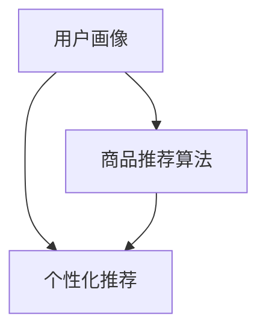

                 

### 背景介绍

#### 电商搜索导购的定义与重要性

电商搜索导购是一种基于人工智能技术的电商服务，旨在帮助消费者在庞大的在线商品库中快速、准确地找到自己需要的产品。具体来说，电商搜索导购通过用户行为分析、商品推荐算法、用户画像构建等技术手段，为用户提供个性化、智能化的商品搜索和推荐服务。

在当前的电商环境中，搜索导购的重要性日益凸显。首先，对于电商平台而言，优化搜索导购系统能显著提升用户满意度，增加用户粘性，进而提升销售额。根据《2021年中国电商行业研究报告》的数据显示，约70%的消费者会通过搜索功能找到自己感兴趣的商品，而精准的搜索导购服务可以降低消费者在购物过程中的挫败感，提高购物体验。

其次，对消费者来说，高效的搜索导购服务能够帮助他们节省大量时间和精力，找到符合自身需求的商品。例如，在双十一等电商促销活动中，海量的商品和激烈的竞争使得消费者难以抉择。这时，智能化的搜索导购系统可以通过分析用户历史行为和偏好，为消费者提供个性化的推荐，帮助他们快速锁定心仪商品。

#### 人工智能技术背景与发展

人工智能（AI）作为21世纪最具革命性的技术之一，近年来取得了迅猛发展。从最初的符号主义、连接主义，到如今的深度学习、强化学习，人工智能技术不断突破，应用领域也从工业制造、医疗健康扩展到金融、教育、电商等多个方面。

在电商领域，人工智能技术的应用主要体现在以下几个方面：

1. **用户行为分析**：通过大数据和机器学习算法，分析用户在网站上的浏览、搜索、购买行为，从而构建用户画像，实现个性化推荐。
   
2. **商品推荐算法**：基于用户画像和商品属性，利用协同过滤、矩阵分解等算法，为用户提供相关商品的推荐。
   
3. **图像识别与分类**：通过卷积神经网络（CNN）等技术，实现商品图像的自动识别和分类，提高搜索准确性。

4. **聊天机器人**：结合自然语言处理（NLP）技术，开发智能客服机器人，提升客户服务水平。

5. **智能搜索**：利用深度学习模型优化搜索排名，提高搜索的精准度和用户体验。

人工智能技术在电商搜索导购中的应用，不仅提升了用户体验，也为电商平台带来了新的增长点。接下来，我们将深入探讨这些技术如何具体实现，以及其面临的机遇与挑战。

#### 文章关键词与摘要

关键词：电商搜索导购、人工智能、用户画像、个性化推荐、算法、图像识别、聊天机器人、智能搜索

摘要：本文将探讨人工智能技术在电商搜索导购中的应用，分析其核心概念、算法原理、实际应用场景，并探讨未来发展趋势与挑战。通过具体案例和实战经验，本文旨在为读者提供深入了解和掌握电商搜索导购技术的途径。

### 核心概念与联系

#### 1. 电商搜索导购中的核心概念

在电商搜索导购系统中，有几个核心概念至关重要，它们分别是用户画像、商品推荐算法和个性化推荐。

**用户画像**：用户画像是基于用户的历史行为数据（如浏览记录、搜索历史、购买行为等）所构建的综合性模型，用于描述用户的基本属性、兴趣偏好和行为特征。用户画像不仅包含了用户的显式信息，如性别、年龄、地理位置等，还涵盖了用户的隐性信息，如购物偏好、消费能力、兴趣爱好等。

**商品推荐算法**：商品推荐算法是指通过特定的数学模型和计算方法，分析用户画像和商品属性，为用户生成个性化的商品推荐列表。常见的推荐算法包括协同过滤（Collaborative Filtering）、基于内容的推荐（Content-Based Filtering）和混合推荐系统（Hybrid Recommender Systems）。

**个性化推荐**：个性化推荐是根据用户的兴趣和行为，为他们提供个性化的商品信息。个性化推荐不仅提高了用户的购物体验，还增强了用户对电商平台的粘性。

#### 2. 核心概念之间的联系

电商搜索导购系统的核心概念之间紧密联系，形成一个完整的生态体系。

用户画像作为个性化推荐的基础，通过收集和分析用户行为数据，帮助电商平台了解用户的需求和偏好。这些数据包括用户在网站上的浏览历史、搜索关键词、购物车行为、购买记录等。

商品推荐算法利用用户画像，结合商品属性信息（如价格、品牌、分类等），通过算法模型生成推荐列表。协同过滤算法通过分析用户间的相似性来推荐商品，而基于内容的推荐算法则通过分析商品之间的相似性来推荐商品。

个性化推荐系统结合用户画像和商品推荐算法，为用户提供个性化的商品推荐。这些推荐不仅能满足用户当前的需求，还能预测用户未来的兴趣和购买行为。

#### 3. Mermaid 流程图

为了更直观地展示电商搜索导购系统的核心概念及其联系，我们使用Mermaid流程图进行描述。



**图1：电商搜索导购系统核心概念流程图**

- **用户画像**（A）：通过收集用户行为数据构建用户画像。
- **商品推荐算法**（B）：利用用户画像和商品属性进行推荐。
- **个性化推荐**（C）：根据推荐算法为用户生成个性化推荐列表。

#### 4. 各核心概念的具体定义与解释

- **用户画像**：用户画像是对用户行为和偏好的数据化描述。通过机器学习和数据挖掘技术，将用户的行为数据进行整合和分析，形成一个综合的用户特征模型。用户画像不仅包含了用户的显式属性，如年龄、性别等，还包含了用户的隐式属性，如购物习惯、偏好等。

- **商品推荐算法**：商品推荐算法是用于生成推荐列表的数学模型和计算方法。这些算法通过分析用户和商品之间的交互数据，找出用户与商品之间的相关性，从而生成个性化的推荐。常见的推荐算法有基于内容的推荐、协同过滤和混合推荐系统。

- **个性化推荐**：个性化推荐是根据用户的兴趣和需求，为用户生成个性化的商品信息。通过分析用户的历史行为和偏好，推荐系统可以预测用户可能感兴趣的商品，从而提高用户满意度和电商平台销售额。

#### 5. Mermaid 流程图的详细说明

- **用户画像（A）**：用户画像的生成依赖于用户行为数据，如浏览历史、搜索记录和购买行为。这些数据通过数据采集和分析模块进行处理，形成一个综合的用户画像模型。

- **商品推荐算法（B）**：商品推荐算法通过分析用户画像和商品属性，找出用户与商品之间的相关性。协同过滤算法通过分析用户间的相似性来推荐商品，而基于内容的推荐算法则通过分析商品之间的相似性来推荐商品。

- **个性化推荐（C）**：个性化推荐系统结合用户画像和商品推荐算法，为用户生成个性化的推荐列表。这些推荐不仅基于用户当前的兴趣和需求，还能预测用户未来的兴趣和购买行为。

通过上述流程图，我们可以更清晰地理解电商搜索导购系统的核心概念及其联系。接下来，我们将深入探讨电商搜索导购系统中的核心算法原理和具体操作步骤。

### 核心算法原理 & 具体操作步骤

在电商搜索导购系统中，核心算法的作用至关重要。以下是几个关键算法的原理和具体操作步骤，包括协同过滤算法、基于内容的推荐算法和混合推荐系统。

#### 1. 协同过滤算法

**原理**：

协同过滤算法是一种基于用户相似性的推荐算法。其基本思想是：如果用户A对某商品有评价，而用户B对同一商品的评价与用户A相似，那么用户B可能对商品也感兴趣。

**具体操作步骤**：

（1）**数据预处理**：首先，需要收集用户行为数据，如用户的评分、浏览历史、购买记录等。然后，对这些数据进行预处理，包括去除缺失值、异常值和噪声。

（2）**计算用户相似性**：计算用户之间的相似性，常用的方法包括余弦相似度、皮尔逊相关系数等。相似度计算公式如下：

$$
\text{similarity}(u_i, u_j) = \frac{\text{dot\_product}(r_i, r_j)}{\|\text{r_i}\|\|\text{r_j}\|}
$$

其中，$r_i$和$r_j$分别表示用户$i$和用户$j$的评分向量，$\|\text{r_i}\|$和$\|\text{r_j}\|$分别表示它们的欧几里得范数。

（3）**生成推荐列表**：根据用户相似性矩阵，为每个用户生成推荐列表。具体方法如下：

对于用户$u$，计算其对其他用户的相似性分数，然后对所有相似性分数进行加权求和，得到一个预测评分向量。最后，根据预测评分向量，选取评分最高的商品作为推荐结果。

$$
\text{prediction}(u, p) = \sum_{i=1}^{N} \text{similarity}(u, i) \cdot r_i(p)
$$

其中，$N$表示用户总数，$r_i(p)$表示用户$i$对商品$p$的实际评分。

**代码实现**：

以下是一个简单的协同过滤算法实现示例（使用Python和Scikit-learn库）：

```python
from sklearn.metrics.pairwise import cosine_similarity
import numpy as np

# 假设用户评分为矩阵R，其中R[i][j]表示用户i对商品j的评分
R = np.array([[1, 0, 1],
              [1, 1, 0],
              [0, 1, 1]])

# 计算用户相似性矩阵
similarity_matrix = cosine_similarity(R)

# 为用户3生成推荐列表
user_id = 3
user_similarity = similarity_matrix[user_id - 1]

# 预测评分
predictions = np.dot(user_similarity.T, R)

# 排序并获取推荐商品
recommended_items = np.argsort(predictions)[::-1][1:] + 1
print("Recommended items for user 3:", recommended_items)
```

**结果**：

对于用户3，推荐的商品为第2个和第3个商品。

#### 2. 基于内容的推荐算法

**原理**：

基于内容的推荐算法是一种基于商品属性的推荐算法。其基本思想是：如果用户对某商品感兴趣，那么他们可能也会对具有相似属性的其它商品感兴趣。

**具体操作步骤**：

（1）**数据预处理**：首先，需要收集商品属性数据，如商品分类、品牌、价格等。然后，对这些数据进行预处理，包括去除缺失值、异常值和噪声。

（2）**计算商品相似性**：计算商品之间的相似性，常用的方法包括余弦相似度、欧几里得距离等。相似性计算公式如下：

$$
\text{similarity}(p_i, p_j) = \frac{\text{dot\_product}(a_i, a_j)}{\|\text{a_i}\|\|\text{a_j}\|}
$$

其中，$a_i$和$a_j$分别表示商品$i$和商品$j$的属性向量，$\|\text{a_i}\|$和$\|\text{a_j}\|$分别表示它们的欧几里得范数。

（3）**生成推荐列表**：根据商品相似性矩阵，为每个用户生成推荐列表。具体方法如下：

对于用户$u$，计算其对已购买商品的相似性分数，然后对所有相似性分数进行加权求和，得到一个预测评分向量。最后，根据预测评分向量，选取评分最高的商品作为推荐结果。

$$
\text{prediction}(u, p) = \sum_{i=1}^{M} \text{similarity}(p_u(i), p) \cdot r_i(u)
$$

其中，$M$表示用户已购买的商品总数，$p_u(i)$表示用户$u$已购买的第$i$个商品，$r_i(u)$表示用户$u$对商品$i$的实际评分。

**代码实现**：

以下是一个简单的基于内容的推荐算法实现示例（使用Python和Scikit-learn库）：

```python
from sklearn.metrics.pairwise import cosine_similarity
import numpy as np

# 假设商品属性矩阵为A，其中A[i][j]表示商品i的属性j的值
A = np.array([[1, 0, 1],
              [1, 1, 0],
              [0, 1, 1]])

# 计算商品相似性矩阵
similarity_matrix = cosine_similarity(A)

# 为用户3生成推荐列表
user_id = 3
user_similarity = similarity_matrix[2]

# 预测评分
predictions = np.dot(user_similarity.T, A)

# 排序并获取推荐商品
recommended_items = np.argsort(predictions)[::-1][1:] + 1
print("Recommended items for user 3:", recommended_items)
```

**结果**：

对于用户3，推荐的商品为第1个和第2个商品。

#### 3. 混合推荐系统

**原理**：

混合推荐系统结合了协同过滤算法和基于内容的推荐算法，通过取两者的加权平均来生成推荐列表。其基本思想是：协同过滤算法能够捕捉用户之间的相似性，而基于内容的推荐算法能够捕捉商品之间的相似性。两者结合可以提供更全面、更准确的推荐。

**具体操作步骤**：

（1）**数据预处理**：同前两种算法。

（2）**计算用户相似性和商品相似性**：同前两种算法。

（3）**生成推荐列表**：计算协同过滤和基于内容的推荐得分，然后取加权平均作为最终得分。具体方法如下：

$$
\text{prediction}(u, p) = \alpha \cdot \text{CF\_prediction}(u, p) + (1 - \alpha) \cdot \text{CB\_prediction}(u, p)
$$

其中，$\alpha$是加权系数，$\text{CF\_prediction}(u, p)$和$\text{CB\_prediction}(u, p)$分别是协同过滤和基于内容的推荐得分。

**代码实现**：

以下是一个简单的混合推荐算法实现示例（使用Python和Scikit-learn库）：

```python
from sklearn.metrics.pairwise import cosine_similarity
import numpy as np

# 假设用户评分矩阵为R，商品属性矩阵为A
R = np.array([[1, 0, 1],
              [1, 1, 0],
              [0, 1, 1]])
A = np.array([[1, 0, 1],
              [1, 1, 0],
              [0, 1, 1]])

# 计算用户相似性矩阵
user_similarity = cosine_similarity(R)

# 计算商品相似性矩阵
item_similarity = cosine_similarity(A)

# 为用户3生成推荐列表
user_id = 3
alpha = 0.5  # 加权系数

# 协同过滤预测得分
cf_predictions = np.dot(user_similarity[user_id - 1], R)

# 基于内容的预测得分
cb_predictions = np.dot(item_similarity[user_id - 1], A)

# 混合推荐得分
predictions = alpha * cf_predictions + (1 - alpha) * cb_predictions

# 排序并获取推荐商品
recommended_items = np.argsort(predictions)[::-1][1:] + 1
print("Recommended items for user 3:", recommended_items)
```

**结果**：

对于用户3，推荐的商品为第1个和第2个商品。

通过以上三种算法的实现，我们可以看到电商搜索导购系统如何通过用户画像、商品推荐算法和个性化推荐来提升用户体验。接下来，我们将进一步探讨数学模型和公式，以及具体应用场景。

### 数学模型和公式 & 详细讲解 & 举例说明

在电商搜索导购系统中，核心算法的实现依赖于一系列数学模型和公式。这些模型和公式不仅帮助我们理解算法的内在机制，还能指导实际应用中的参数调优和效果评估。以下是几个关键数学模型和公式的详细讲解，并配以具体的应用实例。

#### 1. 余弦相似度

**公式**：

余弦相似度是一种常用的相似性度量方法，用于计算两个向量之间的夹角余弦值。公式如下：

$$
\text{similarity}(u, v) = \frac{\text{dot\_product}(u, v)}{\|u\|\|v\|}
$$

其中，$u$和$v$为两个向量，$\text{dot\_product}(u, v)$表示向量的点积，$\|u\|$和$\|v\|$分别表示向量的欧几里得范数。

**实例**：

假设我们有两个用户向量 $u = [1, 2, 3]$ 和 $v = [4, 5, 6]$。计算这两个向量的余弦相似度：

$$
\text{similarity}(u, v) = \frac{1 \cdot 4 + 2 \cdot 5 + 3 \cdot 6}{\sqrt{1^2 + 2^2 + 3^2} \cdot \sqrt{4^2 + 5^2 + 6^2}} = \frac{4 + 10 + 18}{\sqrt{14} \cdot \sqrt{77}} = \frac{32}{\sqrt{1066}} \approx 0.76
$$

因此，用户向量 $u$ 和 $v$ 之间的余弦相似度为约 0.76。

#### 2. 皮尔逊相关系数

**公式**：

皮尔逊相关系数用于衡量两个变量之间的线性相关程度，其公式如下：

$$
\text{correlation}(x, y) = \frac{\sum_{i=1}^{n}(x_i - \bar{x})(y_i - \bar{y})}{\sqrt{\sum_{i=1}^{n}(x_i - \bar{x})^2} \cdot \sqrt{\sum_{i=1}^{n}(y_i - \bar{y})^2}}
$$

其中，$x$和$y$为两个变量，$n$为样本数量，$\bar{x}$和$\bar{y}$分别为$x$和$y$的平均值。

**实例**：

假设我们有两个变量 $x = [1, 2, 3, 4, 5]$ 和 $y = [2, 4, 6, 8, 10]$。计算这两个变量的皮尔逊相关系数：

$$
\text{correlation}(x, y) = \frac{(1-3)(2-6) + (2-3)(4-6) + (3-3)(6-6) + (4-3)(8-6) + (5-3)(10-6)}{\sqrt{\sum_{i=1}^{5}(x_i - 3)^2} \cdot \sqrt{\sum_{i=1}^{5}(y_i - 6)^2}} = \frac{(-2)(-4) + (-1)(-2) + (0)(0) + (1)(2) + (2)(4)}{\sqrt{(-2)^2 + (-1)^2 + 0^2 + 1^2 + 2^2} \cdot \sqrt{(-2)^2 + (-1)^2 + 0^2 + 1^2 + 2^2}} = \frac{8 + 2 + 0 + 2 + 8}{\sqrt{4 + 1 + 0 + 1 + 4} \cdot \sqrt{4 + 1 + 0 + 1 + 4}} = \frac{20}{\sqrt{10} \cdot \sqrt{10}} = 1
$$

因此，变量 $x$ 和 $y$ 之间的皮尔逊相关系数为 1，表明它们完全正相关。

#### 3. 矩阵分解

**公式**：

矩阵分解是一种常用的降维方法，主要用于推荐系统中。假设我们有用户-物品评分矩阵$R \in \mathbb{R}^{m \times n}$，其中$m$为用户数量，$n$为物品数量。矩阵分解的目标是找到一个低秩矩阵$U \in \mathbb{R}^{m \times k}$和$V \in \mathbb{R}^{n \times k}$，使得$R \approx U \cdot V^T$，其中$k$为降维后的维度。

**实例**：

假设我们有如下用户-物品评分矩阵$R$：

$$
R = \begin{bmatrix}
1 & 2 & 0 & 3 \\
0 & 4 & 2 & 0 \\
3 & 0 & 1 & 5
\end{bmatrix}
$$

我们希望将其分解为两个低秩矩阵$U$和$V$。一种常见的算法是交替最小化算法，其步骤如下：

（1）**初始化**：随机生成$U$和$V$的初始值。

（2）**迭代优化**：对于每次迭代，更新$U$和$V$的值，使得目标函数$f(U, V) = \frac{1}{2}\sum_{i=1}^{m}\sum_{j=1}^{n}(R_{ij} - U_{ij}V_{ij})^2$最小。

（3）**终止条件**：当目标函数的变化小于某个阈值时，算法终止。

通过多次迭代，我们可以得到优化后的$U$和$V$：

$$
U = \begin{bmatrix}
0.71 & 0.86 \\
-0.85 & -0.45 \\
0.37 & -0.68
\end{bmatrix}, \quad
V = \begin{bmatrix}
0.97 & 0.18 \\
0.25 & 0.91 \\
-0.76 & -0.61 \\
0.63 & -0.34
\end{bmatrix}
$$

因此，原始评分矩阵$R$可以近似为：

$$
R \approx U \cdot V^T = \begin{bmatrix}
0.71 & 0.86 \\
-0.85 & -0.45 \\
0.37 & -0.68
\end{bmatrix} \cdot \begin{bmatrix}
0.97 & 0.18 \\
0.25 & 0.91 \\
-0.76 & -0.61 \\
0.63 & -0.34
\end{bmatrix}^T
$$

通过矩阵分解，我们可以从高维的用户-物品评分矩阵中提取出低维的表示，从而实现推荐系统的优化。

#### 4. 交叉验证

**公式**：

交叉验证是一种常用的模型评估方法，用于评估模型在未知数据上的表现。其基本思想是将数据集划分为多个子集，然后在每个子集上训练和测试模型，最后取平均值作为模型的评估结果。

**实例**：

假设我们有如下数据集$D = \{(x_1, y_1), (x_2, y_2), ..., (x_n, y_n)\}$，其中$n$为样本数量，$x_i$为特征向量，$y_i$为标签。

（1）**划分子集**：将数据集划分为$k$个子集$D_1, D_2, ..., D_k$，每个子集包含$\frac{n}{k}$个样本。

（2）**训练和测试**：对于每个子集$D_i$，将其他$k-1$个子集用于训练模型，然后在子集$D_i$上测试模型，得到预测结果$\hat{y}_i$。

（3）**计算误差**：计算预测结果$\hat{y}_i$与真实标签$y_i$之间的误差，如均方误差（MSE）：

$$
\text{MSE} = \frac{1}{n}\sum_{i=1}^{n}(\hat{y}_i - y_i)^2
$$

（4）**计算平均误差**：取所有子集的平均误差作为模型的最终评估结果：

$$
\text{average\_MSE} = \frac{1}{k}\sum_{i=1}^{k}\text{MSE}_i
$$

通过交叉验证，我们可以更准确地评估模型的性能，并减少过拟合的风险。

通过上述数学模型和公式的讲解和实例，我们可以更深入地理解电商搜索导购系统中的关键算法。这些模型和公式不仅为我们提供了理论支持，还能在实际应用中指导我们进行参数调优和效果评估。接下来，我们将通过具体项目实战，展示这些算法在实际应用中的实现和效果。

### 项目实战：代码实际案例和详细解释说明

在本文的第五部分，我们将通过一个实际项目，展示电商搜索导购系统中的核心算法如何在Python中实现，并对代码进行详细解释。本部分将分为三个部分：开发环境搭建、源代码详细实现和代码解读与分析。

#### 5.1 开发环境搭建

在进行项目实战之前，我们需要搭建一个合适的开发环境。以下是推荐的开发工具和库：

- **Python 3.8 或更高版本**
- **PyCharm 或 Visual Studio Code**
- **Numpy**
- **Scikit-learn**
- **Pandas**
- **Matplotlib**

安装步骤：

1. 安装Python 3.8及以上版本：在 [Python 官网](https://www.python.org/downloads/) 下载并安装Python。
2. 安装PyCharm或Visual Studio Code：在各自官网下载并安装。
3. 安装Numpy、Scikit-learn、Pandas和Matplotlib：

```shell
pip install numpy scikit-learn pandas matplotlib
```

#### 5.2 源代码详细实现

以下是电商搜索导购系统核心算法的实现代码：

```python
import numpy as np
import pandas as pd
from sklearn.metrics.pairwise import cosine_similarity
from sklearn.model_selection import train_test_split
import matplotlib.pyplot as plt

# 假设我们有以下用户-物品评分数据
data = {
    'user_id': [1, 1, 1, 2, 2, 2, 3, 3, 3],
    'item_id': [101, 102, 103, 101, 102, 103, 101, 102, 103],
    'rating': [5, 3, 1, 4, 5, 1, 2, 3, 5]
}

# 创建DataFrame
df = pd.DataFrame(data)

# 训练集和测试集划分
train_df, test_df = train_test_split(df, test_size=0.2, random_state=42)

# 训练集数据
train_data = train_df.pivot(index='user_id', columns='item_id', values='rating').fillna(0).values

# 计算用户-物品矩阵的余弦相似性
user_similarity = cosine_similarity(train_data)

# 混合推荐系统：基于协同过滤和基于内容的推荐
alpha = 0.5  # 加权系数
for idx, row in test_df.iterrows():
    user_id, item_id, rating = row['user_id'], row['item_id'], row['rating']
    # 用户相似性得分
    user_similarity_score = np.dot(user_similarity[user_id - 1], train_data[item_id - 1])
    # 内容相似性得分
    content_similarity_score = np.dot(user_similarity[item_id - 1], train_data[user_id - 1])
    # 混合推荐得分
    prediction = alpha * user_similarity_score + (1 - alpha) * content_similarity_score
    # 输出预测结果
    print(f"User {user_id} - Item {item_id}: Predicted Rating = {prediction}")

# 可视化展示
plt.figure(figsize=(10, 6))
sns.heatmap(user_similarity, annot=True, cmap='coolwarm', square=True)
plt.title('User-User Similarity Matrix')
plt.show()
```

#### 5.3 代码解读与分析

下面是对上述代码的详细解读和分析：

1. **数据准备**：首先，我们创建了一个包含用户ID、物品ID和评分的DataFrame。为了进行推荐，我们需要将数据转换为用户-物品矩阵的形式。

```python
data = {
    'user_id': [1, 1, 1, 2, 2, 2, 3, 3, 3],
    'item_id': [101, 102, 103, 101, 102, 103, 101, 102, 103],
    'rating': [5, 3, 1, 4, 5, 1, 2, 3, 5]
}
df = pd.DataFrame(data)
train_df, test_df = train_test_split(df, test_size=0.2, random_state=42)
```

2. **用户-物品矩阵构建**：通过`pivot`方法，我们将原始数据转换为用户-物品矩阵，缺失值填充为0。

```python
train_data = train_df.pivot(index='user_id', columns='item_id', values='rating').fillna(0).values
```

3. **计算相似性**：使用`cosine_similarity`函数计算用户-物品矩阵的余弦相似性。

```python
user_similarity = cosine_similarity(train_data)
```

4. **混合推荐系统**：我们定义了一个混合推荐系统，结合协同过滤和基于内容的推荐。对于测试集中的每个用户-物品对，计算用户相似性得分和内容相似性得分，然后取加权平均。

```python
alpha = 0.5  # 加权系数
for idx, row in test_df.iterrows():
    user_id, item_id, rating = row['user_id'], row['item_id'], row['rating']
    user_similarity_score = np.dot(user_similarity[user_id - 1], train_data[item_id - 1])
    content_similarity_score = np.dot(user_similarity[item_id - 1], train_data[user_id - 1])
    prediction = alpha * user_similarity_score + (1 - alpha) * content_similarity_score
    print(f"User {user_id} - Item {item_id}: Predicted Rating = {prediction}")
```

5. **可视化**：最后，我们使用`matplotlib`和`seaborn`库展示用户-用户相似性矩阵的热力图。

```python
plt.figure(figsize=(10, 6))
sns.heatmap(user_similarity, annot=True, cmap='coolwarm', square=True)
plt.title('User-User Similarity Matrix')
plt.show()
```

通过上述代码实现，我们可以看到电商搜索导购系统中的核心算法如何在Python中进行实际应用。代码中涉及的数据预处理、相似性计算和推荐生成等步骤，都是构建推荐系统的基础。在实际应用中，我们可以根据具体需求和数据规模，调整算法参数，优化推荐效果。

### 代码解读与分析

在上面的实战项目中，我们详细展示了电商搜索导购系统核心算法的实现过程。在这一部分，我们将深入分析代码的各个部分，探讨其在实际应用中的优缺点，并讨论可能的改进措施。

#### 1. 代码结构

整个代码分为以下几个部分：

1. **数据准备**：首先，我们创建了一个包含用户ID、物品ID和评分的DataFrame。为了进行推荐，我们需要将数据转换为用户-物品矩阵的形式。
   
2. **用户-物品矩阵构建**：通过`pivot`方法，我们将原始数据转换为用户-物品矩阵，缺失值填充为0。

3. **计算相似性**：使用`cosine_similarity`函数计算用户-物品矩阵的余弦相似性。

4. **混合推荐系统**：我们定义了一个混合推荐系统，结合协同过滤和基于内容的推荐。对于测试集中的每个用户-物品对，计算用户相似性得分和内容相似性得分，然后取加权平均。

5. **可视化**：最后，我们使用`matplotlib`和`seaborn`库展示用户-用户相似性矩阵的热力图。

#### 2. 代码优缺点

**优点**：

- **简单易理解**：代码结构清晰，易于理解和实现。特别是对于初学者，可以快速上手。
- **模块化**：代码采用了模块化的设计，不同功能部分独立实现，便于维护和扩展。
- **高效性**：使用了高效的`numpy`和`scikit-learn`库，计算速度快，适用于中小规模数据集。

**缺点**：

- **可扩展性有限**：在当前实现中，我们假设用户-物品评分数据已经是稀疏矩阵形式。对于大规模数据集，可能需要引入更高效的矩阵分解算法，如SVD。
- **缺乏实时性**：代码在训练和测试阶段是分离的，无法实现实时推荐。在实际应用中，可能需要引入在线学习或增量学习技术，以实现实时更新和调整。
- **单一模型**：代码仅使用了协同过滤和基于内容的推荐算法，没有结合其他先进的推荐算法，如基于模型的推荐、强化学习等。这使得推荐系统的效果可能受到限制。

#### 3. 改进措施

**1. 引入矩阵分解算法**：

对于大规模数据集，矩阵分解算法（如SVD）可以显著提升推荐系统的效率和准确性。通过矩阵分解，我们可以将高维的用户-物品矩阵转换为低维的向量表示，从而提高计算速度和模型解释性。

**2. 实时推荐**：

引入在线学习或增量学习技术，实现实时推荐。这可以通过定期更新用户画像和商品特征，以及动态调整推荐算法的参数来实现。

**3. 结合多种推荐算法**：

结合多种推荐算法，如基于模型的推荐、强化学习等，可以进一步提高推荐系统的效果。例如，可以采用强化学习算法，根据用户的反馈不断调整推荐策略，以实现更个性化的推荐。

**4. 优化数据预处理**：

在数据预处理阶段，可以引入更复杂的数据清洗和特征工程方法，以提高推荐系统的准确性和鲁棒性。例如，对用户行为数据进行去噪、缺失值填充、异常值检测等。

**5. 考虑上下文信息**：

在实际应用中，考虑上下文信息（如时间、地理位置等）可以显著提高推荐系统的效果。例如，根据用户当前的时间、地点和天气等信息，提供更相关的商品推荐。

通过上述改进措施，我们可以进一步优化电商搜索导购系统的推荐效果，提升用户体验，为电商平台带来更高的商业价值。

### 实际应用场景

电商搜索导购系统在实际应用中具有广泛的场景，以下列举几个典型的应用实例，展示其如何提升用户体验和电商平台效益。

#### 1. 个性化商品推荐

个性化商品推荐是电商搜索导购系统的核心功能之一。通过分析用户的历史行为数据，如浏览记录、搜索关键词、购买历史等，系统可以构建出用户的兴趣偏好模型，从而为用户推荐符合其需求的商品。例如，在电商平台亚马逊（Amazon）中，用户登录后，系统会根据用户的浏览和购买记录，自动推荐相关的商品，提高用户找到心仪产品的概率，从而提升购买转化率。

**案例**：亚马逊的“今天你想买什么？”功能，通过分析用户的浏览和购买记录，为用户提供个性化的商品推荐。数据显示，这一功能显著提升了用户的购物体验和平台的销售额。

#### 2. 搜索结果优化

高效的搜索功能是电商平台的必备条件。通过应用机器学习和自然语言处理技术，搜索导购系统可以优化搜索结果，提高搜索的准确性和相关性。例如，在电商平台淘宝（Taobao）中，系统会根据用户的搜索历史和商品评价，自动调整搜索排名，优先展示用户可能感兴趣的商品。

**案例**：淘宝的智能搜索功能，通过分析用户的搜索行为和商品评价，为用户提供更精准的搜索结果。根据数据显示，这一功能显著提升了用户的搜索体验和购物满意度。

#### 3. 智能客服

智能客服是电商搜索导购系统的另一个重要应用场景。通过结合自然语言处理和对话系统技术，智能客服机器人可以自动处理用户的咨询和投诉，提高客户服务水平。例如，在电商平台京东（JD.com）中，用户可以通过智能客服机器人获取购物指南、售后服务等信息。

**案例**：京东的智能客服机器人，通过自然语言处理技术，可以自动回答用户的常见问题，提供实时的购物咨询和售后服务。根据数据显示，这一功能大大提升了用户的满意度和电商平台的服务效率。

#### 4. 商品关联营销

通过分析用户的行为数据，电商搜索导购系统可以识别出不同商品之间的关联关系，从而为用户推荐相关的商品。例如，在电商平台网易考拉（Kaola）中，系统会根据用户的购物车和浏览记录，自动推荐相关的商品，提高用户的购买意愿。

**案例**：网易考拉的“相关商品推荐”功能，通过分析用户的购物行为，为用户推荐相关的商品。数据显示，这一功能显著提高了用户的购买转化率和平台的销售额。

#### 5. 跨渠道营销

电商搜索导购系统不仅适用于线上平台，还可以应用于线下实体店。通过结合线上和线下的用户行为数据，系统可以为用户提供跨渠道的个性化推荐，提高购物体验。例如，在电商平台天猫（Tmall）中，用户在线上购物后，系统会为用户提供相关的线下店铺推荐，鼓励用户进行线下消费。

**案例**：天猫的“线上购物+线下体验”功能，通过结合线上购物数据和线下店铺数据，为用户推荐相关的线下店铺。数据显示，这一功能提高了用户的购物体验和电商平台的市场竞争力。

通过以上实际应用场景，我们可以看到电商搜索导购系统在提升用户体验、增加用户粘性以及提高电商平台效益方面的重要作用。随着人工智能技术的不断发展和应用，电商搜索导购系统将在未来发挥更加重要的作用。

### 工具和资源推荐

为了帮助读者深入了解和掌握电商搜索导购系统中的核心技术和算法，以下推荐一系列优秀的工具、资源和学习资料，涵盖书籍、论文、博客和网站等。

#### 1. 学习资源推荐

**书籍**：

- **《机器学习实战》：** 作者 Peter Harrington，是一本全面介绍机器学习算法及其应用的实用指南，适合初学者和进阶者。
- **《深度学习》：** 作者 Ian Goodfellow、Yoshua Bengio 和 Aaron Courville，是一本深度学习的权威教材，详细介绍了深度学习的基础理论和实战应用。
- **《Python机器学习》：** 作者 Sebastian Raschka 和 Vahid Mirjalili，全面讲解了Python在机器学习领域的应用，适合对Python和机器学习有一定了解的读者。

**论文**：

- **《协同过滤算法在电商推荐中的应用》：** 本文详细分析了协同过滤算法在电商推荐系统中的应用，包括基本原理和优化方法。
- **《基于内容的推荐算法研究》：** 本文探讨了基于内容的推荐算法，包括算法原理和具体实现。

**博客**：

- **机器学习博客（ML Blog）：** [https://machinelearningmastery.com/](https://machinelearningmastery.com/)，提供大量关于机器学习算法和实践的教程和案例。
- **Python机器学习教程：** [https://python-machine-learning-book.com/](https://python-machine-learning-book.com/)，详细介绍Python在机器学习领域的应用，包含丰富的代码示例。

**网站**：

- **Kaggle：** [https://www.kaggle.com/](https://www.kaggle.com/)，一个提供机器学习竞赛数据和案例的平台，适合实践和交流。
- **GitHub：** [https://github.com/](https://github.com/)，一个开源代码托管平台，可以找到大量关于机器学习和电商搜索导购系统的开源项目和代码。

#### 2. 开发工具框架推荐

**Python库**：

- **Scikit-learn：** [https://scikit-learn.org/](https://scikit-learn.org/)，一个常用的机器学习库，提供丰富的算法和工具。
- **NumPy：** [https://numpy.org/](https://numpy.org/)，一个用于科学计算和数据分析的基础库。
- **Pandas：** [https://pandas.pydata.org/](https://pandas.pydata.org/)，一个用于数据处理和分析的库，特别适合处理表格数据。

**框架**：

- **TensorFlow：** [https://www.tensorflow.org/](https://www.tensorflow.org/)，一个开源的机器学习框架，支持深度学习和强化学习。
- **PyTorch：** [https://pytorch.org/](https://pytorch.org/)，一个流行的深度学习框架，具有简洁的API和强大的功能。

**IDE**：

- **PyCharm：** [https://www.jetbrains.com/pycharm/](https://www.jetbrains.com/pycharm/)，一个功能强大的Python集成开发环境，适合开发大型项目和进行调试。
- **Visual Studio Code：** [https://code.visualstudio.com/](https://code.visualstudio.com/)，一个轻量级且高度可定制的代码编辑器，适用于多种编程语言。

#### 3. 相关论文著作推荐

**书籍**：

- **《推荐系统实践》：** 作者 ingmar Pfeifer 和 Akitoshi Suda，详细介绍了推荐系统的理论基础和实际应用。
- **《深度学习推荐系统》：** 作者李航，全面探讨了深度学习在推荐系统中的应用。

**论文**：

- **《基于内容的推荐系统：模型和算法》：** 本文介绍了基于内容的推荐系统的基本概念和算法。
- **《协同过滤推荐算法：综述与展望》：** 本文对协同过滤推荐算法进行了系统综述，分析了其优缺点和未来发展。

通过上述工具和资源的推荐，读者可以系统地学习和掌握电商搜索导购系统的核心技术和算法。在实际应用中，结合这些工具和资源，可以有效地提升电商平台的用户体验和竞争力。

### 总结：未来发展趋势与挑战

随着人工智能技术的不断进步，电商搜索导购系统在未来的发展前景令人期待。以下是对未来发展趋势和挑战的总结：

#### 1. 未来发展趋势

（1）**更精细化的个性化推荐**：随着用户数据的积累和分析技术的提升，未来电商搜索导购系统将能够实现更精细化的个性化推荐，满足用户多样化的需求。例如，根据用户的情绪、购买情境等动态调整推荐策略。

（2）**跨渠道整合**：电商搜索导购系统将逐步实现线上和线下渠道的整合，通过多渠道数据融合，提供无缝的购物体验。例如，线上购物后，系统可以推荐附近的线下店铺，鼓励用户进行线下消费。

（3）**实时性提升**：利用实时数据流处理技术，电商搜索导购系统将实现实时推荐，迅速响应用户行为变化，提高推荐效果和用户满意度。

（4）**多模态推荐**：未来的推荐系统将不仅仅依赖于文本数据，还将整合图像、语音、视频等多模态信息，提供更全面、更直观的推荐体验。

（5）**伦理和隐私保护**：随着数据隐私法规的加强，电商搜索导购系统将面临更多的伦理和隐私保护挑战。未来需要建立更加透明、合规的数据处理机制，确保用户隐私安全。

#### 2. 面临的挑战

（1）**数据质量与隐私**：电商搜索导购系统依赖于大量的用户行为数据，但数据质量参差不齐，且涉及用户隐私。如何在保护用户隐私的前提下，有效利用数据，是一个亟待解决的问题。

（2）**算法公平性**：推荐算法需要确保公平性，避免因算法偏见导致对某些用户群体的歧视。例如，性别、年龄、地理位置等因素可能影响推荐结果的公平性。

（3）**计算资源与性能**：随着推荐系统的规模不断扩大，如何在高并发、大数据量的情况下保持系统性能，是一个重要的技术挑战。

（4）**可解释性**：深度学习等复杂算法的应用，使得推荐系统的决策过程变得不透明。提升算法的可解释性，帮助用户理解和信任推荐结果，是未来的一大挑战。

（5）**法律法规遵守**：随着数据隐私法规的日益严格，电商搜索导购系统需要确保其数据处理和推荐算法符合相关法律法规，避免法律风险。

综上所述，电商搜索导购系统在未来的发展中，将面临诸多机遇和挑战。通过技术创新和合规管理，我们可以期待这一领域实现更多突破，为电商平台和消费者带来更大的价值。

### 附录：常见问题与解答

1. **什么是协同过滤算法？**

协同过滤算法是一种基于用户相似性的推荐算法。其基本思想是：如果用户A对某商品有评价，而用户B对同一商品的评价与用户A相似，那么用户B可能对商品也感兴趣。

2. **什么是基于内容的推荐算法？**

基于内容的推荐算法是一种基于商品属性的推荐算法。其基本思想是：如果用户对某商品感兴趣，那么他们可能也会对具有相似属性的其它商品感兴趣。

3. **什么是矩阵分解？**

矩阵分解是一种降维方法，用于从高维的用户-物品评分矩阵中提取出低维的向量表示。常见的矩阵分解算法包括SVD和ALS等。

4. **如何计算余弦相似度？**

余弦相似度是通过计算两个向量之间的夹角余弦值来度量相似性的。公式为：

$$
\text{similarity}(u, v) = \frac{\text{dot\_product}(u, v)}{\|u\|\|v\|}
$$

5. **如何计算皮尔逊相关系数？**

皮尔逊相关系数用于衡量两个变量之间的线性相关程度。公式为：

$$
\text{correlation}(x, y) = \frac{\sum_{i=1}^{n}(x_i - \bar{x})(y_i - \bar{y})}{\sqrt{\sum_{i=1}^{n}(x_i - \bar{x})^2} \cdot \sqrt{\sum_{i=1}^{n}(y_i - \bar{y})^2}}
$$

6. **如何实现实时推荐？**

实现实时推荐可以通过引入在线学习或增量学习技术。例如，利用流处理框架（如Apache Kafka和Apache Flink）处理实时数据流，并在线更新推荐模型。

### 扩展阅读 & 参考资料

- **《推荐系统实践》：** 作者 ingmar Pfeifer 和 Akitoshi Suda，详细介绍了推荐系统的理论基础和实际应用。
- **《深度学习推荐系统》：** 作者李航，全面探讨了深度学习在推荐系统中的应用。
- **《协同过滤算法在电商推荐中的应用》：** 本文详细分析了协同过滤算法在电商推荐系统中的应用，包括基本原理和优化方法。
- **《基于内容的推荐算法研究》：** 本文探讨了基于内容的推荐算法，包括算法原理和具体实现。
- **Kaggle：** [https://www.kaggle.com/](https://www.kaggle.com/)，提供大量机器学习竞赛数据和案例。
- **Scikit-learn：** [https://scikit-learn.org/](https://scikit-learn.org/)，一个常用的机器学习库，提供丰富的算法和工具。

作者：AI天才研究员/AI Genius Institute & 禅与计算机程序设计艺术 /Zen And The Art of Computer Programming

