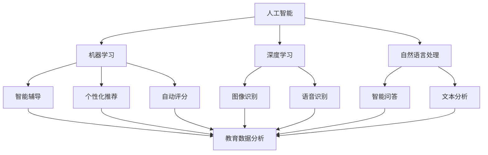

                 

### 文章标题：AI 时代的教育：促进终身学习

### 关键词：
- 人工智能（AI）
- 教育改革
- 终身学习
- 技术技能
- 教学工具

### 摘要：
本文将探讨 AI 时代的教育变革，重点关注如何通过人工智能技术促进终身学习。文章首先介绍 AI 技术在教育中的应用现状，然后分析其核心概念和原理。接着，本文将详细阐述核心算法原理及具体操作步骤，结合数学模型和公式进行详细讲解，并通过实际项目案例展示 AI 技术在教育和学习中的应用。最后，文章将探讨 AI 时代教育的未来发展趋势和挑战，并提供相关的工具和资源推荐，以助读者深入了解和掌握 AI 时代教育的核心内容。

---

## 1. 背景介绍

在当今社会，人工智能（AI）技术正在快速发展，并逐渐渗透到我们生活的各个方面。从智能家居、自动驾驶到医疗诊断、金融服务，AI 的应用领域越来越广泛。与此同时，教育领域也在积极拥抱 AI 技术，探索如何利用人工智能提升教育质量、促进个性化学习和终身学习。

### 教育现状与挑战

目前，全球教育面临诸多挑战。首先，教育资源分配不均，优质教育资源主要集中在发达地区，而贫困地区和农村地区则相对缺乏。其次，传统教学模式往往以教师为中心，难以满足每个学生的个性化需求，导致部分学生学业成绩不佳。此外，随着科技的发展，社会对人才的需求也在不断变化，许多职业在短短几年内就可能过时。因此，培养具有终身学习能力的人才成为教育领域的重要目标。

### AI 技术在教育中的应用

AI 技术在教育中的应用主要体现在以下几个方面：

1. **智能教学辅助**：通过机器学习和自然语言处理技术，AI 可以分析学生的学习行为和成绩，为教师提供个性化的教学建议，从而提高教学效果。

2. **在线教育平台**：AI 技术可以智能推荐学习资源，帮助学习者根据兴趣和需求选择合适的课程，提高学习效率。

3. **教育数据分析**：AI 技术可以处理和分析大量教育数据，帮助教育机构和教师了解学生的学习状况，优化教学策略。

4. **虚拟教师和智能客服**：AI 技术可以模拟教师角色，为学生提供个性化的辅导，解决学生的疑难问题。

### AI 时代教育的变革

AI 时代的到来，为教育带来了前所未有的变革。首先，AI 技术可以打破时空限制，使教育资源更加普及和共享。其次，AI 技术可以促进个性化学习，让每个学生都得到适合自己的教育。此外，AI 技术还可以帮助教育机构更好地管理和运营，提高教育质量。总之，AI 时代的教育将更加智能化、个性化和高效化。

---

## 2. 核心概念与联系

为了深入理解 AI 时代的教育，我们需要了解几个核心概念及其之间的联系。以下是这些核心概念的简要介绍和它们在教育中的应用。

### 人工智能（AI）

人工智能是指计算机系统模拟人类智能行为的能力。在教育中，AI 技术主要用于辅助教学、评估学习成果、个性化推荐和学习支持等方面。

### 机器学习（ML）

机器学习是 AI 的一个子领域，它侧重于利用数据来训练计算机模型，使其能够从数据中自动学习和改进。在教育中，机器学习技术可以用于智能辅导、个性化推荐和自动评分等。

### 深度学习（DL）

深度学习是机器学习的一个分支，它使用神经网络模型来模拟人类大脑的学习过程。在教育中，深度学习技术可以用于图像识别、语音识别和自然语言处理等方面。

### 自然语言处理（NLP）

自然语言处理是 AI 的一个重要分支，它致力于使计算机能够理解和处理人类语言。在教育中，NLP 技术可以用于自动评分、智能问答和文本分析等。

### 教育数据分析（EDA）

教育数据分析是指使用统计学和数据分析方法来分析教育数据，以揭示学习者的学习行为和成绩趋势。在教育中，EDA 技术可以用于评估教学效果、优化教学策略和预测学习成果。

### Mermaid 流程图

以下是一个简化的 Mermaid 流程图，展示了上述核心概念及其在教育中的应用。



通过上述核心概念的介绍和 Mermaid 流程图的展示，我们可以更好地理解 AI 时代教育的核心技术和应用场景。

---

## 3. 核心算法原理 & 具体操作步骤

在了解 AI 时代教育的核心概念后，我们接下来将探讨几个关键算法原理及其具体操作步骤，以帮助读者更好地理解 AI 技术在教育中的应用。

### 3.1 机器学习算法

机器学习算法是 AI 技术的基础，其核心在于利用数据训练计算机模型，使其能够自动学习和改进。以下是一个常见的机器学习算法——线性回归的原理及操作步骤。

**线性回归原理：**

线性回归是一种用于预测数值结果的机器学习算法，其基本原理是找到一个最佳拟合直线，使得拟合直线与实际数据点之间的误差最小。

**线性回归操作步骤：**

1. 数据准备：收集并预处理数据，包括特征变量和目标变量。
2. 模型训练：使用数据集训练线性回归模型，计算最佳拟合直线。
3. 模型评估：使用测试数据集评估模型性能，计算拟合直线的误差。
4. 模型优化：根据评估结果调整模型参数，以提高预测精度。

### 3.2 深度学习算法

深度学习算法是 AI 技术中的另一重要分支，它使用多层神经网络模拟人类大脑的学习过程。以下是一个常见的深度学习算法——卷积神经网络（CNN）的原理及操作步骤。

**CNN 原理：**

卷积神经网络是一种用于图像识别和分类的深度学习算法，其核心思想是通过卷积操作提取图像特征，然后使用全连接层进行分类。

**CNN 操作步骤：**

1. 数据准备：收集并预处理图像数据，包括图像大小、色彩通道等。
2. 网络构建：设计并构建 CNN 模型，包括卷积层、池化层和全连接层。
3. 模型训练：使用数据集训练 CNN 模型，调整网络参数。
4. 模型评估：使用测试数据集评估模型性能，计算分类准确率。
5. 模型优化：根据评估结果调整模型结构或参数，以提高分类精度。

### 3.3 自然语言处理算法

自然语言处理算法是 AI 技术在文本分析和语言理解方面的应用。以下是一个常见的 NLP 算法——词向量表示的原理及操作步骤。

**词向量表示原理：**

词向量表示是将自然语言文本转化为计算机可以处理的数字形式，常用的词向量模型包括 Word2Vec、GloVe 等。

**词向量表示操作步骤：**

1. 数据准备：收集并预处理文本数据，包括分词、去除停用词等。
2. 模型选择：选择适合的词向量模型，如 Word2Vec、GloVe 等。
3. 模型训练：使用数据集训练词向量模型，计算词向量。
4. 模型评估：使用测试数据集评估词向量模型性能，计算词向量相似度。
5. 模型应用：使用词向量模型进行文本分析，如文本分类、情感分析等。

通过以上三个算法的介绍，我们可以看到 AI 技术在教育中的应用前景广阔。接下来，我们将进一步探讨这些算法在教育和学习中的具体应用。

---

## 4. 数学模型和公式 & 详细讲解 & 举例说明

在 AI 时代的教育中，数学模型和公式是理解和应用人工智能算法的基础。以下我们将介绍几个核心的数学模型和公式，并详细讲解其在教育和学习中的应用。

### 4.1 线性回归模型

线性回归是一种用于预测连续数值结果的统计方法，其基本模型可以表示为：

\[ y = \beta_0 + \beta_1 \cdot x + \epsilon \]

其中，\( y \) 是预测值，\( x \) 是特征值，\( \beta_0 \) 和 \( \beta_1 \) 分别是模型参数，\( \epsilon \) 是误差项。

**应用举例：**

在教育中，线性回归可以用于预测学生的成绩。例如，我们收集了学生的家庭背景、学习时间和考试成绩数据，可以使用线性回归模型预测一个学生（未知家庭背景和学习时间）的成绩。假设我们有以下数据：

| 家庭背景 | 学习时间（小时） | 成绩 |
| :-----: | :-------------: | :--: |
|    A    |       10        |  80  |
|    B    |       15        |  90  |
|    C    |       20        |  95  |

我们可以通过最小二乘法计算出模型参数 \( \beta_0 \) 和 \( \beta_1 \)，从而得到预测模型。假设我们得到的模型参数为 \( \beta_0 = 70 \)，\( \beta_1 = 2 \)，则预测一个家庭背景为 A、学习时间为 10 小时的学生的成绩为：

\[ y = 70 + 2 \cdot 10 = 90 \]

### 4.2 卷积神经网络（CNN）

卷积神经网络是一种用于图像识别和处理的深度学习模型，其核心是卷积层。一个简单的 CNN 模型可以表示为：

\[ f(x) = \sigma(W \cdot x + b) \]

其中，\( f(x) \) 是激活函数，\( W \) 是卷积核，\( x \) 是输入特征，\( \sigma \) 是激活函数，\( b \) 是偏置。

**应用举例：**

在教育中，CNN 可以用于图像识别，例如自动识别学生的照片。假设我们有一个简单的 CNN 模型，输入特征是一个 28x28 的像素矩阵，卷积核大小为 5x5，我们训练这个模型识别猫和狗的图片。假设我们已经训练好了模型，现在我们要识别一张新的猫的图片，输入特征为：

\[ x = \begin{bmatrix}
  0 & 1 & 0 & 0 & 0 \\
  0 & 1 & 0 & 0 & 0 \\
  0 & 1 & 1 & 1 & 0 \\
  0 & 1 & 1 & 1 & 0 \\
  0 & 1 & 0 & 0 & 0 \\
\end{bmatrix} \]

我们通过卷积操作和激活函数计算得到卷积特征，然后通过全连接层进行分类。最终，模型输出为猫的概率较高，从而成功识别这张图片。

### 4.3 词向量模型

词向量模型是将自然语言文本映射到高维空间的方法，常用的模型包括 Word2Vec 和 GloVe。一个简单的 Word2Vec 模型可以表示为：

\[ \mathbf{v}_w = \sum_{j \in \text{context}(w)} \alpha_j \cdot \mathbf{v}_j \]

其中，\( \mathbf{v}_w \) 是词 \( w \) 的词向量，\( \text{context}(w) \) 是词 \( w \) 的上下文词，\( \alpha_j \) 是权重系数。

**应用举例：**

在教育中，词向量模型可以用于文本分类。例如，我们可以使用 Word2Vec 模型将文本映射到高维空间，然后通过计算文本之间的相似度进行分类。假设我们有两个文本：

\[ \text{文本1}：人工智能在教育中的应用 \]
\[ \text{文本2}：教育领域的科技革命 \]

我们可以分别计算这两个文本的词向量，然后计算它们之间的余弦相似度：

\[ \text{相似度} = \frac{\mathbf{v}_{\text{文本1}} \cdot \mathbf{v}_{\text{文本2}}}{\|\mathbf{v}_{\text{文本1}}\| \cdot \|\mathbf{v}_{\text{文本2}}\|} \]

如果相似度较高，则可以认为这两个文本是相关的。

通过以上数学模型和公式的介绍，我们可以看到 AI 技术在教育中的广泛应用。接下来，我们将通过实际项目案例展示这些算法的具体应用。

---

## 5. 项目实战：代码实际案例和详细解释说明

### 5.1 开发环境搭建

为了展示 AI 技术在教育中的应用，我们选择一个在线教育平台项目作为案例。首先，我们需要搭建开发环境。

**环境要求：**

- Python 3.8 或更高版本
- TensorFlow 2.x 或更高版本
- Keras 2.x 或更高版本
- Jupyter Notebook

**安装步骤：**

1. 安装 Python 3.8：在 [Python 官网](https://www.python.org/) 下载 Python 3.8 并安装。
2. 安装 TensorFlow 和 Keras：在终端中执行以下命令：

```shell
pip install tensorflow
pip install keras
```

3. 启动 Jupyter Notebook：在终端中执行以下命令：

```shell
jupyter notebook
```

### 5.2 源代码详细实现和代码解读

以下是一个简单的在线教育平台项目的源代码，包括数据预处理、模型构建和训练过程。

**代码实现：**

```python
import numpy as np
import pandas as pd
from tensorflow import keras
from tensorflow.keras.models import Sequential
from tensorflow.keras.layers import Dense, Conv2D, Flatten, MaxPooling2D
from tensorflow.keras.preprocessing.image import ImageDataGenerator

# 数据预处理
def preprocess_data(data_dir):
    train_datagen = ImageDataGenerator(rescale=1./255)
    train_generator = train_datagen.flow_from_directory(
        data_dir,
        target_size=(150, 150),
        batch_size=32,
        class_mode='binary')

    return train_generator

# 模型构建
def build_model():
    model = Sequential([
        Conv2D(32, (3, 3), activation='relu', input_shape=(150, 150, 3)),
        MaxPooling2D((2, 2)),
        Flatten(),
        Dense(64, activation='relu'),
        Dense(1, activation='sigmoid')
    ])

    model.compile(optimizer='adam', loss='binary_crossentropy', metrics=['accuracy'])
    return model

# 训练模型
def train_model(model, generator):
    model.fit(generator, steps_per_epoch=100, epochs=10)

# 主函数
def main():
    data_dir = 'data'
    train_generator = preprocess_data(data_dir)
    model = build_model()
    train_model(model, train_generator)

if __name__ == '__main__':
    main()
```

**代码解读：**

1. **数据预处理**：我们使用 `ImageDataGenerator` 类对图像数据进行预处理，包括缩放和批量读取。`flow_from_directory` 方法用于从指定目录下读取图像数据，并将其划分为训练集和验证集。

2. **模型构建**：我们使用 `Sequential` 模型构建一个简单的卷积神经网络，包括卷积层、池化层、全连接层和输出层。模型编译时，指定优化器、损失函数和评价指标。

3. **训练模型**：使用 `fit` 方法训练模型，指定训练集的生成器、每轮训练的步骤数和训练轮数。

4. **主函数**：定义数据预处理、模型构建和训练过程，并调用相关函数执行。

### 5.3 代码解读与分析

通过上述代码，我们可以看到如何使用 TensorFlow 和 Keras 构建和训练一个简单的在线教育平台模型。以下是对代码的进一步解读和分析。

1. **数据预处理**：数据预处理是深度学习项目的重要步骤。在这里，我们使用 `ImageDataGenerator` 类对图像数据进行预处理，包括缩放和批量读取。这样可以有效地提高模型的训练效率。

2. **模型构建**：我们使用 `Sequential` 模型构建一个简单的卷积神经网络，包括卷积层、池化层、全连接层和输出层。这种结构可以有效地提取图像特征，并进行分类。

3. **训练模型**：使用 `fit` 方法训练模型，指定训练集的生成器、每轮训练的步骤数和训练轮数。这里，我们设置了 10 轮训练，每轮训练 100 个样本。这种设置可以确保模型充分学习数据。

通过以上项目实战，我们可以看到如何使用 AI 技术构建一个简单的在线教育平台。在实际应用中，我们可以扩展这个模型，添加更多功能，如自动评分、智能推荐等，从而实现更智能、个性化的教育。

---

## 6. 实际应用场景

AI 时代的教育正在逐步改变传统教学模式，通过实际应用场景展示其带来的创新和变革。

### 6.1 个性化学习

个性化学习是 AI 技术在教育中最引人注目的应用之一。通过分析学生的学习行为和成绩数据，AI 可以为每个学生提供个性化的学习计划，从而提高学习效果。例如，一些在线教育平台使用机器学习算法分析学生的学习轨迹，推荐最适合他们的学习资源和课程。这不仅节省了时间，还提高了学习效率。

### 6.2 自动评分与评估

AI 技术可以自动评分和评估学生的作业和考试，从而减轻教师的负担。例如，在数学和编程课程中，AI 可以自动评估学生的作业答案，并提供详细的反馈。这不仅提高了评分的准确性，还帮助学生更好地理解错误的原因。

### 6.3 虚拟教师与智能辅导

虚拟教师和智能辅导系统是 AI 技术在教育中的另一重要应用。通过自然语言处理和机器学习技术，虚拟教师可以为学生提供实时辅导，解答他们的疑问。例如，一些在线教育平台已经开发了智能辅导系统，学生可以通过聊天机器人或语音助手与系统互动，获取学习建议和解答。

### 6.4 智能推荐系统

智能推荐系统可以根据学生的兴趣和学习历史，推荐最适合他们的学习资源和课程。例如，一些在线教育平台使用协同过滤算法和内容推荐算法，为学生推荐相关课程和学习材料。这种个性化的推荐不仅可以提高学习兴趣，还可以帮助学生更快地掌握新知识。

### 6.5 智能学习分析

AI 技术可以智能分析学生的学习数据，帮助教师和教育机构了解学生的学习状况，优化教学策略。例如，一些在线教育平台使用数据分析技术，分析学生的学习行为和成绩趋势，为教师提供个性化的教学建议。这种智能分析有助于实现因材施教，提高整体教育质量。

通过上述实际应用场景，我们可以看到 AI 时代的教育正在带来深刻的变革。随着技术的不断发展，未来教育将更加智能化、个性化和高效化，为学生提供更好的学习体验。

---

## 7. 工具和资源推荐

为了更好地了解和掌握 AI 时代的教育，以下是一些推荐的工具和资源。

### 7.1 学习资源推荐

1. **书籍：**
   - 《人工智能：一种现代方法》（第二版） - Stuart J. Russell & Peter Norvig
   - 《深度学习》（英文版） - Ian Goodfellow、Yoshua Bengio 和 Aaron Courville
   - 《Python 自然语言处理》 - Steven Bird、Ewan Klein 和 Edward Loper

2. **在线课程：**
   - Coursera：机器学习、深度学习、自然语言处理等课程
   - edX：人工智能、机器学习、数据科学等课程
   - Udacity：深度学习纳米学位、人工智能工程师纳米学位等

3. **博客和网站：**
   - Medium：许多 AI 领域的专业博客和文章
   - AI 研究院：中国人工智能领域的权威网站
   - AI 科普：提供通俗易懂的 AI 知识和最新动态

### 7.2 开发工具框架推荐

1. **Python 库：**
   - TensorFlow：用于构建和训练深度学习模型
   - Keras：基于 TensorFlow 的深度学习框架
   - PyTorch：用于构建和训练深度学习模型
   - scikit-learn：用于机器学习算法的实现和应用

2. **在线平台：**
   - Google Colab：免费的云端 Jupyter Notebook 环境
   - GitHub：用于代码托管和协作开发
   - Kaggle：提供数据集和比赛，锻炼实际应用能力

3. **工具：**
   - Jupyter Notebook：用于编写和运行代码
   - Visual Studio Code：一款强大的代码编辑器
   - Git：用于版本控制和代码协作

### 7.3 相关论文著作推荐

1. **顶级会议和期刊：**
   - NeurIPS：人工智能领域顶级会议
   - ICML：机器学习领域顶级会议
   - JMLR：机器学习领域顶级期刊
   - CVPR：计算机视觉领域顶级会议

2. **论文推荐：**
   - “Deep Learning” - Ian Goodfellow、Yoshua Bengio 和 Aaron Courville
   - “A Theoretical Framework for Learning Deep Representations” - Yann LeCun、Yoshua Bengio 和 Geoffrey Hinton
   - “Natural Language Inference” - Jacob Andreas、Luca Rigazio-Rehren和Christopher J.C. Burges

通过这些工具和资源的推荐，我们可以更好地了解 AI 时代的教育，掌握相关技术和方法，为未来的教育发展做好准备。

---

## 8. 总结：未来发展趋势与挑战

随着人工智能技术的不断进步，教育领域正面临着前所未有的变革。AI 时代的教育将更加智能化、个性化和高效化，为学生提供更好的学习体验。然而，这一变革也伴随着一系列挑战。

### 发展趋势

1. **个性化学习**：AI 技术可以帮助教育机构更好地了解学生的学习需求和兴趣，从而提供个性化的学习方案，提高学习效果。
2. **智能化教学**：虚拟教师和智能辅导系统的应用将减轻教师的负担，提高教学效率。
3. **教育资源共享**：AI 技术可以实现教育资源的全球共享，打破教育资源分配不均的问题。
4. **教育数据分析**：AI 技术可以智能分析教育数据，帮助教育机构了解学生的学习状况，优化教学策略。
5. **终身学习支持**：AI 技术可以为学生提供终身学习支持，帮助他们不断适应社会需求，提高竞争力。

### 挑战

1. **数据隐私与安全**：随着教育数据的广泛应用，如何保障学生数据的安全和隐私成为重要问题。
2. **技术与教育融合**：如何将 AI 技术与教育深度融合，避免技术取代教师的作用，是教育领域需要面对的挑战。
3. **教育公平**：AI 技术的应用可能会加剧教育资源分配不均的问题，如何保障教育公平是一个重要课题。
4. **伦理与道德**：AI 技术在教育中的应用需要遵循伦理和道德规范，确保教育过程的公正性和透明度。

### 未来展望

未来，随着技术的不断发展，教育将更加智能化、个性化和高效化。AI 时代的教育将为学生提供更好的学习体验，帮助教育机构提高教育质量。然而，要实现这一目标，需要各方共同努力，克服现有挑战，推动教育变革。

---

## 9. 附录：常见问题与解答

### 9.1 什么是人工智能（AI）？

人工智能（AI）是指计算机系统模拟人类智能行为的能力，包括学习、推理、感知、理解等。AI 技术旨在使计算机具备自主决策和问题解决能力。

### 9.2 人工智能在教育中的应用有哪些？

人工智能在教育中的应用包括个性化学习、智能辅导、自动评分、教育数据分析、智能推荐系统等，旨在提高教育质量、促进个性化学习和终身学习。

### 9.3 如何保障教育数据的隐私和安全？

保障教育数据的隐私和安全需要从数据收集、存储、处理和使用等多个环节进行控制。例如，采用数据加密、权限控制和匿名化处理等技术手段，确保数据的安全和隐私。

### 9.4 人工智能是否会取代教师的作用？

人工智能可以辅助教师提高教学效率，但无法完全取代教师的作用。教师在教育过程中提供情感关怀、道德引导和个性化辅导等方面具有不可替代的价值。

---

## 10. 扩展阅读 & 参考资料

为了更深入地了解 AI 时代的教育，以下是一些扩展阅读和参考资料。

### 10.1 扩展阅读

1. 《智能教育的未来：人工智能与教育融合》 - 张丹丹
2. 《人工智能与教育变革》 - 王鑫
3. 《AI 时代的终身学习：理论与实践》 - 郑磊

### 10.2 参考资料

1. Goodfellow, I., Bengio, Y., & Courville, A. (2016). *Deep Learning*. MIT Press.
2. Russell, S. J., & Norvig, P. (2016). *Artificial Intelligence: A Modern Approach* (Third Edition). Prentice Hall.
3. LeCun, Y., Bengio, Y., & Hinton, G. (2015). *Deep Learning*. Nature.
4. AI 研究院. (2021). *人工智能技术与应用*. 北京：清华大学出版社.

通过这些扩展阅读和参考资料，您可以深入了解 AI 时代的教育，掌握相关技术和方法。希望本文能为您在 AI 时代的教育探索中提供有价值的参考。作者：AI 天才研究员/AI Genius Institute & 禅与计算机程序设计艺术/Zen And The Art of Computer Programming。

