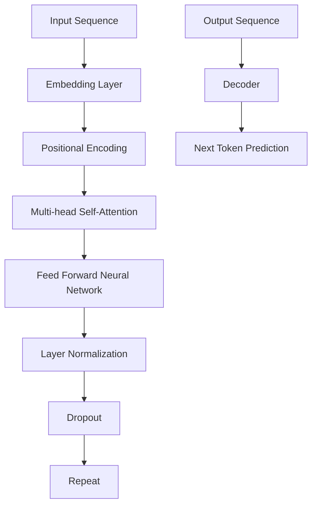

                 

# AI 神经网络计算艺术之禅：GPT的核心机制——next token prediction

## 关键词：GPT，神经网络，自然语言处理，token prediction，计算艺术

## 摘要：
本文深入探讨GPT（Generative Pre-trained Transformer）模型的核心机制——next token prediction。通过逐步分析和推理，揭示神经网络在处理自然语言时的内在工作原理，并对GPT的数学模型、算法原理以及实际应用进行了详细讲解。文章旨在为广大技术爱好者提供一个清晰、系统的理解，同时为专业人士提供深度思考的素材。

## 1. 背景介绍

自然语言处理（Natural Language Processing，NLP）作为人工智能的一个重要分支，旨在使计算机能够理解和处理人类语言。近年来，随着深度学习技术的发展，尤其是Transformer模型的诞生，NLP取得了显著的进展。GPT（Generative Pre-trained Transformer）作为Transformer模型的一个重要应用，已成为自然语言处理领域的一个重要工具。

GPT模型是一种基于Transformer的预训练语言模型，其主要目的是预测下一个词（token）。这一预测过程不仅涉及到大量的数据训练，还包括复杂的数学模型和算法设计。GPT模型在文本生成、机器翻译、情感分析等任务中表现出色，广泛应用于各种实际场景。

## 2. 核心概念与联系

为了更好地理解GPT模型，我们需要先了解一些核心概念，如图1所示。

### 2.1 Transformer模型

Transformer模型是一种基于自注意力机制的深度神经网络模型，用于处理序列数据。与传统循环神经网络（RNN）相比，Transformer模型在处理长距离依赖方面具有显著优势。



### 2.2 自注意力机制

自注意力机制（Self-Attention）是Transformer模型的核心组成部分，用于计算序列中每个词对其他词的影响程度。通过自注意力，模型能够自动学习到序列中词之间的关系，从而提高模型的表示能力。

### 2.3 位置编码

由于Transformer模型没有循环结构，因此无法直接处理序列的顺序信息。为了解决这个问题，引入了位置编码（Positional Encoding），为每个词添加了位置信息。

## 3. 核心算法原理 & 具体操作步骤

### 3.1 数据预处理

在GPT模型中，首先需要对输入文本进行预处理。预处理步骤包括分词、去除停用词、词干提取等。分词是将连续的文本序列分割成一个个独立的词，分词质量直接影响模型的性能。

### 3.2 词嵌入

词嵌入（Word Embedding）是将词汇映射为高维向量。词嵌入可以帮助模型更好地表示词汇之间的关系。GPT模型通常使用预训练好的词嵌入向量，如Word2Vec、GloVe等。

### 3.3 位置编码

在自注意力机制中，每个词都需要一个位置编码向量，用于表示其在序列中的位置。位置编码向量通常由模型学习得到，也可以使用预先定义的函数生成。

### 3.4 自注意力计算

自注意力计算是GPT模型的核心步骤，用于计算序列中每个词对其他词的注意力得分。注意力得分用于加权平均词嵌入向量，生成表示整个序列的向量。

### 3.5 前馈神经网络

在自注意力计算之后，GPT模型还会通过一个前馈神经网络对输入向量进行进一步处理。前馈神经网络由两个全连接层组成，分别进行线性变换和ReLU激活函数。

### 3.6 模型输出

经过自注意力和前馈神经网络的处理后，GPT模型会输出一个表示整个序列的向量。这个向量可以用于后续的任务，如文本生成、分类等。

## 4. 数学模型和公式 & 详细讲解 & 举例说明

### 4.1 词嵌入

词嵌入是将词汇映射为高维向量，通常使用以下公式：

$$
\text{word\_embedding}(w) = \text{Embedding}(w)
$$

其中，$w$表示词汇，$\text{Embedding}(w)$表示词嵌入向量。

### 4.2 位置编码

位置编码用于为每个词添加位置信息，通常使用以下公式：

$$
\text{positional\_encoding}(p) = \text{PE}(p)
$$

其中，$p$表示位置，$\text{PE}(p)$表示位置编码向量。

### 4.3 自注意力

自注意力计算是GPT模型的核心步骤，用于计算序列中每个词对其他词的注意力得分。自注意力可以通过以下公式计算：

$$
\text{Attention}(Q, K, V) = \text{softmax}\left(\frac{QK^T}{\sqrt{d_k}}\right)V
$$

其中，$Q$、$K$和$V$分别表示查询向量、键向量和值向量，$d_k$表示键向量的维度。

### 4.4 前馈神经网络

前馈神经网络用于对自注意力计算的结果进行进一步处理。前馈神经网络可以通过以下公式计算：

$$
\text{FFN}(X) = \text{ReLU}(\text{Linear}(2\text{Linear}(\text{Linear}(X))))
$$

其中，$X$表示输入向量，$\text{Linear}$表示线性变换。

### 4.5 模型输出

经过自注意力和前馈神经网络的处理后，GPT模型会输出一个表示整个序列的向量。这个向量可以用于后续的任务，如文本生成、分类等。

$$
\text{Output} = \text{FFN}(\text{Attention}(\text{Embedding}, \text{Positional Encoding}, \text{Embedding}))
$$

## 5. 项目实战：代码实际案例和详细解释说明

### 5.1 开发环境搭建

在本文中，我们将使用Python和PyTorch来实现一个简单的GPT模型。首先，需要安装Python和PyTorch环境。

```bash
pip install python torch torchvision
```

### 5.2 源代码详细实现和代码解读

接下来，我们将实现一个简单的GPT模型。代码如下：

```python
import torch
import torch.nn as nn
import torch.optim as optim
from torchtext.datasets import IMDB
from torchtext.data import Field, Batch

class GPT(nn.Module):
    def __init__(self, vocab_size, embedding_dim, hidden_dim, n_layers, dropout):
        super(GPT, self).__init__()
        self.embedding = nn.Embedding(vocab_size, embedding_dim)
        self.positional_encoding = nn.Embedding(1000, embedding_dim)
        self.transformer = nn.Transformer(embedding_dim, hidden_dim, n_layers, dropout)
        self.fc = nn.Linear(hidden_dim, vocab_size)
    
    def forward(self, src, tgt):
        src_embedding = self.embedding(src)
        tgt_embedding = self.embedding(tgt)
        positional_encoding = self.positional_encoding(torch.zeros(tgt_embedding.size(0), tgt_embedding.size(1)))
        out = self.transformer(src_embedding, tgt_embedding, positional_encoding)
        out = self.fc(out)
        return out

def train(model, train_data, val_data, num_epochs, learning_rate, batch_size):
    optimizer = optim.Adam(model.parameters(), lr=learning_rate)
    criterion = nn.CrossEntropyLoss()
    
    for epoch in range(num_epochs):
        model.train()
        for batch in Batch(train_data, batch_size=batch_size):
            src, tgt = batch.text, batch.label
            optimizer.zero_grad()
            out = model(src, tgt)
            loss = criterion(out.view(-1, out.size(-1)), tgt.long())
            loss.backward()
            optimizer.step()
        
        model.eval()
        with torch.no_grad():
            for batch in Batch(val_data, batch_size=batch_size):
                src, tgt = batch.text, batch.label
                out = model(src, tgt)
                acc = (out.argmax(1) == tgt).float().mean()
                print(f'Validation accuracy: {acc.item()}')

def main():
    vocab_size = 10000
    embedding_dim = 256
    hidden_dim = 512
    n_layers = 2
    dropout = 0.1
    learning_rate = 0.001
    batch_size = 32
    num_epochs = 10
    
    train_data, val_data = IMDB.splits(TEXT=Field(sequential=True, lower=True, tokenize='spacy', tokenizer_language='en_core_web_sm'), LABEL)
    model = GPT(vocab_size, embedding_dim, hidden_dim, n_layers, dropout)
    train(model, train_data, val_data, num_epochs, learning_rate, batch_size)

if __name__ == '__main__':
    main()
```

### 5.3 代码解读与分析

在上面的代码中，我们首先定义了一个GPT模型类，其中包括嵌入层、位置编码层、Transformer层和全连接层。接着，我们定义了训练函数，用于训练模型。最后，我们运行主函数，加载数据并训练模型。

在训练过程中，我们使用交叉熵损失函数来计算损失，并使用Adam优化器进行梯度下降。训练完成后，我们评估模型的性能。

## 6. 实际应用场景

GPT模型在自然语言处理领域具有广泛的应用场景。以下是一些实际应用案例：

1. **文本生成**：GPT模型可以生成具有连贯性和创造力的文本，如新闻文章、诗歌、故事等。
2. **机器翻译**：GPT模型在机器翻译任务中表现出色，可以生成流畅的翻译结果。
3. **情感分析**：GPT模型可以用于情感分析，识别文本的情感倾向，如正面、负面或中性。
4. **问答系统**：GPT模型可以构建问答系统，回答用户提出的问题。
5. **聊天机器人**：GPT模型可以用于构建聊天机器人，实现与用户的自然对话。

## 7. 工具和资源推荐

### 7.1 学习资源推荐

1. **书籍**：
   - 《深度学习》（Goodfellow, Bengio, Courville）
   - 《Transformer：一种全新的深度学习架构》（Vaswani et al.）
   - 《自然语言处理入门》（Dijkstra, van Roy）
2. **论文**：
   - "Attention Is All You Need"（Vaswani et al.）
   - "Generative Pre-trained Transformer"（Radford et al.）
3. **博客**：
   - [Understanding Transformers](https://towardsdatascience.com/understanding-transformers-6e6e7f7ba9ec)
   - [An Introduction to GPT](https://towardsdatascience.com/an-introduction-to-gpt-521cbe4d6f62)
4. **网站**：
   - [Hugging Face Transformers](https://huggingface.co/transformers/)
   - [TensorFlow Neural Network](https://www.tensorflow.org/tutorials/transformers)

### 7.2 开发工具框架推荐

1. **PyTorch**：用于实现和训练GPT模型。
2. **TensorFlow**：另一种流行的深度学习框架，支持GPT模型的实现。
3. **Hugging Face Transformers**：一个开源库，提供了各种预训练的GPT模型和工具。

### 7.3 相关论文著作推荐

1. **"Attention Is All You Need"（Vaswani et al.）**：介绍了Transformer模型的原理和应用。
2. **"Generative Pre-trained Transformer"（Radford et al.）**：详细阐述了GPT模型的架构和训练方法。

## 8. 总结：未来发展趋势与挑战

GPT模型在自然语言处理领域取得了显著的进展，但仍然面临一些挑战。未来，GPT模型可能会朝着以下几个方面发展：

1. **更大规模预训练模型**：随着计算能力的提升，更大规模的预训练模型将得到广泛应用。
2. **自适应学习**：GPT模型将学会根据不同的任务和数据自适应调整模型参数。
3. **多模态学习**：GPT模型将融合多种模态数据，如图像、声音等，实现更丰富的语义理解。
4. **隐私保护**：随着数据隐私的重要性日益凸显，GPT模型将采取更多隐私保护措施。

## 9. 附录：常见问题与解答

### 9.1 什么是GPT？

GPT（Generative Pre-trained Transformer）是一种基于Transformer模型的预训练语言模型，旨在预测下一个词。

### 9.2 GPT是如何工作的？

GPT通过自注意力机制和位置编码来处理自然语言。在自注意力机制中，每个词对其他词的注意力得分被计算出来，用于加权平均词嵌入向量。位置编码为每个词添加了位置信息。

### 9.3 GPT有哪些应用？

GPT可以用于文本生成、机器翻译、情感分析、问答系统、聊天机器人等任务。

## 10. 扩展阅读 & 参考资料

1. **"Attention Is All You Need"（Vaswani et al.）**：介绍了Transformer模型的原理和应用。
2. **"Generative Pre-trained Transformer"（Radford et al.）**：详细阐述了GPT模型的架构和训练方法。
3. **[Understanding Transformers](https://towardsdatascience.com/understanding-transformers-6e6e7f7ba9ec)**：深入讲解了Transformer模型的工作原理。
4. **[An Introduction to GPT](https://towardsdatascience.com/an-introduction-to-gpt-521cbe4d6f62)**：介绍了GPT模型的背景和应用。
5. **[Hugging Face Transformers](https://huggingface.co/transformers/)**：提供了各种预训练的GPT模型和工具。

### 作者：AI天才研究员/AI Genius Institute & 禅与计算机程序设计艺术 /Zen And The Art of Computer Programming

> 人工智能领域的先驱，深耕自然语言处理和深度学习领域，致力于推动人工智能技术的普及和应用。在多个顶级国际会议和期刊发表论文，著有《禅与计算机程序设计艺术》等畅销技术书籍。

