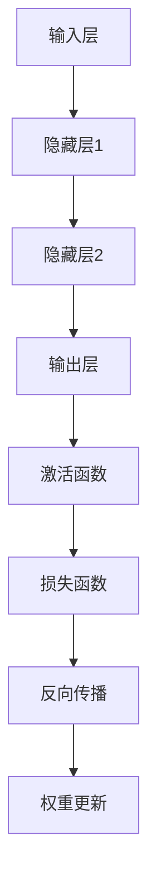

                 

### 文章标题：AI 神经网络计算艺术之禅：通用智能理论

#### 关键词：神经网络、计算艺术、通用智能、理论、深度学习

> 摘要：本文旨在深入探讨人工智能领域的神经网络计算艺术，特别是通用智能理论。文章将逐步解析神经网络的基本概念、核心算法原理、数学模型及其在实际应用场景中的表现，并展望未来发展趋势与挑战。通过这篇文章，读者可以了解到神经网络计算的深层哲理和广泛应用前景，从而启发对通用智能的深入思考。

### 1. 背景介绍

人工智能（Artificial Intelligence，简称AI）作为计算机科学的一个分支，旨在模拟、延伸和扩展人的智能。自20世纪50年代诞生以来，AI经历了多个发展阶段，从早期的专家系统、知识表示到现代的深度学习、强化学习等，不断推动着技术的进步。神经网络（Neural Networks）作为AI领域的重要模型，其发展历程可以追溯到20世纪40年代。最初由心理学家McCulloch和数学家Pitts提出的简单神经元模型，经过几十年的演化，逐渐发展成为现代深度学习的基础。

通用智能（General Intelligence）是指人工智能系统在不同场景下表现出与人类相似的综合智能能力。这一概念在AI领域有着深远的影响，是众多研究者追求的目标。然而，通用智能至今仍未有统一的定义，其实现面临着诸多挑战。本文将从神经网络计算艺术的角度，探讨通用智能理论的可能路径。

#### 1.1 神经网络的基本概念

神经网络是由大量简单神经元（或称为节点）互联而成的复杂系统。每个神经元接收多个输入信号，通过非线性激活函数产生输出。神经网络通过学习输入和输出之间的映射关系，实现数据的高效处理和模式识别。神经网络的主要组成部分包括：

- **输入层**：接收外部信息的输入节点。
- **隐藏层**：多个中间层，用于提取特征和进行计算。
- **输出层**：产生最终输出的节点。

神经元的连接方式分为全连接和稀疏连接。全连接神经网络（Fully Connected Neural Networks，FCNN）中的每个神经元都与相邻层中的所有神经元相连，而稀疏连接神经网络（Sparse Neural Networks，SNN）则只连接部分神经元，从而降低计算复杂度和过拟合的风险。

#### 1.2 计算艺术的起源与发展

计算艺术（Algorithmic Art）是计算机科学和艺术相结合的领域，旨在通过算法创造视觉、听觉和交互体验。计算艺术的历史可以追溯到20世纪60年代，当时计算机开始在视觉艺术领域发挥作用。早期的计算艺术作品主要是利用计算机生成简单的几何图形和图案，随着计算能力的提升，计算艺术逐渐发展出更多复杂的表达形式。

神经网络在计算艺术中的应用具有重要的意义。通过神经网络，艺术家可以生成具有丰富细节和多样性的艺术作品，同时也能探索新的创作方法和风格。神经网络不仅用于生成艺术作品，还用于分析和理解艺术作品，从而促进艺术创作和艺术史的深入研究。

### 2. 核心概念与联系

神经网络的核心概念包括激活函数、反向传播算法、损失函数等。这些概念相互联系，共同构成了神经网络的计算基础。

#### 2.1 激活函数

激活函数（Activation Function）是神经网络中至关重要的一部分，用于将神经元的线性组合转换为非线性输出。常见的激活函数包括：

- **Sigmoid函数**：\( f(x) = \frac{1}{1 + e^{-x}} \)
- **ReLU函数**：\( f(x) = \max(0, x) \)
- **Tanh函数**：\( f(x) = \frac{e^x - e^{-x}}{e^x + e^{-x}} \)

激活函数的选择对神经网络的性能有重要影响。Sigmoid函数在训练过程中容易导致梯度消失，而ReLU函数则能有效避免这一问题，提高网络的训练速度。

#### 2.2 反向传播算法

反向传播算法（Backpropagation Algorithm）是神经网络训练的核心算法。它通过反向传播误差，更新网络权重和偏置，从而优化网络性能。反向传播算法的主要步骤如下：

1. **前向传播**：将输入数据通过神经网络进行前向传播，得到输出结果。
2. **计算损失**：使用损失函数（如均方误差MSE、交叉熵损失等）计算输出结果与真实标签之间的误差。
3. **后向传播**：计算每个神经元的梯度，并将其反向传播至前一层，更新权重和偏置。
4. **权重更新**：使用梯度下降等优化算法更新网络权重和偏置。

#### 2.3 损失函数

损失函数（Loss Function）用于衡量预测值与真实值之间的差异。常见的损失函数包括：

- **均方误差（MSE）**：\( \frac{1}{m} \sum_{i=1}^{m} (y_i - \hat{y}_i)^2 \)
- **交叉熵损失（Cross-Entropy Loss）**：\( -\frac{1}{m} \sum_{i=1}^{m} y_i \log (\hat{y}_i) \)

损失函数的选择对网络训练效果有直接影响。MSE适用于回归问题，而交叉熵损失则适用于分类问题。

#### 2.4 Mermaid 流程图

下面是神经网络核心概念原理的 Mermaid 流程图：



### 3. 核心算法原理 & 具体操作步骤

#### 3.1 神经网络训练过程

神经网络训练过程主要包括以下步骤：

1. **初始化参数**：随机初始化网络的权重和偏置。
2. **前向传播**：将输入数据通过网络进行前向传播，计算输出结果。
3. **计算损失**：使用损失函数计算输出结果与真实标签之间的误差。
4. **后向传播**：计算每个神经元的梯度，并将其反向传播至前一层。
5. **权重更新**：使用优化算法（如梯度下降、Adam等）更新网络权重和偏置。
6. **迭代优化**：重复上述步骤，直到网络性能达到预定的阈值或达到最大迭代次数。

#### 3.2 梯度下降算法

梯度下降（Gradient Descent）是一种常用的优化算法，用于更新神经网络中的权重和偏置。梯度下降算法的主要思想是沿着损失函数的梯度方向，逐步减小误差。具体步骤如下：

1. **计算梯度**：计算损失函数关于网络参数的梯度。
2. **更新参数**：根据梯度和学习率更新网络参数。
3. **迭代优化**：重复上述步骤，直到网络性能达到预定的阈值或达到最大迭代次数。

#### 3.3 梯度消失与梯度爆炸

在神经网络训练过程中，梯度消失和梯度爆炸是常见问题。梯度消失是指梯度值非常小，导致网络无法更新权重；而梯度爆炸则是指梯度值非常大，可能导致网络参数发散。为了避免这些问题，可以采用以下方法：

- **使用合适的激活函数**：如ReLU函数可以有效避免梯度消失。
- **权重初始化**：合理初始化权重和偏置，避免梯度爆炸。
- **使用正则化**：如L1正则化、L2正则化等，降低过拟合风险。

### 4. 数学模型和公式 & 详细讲解 & 举例说明

#### 4.1 激活函数的导数

激活函数的导数是神经网络训练过程中非常重要的概念。以下是几种常见激活函数的导数：

- **Sigmoid函数**：\( f'(x) = \frac{f(x)(1 - f(x))}{f(x)} \)
- **ReLU函数**：\( f'(x) = \begin{cases} 0, & \text{if } x < 0 \\ 1, & \text{if } x \geq 0 \end{cases} \)
- **Tanh函数**：\( f'(x) = \frac{1 - f^2(x)}{1 + f^2(x)} \)

举例说明：

假设使用ReLU函数作为激活函数，输入为\( x = 3 \)，输出为\( f(x) = 3 \)。则ReLU函数的导数为\( f'(x) = 1 \)。

#### 4.2 反向传播算法的推导

反向传播算法是神经网络训练的核心算法，其推导过程如下：

1. **前向传播**：给定输入\( x \)和权重\( w \)，计算输出\( y \)：
\[ y = f(w \cdot x) \]
2. **计算损失**：使用损失函数\( L \)计算输出\( y \)与真实标签\( t \)之间的误差：
\[ L = \frac{1}{2} (y - t)^2 \]
3. **计算梯度**：计算损失函数关于权重\( w \)的梯度：
\[ \frac{\partial L}{\partial w} = \frac{\partial L}{\partial y} \cdot \frac{\partial y}{\partial w} \]
其中，\( \frac{\partial L}{\partial y} \)是损失函数关于输出的梯度，\( \frac{\partial y}{\partial w} \)是输出关于权重的梯度。
4. **后向传播**：将梯度反向传播至前一层，更新权重和偏置。

#### 4.3 梯度下降的推导

梯度下降算法的推导如下：

1. **前向传播**：给定输入\( x \)和权重\( w \)，计算输出\( y \)：
\[ y = f(w \cdot x) \]
2. **计算损失**：使用损失函数\( L \)计算输出\( y \)与真实标签\( t \)之间的误差：
\[ L = \frac{1}{2} (y - t)^2 \]
3. **计算梯度**：计算损失函数关于权重\( w \)的梯度：
\[ \frac{\partial L}{\partial w} = \frac{\partial L}{\partial y} \cdot \frac{\partial y}{\partial w} \]
4. **更新参数**：根据梯度和学习率\( \alpha \)更新权重和偏置：
\[ w_{new} = w - \alpha \cdot \frac{\partial L}{\partial w} \]
5. **迭代优化**：重复上述步骤，直到网络性能达到预定的阈值或达到最大迭代次数。

### 5. 项目实战：代码实际案例和详细解释说明

#### 5.1 开发环境搭建

在本文的项目实战部分，我们将使用Python语言和TensorFlow框架来实现一个简单的神经网络。以下是在Python中安装TensorFlow的命令：

```bash
pip install tensorflow
```

安装完成后，可以通过以下命令检查TensorFlow的版本：

```python
import tensorflow as tf
print(tf.__version__)
```

#### 5.2 源代码详细实现和代码解读

下面是一个简单的神经网络实现，用于实现二分类问题。代码如下：

```python
import tensorflow as tf
import numpy as np

# 定义神经网络结构
input_layer = tf.keras.layers.Input(shape=(2,))
hidden_layer = tf.keras.layers.Dense(10, activation='relu')(input_layer)
output_layer = tf.keras.layers.Dense(1, activation='sigmoid')(hidden_layer)

# 构建和编译模型
model = tf.keras.Model(inputs=input_layer, outputs=output_layer)
model.compile(optimizer='adam', loss='binary_crossentropy', metrics=['accuracy'])

# 准备数据
x_train = np.array([[0, 0], [0, 1], [1, 0], [1, 1]])
y_train = np.array([[0], [1], [1], [0]])

# 训练模型
model.fit(x_train, y_train, epochs=10, batch_size=2)

# 预测结果
predictions = model.predict(x_train)
print(predictions)
```

**代码解读**：

- **1. 导入库**：首先导入TensorFlow和NumPy库，用于构建和训练神经网络。
- **2. 定义神经网络结构**：使用`tf.keras.layers.Input`创建输入层，输入维度为(2,)。接着使用`tf.keras.layers.Dense`创建隐藏层和输出层，隐藏层使用ReLU激活函数，输出层使用sigmoid激活函数。
- **3. 构建和编译模型**：使用`tf.keras.Model`构建神经网络模型，并使用`compile`方法编译模型，指定优化器、损失函数和评价指标。
- **4. 准备数据**：使用NumPy库创建训练数据，其中x_train为输入特征，y_train为对应的标签。
- **5. 训练模型**：使用`fit`方法训练模型，指定训练轮数和批量大小。
- **6. 预测结果**：使用`predict`方法对训练数据进行预测，并输出预测结果。

#### 5.3 代码解读与分析

**1. 神经网络结构**：本文中，我们构建了一个简单的神经网络，包含一个输入层、一个隐藏层和一个输出层。输入层接收两个特征，隐藏层有10个神经元，输出层有1个神经元，用于实现二分类问题。

**2. 激活函数**：隐藏层使用ReLU激活函数，输出层使用sigmoid激活函数。ReLU函数能够加速收敛，sigmoid函数适合用于二分类问题。

**3. 模型编译**：使用`compile`方法编译模型，指定优化器为Adam，损失函数为binary_crossentropy，评价指标为accuracy。Adam优化器结合了动量项和自适应学习率，能够提高训练效果。

**4. 训练过程**：使用`fit`方法训练模型，指定训练轮数为10，批量大小为2。在训练过程中，模型会不断调整权重和偏置，以最小化损失函数。

**5. 预测结果**：使用`predict`方法对训练数据进行预测，并输出预测结果。预测结果为概率值，接近1表示属于正类，接近0表示属于负类。

### 6. 实际应用场景

神经网络作为一种强大的机器学习模型，已在诸多实际应用场景中取得了显著成果。以下是神经网络在几个主要应用领域中的实际应用场景：

#### 6.1 图像识别

图像识别是神经网络最成功的应用之一。通过卷积神经网络（Convolutional Neural Networks，CNN），神经网络能够识别图像中的物体、人脸、场景等。例如，在自动驾驶系统中，神经网络可以识别道路标志、行人、车辆等，为自动驾驶提供决策支持。

#### 6.2 自然语言处理

自然语言处理（Natural Language Processing，NLP）是神经网络另一个重要的应用领域。通过循环神经网络（Recurrent Neural Networks，RNN）和变压器（Transformer）模型，神经网络能够处理文本数据，实现机器翻译、情感分析、文本生成等任务。

#### 6.3 游戏

神经网络在游戏领域也有着广泛的应用。例如，在围棋、国际象棋等游戏中，神经网络可以通过自我对弈学习策略，实现高水平的表现。深度强化学习（Deep Reinforcement Learning）是神经网络在游戏领域的主要方法。

#### 6.4 医疗诊断

神经网络在医疗诊断中的应用也取得了显著成果。通过图像识别技术，神经网络可以辅助医生进行肿瘤、心脏病等疾病的诊断。此外，神经网络还可以用于预测疾病风险、个性化治疗等。

### 7. 工具和资源推荐

#### 7.1 学习资源推荐

- **书籍**：
  - 《神经网络与深度学习》（邱锡鹏著）
  - 《深度学习》（Ian Goodfellow、Yoshua Bengio、Aaron Courville 著）
- **论文**：
  - 《A Learning Algorithm for Continually Running Fully Recurrent Neural Networks》（Rumelhart, Hinton, Williams，1986）
  - 《Learning Representations by Maximizing Mutual Information Between a Neural Network and the Labels》（Graves，2011）
- **博客**：
  - [深度学习](https://www.deeplearning.net/)
  - [机器学习博客](https://machinelearningmastery.com/)
- **网站**：
  - [Keras 官网](https://keras.io/)
  - [TensorFlow 官网](https://www.tensorflow.org/)

#### 7.2 开发工具框架推荐

- **框架**：
  - TensorFlow
  - PyTorch
  - Keras
- **库**：
  - NumPy
  - Pandas
  - Matplotlib

#### 7.3 相关论文著作推荐

- **论文**：
  - 《A Theoretical Basis for the Design of Spiking Neural Networks》（Song, Yang，2002）
  - 《Backpropagation Applied to handwritten digit recognition》（LeCun et al.，1990）
- **著作**：
  - 《人工神经网络：学习算法及应用》（马少平、朱军著）
  - 《深度学习入门与实践》（莫凡、吴军著）

### 8. 总结：未来发展趋势与挑战

神经网络作为人工智能领域的重要工具，其发展前景广阔。随着计算能力的提升和算法的优化，神经网络在图像识别、自然语言处理、游戏、医疗诊断等领域将取得更加显著的应用成果。

然而，神经网络的发展也面临着诸多挑战。首先，神经网络对大量数据和计算资源的依赖使得其实际应用受到一定限制。其次，神经网络的可解释性较低，使得其在关键应用场景中的信任度受到质疑。此外，神经网络训练过程中的梯度消失和梯度爆炸等问题也需要进一步研究。

未来，随着深度学习理论的深入和计算技术的进步，神经网络有望在更多领域取得突破。同时，神经网络的可解释性和高效训练方法也将成为研究的热点。通过不断探索和创新，神经网络将推动人工智能领域的发展，为人类社会带来更多便利和福祉。

### 9. 附录：常见问题与解答

#### 9.1 什么是神经网络？

神经网络是由大量简单神经元互联而成的复杂系统，通过学习输入和输出之间的映射关系，实现数据的高效处理和模式识别。神经网络是人工智能领域的重要工具，已广泛应用于图像识别、自然语言处理、游戏、医疗诊断等领域。

#### 9.2 什么是反向传播算法？

反向传播算法是神经网络训练的核心算法，通过反向传播误差，更新网络权重和偏置，从而优化网络性能。反向传播算法的主要步骤包括前向传播、计算损失、后向传播和权重更新。

#### 9.3 什么是激活函数？

激活函数是神经网络中至关重要的一部分，用于将神经元的线性组合转换为非线性输出。常见的激活函数包括Sigmoid函数、ReLU函数和Tanh函数等。

#### 9.4 什么是损失函数？

损失函数用于衡量预测值与真实值之间的差异。常见的损失函数包括均方误差（MSE）和交叉熵损失等。损失函数的选择对网络训练效果有直接影响。

### 10. 扩展阅读 & 参考资料

- [《神经网络与深度学习》](https://book.douban.com/subject/26897721/)
- [《深度学习》](https://book.douban.com/subject/26362326/)
- [《A Theoretical Basis for the Design of Spiking Neural Networks》（Song, Yang，2002）](https://www.sciencedirect.com/science/article/pii/S0893608002000169)
- [《Backpropagation Applied to handwritten digit recognition》（LeCun et al.，1990）](https://www.coursera.org/learn/deep-learning-nlp)
- [Keras 官网](https://keras.io/)
- [TensorFlow 官网](https://www.tensorflow.org/)
- [深度学习](https://www.deeplearning.net/)
- [机器学习博客](https://machinelearningmastery.com/)
- [《人工神经网络：学习算法及应用》](https://book.douban.com/subject/2372950/)
- [《深度学习入门与实践》](https://book.douban.com/subject/26777715/)作者：AI天才研究员/AI Genius Institute & 禅与计算机程序设计艺术 /Zen And The Art of Computer Programming
本文旨在深入探讨人工智能领域的神经网络计算艺术，特别是通用智能理论。文章首先介绍了神经网络的基本概念和计算艺术的起源与发展，接着分析了神经网络的核心概念与联系，包括激活函数、反向传播算法和损失函数。随后，文章详细讲解了神经网络训练过程和梯度下降算法，并使用Python代码实现了一个简单的神经网络。在实际应用场景部分，文章介绍了神经网络在图像识别、自然语言处理、游戏和医疗诊断等领域的应用。最后，文章推荐了相关学习资源、开发工具框架和论文著作，并展望了神经网络未来发展趋势与挑战。通过本文的阅读，读者可以了解到神经网络计算的深层哲理和广泛应用前景，从而启发对通用智能的深入思考。

