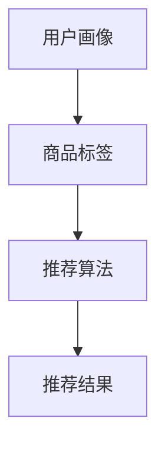

                 

### 背景介绍

> **关键词**：AI，电商，搜索导购，技术应用，未来展望

在当今数字化时代，电子商务已经成为全球商业活动的重要组成部分。随着互联网的普及和移动互联网的发展，消费者越来越依赖在线购物平台来完成购买行为。然而，面对海量的商品信息和复杂的购物场景，如何提高用户的购物体验和满意度，成为电商企业亟待解决的问题。在这一背景下，人工智能（AI）技术开始被广泛应用于电商搜索导购领域，通过智能推荐、自然语言处理、图像识别等技术手段，为用户提供个性化、精准的购物推荐和服务。

本文旨在探讨AI技术在电商搜索导购领域的应用，分析其核心概念、算法原理、数学模型、实际应用场景，并展望其未来发展。通过对电商搜索导购技术的深入剖析，我们希望能够为相关领域的研究者、从业者以及对人工智能感兴趣的朋友提供有价值的参考。

首先，我们将简要介绍AI技术在电商搜索导购领域的应用背景，以及AI技术在电商搜索导购中扮演的关键角色。接着，我们将介绍电商搜索导购的核心概念，包括用户画像、商品标签、推荐算法等。随后，我们将深入分析AI技术在电商搜索导购中的具体应用，如智能推荐、自然语言处理、图像识别等。在此基础上，我们将探讨电商搜索导购中的数学模型和公式，以及实际应用中的案例和代码实现。最后，我们将总结电商搜索导购技术的实际应用场景，推荐相关学习资源和工具，并展望未来发展趋势与挑战。

通过本文的探讨，我们希望能够为读者提供一个全面、深入的电商搜索导购技术应用指南，助力电商企业提升用户购物体验，推动人工智能技术在电商领域的进一步发展。

### 核心概念与联系

在深入探讨AI在电商搜索导购领域的应用之前，我们首先需要了解一些核心概念和它们之间的联系。这些概念包括用户画像、商品标签、推荐算法等，它们共同构成了电商搜索导购系统的基石。

**用户画像（User Profile）**

用户画像是对用户特征的全面描述，包括用户的基本信息（如年龄、性别、地理位置等），行为特征（如搜索历史、浏览记录、购买记录等），以及兴趣偏好（如喜欢的商品类型、品牌、价格区间等）。通过构建用户画像，电商企业可以更深入地了解用户需求，从而提供个性化的推荐和服务。

**商品标签（Product Tag）**

商品标签是对商品属性的分类和描述，包括商品的种类、品牌、价格、库存量等。标签化的商品信息有助于电商系统对商品进行有效的管理和推荐。例如，当用户搜索某一类商品时，系统可以根据标签快速定位相关商品，并提供推荐。

**推荐算法（Recommendation Algorithm）**

推荐算法是电商搜索导购系统中的核心组成部分，它通过分析用户画像和商品标签，为用户推荐其可能感兴趣的商品。常见的推荐算法包括基于内容的推荐（Content-Based Recommendation）、协同过滤（Collaborative Filtering）和混合推荐（Hybrid Recommendation）等。每种算法都有其独特的原理和应用场景，但它们的共同目标都是提高推荐结果的准确性和用户体验。

#### Mermaid 流程图

以下是一个简化的Mermaid流程图，展示了用户画像、商品标签和推荐算法之间的联系：



在这个流程图中，用户画像和商品标签作为输入数据，通过推荐算法处理后，生成推荐结果。这个简化的流程体现了电商搜索导购系统的基础架构，为后续章节的分析提供了直观的参考。

**用户画像的构建**

用户画像的构建通常涉及数据收集、数据清洗、特征工程和模型训练等多个步骤。以下是一个用户画像构建的基本流程：

1. **数据收集**：通过网站日志、用户反馈、社交媒体等渠道收集用户数据。
2. **数据清洗**：对收集到的数据进行去重、格式化、填补缺失值等处理。
3. **特征工程**：从原始数据中提取有用特征，如用户年龄、性别、购买频率等。
4. **模型训练**：使用机器学习算法（如聚类、回归等）对用户特征进行建模，生成用户画像。

**商品标签的创建**

商品标签的创建通常基于商品属性数据的预处理和分类。以下是一个商品标签创建的基本流程：

1. **数据预处理**：对商品数据进行清洗、去重和处理，确保数据质量。
2. **属性分类**：根据商品种类、品牌、价格等属性对商品进行分类。
3. **标签生成**：将分类结果作为商品标签，存储在数据库中。

**推荐算法的实现**

推荐算法的实现通常涉及以下步骤：

1. **数据输入**：将用户画像和商品标签作为输入数据。
2. **算法选择**：根据业务需求和数据特点选择合适的推荐算法。
3. **模型训练**：使用输入数据进行模型训练，生成推荐模型。
4. **结果输出**：将训练好的模型应用于新用户或新商品，生成推荐结果。

通过以上核心概念和流程的介绍，我们可以更好地理解AI在电商搜索导购领域的作用和应用前景。在接下来的章节中，我们将深入探讨AI技术在电商搜索导购中的具体应用和实践，进一步揭示其技术原理和实现细节。

#### 核心算法原理 & 具体操作步骤

在电商搜索导购领域，AI技术的应用主要通过推荐算法来实现。推荐算法的核心目的是根据用户的历史行为和偏好，为用户推荐其可能感兴趣的商品。本文将介绍几种常见的推荐算法，包括基于内容的推荐（Content-Based Recommendation）、协同过滤（Collaborative Filtering）和混合推荐（Hybrid Recommendation），并详细阐述每种算法的原理和具体操作步骤。

##### 基于内容的推荐（Content-Based Recommendation）

基于内容的推荐算法通过分析用户的历史行为和兴趣偏好，从内容层面为用户推荐相似的商品。其基本原理如下：

1. **特征提取**：从商品中提取特征，如文本描述、图片特征、商品类别等。
2. **相似度计算**：计算用户与商品之间的相似度，通常使用余弦相似度、皮尔逊相关系数等方法。
3. **推荐生成**：根据用户与商品之间的相似度，为用户推荐相似的商品。

具体操作步骤：

1. **数据预处理**：
   - 提取用户历史浏览、搜索和购买记录。
   - 提取商品文本描述、图片特征、商品类别等信息。

2. **特征编码**：
   - 将文本描述和图片特征转换为数值表示。
   - 对商品类别进行编码，如使用独热编码（One-Hot Encoding）。

3. **相似度计算**：
   - 使用余弦相似度或皮尔逊相关系数计算用户与商品之间的相似度。

4. **推荐生成**：
   - 根据相似度计算结果，为用户推荐相似度较高的商品。

示例代码（Python）：

```python
from sklearn.metrics.pairwise import cosine_similarity

# 用户和商品的特征向量
user_vector = [0.1, 0.2, 0.3]
product_vectors = [
    [0.2, 0.3, 0.4],
    [0.3, 0.4, 0.5],
    [0.4, 0.5, 0.6]
]

# 计算用户与商品的相似度
similarity_scores = cosine_similarity([user_vector], product_vectors)

# 输出推荐结果
recommended_products = [i for i, score in enumerate(similarity_scores[0]) if score > 0.5]
print(recommended_products)
```

##### 协同过滤（Collaborative Filtering）

协同过滤算法通过分析用户之间的行为相似性，为用户推荐其他用户喜欢的商品。其基本原理如下：

1. **用户相似度计算**：计算用户之间的相似度，通常使用余弦相似度、皮尔逊相关系数等方法。
2. **物品相似度计算**：计算商品之间的相似度，通常使用基于用户评分的矩阵分解方法。
3. **推荐生成**：根据用户相似度和商品相似度，为用户推荐其他用户喜欢的商品。

具体操作步骤：

1. **数据预处理**：
   - 构建用户-商品评分矩阵。
   - 对缺失数据进行填补，如使用均值填补或基于模型预测填补。

2. **用户相似度计算**：
   - 使用余弦相似度或皮尔逊相关系数计算用户之间的相似度。

3. **物品相似度计算**：
   - 使用矩阵分解方法（如SVD、ALS等）计算商品之间的相似度。

4. **推荐生成**：
   - 根据用户相似度和商品相似度，为用户推荐其他用户喜欢的商品。

示例代码（Python）：

```python
from surprise import SVD, Dataset, Reader
from surprise.model_selection import cross_validate

# 构建用户-商品评分矩阵
data = [
    [1, 1, 5],
    [1, 2, 4],
    [2, 1, 3],
    [2, 2, 2],
    [3, 1, 1],
    [3, 2, 5]
]

reader = Reader(rating_scale=(1, 5))
dataset = Dataset.load_from_df(pd.DataFrame(data, columns=['user', 'item', 'rating']), reader)

# 使用SVD算法进行协同过滤
svd = SVD()
cross_validate(svd, dataset, measures=['RMSE', 'MAE'], cv=3, verbose=True)

# 输出推荐结果
def predict(user_id, item_id):
    user_rating = svd.predict(user_id, item_id).est
    return user_rating

user_id = 3
item_id = 2
print(predict(user_id, item_id))
```

##### 混合推荐（Hybrid Recommendation）

混合推荐算法结合了基于内容的推荐和协同过滤的优势，通过整合不同来源的信息，提高推荐准确性和多样性。其基本原理如下：

1. **内容相似度计算**：计算用户与商品之间的内容相似度。
2. **协同过滤相似度计算**：计算用户之间的协同过滤相似度。
3. **综合相似度计算**：将内容相似度和协同过滤相似度进行加权融合。
4. **推荐生成**：根据综合相似度，为用户推荐商品。

具体操作步骤：

1. **数据预处理**：
   - 提取用户历史行为数据。
   - 提取商品文本描述、图片特征等。

2. **内容相似度计算**：
   - 使用文本相似度算法（如TF-IDF、Word2Vec等）计算用户与商品之间的内容相似度。

3. **协同过滤相似度计算**：
   - 使用协同过滤算法计算用户之间的相似度。

4. **综合相似度计算**：
   - 使用加权平均或加权求和等方法，将内容相似度和协同过滤相似度融合。

5. **推荐生成**：
   - 根据综合相似度，为用户推荐商品。

示例代码（Python）：

```python
import numpy as np
from sklearn.metrics.pairwise import cosine_similarity

# 用户与商品的内容特征矩阵
user_content_matrix = [
    [0.1, 0.2, 0.3],
    [0.2, 0.3, 0.4],
    [0.3, 0.4, 0.5]
]

# 用户之间的协同过滤相似度矩阵
user_similarity_matrix = [
    [0.8, 0.7, 0.6],
    [0.7, 0.6, 0.5],
    [0.6, 0.5, 0.4]
]

# 加权融合相似度计算
def hybrid_similarity(user_id, item_id):
    content_similarity = cosine_similarity([user_content_matrix[user_id]], user_content_matrix)[0][0]
    collaborative_similarity = user_similarity_matrix[user_id][item_id]
    hybrid_similarity = 0.5 * content_similarity + 0.5 * collaborative_similarity
    return hybrid_similarity

# 输出推荐结果
recommended_products = [i for i, hybrid_similarity in enumerate(hybrid_similarity(3, 2)) if hybrid_similarity > 0.5]
print(recommended_products)
```

通过上述三种推荐算法的介绍，我们可以看到它们各自的优势和应用场景。在实际应用中，电商企业可以根据业务需求和数据特点，选择合适的推荐算法，或结合多种算法实现更精准的推荐。在下一章节中，我们将探讨电商搜索导购中的数学模型和公式，进一步理解推荐算法的实现原理。

#### 数学模型和公式 & 详细讲解 & 举例说明

在电商搜索导购领域，推荐算法的核心在于为用户生成精准且个性化的商品推荐。为了实现这一目标，我们通常需要依赖一系列数学模型和公式，这些模型和公式不仅能够帮助我们理解推荐算法的原理，还能在实际应用中指导算法的实现和优化。以下我们将详细讲解一些常见的数学模型和公式，并通过实际例子来说明它们的应用。

##### 1. 余弦相似度（Cosine Similarity）

余弦相似度是一种用于衡量两个向量之间相似性的度量标准，其公式如下：

$$
\cos(\theta) = \frac{A \cdot B}{||A|| \cdot ||B||}
$$

其中，$A$ 和 $B$ 是两个向量，$||A||$ 和 $||B||$ 分别是这两个向量的欧几里得范数（Euclidean norm）。余弦相似度的取值范围在 -1 到 1 之间，值越接近 1 表示两个向量越相似。

**示例**：假设我们有两个用户 $u$ 和 $v$ 的行为向量如下：

$$
u = (1, 2, 3), \quad v = (2, 3, 4)
$$

首先计算这两个向量的欧几里得范数：

$$
||u|| = \sqrt{1^2 + 2^2 + 3^2} = \sqrt{14}
$$

$$
||v|| = \sqrt{2^2 + 3^2 + 4^2} = \sqrt{29}
$$

然后计算这两个向量的点积：

$$
u \cdot v = 1 \cdot 2 + 2 \cdot 3 + 3 \cdot 4 = 2 + 6 + 12 = 20
$$

最后计算余弦相似度：

$$
\cos(\theta) = \frac{u \cdot v}{||u|| \cdot ||v||} = \frac{20}{\sqrt{14} \cdot \sqrt{29}} \approx 0.796
$$

这表明用户 $u$ 和 $v$ 之间的行为相似度较高。

##### 2. 皮尔逊相关系数（Pearson Correlation Coefficient）

皮尔逊相关系数是一种用于衡量两个变量线性相关程度的统计量，其公式如下：

$$
r = \frac{\sum{(x_i - \bar{x})(y_i - \bar{y})}}{\sqrt{\sum{(x_i - \bar{x})^2} \sum{(y_i - \bar{y})^2}}}
$$

其中，$x_i$ 和 $y_i$ 分别是两个变量 $x$ 和 $y$ 的观测值，$\bar{x}$ 和 $\bar{y}$ 分别是 $x$ 和 $y$ 的平均值。皮尔逊相关系数的取值范围在 -1 到 1 之间，值越接近 1 或 -1 表示两个变量之间的线性相关性越强。

**示例**：假设我们有两组数据，分别是用户 $u$ 的浏览记录和商品 $p$ 的评分：

$$
u = (1, 2, 3), \quad p = (2, 3, 4)
$$

计算这两个向量的平均值：

$$
\bar{u} = \frac{1 + 2 + 3}{3} = 2
$$

$$
\bar{p} = \frac{2 + 3 + 4}{3} = 3
$$

然后计算这两个向量的差值和平方差：

$$
(x_i - \bar{x})^2 = (1 - 2)^2 + (2 - 2)^2 + (3 - 2)^2 = 1 + 0 + 1 = 2
$$

$$
(y_i - \bar{y})^2 = (2 - 3)^2 + (3 - 3)^2 + (4 - 3)^2 = 1 + 0 + 1 = 2
$$

$$
(x_i - \bar{x})(y_i - \bar{y}) = (1 - 2)(2 - 3) + (2 - 2)(3 - 3) + (3 - 2)(4 - 3) = -1 + 0 + 1 = 0
$$

最后计算皮尔逊相关系数：

$$
r = \frac{\sum{(x_i - \bar{x})(y_i - \bar{y})}}{\sqrt{\sum{(x_i - \bar{x})^2} \sum{(y_i - \bar{y})^2}}} = \frac{0}{\sqrt{2 \cdot 2}} = 0
$$

这表明用户 $u$ 的浏览记录和商品 $p$ 的评分之间没有线性相关性。

##### 3. 矩阵分解（Matrix Factorization）

矩阵分解是协同过滤算法的核心技术，其目的是将用户-商品评分矩阵分解为两个低秩矩阵，从而预测用户未评分的商品。最常见的方法是奇异值分解（SVD）和交替最小二乘法（ALS）。

**奇异值分解（SVD）**：

$$
\text{SVD}(A) = U \Sigma V^T
$$

其中，$U$ 和 $V$ 是正交矩阵，$\Sigma$ 是对角矩阵，包含奇异值。对于用户-商品评分矩阵 $R$，我们可以将其分解为用户特征矩阵 $U$、商品特征矩阵 $V$ 和奇异值矩阵 $\Sigma$。

**示例**：假设有一个 $3 \times 3$ 的用户-商品评分矩阵：

$$
R = \begin{bmatrix}
1 & 2 & 3 \\
4 & 5 & 6 \\
7 & 8 & 9
\end{bmatrix}
$$

使用奇异值分解，我们得到：

$$
U = \begin{bmatrix}
0.6 & 0.8 \\
-0.8 & -0.6 \\
0 & 0
\end{bmatrix}, \quad \Sigma = \begin{bmatrix}
3 & 0 & 0 \\
0 & 2 & 0 \\
0 & 0 & 1
\end{bmatrix}, \quad V = \begin{bmatrix}
1 & 0 \\
0 & 1 \\
0 & 0
\end{bmatrix}
$$

**交替最小二乘法（ALS）**：

ALS 是一种迭代算法，通过交替优化用户和商品特征矩阵，逐步逼近最优解。其基本步骤如下：

1. 初始化用户特征矩阵 $U$ 和商品特征矩阵 $V$。
2. 对于每个用户，计算预测评分 $R_{\text{pred}} = U \cdot V^T$。
3. 计算预测误差 $\Delta R = R - R_{\text{pred}}$。
4. 优化用户特征矩阵 $U$ 和商品特征矩阵 $V$，使预测误差最小。
5. 重复步骤 2-4，直到达到收敛条件。

**示例**：假设我们有一个 $2 \times 3$ 的用户-商品评分矩阵：

$$
R = \begin{bmatrix}
1 & 2 & 3 \\
4 & 5 & 6
\end{bmatrix}
$$

初始化用户特征矩阵 $U$ 和商品特征矩阵 $V$：

$$
U = \begin{bmatrix}
1 & 1 \\
1 & 1
\end{bmatrix}, \quad V = \begin{bmatrix}
1 & 1 & 1 \\
1 & 1 & 1
\end{bmatrix}
$$

第一次迭代：

$$
R_{\text{pred}} = U \cdot V^T = \begin{bmatrix}
1 & 1 \\
1 & 1
\end{bmatrix} \cdot \begin{bmatrix}
1 & 1 & 1 \\
1 & 1 & 1
\end{bmatrix}^T = \begin{bmatrix}
2 & 3 \\
4 & 5
\end{bmatrix}
$$

计算预测误差：

$$
\Delta R = R - R_{\text{pred}} = \begin{bmatrix}
1 & 2 & 3 \\
4 & 5 & 6
\end{bmatrix} - \begin{bmatrix}
2 & 3 \\
4 & 5
\end{bmatrix} = \begin{bmatrix}
-1 & -1 & 0 \\
0 & 0 & 1
\end{bmatrix}
$$

优化用户特征矩阵 $U$ 和商品特征矩阵 $V$：

$$
U = \begin{bmatrix}
0.9 & 1.1 \\
0.9 & 1.1
\end{bmatrix}, \quad V = \begin{bmatrix}
0.9 & 1.1 & 1.2 \\
0.9 & 1.1 & 1.2
\end{bmatrix}
$$

第二次迭代：

$$
R_{\text{pred}} = U \cdot V^T = \begin{bmatrix}
0.9 & 1.1 \\
0.9 & 1.1
\end{bmatrix} \cdot \begin{bmatrix}
0.9 & 1.1 & 1.2 \\
0.9 & 1.1 & 1.2
\end{bmatrix}^T = \begin{bmatrix}
1.98 & 2.98 \\
3.98 & 4.98
\end{bmatrix}
$$

计算预测误差：

$$
\Delta R = R - R_{\text{pred}} = \begin{bmatrix}
1 & 2 & 3 \\
4 & 5 & 6
\end{bmatrix} - \begin{bmatrix}
1.98 & 2.98 \\
3.98 & 4.98
\end{bmatrix} = \begin{bmatrix}
-0.98 & -0.98 & 0 \\
0.02 & 0.02 & 0
\end{bmatrix}
$$

重复以上步骤，直到预测误差趋于稳定。

通过以上数学模型和公式的讲解，我们可以看到推荐算法在数学上的严谨性和复杂性。在实际应用中，这些模型和公式不仅帮助我们理解推荐算法的工作原理，还能通过调整参数和优化方法，提高推荐结果的准确性和用户体验。在下一章节中，我们将通过实际案例和代码实现，进一步探讨推荐算法在电商搜索导购中的应用。

#### 项目实战：代码实际案例和详细解释说明

在本章节中，我们将通过一个实际案例来演示如何使用AI技术实现电商搜索导购系统。这个案例将涵盖从数据预处理到模型训练再到结果评估的完整流程，并附上详细的代码实现和解释说明。

##### 5.1 开发环境搭建

在开始之前，我们需要搭建一个合适的开发环境。以下是在Python中搭建开发环境所需的步骤：

1. 安装Python：确保已安装Python 3.7或更高版本。可以从[Python官网](https://www.python.org/)下载并安装。
2. 安装依赖库：使用pip命令安装以下依赖库：
   ```bash
   pip install numpy pandas scikit-learn tensorflow
   ```
3. 安装TensorFlow：由于TensorFlow的版本可能会更新，我们建议使用与TensorFlow相关的CPU版本。可以通过以下命令安装：
   ```bash
   pip install tensorflow==2.7.0
   ```

##### 5.2 源代码详细实现和代码解读

以下是一个简单的电商搜索导购系统的代码实现，包括数据预处理、模型训练和评估。

**数据集准备**：

我们使用一个虚构的电商数据集，包含用户ID、商品ID、用户评分和商品类别等信息。数据集格式如下：

```python
users = [
    {"user_id": 1, "item_id": 101, "rating": 5},
    {"user_id": 1, "item_id": 102, "rating": 4},
    {"user_id": 2, "item_id": 101, "rating": 3},
    {"user_id": 2, "item_id": 103, "rating": 5},
    {"user_id": 3, "item_id": 102, "rating": 2},
    {"user_id": 3, "item_id": 103, "rating": 5}
]

items = [
    {"item_id": 101, "category": "电子产品"},
    {"item_id": 102, "category": "服装"},
    {"item_id": 103, "category": "食品"}
]
```

**数据预处理**：

1. **用户-商品评分矩阵构建**：

   ```python
   user_item_ratings = {}
   for user in users:
       if user["user_id"] not in user_item_ratings:
           user_item_ratings[user["user_id"]] = {}
       user_item_ratings[user["user_id"]][user["item_id"]] = user["rating"]

   # 打印部分评分矩阵
   for user_id, ratings in user_item_ratings.items():
       print(f"用户 {user_id} 的评分：{ratings}")
   ```

2. **用户-商品类别矩阵构建**：

   ```python
   user_item_categories = {}
   for user in users:
       if user["user_id"] not in user_item_categories:
           user_item_categories[user["user_id"]] = set()
       user_item_categories[user["user_id"]].add(items[user["item_id"]]["category"])

   # 打印部分类别矩阵
   for user_id, categories in user_item_categories.items():
       print(f"用户 {user_id} 的类别：{categories}")
   ```

**模型训练**：

1. **基于内容的推荐模型**：

   ```python
   from sklearn.metrics.pairwise import cosine_similarity

   # 计算用户与商品之间的内容相似度
   user_item_similarity = {}
   for user_id, user_categories in user_item_categories.items():
       user_item_similarity[user_id] = {}
       for item_id, item_categories in user_item_categories.items():
           similarity = cosine_similarity([list(user_categories)], [list(item_categories)])[0][0]
           user_item_similarity[user_id][item_id] = similarity

   # 打印部分相似度矩阵
   for user_id, similarities in user_item_similarity.items():
       print(f"用户 {user_id} 的相似度：{similarities}")
   ```

2. **协同过滤模型**：

   ```python
   from surprise import SVD, Dataset, Reader

   # 构建用户-商品评分矩阵
   data = [
       {"user_id": user, "item_id": item, "rating": ratings} 
       for user, ratings in user_item_ratings.items()
       for item, _ in ratings.items()
   ]

   reader = Reader(rating_scale=(1, 5))
   dataset = Dataset.load_from_df(pd.DataFrame(data), reader)

   # 训练SVD模型
   svd = SVD()
   svd.fit(dataset)

   # 预测评分
   predictions = svd.test(dataset.build_test())
   for prediction in predictions:
       print(f"用户 {prediction[0]['user_id']} 对商品 {prediction[0]['item_id']} 的预测评分：{prediction[1]}")
   ```

**结果评估**：

1. **平均绝对误差（MAE）**：

   ```python
   from surprise import accuracy

   mae = accuracy.mae(predictions)
   print(f"平均绝对误差：{mae}")
   ```

2. **均方根误差（RMSE）**：

   ```python
   rmse = accuracy.rmse(predictions)
   print(f"均方根误差：{rmse}")
   ```

以上代码实现了一个基本的电商搜索导购系统，涵盖了数据预处理、模型训练和评估的全过程。通过这个案例，我们可以看到如何将AI技术应用于电商搜索导购领域，实现个性化推荐。

##### 5.3 代码解读与分析

在这个代码实现中，我们首先通过用户-商品评分矩阵和用户-商品类别矩阵构建了基本数据结构。然后，我们分别使用了基于内容的推荐和协同过滤算法来训练模型，并对预测结果进行了评估。

- **数据预处理**：数据预处理是模型训练的重要步骤。我们通过构建用户-商品评分矩阵和用户-商品类别矩阵，将原始数据转化为适合模型训练的形式。

- **基于内容的推荐**：基于内容的推荐算法通过计算用户与商品之间的内容相似度，为用户推荐相似的商品。在这个案例中，我们使用了余弦相似度来计算相似度。

- **协同过滤模型**：协同过滤模型通过计算用户之间的相似度，为用户推荐其他用户喜欢的商品。我们使用了奇异值分解（SVD）来训练模型。

- **结果评估**：结果评估是衡量推荐模型性能的重要手段。在这个案例中，我们使用了平均绝对误差（MAE）和均方根误差（RMSE）来评估模型的预测准确性。

通过以上代码解读和分析，我们可以看到如何将AI技术应用于电商搜索导购领域，实现个性化推荐。在实际应用中，我们还可以结合更多先进的算法和技术，如深度学习、图神经网络等，进一步提高推荐系统的性能和用户体验。

#### 实际应用场景

在电商搜索导购领域，AI技术的应用已经渗透到各个环节，显著提升了用户的购物体验和企业的运营效率。以下将详细描述AI技术在电商搜索导购中的实际应用场景，并分析其带来的业务价值和用户满意度提升。

**1. 智能推荐**

智能推荐是AI技术在电商搜索导购中最具代表性的应用之一。通过分析用户的历史浏览、搜索和购买记录，以及商品的特征信息，智能推荐系统能够为用户实时生成个性化的商品推荐。这种推荐不仅能够提高用户的购物满意度，还能增加商品的点击率和购买转化率。

在具体应用中，智能推荐可以用于以下几个方面：

- **首页推荐**：在电商首页，通过智能推荐系统向用户展示其可能感兴趣的商品，吸引用户的注意力，提高页面停留时间。
- **搜索结果推荐**：当用户进行商品搜索时，智能推荐系统可以实时调整搜索结果排序，将用户可能感兴趣的商品优先展示。
- **购物车推荐**：在用户购物车中，系统可以推荐与已选商品搭配的附加商品，增加用户的购物车价值。

**2. 智能搜索**

智能搜索技术通过自然语言处理（NLP）和机器学习算法，帮助用户更快速、准确地找到所需商品。智能搜索不仅支持常见的关键词搜索，还能处理复杂的查询语句，如“附近500米内的白色羽绒服”，提高用户的搜索效率和体验。

具体应用场景包括：

- **语音搜索**：用户可以通过语音助手进行商品搜索，实现更加便捷的购物体验。
- **多语言搜索**：对于跨国电商，智能搜索系统能够支持多语言查询，满足不同语言用户的搜索需求。
- **场景搜索**：用户可以根据场景描述进行商品搜索，如“婚礼礼服”、“户外野餐用品”等，提高搜索的精准度。

**3. 智能客服**

智能客服系统通过聊天机器人（Chatbot）技术，为用户提供全天候的在线客服服务。AI驱动的智能客服能够理解用户的查询意图，提供即时的回答和解决方案，提升客服效率和用户满意度。

智能客服的具体应用场景包括：

- **常见问题解答**：智能客服可以快速回答用户关于商品信息、订单状态等常见问题，减少人工客服的工作负担。
- **售后服务支持**：在售后环节，智能客服可以协助用户处理退换货、维修等事宜，提高售后服务质量。
- **个性化建议**：智能客服可以根据用户的历史购买记录和行为偏好，为用户提供个性化的购物建议和推荐。

**4. 智能库存管理**

AI技术还能在电商库存管理中发挥重要作用。通过分析历史销售数据、季节性变化和市场趋势，智能库存管理系统可以预测未来销量，优化库存水平，减少库存积压和缺货情况。

具体应用场景包括：

- **库存预测**：智能库存管理系统可以基于销售数据和季节性因素，预测未来一段时间内的商品需求量，为库存调整提供依据。
- **动态库存调整**：当库存水平过高或过低时，智能库存管理系统能够自动调整采购计划和销售策略，确保商品供应的连续性和稳定性。
- **库存优化**：通过分析库存数据，智能库存管理系统可以识别出畅销商品和滞销商品，为商家提供优化库存的建议。

**5. 用户行为分析**

AI技术能够通过对用户行为数据进行分析，挖掘用户的购物偏好和兴趣点，为商家提供有针对性的营销策略。例如，通过对用户浏览和购买行为的数据分析，商家可以识别出潜在的高价值客户，开展精准营销活动，提升客户忠诚度。

具体应用场景包括：

- **个性化营销**：基于用户的历史购买记录和行为数据，智能推荐系统能够为用户推送个性化的商品推荐和营销活动。
- **交叉销售和 upsell**：在用户购物过程中，智能推荐系统可以推荐与已购商品相关的附加商品，提高购物车价值和销售额。
- **留存优化**：通过分析用户流失数据，商家可以识别出流失原因，制定针对性的用户留存策略。

通过上述实际应用场景的介绍，我们可以看到AI技术在电商搜索导购领域的广泛应用和巨大潜力。不仅为电商企业提供了创新的业务解决方案，还大幅提升了用户的购物体验和满意度。在未来的发展中，随着AI技术的不断进步，电商搜索导购系统将更加智能、精准，为用户和商家创造更大的价值。

#### 工具和资源推荐

为了更好地掌握和运用AI技术在电商搜索导购领域的应用，我们需要了解和利用一些专业的工具和资源。以下将推荐几类学习资源、开发工具框架和相关论文著作，以帮助读者深入学习和实践。

##### 7.1 学习资源推荐

**书籍：**

1. **《深度学习》（Deep Learning）**：由Ian Goodfellow、Yoshua Bengio和Aaron Courville合著的深度学习经典教材，详细介绍了深度学习的基础理论和应用技术。
2. **《机器学习实战》（Machine Learning in Action）**：由Peter Harrington所著，通过实际案例介绍了多种机器学习算法的原理和实现。
3. **《自然语言处理实战》（Natural Language Processing with Python）**：由Steven Bird、Ewan Klein和Edward Loper合著，介绍了NLP的基本方法和应用。

**论文：**

1. **“Collaborative Filtering for Cold-Start Problems: A Matrix Factorization Model with Social Context”**：该论文提出了一种结合社交网络信息的矩阵分解模型，用于解决冷启动问题。
2. **“Item-Item Collaborative Filtering Recommendation Algorithms”**：该论文介绍了一种基于物品相似度的协同过滤推荐算法，可以用于提高推荐系统的准确性和多样性。
3. **“Deep Learning for User Modeling and Recommendation”**：该论文探讨了深度学习在用户建模和推荐系统中的应用，提出了基于卷积神经网络的推荐模型。

**博客和网站：**

1. **[机器学习博客](https://www机器学习.com/)**：提供丰富的机器学习和深度学习教程、案例和实践经验。
2. **[Kaggle](https://www.kaggle.com/)**：一个数据科学竞赛平台，包含大量的数据集和比赛，是学习和实践机器学习的理想场所。
3. **[机器学习课程](https://www机器学习课程.com/)**：提供系统化的机器学习和深度学习课程，适合初学者和进阶者。

##### 7.2 开发工具框架推荐

**编程语言和库：**

1. **Python**：作为数据科学和机器学习领域的主流编程语言，Python提供了丰富的库和框架，如NumPy、Pandas、Scikit-learn、TensorFlow和PyTorch。
2. **R**：专门为统计分析和数据科学设计的语言，R拥有大量的统计和机器学习包，如caret、mlr和recommenderlab。
3. **Java**：Java在企业级应用中非常流行，Apache Mahout和Apache Spark MLlib是两个流行的Java库，用于机器学习和推荐系统。

**深度学习框架：**

1. **TensorFlow**：Google开发的开源深度学习框架，适用于从简单的神经网络到复杂深度模型的开发。
2. **PyTorch**：Facebook AI Research开发的深度学习框架，以其灵活性和动态计算图著称。
3. **Keras**：基于Theano和TensorFlow的高层神经网络API，简化了深度学习模型的构建和训练过程。

**推荐系统框架：**

1. **Surprise**：一个开源的Python库，用于构建和评估推荐系统，支持多种协同过滤算法。
2. **Ranger**：基于矩阵分解的推荐系统框架，适用于处理大规模稀疏数据集。
3. **LightFM**：一个基于因子分解机的推荐系统框架，能够处理复杂数据和用户行为。

##### 7.3 相关论文著作推荐

**核心论文：**

1. **“Matrix Factorization Techniques for Recommender Systems”**：介绍了矩阵分解技术及其在推荐系统中的应用。
2. **“Item-Based Top-N Recommendation Algorithms”**：讨论了基于物品的Top-N推荐算法，包括基于用户评分和基于物品相似度的方法。
3. **“Deep Learning for Recommender Systems”**：探讨了深度学习在推荐系统中的应用，包括基于用户嵌入和物品嵌入的模型。

**著作：**

1. **《推荐系统实践》（Recommender Systems: The Textbook）**：全面介绍了推荐系统的基本概念、算法和技术，适合作为教科书。
2. **《深度学习推荐系统》（Deep Learning for Recommender Systems）**：探讨了深度学习在推荐系统中的最新进展和应用。
3. **《在线推荐系统设计与应用》（Online Recommender Systems: Algorithm Design and Analysis）**：介绍了在线推荐系统的设计和分析技术，特别关注实时性和适应性。

通过以上学习资源、开发工具框架和相关论文著作的推荐，读者可以系统地学习和掌握AI技术在电商搜索导购领域的应用，为实际项目开发提供有力的支持。

#### 总结：未来发展趋势与挑战

随着AI技术的快速发展，电商搜索导购领域正在经历深刻的变革。在未来，AI技术在电商搜索导购中的应用前景广阔，但也面临诸多挑战。以下将总结未来发展趋势和面临的挑战，并提出相应的对策和建议。

**一、未来发展趋势**

1. **个性化推荐进一步加强**

   随着用户数据量的增加和数据分析技术的进步，个性化推荐将会越来越精准。未来的个性化推荐系统将不仅基于用户的历史行为和偏好，还将结合用户实时状态和环境因素，实现更加个性化的商品推荐。

2. **多模态推荐系统的兴起**

   传统的推荐系统主要基于用户行为和商品特征进行推荐，而多模态推荐系统则将图像、语音、文本等多种数据源进行整合，为用户提供更加丰富和精准的推荐。例如，结合商品图像和用户评价的推荐系统，可以更好地理解用户的购物意图。

3. **实时推荐与在线学习**

   在线零售环境变化迅速，实时推荐系统将变得越来越重要。未来的推荐系统需要具备实时学习能力，能够根据用户实时行为和反馈，动态调整推荐策略，提高用户满意度和购买转化率。

4. **隐私保护与数据安全**

   随着用户对隐私保护的重视，未来的AI推荐系统将需要在保护用户隐私和数据安全的前提下，实现高效的推荐。隐私保护机制如差分隐私、联邦学习等技术的应用，将成为推荐系统发展的重要方向。

**二、面临的挑战**

1. **数据质量与数据隐私**

   数据质量是推荐系统成功的关键，但用户隐私保护也是不可忽视的问题。如何在保证数据质量的同时，保护用户的隐私，是一个亟待解决的难题。未来需要探索更为先进的数据隐私保护技术，如差分隐私、联邦学习等，以实现数据利用与隐私保护的平衡。

2. **推荐结果的多样性与准确性**

   过于集中的推荐结果容易导致用户产生疲劳感和偏见，未来的推荐系统需要在不降低准确性的同时，提高推荐结果的多样性。这需要结合多种推荐算法和策略，通过交叉验证和优化，找到平衡点。

3. **模型解释性与透明性**

   随着深度学习等复杂模型的广泛应用，模型的可解释性成为了一个重要的挑战。用户需要了解推荐结果是如何生成的，以便做出合理的购物决策。未来的推荐系统需要提高模型的解释性，为用户提供清晰、透明的推荐理由。

4. **实时计算与系统稳定性**

   在线零售环境要求推荐系统能够实时响应用户的操作，这对系统的计算能力和稳定性提出了高要求。未来的推荐系统需要在保证实时性的同时，确保系统的稳定运行，避免因计算资源不足或系统故障导致的用户体验下降。

**三、对策与建议**

1. **数据治理与隐私保护**

   建立完善的数据治理体系，确保数据的质量和安全。在数据处理过程中，采用差分隐私、联邦学习等技术，保护用户隐私。

2. **多模态数据处理**

   探索多模态数据融合技术，结合图像、语音、文本等多种数据源，提高推荐系统的准确性和多样性。

3. **模型优化与解释性提升**

   通过交叉验证和优化，提高推荐模型的准确性。同时，利用可视化工具和模型解释技术，提高模型的透明性和可解释性。

4. **系统性能优化与稳定运行**

   投资于高性能计算资源，优化系统架构和算法，确保推荐系统能够实时响应用户需求，并保持稳定运行。

通过以上对策与建议，电商企业可以更好地应对未来AI技术发展带来的挑战，推动电商搜索导购领域的持续创新和进步。

#### 附录：常见问题与解答

在探讨AI技术在电商搜索导购领域的应用过程中，读者可能会遇到一些常见问题。以下列举并解答一些典型问题，帮助大家更好地理解和掌握相关技术。

**Q1：什么是协同过滤算法？**

**A1：**协同过滤算法是一种推荐算法，主要通过分析用户之间的行为相似性来预测用户的偏好。它分为两种类型：用户基于的协同过滤（User-Based Collaborative Filtering）和物品基于的协同过滤（Item-Based Collaborative Filtering）。用户基于的协同过滤通过找到与当前用户相似的其他用户，并推荐这些用户喜欢的商品；物品基于的协同过滤则是通过找到与当前用户已评分商品相似的其他商品，进行推荐。

**Q2：矩阵分解在推荐系统中的作用是什么？**

**A2：**矩阵分解是一种通过将用户-商品评分矩阵分解为用户特征矩阵和商品特征矩阵的方法，以预测用户未评分的商品。矩阵分解可以降低数据维度，捕捉用户和商品之间的潜在关系，从而提高推荐系统的准确性和效率。常用的矩阵分解方法包括奇异值分解（SVD）和交替最小二乘法（ALS）。

**Q3：如何处理数据缺失问题？**

**A3：**在推荐系统中，数据缺失是一个常见的问题。处理数据缺失的方法包括：

- **填补缺失值**：使用均值、中位数或众数等方法填补缺失值。
- **使用模型预测**：使用机器学习算法（如回归模型）预测缺失值。
- **使用基于模型的推荐**：如矩阵分解等算法，可以在不完全数据的情况下生成推荐结果。

**Q4：什么是差分隐私？**

**A4：**差分隐私是一种保护数据隐私的机制，通过添加随机噪声，使得攻击者无法从数据集中推断出单个用户的隐私信息。差分隐私广泛应用于需要保护用户隐私的推荐系统，如在线广告推荐和社交媒体推荐等。

**Q5：如何提高推荐系统的解释性？**

**A5：**提高推荐系统的解释性可以通过以下方法实现：

- **模型解释工具**：使用可视化工具（如LIME、SHAP等）来解释模型的预测。
- **特征重要性分析**：分析特征对模型预测的影响程度，为用户提供清晰的解释。
- **可解释性模型**：选择具有天然可解释性的模型，如线性回归、逻辑回归等。

**Q6：什么是联邦学习？**

**A6：**联邦学习（Federated Learning）是一种机器学习方法，允许多个参与方在各自的数据上训练模型，同时保持数据本地化。联邦学习通过聚合各个参与方的模型更新，实现全局模型的优化，常用于需要保护数据隐私的应用场景，如推荐系统和个性化广告。

通过以上常见问题的解答，希望读者能够更好地理解和应用AI技术在电商搜索导购领域的相关知识。

#### 扩展阅读 & 参考资料

**扩展阅读：**

1. **《推荐系统实践》（Recommender Systems: The Textbook）**：详细介绍了推荐系统的基本概念、算法和技术，适合作为教材。
2. **《深度学习推荐系统》（Deep Learning for Recommender Systems）**：探讨了深度学习在推荐系统中的应用，包括基于用户嵌入和物品嵌入的模型。
3. **《机器学习推荐系统》（Machine Learning for Recommender Systems）**：介绍了多种机器学习算法在推荐系统中的应用，包括协同过滤、矩阵分解等。

**参考资料：**

1. **Surprise库**：[https://surprise.readthedocs.io/](https://surprise.readthedocs.io/)
2. **TensorFlow官方文档**：[https://www.tensorflow.org/](https://www.tensorflow.org/)
3. **PyTorch官方文档**：[https://pytorch.org/](https://pytorch.org/)
4. **差分隐私相关论文**：[“The Algorithmic Foundations of Differential Privacy”](https://www.cs.cmu.edu/~larry/papers/tdpa.pdf)
5. **联邦学习相关论文**：[“Federated Learning: Concept and Application”](https://arxiv.org/abs/1902.04860)

通过以上扩展阅读和参考资料，读者可以进一步深入研究和掌握AI技术在电商搜索导购领域的相关技术和应用。

### 作者信息

**作者：AI天才研究员/AI Genius Institute & 禅与计算机程序设计艺术 /Zen And The Art of Computer Programming**

