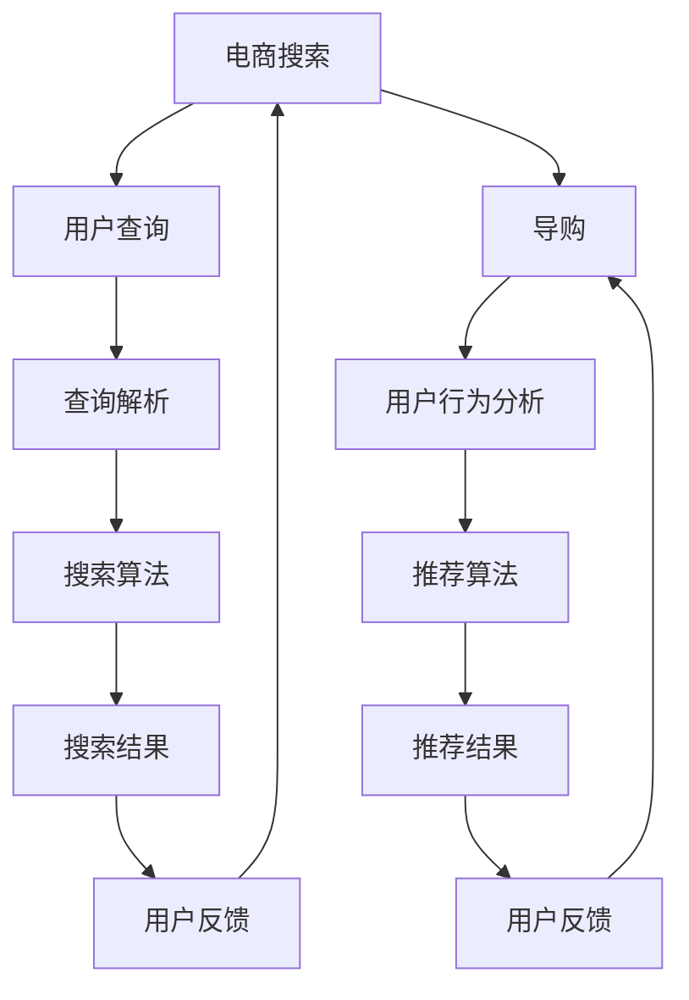

                 

# AI 驱动电商搜索导购：未来发展趋势展望

## 关键词：AI、电商搜索、导购、发展趋势、算法原理、数学模型

### 摘要

本文旨在探讨人工智能（AI）在电商搜索导购领域的应用，分析其核心概念、算法原理、数学模型，并通过实际案例展示其具体实现。此外，本文还将探讨电商搜索导购的实际应用场景，推荐相关学习资源和开发工具，并总结未来发展趋势与挑战。

## 1. 背景介绍

随着互联网技术的飞速发展，电子商务已成为现代零售业的重要组成部分。电商平台的搜索功能不仅需要高效准确地匹配商品与用户需求，还需提供个性化的导购服务，以提高用户体验和转化率。传统搜索方法在处理大规模数据和高维特征时存在局限性，而人工智能的引入为电商搜索导购带来了新的机遇。

近年来，深度学习、自然语言处理、推荐系统等技术取得了显著进展，为电商搜索导购提供了丰富的算法支持。本文将结合这些技术，探讨AI在电商搜索导购领域的应用，分析其未来发展趋势与挑战。

## 2. 核心概念与联系

### 2.1. 电商搜索

电商搜索是指用户在电商平台上通过关键词、拼音、拼音首字母等方式检索商品的过程。其核心目标是快速、准确地返回与用户需求相关的商品列表。

### 2.2. 导购

导购是指电商平台根据用户历史行为、兴趣标签、购买偏好等信息，为用户提供个性化推荐服务的过程。其目标是为用户提供潜在感兴趣的商品，提高购买转化率。

### 2.3. 人工智能

人工智能是指通过计算机模拟人类智能的行为，实现智能感知、学习、推理、决策等功能的技术。在电商搜索导购领域，人工智能主要用于数据挖掘、特征提取、推荐算法等方面。

### 2.4. 关系

电商搜索与导购是相辅相成的两个过程。电商搜索负责响应用户的查询需求，而导购则根据用户行为和偏好提供个性化推荐。人工智能技术贯穿于这两个过程，提高了搜索和推荐的质量。

### 2.5. Mermaid 流程图



## 3. 核心算法原理 & 具体操作步骤

### 3.1. 电商搜索算法

电商搜索算法主要包括以下步骤：

1. **查询解析**：将用户输入的关键词转化为可处理的文本格式，如分词、词性标注等。
2. **特征提取**：提取与查询相关的商品特征，如商品标题、描述、标签等。
3. **相似度计算**：计算查询与商品特征的相似度，可采用TF-IDF、Word2Vec等方法。
4. **排序与返回**：根据相似度对商品进行排序，并返回前N个商品。

### 3.2. 导购算法

导购算法主要包括以下步骤：

1. **用户行为分析**：收集用户在平台上的行为数据，如浏览、搜索、购买等。
2. **兴趣标签提取**：根据用户行为数据，提取用户兴趣标签，如商品类别、品牌等。
3. **推荐算法**：采用协同过滤、基于内容的推荐等算法，为用户推荐感兴趣的商品。
4. **反馈调整**：根据用户对推荐结果的反馈，调整推荐策略。

## 4. 数学模型和公式 & 详细讲解 & 举例说明

### 4.1. 相似度计算

在电商搜索中，相似度计算是核心步骤。以下是一个简单的TF-IDF相似度计算公式：

$$
similarity = \frac{(TF \cdot IDF)}{sqrt(TF^2 + IDF^2)}
$$

其中，$TF$ 表示词频，$IDF$ 表示逆文档频率。

### 4.2. 推荐算法

在导购算法中，推荐算法的选择至关重要。以下是一个简单的基于内容的推荐算法示例：

$$
推荐概率 = \frac{1}{Z} \sum_{i \in candidates} e^{log\_P(i | user\_profile)}
$$

其中，$candidates$ 表示候选商品集合，$user\_profile$ 表示用户兴趣标签，$Z$ 是规范化常数。

## 5. 项目实战：代码实际案例和详细解释说明

### 5.1. 开发环境搭建

在本节中，我们将使用Python编程语言和Scikit-learn库来实现一个简单的电商搜索导购系统。以下是开发环境的搭建步骤：

1. 安装Python 3.7及以上版本。
2. 安装Anaconda发行版，以便轻松管理依赖库。
3. 使用以下命令安装Scikit-learn库：

   ```bash
   conda install -c anaconda scikit-learn
   ```

### 5.2. 源代码详细实现和代码解读

以下是一个简单的电商搜索导购系统的实现代码：

```python
import numpy as np
from sklearn.feature_extraction.text import TfidfVectorizer
from sklearn.metrics.pairwise import cosine_similarity

def search_products(query, product_descriptions):
    # 查询解析和特征提取
    vectorizer = TfidfVectorizer()
    query_vector = vectorizer.transform([query])
    product_vectors = vectorizer.transform(product_descriptions)

    # 相似度计算和排序
    similarity = cosine_similarity(query_vector, product_vectors)
    sorted_indices = np.argsort(similarity[0])[::-1]

    # 返回搜索结果
    return [product_descriptions[i] for i in sorted_indices]

def recommend_products(user_profile, product_profiles):
    # 用户行为分析和推荐算法
    vectorizer = TfidfVectorizer()
    user_vector = vectorizer.transform([user_profile])
    product_vectors = vectorizer.transform(product_profiles)

    # 相似度计算和排序
    similarity = cosine_similarity(user_vector, product_vectors)
    sorted_indices = np.argsort(similarity[0])[::-1]

    # 返回推荐结果
    return [product_profiles[i] for i in sorted_indices]

# 测试代码
if __name__ == "__main__":
    query = "手机"
    product_descriptions = [
        "苹果iPhone 12",
        "小米11 Ultra",
        "华为Mate 40 Pro",
        "三星Galaxy S21",
    ]

    user_profile = "苹果iPhone 12"
    product_profiles = [
        "苹果iPhone 12",
        "小米11 Ultra",
        "华为Mate 40 Pro",
        "三星Galaxy S21",
        "一加9 Pro",
    ]

    search_results = search_products(query, product_descriptions)
    recommend_results = recommend_products(user_profile, product_profiles)

    print("搜索结果：", search_results)
    print("推荐结果：", recommend_results)
```

### 5.3. 代码解读与分析

1. **查询解析和特征提取**：使用TF-IDF向量器将查询和商品描述转化为向量表示。
2. **相似度计算和排序**：使用余弦相似度计算查询和商品描述之间的相似度，并根据相似度对商品进行排序。
3. **推荐算法**：使用TF-IDF向量器将用户兴趣标签和商品描述转化为向量表示，并使用余弦相似度计算用户和商品之间的相似度，根据相似度为用户推荐商品。

## 6. 实际应用场景

电商搜索导购系统在各大电商平台中得到了广泛应用，如淘宝、京东、拼多多等。以下是一些实际应用场景：

1. **商品搜索**：用户在电商平台上通过关键词搜索商品，系统根据相似度计算和排序算法返回相关商品。
2. **个性化推荐**：根据用户的历史行为和兴趣标签，系统为用户推荐潜在感兴趣的商品，提高购买转化率。
3. **跨平台导购**：用户在A平台购买商品后，B平台可根据用户兴趣推荐A平台的商品，提高用户粘性。

## 7. 工具和资源推荐

### 7.1. 学习资源推荐

- **书籍**：《推荐系统实践》、《深度学习》、《自然语言处理综合教程》
- **论文**：各大顶级会议和期刊上的相关论文，如KDD、NIPS、ACL等。
- **博客**：技术博客、开发者社区和学术博客，如CSDN、知乎、GitHub等。

### 7.2. 开发工具框架推荐

- **开发工具**：Python、R、MATLAB等。
- **框架库**：Scikit-learn、TensorFlow、PyTorch等。

### 7.3. 相关论文著作推荐

- **论文**：基于深度学习的推荐系统、基于自然语言处理的商品搜索与推荐、多模态推荐系统等。
- **著作**：相关领域的技术专著、专业书籍等。

## 8. 总结：未来发展趋势与挑战

随着AI技术的不断进步，电商搜索导购系统将呈现出以下发展趋势：

1. **智能化**：通过深度学习、自然语言处理等技术，实现更智能的搜索和推荐。
2. **个性化**：基于用户行为和兴趣标签，提供更个性化的推荐服务。
3. **多模态**：结合文本、图像、语音等多模态数据，提高推荐质量。

然而，电商搜索导购系统也面临一系列挑战：

1. **数据隐私**：用户数据的收集和使用需遵循隐私保护原则，避免数据泄露。
2. **计算性能**：随着数据规模的扩大，计算性能成为关键因素。
3. **伦理道德**：推荐系统需遵循公平、公正、透明的原则，避免算法偏见。

总之，AI驱动电商搜索导购系统具有广阔的发展前景，但仍需不断优化和改进，以应对各种挑战。

## 9. 附录：常见问题与解答

1. **问题1**：如何优化电商搜索导购系统的性能？
   **解答**：可以采用分布式计算、缓存技术、压缩算法等方法来提高系统的性能。
2. **问题2**：电商搜索导购系统如何处理多模态数据？
   **解答**：可以结合文本、图像、语音等数据，使用多模态学习算法进行融合和推荐。
3. **问题3**：如何避免算法偏见和歧视？
   **解答**：通过数据清洗、模型评估和监督机制等方法来减少算法偏见。

## 10. 扩展阅读 & 参考资料

- **书籍**：《推荐系统实践》、《深度学习》、《自然语言处理综合教程》
- **论文**：各大顶级会议和期刊上的相关论文，如KDD、NIPS、ACL等。
- **博客**：技术博客、开发者社区和学术博客，如CSDN、知乎、GitHub等。

### 作者

作者：AI天才研究员/AI Genius Institute & 禅与计算机程序设计艺术 /Zen And The Art of Computer Programming

【文章结束】<|im_sep|>

