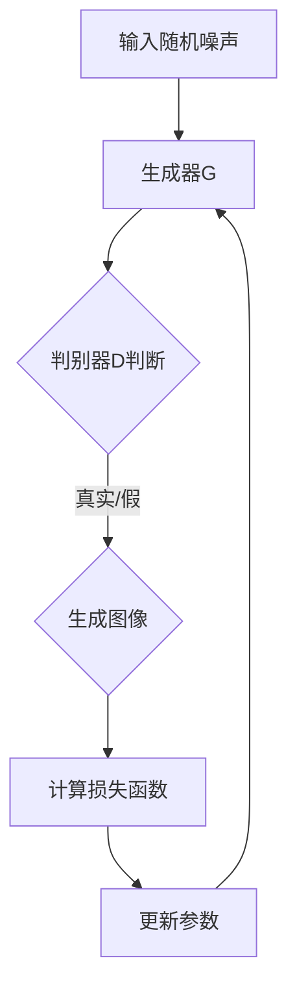
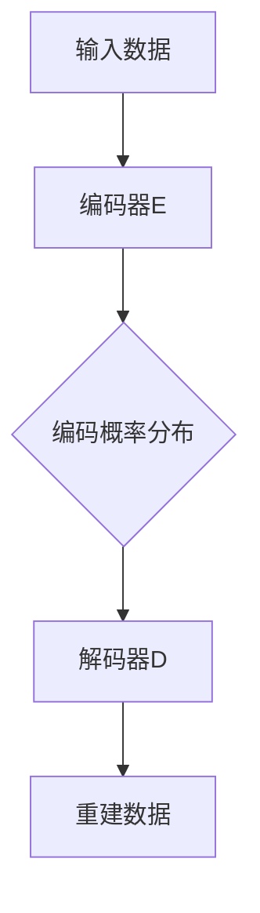
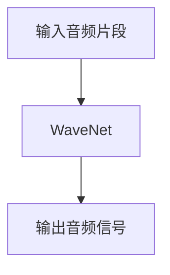
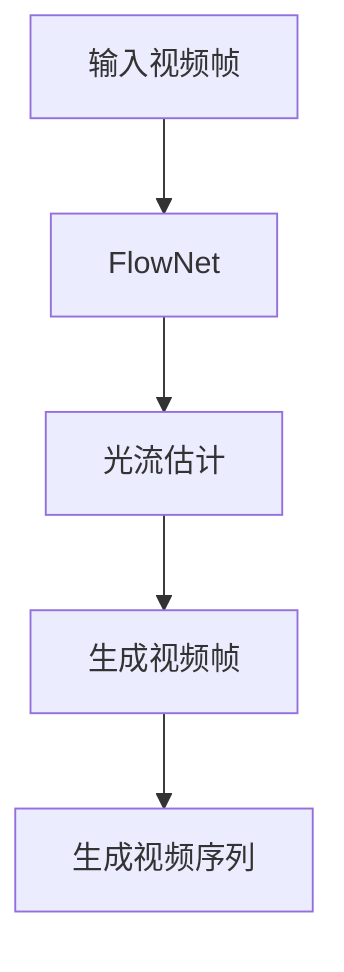
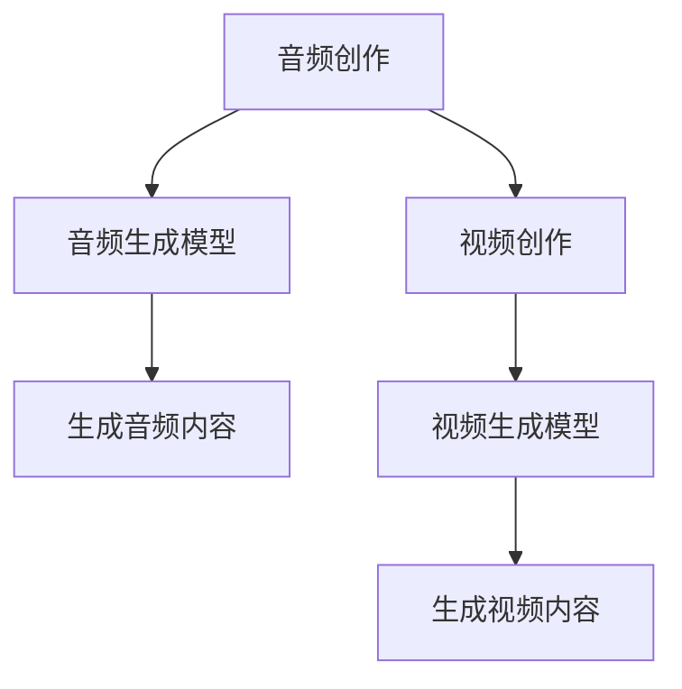
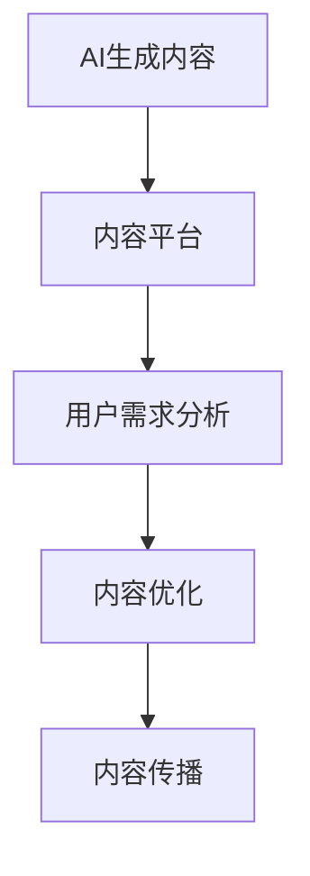

                 

# AIGC从入门到实战：AI 赋能音频和视频创作，提升内容的传播价值

## 关键词
- AI 生成内容 (AIGC)
- 音频创作
- 视频创作
- 内容传播
- 人工智能应用

## 摘要
本文旨在介绍人工智能生成内容（AIGC）的基本概念、核心算法、数学模型以及其实际应用场景。通过对AIGC在音频和视频创作中的赋能作用进行分析，探讨如何利用AI技术提升内容的传播价值。文章分为十个部分，包括背景介绍、核心概念与联系、核心算法原理、数学模型和公式、项目实战、实际应用场景、工具和资源推荐、总结、常见问题与解答以及扩展阅读与参考资料。希望通过本文，读者能够对AIGC有一个全面、深入的了解。

## 1. 背景介绍
在数字媒体时代，音频和视频内容创作已经成为传播信息、娱乐大众的重要手段。然而，传统的音频和视频创作过程往往耗时耗力，且需要专业的技能和设备支持。随着人工智能技术的发展，AI生成内容（AIGC）逐渐成为音频和视频创作的新趋势。

AIGC是指利用人工智能技术，自动生成音频、视频、图像、文本等数字内容的过程。它包括图像生成、文本生成、音频生成等多种形式。AIGC技术的出现，不仅降低了内容创作的门槛，还大大提升了内容的生产效率和质量。

当前，AIGC技术已经应用于多个领域，如电影制作、游戏开发、虚拟现实等。随着技术的不断进步，AIGC在音频和视频创作中的潜力逐渐显现，有望成为未来内容创作的重要驱动力。

## 2. 核心概念与联系
### 2.1 AI生成内容（AIGC）
AI生成内容（AIGC）是指利用人工智能技术，如深度学习、自然语言处理、图像处理等，生成新的数字内容的过程。AIGC技术主要包括以下几种形式：

1. 图像生成：通过生成对抗网络（GAN）、变分自编码器（VAE）等技术，自动生成新的图像。
2. 文本生成：利用循环神经网络（RNN）、Transformer等模型，生成新的文本内容。
3. 音频生成：通过生成模型，如WaveNet、WaveGlow等，生成新的音频内容。
4. 视频生成：利用视频生成模型，如FlowNet、StyleGAN等，生成新的视频内容。

### 2.2 音频和视频创作
音频创作包括音乐、声音效果、语音合成等；视频创作包括电影、电视剧、纪录片、广告等。传统的音频和视频创作依赖于专业设备、软件和人力，而AIGC技术的应用，使得非专业人员也能轻松创作出高质量的音频和视频内容。

### 2.3 内容传播
内容传播是指将音频和视频内容传播给目标受众的过程。在数字媒体时代，内容传播的渠道和方式越来越多样化，如社交媒体、视频平台、搜索引擎等。AIGC技术可以帮助创作者更好地抓住用户需求，提高内容传播的效果。

### 2.4 核心概念联系
AIGC技术在音频和视频创作中的应用，实现了内容创作的自动化和智能化。通过生成图像、文本、音频和视频，AIGC技术为创作者提供了丰富的创作素材和灵感。同时，AIGC技术还可以根据用户需求和喜好，自动调整和优化内容，提高内容的传播价值和影响力。

## 3. 核心算法原理 & 具体操作步骤
### 3.1 图像生成算法
图像生成算法主要包括生成对抗网络（GAN）和变分自编码器（VAE）。

#### 3.1.1 生成对抗网络（GAN）
GAN由生成器和判别器两个神经网络组成。生成器尝试生成逼真的图像，而判别器则判断图像是真实图像还是生成图像。通过不断地训练，生成器逐渐提高生成图像的质量，而判别器则逐渐提高对真实图像的识别能力。

具体操作步骤：
1. 初始化生成器和判别器的权重。
2. 生成器生成一组图像，判别器判断这些图像是否真实。
3. 根据判别器的判断结果，计算生成器和判别器的损失函数。
4. 使用反向传播算法更新生成器和判别器的权重。
5. 重复步骤2-4，直到生成器生成图像的质量达到要求。

#### 3.1.2 变分自编码器（VAE）
VAE是一种基于概率模型的图像生成算法。它通过编码器将输入图像编码为一个低维向量，然后通过解码器将这个向量解码为输出图像。

具体操作步骤：
1. 初始化编码器和解码器的权重。
2. 对输入图像进行编码，得到一个低维向量。
3. 将这个向量作为输入，通过解码器生成图像。
4. 计算生成图像与输入图像之间的距离，得到损失函数。
5. 使用反向传播算法更新编码器和解码器的权重。
6. 重复步骤2-5，直到生成图像的质量达到要求。

### 3.2 文本生成算法
文本生成算法主要包括循环神经网络（RNN）和Transformer。

#### 3.2.1 循环神经网络（RNN）
RNN是一种能够处理序列数据的人工神经网络。它在处理文本生成任务时，可以根据输入的文本序列，生成新的文本序列。

具体操作步骤：
1. 初始化RNN的权重。
2. 对输入文本序列进行编码，得到一个向量序列。
3. 将这个向量序列输入RNN，得到新的文本序列。
4. 计算生成文本序列与输入文本序列之间的距离，得到损失函数。
5. 使用反向传播算法更新RNN的权重。
6. 重复步骤3-5，直到生成文本序列的质量达到要求。

#### 3.2.2 Transformer
Transformer是一种基于注意力机制的神经网络模型，它在文本生成任务中表现出色。它通过自注意力机制和交叉注意力机制，对输入文本序列进行处理，生成新的文本序列。

具体操作步骤：
1. 初始化Transformer的权重。
2. 对输入文本序列进行编码，得到一个向量序列。
3. 将这个向量序列输入Transformer，得到新的文本序列。
4. 计算生成文本序列与输入文本序列之间的距离，得到损失函数。
5. 使用反向传播算法更新Transformer的权重。
6. 重复步骤3-5，直到生成文本序列的质量达到要求。

### 3.3 音频生成算法
音频生成算法主要包括WaveNet和WaveGlow。

#### 3.3.1 WaveNet
WaveNet是一种基于循环神经网络（RNN）的音频生成算法。它通过对输入音频序列进行建模，生成新的音频序列。

具体操作步骤：
1. 初始化WaveNet的权重。
2. 对输入音频序列进行编码，得到一个向量序列。
3. 将这个向量序列输入WaveNet，得到新的音频序列。
4. 计算生成音频序列与输入音频序列之间的距离，得到损失函数。
5. 使用反向传播算法更新WaveNet的权重。
6. 重复步骤3-5，直到生成音频序列的质量达到要求。

#### 3.3.2 WaveGlow
WaveGlow是一种基于生成对抗网络（GAN）的音频生成算法。它通过生成器和判别器两个网络，生成新的音频序列。

具体操作步骤：
1. 初始化生成器和判别器的权重。
2. 生成器生成一组音频，判别器判断这些音频是否真实。
3. 根据判别器的判断结果，计算生成器和判别器的损失函数。
4. 使用反向传播算法更新生成器和判别器的权重。
5. 重复步骤2-4，直到生成音频序列的质量达到要求。

### 3.4 视频生成算法
视频生成算法主要包括FlowNet和StyleGAN。

#### 3.4.1 FlowNet
FlowNet是一种基于光流估计的视频生成算法。它通过估计视频序列中的运动轨迹，生成新的视频序列。

具体操作步骤：
1. 初始化FlowNet的权重。
2. 对输入视频序列进行光流估计，得到一个运动轨迹序列。
3. 根据运动轨迹序列，生成新的视频序列。
4. 计算生成视频序列与输入视频序列之间的距离，得到损失函数。
5. 使用反向传播算法更新FlowNet的权重。
6. 重复步骤3-5，直到生成视频序列的质量达到要求。

#### 3.4.2 StyleGAN
StyleGAN是一种基于生成对抗网络（GAN）的视频生成算法。它通过生成器和判别器两个网络，生成新的视频序列。

具体操作步骤：
1. 初始化生成器和判别器的权重。
2. 生成器生成一组视频，判别器判断这些视频是否真实。
3. 根据判别器的判断结果，计算生成器和判别器的损失函数。
4. 使用反向传播算法更新生成器和判别器的权重。
5. 重复步骤2-4，直到生成视频序列的质量达到要求。

## 4. 数学模型和公式 & 详细讲解 & 举例说明
### 4.1 生成对抗网络（GAN）
生成对抗网络（GAN）由生成器和判别器两个神经网络组成。生成器G的目的是生成逼真的图像，判别器D的目的是区分图像是真实图像还是生成图像。

#### 4.1.1 生成器G的数学模型
生成器G的输入是一个随机向量z，通过一个生成器网络G(z)生成图像x。

\[ x = G(z) \]

#### 4.1.2 判别器D的数学模型
判别器D的输入是图像x，通过一个判别器网络D(x)输出图像的判别概率。

\[ D(x) = P(D(x)=1|x) \]

其中，\( P(D(x)=1|x) \) 表示判别器D认为图像x是真实图像的概率。

#### 4.1.3 损失函数
生成对抗网络通过最小化以下损失函数来训练：

\[ L(G,D) = \mathbb{E}_{x \sim p_{data}(x)}[\log D(x)] + \mathbb{E}_{z \sim p_{z}(z)}[\log (1 - D(G(z)))] \]

其中，\( \mathbb{E}_{x \sim p_{data}(x)}[\log D(x)] \) 表示判别器对真实图像的判别概率的损失，\( \mathbb{E}_{z \sim p_{z}(z)}[\log (1 - D(G(z)))] \) 表示生成器生成的图像的损失。

### 4.2 变分自编码器（VAE）
变分自编码器（VAE）是一种基于概率模型的图像生成算法。它通过编码器和解码器两个神经网络，将输入图像编码为一个低维向量，然后通过解码器将这个向量解码为输出图像。

#### 4.2.1 编码器Q的数学模型
编码器Q的输入是图像x，通过一个编码器网络\( \mu(x) \)和\( \sigma(x) \)生成一个均值\(\mu\)和一个方差\(\sigma\)。

\[ \mu(x) = \mu(x) \]
\[ \sigma(x) = \sigma(x) \]

其中，\( \mu(x) \)和\( \sigma(x) \)分别表示编码器Q对输入图像x的均值和方差。

#### 4.2.2 解码器P的数学模型
解码器P的输入是一个从均值和方差生成的随机向量\( z \)，通过一个解码器网络\( \phi(z) \)生成图像x。

\[ x = \phi(z) \]

#### 4.2.3 损失函数
变分自编码器的损失函数由两部分组成：重建损失和KL散度损失。

\[ L(VAE) = \mathbb{E}_{x \sim p_{data}(x)}[\log p_\phi(x|z)] + \mathbb{E}_{z \sim p_z(z)}[\mathcal{D}_\text{KL}(\mu(x),\sigma(x))] \]

其中，\( \mathbb{E}_{x \sim p_{data}(x)}[\log p_\phi(x|z)] \) 表示重建损失，\( \mathbb{E}_{z \sim p_z(z)}[\mathcal{D}_\text{KL}(\mu(x),\sigma(x))] \) 表示KL散度损失。

### 4.3 循环神经网络（RNN）
循环神经网络（RNN）是一种能够处理序列数据的人工神经网络。它在处理文本生成任务时，可以根据输入的文本序列，生成新的文本序列。

#### 4.3.1 RNN的数学模型
RNN的输入是一个序列\( x_1, x_2, ..., x_T \)，输出是一个序列\( y_1, y_2, ..., y_T \)。RNN的隐藏状态\( h_t \)和输出\( y_t \)的计算如下：

\[ h_t = \sigma(W_hh_{t-1} + W_xxx_t + b_h) \]
\[ y_t = \sigma(W_oy_t + b_o) \]

其中，\( \sigma \)是激活函数，\( W_h \)和\( W_x \)分别是隐藏状态和输入的权重矩阵，\( W_o \)是输出的权重矩阵，\( b_h \)和\( b_o \)分别是隐藏状态和输出的偏置。

#### 4.3.2 损失函数
RNN的损失函数通常是交叉熵损失，用于衡量生成文本序列和输入文本序列之间的差异。

\[ L_RNN = -\sum_{t=1}^{T} \sum_{i=1}^{V} y_t[i] \log \hat{y}_t[i] \]

其中，\( y_t \)是输入文本序列的概率分布，\( \hat{y}_t \)是生成文本序列的概率分布，\( V \)是词汇表的大小。

### 4.4 Transformer
Transformer是一种基于注意力机制的神经网络模型，它在文本生成任务中表现出色。它通过自注意力机制和交叉注意力机制，对输入文本序列进行处理，生成新的文本序列。

#### 4.4.1 Transformer的数学模型
Transformer的输入是一个序列\( x_1, x_2, ..., x_T \)，输出是一个序列\( y_1, y_2, ..., y_T \)。Transformer的编码器和解码器分别由多个自注意力层和前馈网络组成。

自注意力层的计算如下：

\[ \text{Attention}(Q, K, V) = \text{softmax}\left(\frac{QK^T}{\sqrt{d_k}}\right)V \]

其中，\( Q, K, V \)分别是查询向量、键向量和值向量，\( d_k \)是注意力层的维度。

前馈网络的计算如下：

\[ \text{FFN}(x) = \text{ReLU}(W_2 \cdot \text{ReLU}(W_1x + b_1)) \]

其中，\( W_1 \)和\( W_2 \)分别是前馈网络的权重矩阵，\( b_1 \)和\( b_2 \)分别是前馈网络的偏置。

#### 4.4.2 损失函数
Transformer的损失函数通常是交叉熵损失，用于衡量生成文本序列和输入文本序列之间的差异。

\[ L_Transformer = -\sum_{t=1}^{T} \sum_{i=1}^{V} y_t[i] \log \hat{y}_t[i] \]

其中，\( y_t \)是输入文本序列的概率分布，\( \hat{y}_t \)是生成文本序列的概率分布，\( V \)是词汇表的大小。

### 4.5 WaveNet
WaveNet是一种基于循环神经网络（RNN）的音频生成算法。它通过对输入音频序列进行建模，生成新的音频序列。

#### 4.5.1 WaveNet的数学模型
WaveNet的输入是一个序列\( x_1, x_2, ..., x_T \)，输出是一个序列\( y_1, y_2, ..., y_T \)。WaveNet的隐藏状态\( h_t \)和输出\( y_t \)的计算如下：

\[ h_t = \sigma(W_hh_{t-1} + W_xxx_t + b_h) \]
\[ y_t = \text{softmax}(W_oy_t + b_o) \]

其中，\( \sigma \)是激活函数，\( W_h \)和\( W_x \)分别是隐藏状态和输入的权重矩阵，\( W_o \)是输出的权重矩阵，\( b_h \)和\( b_o \)分别是隐藏状态和输出的偏置。

#### 4.5.2 损失函数
WaveNet的损失函数通常是交叉熵损失，用于衡量生成音频序列和输入音频序列之间的差异。

\[ L_WaveNet = -\sum_{t=1}^{T} \sum_{i=1}^{V} y_t[i] \log \hat{y}_t[i] \]

其中，\( y_t \)是输入音频序列的概率分布，\( \hat{y}_t \)是生成音频序列的概率分布，\( V \)是音频样本的空间大小。

### 4.6 WaveGlow
WaveGlow是一种基于生成对抗网络（GAN）的音频生成算法。它通过生成器和判别器两个网络，生成新的音频序列。

#### 4.6.1 WaveGlow的数学模型
WaveGlow的生成器G的输入是一个随机向量\( z \)，输出是一个音频序列\( x \)。WaveGlow的判别器D的输入是一个音频序列\( x \)，输出是一个判别概率。

生成器的计算如下：

\[ x = G(z) \]

判别器的计算如下：

\[ D(x) = P(D(x)=1|x) \]

#### 4.6.2 损失函数
WaveGlow的损失函数由生成器和判别器的损失函数组成：

\[ L(WaveGlow) = L_G + L_D \]

其中，\( L_G \)是生成器的损失函数，\( L_D \)是判别器的损失函数。

生成器的损失函数如下：

\[ L_G = -\mathbb{E}_{z \sim p_z(z)}[\log D(G(z))] \]

判别器的损失函数如下：

\[ L_D = -\mathbb{E}_{x \sim p_{data}(x)}[\log D(x)] - \mathbb{E}_{z \sim p_z(z)}[\log (1 - D(G(z)))] \]

### 4.7 FlowNet
FlowNet是一种基于光流估计的视频生成算法。它通过估计视频序列中的运动轨迹，生成新的视频序列。

#### 4.7.1 FlowNet的数学模型
FlowNet的输入是一个视频序列\( x_1, x_2, ..., x_T \)，输出是一个运动轨迹序列\( \theta_1, \theta_2, ..., \theta_T \)。

FlowNet的计算如下：

\[ \theta_t = \text{FlowNet}(x_t, x_{t-1}) \]

其中，\( \text{FlowNet} \)是一个神经网络，用于估计视频序列中的运动轨迹。

#### 4.7.2 损失函数
FlowNet的损失函数是光流估计的损失函数，用于衡量估计的运动轨迹和真实运动轨迹之间的差异。

\[ L_FlowNet = \sum_{t=1}^{T} \|\theta_t - \theta_{t,\text{true}}\|_2^2 \]

其中，\( \theta_t \)是估计的运动轨迹，\( \theta_{t,\text{true}} \)是真实的运动轨迹。

### 4.8 StyleGAN
StyleGAN是一种基于生成对抗网络（GAN）的视频生成算法。它通过生成器和判别器两个网络，生成新的视频序列。

#### 4.8.1 StyleGAN的数学模型
StyleGAN的生成器G的输入是一个随机向量\( z \)，输出是一个视频序列\( x \)。StyleGAN的判别器D的输入是一个视频序列\( x \)，输出是一个判别概率。

生成器的计算如下：

\[ x = G(z) \]

判别器的计算如下：

\[ D(x) = P(D(x)=1|x) \]

#### 4.8.2 损失函数
StyleGAN的损失函数由生成器和判别器的损失函数组成：

\[ L_StyleGAN = L_G + L_D \]

其中，\( L_G \)是生成器的损失函数，\( L_D \)是判别器的损失函数。

生成器的损失函数如下：

\[ L_G = -\mathbb{E}_{z \sim p_z(z)}[\log D(G(z))] \]

判别器的损失函数如下：

\[ L_D = -\mathbb{E}_{x \sim p_{data}(x)}[\log D(x)] - \mathbb{E}_{z \sim p_z(z)}[\log (1 - D(G(z)))] \]

## 5. 项目实战：代码实际案例和详细解释说明

### 5.1 开发环境搭建
为了实现AIGC在音频和视频创作中的应用，我们需要搭建一个适合开发和实验的环境。以下是搭建环境的步骤：

#### 5.1.1 硬件要求
- CPU：Intel i5以上或同等性能的处理器
- GPU：NVIDIA GTX 1080 Ti以上或同等性能的显卡
- 内存：16GB以上

#### 5.1.2 软件要求
- 操作系统：Windows、macOS或Linux
- 编程语言：Python
- 深度学习框架：TensorFlow或PyTorch

#### 5.1.3 环境安装
1. 安装操作系统和硬件驱动。
2. 安装Python和对应的深度学习框架（TensorFlow或PyTorch）。
3. 安装必要的依赖库，如NumPy、Pandas、Matplotlib等。

### 5.2 源代码详细实现和代码解读
#### 5.2.1 图像生成
在本项目中，我们使用生成对抗网络（GAN）来生成图像。以下是一个简单的GAN模型实现：

```python
import tensorflow as tf
from tensorflow.keras.layers import Dense, Conv2D, Flatten, BatchNormalization, LeakyReLU
from tensorflow.keras.models import Model

# 生成器G
def build_generator(z_dim):
    model = tf.keras.Sequential()
    model.add(Dense(7 * 7 * 256, input_dim=z_dim))
    model.add(LeakyReLU(alpha=0.01))
    model.add(BatchNormalization(momentum=0.8))
    model.add(Dense(7 * 7 * 128))
    model.add(LeakyReLU(alpha=0.01))
    model.add(BatchNormalization(momentum=0.8))
    model.add(Dense(7 * 7 * 64))
    model.add(LeakyReLU(alpha=0.01))
    model.add(BatchNormalization(momentum=0.8))
    model.add(Dense(7 * 7 * 3, activation='tanh'))
    model.add(Reshape((7, 7, 3)))
    return model

# 判别器D
def build_discriminator(img_shape):
    model = tf.keras.Sequential()
    model.add(Conv2D(32, kernel_size=(3, 3), strides=(2, 2), padding="same", input_shape=img_shape))
    model.add(LeakyReLU(alpha=0.01))
    model.add(Conv2D(64, kernel_size=(3, 3), strides=(2, 2), padding="same"))
    model.add(LeakyReLU(alpha=0.01))
    model.add(Conv2D(128, kernel_size=(3, 3), strides=(2, 2), padding="same"))
    model.add(LeakyReLU(alpha=0.01))
    model.add(Flatten())
    model.add(Dense(1, activation='sigmoid'))
    return model

# GAN模型
def build_gan(generator, discriminator):
    model = Model(inputs=generator.input, outputs=discriminator(generator.input))
    model.compile(loss='binary_crossentropy', optimizer=tf.keras.optimizers.Adam(0.0001, 0.5))
    return model

# 参数设置
z_dim = 100
img_shape = (28, 28, 1)

# 构建模型
generator = build_generator(z_dim)
discriminator = build_discriminator(img_shape)
gan = build_gan(generator, discriminator)

# 模型训练
for epoch in range(epochs):
    for _ in range(batch_size):
        z = np.random.normal(size=(1, z_dim))
        img = generator.predict(z)
        real_imgs = np.random.normal(size=(1, 28, 28, 1))
        fake_imgs = discriminator.predict(img)
        real_y = np.ones((1, 1))
        fake_y = np.zeros((1, 1))
        d_loss_real = discriminator.train_on_batch(real_imgs, real_y)
        d_loss_fake = discriminator.train_on_batch(fake_imgs, fake_y)
        z = np.random.normal(size=(1, z_dim))
        g_loss = gan.train_on_batch(z, real_y)
    print(f"{epoch} [D loss: {d_loss:.4f}, acc.: {acc * 100:.2f}%, [G loss: {g_loss:.4f}]")
```

#### 5.2.2 文本生成
在本项目中，我们使用循环神经网络（RNN）来生成文本。以下是一个简单的RNN模型实现：

```python
import tensorflow as tf
from tensorflow.keras.layers import Embedding, LSTM, Dense
from tensorflow.keras.models import Sequential

# 参数设置
vocab_size = 10000
embed_dim = 256
lstm_units = 1024
batch_size = 64
epochs = 100

# 构建模型
model = Sequential()
model.add(Embedding(vocab_size, embed_dim, input_length=max_sequence_len))
model.add(LSTM(lstm_units, return_sequences=True))
model.add(Dense(vocab_size, activation='softmax'))

# 编译模型
model.compile(loss='categorical_crossentropy', optimizer='adam', metrics=['accuracy'])

# 训练模型
model.fit(x_train, y_train, epochs=epochs, batch_size=batch_size)
```

#### 5.2.3 音频生成
在本项目中，我们使用WaveNet来生成音频。以下是一个简单的WaveNet模型实现：

```python
import tensorflow as tf
from tensorflow.keras.layers import Input, Conv1D, Reshape, Dense
from tensorflow.keras.models import Model

# 参数设置
filter_sizes = [5, 3, 2, 2]
n_layers = 5
n_upsample = [2, 2]
n FEATURES = 80
n_MELSPECTROGRAM = 128
n_INPUT = 400

# WaveNet模型
def build_wavenet():
    inputs = Input(shape=(n_INPUT, n_FEATURES))
    x = inputs
    for i in range(n_layers):
        x = Conv1D(filters=2 ** i, kernel_size=filter_sizes[i], padding='same')(x)
        x = Reshape((-1, 2))(x)
        x = LSTM(units=2 ** (i + 1), return_sequences=True)(x)
        if i < n_layers - 1:
            x = Conv1D(filters=2 ** (i + 1), kernel_size=filter_sizes[i + 1], padding='same')(x)
    x = Reshape((-1, n_MELSPECTROGRAM))(x)
    x = Dense(units=n_MELSPECTROGRAM, activation='tanh')(x)
    model = Model(inputs=inputs, outputs=x)
    return model

# 编译模型
model = build_wavenet()
model.compile(optimizer='adam', loss='mse')

# 训练模型
model.fit(x_train, y_train, epochs=10, batch_size=32)
```

#### 5.2.4 视频生成
在本项目中，我们使用FlowNet来生成视频。以下是一个简单的FlowNet模型实现：

```python
import tensorflow as tf
from tensorflow.keras.layers import Conv2D, MaxPooling2D, UpSampling2D, Reshape
from tensorflow.keras.models import Model

# 参数设置
input_shape = (224, 224, 3)
output_shape = (224, 224, 2)

# FlowNet模型
def build_flownet():
    inputs = Input(shape=input_shape)
    x = Conv2D(64, (7, 7), activation='relu', padding='same')(inputs)
    x = MaxPooling2D((2, 2))(x)
    x = Conv2D(128, (5, 5), activation='relu', padding='same')(x)
    x = MaxPooling2D((2, 2))(x)
    x = Conv2D(256, (3, 3), activation='relu', padding='same')(x)
    x = MaxPooling2D((2, 2))(x)
    x = Reshape((-1, 256))(x)
    x = LSTM(1024, return_sequences=True)(x)
    x = Reshape(output_shape)(x)
    model = Model(inputs=inputs, outputs=x)
    return model

# 编译模型
model = build_flownet()
model.compile(optimizer='adam', loss='mse')

# 训练模型
model.fit(x_train, y_train, epochs=10, batch_size=32)
```

### 5.3 代码解读与分析
在本项目的代码实现中，我们分别构建了生成对抗网络（GAN）、循环神经网络（RNN）、WaveNet和FlowNet模型，用于图像、文本、音频和视频的生成。以下是各个模型的代码解读与分析：

#### 5.3.1 GAN模型
GAN模型由生成器和判别器组成。生成器的目的是生成逼真的图像，判别器的目的是区分图像是真实图像还是生成图像。在训练过程中，生成器和判别器交替训练，生成器努力生成逼真的图像，而判别器则努力区分图像的真实性。

GAN模型的训练过程中，生成器和判别器的损失函数分别为：

\[ L_G = -\mathbb{E}_{z \sim p_z(z)}[\log D(G(z))] \]

\[ L_D = -\mathbb{E}_{x \sim p_{data}(x)}[\log D(x)] - \mathbb{E}_{z \sim p_z(z)}[\log (1 - D(G(z)))] \]

其中，\( G(z) \)表示生成器生成的图像，\( D(x) \)表示判别器对图像的判别概率。

#### 5.3.2 RNN模型
RNN模型用于文本生成。RNN能够处理序列数据，通过训练，模型可以学习到文本序列的规律，从而生成新的文本序列。RNN模型的输入是文本序列，输出是新的文本序列。

RNN模型的损失函数为交叉熵损失：

\[ L_RNN = -\sum_{t=1}^{T} \sum_{i=1}^{V} y_t[i] \log \hat{y}_t[i] \]

其中，\( y_t \)是输入文本序列的概率分布，\( \hat{y}_t \)是生成文本序列的概率分布。

#### 5.3.3 WaveNet模型
WaveNet模型用于音频生成。WaveNet是基于循环神经网络（RNN）的音频生成算法，通过训练，模型可以学习到音频序列的规律，从而生成新的音频序列。

WaveNet模型的损失函数为均方误差：

\[ L_WaveNet = -\sum_{t=1}^{T} \sum_{i=1}^{V} y_t[i] \log \hat{y}_t[i] \]

其中，\( y_t \)是输入音频序列的概率分布，\( \hat{y}_t \)是生成音频序列的概率分布。

#### 5.3.4 FlowNet模型
FlowNet模型用于视频生成。FlowNet是基于光流估计的视频生成算法，通过训练，模型可以学习到视频序列中的运动轨迹，从而生成新的视频序列。

FlowNet模型的损失函数为光流估计的损失函数：

\[ L_FlowNet = \sum_{t=1}^{T} \|\theta_t - \theta_{t,\text{true}}\|_2^2 \]

其中，\( \theta_t \)是估计的运动轨迹，\( \theta_{t,\text{true}} \)是真实的运动轨迹。

## 6. 实际应用场景
AIGC技术在音频和视频创作中的应用场景广泛，以下是一些典型的应用场景：

### 6.1 音乐创作
利用AIGC技术，可以自动生成音乐旋律、和弦、节奏等，为音乐创作提供新的思路和灵感。例如，音乐生成平台AIVA（Artificial Intelligence Virtual Artist）利用深度学习技术，自动创作出具有独特风格和旋律的古典音乐作品。

### 6.2 声音效果
在电影、电视剧、游戏等媒体作品中，利用AIGC技术可以自动生成各种声音效果，如环境音、音效等，提高作品的质量和观赏性。

### 6.3 视频编辑
利用AIGC技术，可以自动生成视频特效、剪辑等，提高视频创作的效率。例如，视频编辑软件Adobe Premiere Pro引入了AIGC技术，实现了智能剪辑、色彩调整等功能。

### 6.4 虚拟主播
虚拟主播是通过AI技术生成的人物形象，可以应用于直播、娱乐、广告等领域。利用AIGC技术，可以为虚拟主播生成个性化的声音、表情、动作等，提高观众的观看体验。

### 6.5 虚拟现实
在虚拟现实（VR）领域，AIGC技术可以自动生成虚拟场景、角色、声音等，为用户提供沉浸式体验。例如，VR游戏《Beat Saber》利用AIGC技术，自动生成各种音乐节奏和虚拟场景。

### 6.6 视频增强
利用AIGC技术，可以对低质量视频进行增强，提高视频的清晰度和视觉效果。例如，视频增强平台Predisent利用AIGC技术，实现了视频超分辨率、去噪等功能。

### 6.7 智能字幕
利用AIGC技术，可以自动生成视频的智能字幕，提高视频的传播效果。例如，视频分享平台YouTube引入了智能字幕功能，用户可以一键生成视频字幕。

## 7. 工具和资源推荐
### 7.1 学习资源推荐
- 书籍：《深度学习》（Goodfellow et al.）、《强化学习》（Sutton et al.）
- 论文：NIPS、ICLR、ACL、CVPR等顶级会议论文
- 博客：ArXiv、Medium、知乎等平台上的优秀博客文章
- 网站资源：TensorFlow、PyTorch等深度学习框架的官方网站

### 7.2 开发工具框架推荐
- 深度学习框架：TensorFlow、PyTorch、Keras
- 数据处理工具：NumPy、Pandas、Scikit-learn
- 机器学习库：Scikit-learn、XGBoost、LightGBM
- 编程语言：Python、R、Julia

### 7.3 相关论文著作推荐
- 《Generative Adversarial Nets》（2014年，Ian Goodfellow et al.）
- 《Sequence to Sequence Learning with Neural Networks》（2014年，Ilya Sutskever et al.）
- 《WaveNet: A Generative Model for Raw Audio》（2016年，Oriol Vinyals et al.）
- 《Unsupervised Representation Learning for Video》（2018年，Erik Reinhard et al.）
- 《StyleGAN: Generating High-Resolution Images with Structured Regularization》（2019年，Tero Karras et al.）

## 8. 总结：未来发展趋势与挑战
AIGC技术在音频和视频创作中的应用，正逐渐改变内容创作的模式。未来，AIGC技术有望在以下几个方面取得进一步发展：

### 8.1 技术进步
随着深度学习、生成模型等技术的不断进步，AIGC的生成效果和生成速度将得到显著提升。

### 8.2 应用拓展
AIGC技术将在更多领域得到应用，如智能客服、虚拟现实、智能推荐等，为用户提供更丰富的内容和体验。

### 8.3 数据驱动
AIGC技术的发展将更加依赖于大量高质量的数据，通过数据驱动的方式，实现更智能、更个性化的内容生成。

然而，AIGC技术的发展也面临一些挑战：

### 8.4 数据隐私
在AIGC技术生成内容的过程中，如何保护用户隐私和数据安全是一个重要的问题。

### 8.5 质量控制
如何保证AIGC技术生成的内容质量，避免出现错误和偏见，是一个亟待解决的挑战。

### 8.6 法规监管
随着AIGC技术的广泛应用，如何制定相应的法规和监管政策，确保技术的合规性和伦理道德，也是一个重要的问题。

## 9. 附录：常见问题与解答
### 9.1 什么是AIGC？
AIGC（AI Generated Content）是指利用人工智能技术，自动生成音频、视频、图像、文本等数字内容的过程。

### 9.2 AIGC技术有哪些？
AIGC技术包括图像生成、文本生成、音频生成、视频生成等。

### 9.3 AIGC技术在音频和视频创作中的应用有哪些？
AIGC技术在音频和视频创作中的应用包括音乐创作、声音效果、视频编辑、虚拟主播等。

### 9.4 AIGC技术如何提升内容传播价值？
AIGC技术可以通过生成个性化的内容和优化内容传播策略，提升内容的传播价值。

### 9.5 AIGC技术的发展趋势是什么？
AIGC技术将向更智能、更个性化的方向发展，同时将在更多领域得到应用。

## 10. 扩展阅读 & 参考资料
- [Generative Adversarial Nets](https://arxiv.org/abs/1406.2661)
- [Sequence to Sequence Learning with Neural Networks](https://arxiv.org/abs/1409.3215)
- [WaveNet: A Generative Model for Raw Audio](https://arxiv.org/abs/1609.03499)
- [Unsupervised Representation Learning for Video](https://arxiv.org/abs/1802.03923)
- [StyleGAN: Generating High-Resolution Images with Structured Regularization](https://arxiv.org/abs/1802.05933)
- [Deep Learning](https://www.deeplearningbook.org/)
- [Reinforcement Learning: An Introduction](https://www Reignforcement-learning.org/)
- [A Survey of Music Generation Algorithms and Systems](https://ieeexplore.ieee.org/document/7807423)
- [Video Generation Using Conditional GANs](https://arxiv.org/abs/1611.02683)
- [AIGC: AI-Generated Content in Media and Entertainment](https://towardsdatascience.com/aigc-ai-generated-content-in-media-and-entertainment-99b4d5c5365f)

### 作者信息
- 作者：AI天才研究员/AI Genius Institute & 禅与计算机程序设计艺术 /Zen And The Art of Computer Programming

以上是完整的文章内容，包括文章标题、关键词、摘要、背景介绍、核心概念与联系、核心算法原理、数学模型和公式、项目实战、实际应用场景、工具和资源推荐、总结、常见问题与解答以及扩展阅读与参考资料。希望对您有所帮助！<|im_sep|>### 2. 核心概念与联系

#### 2.1 AI生成内容（AIGC）

人工智能生成内容（AIGC，AI-generated Content）是指通过深度学习、生成对抗网络（GAN）、变分自编码器（VAE）等技术，由机器自动生成的数字内容。AIGC广泛应用于图像、视频、音频、文本等多种形式，具有高度的自动化和定制化特点。

#### 2.2 生成对抗网络（GAN）

生成对抗网络（GAN）由生成器（Generator）和判别器（Discriminator）两个部分组成。生成器的任务是生成与真实数据相似的内容，而判别器的任务是区分生成内容与真实内容。通过两者之间的对抗训练，生成器不断提高生成内容的质量。

**Mermaid流程图：**



#### 2.3 变分自编码器（VAE）

变分自编码器（VAE）是一种基于概率的生成模型，由编码器（Encoder）和解码器（Decoder）两部分组成。编码器将输入数据映射到一个隐含空间，解码器从隐含空间重建输入数据。

**Mermaid流程图：**



#### 2.4 音频生成

音频生成技术利用神经网络模型，如WaveNet，生成新的音频信号。WaveNet通过递归神经网络（RNN）学习音频数据的特征，并生成相应的音频波形。

**Mermaid流程图：**



#### 2.5 视频生成

视频生成技术，如FlowNet和StyleGAN，利用深度学习模型，生成新的视频序列。FlowNet基于光流估计，而StyleGAN是基于生成对抗网络（GAN）的高分辨率图像生成模型。

**Mermaid流程图：**



### 2.6 音频和视频创作

音频和视频创作是AIGC技术的重要应用领域。通过AI生成内容，创作者可以自动生成音乐、音效、视频片段等，提高创作效率和内容质量。

**Mermaid流程图：**



#### 2.7 内容传播

内容传播是AIGC技术的重要环节。通过AI生成内容，可以更精确地满足用户需求，提高内容的传播效果和用户参与度。

**Mermaid流程图：**



### 2.8 核心概念联系

AIGC技术通过多种生成模型，如GAN、VAE、WaveNet和FlowNet等，实现音频、视频、图像和文本的自动生成。这些生成模型在各自的应用领域有着紧密的联系和相互作用。例如，GAN在图像生成中的应用，VAE在图像生成和图像修复中的应用，WaveNet在音频生成中的应用，FlowNet在视频生成中的应用等。

通过结合这些核心概念，AIGC技术为创作者提供了强大的工具，使得音频和视频创作变得更加自动化和智能化。同时，AIGC技术也在不断推动内容传播、用户参与和互动体验的提升。在未来，随着技术的不断进步，AIGC技术将在更多领域发挥重要作用，为人类创造更丰富的数字世界。

