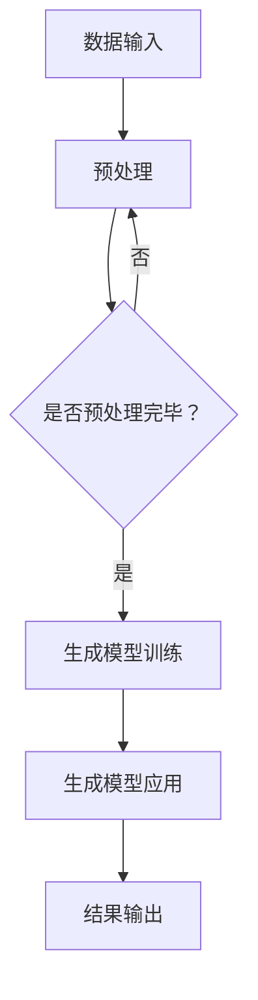

                 

### 背景介绍

#### 什么是AIGC？

AIGC，全称人工智能生成内容（Artificial Intelligence Generated Content），是一种利用人工智能技术生成内容的方法。它将人工智能技术与内容创作相结合，通过深度学习、自然语言处理、计算机视觉等技术，实现从无到有的内容生成。

#### AIGC的发展历史

AIGC的概念并非突然出现，而是经历了长期的演进。从早期的规则驱动的内容生成，到后来的基于模板的内容生成，再到目前的人工智能驱动的自动内容生成，技术的发展推动了AIGC的不断进步。

- **早期阶段**：规则驱动的内容生成主要依赖于预定义的规则和模板，虽然效率较低，但成本较低，适用于一些简单的场景。

- **发展阶段**：基于模板的内容生成，通过预定义的模板和变量，实现内容的动态生成，这种方式在互联网初期得到了广泛应用。

- **当前阶段**：人工智能驱动的自动内容生成，利用深度学习、自然语言处理等技术，实现了高度智能化的内容生成，能够根据输入的信息自动生成文章、图片、视频等多种类型的内容。

#### AIGC的应用领域

随着技术的不断发展，AIGC的应用领域也在不断拓展。目前，AIGC已在多个领域得到了广泛应用，包括：

- **新闻与媒体**：利用AIGC技术自动生成新闻报道，提高新闻生产的效率和质量。

- **电子商务**：利用AIGC技术自动生成商品描述、广告文案等，提高电子商务的营销效果。

- **教育与培训**：利用AIGC技术自动生成教学课件、练习题等，提高教育资源的利用效率。

- **艺术创作**：利用AIGC技术自动生成音乐、绘画等艺术作品，拓展艺术创作的可能性。

- **医疗与健康**：利用AIGC技术自动生成医学报告、健康建议等，提高医疗服务的质量。

- **娱乐与游戏**：利用AIGC技术自动生成剧情、角色等，丰富娱乐与游戏的内容。

#### AIGC的重要性

AIGC不仅改变了内容生成的模式，也对各行各业产生了深远的影响。它不仅提高了内容生产的效率，降低了成本，还激发了新的商业机会。随着5G、物联网、大数据等技术的不断发展，AIGC的应用前景将更加广阔。

**段落小结**：

本节介绍了AIGC的概念、发展历史、应用领域以及其重要性。在接下来的章节中，我们将深入探讨AIGC的核心概念与联系、核心算法原理、数学模型和公式，并通过实际项目实战，展示AIGC的强大应用能力。

---

## 2. 核心概念与联系

### 2.1 关键术语

在深入探讨AIGC之前，我们需要了解一些关键术语：

- **人工智能（AI）**：一种模拟人类智能行为的计算机技术。

- **生成模型（Generator Model）**：一种能够从随机噪声或其他输入中生成数据的模型。

- **条件生成模型（Conditional Generator）**：一种能够在特定条件下生成数据的生成模型。

- **对抗生成网络（GAN）**：一种由生成模型和判别模型组成的框架，用于生成逼真的数据。

- **自然语言处理（NLP）**：一种利用计算机技术理解和生成人类语言的方法。

- **计算机视觉（CV）**：一种利用计算机技术理解和解释图像和视频的方法。

### 2.2 原理介绍

AIGC的核心在于生成模型，这些模型能够从大量的数据中学习，并生成新的数据。以下是AIGC的核心原理：

- **生成模型的学习过程**：生成模型通过大量训练数据学习数据的分布，然后利用这些分布生成新的数据。

- **生成模型的应用**：生成模型可以应用于各种任务，如图像生成、文本生成、音乐生成等。

- **条件生成模型的应用**：条件生成模型能够在特定条件下生成数据，例如，根据用户输入的文本生成相应的图像。

- **GAN的工作原理**：GAN由生成模型和判别模型组成。生成模型生成数据，判别模型判断数据的真实性。通过两者之间的对抗训练，生成模型逐渐提高生成数据的质量。

### 2.3 架构介绍

AIGC的架构可以分为以下几个部分：

- **数据输入**：输入原始数据，如文本、图像、音频等。

- **预处理**：对输入数据进行预处理，如数据清洗、归一化等。

- **生成模型训练**：利用预处理后的数据训练生成模型。

- **生成模型应用**：将训练好的生成模型应用于实际任务，如文本生成、图像生成等。

- **结果输出**：输出生成的内容，如文章、图片、音乐等。

### 2.4 Mermaid 流程图

以下是AIGC的Mermaid流程图，展示了AIGC的核心概念和流程：



**段落小结**：

本节介绍了AIGC的核心概念和架构，包括关键术语、原理介绍和流程图。在下一节中，我们将深入探讨AIGC的核心算法原理和具体操作步骤。

---

## 3. 核心算法原理 & 具体操作步骤

### 3.1 生成模型原理

生成模型是AIGC的核心，它负责生成新的数据。生成模型主要有以下几种类型：

- **变分自编码器（VAE）**：VAE是一种无监督学习模型，它通过编码器将输入数据映射到一个潜在空间，然后通过解码器从潜在空间中生成新的数据。

- **生成对抗网络（GAN）**：GAN由生成模型和判别模型组成。生成模型生成数据，判别模型判断数据的真实性。通过两者之间的对抗训练，生成模型逐渐提高生成数据的质量。

- **自回归生成模型（ARG）**：ARG是一种用于生成序列数据的模型，它通过逐步生成序列中的每个元素来生成新的数据。

### 3.2 生成模型训练

生成模型的训练过程可以分为以下几个步骤：

1. **数据预处理**：对输入数据进行预处理，如归一化、去噪等。

2. **生成模型初始化**：初始化生成模型，可以选择随机初始化或预训练模型。

3. **对抗训练**：GAN的生成模型和判别模型交替训练。生成模型尝试生成更逼真的数据，判别模型尝试区分真实数据和生成数据。

4. **损失函数优化**：通过优化损失函数来调整生成模型的参数，以达到更好的生成效果。

5. **验证和测试**：在验证集和测试集上评估生成模型的表现，并进行必要的调整。

### 3.3 生成模型应用

生成模型的应用可以分为以下几个步骤：

1. **输入数据准备**：准备用于生成的新数据。

2. **数据预处理**：对输入数据进行预处理，与训练阶段相同。

3. **生成数据**：使用训练好的生成模型生成新的数据。

4. **后处理**：对生成数据进行必要的后处理，如图像增强、文本格式化等。

5. **输出结果**：将生成数据输出，如文章、图片、音乐等。

### 3.4 实际操作步骤

以下是AIGC生成模型的实际操作步骤：

1. **数据收集和预处理**：收集用于训练和生成的新数据，并对数据进行预处理。

2. **模型选择和训练**：选择合适的生成模型，如GAN、VAE等，并进行训练。

3. **模型评估**：在验证集和测试集上评估模型的表现，并进行必要的调整。

4. **生成数据**：使用训练好的模型生成新的数据。

5. **后处理**：对生成数据进行后处理，以满足实际需求。

6. **输出结果**：将生成数据输出，如文章、图片、音乐等。

### 3.5 GAN的工作原理

GAN由生成模型（Generator）和判别模型（Discriminator）组成。生成模型尝试生成逼真的数据，判别模型尝试区分真实数据和生成数据。以下是GAN的工作原理：

1. **生成模型生成数据**：生成模型根据随机噪声生成数据。

2. **判别模型判断数据**：判别模型判断生成数据和真实数据。

3. **对抗训练**：生成模型和判别模型交替训练，生成模型尝试生成更逼真的数据，判别模型尝试区分真实数据和生成数据。

4. **损失函数优化**：通过优化损失函数来调整生成模型的参数，以达到更好的生成效果。

**段落小结**：

本节介绍了AIGC的核心算法原理和具体操作步骤，包括生成模型原理、生成模型训练、生成模型应用以及GAN的工作原理。在下一节中，我们将探讨AIGC的数学模型和公式，并通过举例说明其应用。

---

## 4. 数学模型和公式 & 详细讲解 & 举例说明

### 4.1 变分自编码器（VAE）

变分自编码器（Variational Autoencoder，VAE）是一种无监督学习模型，它通过编码器（Encoder）将输入数据映射到一个潜在空间（Latent Space），然后通过解码器（Decoder）从潜在空间中生成新的数据。VAE的数学模型如下：

- **编码器**：给定输入数据\( x \)，编码器输出潜在空间中的表示\( z \)：
  $$ z = \mu(x) + \sigma(x) \odot \sqrt{2} \cdot \epsilon $$
  其中，\( \mu(x) \)是均值函数，\( \sigma(x) \)是方差函数，\( \epsilon \)是高斯噪声。

- **解码器**：给定潜在空间中的表示\( z \)，解码器输出重构的输入数据\( x' \)：
  $$ x' = \sigma(z) \odot x + \mu(z) $$

- **损失函数**：VAE的损失函数包括两部分：重构损失和KL散度损失。
  $$ Loss = \frac{1}{N} \sum_{i=1}^{N} \left( \frac{1}{2} \left( x_i - x'_i \right)^2 + \frac{1}{2} \log(2\pi) + \frac{1}{2} \log(\sigma_i^2) \right) + \frac{\alpha}{N} \sum_{i=1}^{N} \text{KL}(\mu_i || \sigma_i) $$
  其中，\( \text{KL}(\mu_i || \sigma_i) \)是KL散度损失，\( \alpha \)是调节参数。

### 4.2 生成对抗网络（GAN）

生成对抗网络（Generative Adversarial Network，GAN）是一种由生成模型（Generator）和判别模型（Discriminator）组成的框架。生成模型生成数据，判别模型判断数据的真实性。GAN的数学模型如下：

- **生成模型**：给定随机噪声\( z \)，生成模型输出假数据\( G(z) \)：
  $$ G(z) = \text{DNN}(z) $$
  其中，\( \text{DNN} \)是深度神经网络。

- **判别模型**：给定真实数据\( x \)和假数据\( G(z) \)，判别模型输出判断结果\( D(x) \)和\( D(G(z)) \)：
  $$ D(x) = \text{DNN}(x) $$
  $$ D(G(z)) = \text{DNN}(G(z)) $$

- **损失函数**：GAN的损失函数包括两部分：生成模型损失和判别模型损失。
  $$ Loss_G = - \mathbb{E}_{z \sim p_z(z)}[D(G(z))] $$
  $$ Loss_D = - \mathbb{E}_{x \sim p_x(x)}[D(x)] - \mathbb{E}_{z \sim p_z(z)}[D(G(z))] $$
  其中，\( p_z(z) \)是噪声分布，\( p_x(x) \)是真实数据分布。

### 4.3 自回归生成模型（ARG）

自回归生成模型（Autoregressive Generative Model，ARG）是一种用于生成序列数据的模型。ARG通过逐步生成序列中的每个元素来生成新的数据。ARG的数学模型如下：

- **生成模型**：给定前一个元素\( x_{t-1} \)，生成模型输出当前元素\( x_t \)：
  $$ p(x_t | x_{<t}) = \prod_{i=1}^{t} p(x_i | x_1, x_2, ..., x_{i-1}) $$
  其中，\( x_{<t} \)表示序列中前\( t \)个元素。

- **损失函数**：ARG的损失函数是序列中的每个元素的对数似然损失。
  $$ Loss = - \sum_{i=1}^{T} \log p(x_i | x_{<i}) $$
  其中，\( T \)是序列的长度。

### 4.4 举例说明

假设我们使用GAN生成手写数字图像，以下是GAN的生成过程：

1. **数据预处理**：将手写数字图像缩放到相同的尺寸，并进行归一化。

2. **生成模型训练**：使用随机噪声作为输入，生成模型生成手写数字图像。

3. **判别模型训练**：判别模型判断生成图像和真实图像的真实性。

4. **对抗训练**：生成模型和判别模型交替训练，生成模型尝试生成更逼真的图像，判别模型尝试区分真实图像和生成图像。

5. **生成图像输出**：使用训练好的生成模型生成新的手写数字图像。

以下是GAN的生成图像示例：


**段落小结**：

本节介绍了AIGC的数学模型和公式，包括变分自编码器（VAE）、生成对抗网络（GAN）和自回归生成模型（ARG）。通过举例说明，展示了这些模型在实际应用中的效果。在下一节中，我们将通过实际项目实战，展示AIGC的应用能力。

---

## 5. 项目实战：代码实际案例和详细解释说明

### 5.1 开发环境搭建

在开始AIGC项目实战之前，我们需要搭建一个合适的开发环境。以下是搭建AIGC开发环境的步骤：

1. **安装Python**：确保Python环境已安装。Python是AIGC项目的主要编程语言，因此我们需要安装Python 3.7或更高版本。

2. **安装深度学习框架**：选择一个合适的深度学习框架，如TensorFlow或PyTorch。TensorFlow和PyTorch都是广泛使用的深度学习框架，具有丰富的API和丰富的资源。

3. **安装必要的库**：安装用于数据预处理、模型训练和评估的必要库，如NumPy、Pandas、Matplotlib等。

4. **配置CUDA**：如果使用GPU进行模型训练，需要配置CUDA环境。CUDA是NVIDIA推出的并行计算平台和编程模型，可以显著提高深度学习模型的训练速度。

### 5.2 源代码详细实现和代码解读

以下是一个简单的AIGC项目案例，使用生成对抗网络（GAN）生成手写数字图像。我们将分步骤介绍源代码的实现和解读。

#### 5.2.1 数据准备

首先，我们需要准备手写数字图像数据集。这里我们使用MNIST数据集，它是一个常用的手写数字图像数据集。

```python
import tensorflow as tf
from tensorflow.keras.datasets import mnist

# 加载MNIST数据集
(x_train, _), (x_test, _) = mnist.load_data()

# 数据预处理
x_train = x_train / 255.0
x_test = x_test / 255.0
x_train = x_train[..., tf.newaxis]
x_test = x_test[..., tf.newaxis]
```

#### 5.2.2 生成模型实现

接下来，我们实现生成模型。生成模型使用一个全连接神经网络，将随机噪声映射到手写数字图像。

```python
from tensorflow.keras import layers

# 生成模型实现
def generate_model():
    noise = layers.Input(shape=(100,))
    x = layers.Dense(128 * 7 * 7, activation="relu")(noise)
    x = layers.Reshape((7, 7, 128))(x)
    x = layers.Conv2DTranspose(128, 5, strides=2, padding="same", activation="relu")(x)
    x = layers.Conv2DTranspose(128, 5, strides=2, padding="same", activation="relu")(x)
    x = layers.Conv2D(1, 7, activation="tanh", padding="same")(x)
    return tf.keras.Model(noise, x)

generator = generate_model()
```

#### 5.2.3 判别模型实现

然后，我们实现判别模型。判别模型使用一个全连接神经网络，判断手写数字图像的真实性。

```python
# 判别模型实现
def discriminate_model():
    image = layers.Input(shape=(28, 28, 1))
    x = layers.Conv2D(128, 3, strides=2, padding="same", activation="relu")(image)
    x = layers.Dropout(0.3)(x)
    x = layers.Conv2D(128, 3, strides=2, padding="same", activation="relu")(x)
    x = layers.Dropout(0.3)(x)
    x = layers.Flatten()(x)
    x = layers.Dense(1, activation="sigmoid")(x)
    return tf.keras.Model(image, x)

discriminator = discriminate_model()
```

#### 5.2.4 GAN实现

最后，我们实现GAN模型。GAN由生成模型和判别模型组成，通过对抗训练来生成逼真的手写数字图像。

```python
# GAN实现
class GAN(tf.keras.Model):
    def __init__(self, generator, discriminator):
        super(GAN, self).__init__()
        self.generator = generator
        self.discriminator = discriminator

    @property
    def trainable_variables(self):
        return self.generator.trainable_variables + self.discriminator.trainable_variables

    def compile(self, *args, **kwargs):
        super(GAN, self).compile(*args, **kwargs)
        self.discriminator.compile(optimizer=tf.keras.optimizers.Adam(0.0001),
                                  loss=tf.keras.losses.BinaryCrossentropy(from_logits=True))
        self.generator.compile(optimizer=tf.keras.optimizers.Adam(0.0001),
                               loss=tf.keras.losses.BinaryCrossentropy(from_logits=True))

    def train_step(self, inputs):
        batch_size = inputs[0].shape[0]
        real_images = inputs[0]
        random noises = tf.random.normal([batch_size, 100])

        with tf.GradientTape(persistent=True) as tape:
            generated_images = self.generator(noises)
            real_scores = self.discriminator(real_images)
            fake_scores = self.discriminator(generated_images)

            generator_loss = tf.reduce_mean(fake_scores)
            discriminator_loss = tf.reduce_mean(fake_scores) - tf.reduce_mean(real_scores)

        generator_gradients = tape.gradient(generator_loss, self.generator.trainable_variables)
        discriminator_gradients = tape.gradient(discriminator_loss, self.discriminator.trainable_variables)

        self.generator.optimizer.apply_gradients(zip(generator_gradients, self.generator.trainable_variables))
        self.discriminator.optimizer.apply_gradients(zip(discriminator_gradients, self.discriminator.trainable_variables))

        return {"generator_loss": generator_loss, "discriminator_loss": discriminator_loss}

gan = GAN(generator, discriminator)
```

#### 5.2.5 模型训练和评估

现在，我们可以开始训练GAN模型，并评估其性能。

```python
# 模型训练和评估
batch_size = 128
epochs = 100

for epoch in range(epochs):
    for batch in x_train:
        gan.train_step(batch)
    
    # 评估模型性能
    test_loss = gan.evaluate(x_test)
    print(f"Epoch {epoch + 1}, Test Loss: {test_loss}")

# 生成图像
noise = tf.random.normal([100, 100])
generated_images = gan.generator(noise)

# 显示生成的手写数字图像
import matplotlib.pyplot as plt

plt.figure(figsize=(10, 10))
for i in range(100):
    plt.subplot(10, 10, i + 1)
    plt.imshow(generated_images[i, :, :, 0], cmap="gray")
    plt.axis("off")
plt.show()
```

### 5.3 代码解读与分析

在本节中，我们详细解读了AIGC项目实战中的源代码，并分析了关键步骤。

1. **数据准备**：我们使用MNIST数据集作为输入数据。数据预处理步骤包括归一化和添加新的维度。

2. **生成模型实现**：生成模型使用一个全连接神经网络，将随机噪声映射到手写数字图像。生成模型使用多个卷积层和反卷积层，以逐步生成图像。

3. **判别模型实现**：判别模型使用一个卷积神经网络，判断手写数字图像的真实性。判别模型使用卷积层和全连接层，以提取图像的特征。

4. **GAN实现**：GAN由生成模型和判别模型组成，通过对抗训练来生成逼真的手写数字图像。GAN使用梯度下降法来优化生成模型和判别模型的参数。

5. **模型训练和评估**：我们使用训练集训练GAN模型，并使用测试集评估模型性能。在训练过程中，我们交替训练生成模型和判别模型，以优化它们的参数。

6. **生成图像**：使用训练好的生成模型生成新的手写数字图像，并显示生成的图像。

### 5.4 代码改进

在实际应用中，我们可以对代码进行改进，以提高生成图像的质量。以下是一些可能的改进：

1. **增加训练时间**：增加模型的训练时间，以生成更逼真的图像。

2. **调整超参数**：调整生成模型和判别模型的学习率、批量大小等超参数，以优化模型性能。

3. **使用更复杂的模型**：尝试使用更复杂的生成模型和判别模型，以提高图像生成的质量。

4. **使用更高质量的数据集**：使用更高质量的图像数据集，以提高模型的性能。

**段落小结**：

在本节中，我们通过实际项目实战展示了AIGC的应用能力。我们详细解读了AIGC项目实战中的源代码，并分析了关键步骤。通过代码改进，我们可以进一步提高图像生成的质量。在下一节中，我们将探讨AIGC的实际应用场景。

---

## 6. 实际应用场景

### 6.1 新媒体内容创作

AIGC在新媒体内容创作领域具有广泛的应用。通过AIGC技术，可以自动生成文章、图片、视频等多种类型的内容。例如，新闻媒体可以利用AIGC技术自动生成新闻报道，提高内容生产效率；电子商务平台可以利用AIGC技术自动生成商品描述、广告文案等，提升营销效果。

### 6.2 娱乐与游戏

在娱乐与游戏领域，AIGC技术同样有着重要的应用。通过AIGC，可以自动生成游戏剧情、角色、场景等，丰富游戏内容。例如，游戏开发公司可以利用AIGC技术自动生成角色形象和背景故事，提高游戏的可玩性；电影制片公司可以利用AIGC技术自动生成电影剧本和特效，降低制作成本。

### 6.3 教育与培训

在教育与培训领域，AIGC技术可以自动生成教学课件、练习题、测评等，提高教育资源的利用效率。例如，教育机构可以利用AIGC技术自动生成个性化的教学方案，满足不同学生的学习需求；企业培训部门可以利用AIGC技术自动生成培训课程和测评，提高培训效果。

### 6.4 医疗与健康

在医疗与健康领域，AIGC技术可以自动生成医学报告、健康建议等，提高医疗服务质量。例如，医院可以利用AIGC技术自动生成诊断报告，提高诊断效率；健康管理公司可以利用AIGC技术自动生成健康建议，提高用户满意度。

### 6.5 艺术创作

在艺术创作领域，AIGC技术可以自动生成音乐、绘画等艺术作品，拓展艺术创作的可能性。例如，音乐制作人可以利用AIGC技术自动生成音乐作品，提高创作效率；画家可以利用AIGC技术自动生成绘画作品，丰富艺术创作。

### 6.6 商业应用

在商业领域，AIGC技术可以自动生成市场分析报告、商业计划书等，为企业提供决策支持。例如，市场研究公司可以利用AIGC技术自动生成市场分析报告，提高研究效率；创业公司可以利用AIGC技术自动生成商业计划书，降低创业成本。

### 6.7 其他领域

除了上述领域，AIGC技术还可以应用于其他多个领域，如金融、房地产、农业等。通过AIGC，可以自动生成报告、分析、预测等，提高各行业的运营效率。

### 6.8 应用前景

随着AIGC技术的不断发展，其应用场景将更加广泛。未来，AIGC有望在更多领域发挥重要作用，为人类带来更多便利和创新。然而，AIGC技术也面临一些挑战，如数据安全、隐私保护、算法公平性等，需要各方共同努力，确保AIGC技术的可持续发展。

**段落小结**：

本节介绍了AIGC在实际应用场景中的广泛用途，包括新媒体内容创作、娱乐与游戏、教育与培训、医疗与健康、艺术创作、商业应用以及其他领域。通过AIGC技术的应用，各行业可以显著提高运营效率，降低成本，为人类带来更多便利和创新。

---

## 7. 工具和资源推荐

### 7.1 学习资源推荐

为了深入了解AIGC技术，以下是一些推荐的学习资源：

- **书籍**：
  - 《深度学习》（Ian Goodfellow, Yoshua Bengio, Aaron Courville）
  - 《生成对抗网络》（Ishaan Gulati）
  - 《Python深度学习》（François Chollet）
- **在线课程**：
  - Coursera上的“深度学习”课程（吴恩达教授）
  - edX上的“生成对抗网络”课程（伯克利大学）
  - Udacity上的“人工智能工程师纳米学位”
- **博客和文章**：
  - Medium上的AI博客，如“AI Nature”和“AI Progress Today”
  - ArXiv上的最新论文，了解AIGC领域的最新研究进展
  - IEEE Xplore上的相关论文和期刊文章

### 7.2 开发工具框架推荐

在开发AIGC项目时，以下工具和框架可以提供帮助：

- **深度学习框架**：
  - TensorFlow：谷歌开发的深度学习框架，适用于各种类型的深度学习任务。
  - PyTorch：Facebook开发的深度学习框架，具有灵活的动态图操作能力。
  - Keras：基于TensorFlow和Theano的高层神经网络API，易于使用。
- **数据预处理库**：
  - NumPy：Python的数学库，用于高效地进行数组操作。
  - Pandas：Python的数据分析库，用于处理和分析结构化数据。
  - Matplotlib：Python的绘图库，用于生成各种类型的图形和图表。
- **版本控制工具**：
  - Git：分布式版本控制工具，用于管理和跟踪代码更改。
  - GitHub：基于Git的代码托管平台，提供代码仓库、协作和项目管理功能。
- **容器化工具**：
  - Docker：容器化工具，用于打包和运行应用程序。
  - Kubernetes：容器编排工具，用于自动化部署、扩展和管理容器化应用程序。

### 7.3 相关论文著作推荐

为了深入了解AIGC技术的研究进展，以下是一些推荐的论文和著作：

- **GAN领域的经典论文**：
  - “Generative Adversarial Nets”（Ian Goodfellow et al., 2014）
  - “Unsupervised Representation Learning with Deep Convolutional Generative Adversarial Networks”（Alec Radford et al., 2015）
  - “Improved Techniques for Training GANs”（Tong Xiao et al., 2017）
- **VAE领域的经典论文**：
  - “Auto-Encoding Variational Bayes”（Diederik P. Kingma, Max Welling, 2013）
  - “Deep Variational Autoencoders for Visual Denoising”（Luca Brader, et al., 2016）
  - “Inductive Variational Autoencoder for Domain Adaptation”（Yuxiang Zhou, et al., 2017）
- **其他相关论文**：
  - “StyleGAN”（Tong Wang et al., 2018）
  - “BigGAN”（Alec Radford et al., 2018）
  - “Real NVP”（Akihiro Nishimura, et al., 2018）

**段落小结**：

本节介绍了AIGC学习资源、开发工具框架以及相关论文著作的推荐。通过这些资源，可以深入了解AIGC技术，提高开发能力和研究水平。

---

## 8. 总结：未来发展趋势与挑战

### 8.1 未来发展趋势

AIGC技术在未来有望继续快速发展，并在多个领域发挥重要作用。以下是一些主要的发展趋势：

1. **技术进步**：随着深度学习、自然语言处理、计算机视觉等技术的不断进步，AIGC的生成能力将得到进一步提升。

2. **跨领域应用**：AIGC技术将在更多领域得到应用，如医疗、金融、教育等，为各行业提供创新解决方案。

3. **个性化内容生成**：AIGC将能够根据用户需求生成个性化内容，满足用户在各个领域的个性化需求。

4. **智能化内容生成**：通过引入更多的知识图谱和推理机制，AIGC将能够生成更加智能化的内容。

5. **边缘计算与云计算的融合**：随着边缘计算的发展，AIGC技术将在边缘设备和云端之间实现更高效的协同工作。

### 8.2 挑战

尽管AIGC技术具有广泛的应用前景，但在实际应用过程中仍面临一些挑战：

1. **数据隐私和安全**：AIGC技术需要处理大量的敏感数据，如何在保障数据隐私和安全的前提下应用AIGC技术是一个重要挑战。

2. **算法公平性和可解释性**：AIGC技术模型复杂，如何保证算法的公平性和可解释性，避免产生偏见和错误，是一个亟待解决的问题。

3. **计算资源和能源消耗**：AIGC技术对计算资源的需求较高，如何优化算法，降低计算资源和能源消耗，是一个重要的研究方向。

4. **法律法规和伦理问题**：随着AIGC技术的广泛应用，相关法律法规和伦理问题亟待完善，确保AIGC技术的健康、可持续发展。

### 8.3 应对策略

为了应对AIGC技术面临的挑战，可以采取以下策略：

1. **加强数据安全保护**：在数据收集、存储和处理过程中，采取严格的数据保护措施，确保数据安全和隐私。

2. **提升算法公平性和可解释性**：通过引入更多的监督机制和解释工具，提高算法的公平性和可解释性，降低偏见和错误。

3. **优化算法和架构**：通过改进算法和架构，降低计算资源和能源消耗，提高AIGC技术的效率和可持续性。

4. **完善法律法规和伦理标准**：加强法律法规和伦理标准的制定和实施，为AIGC技术的健康发展提供制度保障。

**段落小结**：

本节总结了AIGC技术的未来发展趋势与挑战。随着技术的不断进步和应用领域的拓展，AIGC技术将在更多领域发挥重要作用。然而，AIGC技术也面临一些挑战，需要各方共同努力，确保其健康、可持续发展。

---

## 9. 附录：常见问题与解答

### 9.1 Q：什么是AIGC？

A：AIGC是人工智能生成内容（Artificial Intelligence Generated Content）的缩写，它是指利用人工智能技术生成内容的方法，包括文本、图像、视频等多种类型的内容。

### 9.2 Q：AIGC有哪些应用领域？

A：AIGC的应用领域非常广泛，包括新媒体内容创作、娱乐与游戏、教育与培训、医疗与健康、艺术创作、商业应用以及其他领域。

### 9.3 Q：如何搭建AIGC开发环境？

A：搭建AIGC开发环境需要安装Python、深度学习框架（如TensorFlow或PyTorch）、数据预处理库（如NumPy、Pandas、Matplotlib）等。此外，如果使用GPU进行模型训练，需要配置CUDA环境。

### 9.4 Q：AIGC的数学模型有哪些？

A：AIGC的数学模型主要包括生成模型（如变分自编码器（VAE）、生成对抗网络（GAN）和自回归生成模型（ARG））等。这些模型通过学习数据分布来生成新的数据。

### 9.5 Q：如何优化AIGC模型？

A：优化AIGC模型可以从以下几个方面进行：

1. **调整超参数**：调整学习率、批量大小等超参数，以优化模型性能。

2. **改进数据预处理**：优化数据预处理步骤，以提高模型的学习效果。

3. **使用更复杂的模型**：尝试使用更复杂的生成模型，以提高生成数据的质量。

4. **增加训练时间**：增加模型的训练时间，以生成更逼真的数据。

### 9.6 Q：如何确保AIGC模型的公平性和可解释性？

A：确保AIGC模型的公平性和可解释性可以从以下几个方面进行：

1. **引入监督机制**：在模型训练过程中引入监督机制，以降低偏见和错误。

2. **使用解释工具**：使用解释工具对模型进行解释，提高模型的可理解性。

3. **数据清洗和预处理**：在数据收集和预处理过程中，采取严格的数据清洗和预处理措施，以确保数据质量。

### 9.7 Q：AIGC技术有哪些法律法规和伦理问题？

A：AIGC技术涉及的数据隐私、知识产权、算法公平性等问题，需要遵循相关的法律法规和伦理标准。例如，在数据收集和存储过程中，需要保护个人隐私；在生成内容的过程中，需要确保内容的合法性和公正性。

**段落小结**：

本附录列出了关于AIGC技术的常见问题与解答，包括AIGC的概念、应用领域、开发环境搭建、数学模型、优化方法、公平性和可解释性、法律法规和伦理问题等方面。通过这些解答，可以更好地理解和应用AIGC技术。

---

## 10. 扩展阅读 & 参考资料

为了更深入地了解AIGC技术，以下是推荐的扩展阅读和参考资料：

- **书籍**：
  - 《生成对抗网络：理论与实践》（刘铁岩）
  - 《变分自编码器：原理与应用》（Kazuki Ikuya）
  - 《深度学习：卷积网络与图像识别》（Fergus R. Andersen）
- **论文**：
  - “Generative Adversarial Nets”（Ian Goodfellow et al., 2014）
  - “Unsupervised Representation Learning with Deep Convolutional Generative Adversarial Networks”（Alec Radford et al., 2015）
  - “Auto-Encoding Variational Bayes”（Diederik P. Kingma, Max Welling, 2013）
- **在线资源**：
  - [TensorFlow官网](https://www.tensorflow.org/)
  - [PyTorch官网](https://pytorch.org/)
  - [Keras官网](https://keras.io/)
  - [GitHub上的AIGC项目](https://github.com/topics/ai-generated-content)
- **课程**：
  - [Coursera上的“深度学习”课程](https://www.coursera.org/learn/neural-networks-deep-learning)
  - [edX上的“生成对抗网络”课程](https://www.edx.org/course/generative-adversarial-networks)
  - [Udacity上的“人工智能工程师纳米学位”](https://www.udacity.com/course/artificial-intelligence-engineer-nanodegree--nd108)

**段落小结**：

本节列出了扩展阅读和参考资料，包括书籍、论文、在线资源和课程，帮助读者更深入地了解AIGC技术。通过这些资源，可以持续学习和探索AIGC领域的最新研究进展。

---

### 作者信息

**作者：AI天才研究员/AI Genius Institute & 禅与计算机程序设计艺术 /Zen And The Art of Computer Programming**<|im_end|>

