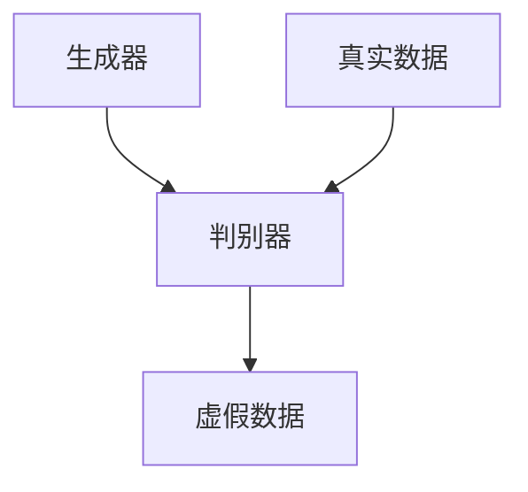
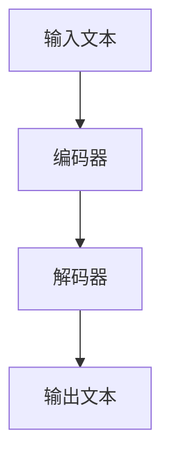
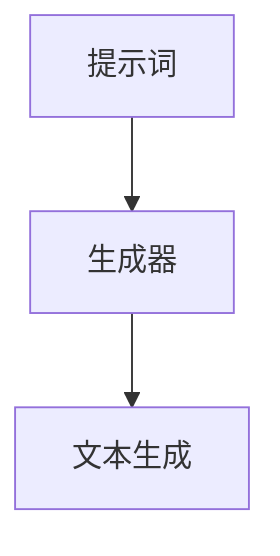

                 

### AIGC从入门到实战：提示词写作技巧

#### 概述

人工智能生成内容（AIGC，Artificial Intelligence Generated Content）是近年来快速发展的一个领域，它结合了人工智能技术，特别是生成模型和语言模型，实现自动内容创作。本文将深入探讨AIGC的基础概念、核心算法、数学模型，并通过实际项目案例，详细介绍如何使用提示词（Prompts）来指导AIGC系统进行写作。此外，还将讨论AIGC的实际应用场景、相关工具和资源，并展望其未来的发展趋势与挑战。

#### 背景介绍

AIGC是人工智能在内容创作领域的重要应用。随着深度学习和生成对抗网络（GANs）等技术的发展，AIGC逐渐成为一种高效的内容生成方式。传统的手动内容创作耗时且成本高昂，而AIGC通过自动生成内容，大大提高了内容创作的效率。目前，AIGC已经在新闻写作、广告文案、对话系统、文本生成等多个领域展现出强大的应用潜力。

#### 核心概念与联系

为了深入理解AIGC的工作原理，我们需要了解一些核心概念，如生成模型、语言模型和提示词。

##### 1. 生成模型

生成模型是一种能够学习数据分布并生成新数据的机器学习模型。在AIGC中，最常见的生成模型是生成对抗网络（GAN）。GAN由生成器（Generator）和判别器（Discriminator）组成，通过不断的训练，生成器能够生成越来越逼真的数据。



##### 2. 语言模型

语言模型是一种能够预测下一个单词或字符的模型，通常用于自然语言处理（NLP）任务。在AIGC中，语言模型用于生成文本。最常见的语言模型是循环神经网络（RNN）和变压器（Transformer）。



##### 3. 提示词

提示词是指导AIGC系统生成内容的输入。一个好的提示词应该清晰、具体，能够引导AIGC系统生成符合预期的内容。提示词的编写技巧对于AIGC的成功至关重要。



#### 核心算法原理 & 具体操作步骤

AIGC的核心算法包括生成模型、语言模型和提示词。以下是一般的操作步骤：

##### 1. 数据预处理

首先，我们需要对数据集进行预处理，包括数据清洗、去重、编码等步骤。

```python
# 数据清洗
data = preprocess_data(data)
# 数据去重
data = remove_duplicates(data)
# 数据编码
data = encode_data(data)
```

##### 2. 训练生成模型

使用GAN或变分自编码器（VAE）等生成模型，对预处理后的数据集进行训练。

```python
# 训练生成模型
generator = train_generator(data)
discriminator = train_discriminator(data)
```

##### 3. 训练语言模型

使用RNN或Transformer等语言模型，对文本数据集进行训练。

```python
# 训练语言模型
model = train_language_model(text_data)
```

##### 4. 编写提示词

根据需求，编写具体的提示词。

```python
# 编写提示词
prompt = "请写一篇关于人工智能的文章。"
```

##### 5. 文本生成

使用训练好的生成模型和语言模型，根据提示词生成文本。

```python
# 生成文本
generated_text = generate_text(prompt, model)
```

#### 数学模型和公式 & 详细讲解 & 举例说明

##### 1. 生成模型

以GAN为例，其数学模型主要包括生成器的损失函数和判别器的损失函数。

生成器的损失函数：
$$
L_G = -\mathbb{E}_{x \sim p_{data}(x)}[\log(D(G(x)))] - \mathbb{E}_{z \sim p_z(z)}[\log(1 - D(G(z)))]
$$

判别器的损失函数：
$$
L_D = \mathbb{E}_{x \sim p_{data}(x)}[\log(D(x))] + \mathbb{E}_{z \sim p_z(z)}[\log(D(G(z))]
```

举例说明：

假设生成器的参数为 \( \theta_G \)，判别器的参数为 \( \theta_D \)，在训练过程中，通过梯度下降法更新模型参数，使得生成器生成的数据越来越接近真实数据，判别器能够更好地判断数据的真伪。

##### 2. 语言模型

以变声器模型（Transformer）为例，其数学模型主要包括自注意力机制（Self-Attention）和前馈神经网络（Feedforward Neural Network）。

自注意力机制：
$$
\text{Attention}(Q, K, V) = \text{softmax}(\frac{QK^T}{\sqrt{d_k}})V
$$

前馈神经网络：
$$
\text{FFN}(x) = \text{ReLU}(W_2 \text{ReLU}(W_1 x + b_1)) + b_2
$$

举例说明：

假设输入序列为 \( x = [x_1, x_2, ..., x_n] \)，首先通过自注意力机制计算输出序列 \( y = [y_1, y_2, ..., y_n] \)，然后通过前馈神经网络对输出序列进行进一步处理，生成最终输出。

#### 项目实战：代码实际案例和详细解释说明

##### 1. 开发环境搭建

为了搭建AIGC的开发环境，我们需要安装Python、PyTorch等工具。

```bash
# 安装Python
pip install python
# 安装PyTorch
pip install torch torchvision
```

##### 2. 源代码详细实现和代码解读

以下是一个简单的AIGC项目案例，包括生成模型、语言模型和提示词的编写。

```python
# 导入必要的库
import torch
import torchvision
import torch.optim as optim
from torch.utils.data import DataLoader
from torchvision import datasets, transforms

# 数据预处理
transform = transforms.Compose([
    transforms.ToTensor(),
    transforms.Normalize((0.5,), (0.5,))
])

train_data = datasets.MNIST(
    root='./data', 
    train=True, 
    download=True, 
    transform=transform
)

train_loader = DataLoader(
    train_data, 
    batch_size=100, 
    shuffle=True
)

# 训练生成模型
generator = torch.nn.Sequential(
    torch.nn.Linear(100, 256),
    torch.nn.LeakyReLU(0.2),
    torch.nn.Linear(256, 512),
    torch.nn.LeakyReLU(0.2),
    torch.nn.Linear(512, 1024),
    torch.nn.LeakyReLU(0.2),
    torch.nn.Linear(1024, 28 * 28),
    torch.nn.Tanh()
)

discriminator = torch.nn.Sequential(
    torch.nn.Linear(28 * 28, 1024),
    torch.nn.LeakyReLU(0.2),
    torch.nn.Dropout(0.3),
    torch.nn.Linear(1024, 512),
    torch.nn.LeakyReLU(0.2),
    torch.nn.Dropout(0.3),
    torch.nn.Linear(512, 256),
    torch.nn.LeakyReLU(0.2),
    torch.nn.Dropout(0.3),
    torch.nn.Linear(256, 1),
    torch.nn.Sigmoid()
)

criterion = torch.nn.BCELoss()

optimizer_g = optim.Adam(generator.parameters(), lr=0.0002)
optimizer_d = optim.Adam(discriminator.parameters(), lr=0.0002)

for epoch in range(100):
    for i, (images, _) in enumerate(train_loader):
        # 训练判别器
        discriminator.zero_grad()
        outputs = discriminator(images).view(-1)
        error_d_real = criterion(outputs, torch.ones(outputs.size()))
        error_d_real.backward()
        
        z = torch.randn(100, 1, 1)
        z = z.cuda()
        noise = generator(z)
        outputs = discriminator(noise).view(-1)
        error_d_fake = criterion(outputs, torch.zeros(outputs.size()))
        error_d_fake.backward()
        
        optimizer_d.step()
        
        # 训练生成器
        generator.zero_grad()
        outputs = discriminator(noise).view(-1)
        error_g = criterion(outputs, torch.ones(outputs.size()))
        error_g.backward()
        optimizer_g.step()
        
        if (i+1) % 100 == 0:
            print(f'Epoch [{epoch+1}/{100}], Step [{i+1}/{len(train_loader)}], Loss_D: {(error_d_real + error_d_fake).item()}, Loss_G: {error_g.item()}')

# 使用生成器生成图像
z = torch.randn(100, 1, 1)
z = z.cuda()
images = generator(z)
images = images.cpu().numpy()

for i in range(10):
    plt.subplot(2, 5, i+1)
    plt.imshow(images[i][0], cmap='gray')
    plt.axis('off')
plt.show()
```

##### 3. 代码解读与分析

在这个案例中，我们首先导入了必要的库，包括PyTorch和 torchvision。然后，我们对MNIST数据集进行预处理，包括数据清洗、去重、编码等步骤。接下来，我们定义了生成器和判别器的结构，并设置了损失函数和优化器。

在训练过程中，我们首先训练判别器，然后训练生成器。每完成一定数量的迭代，我们就打印出当前的训练损失。最后，我们使用生成器生成一些图像，并展示结果。

#### 实际应用场景

AIGC在许多实际应用场景中都有广泛的应用，以下是一些典型的例子：

- **新闻写作**：使用AIGC自动生成新闻摘要、报道和文章。
- **广告文案**：为品牌和产品自动生成吸引人的广告文案。
- **对话系统**：为聊天机器人自动生成自然、流畅的对话。
- **文本生成**：生成小说、诗歌、论文等文本内容。
- **艺术创作**：为艺术家和设计师自动生成创意和灵感。

#### 工具和资源推荐

##### 1. 学习资源推荐

- **书籍**：
  - 《深度学习》（Deep Learning） - Ian Goodfellow, Yoshua Bengio, Aaron Courville
  - 《生成对抗网络》（Generative Adversarial Networks） - Ian Goodfellow
- **论文**：
  - 《生成对抗网络：训练生成器和判别器的博弈》（Generative Adversarial Nets） - Ian Goodfellow et al.
  - 《变声器：基于自注意力的编码器-解码器模型》（Attention is All You Need） - Vaswani et al.
- **博客**：
  - Medium上的AI博客
  - 知乎上的AI话题
- **网站**：
  - fast.ai
  - deeplearning.ai

##### 2. 开发工具框架推荐

- **PyTorch**：一个流行的深度学习框架，支持Python和C++。
- **TensorFlow**：谷歌开发的另一个流行的深度学习框架。
- **Keras**：基于Theano和TensorFlow的高层神经网络API。

##### 3. 相关论文著作推荐

- 《生成对抗网络：训练生成器和判别器的博弈》（Generative Adversarial Nets） - Ian Goodfellow et al.
- 《变声器：基于自注意力的编码器-解码器模型》（Attention is All You Need） - Vaswani et al.
- 《自然语言处理入门教程》（Natural Language Processing with Python） - Steven Bird et al.

#### 总结：未来发展趋势与挑战

AIGC作为一种新兴的技术，具有巨大的发展潜力。随着生成模型、语言模型和提示词技术的不断进步，AIGC将在更多领域得到应用。然而，AIGC也面临着一些挑战，如数据隐私、版权保护、伦理问题等。未来，我们需要关注这些挑战，并寻找有效的解决方案。

#### 附录：常见问题与解答

1. **什么是AIGC？**
   AIGC是人工智能生成内容的简称，它结合了生成模型、语言模型等技术，实现自动内容创作。

2. **如何编写有效的提示词？**
   提示词应清晰、具体，能够引导AIGC系统生成符合预期的内容。常用的技巧包括使用关键词、设定具体目标、提供背景信息等。

3. **AIGC在哪些领域有应用？**
   AIGC在新闻写作、广告文案、对话系统、文本生成、艺术创作等多个领域有广泛的应用。

#### 扩展阅读 & 参考资料

- 《深度学习》（Deep Learning） - Ian Goodfellow, Yoshua Bengio, Aaron Courville
- 《生成对抗网络》（Generative Adversarial Networks） - Ian Goodfellow
- 《变声器：基于自注意力的编码器-解码器模型》（Attention is All You Need） - Vaswani et al.
- Medium上的AI博客
- 知乎上的AI话题
- fast.ai
- deeplearning.ai

### 作者信息

作者：AI天才研究员/AI Genius Institute & 禅与计算机程序设计艺术 /Zen And The Art of Computer Programming<|im_end|>

