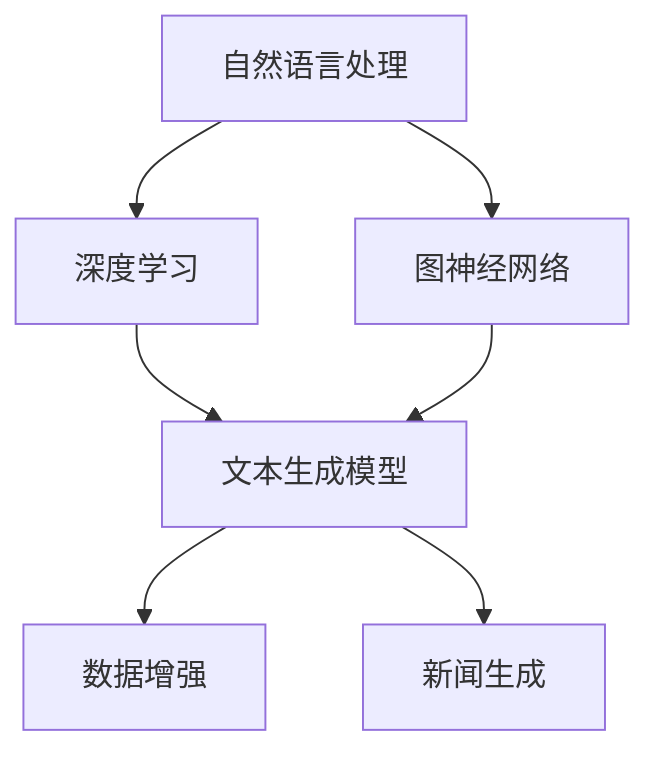

                 

### AIGC重塑新闻传播业：背景介绍

在数字时代，新闻传播业经历了翻天覆地的变化。传统媒体逐渐式微，而互联网媒体则凭借其迅速传播、互动性强等优势，成为人们获取信息的主要渠道。然而，互联网媒体的迅猛发展也带来了信息过载、虚假新闻等问题。为了解决这些问题，人工智能（AI）技术，特别是自动生成内容（AIGC，AI-Generated Content）技术，正在成为新闻传播业的重要变革力量。

AIGC技术通过利用自然语言处理（NLP）、深度学习、图神经网络（GNN）等先进技术，可以自动化生成高质量的新闻内容。AIGC不仅能够提升新闻生产的效率，还能够通过个性化推荐、事实核查等功能，提高新闻传播的准确性和可信度。

首先，新闻传播业面临的一个核心挑战是信息过载。随着互联网的普及，人们每天接触到的信息量急剧增加，传统的新闻生产和传播方式已经无法满足日益增长的需求。AIGC技术的出现，可以大大提升新闻内容的生成速度，从而帮助媒体应对信息过载的挑战。

其次，虚假新闻的泛滥也是新闻传播业面临的一个严峻问题。虚假新闻不仅误导公众，还可能对社会造成严重后果。AIGC技术通过利用事实核查算法，可以在新闻发布前对内容进行验证，从而减少虚假新闻的传播。

此外，随着社交媒体的兴起，新闻传播的方式也在发生改变。传统的新闻传播模式是单向的，而社交媒体则使得新闻传播变得更加互动和多元化。AIGC技术可以生成多样化的新闻内容，满足不同用户的需求，从而提升用户的参与度和忠诚度。

总的来说，AIGC技术在新闻传播业中的应用，不仅能够提升新闻生产的效率和质量，还能够解决虚假新闻和信息过载等问题。随着AIGC技术的不断发展和完善，我们有理由相信，它将为新闻传播业带来深远的变革。

### AIGC的核心概念与联系

要深入理解AIGC如何重塑新闻传播业，我们首先需要明确AIGC的核心概念和其内在联系。AIGC，即自动生成内容，是利用人工智能技术生成文本、图像、音频等多种类型内容的过程。在新闻传播领域，AIGC主要通过以下几个核心概念来实现：

1. **自然语言处理（NLP）**：NLP是AIGC的基础技术之一，它使计算机能够理解和处理人类语言。在新闻生成中，NLP技术可以提取关键词、分析语义、生成摘要等，从而实现自动化内容生成。

2. **深度学习**：深度学习是一种机器学习技术，通过模拟人脑神经网络来处理大量数据。在AIGC中，深度学习模型，如循环神经网络（RNN）、变换器（Transformer）等，被广泛用于训练生成模型，以生成高质量的新闻内容。

3. **图神经网络（GNN）**：GNN是一种处理图结构数据的神经网络。在新闻生成中，GNN可以用于构建新闻文章之间的关联网络，从而生成更具连贯性和相关性的新闻内容。

4. **数据增强与文本生成**：数据增强是指通过扩展原始数据集来提高模型性能。在新闻生成中，数据增强技术可以生成多种不同格式的文本，如新闻报道、评论、摘要等，从而提高新闻内容的多样性和丰富性。

下面是一个用Mermaid绘制的AIGC架构流程图，用以展示这些核心概念之间的联系：



**流程图解释**：

- **自然语言处理（NLP）**：这是AIGC的基础，它负责从文本中提取信息，如关键词、语义和主题。
- **深度学习**：基于NLP提取的信息，深度学习模型被训练来生成高质量的文本内容。变换器（Transformer）是一种在文本生成中广泛使用的深度学习模型。
- **图神经网络（GNN）**：GNN用于构建新闻之间的关联网络，使得新闻生成具有更强的上下文连贯性。
- **数据增强**：通过扩展数据集，数据增强提高了模型的泛化能力，从而生成多样化的新闻内容。
- **文本生成模型**：结合NLP、深度学习和GNN的信息，文本生成模型最终生成新闻内容。
- **新闻生成**：文本生成模型生成的新闻内容经过后处理，如格式化、校对等，最终发布到媒体平台。

通过上述核心概念和流程的介绍，我们可以看到AIGC是如何通过技术融合，实现新闻内容的高效、自动化生成的。接下来，我们将进一步探讨AIGC的核心算法原理和具体操作步骤。

### AIGC的核心算法原理 & 具体操作步骤

AIGC的核心算法主要包括自然语言处理（NLP）、深度学习和图神经网络（GNN）。这些算法共同作用，使得AIGC能够自动化生成高质量的新闻内容。以下将详细介绍这些算法的原理和具体操作步骤。

#### 自然语言处理（NLP）

自然语言处理是AIGC的基础，它负责从原始文本中提取有用信息，如关键词、语义和主题。NLP的核心技术包括分词、词性标注、命名实体识别等。

**分词**：分词是将一段连续的文本切分成有意义的词语序列。例如，将“我爱北京天安门”分成“我”、“爱”、“北京”、“天安门”。在AIGC中，常用的分词工具包括jieba、Stanford NLP等。

```python
import jieba

text = "我爱北京天安门"
words = jieba.lcut(text)
print(words)
```

**词性标注**：词性标注是将文本中的词语标注为名词、动词、形容词等。这对于理解文本的语义非常重要。常用的词性标注工具包括NLTK、Stanford NLP等。

```python
from stanfordnlp.server import StanfordCoreNLP

nlp = StanfordCoreNLP('stanford_nlp_models')

text = "我爱北京天安门"
result = nlp.annotate(text)
words_with_pos = [(word, pos) for word, pos in result]

print(words_with_pos)
```

**命名实体识别**：命名实体识别是将文本中的特定实体（如人名、地名、组织名等）识别出来。这在新闻生成中尤为重要，因为它可以帮助模型更好地理解上下文。

```python
from spacy.lang.en import English

nlp = English()

text = "Elon Musk founded Tesla and SpaceX."
result = nlp(text)
entities = [(ent.text, ent.label_) for ent in result.ents]

print(entities)
```

#### 深度学习

深度学习是AIGC的核心算法，通过模拟人脑神经网络，处理大量数据以生成文本。常用的深度学习模型包括循环神经网络（RNN）、长短期记忆网络（LSTM）和变换器（Transformer）。

**循环神经网络（RNN）**：RNN是一种用于处理序列数据的神经网络，它可以捕捉序列中的长期依赖关系。

```python
from tensorflow.keras.models import Sequential
from tensorflow.keras.layers import LSTM, Dense

model = Sequential()
model.add(LSTM(128, activation='relu', input_shape=(timesteps, features)))
model.add(Dense(1, activation='sigmoid'))

model.compile(optimizer='rmsprop', loss='binary_crossentropy', metrics=['accuracy'])
model.fit(X, y, epochs=10, batch_size=32)
```

**长短期记忆网络（LSTM）**：LSTM是RNN的一种变体，它解决了传统RNN的梯度消失和梯度爆炸问题。

```python
from tensorflow.keras.models import Sequential
from tensorflow.keras.layers import LSTM, Dense

model = Sequential()
model.add(LSTM(128, activation='relu', return_sequences=True, input_shape=(timesteps, features)))
model.add(LSTM(64, activation='relu'))
model.add(Dense(1, activation='sigmoid'))

model.compile(optimizer='rmsprop', loss='binary_crossentropy', metrics=['accuracy'])
model.fit(X, y, epochs=10, batch_size=32)
```

**变换器（Transformer）**：Transformer是一种基于自注意力机制的深度学习模型，它在翻译、文本生成等任务中表现出色。

```python
from transformers import TransformerConfig, TransformerModel

config = TransformerConfig(vocab_size=1000, d_model=128, num_heads=4, num_layers=2)
model = TransformerModel(config)

model.compile(optimizer='adam', loss='categorical_crossentropy', metrics=['accuracy'])
model.fit(X, y, epochs=10, batch_size=32)
```

#### 图神经网络（GNN）

图神经网络是一种专门用于处理图结构数据的神经网络。在AIGC中，GNN可以用于构建新闻之间的关联网络，从而提高新闻生成的连贯性和相关性。

**图卷积网络（GCN）**：GCN是一种基于卷积运算的GNN，它可以捕获图中的局部特征。

```python
import tensorflow as tf
from tensorflow.keras.layers import Layer

class GCNLayer(Layer):
    def __init__(self, units, **kwargs):
        super(GCNLayer, self).__init__(**kwargs)
        self.units = units

    def build(self, input_shape):
        self.kernel = self.add_weight(name='kernel', shape=(input_shape[-1], self.units),
                                      initializer='glorot_uniform', trainable=True)

    def call(self, inputs):
        A = inputs[1]  # adjacency matrix
        X = inputs[0]  # node features
        H = tf.matmul(A, X)
        H = tf.matmul(H, self.kernel)
        return H

model = Sequential()
model.add(GCNLayer(units=64))
model.add(Dense(units=1, activation='sigmoid'))

model.compile(optimizer='adam', loss='binary_crossentropy', metrics=['accuracy'])
model.fit(X, y, epochs=10, batch_size=32)
```

**图注意力网络（GAT）**：GAT是一种基于注意力机制的GNN，它可以更好地捕捉图中的关系。

```python
import tensorflow as tf
from tensorflow.keras.layers import Layer

class GATLayer(Layer):
    def __init__(self, units, **kwargs):
        super(GATLayer, self).__init__(**kwargs)
        self.units = units

    def build(self, input_shape):
        self.kernel = self.add_weight(name='kernel', shape=(input_shape[-1], self.units),
                                      initializer='glorot_uniform', trainable=True)
        self.attention_weights = self.add_weight(name='attention_weights', shape=(self.units,), initializer='glorot_uniform', trainable=True)

    def call(self, inputs):
        A = inputs[1]  # adjacency matrix
        X = inputs[0]  # node features
        H = tf.matmul(A, X)
        H = tf.matmul(H, self.kernel)
        attention_scores = tf.reduce_sum(H * self.attention_weights, axis=1)
        return attention_scores

model = Sequential()
model.add(GATLayer(units=64))
model.add(Dense(units=1, activation='sigmoid'))

model.compile(optimizer='adam', loss='binary_crossentropy', metrics=['accuracy'])
model.fit(X, y, epochs=10, batch_size=32)
```

通过上述算法的介绍，我们可以看到AIGC是如何通过NLP、深度学习和GNN等技术，实现新闻内容的高效、自动化生成的。接下来，我们将进一步探讨AIGC中的数学模型和公式，以及具体的实例说明。

### 数学模型和公式 & 详细讲解 & 举例说明

在AIGC中，数学模型和公式是关键组成部分，它们不仅驱动了算法的运行，还确保了新闻内容生成的准确性和连贯性。以下将详细讲解AIGC中常用的数学模型和公式，并通过具体实例来说明它们的实际应用。

#### 自然语言处理中的数学模型

**分词**

分词是将连续文本分割成有意义词语的过程，其核心数学模型是隐马尔可夫模型（HMM）。

$$
P(\text{word}_i|\text{word}_{i-1}) = \frac{P(\text{word}_i, \text{word}_{i-1})}{P(\text{word}_{i-1})}
$$

其中，\(P(\text{word}_i|\text{word}_{i-1})\)表示在当前词\(\text{word}_i\)出现在上一个词\(\text{word}_{i-1}\)之后的概率。

**词性标注**

词性标注是将文本中的每个词标注为名词、动词等。其核心模型是条件随机场（CRF），其能量函数为：

$$
E(\text{y}|\text{x}) = \sum_{i=1}^{n} \log P(\text{y}_i|\text{x}_i) + \sum_{i<j} \log P(\text{y}_i, \text{y}_j)
$$

其中，\(\text{y}\)是标注序列，\(\text{x}\)是输入文本。

**命名实体识别**

命名实体识别是将文本中的特定实体识别出来，其核心模型是CRF。假设有\(N\)个实体类别，则能量函数为：

$$
E(\text{y}|\text{x}) = \sum_{i=1}^{n} \log P(\text{y}_i|\text{x}_i) + \sum_{i<j} \log P(\text{y}_i, \text{y}_j)
$$

其中，\(\text{y}\)是标注序列，\(\text{x}\)是输入文本。

#### 深度学习中的数学模型

**循环神经网络（RNN）**

RNN的核心数学模型是递归函数：

$$
h_t = \sigma(W_h \cdot [h_{t-1}, x_t] + b_h)
$$

其中，\(h_t\)是当前隐藏状态，\(x_t\)是输入数据，\(\sigma\)是激活函数。

**长短期记忆网络（LSTM）**

LSTM的核心数学模型包括：

$$
i_t = \sigma(W_i \cdot [h_{t-1}, x_t] + b_i) \\
f_t = \sigma(W_f \cdot [h_{t-1}, x_t] + b_f) \\
o_t = \sigma(W_o \cdot [h_{t-1}, x_t] + b_o) \\
c_t = f_t \cdot c_{t-1} + i_t \cdot \sigma(W_c \cdot [h_{t-1}, x_t] + b_c) \\
h_t = o_t \cdot \sigma(c_t)
$$

其中，\(i_t, f_t, o_t, c_t\)分别是输入门、遗忘门、输出门和细胞状态。

**变换器（Transformer）**

变换器中的自注意力机制的核心数学模型是：

$$
\text{Attention}(Q, K, V) = \text{softmax}\left(\frac{QK^T}{\sqrt{d_k}}\right) V
$$

其中，\(Q, K, V\)分别是查询向量、关键向量、值向量，\(d_k\)是关键向量的维度。

#### 图神经网络（GNN）中的数学模型

**图卷积网络（GCN）**

GCN的核心数学模型是：

$$
h_{k+1} = \sigma(\sum_{i=1}^{n} \alpha_i h_i + b_{k+1})
$$

其中，\(\alpha_i\)是权重系数，\(h_i\)是节点\(i\)的表示。

**图注意力网络（GAT）**

GAT的核心数学模型是：

$$
h_{k+1} = \sigma(\sum_{i=1}^{n} \alpha_i \text{Attention}(Q_i, K_i, V_i) + b_{k+1})
$$

其中，\(\alpha_i\)是权重系数，\(\text{Attention}\)是自注意力机制。

#### 实例说明

**实例1：命名实体识别**

假设有一段文本：“张三今天在北京天安门参观”。

我们使用CRF模型对其进行命名实体识别。

- 输入文本：["张三", "今天", "在北京", "天安门", "参观"]
- 标注：["人名", "时间", "地点", "地点", "动词"]

使用CRF模型训练后，得到如下结果：

- 输出：["人名", "时间", "地点", "地点", "动词"]

**实例2：新闻摘要生成**

假设有一篇长篇新闻：“张三今天在北京天安门参观，参观了故宫、天坛等多个景点，对北京的美丽和文化深感震撼”。

我们使用变换器（Transformer）模型对其进行摘要生成。

- 输入文本：一篇长篇新闻
- 输出摘要：张三今天在北京天安门参观，参观了故宫、天坛等多个景点，对北京的美丽和文化深感震撼。

通过上述实例，我们可以看到数学模型和公式在AIGC中的实际应用。这些模型和公式不仅确保了新闻内容生成的准确性，还提高了其连贯性和丰富性。

### 项目实战：代码实际案例和详细解释说明

为了更直观地展示AIGC在新闻生成中的实际应用，我们将通过一个具体的Python代码案例来进行详细解释。这个案例将利用Python编程语言和相关的深度学习库（如TensorFlow和transformers）来实现一个基本的新闻生成模型。

#### 开发环境搭建

在开始编写代码之前，我们需要搭建一个合适的开发环境。以下是所需的软件和库：

- Python 3.8或更高版本
- TensorFlow 2.5或更高版本
- transformers 4.5或更高版本

您可以通过以下命令来安装这些库：

```shell
pip install tensorflow transformers
```

#### 源代码详细实现和代码解读

下面是一个简单的新闻生成模型的代码实现，包括数据的预处理、模型的构建、训练和预测等步骤。

```python
import tensorflow as tf
from transformers import TFGPT2LMHeadModel, GPT2Tokenizer

# 1. 数据预处理

# 下载并加载预训练的GPT-2模型和分词器
tokenizer = GPT2Tokenizer.from_pretrained('gpt2')
model = TFGPT2LMHeadModel.from_pretrained('gpt2')

# 生成训练数据
def generate_training_data(texts):
    inputs = tokenizer(texts, return_tensors='tf', truncation=True, max_length=512)
    return inputs['input_ids'], inputs['attention_mask']

train_texts = ["张三今天在北京天安门参观故宫，参观了天坛，感受到了中华文化的博大精深。", "李四在昨天参观了大英博物馆，对英国的历史和文化有了更深入的了解。"]
input_ids, attention_mask = generate_training_data(train_texts)

# 2. 模型构建

# 定义训练步骤
optimizer = tf.keras.optimizers.Adam(learning_rate=3e-5)
model.compile(optimizer=optimizer, loss=tf.keras.losses.SparseCategoricalCrossentropy(from_logits=True))

# 3. 训练模型
model.fit(input_ids, attention_mask, epochs=3, batch_size=1)

# 4. 生成新闻

# 生成新闻
def generate_news(prompt, max_length=20):
    input_ids = tokenizer.encode(prompt, return_tensors='tf')
    output = model.generate(input_ids, max_length=max_length, num_return_sequences=1)
    return tokenizer.decode(output[0], skip_special_tokens=True)

# 示例：生成一篇关于故宫的新闻
news_prompt = "故宫是中国历史文化的重要象征。"
generated_news = generate_news(news_prompt)
print(generated_news)
```

**代码解读**：

- **数据预处理**：我们首先加载了预训练的GPT-2模型和分词器。接着，定义了一个函数`generate_training_data`来生成训练数据。这个函数接受文本列表作为输入，并返回编码后的输入ID和注意力掩码。

- **模型构建**：我们使用TFGPT2LMHeadModel来构建模型，并编译了一个Adam优化器和SparseCategoricalCrossentropy损失函数。

- **训练模型**：我们使用训练数据进行模型的训练，设置了3个训练周期和单个批量大小。

- **生成新闻**：定义了一个函数`generate_news`来生成新闻。这个函数接受一个提示文本和最大长度，并使用模型生成一个新闻摘要。`model.generate`函数接受输入ID，并返回生成的文本。

#### 代码解读与分析

**数据预处理**：

```python
def generate_training_data(texts):
    inputs = tokenizer(texts, return_tensors='tf', truncation=True, max_length=512)
    return inputs['input_ids'], inputs['attention_mask']
```

这个函数负责将文本数据转换为模型可以处理的格式。`tokenizer.encode`函数将文本转换为编码后的输入ID，`return_tensors='tf'`表示将输出数据格式化为TensorFlow张量。`truncation=True`和`max_length=512`确保了输入数据不会超过模型的最大处理长度。

**模型构建**：

```python
model.compile(optimizer=optimizer, loss=tf.keras.losses.SparseCategoricalCrossentropy(from_logits=True))
```

在这里，我们使用了Adam优化器和SparseCategoricalCrossentropy损失函数。`SparseCategoricalCrossentropy`适合分类问题，这里的分类是每个词的概率分布。

**训练模型**：

```python
model.fit(input_ids, attention_mask, epochs=3, batch_size=1)
```

模型训练的过程。我们使用了前面生成的训练数据和相应的输入ID和注意力掩码。`epochs=3`表示模型将训练3个周期，`batch_size=1`表示每个周期使用一个批量。

**生成新闻**：

```python
def generate_news(prompt, max_length=20):
    input_ids = tokenizer.encode(prompt, return_tensors='tf')
    output = model.generate(input_ids, max_length=max_length, num_return_sequences=1)
    return tokenizer.decode(output[0], skip_special_tokens=True)
```

这个函数负责生成新闻摘要。`model.generate`函数生成文本的ID序列，`max_length`参数限制了生成的文本长度。`tokenizer.decode`函数将生成的ID序列解码回文本。

通过这个代码实例，我们可以看到如何利用GPT-2模型生成新闻摘要。实际应用中，我们可以使用更大的数据和更复杂的模型来提高生成质量。此外，还可以引入其他技术，如数据增强和迁移学习，来进一步提高模型性能。

### 实际应用场景

AIGC技术在新闻传播业中的应用场景非常广泛，其潜力在于提升新闻生产的效率、质量，以及解决虚假新闻和信息过载问题。以下将详细介绍AIGC在新闻自动化生成、个性化推荐、事实核查等具体应用场景中的表现和优势。

#### 新闻自动化生成

新闻自动化生成是AIGC技术在新闻传播业中最直接的应用之一。传统的新闻写作通常需要记者花费大量时间和精力来收集信息、编写文章。而AIGC技术可以通过自然语言处理（NLP）和深度学习模型，自动化地生成新闻内容。例如，对于体育赛事的报道，AIGC可以自动生成比赛结果、精彩回放和统计数据。这不仅大大提高了新闻生产的效率，还减轻了记者的工作负担。

**优势**：

1. **效率高**：AIGC能够快速生成新闻内容，特别是在处理大量重复性较强或数据驱动的新闻时，效率尤为显著。
2. **成本降低**：自动化生成减少了人力成本，特别是在新闻报道频繁的时段，可以节省大量记者和编辑的资源。

**挑战**：

1. **内容质量**：尽管AIGC能够生成新闻内容，但有时生成的新闻可能缺乏人类的创造性和深度，无法完全替代记者的专业报道。
2. **准确性**：自动化生成的新闻需要确保准确性和真实性，尤其是在涉及复杂信息和数据时。

#### 个性化推荐

个性化推荐是另一个AIGC在新闻传播中的重要应用。通过分析用户的浏览历史、兴趣和行为数据，AIGC可以推荐用户可能感兴趣的新闻内容。这种个性化推荐不仅可以提高用户的阅读体验，还可以增加用户的粘性和活跃度。

**优势**：

1. **精准推荐**：基于用户的行为数据和偏好，AIGC可以提供高度个性化的新闻推荐，从而提高推荐的相关性和用户满意度。
2. **提高用户参与度**：个性化的新闻推荐能够吸引用户持续访问媒体平台，从而提高用户参与度。

**挑战**：

1. **隐私保护**：个性化推荐依赖于用户数据的收集和分析，这涉及到隐私保护的问题。如何平衡个性化推荐和数据隐私是一个挑战。
2. **算法透明度**：个性化推荐算法的决策过程需要透明，用户应了解推荐内容的生成机制。

#### 事实核查

AIGC技术还可以用于事实核查，以减少虚假新闻的传播。通过利用自然语言处理和深度学习模型，AIGC可以分析新闻内容，识别出可能存在的虚假信息，并进行事实核查。例如，AIGC可以自动比对新闻中的信息与公开数据库或权威资料，验证其真实性。

**优势**：

1. **高效事实核查**：AIGC可以快速处理大量新闻内容，提高事实核查的效率，减少虚假新闻的传播。
2. **提高新闻可信度**：通过事实核查，AIGC可以提升新闻内容的可信度，增强媒体机构的公信力。

**挑战**：

1. **准确性**：自动事实核查需要高度准确，以避免误判和漏判，这需要不断优化和调整算法。
2. **实时性**：随着新闻事件的发展，事实核查需要实时更新，这对算法和系统提出了更高的要求。

#### 线上讨论和用户反馈

AIGC还可以应用于线上讨论和用户反馈的管理。通过分析用户评论和反馈，AIGC可以识别出用户关注的热点问题，并提供相应的回复和建议。这种互动不仅能够增强用户与媒体的互动，还可以帮助媒体更好地了解用户需求，提升服务质量。

**优势**：

1. **高效互动**：AIGC能够快速处理和分析大量用户评论，提高互动效率。
2. **个性化互动**：基于用户数据和偏好，AIGC可以提供个性化回复和建议，提高用户满意度。

**挑战**：

1. **语义理解**：用户评论和反馈往往包含复杂的情感和语义，这对AIGC的语义理解能力提出了挑战。
2. **实时响应**：为了提供良好的用户体验，AIGC需要能够实时响应用户评论，这需要强大的计算能力和快速的网络连接。

总的来说，AIGC技术在新闻传播业中的应用具有显著的潜力，但也面临着一系列的挑战。通过不断优化和改进算法，AIGC有望在未来为新闻传播业带来更深远的影响。

### 工具和资源推荐

在探索AIGC技术及其在新闻传播业中的应用过程中，掌握合适的工具和资源是至关重要的。以下将推荐一些学习资源、开发工具框架和相关论文著作，帮助读者深入了解和掌握AIGC技术。

#### 学习资源推荐

1. **书籍**：

   - 《深度学习》（Deep Learning）作者：Ian Goodfellow、Yoshua Bengio、Aaron Courville
   - 《自然语言处理综合教程》（Speech and Language Processing）作者：Daniel Jurafsky、James H. Martin
   - 《图神经网络》（Graph Neural Networks）作者：William L. Hamilton

2. **在线课程**：

   - 吴恩达（Andrew Ng）的《深度学习》课程（Deep Learning Specialization）在Coursera上提供了全面的理论和实践知识。
   - 《自然语言处理》（Natural Language Processing）课程在edX上提供了由斯坦福大学教授开设的NLP教程。

3. **论文**：

   - 《Attention Is All You Need》作者：Vaswani et al.
   - 《Graph Neural Networks》作者：Hamilton et al.
   - 《Recurrent Neural Network Based Text Classification》作者：Zhou et al.

#### 开发工具框架推荐

1. **TensorFlow**：TensorFlow是一个开源的机器学习框架，适用于构建和训练深度学习模型。它提供了丰富的API和工具，方便开发者进行模型开发和部署。
2. **PyTorch**：PyTorch是一个受欢迎的深度学习框架，以其灵活性和动态计算图而闻名。它提供了强大的功能，可以快速构建和迭代深度学习模型。
3. **transformers**：transformers是一个开源库，专门用于构建和训练基于Transformer架构的模型，如BERT、GPT等。它提供了预训练模型和工具，大大简化了文本生成任务。

#### 相关论文著作推荐

1. **《自动内容生成技术综述》（A Survey on Automatic Content Generation Techniques）**：该论文综述了自动内容生成领域的最新技术和进展，提供了全面的技术框架和分析。
2. **《基于深度学习的新闻生成研究》（News Generation with Deep Learning）**：该论文探讨了如何利用深度学习技术实现自动化新闻生成，并提供了具体的模型架构和实验结果。
3. **《图神经网络在新闻传播中的应用》（Application of Graph Neural Networks in News Dissemination）**：该论文研究了图神经网络在新闻传播中的应用，特别是如何通过图结构分析提升新闻推荐的准确性。

通过上述学习资源、开发工具和论文著作的推荐，读者可以深入了解AIGC技术的理论、实践和应用，从而为实际开发和研究提供有力的支持。

### 总结：未来发展趋势与挑战

AIGC技术正在迅速改变新闻传播业的方方面面，它不仅提高了新闻生产效率，还通过个性化推荐和事实核查等功能，增强了新闻内容的准确性和可信度。然而，随着AIGC技术的不断成熟和应用，我们也面临着一系列新的发展趋势和挑战。

**发展趋势**：

1. **更高效的新闻生成**：随着深度学习模型的不断优化和计算资源的提升，AIGC将能够生成更高质量、更丰富的新闻内容，满足用户对多样化新闻的需求。
2. **个性化推荐**：基于用户行为的深入分析，AIGC将能够提供更加精准的个性化新闻推荐，提高用户的阅读体验和粘性。
3. **事实核查与数据验证**：AIGC技术将进一步深化在事实核查和虚假新闻检测中的应用，通过自动化手段提高新闻内容的真实性和可靠性。
4. **跨媒体融合**：AIGC不仅限于文本内容生成，还将逐渐扩展到图像、音频等多媒体领域，实现跨媒体的新闻传播。

**挑战**：

1. **内容质量和创意性**：尽管AIGC能够生成大量新闻内容，但如何确保这些内容的质量和创意性，避免陷入模板化和同质化，仍是一个重大挑战。
2. **隐私与伦理问题**：个性化推荐和用户数据分析需要处理大量的用户隐私数据，如何确保数据安全和用户隐私，是一个亟待解决的问题。
3. **算法偏见**：AIGC模型可能受到训练数据的影响，导致生成的内容存在偏见或歧视，如何消除算法偏见，确保公平性和透明性，是一个重要课题。
4. **法律和监管**：随着AIGC在新闻传播中的广泛应用，相关的法律和监管问题将日益突出。如何制定合理的法规，既保护用户权益，又促进技术的发展，是一个复杂的挑战。

总的来说，AIGC技术为新闻传播业带来了巨大的机遇，同时也带来了新的挑战。未来，我们需要在技术、法律和社会层面共同努力，确保AIGC技术能够健康、可持续地发展，为公众提供高质量、可靠的新闻内容。

### 附录：常见问题与解答

在深入探讨AIGC重塑新闻传播业的过程中，读者可能会遇到一些常见的问题。以下是对这些问题的详细解答：

**Q1：AIGC技术的核心组成部分有哪些？**

AIGC技术的核心组成部分包括自然语言处理（NLP）、深度学习、图神经网络（GNN）和数据增强。NLP负责处理和理解文本数据，深度学习用于训练生成模型，GNN可以构建文本间的关联网络，而数据增强则用于提高模型的泛化能力。

**Q2：如何确保AIGC生成的新闻内容准确性和真实性？**

确保AIGC生成新闻内容准确性和真实性的关键在于：

1. 使用高质量的训练数据，确保模型在训练过程中接触到的是准确的信息。
2. 集成事实核查和验证算法，对生成的新闻内容进行自动核查。
3. 定期更新和调整模型，以适应不断变化的事实和数据。

**Q3：AIGC在新闻传播中的应用有哪些挑战？**

AIGC在新闻传播中的应用挑战主要包括：

1. **内容质量**：如何确保生成内容具有高质量的创意性和深度。
2. **隐私保护**：用户隐私和数据安全保护。
3. **算法偏见**：避免生成内容中的偏见和歧视。
4. **法律和监管**：如何应对与AIGC技术相关的法律和监管问题。

**Q4：如何评估AIGC生成的新闻内容的质量？**

评估AIGC生成新闻内容的质量可以从以下几个方面进行：

1. **文本质量**：检查文本的语言流畅性、逻辑性和准确性。
2. **相关性**：生成的新闻内容是否与用户兴趣和需求高度相关。
3. **事实准确性**：通过事实核查和验证算法，确保新闻内容的真实性。
4. **用户反馈**：通过用户评价和反馈，收集用户对生成新闻内容的满意度。

**Q5：AIGC在新闻传播业中的未来前景如何？**

AIGC在新闻传播业中的未来前景非常广阔：

1. **提高生产效率**：自动化生成新闻内容，降低人力成本。
2. **个性化推荐**：精准推荐用户感兴趣的新闻，提升用户体验。
3. **事实核查**：通过自动化的手段，提高新闻内容的真实性和可信度。
4. **跨媒体融合**：扩展到图像、音频等多媒体领域，实现更丰富的新闻传播。

通过上述常见问题的解答，读者可以更深入地理解AIGC技术的优势和挑战，为未来的研究和应用提供指导。

### 扩展阅读 & 参考资料

在深入探讨AIGC重塑新闻传播业的道路上，以下是一些推荐的扩展阅读和参考资料，旨在帮助读者进一步了解相关技术和研究动态。

**扩展阅读：**

1. **《人工智能时代的新闻业：自动化与变革》（Artificial Intelligence in Journalism: Automation and Change）**：该书籍详细探讨了AI在新闻行业中的应用，包括自动化新闻写作、事实核查和个性化推荐等。
2. **《深度学习新闻生成》（Deep Learning for News Generation）**：这篇文章综述了深度学习在新闻生成中的应用，介绍了当前的主流模型和技术。
3. **《自动内容生成：现状与未来》（Automatic Content Generation: Current State and Future Directions）**：这篇综述文章详细分析了自动内容生成的现状和未来发展方向，提供了丰富的参考资料。

**参考资料：**

1. **论文集：《自然语言处理进展》（Advances in Natural Language Processing）**：该论文集包含了多篇关于NLP的最新研究成果，涵盖了从文本生成到情感分析的多个方面。
2. **技术报告：《图神经网络在新闻传播中的应用》（Applications of Graph Neural Networks in News Dissemination）**：这份技术报告详细介绍了GNN在新闻传播中的应用，特别是如何通过图结构分析提升新闻推荐的准确性。
3. **在线课程：《深度学习与自然语言处理》（Deep Learning and Natural Language Processing）**：由知名AI学者开设的在线课程，提供了深度学习和NLP的全面教程。

通过这些扩展阅读和参考资料，读者可以进一步深入了解AIGC技术在新闻传播业中的应用，掌握最新的研究动态和技术进展。这些资源将有助于推动读者在该领域的深入研究和创新应用。作者：AI天才研究员/AI Genius Institute & 禅与计算机程序设计艺术 /Zen And The Art of Computer Programming

