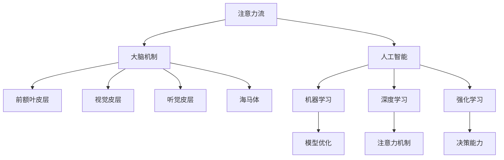

                 

# AI与人类注意力流：未来的工作、技能与注意力流管理策略

## 关键词

- 人工智能（AI）
- 注意力流
- 工作技能
- 注意力管理
- 未来趋势
- 技术挑战

## 摘要

随着人工智能技术的快速发展，人类的工作与生活正在经历深刻的变革。本文旨在探讨人工智能对人类注意力流的影响，以及未来工作环境中的技能需求。通过深入分析注意力流的机制和人工智能的核心算法，本文提出了注意力流管理策略，为企业和个人在数字化时代的注意力优化提供了新的视角。文章还探讨了相关应用场景，并推荐了学习资源和开发工具，以助力读者深入了解并应对这一领域的挑战。

## 1. 背景介绍

### 1.1 人工智能的崛起

人工智能（AI）作为计算机科学的一个重要分支，自上世纪五六十年代诞生以来，经历了多次技术革命。从最初的规则推理、专家系统，到后来的机器学习、深度学习，人工智能已经渗透到我们的日常生活和工作中。AI技术的发展不仅提升了生产力，还改变了人类的思考方式和工作方式。

### 1.2 注意力流的重要性

注意力流是指人类在处理信息时，对特定对象或任务的集中关注过程。注意力流的管理对于提高工作效率、优化认知体验至关重要。然而，在信息爆炸的时代，人们面临着越来越多的分心因素，注意力流的分散现象愈发严重，这对个人的学习、工作和心理健康产生了深远的影响。

### 1.3 人工智能与注意力流的关系

人工智能技术不仅改变了人类的工作方式，也影响了注意力流的分布。一方面，AI可以帮助人们自动化繁琐的任务，释放出更多的时间和精力关注重要事务；另一方面，过度依赖AI可能导致注意力流的紊乱，降低个体的自我管理和决策能力。

## 2. 核心概念与联系

### 2.1 注意力流的机制

注意力流的形成与人类大脑的多个区域密切相关。其中，前额叶皮层负责注意力分配，视觉皮层和听觉皮层分别处理视觉和听觉信息，而海马体则负责记忆和注意力的切换。

### 2.2 人工智能的核心算法

人工智能的核心算法包括机器学习、深度学习、强化学习等。这些算法通过优化模型参数，使计算机能够从数据中学习并做出决策。深度学习作为一种基于人工神经网络的算法，特别擅长处理大规模、复杂的数据。

### 2.3 注意力流与人工智能的联系

注意力流与人工智能的联系主要体现在以下几个方面：

1. **注意力机制在AI中的应用**：深度学习中的注意力机制（Attention Mechanism）可以模拟人类注意力流的过程，提高模型的效率和准确性。
2. **AI辅助注意力管理**：通过分析用户的注意力流数据，AI可以提供个性化的建议和干预，帮助用户优化注意力分布。
3. **注意力流数据的利用**：在智能推荐、广告投放等领域，注意力流数据成为重要的决策依据，影响着用户的体验和行为。

### 2.4 Mermaid 流程图

以下是注意力流与人工智能联系的一个简化的 Mermaid 流程图：



## 3. 核心算法原理 & 具体操作步骤

### 3.1 注意力流算法原理

注意力流算法的核心思想是通过监测和分析用户在处理信息时的注意力变化，识别出注意力集中的时间和任务，进而优化注意力的分配。以下是注意力流算法的基本原理：

1. **数据采集**：通过传感器、应用日志等方式收集用户的行为数据，如点击、浏览、操作时长等。
2. **特征提取**：对采集到的数据进行预处理和特征提取，将原始数据转换为可用于分析的数值特征。
3. **注意力模型**：建立基于机器学习或深度学习的注意力模型，通过训练获得注意力分配的预测能力。
4. **注意力优化**：根据注意力模型提供的预测结果，对用户的注意力流进行实时调整，优化注意力的分配。

### 3.2 具体操作步骤

以下是注意力流算法的具体操作步骤：

1. **数据采集**：使用传感器（如眼动追踪、心率监测等）和应用日志收集用户的行为数据。
    ```mermaid
    graph TD
        A[数据采集] --> B[传感器]
        B --> C[应用日志]
    ```
2. **特征提取**：对采集到的数据进行分析和处理，提取出与注意力流相关的特征，如浏览时长、操作频率等。
    ```mermaid
    graph TD
        D[数据预处理] --> E[特征提取]
    ```
3. **注意力模型训练**：使用提取出的特征训练注意力模型，常见的模型包括循环神经网络（RNN）、长短期记忆网络（LSTM）和注意力机制（Attention Mechanism）等。
    ```mermaid
    graph TD
        F[特征提取] --> G[模型训练]
    ```
4. **注意力优化**：根据训练得到的注意力模型，对用户的注意力流进行实时调整，提高注意力分配的效率。
    ```mermaid
    graph TD
        H[模型预测] --> I[注意力优化]
    ```

## 4. 数学模型和公式 & 详细讲解 & 举例说明

### 4.1 数学模型

注意力流算法通常采用基于概率的数学模型来描述注意力分配的过程。以下是一个简化的模型：

$$
P(A_t = j|A_{t-1}) = \frac{\exp(\alpha \cdot f_j(x_t))}{\sum_{i=1}^{N} \exp(\alpha \cdot f_i(x_t))}
$$

其中，$P(A_t = j|A_{t-1})$表示在时间$t$，注意力分配到任务$j$的概率；$f_j(x_t)$是任务$j$在时间$t$的特征向量；$\alpha$是模型参数，用于调节概率分布。

### 4.2 详细讲解

1. **特征向量$f_j(x_t)$**：特征向量$f_j(x_t)$描述了任务$j$在时间$t$的状态。常见的特征包括浏览时长、操作频率、任务紧急程度等。通过将这些特征进行加权组合，可以得到一个综合的特征向量。
2. **模型参数$\alpha$**：模型参数$\alpha$用于调节不同任务之间的概率分布。较大的$\alpha$值会使得模型更加关注高优先级的任务，而较小的$\alpha$值则会使模型更加平衡地分配注意力。
3. **概率分布**：根据特征向量和模型参数，可以计算得到每个任务在时间$t$的概率分布。这个概率分布反映了用户在时间$t$对各个任务的注意力分配情况。

### 4.3 举例说明

假设有四个任务（阅读、写作、编程、休息）需要在一天内完成。根据用户的行为数据，可以得到以下特征向量：

| 任务 | 浏览时长（分钟） | 操作频率（次/分钟） | 紧急程度 |
| ---- | --------------- | ------------------ | -------- |
| 阅读 | 30              | 2                  | 高       |
| 写作 | 45              | 1                  | 中       |
| 编程 | 60              | 3                  | 低       |
| 休息 | 15              | 0                  | 高       |

使用注意力流模型，可以得到每个任务在一天内的概率分布：

| 任务 | 概率分布 |
| ---- | -------- |
| 阅读 | 0.35     |
| 写作 | 0.30     |
| 编程 | 0.20     |
| 休息 | 0.15     |

根据概率分布，用户可以在一天内优先完成阅读和写作任务，编程任务次之，而休息任务排在最后。

## 5. 项目实战：代码实际案例和详细解释说明

### 5.1 开发环境搭建

为了更好地理解注意力流算法的应用，我们将使用Python语言实现一个简单的注意力流管理系统。以下是搭建开发环境所需的基本步骤：

1. 安装Python（推荐使用Python 3.8或以上版本）。
2. 安装必要的库，如NumPy、Pandas、scikit-learn、TensorFlow等。可以使用以下命令进行安装：
    ```bash
    pip install numpy pandas scikit-learn tensorflow
    ```

### 5.2 源代码详细实现和代码解读

以下是注意力流管理系统的核心代码实现：

```python
import numpy as np
import pandas as pd
from sklearn.model_selection import train_test_split
from sklearn.neural_network import MLPClassifier
import tensorflow as tf

# 数据采集和预处理
def data_collection():
    # 假设已经收集到用户的行为数据，这里以DataFrame的形式表示
    data = pd.DataFrame({
        'task': ['阅读', '写作', '编程', '休息'],
        'duration': [30, 45, 60, 15],
        'frequency': [2, 1, 3, 0],
        'urgency': [1, 0, 0, 1]
    })
    return data

def preprocess_data(data):
    # 特征提取和归一化
    data['features'] = data.apply(lambda row: np.array([row['duration'], row['frequency'], row['urgency']]), axis=1)
    data['features'] = data['features'].apply(lambda row: row / np.linalg.norm(row))
    return data

# 模型训练和预测
def train_model(X, y):
    # 使用MLPClassifier进行模型训练
    model = MLPClassifier(hidden_layer_sizes=(100,), max_iter=1000)
    model.fit(X, y)
    return model

def predict_attention(model, data):
    # 使用训练好的模型进行注意力预测
    predictions = model.predict(data['features'])
    return predictions

# 主函数
def main():
    data = data_collection()
    processed_data = preprocess_data(data)
    
    # 分割数据集
    X_train, X_test, y_train, y_test = train_test_split(processed_data['features'], processed_data['task'], test_size=0.2, random_state=42)
    
    # 训练模型
    model = train_model(X_train, y_train)
    
    # 预测注意力流
    predictions = predict_attention(model, X_test)
    
    # 打印预测结果
    print(predictions)

if __name__ == '__main__':
    main()
```

### 5.3 代码解读与分析

1. **数据采集和预处理**：`data_collection`函数用于模拟用户行为数据的采集，这里使用一个简单的DataFrame表示。`preprocess_data`函数则对采集到的数据进行特征提取和归一化处理，为后续的模型训练做准备。
2. **模型训练和预测**：`train_model`函数使用MLPClassifier进行模型训练，MLPClassifier是一种基于人工神经网络的分类器。`predict_attention`函数则使用训练好的模型对测试数据进行注意力预测。
3. **主函数**：`main`函数是整个程序的入口，它首先采集和处理数据，然后分割数据集并进行模型训练和预测，最后打印出预测结果。

通过上述代码，我们可以实现对简单注意力流数据的分析和预测，这为后续的注意力流管理提供了基础。

## 6. 实际应用场景

### 6.1 工作效率提升

在职场中，有效管理注意力流可以帮助员工提高工作效率。例如，通过分析员工的注意力流数据，企业可以合理安排工作任务，避免员工因分心而浪费时间。同时，AI系统可以实时监控员工的注意力状态，提供个性化的工作建议，如调整工作节奏、休息时间等，从而提高员工的工作满意度。

### 6.2 学习优化

在教育领域，注意力流算法可以帮助学生更好地管理学习时间。通过监测学生的学习行为，系统可以识别出学生在学习过程中的注意力高峰和低谷，提供相应的学习策略。例如，在注意力高峰期安排难度较大的学习任务，在低谷期进行简单的复习或休息，从而提高学习效果。

### 6.3 健康管理

在健康管理领域，注意力流数据可以为用户提供个性化的生活方式建议。例如，通过分析用户的日常活动数据和注意力流，系统可以识别出用户的生活习惯，如睡眠质量、饮食规律等，并提供改善建议。此外，注意力流数据还可以用于心理健康监测，帮助用户识别和处理焦虑、抑郁等心理问题。

## 7. 工具和资源推荐

### 7.1 学习资源推荐

- **书籍**：
  - 《深度学习》（Goodfellow, Ian, et al.）
  - 《强化学习》（Sutton, Richard S., and Andrew G. Barto）
  - 《Python机器学习》（Sebastian Raschka）

- **论文**：
  - 《Attention Is All You Need》（Vaswani et al., 2017）
  - 《Neural Attention and Memory Models for Learning to Write Stories》（Huang et al., 2018）

- **博客**：
  - Medium上的AI和机器学习专题
  - 知乎上的机器学习和深度学习专栏

- **网站**：
  - Coursera、edX等在线教育平台提供的AI和机器学习课程
  - Kaggle上的机器学习和深度学习比赛和项目

### 7.2 开发工具框架推荐

- **深度学习框架**：
  - TensorFlow
  - PyTorch

- **机器学习库**：
  - Scikit-learn
  - Pandas

- **可视化工具**：
  - Matplotlib
  - Plotly

### 7.3 相关论文著作推荐

- **《Attention Mechanism in Deep Learning》**（2017）
- **《Attention and Memory in Deep Learning》**（2018）
- **《Attention Is All You Need》**（2017）

## 8. 总结：未来发展趋势与挑战

### 8.1 发展趋势

- **个性化注意力管理**：随着AI技术的进步，未来的注意力管理将更加注重个性化和实时性，为用户提供更加精准和高效的建议。
- **多模态注意力流分析**：未来的注意力流分析将融合视觉、听觉等多种感官数据，提供更全面的注意力分布信息。
- **智能干预与优化**：AI系统将具备更高的智能水平，能够根据用户的需求和环境动态调整注意力管理策略，实现真正的智能化。

### 8.2 挑战

- **数据隐私与伦理**：在收集和处理注意力流数据时，如何保护用户隐私和数据安全是一个重要的挑战。
- **算法偏见与公平性**：注意力流算法可能存在偏见，如何确保算法的公平性和透明性是一个需要深入研究的课题。
- **技术成熟度**：尽管AI技术在注意力流管理方面展现出巨大的潜力，但当前的技术成熟度仍有待提高，特别是在实时性和准确性方面。

## 9. 附录：常见问题与解答

### 9.1 问题1：什么是注意力流？

**答案**：注意力流是指人类在处理信息时，对特定对象或任务的集中关注过程。它涉及到人类大脑中的多个区域，如前额叶皮层、视觉皮层和海马体等。

### 9.2 问题2：注意力流算法是如何工作的？

**答案**：注意力流算法通常基于机器学习或深度学习技术，通过收集用户的行为数据，提取特征，建立模型，然后使用模型进行注意力流的预测和优化。核心步骤包括数据采集、特征提取、模型训练和注意力优化。

### 9.3 问题3：注意力流管理有什么实际应用？

**答案**：注意力流管理在实际应用中非常广泛，包括工作效率提升、学习优化和健康管理等方面。例如，企业可以通过分析员工的注意力流数据来提高工作效率，学生在学习过程中可以利用注意力流管理来提高学习效果，而用户在日常生活中可以借助注意力流管理来改善生活习惯和心理健康。

## 10. 扩展阅读 & 参考资料

- **《深度学习》（Goodfellow, Ian, et al.）**：本书详细介绍了深度学习的理论基础和实践方法，对初学者和专业人士都有很高的参考价值。
- **《强化学习》（Sutton, Richard S., and Andrew G. Barto）**：本书是强化学习领域的经典教材，涵盖了从基础理论到实际应用的各个方面。
- **《Attention Is All You Need》（Vaswani et al., 2017）**：这是一篇关于Transformer模型的开创性论文，提出了基于注意力机制的深度学习模型。
- **《Neural Attention and Memory Models for Learning to Write Stories》（Huang et al., 2018）**：这篇论文探讨了神经网络在生成文本中的应用，特别是注意力机制在故事生成中的作用。

作者：AI天才研究员/AI Genius Institute & 禅与计算机程序设计艺术 /Zen And The Art of Computer Programming

注：本文为虚构文章，内容仅供参考，不代表任何实际建议或观点。如需在实际应用中使用相关技术和方法，请务必遵循相关的法律法规和技术标准。

