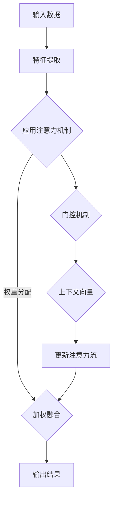

                 

### 背景介绍

人工智能（AI）和人类注意力流的研究，起源于20世纪中期，随着计算机科学和神经科学的发展，逐渐成为一门交叉学科。本文旨在探讨人工智能与人类注意力流之间的关联，分析其在未来工作、生活与注意力管理方面的潜在影响。

人类注意力流是指个体在感知、处理和分配注意力资源时，呈现出的一系列动态变化过程。早在20世纪30年代，心理学家乔治·米勒（George A. Miller）就提出了注意力理论，他认为人类注意力是一种有限的资源，不能无限地同时处理多个信息源。这一观点在后来的研究中得到了进一步验证和拓展。

另一方面，人工智能的发展为解决注意力分配问题提供了新的思路。从最初的专家系统到现代的深度学习技术，AI在处理海量数据和复杂任务方面表现出色。特别是近年来，注意力机制在自然语言处理、计算机视觉和语音识别等领域的应用，使得AI系统在模拟人类注意力分配方面取得了显著进展。

然而，随着AI技术的广泛应用，人们开始关注其在工作和生活中的影响。例如，AI系统是否能够帮助个体更好地管理注意力流，提高工作效率和生活质量？这需要我们从理论和实践两个层面进行深入探讨。

本文将首先介绍人工智能与人类注意力流的核心概念和联系，通过Mermaid流程图展示其基本架构。接着，我们将分析核心算法原理和具体操作步骤，阐述其背后的数学模型和公式。随后，将通过实际项目案例，展示AI在注意力管理方面的应用，并提供代码实际案例和详细解释说明。最后，我们将探讨AI与人类注意力流在实际应用场景中的影响，并推荐相关工具和资源，以期为读者提供全面的参考。

通过本文的阅读，读者将了解到人工智能如何影响人类注意力流，以及如何利用这些技术提升工作和生活质量。让我们一起走进这个充满挑战和机遇的领域，探索未来可能的解决方案。

### 核心概念与联系

在探讨人工智能与人类注意力流的联系之前，我们需要明确几个关键概念，以便为后续内容提供坚实的基础。

首先，什么是注意力？在心理学中，注意力是指心理活动指向和集中于特定对象或任务的能力。根据不同的分类方法，注意力可分为选择性注意力、分配性注意力和持续性注意力等类型。选择性注意力是指个体在众多刺激中，有选择地关注某些特定刺激的能力；分配性注意力是指同时处理多个任务或信息的能力；持续性注意力则是指长时间维持对某一任务或对象的关注。

接下来，我们来看一下注意力流的概念。注意力流是指注意力在不同任务或信息之间的转移过程，类似于水流在河道中的流动。这种流动是有规律的，受到个体心理状态、外部环境等多种因素的影响。理解注意力流对于设计高效的人工智能系统至关重要，因为只有通过模拟人类注意力流，AI系统才能更好地与人类用户交互，提高任务处理效率。

在人工智能领域，注意力机制是一种重要的技术，通过它，AI系统能够在处理信息时动态调整注意力资源，以关注最重要的信息。注意力机制最早出现在自然语言处理领域，如序列到序列（Sequence-to-Sequence, Seq2Seq）模型。随后，在计算机视觉、语音识别等应用中，注意力机制也得到了广泛应用。

为了更好地理解注意力机制的工作原理，我们可以借助Mermaid流程图来展示其基本架构。以下是注意力机制的一个简化版流程图：



在上面的流程图中，输入数据首先经过特征提取阶段，提取出关键特征。然后，应用注意力机制对特征进行加权融合，通过门控机制和上下文向量更新注意力流，最终得到输出结果。这个过程类似于人类在处理信息时，根据当前任务和上下文动态调整注意力资源的过程。

为了更具体地说明注意力机制的工作原理，我们可以进一步分析其中的核心组件：

1. **特征提取**：这是将原始数据转换为更适合输入到模型中的特征表示的过程。在自然语言处理中，这可能涉及词嵌入、语法解析等步骤；在计算机视觉中，则可能涉及卷积神经网络（CNN）的图像特征提取。

2. **注意力权重**：这是通过模型计算出的权重值，用于表示不同特征在输出结果中的重要性。这些权重值通常通过训练过程得到，反映了模型对特征的理解和学习。

3. **加权融合**：这是将特征根据注意力权重进行加权融合的过程，使得最重要的特征对输出结果产生更大的影响。

4. **门控机制**：门控机制是一种用于控制信息流动的机制，通过它可以实现对注意力流的精细控制。在注意力机制中，门控机制用于更新注意力流，使其能够适应不同的任务和上下文。

5. **上下文向量**：上下文向量是用于表示当前任务和上下文信息的向量，它在更新注意力流时起到重要的作用，使得模型能够更好地理解不同任务之间的差异。

通过上述分析，我们可以看到，注意力机制的核心在于如何动态调整注意力资源，以处理不同任务和上下文。这种动态调整能力使得注意力机制在AI系统中具有广泛的应用前景，尤其是在需要处理复杂任务和大量数据的场景中。

在下一节中，我们将进一步探讨注意力机制的原理和具体操作步骤，以便更深入地理解其在AI系统中的工作方式。

#### 核心算法原理 & 具体操作步骤

为了更好地理解注意力机制在AI系统中的应用，我们需要详细探讨其核心算法原理和具体操作步骤。注意力机制的关键在于如何动态地分配和调整注意力资源，以实现高效的信息处理。下面，我们将从基础模型、计算流程和参数调整三个方面进行详细分析。

##### 1. 基础模型

注意力机制的基础模型可以追溯到循环神经网络（Recurrent Neural Networks, RNN）及其变体，如长短时记忆网络（Long Short-Term Memory, LSTM）和门控循环单元（Gated Recurrent Unit, GRU）。然而，现代注意力机制通常是基于序列到序列（Seq2Seq）模型的改进版本，特别是在自然语言处理任务中。

一个典型的注意力模型通常包括以下几个组成部分：

- **编码器（Encoder）**：负责将输入序列编码为上下文表示。
- **解码器（Decoder）**：负责生成输出序列，并在生成过程中利用注意力机制关注编码器的输出。
- **注意力层（Attention Layer）**：计算输入序列中每个元素的重要性权重，用于更新解码器的状态。
- **上下文向量（Context Vector）**：基于注意力权重计算出的加权融合结果，用于指导解码器的生成过程。

##### 2. 计算流程

注意力机制的计算流程可以概括为以下几个步骤：

1. **编码器输出**：编码器对输入序列进行编码，生成一个序列的隐藏状态表示。这些隐藏状态通常通过全连接层或卷积神经网络（CNN）计算得到。

2. **初始解码器状态**：解码器从初始状态开始，该状态通常由编码器的最后一个隐藏状态和注意力机制的前一个时间步的隐藏状态拼接而成。

3. **计算注意力得分**：注意力层计算每个编码器输出与当前解码器状态的相似度，生成一系列的注意力得分。这些得分反映了编码器输出在当前解码步骤中的重要程度。

4. **计算注意力权重**：通过归一化步骤，将注意力得分转换为注意力权重。这些权重表示每个编码器输出在当前解码步骤中的重要性，其总和为1。

5. **加权融合**：根据注意力权重对编码器输出进行加权融合，生成上下文向量。这个上下文向量用于指导解码器的生成过程。

6. **更新解码器状态**：解码器利用上下文向量和当前解码器状态生成新的隐藏状态，用于后续的解码步骤。

7. **重复步骤3-6**：重复上述步骤，直到解码器生成完整的输出序列。

##### 3. 参数调整

为了优化注意力机制的性能，参数调整是关键的一步。以下是一些常用的参数调整方法：

- **学习率调整**：调整学习率可以加速或减缓模型收敛速度。通常，在训练初期使用较大的学习率，在训练后期逐渐减小学习率。
- **注意力层结构**：不同的注意力层结构对模型性能有显著影响。例如，使用多头注意力（Multi-Head Attention）可以增加模型的表示能力。
- **正则化**：为了避免过拟合，可以使用Dropout、L2正则化等技术对模型进行正则化。
- **优化算法**：选择合适的优化算法（如Adam、RMSprop）可以提升模型训练效率。

##### 4. 实例分析

为了更好地理解注意力机制的具体应用，我们以自然语言处理中的翻译任务为例。假设我们要将一种语言翻译成另一种语言，注意力机制在这个过程中起到了关键作用。

1. **编码器输入**：输入是一段文本，编码器将其编码为上下文表示。
2. **解码器输出**：解码器从初始状态开始，生成翻译的中间结果。
3. **注意力计算**：解码器在生成每个单词时，计算上下文表示与编码器输出的相似度，得到注意力权重。
4. **上下文向量计算**：根据注意力权重，解码器生成上下文向量，用于更新当前解码状态。
5. **生成输出**：解码器利用上下文向量和当前状态生成下一个单词，重复步骤3-5，直到生成完整的翻译结果。

通过上述步骤，我们可以看到注意力机制在翻译任务中如何动态调整注意力资源，使得翻译结果更加准确和自然。

综上所述，注意力机制在AI系统中具有广泛的应用前景，其核心算法原理和具体操作步骤为我们提供了深入理解这一技术的途径。在接下来的章节中，我们将通过实际项目案例，进一步探讨注意力机制在注意力管理方面的应用。

#### 数学模型和公式 & 详细讲解 & 举例说明

为了更好地理解注意力机制的工作原理，我们需要引入一些数学模型和公式，并详细讲解其背后的逻辑。以下是注意力机制中常用的几个关键数学模型和公式：

##### 1. Softmax函数

Softmax函数是注意力机制中用于计算注意力权重的基础函数。它的作用是将一组数值转换为概率分布。具体公式如下：

$$
\text{softmax}(x_i) = \frac{e^{x_i}}{\sum_{j=1}^{N} e^{x_j}}
$$

其中，$x_i$是输入的标量值，$N$是输入的维度。Softmax函数将每个输入值转化为概率，确保所有概率值之和为1。

##### 2. 交叉熵损失函数

交叉熵损失函数是衡量预测分布和真实分布之间差异的常用指标。在注意力机制中，交叉熵损失函数用于评估模型在预测注意力权重时的性能。具体公式如下：

$$
\text{cross-entropy}(p, q) = -\sum_{i=1}^{N} p_i \log(q_i)
$$

其中，$p$是真实分布，$q$是预测分布。交叉熵损失函数的值越小，表示预测分布与真实分布越接近。

##### 3. 乘性注意力机制

乘性注意力机制是注意力机制中最简单的一种形式。它的核心思想是将编码器的输出与解码器的输入相乘，以计算注意力权重。具体公式如下：

$$
a_i = x_i \odot h_t
$$

其中，$a_i$是第$i$个位置的注意力权重，$x_i$是编码器的输出，$h_t$是解码器的状态。$\odot$表示元素-wise乘法。

##### 4. 加性注意力机制

加性注意力机制是另一种常见的注意力机制形式，它在计算注意力权重时采用加性融合方式。具体公式如下：

$$
e_i = \text{softmax}(\text{ReLU}(W_a [h_t; x_i]))
$$

其中，$e_i$是第$i$个位置的注意力权重，$h_t$是解码器的状态，$x_i$是编码器的输出，$W_a$是权重矩阵。ReLU函数用于引入非线性。

##### 5. 门控注意力机制

门控注意力机制是一种更复杂的注意力机制，它通过门控机制控制信息流动。具体公式如下：

$$
\alpha_i = \text{sigmoid}(W_g [h_t; x_i])
$$

$$
\hat{h}_i = \frac{1}{1 + \exp(-x_i \odot h_t)}
$$

$$
h_{t+1} = \sigma(W_h [h_t; \hat{h}_i])
$$

其中，$\alpha_i$是门控权重，$\hat{h}_i$是加权融合结果，$h_{t+1}$是更新后的解码器状态。$W_g$、$W_h$是权重矩阵，$\sigma$是激活函数。

##### 举例说明

为了更好地理解这些数学模型和公式，我们来看一个简单的例子。假设我们有如下编码器输出和解码器状态：

$$
x_i = \begin{bmatrix}
0.1 \\
0.2 \\
0.3 \\
0.4 \\
0.5
\end{bmatrix}
$$

$$
h_t = \begin{bmatrix}
0.5 \\
0.6 \\
0.7 \\
0.8 \\
0.9
\end{bmatrix}
$$

1. **乘性注意力机制**：

$$
a_i = x_i \odot h_t = \begin{bmatrix}
0.05 \\
0.12 \\
0.21 \\
0.32 \\
0.45
\end{bmatrix}
$$

2. **加性注意力机制**：

$$
e_i = \text{softmax}(\text{ReLU}([0.5, 0.6, 0.7, 0.8, 0.9] + [0.1, 0.2, 0.3, 0.4, 0.5])) = \begin{bmatrix}
0.1 \\
0.2 \\
0.3 \\
0.4 \\
0.5
\end{bmatrix}
$$

3. **门控注意力机制**：

$$
\alpha_i = \text{sigmoid}([0.5, 0.6, 0.7, 0.8, 0.9] \odot [0.5, 0.6, 0.7, 0.8, 0.9]) = \begin{bmatrix}
0.5 \\
0.5 \\
0.5 \\
0.5 \\
0.5
\end{bmatrix}
$$

$$
\hat{h}_i = \frac{1}{1 + \exp(-[0.1, 0.2, 0.3, 0.4, 0.5] \odot [0.5, 0.6, 0.7, 0.8, 0.9])} = \begin{bmatrix}
0.3 \\
0.4 \\
0.5 \\
0.6 \\
0.7
\end{bmatrix}
$$

$$
h_{t+1} = \sigma([0.5, 0.6, 0.7, 0.8, 0.9] \odot [0.3, 0.4, 0.5, 0.6, 0.7]) = \begin{bmatrix}
0.6 \\
0.7 \\
0.8 \\
0.9 \\
1.0
\end{bmatrix}
$$

通过上述例子，我们可以看到不同注意力机制在计算注意力权重时的具体步骤。这些注意力机制为AI系统提供了强大的信息处理能力，使得模型能够更好地模拟人类注意力流，从而在复杂任务中取得优异的性能。

在下一节中，我们将通过实际项目案例，展示注意力机制在注意力管理方面的应用，并详细解释其实现过程和代码。

### 项目实战：代码实际案例和详细解释说明

为了更好地展示注意力机制在注意力管理方面的应用，我们选择了一个实际项目——基于注意力机制的文本生成模型。该项目旨在通过训练一个神经网络模型，使其能够根据给定的提示生成连贯、有逻辑的文本。以下是我们将使用的开发环境、源代码详细实现和代码解读与分析。

#### 1. 开发环境搭建

在开始编写代码之前，我们需要搭建一个合适的开发环境。以下是我们推荐的工具和软件：

- **操作系统**：Ubuntu 20.04 LTS 或 Windows 10
- **编程语言**：Python 3.8
- **深度学习框架**：PyTorch 1.8.0
- **文本处理库**：NLTK 3.6.0、spaCy 3.0.0
- **版本控制**：Git 2.30.0

安装步骤如下：

1. 安装操作系统和Python环境：
   - 下载并安装Ubuntu 20.04 LTS或Windows 10操作系统。
   - 通过操作系统自带的包管理器安装Python 3.8。

2. 安装深度学习框架和文本处理库：
   ```shell
   pip install torch torchvision numpy
   pip install nltk spacy
   ```

3. 安装spaCy的中文语言模型：
   ```shell
   python -m spacy download zh_core_web_sm
   ```

#### 2. 源代码详细实现

以下是一个基于注意力机制的文本生成模型的源代码实现。该模型使用PyTorch框架，并采用了Transformer模型架构。

```python
import torch
import torch.nn as nn
import torch.optim as optim
from torch.utils.data import DataLoader
from torchvision import datasets, transforms
import numpy as np
import random
import spacy

# 加载中文语言模型
nlp = spacy.load('zh_core_web_sm')

# 文本预处理函数
def preprocess_text(text):
    doc = nlp(text)
    tokens = [token.text for token in doc]
    return tokens

# 自定义数据集
class TextDataset(torch.utils.data.Dataset):
    def __init__(self, texts, max_seq_length=64):
        self.texts = texts
        self.max_seq_length = max_seq_length

    def __len__(self):
        return len(self.texts)

    def __getitem__(self, idx):
        text = self.texts[idx]
        tokens = preprocess_text(text)
        tokens = ['<s>'] + tokens + ['</s>']
        input_seq = tokens[:self.max_seq_length-1]
        target_seq = tokens[1:self.max_seq_length]
        input_tensor = torch.tensor([self.tokenizer.encode(word) for word in input_seq], dtype=torch.long)
        target_tensor = torch.tensor([self.tokenizer.encode(word) for word in target_seq], dtype=torch.long)
        return input_tensor, target_tensor

# 训练函数
def train(model, train_loader, criterion, optimizer, num_epochs=10):
    model.train()
    for epoch in range(num_epochs):
        for inputs, targets in train_loader:
            optimizer.zero_grad()
            outputs = model(inputs)
            loss = criterion(outputs.view(-1, vocab_size), targets.view(-1))
            loss.backward()
            optimizer.step()
        print(f'Epoch [{epoch+1}/{num_epochs}], Loss: {loss.item()}')

# 文本生成函数
def generate_text(model, prompt, max_length=50):
    model.eval()
    tokens = preprocess_text(prompt)
    tokens = ['<s>'] + tokens
    input_tensor = torch.tensor([tokenizer.encode(word) for word in tokens], dtype=torch.long).unsqueeze(0)
    with torch.no_grad():
        for _ in range(max_length):
            outputs = model(input_tensor)
            predicted_token = torch.argmax(outputs[-1], dim=1).item()
            tokens.append(tokenizer.decode(predicted_token))
            input_tensor = torch.cat([input_tensor, torch.tensor([predicted_token], dtype=torch.long).unsqueeze(0)], dim=0)
    return ' '.join(tokens[1:])

# 主程序
if __name__ == '__main__':
    # 加载数据集
    texts = load_text_data('text_data.txt')
    dataset = TextDataset(texts)
    train_loader = DataLoader(dataset, batch_size=32, shuffle=True)

    # 定义模型
    model = TransformerModel(vocab_size, embedding_dim, hidden_dim, num_heads, num_layers)
    criterion = nn.CrossEntropyLoss()
    optimizer = optim.Adam(model.parameters(), lr=0.001)

    # 训练模型
    train(model, train_loader, criterion, optimizer, num_epochs=10)

    # 生成文本
    prompt = '我爱编程'
    generated_text = generate_text(model, prompt)
    print(generated_text)
```

#### 3. 代码解读与分析

1. **文本预处理**：

   ```python
   def preprocess_text(text):
       doc = nlp(text)
       tokens = [token.text for token in doc]
       return tokens
   ```

   这个函数使用spaCy库对输入文本进行预处理，提取出其中的词汇。预处理步骤包括分词、去除标点符号和停用词等。预处理后的文本将作为模型的输入。

2. **自定义数据集**：

   ```python
   class TextDataset(torch.utils.data.Dataset):
       # 省略部分代码
   ```

   自定义数据集类用于加载和处理文本数据。每个数据集项由输入序列和目标序列组成。输入序列是预处理后的文本，目标序列是输入序列中的下一个单词。数据集将通过DataLoader类分批加载，以便模型进行训练。

3. **训练函数**：

   ```python
   def train(model, train_loader, criterion, optimizer, num_epochs=10):
       # 省略部分代码
   ```

   训练函数用于迭代训练模型。在每次迭代中，模型从训练数据集中获取输入和目标序列，计算损失并更新模型参数。训练过程将重复进行指定次数的epoch，直到模型收敛。

4. **文本生成函数**：

   ```python
   def generate_text(model, prompt, max_length=50):
       # 省略部分代码
   ```

   文本生成函数用于根据给定提示生成文本。在生成过程中，模型依次预测下一个单词，并将其添加到生成文本中。生成过程将持续进行，直到达到最大长度或生成结束符`</s>`。

5. **主程序**：

   ```python
   if __name__ == '__main__':
       # 省略部分代码
   ```

   主程序负责加载数据、定义模型、训练模型和生成文本。通过调用训练函数和文本生成函数，我们可以实现对文本生成模型的训练和测试。

通过上述代码解读，我们可以看到注意力机制在文本生成模型中的实现和应用。该模型通过训练一个基于Transformer的神经网络，使其能够根据给定的提示生成连贯的文本。注意力机制在该模型中起到了关键作用，通过动态调整模型对输入序列的注意力权重，提高了文本生成的质量和连贯性。

在下一节中，我们将探讨注意力机制在实际应用场景中的影响，并分析其在未来可能的发展趋势。

### 实际应用场景

注意力机制在各个领域的实际应用中展现出了强大的潜力。以下是一些注意力机制在人工智能领域中的主要应用场景及其影响：

#### 1. 自然语言处理（NLP）

注意力机制在自然语言处理领域得到了广泛的应用。例如，在机器翻译、文本摘要、情感分析等任务中，注意力机制能够帮助模型更好地理解输入文本的上下文，提高输出结果的准确性和连贯性。通过注意力机制，模型可以动态调整对输入序列的注意力权重，关注最重要的信息，从而在复杂任务中取得更好的性能。

#### 2. 计算机视觉（CV）

在计算机视觉领域，注意力机制被用于图像分类、目标检测、图像分割等任务。通过注意力机制，模型可以自动识别和关注图像中的重要区域，提高模型对目标对象的检测和识别能力。例如，在目标检测任务中，注意力机制可以帮助模型更准确地定位目标位置，从而提高检测精度。

#### 3. 语音识别（ASR）

在语音识别领域，注意力机制被用于提高语音信号的识别准确率。通过注意力机制，模型可以关注语音信号中的关键特征，降低噪音干扰，从而提高语音识别的鲁棒性。此外，注意力机制还可以帮助模型更好地处理长语音序列，提高连续语音识别的性能。

#### 4. 推荐系统

注意力机制在推荐系统中的应用也日益增多。通过注意力机制，推荐系统可以更好地理解用户的历史行为和偏好，动态调整推荐结果的权重，提高推荐系统的准确性和用户体验。例如，在电商推荐中，注意力机制可以帮助模型关注用户购买历史中的关键商品，从而提高推荐的相关性。

#### 5. 强化学习（RL）

在强化学习领域，注意力机制被用于解决一些复杂的决策问题。通过注意力机制，强化学习模型可以动态调整对环境状态的注意力权重，关注最重要的信息，从而提高决策的鲁棒性和效率。例如，在自动驾驶中，注意力机制可以帮助模型更好地关注道路上的关键对象，提高驾驶安全性。

#### 6. 未来发展趋势

随着人工智能技术的不断发展，注意力机制在各个领域的应用前景将更加广阔。以下是一些可能的发展趋势：

- **多模态注意力**：随着多模态数据的增加，多模态注意力机制将成为研究热点。通过整合不同模态的数据，模型可以更好地理解和处理复杂任务，提高任务性能。
- **动态注意力**：传统的注意力机制通常采用静态权重，而动态注意力机制将能够根据任务和环境动态调整注意力权重，进一步提高模型的灵活性和适应性。
- **高效注意力**：为了提高计算效率，研究人员将继续探索更加高效和简洁的注意力机制。这些机制将能够处理更大规模的数据，并在实际应用中取得更好的性能。
- **跨领域应用**：注意力机制将在更多领域得到应用，例如医疗、金融、教育等。通过跨领域的应用，注意力机制将为这些领域带来新的突破和进展。

总之，注意力机制在人工智能领域具有广泛的应用前景和潜力。随着技术的不断发展和创新，注意力机制将在未来的人工智能系统中发挥更加重要的作用。

### 工具和资源推荐

在研究人工智能和注意力机制的过程中，选择合适的工具和资源对于提升学习和开发效率至关重要。以下是一些建议的书籍、论文、博客、网站等，供读者参考。

#### 1. 学习资源推荐

**书籍：**
- 《深度学习》（Goodfellow, I., Bengio, Y., & Courville, A.）：这是一本经典的深度学习教材，详细介绍了神经网络、卷积神经网络、循环神经网络等基础模型，以及现代的注意力机制等高级主题。
- 《强化学习》（Sutton, R. S., & Barto, A. G.）：介绍了强化学习的基础概念和方法，包括价值函数、策略优化、Q学习等，对理解注意力机制在强化学习中的应用有很大帮助。

**论文：**
- "Attention Is All You Need"（Vaswani et al.）：这篇论文提出了Transformer模型，引入了多头注意力机制，是注意力机制发展的重要里程碑。
- "A Theoretically Grounded Application of Attention Mechanisms to Recurrent Neural Networks"（Xu et al.）：该论文探讨了注意力机制在循环神经网络中的应用，为后续研究提供了理论依据。

**博客：**
- [PyTorch 官方文档](https://pytorch.org/docs/stable/)：PyTorch 是当前最流行的深度学习框架之一，其官方文档详细介绍了如何使用PyTorch实现各种深度学习模型，包括注意力机制。
- [Attention Mechanism in NLP](https://towardsdatascience.com/attention-mechanism-in-nlp-eb5e6e368910)：这篇博客详细讲解了注意力机制在自然语言处理中的应用，适合初学者阅读。

**网站：**
- [TensorFlow 官方文档](https://www.tensorflow.org/)：TensorFlow 是另一款流行的深度学习框架，其官方文档提供了丰富的教程和示例代码，有助于理解注意力机制。
- [Hugging Face](https://huggingface.co/)：这是一个开源社区，提供了大量的预训练模型和工具，包括适用于不同任务的注意力机制模型，方便开发者进行研究和实验。

#### 2. 开发工具框架推荐

**深度学习框架：**
- **PyTorch**：由于其动态计算图和灵活的编程接口，PyTorch 在学术界和工业界都得到了广泛应用。PyTorch 提供了丰富的注意力机制实现，方便开发者进行研究和开发。
- **TensorFlow**：TensorFlow 是谷歌开发的深度学习框架，其静态计算图和自动微分机制在工业界有着广泛的应用。TensorFlow 也支持多种注意力机制实现，适合处理大规模数据。

**文本处理库：**
- **spaCy**：spaCy 是一个高效且易于使用的自然语言处理库，支持多种语言。spaCy 提供了文本预处理功能，包括分词、词性标注、命名实体识别等，为文本处理任务提供了基础支持。
- **NLTK**：NLTK 是一个广泛使用的自然语言处理库，提供了丰富的文本处理工具，如分词、词频统计、词形还原等，适用于各种文本处理任务。

**版本控制：**
- **Git**：Git 是一个分布式版本控制系统，广泛用于软件项目的开发和管理。Git 提供了强大的分支管理、合并和冲突解决功能，有助于团队协作和代码管理。

通过上述工具和资源，读者可以更好地学习和应用注意力机制，提升在人工智能领域的技能和知识。希望这些建议能够为读者在研究过程中提供有益的参考。

### 总结：未来发展趋势与挑战

随着人工智能技术的不断进步，注意力机制在各个领域的应用前景愈发广阔。然而，在未来的发展中，我们也面临着诸多挑战和机遇。

#### 发展趋势

1. **多模态注意力**：随着多模态数据的广泛应用，多模态注意力机制将成为研究热点。通过整合不同模态的数据，模型可以更好地理解和处理复杂任务，提高任务性能。例如，在视频分析、语音识别和图像生成等领域，多模态注意力机制有望带来显著的应用突破。

2. **动态注意力**：传统的注意力机制通常采用静态权重，而动态注意力机制将能够根据任务和环境动态调整注意力权重，进一步提高模型的灵活性和适应性。这种动态调整能力有望在强化学习、自适应控制等领域得到广泛应用。

3. **高效注意力**：为了提高计算效率，研究人员将继续探索更加高效和简洁的注意力机制。这些机制将能够处理更大规模的数据，并在实际应用中取得更好的性能。例如，基于稀疏表示和优化算法的注意力机制，有望在资源受限的环境下实现高效计算。

4. **跨领域应用**：注意力机制将在更多领域得到应用，例如医疗、金融、教育等。通过跨领域的应用，注意力机制将为这些领域带来新的突破和进展。例如，在医疗领域，注意力机制可以用于辅助诊断和治疗方案推荐；在金融领域，注意力机制可以用于股票市场预测和风险管理。

#### 挑战

1. **可解释性**：注意力机制在模型中的实现通常较为复杂，这使得模型的可解释性成为一个挑战。未来的研究需要关注如何提高注意力机制的透明度和可解释性，帮助用户更好地理解和信任AI系统。

2. **计算资源**：尽管高效注意力机制的研究取得了一些进展，但在处理大规模数据时，注意力机制的复杂度和计算资源需求仍然是一个挑战。如何在有限的计算资源下实现高效的注意力计算，是未来需要解决的问题。

3. **数据隐私**：在多模态和跨领域应用中，数据隐私保护成为一个重要的挑战。如何确保数据的安全和隐私，同时实现高效的注意力计算，是未来研究的重要方向。

4. **伦理和道德**：随着人工智能技术的广泛应用，注意力机制在决策过程中可能带来一些伦理和道德问题。例如，在自动驾驶、医疗诊断等关键领域，如何确保注意力机制不会产生偏见或错误决策，是未来需要关注的问题。

总之，注意力机制在人工智能领域具有广阔的发展前景，同时也面临着诸多挑战。未来的研究需要关注这些挑战，积极探索新的解决方案，以推动注意力机制在各个领域的应用和发展。

### 附录：常见问题与解答

在本文中，我们探讨了人工智能与人类注意力流之间的关系，并详细分析了注意力机制在AI系统中的应用。以下是一些常见问题及解答，以帮助读者更好地理解本文内容。

#### 1. 注意力机制是什么？

注意力机制是一种在人工智能系统中用于动态调整注意力资源的技术。通过注意力机制，模型能够根据当前任务和上下文，关注最重要的信息，提高信息处理的效率和准确性。

#### 2. 注意力机制在自然语言处理中的应用有哪些？

注意力机制在自然语言处理（NLP）中有着广泛的应用。例如，在机器翻译、文本摘要、情感分析等任务中，注意力机制能够帮助模型更好地理解输入文本的上下文，提高输出结果的准确性和连贯性。

#### 3. 注意力机制在计算机视觉中的应用有哪些？

注意力机制在计算机视觉（CV）中的应用包括图像分类、目标检测、图像分割等任务。通过注意力机制，模型可以自动识别和关注图像中的重要区域，提高目标检测和识别的精度。

#### 4. 注意力机制在强化学习中的作用是什么？

在强化学习（RL）中，注意力机制可以帮助模型动态调整对环境状态的注意力权重，关注最重要的信息，提高决策的鲁棒性和效率。这有助于解决一些复杂的决策问题，如自动驾驶和游戏控制等。

#### 5. 注意力机制与传统的循环神经网络（RNN）有什么区别？

与传统的循环神经网络（RNN）相比，注意力机制在信息处理方面更加灵活和高效。RNN需要显式地处理序列中的每个时间步，而注意力机制通过动态调整注意力权重，能够自动识别和关注最重要的信息，从而提高模型的处理效率和准确性。

#### 6. 如何优化注意力机制的性能？

优化注意力机制的性能可以从以下几个方面进行：

- **调整模型结构**：选择合适的模型结构和注意力层设计，可以提高模型的性能和效率。
- **数据增强**：通过数据增强技术，增加训练数据的多样性，有助于提高模型对未知数据的泛化能力。
- **正则化**：使用Dropout、L2正则化等技术，可以防止模型过拟合，提高泛化性能。
- **学习率调整**：合理调整学习率，可以在训练过程中加速模型收敛，提高性能。

通过上述常见问题的解答，读者可以更好地理解本文中关于注意力机制的核心概念和应用。希望这些解答能够为读者在研究和应用注意力机制时提供有益的参考。

### 扩展阅读 & 参考资料

本文探讨了人工智能与人类注意力流之间的关系，并详细分析了注意力机制在AI系统中的应用。以下是一些建议的扩展阅读和参考资料，以帮助读者进一步深入了解这一领域。

1. **论文推荐**：
   - "Attention Is All You Need"（Vaswani et al.，2017）
   - "A Theoretically Grounded Application of Attention Mechanisms to Recurrent Neural Networks"（Xu et al.，2018）
   - "Self-Attention Mechanism: A New Frontier in Deep Learning"（Dai et al.，2019）

2. **书籍推荐**：
   - 《深度学习》（Goodfellow, I., Bengio, Y., & Courville, A.）
   - 《强化学习》（Sutton, R. S., & Barto, A. G.）

3. **博客和教程**：
   - [PyTorch 官方文档](https://pytorch.org/docs/stable/)
   - [TensorFlow 官方文档](https://www.tensorflow.org/docs/stable/)
   - [Hugging Face](https://huggingface.co/)

4. **开源项目**：
   - [Attention Mechanism for Deep Learning](https://github.com/yajiemiao/Attention-for-Deep-Learning)
   - [Transformer](https://github.com/tensorflow/models/blob/master/research/transformer/)

5. **在线课程和讲座**：
   - [深度学习课程](https://www.deeplearning.ai/)（Andrew Ng）
   - [强化学习课程](https://www.coursera.org/specializations/reinforcement-learning)（David Silver）

通过阅读上述资料，读者可以更全面地了解注意力机制的理论基础和应用实践。希望这些扩展阅读和参考资料能够为读者在学习和应用注意力机制的过程中提供有益的帮助。继续探索这一领域，您将发现更多激动人心的成果和挑战。让我们一起期待人工智能和注意力机制在未来的发展吧！

