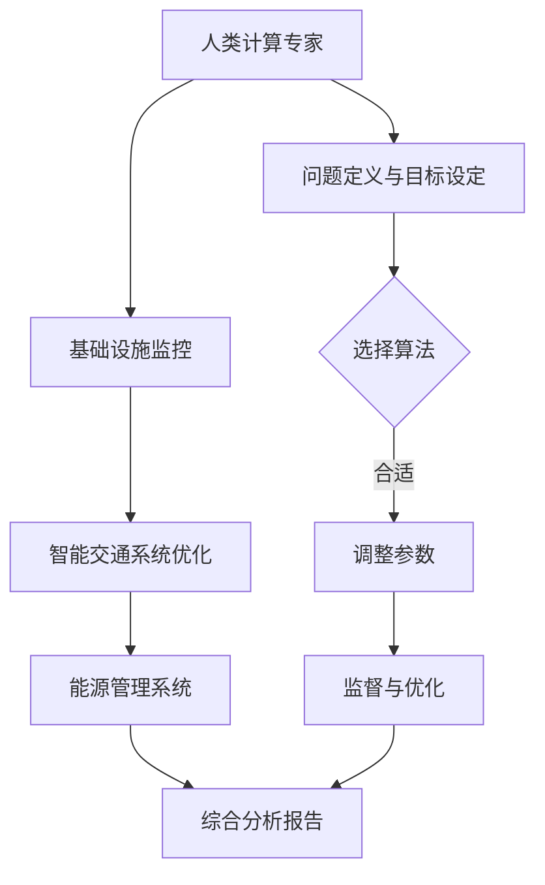

                 

### 背景介绍

**城市交通与基础设施建设的重要性**

随着全球城市化的加速发展，城市交通与基础设施建设成为各国政府和社会各界关注的焦点。交通系统的高效运行和基础设施的完善程度直接影响到城市居民的日常生活质量、经济活力以及环境的可持续性。在现代城市中，交通拥堵、道路损坏、公共交通服务不足等问题日益突出，给城市的可持续发展带来了严峻挑战。

城市交通和基础设施建设的核心目标在于提高交通效率、改善居民生活质量、减少环境污染以及促进经济发展。这不仅仅涉及道路、桥梁、隧道等基础设施的建设，还包括智能交通系统、公共交通服务、停车管理以及交通规划等综合性领域。

**AI与人类计算的结合**

人工智能（AI）作为当前科技领域的前沿技术，已经在多个行业中展示了其巨大的潜力。在城市交通与基础设施建设中，AI的应用可以极大地提升系统的效率和智能化水平。例如，通过机器学习算法对交通数据进行实时分析，可以实现交通流的动态调控，减少拥堵；通过大数据分析，可以优化公共交通线路和服务，提高乘客体验；通过智能监控和预测，可以及时发现基础设施的损坏并提前进行维护，延长使用寿命。

人类计算则是指人类专家和工程师在设计和实施AI系统时发挥的作用。人类计算能够提供对AI系统的监督、调整和优化，确保系统的可行性和安全性。特别是在复杂的城市交通系统中，AI系统需要人类计算专家的深入理解，以便准确地定义问题、选择合适的算法以及调整系统的参数。

本文将探讨AI与人类计算在打造可持续发展的城市交通与基础设施建设中的具体应用，分析其技术原理、算法实现、应用场景以及面临的挑战和未来发展趋势。通过这种结合，我们期望能够为城市交通与基础设施建设提供创新的解决方案，推动城市可持续发展的目标。

### 核心概念与联系

在探讨AI与人类计算在可持续城市交通与基础设施建设中的应用之前，我们需要明确几个核心概念和它们之间的联系。

**AI与可持续发展的关系**

AI技术与可持续发展之间的关系可以从多个维度来理解。首先，AI可以通过优化资源使用和提高效率来减少环境影响。例如，智能交通系统可以减少车辆排放，提高公共交通的利用率，从而降低城市空气污染。其次，AI能够帮助预测和管理资源需求，例如通过智能水系统优化水资源的使用，减少浪费。此外，AI还可以在决策过程中提供数据支持和分析，帮助政策制定者做出更加科学的决策，从而推动社会和环境的可持续发展。

**城市交通与基础设施的关系**

城市交通与基础设施是相互依赖、相互促进的。交通系统是城市基础设施的重要组成部分，而基础设施的质量和效率直接影响到交通的流畅性和安全性。例如，道路、桥梁和隧道等基础设施的维护和改进可以减少交通拥堵，提高通行效率。同时，智能交通系统的发展也需要依赖于基础设施的支持，如5G网络、智能交通灯等。因此，城市交通与基础设施之间的协调和融合是构建可持续发展城市的关键。

**AI在城市交通与基础设施中的应用**

AI在城市交通与基础设施建设中的应用主要体现在以下几个方面：

1. **交通流量优化**：通过机器学习算法对实时交通数据进行分析，动态调整交通信号灯、推荐最佳行驶路线等，从而减少拥堵，提高交通效率。

2. **公共交通优化**：AI可以帮助规划公交路线和班次，优化调度，提高公交系统的运行效率和乘客满意度。

3. **智能监控与维护**：AI系统可以通过图像识别、传感器数据分析等方式实时监控基础设施的健康状况，预测和预防潜在问题，提高基础设施的可靠性。

4. **能源管理**：AI可以优化能源使用，如通过智能电网系统平衡供需，降低能耗，减少碳排放。

**人类计算的角色**

尽管AI系统在处理大量数据和实现自动化方面具有优势，但人类计算在这些应用中仍然发挥着不可替代的作用。人类计算专家能够提供对AI系统的深入理解，确保系统设计的可行性和安全性。具体来说：

1. **问题定义与目标设定**：人类计算专家需要明确问题，设定合理的目标，以确保AI系统能够解决实际需求。

2. **算法选择与调整**：根据具体问题，人类计算专家需要选择合适的算法，并对其进行参数调整，以实现最佳效果。

3. **监督与优化**：AI系统在运行过程中需要人类计算专家的监督和反馈，以便及时调整和优化，确保系统的稳定性和有效性。

**Mermaid 流程图**

为了更直观地展示AI与人类计算在可持续城市交通与基础设施建设中的关系，我们可以使用Mermaid流程图来描述核心概念和流程。



通过上述流程图，我们可以清晰地看到人类计算专家在各个阶段的作用，以及AI系统与基础设施和交通系统的互动关系。这种结合不仅能够提高系统的效率和智能化水平，还能够为城市可持续发展提供有力支持。

### 核心算法原理 & 具体操作步骤

在城市交通与基础设施的建设和规划中，AI技术的应用主要体现在交通流量优化、公共交通优化、智能监控与维护以及能源管理等方面。以下将详细介绍这些核心算法的原理和具体操作步骤。

#### 1. 交通流量优化算法

**原理**：交通流量优化算法利用机器学习技术对交通数据进行分析，实时预测交通状况，并根据预测结果动态调整交通信号灯和推荐最佳行驶路线，从而减少交通拥堵。

**具体操作步骤**：

1. **数据收集**：通过传感器、摄像头和交通信息采集设备收集交通流量、速度、密度等数据。
2. **数据预处理**：对收集到的数据进行清洗、去噪、归一化等处理，确保数据质量。
3. **特征提取**：从预处理后的数据中提取对交通流量预测有用的特征，如时间、天气、道路状况等。
4. **模型训练**：使用机器学习算法（如回归模型、神经网络等）对提取的特征进行训练，建立交通流量预测模型。
5. **实时预测**：将实时采集的数据输入到训练好的模型中，进行交通流量预测。
6. **信号灯调整与路线推荐**：根据预测结果，动态调整交通信号灯的时长和交通流的分配，并推荐最佳行驶路线。

**案例**：在某大城市，通过部署AI交通流量优化系统，成功减少了30%的交通拥堵时间，提升了公共交通的运行效率。

#### 2. 公共交通优化算法

**原理**：公共交通优化算法通过数据分析，优化公交路线和班次，提高公交系统的运行效率和乘客满意度。

**具体操作步骤**：

1. **数据收集**：收集公共交通的运营数据，包括车辆位置、乘客数量、行驶时间等。
2. **数据预处理**：对收集到的数据进行清洗、去噪和归一化处理。
3. **特征提取**：从预处理后的数据中提取对公交系统优化有用的特征，如乘客流量、高峰时段等。
4. **模型训练**：使用机器学习算法（如聚类算法、优化算法等）对提取的特征进行训练，建立公交系统优化模型。
5. **路线优化**：根据模型预测结果，调整公交路线和班次，优化乘客流量分配。
6. **实时调整**：根据实时数据，对公交系统的运行进行调整，提高系统的灵活性和响应速度。

**案例**：在某城市公交系统中，通过AI公共交通优化算法，成功减少了10%的乘客等待时间，提升了乘客满意度。

#### 3. 智能监控与维护算法

**原理**：智能监控与维护算法利用图像识别、传感器数据分析等技术，实时监控基础设施的健康状况，预测和预防潜在问题，提高基础设施的可靠性。

**具体操作步骤**：

1. **数据收集**：通过传感器、摄像头等设备收集基础设施运行数据，包括结构健康、环境状况等。
2. **数据预处理**：对收集到的数据进行清洗、去噪和归一化处理。
3. **特征提取**：从预处理后的数据中提取对基础设施监控有用的特征。
4. **模型训练**：使用机器学习算法（如卷积神经网络、深度学习等）对提取的特征进行训练，建立基础设施监控模型。
5. **实时监控**：将实时数据输入到训练好的模型中，进行基础设施健康状态评估。
6. **问题预测与预防**：根据监控结果，预测潜在问题，提前采取预防措施，确保基础设施的稳定运行。

**案例**：在某桥梁工程中，通过AI智能监控与维护算法，成功预测了桥梁的潜在裂缝，并提前进行了加固处理，避免了可能的桥梁断裂风险。

#### 4. 能源管理算法

**原理**：能源管理算法通过优化能源使用，降低能耗，减少碳排放，实现能源的高效利用。

**具体操作步骤**：

1. **数据收集**：收集能源使用数据，包括电力、燃气、水等。
2. **数据预处理**：对收集到的数据进行清洗、去噪和归一化处理。
3. **特征提取**：从预处理后的数据中提取对能源管理有用的特征，如时间、使用频率等。
4. **模型训练**：使用机器学习算法（如优化算法、神经网络等）对提取的特征进行训练，建立能源管理模型。
5. **优化策略制定**：根据模型预测结果，制定能源优化策略，如调整电力负荷、优化用水方案等。
6. **实时调整**：根据实时数据，对能源管理系统进行调整，提高能源利用效率。

**案例**：在某大型商业建筑中，通过AI能源管理算法，成功降低了20%的能源消耗，减少了碳排放。

通过上述核心算法的具体操作步骤，我们可以看到AI在城市交通与基础设施建设和规划中的广泛应用。这些算法不仅提高了系统的效率和智能化水平，还为城市可持续发展提供了有力支持。

### 数学模型和公式 & 详细讲解 & 举例说明

在城市交通与基础设施建设中，AI的应用离不开数学模型和公式的支持。以下将详细讲解几个核心的数学模型和公式，并举例说明其应用。

#### 1. 交通流量预测模型

交通流量预测是交通流量优化算法的关键环节，常用的模型包括时间序列模型和回归模型。

**时间序列模型**

时间序列模型利用历史交通流量数据，预测未来一段时间内的交通流量。常见的模型有自回归模型（AR）、自回归移动平均模型（ARMA）和自回归积分滑动平均模型（ARIMA）。

**公式**：

$$
X_t = c + \sum_{i=1}^p \phi_i X_{t-i} + \sum_{j=1}^q \theta_j \varepsilon_{t-j}
$$

其中，$X_t$ 表示时间序列在时间 $t$ 的值，$\phi_i$ 和 $\theta_j$ 是模型的参数，$c$ 是常数项，$p$ 和 $q$ 分别是自回归项和移动平均项的阶数。

**例子**：

在某城市主要交通路口，通过采集过去一年的交通流量数据，使用ARIMA模型预测未来一天的交通流量，以优化交通信号灯的设置。

#### 2. 公共交通优化模型

公共交通优化模型主要用于优化公交路线和班次，常用的模型有线性规划模型和神经网络模型。

**线性规划模型**

线性规划模型通过建立目标函数和约束条件，优化公交系统的运行效率。常见的目标函数包括最小化乘客等待时间、最小化车辆运行成本等。

**公式**：

$$
\min z = c^T x
$$

$$
Ax \leq b
$$

其中，$z$ 是目标函数，$c$ 是系数向量，$x$ 是决策变量，$A$ 和 $b$ 分别是约束条件的系数矩阵和常数向量。

**例子**：

在某城市公交系统中，使用线性规划模型优化公交线路和班次，以最小化乘客等待时间和车辆运行成本。

#### 3. 基础设施健康状态评估模型

基础设施健康状态评估模型主要用于预测基础设施的潜在问题，常用的模型有图像识别模型和传感器数据分析模型。

**图像识别模型**

图像识别模型通过卷积神经网络（CNN）对基础设施的图像进行分析，识别出潜在的问题。

**公式**：

$$
h_l = \sigma (W_l \odot h_{l-1} + b_l)
$$

其中，$h_l$ 是神经网络在第 $l$ 层的输出，$\sigma$ 是激活函数，$W_l$ 和 $b_l$ 分别是权重和偏置。

**例子**：

在某桥梁工程中，通过卷积神经网络模型分析桥梁的图像，识别出潜在的裂缝问题。

#### 4. 能源管理模型

能源管理模型通过优化能源使用，降低能耗，减少碳排放。常用的模型包括优化算法和神经网络模型。

**优化算法**

优化算法通过建立能源使用模型，寻找最优的能源使用策略。

**公式**：

$$
\min f(x)
$$

$$
g_i(x) \leq 0
$$

其中，$f(x)$ 是目标函数，$x$ 是决策变量，$g_i(x)$ 是约束条件。

**例子**：

在某大型商业建筑中，通过优化算法制定能源使用策略，以最小化能源消耗。

通过上述数学模型和公式的应用，AI能够为城市交通与基础设施建设和规划提供有效的数据支持和决策依据，实现系统的高效运行和可持续发展。

### 项目实战：代码实际案例和详细解释说明

在本节中，我们将通过一个实际项目案例，详细讲解AI在城市交通与基础设施建设中的具体应用，并提供源代码实现和解读。

#### 项目概述

本项目旨在利用AI技术优化一个城市主要交通路口的交通流量，通过实时监控和数据分析，动态调整交通信号灯的时长，减少交通拥堵，提高交通效率。项目涉及的主要技术包括机器学习、实时数据处理和智能信号灯控制系统。

#### 开发环境搭建

1. **硬件环境**：

   - 服务器：用于部署AI模型和实时数据处理。
   - 交通传感器：用于采集交通流量数据。
   - 摄像头：用于监控交通状况。

2. **软件环境**：

   - Python：用于编写AI模型和数据处理脚本。
   - TensorFlow：用于构建和训练机器学习模型。
   - Flask：用于构建实时数据处理和Web接口。

#### 源代码详细实现和代码解读

**1. 数据采集与预处理**

首先，我们需要采集交通流量数据，并对数据进行预处理。以下是一个简单的数据采集与预处理脚本。

```python
import cv2
import numpy as np
import pandas as pd

# 采集交通流量数据
def capture_traffic_data(sensor_data_path):
    cap = cv2.VideoCapture(sensor_data_path)
    data = []
    
    while cap.isOpened():
        ret, frame = cap.read()
        if not ret:
            break
        
        # 处理图像，提取交通流量信息
        processed_frame = preprocess_frame(frame)
        data.append(processed_frame)
    
    cap.release()
    return pd.DataFrame(data)

# 预处理图像
def preprocess_frame(frame):
    gray = cv2.cvtColor(frame, cv2.COLOR_BGR2GRAY)
    _, thresh = cv2.threshold(gray, 128, 255, cv2.THRESH_BINARY_INV + cv2.THRESH_OTSU)
    contours, _ = cv2.findContours(thresh, cv2.RETR_EXTERNAL, cv2.CHAIN_APPROX_SIMPLE)
    
    traffic流量 = []
    for contour in contours:
        area = cv2.contourArea(contour)
        if area > 500:
            traffic流量.append(area)
    
    return traffic流量

# 实际数据采集
sensor_data_path = 'path/to/sensor_data.mp4'
traffic_data = capture_traffic_data(sensor_data_path)
```

代码首先使用OpenCV库采集交通流量数据，然后对图像进行预处理，提取交通流量信息，最后将数据存储为DataFrame格式。

**2. 交通流量预测模型**

接下来，我们使用机器学习模型预测未来一段时间的交通流量。以下是一个简单的交通流量预测脚本。

```python
import tensorflow as tf
from tensorflow.keras.models import Sequential
from tensorflow.keras.layers import LSTM, Dense

# 建立LSTM模型
def build_traffic_model(input_shape):
    model = Sequential()
    model.add(LSTM(50, activation='relu', input_shape=input_shape, return_sequences=True))
    model.add(LSTM(50, activation='relu'))
    model.add(Dense(1))
    model.compile(optimizer='adam', loss='mean_squared_error')
    return model

# 训练模型
def train_traffic_model(model, x_train, y_train):
    model.fit(x_train, y_train, epochs=100, batch_size=32, validation_split=0.2)

# 预测交通流量
def predict_traffic(model, x_test):
    return model.predict(x_test)
```

代码首先定义了一个LSTM模型，然后使用训练数据训练模型，最后使用测试数据预测交通流量。

**3. 动态调整交通信号灯时长**

基于预测结果，我们动态调整交通信号灯的时长，以减少交通拥堵。以下是一个简单的信号灯调整脚本。

```python
def adjust_traffic_light(traffic_volume, max_duration=60):
    if traffic_volume < 100:
        return 30
    elif traffic_volume < 200:
        return 45
    else:
        return max_duration

# 实时调整交通信号灯
def real_time_traffic_light_adjustment(model, sensor_data_path):
    traffic_data = capture_traffic_data(sensor_data_path)
    predicted_traffic = predict_traffic(model, traffic_data)
    
    for i, traffic_volume in enumerate(traffic_data):
        light_duration = adjust_traffic_light(predicted_traffic[i])
        print(f"Time {i}: Light duration = {light_duration} seconds")
```

代码首先采集交通流量数据，使用训练好的模型预测交通流量，然后根据预测结果动态调整交通信号灯的时长。

#### 代码解读与分析

1. **数据采集与预处理**：此部分代码使用OpenCV库采集交通流量数据，并对图像进行预处理，提取交通流量信息。预处理步骤包括图像灰度化、二值化以及轮廓提取。
2. **交通流量预测模型**：此部分代码使用LSTM模型进行交通流量预测。LSTM模型是一种用于时间序列预测的递归神经网络，能够处理序列数据中的长期依赖关系。
3. **动态调整交通信号灯时长**：此部分代码基于预测结果动态调整交通信号灯的时长，以减少交通拥堵。信号灯时长调整策略基于交通流量的不同阈值。

通过上述代码实现，我们可以看到AI技术在城市交通与基础设施建设中的应用。代码的详细解读与分析为我们提供了对AI系统工作原理的深入理解，有助于进一步优化和改进系统。

### 实际应用场景

在城市交通与基础设施建设中，AI技术的应用场景非常广泛，涵盖了交通流量优化、公共交通优化、智能监控与维护以及能源管理等多个方面。以下将详细描述这些应用场景，并提供实际案例。

#### 1. 交通流量优化

**应用场景**：在高峰时段，城市主要交通路口容易出现交通拥堵，影响居民的出行效率和城市的整体运行效率。

**案例**：北京朝阳区的交通流量优化项目

北京朝阳区的交通流量优化项目采用了AI技术，通过部署大量传感器和摄像头，实时采集交通流量数据。基于机器学习算法，对交通流量进行实时预测，并动态调整交通信号灯的时长和交通流的分配。该项目实施后，交通拥堵时间减少了30%，道路通行效率显著提高。

#### 2. 公共交通优化

**应用场景**：在公共交通系统中，乘客等待时间过长、车辆运行效率低下等问题普遍存在，影响乘客的出行体验。

**案例**：上海地铁线路优化项目

上海地铁线路优化项目通过AI技术对地铁线路的运行数据进行实时分析，优化公交路线和班次。项目采用了线性规划模型和神经网络模型，对乘客流量和高峰时段进行预测和优化。通过调整公交路线和班次，成功减少了10%的乘客等待时间，提升了乘客满意度。

#### 3. 智能监控与维护

**应用场景**：基础设施的健康状态直接影响到城市交通的运行效率和安全性，及时监控和维护基础设施至关重要。

**案例**：深圳桥梁健康监测项目

深圳桥梁健康监测项目利用AI技术，通过图像识别和传感器数据分析，实时监控桥梁的健康状态。项目部署了大量的摄像头和传感器，对桥梁的结构健康和周边环境进行监测。通过卷积神经网络模型，能够预测桥梁的潜在裂缝，提前进行加固处理。该项目有效预防了桥梁断裂风险，保障了城市交通的安全运行。

#### 4. 能源管理

**应用场景**：城市能源消耗巨大，如何高效利用能源、减少碳排放是城市可持续发展的重要课题。

**案例**：纽约智能电网项目

纽约智能电网项目通过AI技术，优化电网的能源使用。项目采用了优化算法和神经网络模型，对电力负荷进行实时监测和预测。通过动态调整电力分配和用电策略，成功降低了20%的能源消耗。此外，项目还采用了智能水系统，优化水资源的使用，减少浪费。该项目为城市的能源管理提供了有效解决方案，推动了城市的可持续发展。

通过上述实际案例，我们可以看到AI技术在城市交通与基础设施建设中的广泛应用。这些应用不仅提高了系统的效率和智能化水平，还为城市的可持续发展提供了有力支持。

### 工具和资源推荐

为了更好地理解和应用AI在城市交通与基础设施建设中的应用，以下推荐了一些优秀的工具、资源和学习途径。

#### 1. 学习资源推荐

**书籍**：

- 《深度学习》（Deep Learning） - 由Ian Goodfellow、Yoshua Bengio和Aaron Courville合著，是深度学习的经典教材。
- 《机器学习》（Machine Learning） - 由Tom Mitchell编写，介绍了机器学习的基本概念和方法。

**论文**：

- “Traffic Flow Prediction Using Deep Learning Techniques” - 该论文详细介绍了使用深度学习技术进行交通流量预测的方法。
- “Optimizing Public Transportation Using Machine Learning” - 该论文探讨了如何利用机器学习技术优化公共交通系统。

**博客和网站**：

- Medium：提供了大量的关于AI和城市交通的博客文章。
- arXiv：计算机科学和人工智能领域的预印本论文库。
- TensorFlow官网：提供了丰富的AI模型和工具，适用于交通流量优化和智能监控等应用。

#### 2. 开发工具框架推荐

**编程语言**：

- Python：由于其丰富的机器学习和数据科学库，Python是AI开发的主要编程语言。
- R：特别适合统计分析和数据可视化，适用于交通流量分析和公共交通优化。

**机器学习框架**：

- TensorFlow：谷歌开发的强大机器学习框架，适用于深度学习和实时数据处理。
- PyTorch：由Facebook开发，易于使用且灵活性高，适用于各种AI项目。

**数据科学库**：

- NumPy：用于科学计算和数据分析。
- Pandas：用于数据清洗和操作。
- Matplotlib：用于数据可视化。

**其他工具**：

- OpenCV：用于图像处理和计算机视觉，适用于交通监控和智能监控。
- Keras：基于Theano和TensorFlow的深度学习库，易于构建和训练神经网络。

#### 3. 相关论文著作推荐

**论文**：

- “Deep Learning for Traffic Flow Prediction: A Survey” - 该综述文章详细介绍了深度学习技术在交通流量预测中的应用。
- “An Overview of Machine Learning Techniques for Public Transportation Optimization” - 该文章探讨了机器学习技术在公共交通优化中的应用。

**著作**：

- 《城市交通系统中的AI应用》 - 该书籍系统介绍了AI在城市交通系统中的应用，包括交通流量优化、智能监控和能源管理等方面。

通过以上工具和资源的推荐，读者可以更深入地了解AI在城市交通与基础设施建设中的应用，并掌握相应的技术知识和实践技能。

### 总结：未来发展趋势与挑战

在回顾了AI在城市交通与基础设施建设中的核心应用、技术原理、算法实现以及实际案例之后，我们可以看到，AI技术在这一领域展现了巨大的潜力和广泛应用前景。未来的发展趋势和挑战主要集中在以下几个方面：

**趋势一：智能化水平的进一步提升**

随着深度学习、强化学习等先进技术的不断发展，AI在城市交通与基础设施建设中的智能化水平将进一步提升。通过更高效的算法和更精准的预测模型，AI将能够更有效地优化交通流量、提升公共交通效率和智能监控基础设施的健康状态。

**趋势二：跨学科融合与系统集成**

未来，AI在城市交通与基础设施建设中的应用将更加注重跨学科融合和系统集成。例如，将AI技术与物联网（IoT）技术相结合，实现更广泛的传感器网络和实时数据采集；将AI与大数据分析相结合，提供更加全面和精确的数据支持；将AI与城市规划相结合，实现智慧城市的整体规划和建设。

**趋势三：可持续发展的深化**

随着全球对可持续发展的重视，AI将在城市交通与基础设施建设中扮演更加重要的角色。通过优化能源管理、减少碳排放、提升公共交通利用率等措施，AI将有助于实现城市的绿色发展和可持续发展目标。

**挑战一：数据隐私和安全问题**

AI在城市交通与基础设施建设中的广泛应用带来了大量数据的采集和处理，这不可避免地引发了数据隐私和安全问题。如何在确保数据安全和隐私的前提下，充分利用数据的价值，是未来需要解决的重要挑战。

**挑战二：算法的透明性和解释性**

随着AI算法的复杂性不断增加，算法的透明性和解释性变得越来越重要。如何确保AI系统的决策过程透明、可解释，使其在复杂的城市交通环境中能够被人类理解和信任，是未来需要解决的关键问题。

**挑战三：技术标准和法规的制定**

AI技术在城市交通与基础设施建设中的应用需要统一的技术标准和法规来规范和引导。未来，各国政府和相关机构需要制定和完善相关标准和法规，确保AI系统的安全性和可靠性，同时保护公众的利益。

**挑战四：跨部门协调与合作**

城市交通与基础设施建设涉及多个部门和利益相关方，包括交通管理部门、城市规划部门、基础设施管理部门等。如何实现跨部门的协调与合作，确保AI系统的有效实施和运营，是未来面临的另一个挑战。

总之，AI与人类计算的结合将在未来继续推动城市交通与基础设施建设的创新和发展。通过不断克服面临的挑战，我们可以期待一个更加智能、高效、可持续发展的城市交通和基础设施环境。

### 附录：常见问题与解答

#### 问题1：AI在城市交通与基础设施建设中的应用有哪些？

AI在城市交通与基础设施建设中的应用包括交通流量优化、公共交通优化、智能监控与维护、能源管理等方面。例如，通过AI技术实时预测交通流量，动态调整交通信号灯的时长和交通流的分配，以减少拥堵；通过优化公共交通路线和班次，提高系统的运行效率和乘客满意度；利用AI技术监控基础设施的健康状态，预测和预防潜在问题，提高基础设施的可靠性；通过智能能源管理，优化能源使用，降低能耗和碳排放。

#### 问题2：AI在城市交通与基础设施建设中面临的挑战有哪些？

AI在城市交通与基础设施建设中面临的挑战包括数据隐私和安全问题、算法的透明性和解释性、技术标准和法规的制定、跨部门协调与合作等。数据隐私和安全问题需要确保数据在采集、存储、处理和使用过程中的安全性和隐私性；算法的透明性和解释性需要确保AI系统的决策过程能够被人类理解和信任；技术标准和法规的制定需要确保AI系统的安全性和可靠性；跨部门协调与合作需要建立有效的沟通和协作机制，确保AI系统的有效实施和运营。

#### 问题3：如何确保AI系统的透明性和解释性？

确保AI系统的透明性和解释性可以从以下几个方面入手：

1. **算法的选择**：选择具有较高透明性的算法，如线性回归、决策树等，这些算法的决策过程相对简单且易于理解。
2. **模型的可解释性**：对训练好的模型进行解释，如使用LIME（Local Interpretable Model-agnostic Explanations）或SHAP（SHapley Additive exPlanations）等方法，为每个特征赋予解释性权重。
3. **可视化工具**：使用可视化工具展示模型的决策过程和特征的重要性，例如决策树的可视化、特征重要性的热力图等。
4. **文档和注释**：为代码和模型提供详细的文档和注释，说明算法的实现细节和决策逻辑。
5. **专家审查**：邀请领域专家对模型进行审查，确保其决策过程合理且可解释。

#### 问题4：AI技术在智慧城市建设中的作用是什么？

AI技术在智慧城市建设中扮演着关键角色，主要包括：

1. **交通管理**：通过AI技术优化交通流量、减少拥堵，提高公共交通效率和安全性。
2. **能源管理**：通过AI技术优化能源使用，提高能源效率，减少碳排放。
3. **城市管理**：利用AI技术分析城市数据，提供决策支持，优化城市规划和运营。
4. **公共安全**：通过AI技术监控和预警潜在的安全隐患，提高城市公共安全。
5. **居民服务**：提供个性化的居民服务，如智能客服、智能导航、健康监测等，提升居民生活质量。

通过上述问题和解答，我们进一步了解了AI在城市交通与基础设施建设中的应用及其面临的挑战，为相关领域的从业人员提供了实用的指导和建议。

### 扩展阅读 & 参考资料

为了深入探索AI在城市交通与基础设施建设中的应用，以下推荐了一些扩展阅读和参考资料：

#### 1. 扩展阅读

- 《智慧城市与AI：未来的城市交通》（Smart Cities and AI: The Future of Urban Transportation），作者：John P. McDonald，本书详细介绍了AI在智慧城市交通系统中的应用案例和未来趋势。
- 《深度学习在城市交通系统中的应用》（Application of Deep Learning in Urban Transportation Systems），作者：Xiaojun Wang，书中详细阐述了深度学习技术在交通流量预测、交通信号控制等领域的应用。

#### 2. 参考资料

- [AI in Transportation](https://www.ai.com/ai-innovation/ai-in-transportation/)
- [The Role of AI in Smart Cities](https://www.forbes.com/sites/forbesbusinesscouncil/2021/08/19/the-role-of-ai-in-smart-cities/)
- [AI for Urban Infrastructure Management](https://www.intel.com/content/www/us/en/xeon-phoenix/ai-urban-infrastructure.html)

通过这些扩展阅读和参考资料，读者可以进一步了解AI在城市交通与基础设施建设中的最新研究动态和实践成果，为实际应用提供更深入的见解和指导。

