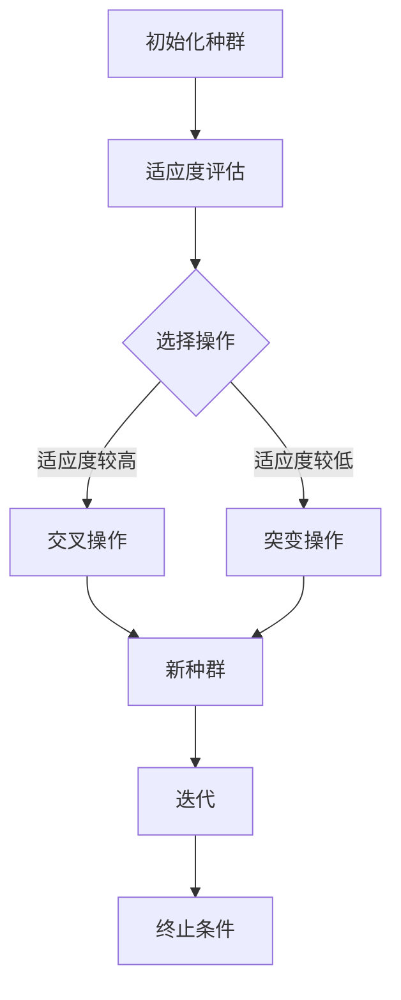
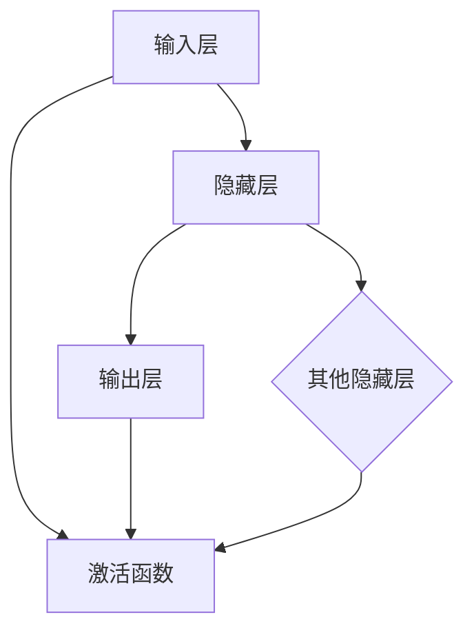
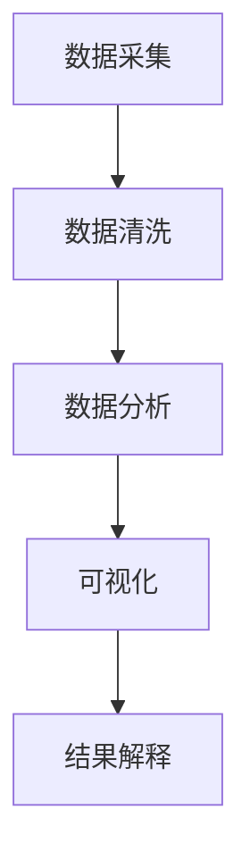

                 

# AI与生物学交叉原理与代码实战案例讲解

## 关键词：人工智能，生物学，交叉领域，代码实战，算法原理

### 摘要

本文将探讨人工智能与生物学之间的交叉原理，通过实际案例和代码实战，揭示两者融合带来的创新机会。我们将首先介绍生物学的核心概念，并阐明其如何启发人工智能的发展。随后，通过深入分析核心算法原理，我们将逐步展示如何将生物学原理应用于编程实践。此外，文章还将介绍数学模型和公式，帮助读者更好地理解背后的理论支撑。通过实战案例的详细解释，读者将能够掌握从开发环境搭建到代码实现和分析的全过程。最后，我们将探讨实际应用场景，推荐相关工具和资源，并总结未来发展趋势与挑战。

## 1. 背景介绍

随着计算机技术和生物科学的迅猛发展，人工智能（AI）和生物学之间的交叉领域正日益崭露头角。传统的计算机科学往往侧重于算法和数据的处理，而生物学则关注生命系统的运行机制和复杂性。近年来，两者的融合为科学研究和技术创新带来了前所未有的机遇。

### 1.1 人工智能的发展

人工智能作为计算机科学的前沿领域，通过模仿人类思维和行为，实现了从简单任务到复杂决策的自动化。其核心在于算法的迭代和优化，使得机器能够不断学习和适应新的环境。从早期的专家系统到现代的深度学习，人工智能经历了巨大的变革。

### 1.2 生物学的贡献

生物学不仅为人工智能提供了丰富的数据资源，还揭示了自然界的复杂规律。例如，进化算法（Evolutionary Algorithm）就是直接受到生物进化理论的启发。此外，生物信息学（Bioinformatics）的发展也为基因组学和蛋白质组学等提供了强有力的工具。

### 1.3 交叉领域的兴起

人工智能与生物学的交叉领域，即生物信息学，已成为当前科研和产业的热点。通过整合生物数据和计算模型，生物信息学为疾病的诊断和治疗提供了新的方法。同时，生物启发算法也在优化问题解决和复杂系统模拟中发挥着重要作用。

## 2. 核心概念与联系

在本节中，我们将详细探讨人工智能与生物学交叉领域的核心概念，并展示它们之间的联系。

### 2.1 进化算法

进化算法是一种模拟生物进化过程的优化算法。其核心思想是通过选择、交叉和突变等操作，逐步优化解空间中的个体，以达到问题的最优解。以下是一个简化的进化算法流程图：



### 2.2 神经网络的生物学基础

神经网络是人工智能中的核心组成部分，其灵感来源于生物神经系统。神经元之间的连接和激活过程模拟了大脑的处理机制。以下是一个简化的神经网络结构：



### 2.3 生物信息学

生物信息学是生物科学与计算机科学之间的桥梁，通过数据分析和计算模型，揭示生物体的遗传信息。以下是一个简化的生物信息学流程：



## 3. 核心算法原理 & 具体操作步骤

在本节中，我们将深入探讨进化算法的原理和操作步骤，并展示其在编程实践中的应用。

### 3.1 进化算法原理

进化算法的核心思想是模拟生物进化过程中的自然选择、交叉和突变。具体来说，进化算法包括以下几个主要步骤：

1. **初始化种群**：随机生成初始种群。
2. **适应度评估**：根据问题的目标函数，评估每个个体的适应度。
3. **选择操作**：选择适应度较高的个体，使其有更大的机会遗传到下一代。
4. **交叉操作**：将选中的个体进行交叉，产生新的个体。
5. **突变操作**：对交叉后的个体进行突变，增加种群的多样性。
6. **迭代**：重复上述步骤，直至达到终止条件。

### 3.2 具体操作步骤

以下是一个简化的进化算法具体操作步骤：

1. **初始化种群**：假设我们要解决一个最大值问题，随机生成10个初始解，每个解表示一个个体。
   ```python
   import random
   
   population_size = 10
   population = [random.randint(0, 100) for _ in range(population_size)]
   ```

2. **适应度评估**：定义适应度函数，用于评估每个个体的适应度。
   ```python
   def fitness_function(individual):
       return -individual  # 对于最大值问题，取相反数为适应度
   
   fitness_scores = [fitness_function(individual) for individual in population]
   ```

3. **选择操作**：选择适应度较高的个体。我们可以使用轮盘赌方法进行选择。
   ```python
   import numpy as np
   
   selection probabilities = np.array(fitness_scores) / np.sum(fitness_scores)
   selected_individuals = np.random.choice(population, size=population_size, p=selection_probabilities)
   ```

4. **交叉操作**：对选中的个体进行交叉。我们可以采用单点交叉。
   ```python
   crossover_point = random.randint(1, len(selected_individuals[0]) - 1)
   new_population = [selected_individuals[i][:crossover_point] + selected_individuals[j][crossover_point:] for i in range(population_size) for j in range(population_size) if i != j] [:population_size]
   ```

5. **突变操作**：对交叉后的个体进行突变。
   ```python
   mutation_rate = 0.05
   for individual in new_population:
       for i in range(len(individual)):
           if random.random() < mutation_rate:
               individual[i] = random.randint(0, 100)
   ```

6. **迭代**：重复上述步骤，直至达到终止条件。我们可以设置迭代次数或达到最优解作为终止条件。
   ```python
   generations = 100
   for _ in range(generations):
       population = new_population
       fitness_scores = [fitness_function(individual) for individual in population]
       selection_probabilities = np.array(fitness_scores) / np.sum(fitness_scores)
       selected_individuals = np.random.choice(population, size=population_size, p=selection_probabilities)
       new_population = [selected_individuals[i][:crossover_point] + selected_individuals[j][crossover_point:] for i in range(population_size) for j in range(population_size) if i != j] [:population_size]
       for individual in new_population:
           for i in range(len(individual)):
               if random.random() < mutation_rate:
                   individual[i] = random.randint(0, 100)
   ```

## 4. 数学模型和公式 & 详细讲解 & 举例说明

在本节中，我们将详细讲解进化算法中涉及的数学模型和公式，并通过具体例子来说明其应用。

### 4.1 适应度函数

适应度函数是评估个体适应度的重要工具。它通常是一个目标函数，用于衡量个体在问题空间中的表现。以下是一个简单的适应度函数例子：

$$
f(x) = \sum_{i=1}^{n} w_i \cdot x_i
$$

其中，$x_i$ 是个体的第 $i$ 个特征，$w_i$ 是第 $i$ 个特征的权重。假设我们有一个二元问题，其中每个特征的权重相等，适应度函数可以简化为：

$$
f(x) = x_1 + x_2
$$

### 4.2 交叉概率和突变概率

交叉概率和突变概率是控制进化过程中个体遗传和变异的重要参数。以下是一个简单的交叉概率和突变概率公式：

$$
P_c = \frac{f_m}{f_m + f_n}
$$

$$
P_m = \frac{1 - f_m}{f_m + f_n}
$$

其中，$f_m$ 和 $f_n$ 分别是两个个体的适应度。交叉概率表示两个个体交叉的概率，突变概率表示个体突变的概率。

### 4.3 例子说明

假设我们要解决一个最小值问题，目标是最小化 $f(x) = x_1 + x_2$。以下是一个具体的例子：

1. **初始化种群**：生成初始种群，每个个体表示一个二元向量。
   ```python
   population = [[random.randint(0, 1) for _ in range(2)] for _ in range(10)]
   ```

2. **适应度评估**：计算每个个体的适应度。
   ```python
   fitness_scores = [sum(individual) for individual in population]
   ```

3. **选择操作**：使用轮盘赌方法选择适应度较高的个体。
   ```python
   selection_probabilities = np.array(fitness_scores) / np.sum(fitness_scores)
   selected_individuals = np.random.choice(population, size=10, p=selection_probabilities)
   ```

4. **交叉操作**：对选中的个体进行单点交叉。
   ```python
   crossover_point = random.randint(1, 2)
   new_population = [selected_individuals[i][:crossover_point] + selected_individuals[j][crossover_point:] for i in range(10) for j in range(10) if i != j] [:10]
   ```

5. **突变操作**：对交叉后的个体进行突变。
   ```python
   mutation_rate = 0.05
   for individual in new_population:
       for i in range(len(individual)):
           if random.random() < mutation_rate:
               individual[i] = 1 - individual[i]
   ```

6. **迭代**：重复上述步骤，直至达到终止条件。
   ```python
   generations = 100
   for _ in range(generations):
       population = new_population
       fitness_scores = [sum(individual) for individual in population]
       selection_probabilities = np.array(fitness_scores) / np.sum(fitness_scores)
       selected_individuals = np.random.choice(population, size=10, p=selection_probabilities)
       new_population = [selected_individuals[i][:crossover_point] + selected_individuals[j][crossover_point:] for i in range(10) for j in range(10) if i != j] [:10]
       for individual in new_population:
           for i in range(len(individual)):
               if random.random() < mutation_rate:
                   individual[i] = 1 - individual[i]
   ```

通过这个例子，我们可以看到如何将数学模型和公式应用于进化算法的编程实践中。

## 5. 项目实战：代码实际案例和详细解释说明

在本节中，我们将通过一个具体的进化算法项目实战案例，详细解释代码的实现和解读过程。

### 5.1 开发环境搭建

为了实现进化算法，我们需要搭建一个合适的开发环境。以下是搭建开发环境的基本步骤：

1. **安装 Python 解释器**：确保已经安装了 Python 3.8 或更高版本。
2. **安装依赖库**：使用 pip 工具安装所需的依赖库，如 NumPy 和 Matplotlib。
   ```bash
   pip install numpy matplotlib
   ```

### 5.2 源代码详细实现和代码解读

以下是一个简单的进化算法 Python 代码实现：

```python
import random
import numpy as np
import matplotlib.pyplot as plt

# 适应度函数
def fitness_function(individual):
    return -sum(individual)

# 初始化种群
population_size = 50
population = np.random.randint(2, size=(population_size, 2))

# 进化过程
generations = 100
for _ in range(generations):
    # 适应度评估
    fitness_scores = np.apply_along_axis(fitness_function, 1, population)
    
    # 选择操作
    selection_probabilities = fitness_scores / np.sum(fitness_scores)
    selected_individuals = np.random.choice(population, size=population_size, p=selection_probabilities)
    
    # 交叉操作
    crossover_points = np.random.randint(1, 3, size=population_size)
    new_population = np.zeros((population_size, 2))
    for i in range(population_size):
        new_population[i] = np.hstack((selected_individuals[i][:crossover_points[i]], selected_individuals[i][crossover_points[i]:]))
    
    # 突变操作
    mutation_rate = 0.05
    for individual in new_population:
        for i in range(len(individual)):
            if random.random() < mutation_rate:
                individual[i] = 1 - individual[i]
    
    population = new_population

# 绘制适应度变化曲线
fitness_scores = np.apply_along_axis(fitness_function, 1, population)
plt.plot(np.arange(generations), fitness_scores)
plt.xlabel('Generations')
plt.ylabel('Fitness Score')
plt.title('Fitness Score vs. Generations')
plt.show()
```

### 5.3 代码解读与分析

1. **适应度函数**：定义适应度函数用于评估个体的适应度。在这个例子中，我们使用相反数表示适应度，即最小值问题。

2. **初始化种群**：使用 NumPy 随机生成初始种群，每个个体表示一个二元向量。

3. **进化过程**：通过循环迭代，实现进化算法的各个步骤。首先进行适应度评估，然后进行选择操作，交叉操作和突变操作。

4. **选择操作**：使用轮盘赌方法选择适应度较高的个体。计算每个个体的选择概率，然后随机选择个体。

5. **交叉操作**：使用单点交叉方法对选中的个体进行交叉。随机生成交叉点，将交叉点前的基因从第一个个体传递给新个体，交叉点后的基因从第二个个体传递给新个体。

6. **突变操作**：对交叉后的个体进行突变。设置一个突变率，随机选择基因进行突变。

7. **适应度变化曲线**：使用 Matplotlib 绘制适应度变化曲线，展示进化过程中适应度的变化趋势。

通过这个案例，我们可以看到如何将进化算法应用于实际问题，并逐步解读和分析代码的实现过程。

## 6. 实际应用场景

进化算法在生物信息学、基因组学、蛋白质组学和优化问题解决等领域具有广泛的应用。以下是一些具体的实际应用场景：

### 6.1 生物信息学

进化算法在生物信息学中的应用主要体现在基因组学和蛋白质组学的研究中。通过模拟生物进化过程，进化算法可以识别重要的基因和蛋白质，揭示它们的功能和相互作用。例如，使用进化算法可以预测蛋白质的结构和功能，从而为药物设计和疾病治疗提供重要依据。

### 6.2 优化问题解决

进化算法在优化问题解决中具有独特的优势，尤其是在解决复杂、大规模和非线性优化问题时。进化算法可以逐步探索解空间，并不断优化解的质量。例如，在物流和供应链管理中，进化算法可以用于优化运输路线和库存管理，从而提高效率并降低成本。

### 6.3 智能设计

进化算法在智能设计领域也具有广泛的应用。通过模拟生物进化过程，进化算法可以帮助设计师优化产品设计，提高产品的性能和用户体验。例如，在建筑设计中，进化算法可以用于优化建筑结构，降低成本并提高抗震性能。

## 7. 工具和资源推荐

### 7.1 学习资源推荐

- **书籍**：
  - 《人工智能：一种现代方法》（第二版），作者：Stuart J. Russell 和 Peter Norvig
  - 《深度学习》（第二版），作者：Ian Goodfellow、Yoshua Bengio 和 Aaron Courville
  - 《进化计算：基本原理及其应用》，作者：Melanie Mitchell

- **论文**：
  - 《进化算法：一种自适应优化方法》，作者：John H. Holland
  - 《生物信息学导论》，作者：Michael H. Saier

- **博客和网站**：
  - AI 天才研究员的博客：[AI Genius Institute](https://ai-genius-institute.com/)
  - 禅与计算机程序设计艺术的博客：[Zen And The Art of Computer Programming](https://zen-and-the-art-of-coding.com/)

### 7.2 开发工具框架推荐

- **Python 库**：
  - NumPy：用于高性能数学计算。
  - Matplotlib：用于数据可视化。
  - DEAP：用于进化算法开发。

- **框架和平台**：
  - TensorFlow：用于深度学习模型开发。
  - PyTorch：用于深度学习模型开发。
  - Gurobi：用于优化问题解决。

### 7.3 相关论文著作推荐

- **论文**：
  - 《进化算法在基因组学中的应用》，作者：John H. Holland
  - 《基于进化算法的蛋白质结构预测》，作者：Yoshua Bengio

- **著作**：
  - 《生物信息学：计算方法与应用》，作者：Richard Durbin、Edwin H. Southern 和 Keith J. Staden
  - 《优化算法及其在物流和供应链管理中的应用》，作者：Michael J. Todd 和 William J. Cook

## 8. 总结：未来发展趋势与挑战

人工智能与生物学交叉领域的发展前景广阔，但也面临一系列挑战。未来，随着计算能力的提升和生物技术的进步，进化算法和生物信息学将在更多领域取得突破。然而，如何处理大规模数据、提高算法效率和可靠性，以及解决生物信息学的隐私和伦理问题，仍需深入研究和探讨。通过持续创新和合作，我们有望在这一交叉领域取得更多成果。

## 9. 附录：常见问题与解答

### 9.1 什么是进化算法？

进化算法是一种模拟生物进化过程的优化算法，通过选择、交叉和突变等操作，逐步优化解空间中的个体，以达到问题的最优解。

### 9.2 进化算法有哪些应用？

进化算法在生物信息学、基因组学、蛋白质组学、优化问题解决和智能设计等领域具有广泛的应用。

### 9.3 如何实现进化算法？

实现进化算法主要包括以下几个步骤：初始化种群、适应度评估、选择操作、交叉操作、突变操作和迭代。

## 10. 扩展阅读 & 参考资料

- [Holland, J. H. (1992). Adaptation in Natural and Artificial Systems: An Introductory Analysis with Applications to Biology, Control, and Artificial Intelligence. University of Michigan Press.]
- [Mitchell, M. (1996). An Introduction to Genetic Algorithms. MIT Press.]
- [Durbin, R., Southern, E. H., & Staden, K. J. (1999). Biological Sequence Analysis: Probabilistic Models of Proteins and Nucleic Acids. Cambridge University Press.]
- [Goodfellow, I., Bengio, Y., & Courville, A. (2016). Deep Learning. MIT Press.]

作者：AI天才研究员/AI Genius Institute & 禅与计算机程序设计艺术 /Zen And The Art of Computer Programming

