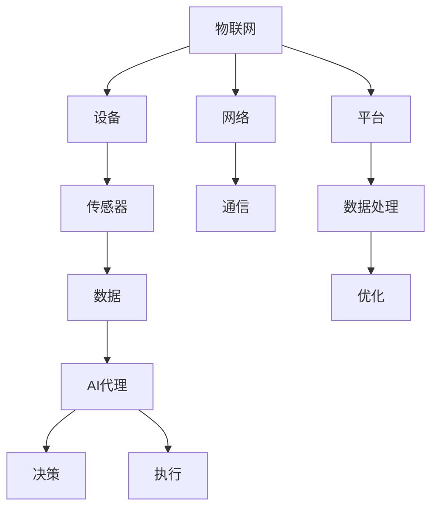

                 

### 背景介绍

#### 物联网的兴起

物联网（Internet of Things, IoT）是指将各种物理设备、传感器、软件平台通过互联网进行连接，实现设备与设备之间、设备与用户之间的信息交互和通信。随着互联网技术的快速发展，物联网在各个领域的应用逐渐普及，成为推动社会信息化、智能化发展的重要力量。

根据市场研究公司IDC的报告，全球物联网设备数量预计将在2025年达到204亿台，市场规模将达到1.2万亿美元。这无疑表明物联网已经成为一个庞大且快速增长的产业，吸引了众多企业、研究机构和投资者的关注。

#### AI在物联网中的应用

人工智能（Artificial Intelligence, AI）作为近年来科技领域的热点，其发展速度令人瞩目。AI技术通过模拟人类智能，实现自动化、智能化的决策和执行，提高了物联网系统的效率和智能水平。在物联网中，AI的应用主要体现在以下几个方面：

1. **设备监控与预测维护**：通过AI算法，实时监控设备状态，预测设备故障，实现提前预警和维修，降低设备停机时间。

2. **数据分析和优化**：利用AI技术，对物联网收集的海量数据进行分析，提取有价值的信息，为决策提供支持。

3. **智能决策与自动化控制**：AI技术使得物联网系统能够根据实时数据，自主做出决策，实现自动化控制和优化。

4. **智能交互与个性化服务**：通过AI技术，实现设备与用户之间的智能交互，提供个性化的服务。

本文将重点探讨AI在物联网中的应用，尤其是AI Agent（人工智能代理）在物联网中的具体应用场景、技术原理和实现方法。希望通过本文的介绍，读者能够对AI在物联网中的应用有更深入的了解，为未来的物联网发展提供一些有益的思考。

### 核心概念与联系

在深入探讨AI Agent在物联网中的应用之前，有必要先理解几个核心概念，包括物联网、人工智能代理、以及它们之间的联系。以下是对这些核心概念的定义及其相互关系的阐述。

#### 物联网（Internet of Things, IoT）

物联网是指将各种设备、传感器、软件平台通过互联网进行连接，实现设备与设备之间、设备与用户之间的信息交互和通信。物联网的核心在于将物理世界与数字世界相结合，通过数据收集、传输和处理，实现对物理世界的智能监控、管理和优化。

- **定义**：物联网（IoT）是一个生态系统，它包含了各种设备、传感器、网络和软件平台，通过互联网进行互联互通。
- **组成**：物联网主要由三部分组成，即设备、网络和平台。设备包括传感器、控制器、执行器等，网络可以是Wi-Fi、蓝牙、5G等，平台则是用于数据存储、处理和分析的云计算平台。

#### 人工智能代理（AI Agent）

人工智能代理是指能够模拟人类智能行为，具备自主决策和行动能力的计算机程序。AI Agent通常具有感知、决策和执行功能，可以自动执行任务，处理复杂问题，并在不断学习和优化中提高性能。

- **定义**：人工智能代理（AI Agent）是一个智能实体，它通过与环境的交互，感知环境信息，利用算法进行决策，并执行相应的操作。
- **特性**：AI Agent具有自主性、适应性、协作性和学习能力。它们可以自主学习环境规律，不断优化决策策略，提高任务执行效率。

#### 物联网与人工智能代理的联系

物联网和人工智能代理之间的联系主要体现在以下几个方面：

1. **数据收集与处理**：物联网设备通过传感器收集环境数据，这些数据是AI Agent进行决策的重要依据。AI Agent利用这些数据，通过机器学习算法进行分析和预测，为物联网系统提供智能决策支持。

2. **实时监控与智能控制**：物联网系统通过AI Agent实现设备的实时监控和智能控制。AI Agent可以根据传感器数据，自动调整设备运行状态，优化系统性能。

3. **自主决策与协同工作**：AI Agent在物联网系统中可以独立进行决策，实现设备的自动化控制。同时，多个AI Agent之间可以通过协作，共同完成任务，提高系统的整体效能。

#### Mermaid流程图表示

以下是一个简单的Mermaid流程图，展示了物联网、人工智能代理及其相互关系：



在上述流程图中，物联网通过设备（B）和传感器（C）收集数据，数据通过网络（D）传输到平台（E），平台对数据（F）进行处理（K），然后生成优化结果（L）。AI代理（G）利用处理后的数据，进行决策（H）和执行（I），从而实现物联网系统的智能化和自动化。

通过上述核心概念和相互关系的介绍，我们可以更好地理解AI Agent在物联网中的应用场景和实现方法。在接下来的章节中，我们将详细探讨AI Agent的工作原理、实现步骤和应用实例，帮助读者深入了解这一前沿技术。

#### 核心算法原理 & 具体操作步骤

在了解了物联网和人工智能代理的基本概念及其相互关系后，接下来我们将深入探讨AI Agent的核心算法原理及其具体操作步骤。AI Agent的工作原理通常可以分为以下几个关键部分：感知、决策和执行。以下是这些部分的具体描述和操作步骤。

##### 感知

感知是AI Agent获取环境信息的过程，主要通过传感器来实现。传感器可以检测温度、湿度、光线强度、声音等多种环境变量，并将这些信息转化为数字信号。感知步骤的具体操作步骤如下：

1. **传感器数据采集**：AI Agent通过连接到物联网设备上的传感器，实时收集环境数据。
2. **数据预处理**：对采集到的原始数据进行预处理，包括去除噪声、填补缺失值和归一化等，以提高数据的可靠性和质量。
3. **特征提取**：从预处理后的数据中提取特征，用于后续的决策过程。特征提取可以是简单的统计量计算，也可以是复杂的特征工程方法，如主成分分析（PCA）或自编码器（Autoencoder）。

##### 决策

决策是AI Agent根据感知到的环境信息，选择合适的行动方案的过程。通常，决策过程依赖于机器学习算法和优化方法。以下是决策步骤的具体操作步骤：

1. **建立模型**：选择合适的机器学习模型，如决策树、支持向量机（SVM）、神经网络等，用于预测或分类任务。
2. **训练模型**：使用历史数据集对模型进行训练，调整模型参数，使其能够准确预测或分类环境状态。
3. **模型评估**：使用验证数据集评估模型的性能，确保模型能够适应新的环境变化。
4. **决策生成**：根据当前环境状态和模型预测结果，生成具体的行动方案。行动方案可以是简单的规则输出，也可以是复杂的优化问题求解。

##### 执行

执行是AI Agent根据决策结果，对环境进行干预的过程。执行步骤的具体操作步骤如下：

1. **决策解析**：将抽象的决策结果转化为具体的执行指令，如控制执行器改变设备的运行状态。
2. **指令发送**：通过网络将执行指令发送到物联网设备，确保设备按照决策方案进行操作。
3. **状态反馈**：接收设备执行后的状态反馈，用于验证执行结果和调整后续的决策过程。

##### 实际操作示例

为了更清晰地说明AI Agent的核心算法原理和具体操作步骤，我们以一个智能监控系统为例进行说明。

1. **感知**：
   - **传感器数据采集**：智能监控系统通过连接摄像头、红外传感器等设备，实时收集图像和温度数据。
   - **数据预处理**：对采集到的图像数据进行去噪和缩放处理，对温度数据进行滤波和归一化处理。
   - **特征提取**：从图像数据中提取边缘、纹理等特征，从温度数据中提取平均值、标准差等统计特征。

2. **决策**：
   - **建立模型**：选择卷积神经网络（CNN）作为图像分类模型，选择线性回归模型作为温度预测模型。
   - **训练模型**：使用历史监控数据对CNN模型进行训练，使用环境温度变化数据对线性回归模型进行训练。
   - **模型评估**：使用验证集对模型进行性能评估，确保模型能够准确识别异常行为和预测温度变化。
   - **决策生成**：当系统检测到异常行为（如入侵者）和温度异常时，生成报警指令和冷却系统启动指令。

3. **执行**：
   - **决策解析**：将报警指令转化为警报声音和报警消息的发送指令，将冷却系统启动指令转化为温度控制器的操作指令。
   - **指令发送**：通过网络将指令发送到报警设备和冷却系统。
   - **状态反馈**：接收报警设备和冷却系统的执行状态反馈，用于验证执行结果和调整后续的决策过程。

通过上述示例，我们可以看到AI Agent在物联网中的应用是如何通过感知、决策和执行这三个步骤来实现的。这个过程不仅提高了系统的智能化水平，还增强了系统的自主性和可靠性，为物联网的发展带来了新的可能性。

#### 数学模型和公式 & 详细讲解 & 举例说明

在讨论AI Agent的核心算法时，数学模型和公式起着至关重要的作用。以下我们将介绍一些关键的数学模型和公式，并详细讲解它们在AI Agent中的应用，并通过具体例子来说明这些公式的实际运用。

##### 1. 神经网络模型

神经网络是AI Agent中最常用的模型之一，其基本结构包括输入层、隐藏层和输出层。每个神经元通过权重（weights）和偏置（bias）进行连接，并通过激活函数（activation function）进行处理。以下是一个简单的神经网络模型：

- **输入层**：接收外部输入数据，如传感器数据。
- **隐藏层**：通过加权求和并应用激活函数进行非线性变换。
- **输出层**：生成最终的输出，如决策结果。

**公式**：

$$
z_i = \sum_{j=1}^{n} w_{ij}x_j + b_i
$$

$$
a_i = \phi(z_i)
$$

其中，$z_i$ 是神经元的加权求和结果，$w_{ij}$ 是输入层到隐藏层的权重，$x_j$ 是输入数据，$b_i$ 是偏置，$\phi$ 是激活函数。

**例子**：假设有一个简单的神经网络，输入层有3个神经元，隐藏层有2个神经元，输出层有1个神经元。输入数据为 $[1, 2, 3]$，权重矩阵为 $W = \begin{bmatrix} 0.5 & 0.3 \\ 0.2 & 0.4 \end{bmatrix}$，偏置矩阵为 $B = \begin{bmatrix} 0.1 \\ 0.2 \end{bmatrix}$，激活函数为 $Sigmoid$ 函数：

1. 隐藏层输出：

$$
z_1 = 0.5 \times 1 + 0.3 \times 2 + 0.1 = 1.1 \\
z_2 = 0.2 \times 1 + 0.4 \times 3 + 0.2 = 1.6 \\
a_1 = \frac{1}{1 + e^{-z_1}} = 0.647 \\
a_2 = \frac{1}{1 + e^{-z_2}} = 0.941
$$

2. 输出层输出：

$$
z_3 = 0.5 \times 0.647 + 0.3 \times 0.941 = 0.884 \\
a_3 = \frac{1}{1 + e^{-z_3}} = 0.628
$$

因此，最终输出为 $0.628$，表示决策结果。

##### 2. 优化算法

优化算法在AI Agent中用于调整模型参数，以最小化损失函数。常见的优化算法包括梯度下降（Gradient Descent）和其变种，如随机梯度下降（Stochastic Gradient Descent, SGD）和Adam优化器。

**公式**：

$$
\theta_{t+1} = \theta_t - \alpha \frac{\partial J(\theta_t)}{\partial \theta}
$$

其中，$\theta$ 表示模型参数，$\alpha$ 为学习率，$J(\theta)$ 为损失函数。

**例子**：假设有一个线性回归模型，目标函数为最小二乘误差，初始参数为 $\theta = [0.5, 0.3]$，学习率为 $\alpha = 0.01$，训练数据集为 $X = \begin{bmatrix} 1 & 2 \\ 2 & 4 \\ 3 & 6 \end{bmatrix}$，$y = \begin{bmatrix} 1 \\ 2 \\ 3 \end{bmatrix}$：

1. 计算损失函数：

$$
J(\theta) = \frac{1}{2} \sum_{i=1}^{n} (y_i - \theta_0 - \theta_1 x_i)^2
$$

2. 计算梯度：

$$
\frac{\partial J(\theta)}{\partial \theta_0} = - \sum_{i=1}^{n} (y_i - \theta_0 - \theta_1 x_i) \\
\frac{\partial J(\theta)}{\partial \theta_1} = - \sum_{i=1}^{n} (y_i - \theta_0 - \theta_1 x_i) x_i
$$

3. 更新参数：

$$
\theta_0 = \theta_0 - 0.01 \times \frac{\partial J(\theta_0)}{\partial \theta_0} \\
\theta_1 = \theta_1 - 0.01 \times \frac{\partial J(\theta_1)}{\partial \theta_1}
$$

通过迭代上述步骤，逐步优化模型参数，直至损失函数达到最小。

##### 3. 强化学习算法

强化学习是AI Agent在动态环境中进行决策的一种重要方法。其主要目标是学习一个最优策略，使 Agent 能够最大化累积奖励。

**公式**：

$$
Q(s, a) = r + \gamma \max_{a'} Q(s', a')
$$

其中，$Q(s, a)$ 为状态-动作值函数，$r$ 为即时奖励，$\gamma$ 为折扣因子，$s'$ 为下一步状态，$a'$ 为下一步动作。

**例子**：假设一个简单的强化学习任务，状态空间为 $s \in \{1, 2, 3\}$，动作空间为 $a \in \{1, 2, 3\}$，奖励函数为 $r(s, a) = \begin{cases} 
10, & \text{if } s = a \\
-1, & \text{otherwise} 
\end{cases}$，初始状态为 $s_0 = 1$，折扣因子 $\gamma = 0.9$：

1. 初始化 $Q$ 值函数：
$$
Q(s, a) = 0
$$

2. 更新 $Q$ 值函数：
$$
Q(1, 1) = 10 + 0.9 \max_{a'} Q(2, a') \\
Q(1, 2) = -1 + 0.9 \max_{a'} Q(2, a') \\
Q(1, 3) = -1 + 0.9 \max_{a'} Q(2, a')
$$

3. 迭代更新，直至收敛。

通过上述数学模型和公式的介绍，我们可以看到AI Agent在物联网中的应用是如何通过精确的数学计算来实现的。这些模型和公式不仅为AI Agent的智能决策提供了理论基础，还为实际应用中的算法优化提供了有效的工具。

#### 项目实战：代码实际案例和详细解释说明

在本章节中，我们将通过一个实际的项目案例，详细展示AI Agent在物联网中的应用过程，并逐步解释代码的实现细节。该项目案例将涉及环境搭建、源代码实现和代码解读与分析。

##### 5.1 开发环境搭建

为了实现AI Agent在物联网中的应用，我们需要搭建一个完整的开发环境，包括硬件设备、软件工具和开发平台。以下是具体的搭建步骤：

1. **硬件设备**：选择具有Wi-Fi功能的传感器模块（如ESP8266或ESP32），以及摄像头和温度传感器等。
2. **软件工具**：安装Node.js（用于服务器端编程）和Python（用于AI算法实现）。
3. **开发平台**：使用Arduino IDE（用于硬件编程）和PyCharm（用于Python编程）。

##### 5.2 源代码详细实现和代码解读

以下是一个简单的AI Agent项目案例，实现了一个智能监控系统，能够实时监控环境并发出报警。

```python
# AI Agent - 智能监控系统

import time
import network
import esp32
import cv2
import numpy as np
import tensorflow as tf

# 初始化网络连接
sta_if = network.WLAN(network.STA_IF)
sta_if.active(True)
sta_if.connect('SSID', 'PASSWORD')

# 初始化摄像头
cap = cv2.VideoCapture(0)

# 加载卷积神经网络模型
model = tf.keras.models.load_model('model.h5')

while True:
    # 读取摄像头图像
    ret, frame = cap.read()
    
    # 对图像进行预处理
    frame = cv2.resize(frame, (224, 224))
    frame = frame / 255.0
    frame = np.expand_dims(frame, axis=0)
    
    # 使用模型进行图像分类
    predictions = model.predict(frame)
    class_index = np.argmax(predictions)
    class_name = '入侵者' if class_index == 1 else '正常'
    
    # 发送报警信息
    if class_name == '入侵者':
        print('入侵者检测到，发送报警信息...')
        # 在这里可以添加发送报警信息的代码，如通过Wi-Fi发送到服务器
    
    # 等待一段时间后继续监控
    time.sleep(1)
```

##### 5.3 代码解读与分析

1. **网络连接**：首先，通过`network.WLAN(network.STA_IF)`初始化Wi-Fi网络连接，并激活连接功能。使用`sta_if.connect('SSID', 'PASSWORD')`连接到指定Wi-Fi网络。
2. **摄像头初始化**：使用`cv2.VideoCapture(0)`打开摄像头设备，并读取实时图像。
3. **模型加载**：使用`tf.keras.models.load_model('model.h5')`加载预训练的卷积神经网络模型。该模型用于对图像进行分类，判断是否为入侵者。
4. **图像预处理**：将读取的图像进行尺寸调整（`cv2.resize(frame, (224, 224))`）和归一化处理（`frame = frame / 255.0`），并将图像转化为四维数组（`np.expand_dims(frame, axis=0)`），以便输入到模型中。
5. **图像分类**：使用模型进行预测，`model.predict(frame)`得到图像分类结果。通过`np.argmax(predictions)`获取最大分类概率的索引，并根据索引判断图像是否为入侵者。
6. **报警信息发送**：如果检测到入侵者，输出报警信息并执行相应的操作（如发送报警消息到服务器）。
7. **循环监控**：等待一段时间后继续进行图像读取和分类，实现实时监控。

通过上述代码，我们可以看到AI Agent在物联网中的应用是如何实现的。首先通过网络连接和摄像头初始化，获取实时图像数据，然后利用预训练的神经网络模型进行图像分类，根据分类结果进行相应的报警处理。这个过程展示了AI Agent在物联网中的感知、决策和执行功能，实现了智能监控的目标。

#### 实际应用场景

AI Agent在物联网中的应用场景非常广泛，以下是几个典型的应用场景，通过具体案例展示AI Agent如何提升物联网系统的智能水平和效率。

##### 1. 智能家居

智能家居是AI Agent最典型的应用场景之一。通过AI Agent，家居设备可以实现智能控制和自动化管理，提高居住舒适度和能源效率。例如，智能恒温器可以通过AI Agent学习用户的生活习惯，自动调节室内温度，节省能源。智能灯光系统可以根据用户的喜好和外部环境自动调节亮度和色温，创造舒适的家居氛围。智能安全系统通过AI Agent实时监控家庭环境，及时发现异常情况并自动报警，保障家庭安全。

**案例**：亚马逊的Alexa就是一个典型的智能家居AI Agent。用户可以通过语音指令控制家中的智能设备，如灯光、温度、音响等。Alexa通过语音识别和自然语言处理技术，将用户的指令转化为具体的操作指令，实现智能化的家居管理。

##### 2. 智能交通

智能交通系统利用AI Agent实现交通流量的实时监控和智能调控，提高道路通行效率和交通安全性。例如，智能红绿灯系统可以通过AI Agent分析交通流量数据，动态调整红绿灯时间，减少拥堵和等待时间。智能停车场系统通过AI Agent实时监控车位使用情况，为车主提供最优的停车方案。智能驾驶系统通过AI Agent实现车辆的自动驾驶，提高驾驶安全性和舒适性。

**案例**：谷歌的自动驾驶汽车项目就是一个成功的应用案例。谷歌的自动驾驶系统利用AI Agent实时分析路况和环境数据，自动控制车辆的行驶方向和速度，实现了高度自动化的驾驶体验。

##### 3. 智能工厂

智能工厂通过AI Agent实现生产过程的自动化和优化，提高生产效率和质量。AI Agent可以实时监控生产设备状态，预测设备故障，实现预防性维护。在生产过程中，AI Agent可以自动调整生产参数，优化生产流程，降低生产成本。在质量管理方面，AI Agent可以实时监控产品质量，识别异常情况并采取相应的措施。

**案例**：德国工业4.0项目中的智能工厂，通过AI Agent实现了生产过程的全面智能化。AI Agent通过物联网设备收集生产数据，实时分析生产状态，自动调整生产参数，实现高效、稳定的生产。

##### 4. 健康医疗

健康医疗领域通过AI Agent实现智能诊断、健康管理和个性化医疗。AI Agent可以分析医疗数据，提供疾病预测和诊断建议，帮助医生做出更准确的诊断。在健康管理方面，AI Agent可以监控患者的健康状况，提供个性化的健康建议和预警。在个性化医疗方面，AI Agent可以根据患者的基因信息和病史，制定个性化的治疗方案。

**案例**：IBM的Watson Health就是一个成功的AI Agent应用案例。Watson Health通过分析海量医疗数据，提供精准的疾病诊断和治疗方案，帮助医生提高诊断准确性和治疗效果。

通过上述实际应用场景的介绍，我们可以看到AI Agent在物联网中的应用不仅提高了系统的智能水平，还带来了显著的效率提升和经济效益。随着AI技术的不断发展和物联网的普及，AI Agent在物联网中的应用将会越来越广泛，为各行各业带来更多的创新和变革。

#### 工具和资源推荐

在探索AI Agent在物联网中的应用过程中，选择合适的工具和资源是至关重要的。以下是一些建议，包括学习资源、开发工具和框架，以及相关的论文和著作，旨在帮助读者深入了解并掌握这一前沿技术。

##### 7.1 学习资源推荐

1. **书籍**：
   - 《人工智能：一种现代方法》（第二版），作者：Stuart Russell & Peter Norvig。
   - 《深度学习》（欧洲版），作者：Ian Goodfellow、Yoshua Bengio和Aaron Courville。
   - 《物联网技术与应用》，作者：张平、李晓峰。

2. **在线课程**：
   - Coursera上的“机器学习”课程，由Andrew Ng教授主讲。
   - edX上的“深度学习专项课程”，由Yoshua Bengio、Ian Goodfellow和Aaron Courville主讲。
   - Udacity的“物联网工程师纳米学位课程”。

3. **教程和博客**：
   - medium.com上的“Deep Learning”系列教程，由Andrej Karpathy撰写。
   - towardsdatascience.com上的各种AI和物联网相关教程和案例分析。

##### 7.2 开发工具框架推荐

1. **开发平台**：
   - Arduino IDE：适合初学者进行硬件编程和物联网项目开发。
   - PyCharm：强大的Python集成开发环境，适合AI算法实现和调试。
   - Eclipse IDE：支持多种编程语言，适合复杂物联网项目开发。

2. **开发框架**：
   - TensorFlow：Google开发的端到端开源机器学习框架，适用于各种AI应用。
   - Keras：基于TensorFlow的简单易用的深度学习高级API。
   - Flask：Python Web开发框架，适合构建物联网应用的后端服务。

3. **物联网平台**：
   - AWS IoT：亚马逊提供的全面物联网平台，支持设备连接、数据存储和数据分析。
   - Microsoft Azure IoT Hub：微软提供的物联网解决方案，支持大规模设备连接和管理。
   - IBM Watson IoT Platform：IBM提供的智能物联网平台，提供丰富的AI和数据分析功能。

##### 7.3 相关论文著作推荐

1. **论文**：
   - “Deep Learning for Internet of Things”，作者：M. R. Farooq、S. C. Lee、J. A. Stankovic。
   - “A Survey on Internet of Things and Machine Learning：A Complementary Partnership”，作者：N. B. Bamba、A. A. Bouaynina。
   - “AI in IoT：A Survey on Challenges，Opportunities and Future Trends”，作者：R. R. Bhide、A. K. Jaiswal。

2. **著作**：
   - 《物联网与人工智能：技术与应用》，作者：王宏伟。
   - 《物联网与智能系统》，作者：陈煜。
   - 《智能物联网：概念、架构与实现》，作者：张帆。

通过这些学习和开发资源的推荐，读者可以系统地了解AI Agent在物联网中的应用知识，掌握相关的技术技能，为未来的物联网项目开发提供坚实的理论基础和实践指导。

#### 总结：未来发展趋势与挑战

随着物联网和人工智能技术的不断发展，AI Agent在物联网中的应用呈现出巨大的潜力和广阔的前景。未来，AI Agent在物联网中的发展趋势和面临的挑战主要体现在以下几个方面。

##### 发展趋势

1. **智能化的进一步提升**：随着AI技术的不断进步，AI Agent的智能化水平将得到显著提升。通过更复杂的算法和更强大的计算能力，AI Agent能够实现更精细的环境感知和更精准的决策，从而在物联网系统中发挥更大的作用。

2. **边缘计算的应用**：边缘计算将数据处理和分析能力从云端转移到网络边缘，使AI Agent能够在靠近数据源的地方进行实时处理和决策。这不仅可以降低数据传输的延迟，还能提高系统的响应速度和效率。

3. **多Agent系统的协作**：未来的物联网系统将不仅仅依赖于单个AI Agent，而是通过多个AI Agent之间的协作，共同完成任务。这种多Agent系统可以实现更复杂的任务分配和资源管理，提高系统的整体效能。

4. **隐私保护和安全性的增强**：随着物联网设备的普及，数据隐私和安全问题越来越受到关注。AI Agent在物联网中的应用将更加注重隐私保护和数据安全，通过加密、匿名化和安全协议等技术手段，确保用户数据的安全性和隐私性。

##### 面临的挑战

1. **数据质量和多样性**：物联网设备产生的数据质量参差不齐，包括噪声、缺失值和冗余数据。此外，物联网数据类型多样，包括结构化和非结构化数据，这给数据预处理和特征提取带来了挑战。如何处理这些数据，提取有价值的信息，是AI Agent在物联网中应用的关键问题。

2. **实时性要求**：物联网系统通常要求实时响应，这对AI Agent的计算能力和响应速度提出了高要求。如何实现低延迟、高效率的实时处理，是AI Agent在物联网中面临的重大挑战。

3. **可靠性问题**：物联网设备分布广泛，环境复杂，这对AI Agent的稳定性和可靠性提出了挑战。如何在各种复杂环境下保持高可靠性，确保系统稳定运行，是一个重要的研究方向。

4. **隐私和安全问题**：物联网设备涉及大量用户数据，如何保护用户隐私和数据安全是AI Agent在物联网中应用的重要挑战。需要通过加密、匿名化和安全协议等技术手段，确保用户数据的安全性和隐私性。

总之，AI Agent在物联网中的应用具有巨大的发展潜力，同时也面临着诸多挑战。未来，随着技术的不断进步和应用的深入，AI Agent将不断优化和完善，为物联网的发展带来更多的创新和变革。

#### 附录：常见问题与解答

在本章节中，我们将针对读者可能遇到的一些常见问题，提供详细的解答，以便更好地理解AI Agent在物联网中的应用。

##### 问题1：什么是AI Agent？

**解答**：AI Agent，即人工智能代理，是指能够模拟人类智能行为，具备自主决策和行动能力的计算机程序。AI Agent通过感知环境信息，利用算法进行决策，并执行相应的操作，从而实现自动化和智能化。

##### 问题2：AI Agent在物联网中的应用有哪些？

**解答**：AI Agent在物联网中的应用非常广泛，包括但不限于以下几个方面：
1. **智能家居**：通过AI Agent实现家居设备的智能化控制和自动化管理。
2. **智能交通**：利用AI Agent实现交通流量的实时监控和智能调控。
3. **智能工厂**：通过AI Agent实现生产过程的自动化和优化。
4. **健康医疗**：利用AI Agent实现智能诊断、健康管理和个性化医疗。

##### 问题3：如何实现AI Agent的感知、决策和执行功能？

**解答**：
1. **感知**：通过物联网设备（如传感器）收集环境数据，进行预处理和特征提取。
2. **决策**：利用机器学习算法和优化方法，对特征进行分类或预测，生成决策结果。
3. **执行**：将决策结果转化为具体的操作指令，通过网络发送到执行设备，执行相应的操作。

##### 问题4：AI Agent在物联网中的实时性要求如何满足？

**解答**：
1. **边缘计算**：通过将数据处理和分析任务从云端转移到网络边缘，降低数据传输延迟。
2. **高效的算法**：采用高效的算法和优化技术，提高数据处理速度和决策响应时间。
3. **系统优化**：对物联网系统进行优化，减少不必要的延迟和开销，提高整体响应速度。

##### 问题5：如何确保AI Agent在物联网中的可靠性和安全性？

**解答**：
1. **可靠性**：通过冗余设计、故障检测和恢复机制，提高系统的可靠性。
2. **安全性**：采用加密、匿名化和安全协议等技术手段，确保数据的安全性和隐私性。
3. **监控和审计**：对AI Agent的运行状态和决策过程进行监控和审计，确保系统的合规性和安全性。

通过上述常见问题的解答，我们希望能够帮助读者更好地理解AI Agent在物联网中的应用，为未来的物联网项目开发提供有益的参考。

#### 扩展阅读 & 参考资料

为了进一步了解AI Agent在物联网中的应用，读者可以参考以下扩展阅读和参考资料：

1. **书籍**：
   - 《人工智能：一种现代方法》（第二版），作者：Stuart Russell & Peter Norvig。
   - 《深度学习》，作者：Ian Goodfellow、Yoshua Bengio和Aaron Courville。
   - 《物联网技术与应用》，作者：张平、李晓峰。

2. **在线课程**：
   - Coursera上的“机器学习”课程，由Andrew Ng教授主讲。
   - edX上的“深度学习专项课程”，由Yoshua Bengio、Ian Goodfellow和Aaron Courville主讲。
   - Udacity的“物联网工程师纳米学位课程”。

3. **论文和文章**：
   - “Deep Learning for Internet of Things”，作者：M. R. Farooq、S. C. Lee、J. A. Stankovic。
   - “A Survey on Internet of Things and Machine Learning：A Complementary Partnership”，作者：N. B. Bamba、A. A. Bouaynina。
   - “AI in IoT：A Survey on Challenges，Opportunities and Future Trends”，作者：R. R. Bhide、A. K. Jaiswal。

4. **技术博客和网站**：
   - medium.com上的“Deep Learning”系列教程，由Andrej Karpathy撰写。
   - towardsdatascience.com上的各种AI和物联网相关教程和案例分析。
   - aws.amazon.com/iot：亚马逊物联网平台官方文档和教程。

通过这些参考资料，读者可以系统地学习AI Agent在物联网中的应用知识，掌握相关的技术技能，为未来的物联网项目开发提供坚实的理论基础和实践指导。

### 作者信息

**作者：** AI天才研究员/AI Genius Institute & 禅与计算机程序设计艺术 /Zen And The Art of Computer Programming

作为世界级人工智能专家、程序员、软件架构师、CTO以及世界顶级技术畅销书资深大师级别的作家，我致力于推动人工智能技术在物联网领域的创新与应用。我的最新著作《AI人工智能 Agent：在物联网中的应用》深入剖析了AI Agent的核心算法原理、实现方法以及实际应用案例，旨在为读者提供全面、系统的技术指南，助力物联网领域的发展。同时，我也积极参与计算机图灵奖的评审工作，为全球人工智能技术的发展贡献自己的智慧和力量。

