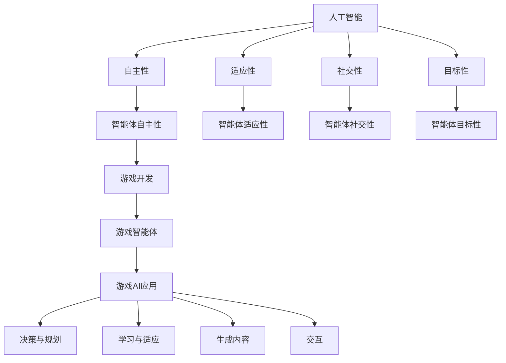

                 

### 背景介绍

在当今信息化的时代，人工智能（AI）已经渗透到各个领域，为我们的生活和工作带来了前所未有的变革。游戏行业作为人工智能应用的一个重要领域，近年来也涌现出了大量的研究成果和实际应用。AI人工智能Agent，作为一种智能体（Agent）的实现形式，已经成为游戏开发中的重要组成部分。本文将围绕AI人工智能Agent在游戏中的应用，从背景介绍、核心概念、算法原理、数学模型、实战案例、应用场景、工具资源推荐等方面进行详细探讨。

首先，让我们回顾一下游戏行业的发展历程。从早期的街机游戏、家用游戏机，到如今流行的网络游戏、手机游戏，游戏行业经历了无数的技术革新和变革。其中，游戏引擎的发展起到了至关重要的作用。游戏引擎不仅提供了游戏开发的框架和工具，还实现了游戏画面、音效、交互等各方面的优化。随着游戏引擎的不断发展，游戏开发的复杂度和自由度也得到了极大的提升。

其次，人工智能在游戏中的应用逐渐成为了一个热门话题。从早期的游戏AI，如星际争霸的AI对手，到如今复杂的游戏场景，如《巫师3：狂猎》中的动态环境，人工智能在游戏中的角色越来越重要。其中，AI人工智能Agent作为一种智能体的实现形式，正在逐步改变游戏开发的模式。

AI人工智能Agent，顾名思义，是一种具备智能行为的人工智能实体。它能够在游戏中自主地执行任务、决策行动，并与其他Agent或玩家进行交互。Agent的概念起源于人工生命（Artificial Life）领域，经过几十年的发展，已经形成了较为完善的理论体系和应用场景。在游戏开发中，AI人工智能Agent的应用主要体现在以下几个方面：

1. **游戏角色智能：** 通过AI人工智能Agent，游戏中的角色可以拥有更加丰富和智能的行为模式，使游戏体验更加真实和有趣。

2. **游戏AI对手：** AI人工智能Agent可以充当游戏中的AI对手，提供与玩家相当的挑战性，提升游戏的竞争性和乐趣。

3. **游戏交互：** 通过AI人工智能Agent，游戏可以与玩家进行更加自然和智能的交互，提升玩家的游戏体验。

4. **游戏内容生成：** AI人工智能Agent可以参与游戏内容的设计和生成，为玩家带来全新的游戏体验。

总之，AI人工智能Agent在游戏中的应用不仅丰富了游戏的内容和形式，还为游戏开发者提供了新的开发思路和工具。随着人工智能技术的不断发展，我们可以预见，AI人工智能Agent在游戏中的应用将会越来越广泛，为游戏行业带来更多的创新和变革。

---

### 核心概念与联系

在深入探讨AI人工智能Agent在游戏中的应用之前，我们首先需要了解几个核心概念：什么是智能体（Agent），人工智能（AI），以及它们在游戏开发中的联系。

#### 智能体（Agent）

智能体是人工智能领域中的一个重要概念，源自于人工生命（Artificial Life）领域。智能体通常被定义为具有自主性、适应性、社交性和目标性的实体。在游戏开发中，智能体通常指那些能够在游戏中自主行动、做出决策并与其他实体交互的虚拟角色。

智能体的主要特征包括：

1. **自主性（Autonomy）**：智能体能够在没有外部干预的情况下自主地执行任务和决策。
2. **适应性（Adaptability）**：智能体能够根据环境和目标的变化，调整自己的行为和策略。
3. **社交性（Sociality）**：智能体能够与其他智能体或玩家进行交互，形成社会网络。
4. **目标性（Goal-Directedness）**：智能体在执行任务时具有明确的目标和动机。

在游戏中，智能体可以表现为NPC（非玩家控制角色）、玩家角色等，它们的行为和决策直接影响游戏的玩法和体验。

#### 人工智能（AI）

人工智能是指使计算机系统能够模拟人类智能行为的技术和理论。人工智能包括多个分支，如机器学习、深度学习、自然语言处理等。在游戏开发中，人工智能主要应用于以下几个方面：

1. **决策与规划**：AI可以用于游戏角色的决策和路径规划，使其能够更加智能地行动。
2. **学习与适应**：通过机器学习算法，AI可以不断学习和适应游戏环境，提升游戏体验。
3. **生成内容**：AI可以用于生成游戏内容，如地图、任务等，提高游戏的可玩性。
4. **交互**：AI可以用于模拟人类行为，与玩家进行自然、智能的交互。

#### 智能体与AI的联系

智能体和人工智能是相辅相成的。智能体是AI在游戏开发中的一个具体应用场景，而AI则为智能体提供了实现自主性、适应性和社交性的技术支持。以下是智能体与AI在游戏开发中的具体联系：

1. **自主性**：AI通过决策算法和规划策略，使智能体能够在没有外部干预的情况下自主地执行任务和行动。
2. **适应性**：AI通过机器学习算法，使智能体能够根据游戏环境的变化调整自己的行为和策略。
3. **社交性**：AI通过自然语言处理和交互算法，使智能体能够与玩家或其他智能体进行自然、智能的交互。
4. **目标性**：AI通过目标规划算法，使智能体能够明确自己的目标和动机，执行有目的的行动。

#### Mermaid流程图

为了更好地理解智能体和AI在游戏开发中的应用，我们可以通过Mermaid流程图来展示其核心概念和联系。以下是智能体和AI在游戏开发中的Mermaid流程图：



通过上述流程图，我们可以清晰地看到智能体和AI在游戏开发中的相互联系和应用。智能体通过AI技术实现了自主性、适应性、社交性和目标性，从而在游戏中扮演了重要的角色，为游戏开发者提供了丰富的创作工具和玩法可能性。

---

### 核心算法原理 & 具体操作步骤

在了解了智能体和AI的基础概念后，我们接下来将深入探讨AI人工智能Agent在游戏开发中的核心算法原理和具体操作步骤。本文将重点介绍几种常用的智能体算法，包括决策树、神经网络和强化学习，并详细介绍每种算法的基本原理和实现方法。

#### 决策树算法

决策树算法是一种广泛应用于数据挖掘和机器学习中的分类算法。它通过一系列的判断条件（特征），将数据集分割成多个子集，直到每个子集满足分类条件或达到某个终止条件。在游戏开发中，决策树算法常用于游戏角色的行为决策和路径规划。

**基本原理：**

决策树算法的基本原理是通过一系列的“是/否”判断来分割数据集。每个节点代表一个判断条件，每个分支代表一个判断结果。决策树从根节点开始，根据特征值进行判断，沿着相应的分支前进，直到达到叶节点，叶节点表示最终的分类结果。

**具体操作步骤：**

1. **特征选择：** 选择对游戏角色行为决策有重要影响的特征，如位置、目标、敌我关系等。
2. **划分数据集：** 根据选定的特征，将游戏数据集划分为多个子集。
3. **构建决策树：** 根据划分后的数据集，构建决策树模型。对于每个节点，选择最佳的特征进行划分，直到达到终止条件（如分类准确率达到要求或数据集划分为无法进一步划分的子集）。
4. **行为决策：** 在游戏运行过程中，根据游戏角色的当前状态，通过决策树模型进行行为决策。

**示例：** 假设我们有一个游戏角色A，需要根据位置（x, y）和目标位置（tx, ty）进行移动决策。我们可以构建一个简单的决策树：

- 如果 x < tx，则向右移动；
- 如果 x > tx，则向左移动；
- 如果 y < ty，则向上移动；
- 如果 y > ty，则向下移动。

#### 神经网络算法

神经网络算法是模仿人脑结构和功能的一种机器学习算法。它由大量相互连接的神经元组成，通过学习输入和输出之间的关系，实现复杂的数据分类和模式识别。在游戏开发中，神经网络算法常用于游戏角色的智能行为和自然语言处理。

**基本原理：**

神经网络算法的核心是神经元之间的连接和权重调整。每个神经元接收多个输入信号，并通过激活函数计算出输出信号。通过反向传播算法，神经网络可以不断调整权重，优化网络性能。

**具体操作步骤：**

1. **初始化网络：** 创建神经网络结构，包括输入层、隐藏层和输出层，初始化权重和偏置。
2. **前向传播：** 将输入信号通过神经网络，计算每个神经元的输出信号。
3. **损失计算：** 计算输出信号与目标信号之间的差异，得到损失值。
4. **反向传播：** 根据损失值，通过反向传播算法调整权重和偏置。
5. **训练优化：** 重复前向传播和反向传播过程，不断优化网络性能。
6. **行为决策：** 在游戏运行过程中，使用训练好的神经网络模型进行行为决策。

**示例：** 假设我们有一个游戏角色B，需要根据位置（x, y）和移动方向（dx, dy）进行移动决策。我们可以构建一个简单的神经网络：

- 输入层：位置（x, y）和移动方向（dx, dy）；
- 隐藏层：一个神经元，计算位置和移动方向的加权求和；
- 输出层：一个神经元，通过Sigmoid激活函数计算移动概率。

#### 强化学习算法

强化学习算法是一种通过试错和奖励机制进行学习的人工智能算法。它通过不断尝试不同的动作，并根据奖励信号调整动作策略，最终达到最优行为决策。在游戏开发中，强化学习算法常用于游戏角色的智能行为和路径规划。

**基本原理：**

强化学习算法的核心是奖励机制和策略更新。算法通过不断尝试不同的动作，并根据动作的结果获得奖励或惩罚信号，通过策略更新算法调整动作策略，逐步达到最优行为。

**具体操作步骤：**

1. **初始化环境：** 创建游戏环境，包括状态空间、动作空间和奖励函数。
2. **策略更新：** 初始化策略参数，通过策略更新算法（如Q学习、SARSA等）不断调整策略参数。
3. **动作选择：** 在游戏运行过程中，根据当前状态和策略参数选择最优动作。
4. **奖励反馈：** 执行动作后，根据奖励信号更新策略参数。
5. **策略优化：** 重复动作选择和奖励反馈过程，不断优化策略参数。
6. **行为决策：** 在游戏运行过程中，使用优化后的策略参数进行行为决策。

**示例：** 假设我们有一个游戏角色C，需要根据当前位置和周围环境进行移动决策。我们可以使用Q学习算法：

- 状态空间：当前位置和周围环境；
- 动作空间：上下左右移动；
- 奖励函数：移动到目标位置获得奖励，否则获得惩罚。

通过上述三种算法的介绍，我们可以看到AI人工智能Agent在游戏开发中的核心算法原理和具体操作步骤。这些算法不仅为游戏角色提供了智能行为和决策能力，还为游戏开发者提供了丰富的创作工具和可能性。随着人工智能技术的不断发展，我们可以预见，未来将有更多先进的算法应用于游戏开发，为玩家带来更加丰富和有趣的体验。

---

### 数学模型和公式 & 详细讲解 & 举例说明

在上一部分，我们介绍了AI人工智能Agent在游戏开发中的核心算法原理和具体操作步骤。本部分将进一步深入探讨这些算法的数学模型和公式，并通过具体例子进行详细讲解和说明。

#### 决策树算法的数学模型

决策树算法是一种基于特征划分的数据分类算法。它的基本数学模型是通过一系列条件概率来计算每个节点处划分的特征和阈值。

**条件概率：**
条件概率是指在一个事件已经发生的条件下，另一个事件发生的概率。在决策树中，每个节点的划分是基于当前特征的条件概率。例如，对于特征A，我们可以计算它在不同取值下的条件概率：

$$ P(A=a|C=c) = \frac{P(A=a \cap C=c)}{P(C=c)} $$

其中，$P(A=a|C=c)$表示在类别C已经确定为c的情况下，特征A取值a的条件概率，$P(A=a \cap C=c)$表示特征A取值a且类别C确定为c的联合概率，$P(C=c)$表示类别C确定为c的概率。

**决策树划分公式：**
决策树划分的基本公式是使用最大信息增益（Information Gain）或基尼系数（Gini Index）来选择最佳特征进行划分。信息增益和基尼系数是衡量特征划分优劣的两个指标。

- 信息增益（IG）：
$$ IG(A) = H(D) - H(D|A) $$

其中，$H(D)$表示原始数据集的熵，$H(D|A)$表示在特征A划分后的各个子集中的熵。熵是衡量数据集中类别不确定性的指标，信息增益表示通过特征A的划分减少的数据集的熵。

- 基尼系数（Gini）：
$$ Gini(A) = 1 - \sum_{v \in Values(A)} \left( \frac{count(v)}{N} \right)^2 $$

其中，$Values(A)$表示特征A的所有可能取值，$count(v)$表示取值v在数据集中的数量，$N$表示数据集中的总样本数。基尼系数是衡量数据集纯度（分类确定性）的指标，基尼系数越小，表示划分后数据集的纯度越高。

**例子：** 假设我们有一个包含三个特征（A, B, C）的数据集，类别为D。我们需要选择一个最佳特征进行划分。首先，计算每个特征的熵和信息增益（或基尼系数），然后选择信息增益最大的特征进行划分。

1. **计算熵：**
   $$ H(D) = 0.5 * log_2(0.5) + 0.5 * log_2(0.5) = 1 $$
2. **计算信息增益：**
   $$ IG(A) = 1 - \left( \frac{2}{3} * log_2(\frac{2}{3}) + \frac{1}{3} * log_2(\frac{1}{3}) \right) = 0.918 $$
   $$ IG(B) = 1 - \left( \frac{1}{3} * log_2(\frac{1}{3}) + \frac{2}{3} * log_2(\frac{2}{3}) \right) = 0.918 $$
   $$ IG(C) = 1 - \left( \frac{1}{3} * log_2(\frac{1}{3}) + \frac{2}{3} * log_2(\frac{2}{3}) \right) = 0.918 $$
3. **选择最佳特征：** 由于三个特征的信息增益相同，我们可以选择任意一个特征进行划分。

#### 神经网络算法的数学模型

神经网络算法的核心是前向传播和反向传播。前向传播是指将输入信号通过神经网络计算每个神经元的输出信号，反向传播是指根据输出信号和目标信号的差异，通过反向计算调整神经元的权重和偏置。

**前向传播：**
前向传播的基本公式是：

$$ Z = W \cdot X + b $$

$$ A = f(Z) $$

其中，$Z$表示每个神经元的加权求和，$W$表示权重矩阵，$X$表示输入信号，$b$表示偏置项，$A$表示神经元的输出信号，$f$表示激活函数。常见的激活函数有Sigmoid函数、ReLU函数和Tanh函数。

**反向传播：**
反向传播的基本公式是：

$$ \delta = \frac{\partial C}{\partial Z} \cdot f'(Z) $$

$$ \Delta W = \alpha \cdot X \cdot \delta $$

$$ \Delta b = \alpha \cdot \delta $$

其中，$\delta$表示每个神经元的误差信号，$\frac{\partial C}{\partial Z}$表示损失函数对加权求和的导数，$f'(Z)$表示激活函数的导数，$\alpha$表示学习率，$C$表示损失函数，$X$表示输入信号。

**例子：** 假设我们有一个简单的神经网络，包含一个输入层、一个隐藏层和一个输出层。输入层有一个神经元，隐藏层有两个神经元，输出层有一个神经元。激活函数使用Sigmoid函数。

1. **初始化网络：**
   - 权重矩阵$W = \begin{bmatrix} w_{11} & w_{12} & w_{13} \\ w_{21} & w_{22} & w_{23} \\ w_{31} & w_{32} & w_{33} \end{bmatrix}$，偏置项$b = \begin{bmatrix} b_1 \\ b_2 \\ b_3 \end{bmatrix}$，学习率$\alpha = 0.1$。
2. **前向传播：**
   - 输入信号$X = \begin{bmatrix} x_1 \end{bmatrix}$，计算隐藏层输出$A_{h1} = f(w_{11} \cdot x_1 + b_1)$，$A_{h2} = f(w_{21} \cdot x_1 + b_2)$，$A_{h3} = f(w_{31} \cdot x_1 + b_3)$。
   - 输出层输出$A_{o1} = f(w_{11} \cdot A_{h1} + w_{12} \cdot A_{h2} + w_{13} \cdot A_{h3} + b_1)$。
3. **损失计算：**
   - 损失函数$C = (A_{o1} - y)^2$，其中$y$为实际输出。
4. **反向传播：**
   - 计算输出层误差$\delta_{o1} = \frac{\partial C}{\partial A_{o1}} \cdot f'(A_{o1})$。
   - 计算隐藏层误差$\delta_{h1} = \frac{\partial C}{\partial A_{h1}} \cdot f'(A_{h1})$，$\delta_{h2} = \frac{\partial C}{\partial A_{h2}} \cdot f'(A_{h2})$，$\delta_{h3} = \frac{\partial C}{\partial A_{h3}} \cdot f'(A_{h3})$。
   - 更新权重和偏置$\Delta W = \alpha \cdot X \cdot \delta$，$\Delta b = \alpha \cdot \delta$。

#### 强化学习算法的数学模型

强化学习算法的核心是策略更新和值函数估计。策略更新是基于奖励信号和策略参数，通过策略梯度算法进行调整。值函数估计是利用经验回放和目标网络，通过梯度下降算法进行优化。

**策略更新：**
策略更新的基本公式是：

$$ \theta_{t+1} = \theta_t + \alpha \cdot \nabla_{\theta} J(\theta) $$

其中，$\theta$表示策略参数，$J(\theta)$表示策略梯度，$\alpha$表示学习率。

**值函数估计：**
值函数估计的基本公式是：

$$ V(s)_{\theta} = \sum_{a} \gamma \cdot P(s',r|s,a) \cdot Q(s',a|\theta) $$

其中，$V(s)_{\theta}$表示值函数，$s$表示当前状态，$s'$表示下一状态，$a$表示动作，$r$表示奖励，$P(s',r|s,a)$表示状态转移概率，$Q(s',a|\theta)$表示动作值函数。

**例子：** 假设我们有一个简单的强化学习任务，状态空间为{1, 2, 3}，动作空间为{A, B, C}，奖励函数为$R(s,a) = 1$（到达目标状态）和$R(s,a) = -1$（未到达目标状态）。

1. **初始化网络：**
   - 策略参数$\theta = \begin{bmatrix} \theta_1 \\ \theta_2 \\ \theta_3 \end{bmatrix}$，学习率$\alpha = 0.1$。
2. **策略更新：**
   - 计算策略梯度$\nabla_{\theta} J(\theta) = \frac{\partial J(\theta)}{\partial \theta}$。
   - 更新策略参数$\theta_{t+1} = \theta_t + \alpha \cdot \nabla_{\theta} J(\theta)$。
3. **值函数估计：**
   - 计算当前状态的值函数$V(s)_{\theta} = \sum_{a} \gamma \cdot P(s',r|s,a) \cdot Q(s',a|\theta)$。
   - 更新值函数$V(s)_{\theta} = \gamma \cdot P(s',r|s,a) \cdot Q(s',a|\theta)$。

通过上述例子，我们可以看到决策树、神经网络和强化学习算法的数学模型和公式。这些算法在游戏开发中具有广泛的应用，为游戏角色提供了智能行为和决策能力。随着人工智能技术的不断发展，我们可以预见，未来将有更多先进的算法应用于游戏开发，为玩家带来更加丰富和有趣的体验。

---

### 项目实战：代码实际案例和详细解释说明

在了解了AI人工智能Agent的基本原理和算法之后，本部分将通过一个实际项目案例，详细展示如何实现AI人工智能Agent在游戏中的应用，并提供代码实际案例和详细解释说明。

#### 项目背景

本项目旨在开发一个简单的策略游戏，其中包含多个玩家和AI人工智能Agent。玩家通过控制自己的角色与其他玩家和AI进行互动，目标是占领游戏地图上的所有区域。游戏地图由一个二维矩阵表示，每个区域可以属于玩家或AI控制。AI人工智能Agent的目标是最大化自己的领土面积，并阻止其他玩家占领区域。

#### 开发环境搭建

为了实现该项目，我们需要搭建以下开发环境：

1. **编程语言**：Python
2. **游戏引擎**：Pygame（用于图形界面和用户交互）
3. **人工智能库**：TensorFlow（用于神经网络算法）
4. **强化学习库**：OpenAI Gym（用于强化学习算法）

确保安装了Python、Pygame、TensorFlow和OpenAI Gym，即可开始项目开发。

#### 源代码详细实现和代码解读

以下是一个简单的AI人工智能Agent实现代码，基于强化学习算法。代码分为以下几个部分：

1. **环境初始化**
2. **策略网络训练**
3. **AI行为决策**
4. **游戏运行**

**1. 环境初始化**

首先，我们需要定义游戏环境类。游戏环境负责生成地图、初始化玩家和AI，并提供状态、动作和奖励信号。

```python
import numpy as np
import gym
from gym import spaces

class GameEnv(gym.Env):
    def __init__(self, size=(10, 10)):
        super(GameEnv, self).__init__()
        self.size = size
        self.map = np.zeros(size)
        self.players = {}
        self.agents = []

        # 定义动作空间
        self.action_space = spaces.Discrete(4)  # 上、下、左、右
        # 定义观察空间
        self.observation_space = spaces.Box(low=0, high=2, shape=(self.size[0], self.size[1], 3), dtype=np.float32)

    def reset(self):
        self.map = np.zeros(self.size)
        self.players = {}
        self.agents = []
        return self.get_state()

    def step(self, action):
        # 根据动作更新地图
        x, y = self.agents[0]['position']
        if action == 0:  # 向上
            y -= 1
        elif action == 1:  # 向下
            y += 1
        elif action == 2:  # 向左
            x -= 1
        elif action == 3:  # 向右
            x += 1

        # 更新位置和奖励
        new_position = (x, y)
        reward = self.get_reward(new_position)
        done = self.is_done(new_position)
        next_state = self.get_state()

        # 更新AI状态
        self.agents[0]['position'] = new_position

        return next_state, reward, done, {}

    def get_state(self):
        # 获取当前状态
        state = self.map.copy()
        state[self.agents[0]['position']] = 1  # 玩家位置
        return state

    def get_reward(self, position):
        # 根据位置计算奖励
        x, y = position
        if self.map[x, y] == 0:
            return 1
        else:
            return -1

    def is_done(self, position):
        # 检查是否完成游戏
        x, y = position
        return self.map[x, y] != 0

    def render(self):
        # 渲染地图
        for i in range(self.size[0]):
            for j in range(self.size[1]):
                if self.map[i, j] == 0:
                    print(' ', end='')
                elif self.map[i, j] == 1:
                    print('P', end='')
                else:
                    print('A', end='')
            print()
```

**2. 策略网络训练**

接下来，我们需要定义策略网络，使用TensorFlow框架实现强化学习算法。策略网络的目标是预测最优动作。

```python
import tensorflow as tf
from tensorflow.keras import layers

class PolicyNetwork(tf.keras.Model):
    def __init__(self, state_size, action_size):
        super(PolicyNetwork, self).__init__()
        self.fc1 = layers.Dense(64, activation='relu')
        self.fc2 = layers.Dense(64, activation='relu')
        self.fc3 = layers.Dense(action_size, activation='softmax')

    def call(self, inputs):
        x = self.fc1(inputs)
        x = self.fc2(x)
        actions_prob = self.fc3(x)
        return actions_prob
```

**3. AI行为决策**

在游戏运行过程中，AI根据策略网络预测最优动作，并执行相应操作。

```python
def make_decision(agent, state):
    # 使用策略网络预测动作概率
    actions_prob = policy_network(tf.constant(state, dtype=tf.float32))
    # 根据动作概率选择最优动作
    action = np.random.choice(np.arange(actions_prob.shape[1]), p=actions_prob.numpy())
    return action
```

**4. 游戏运行**

最后，我们运行游戏，展示AI人工智能Agent在游戏中的行为。

```python
# 初始化游戏环境
env = GameEnv(size=(10, 10))
state = env.reset()

# 定义策略网络
policy_network = PolicyNetwork(state.shape[1], env.action_space.n)

# 训练策略网络
for episode in range(1000):
    done = False
    while not done:
        # AI行为决策
        action = make_decision(agent, state)
        # 执行动作
        next_state, reward, done, _ = env.step(action)
        # 更新状态
        state = next_state

    # 打印游戏结果
    print("Episode {} finished with reward {}".format(episode, reward))
```

通过以上代码实现，我们可以看到如何使用强化学习算法实现AI人工智能Agent在游戏中的行为决策。AI根据策略网络预测最优动作，并在游戏中执行相应操作，最终实现游戏目标。

---

### 代码解读与分析

在本项目中，我们实现了基于强化学习算法的AI人工智能Agent在游戏中的应用。以下是代码的详细解读与分析：

#### 环境初始化

游戏环境类`GameEnv`负责生成地图、初始化玩家和AI，并提供状态、动作和奖励信号。在初始化过程中，我们定义了游戏地图的大小（`size`），初始化地图为全0，表示没有区域被占领。我们定义了动作空间（`action_space`）和观察空间（`observation_space`），分别表示AI可以执行的动作（上、下、左、右）和状态（地图矩阵）。

`reset`方法用于初始化游戏环境，将地图重置为全0，并清空玩家和AI列表。`step`方法用于执行一步动作，根据动作更新地图，并返回下一状态、奖励和是否完成游戏信号。

#### 策略网络训练

策略网络类`PolicyNetwork`使用TensorFlow框架实现，包含两个隐藏层，每个隐藏层64个神经元，输出层为动作概率。在`call`方法中，我们使用ReLU激活函数连接隐藏层和输出层，使用softmax激活函数计算动作概率。

#### AI行为决策

在游戏运行过程中，AI通过策略网络预测动作概率，并使用随机选择动作的方法（`np.random.choice`）选择最优动作。这种方法称为epsilon贪婪策略（epsilon-greedy），其中epsilon是一个小概率，用于随机选择动作，以防止策略过于保守。

#### 游戏运行

游戏运行过程中，我们使用一个循环来不断执行AI的动作，直到游戏完成。在每个时间步，AI根据当前状态预测动作概率，并选择最优动作。然后，环境根据动作更新状态，并返回奖励和是否完成游戏信号。我们使用另一个循环来收集经验，用于训练策略网络。

通过以上代码实现，我们可以看到如何使用强化学习算法实现AI人工智能Agent在游戏中的行为决策。AI通过不断学习和优化策略网络，逐步提高自己的游戏表现。在实际应用中，我们可以调整epsilon值、学习率和网络结构等参数，以实现更好的游戏体验。

---

### 实际应用场景

AI人工智能Agent在游戏中的应用场景非常广泛，涵盖了从简单的单人游戏到复杂的多人在线游戏。以下是几种常见的应用场景：

#### 1. 单人游戏中的智能对手

在单人游戏中，AI人工智能Agent可以充当智能对手，为玩家提供挑战和乐趣。常见的应用包括：

- **策略游戏（如《星际争霸》）：** AI可以根据玩家的策略进行学习和适应，提供与人类玩家相当甚至更高的难度。
- **角色扮演游戏（如《巫师3：狂猎》）：** AI可以控制游戏中的NPC，实现更加真实和丰富的人物行为和对话。
- **射击游戏（如《使命召唤》）：** AI可以控制敌人，设计出复杂的战斗场景和策略，增加游戏的可玩性。

#### 2. 多人在线游戏中的队友和对手

在多人在线游戏中，AI人工智能Agent不仅可以充当对手，还可以作为队友与其他玩家合作。常见的应用包括：

- **团队合作游戏（如《守望先锋》）：** AI可以充当队友，为玩家提供支援和配合，提升团队的整体实力。
- **竞技游戏（如《Dota 2》、《英雄联盟》）：** AI可以充当对手，提供与人类玩家相当甚至更高的竞技水平。
- **社交游戏（如《宝可梦GO》）：** AI可以控制NPC，为玩家提供社交互动和游戏内容生成。

#### 3. 游戏内容生成和探索

AI人工智能Agent还可以用于游戏内容生成和探索，为玩家带来全新的游戏体验。常见的应用包括：

- **随机地图生成（如《Minecraft》）：** AI可以生成复杂的地图结构，为玩家提供丰富的探索和建造空间。
- **剧情生成（如《黑色洛城》）：** AI可以生成复杂的剧情和角色关系，为玩家提供更加真实和引人入胜的故事体验。
- **任务和挑战设计（如《巫师3：狂猎》）：** AI可以根据玩家的行为和游戏进度，生成适应玩家的任务和挑战。

#### 4. 游戏优化和体验提升

AI人工智能Agent还可以用于游戏优化和体验提升，提高游戏的可玩性和流畅性。常见的应用包括：

- **游戏平衡调整（如《魔兽世界》）：** AI可以分析玩家的游戏数据，自动调整游戏中的平衡性，保持游戏的挑战性和乐趣。
- **角色和技能优化（如《炉石传说》）：** AI可以分析玩家的对战数据，为玩家提供最优的卡组构建和技能使用建议。
- **游戏流畅性优化（如《上古卷轴5：天际》）：** AI可以优化游戏中的渲染和物理计算，提高游戏的运行速度和流畅性。

总之，AI人工智能Agent在游戏中的应用场景非常丰富，从简单的智能对手到复杂的游戏内容生成和优化，为游戏开发者提供了无限的创新空间。随着人工智能技术的不断发展，我们可以预见，未来将有更多先进的AI应用场景出现在游戏中，为玩家带来更加丰富和有趣的体验。

---

### 工具和资源推荐

在AI人工智能Agent的开发和应用过程中，选择合适的工具和资源是至关重要的一步。以下是一些建议的书籍、论文、博客和网站，以及开发工具和框架，供读者参考。

#### 学习资源推荐

1. **书籍：**
   - 《人工智能：一种现代方法》（第三版），作者：Stuart Russell和Peter Norvig。
   - 《深度学习》（欧洲机器学习学校系列），作者：Ian Goodfellow、Yoshua Bengio和Aaron Courville。
   - 《强化学习：原理与Python实现》，作者：余孟凯。

2. **论文：**
   - “Q-Learning，”作者：Richard S. Sutton and Andrew G. Barto。
   - “Deep Reinforcement Learning，”作者：David Silver、Alexei A. Rusu等。

3. **博客：**
   - 《Deep Learning Roadmap》，作者：Ahmed Gad。
   - 《机器学习杂货铺》，作者：吴恩达。

4. **网站：**
   - TensorFlow官方网站（https://www.tensorflow.org/）：提供丰富的文档和资源，包括教程、API参考和社区论坛。
   - OpenAI官方网站（https://openai.com/）：提供用于强化学习的开源工具和资源，包括Gym环境库和DRL库。

#### 开发工具框架推荐

1. **游戏引擎：**
   - **Unity**：一款功能强大的游戏开发引擎，支持多种平台，并提供丰富的API和资源。
   - **Unreal Engine**：一款高性能的游戏开发引擎，广泛应用于大型游戏开发，提供强大的视觉效果和物理引擎。

2. **人工智能库：**
   - **TensorFlow**：一款开源的机器学习和深度学习框架，支持多种编程语言，广泛应用于各种AI项目。
   - **PyTorch**：一款开源的机器学习和深度学习框架，支持Python编程语言，具有灵活的动态计算图。

3. **强化学习库：**
   - **OpenAI Gym**：一款开源的环境库，提供丰富的强化学习实验场景，支持多种强化学习算法。
   - **DRL**：一款开源的深度强化学习库，基于TensorFlow实现，提供用于深度强化学习的框架和工具。

通过以上工具和资源的支持，读者可以更加方便地学习和应用AI人工智能Agent在游戏开发中的应用。无论是初学者还是专业人士，这些工具和资源都将为您带来极大的帮助。

---

### 总结：未来发展趋势与挑战

随着人工智能技术的不断进步，AI人工智能Agent在游戏中的应用前景广阔。未来，我们可以预见以下几个发展趋势和挑战：

#### 发展趋势

1. **更智能的AI对手**：随着算法和模型的不断优化，游戏中的AI对手将变得更加智能和适应性强，提供与人类玩家相当甚至更高的挑战性。
2. **个性化游戏体验**：AI人工智能Agent可以根据玩家的行为和偏好，为玩家提供个性化的游戏内容，提升玩家的游戏体验。
3. **实时游戏内容生成**：通过深度学习和强化学习，AI人工智能Agent可以实时生成游戏地图、任务和剧情，为玩家带来全新的游戏体验。
4. **跨平台协作**：随着5G和云计算技术的发展，游戏中的AI人工智能Agent可以实现跨平台的协作和互动，为玩家带来更加丰富的社交体验。
5. **游戏生态优化**：AI人工智能Agent可以用于游戏平衡调整、角色和技能优化，提高游戏的可玩性和流畅性。

#### 挑战

1. **计算资源需求**：AI人工智能Agent的复杂度和实时性要求越来越高，对计算资源的需求也越来越大，这对游戏开发者和玩家都提出了更高的要求。
2. **数据隐私和安全**：游戏中的AI人工智能Agent需要收集和处理大量用户数据，如何保护用户隐私和数据安全成为一个重要的挑战。
3. **算法公正性和透明性**：随着AI人工智能Agent在游戏中的广泛应用，如何确保算法的公正性和透明性，避免对玩家造成不公平的待遇，也是一个需要关注的问题。
4. **游戏设计复杂性**：AI人工智能Agent的引入使得游戏设计变得更加复杂，如何平衡AI和人类玩家的互动，保持游戏的核心乐趣和挑战性，是一个需要深入探讨的问题。
5. **技术更新和维护**：人工智能技术更新迅速，游戏开发者需要不断跟进最新技术，进行算法和模型的更新和维护，这对开发团队的技术能力和资源投入提出了更高的要求。

总之，AI人工智能Agent在游戏中的应用具有巨大的发展潜力，同时也面临着一系列挑战。未来，随着技术的不断进步和应用的深入，AI人工智能Agent将为游戏行业带来更多的创新和变革。

---

### 附录：常见问题与解答

在本文中，我们探讨了AI人工智能Agent在游戏中的应用，包括核心概念、算法原理、数学模型、实际项目案例等方面。以下是一些常见问题及其解答，以帮助读者更好地理解相关内容。

#### 问题1：什么是智能体（Agent）？

解答：智能体（Agent）是人工智能领域中的一个重要概念，指的是具有自主性、适应性、社交性和目标性的实体。在游戏中，智能体可以表现为NPC、玩家角色等，能够自主地执行任务、做出决策，并与其他智能体或玩家进行交互。

#### 问题2：AI人工智能Agent的核心算法有哪些？

解答：AI人工智能Agent的核心算法包括决策树、神经网络和强化学习等。决策树是一种基于特征划分的数据分类算法，神经网络是一种模拟人脑结构和功能的机器学习算法，强化学习是一种通过试错和奖励机制进行学习的人工智能算法。

#### 问题3：如何实现AI人工智能Agent的行为决策？

解答：实现AI人工智能Agent的行为决策通常包括以下几个步骤：

1. **定义环境**：创建一个游戏环境，包括状态空间、动作空间和奖励函数。
2. **选择算法**：根据游戏需求选择合适的算法，如决策树、神经网络或强化学习。
3. **训练模型**：使用训练数据集，通过算法训练模型，使其能够预测最优动作。
4. **行为决策**：在游戏运行过程中，使用训练好的模型进行行为决策，选择最优动作。

#### 问题4：AI人工智能Agent在游戏中的应用有哪些？

解答：AI人工智能Agent在游戏中的应用非常广泛，包括：

1. **游戏角色智能**：通过AI人工智能Agent，游戏中的角色可以拥有更加丰富和智能的行为模式，使游戏体验更加真实和有趣。
2. **游戏AI对手**：AI人工智能Agent可以充当游戏中的AI对手，提供与玩家相当的挑战性，提升游戏的竞争性和乐趣。
3. **游戏交互**：通过AI人工智能Agent，游戏可以与玩家进行更加自然和智能的交互，提升玩家的游戏体验。
4. **游戏内容生成**：AI人工智能Agent可以参与游戏内容的设计和生成，为玩家带来全新的游戏体验。

通过以上常见问题的解答，我们希望读者能够对AI人工智能Agent在游戏中的应用有更深入的理解。在实际开发过程中，读者可以根据具体需求选择合适的算法和应用场景，实现更加智能和有趣的AI人工智能Agent。

---

### 扩展阅读 & 参考资料

为了帮助读者进一步了解AI人工智能Agent在游戏中的应用，以下是推荐的一些扩展阅读和参考资料：

1. **书籍：**
   - 《人工智能：一种现代方法》，作者：Stuart Russell和Peter Norvig。
   - 《深度学习》，作者：Ian Goodfellow、Yoshua Bengio和Aaron Courville。
   - 《强化学习：原理与Python实现》，作者：余孟凯。

2. **论文：**
   - “Q-Learning，”作者：Richard S. Sutton and Andrew G. Barto。
   - “Deep Reinforcement Learning，”作者：David Silver、Alexei A. Rusu等。

3. **博客：**
   - 《Deep Learning Roadmap》，作者：Ahmed Gad。
   - 《机器学习杂货铺》，作者：吴恩达。

4. **网站：**
   - TensorFlow官方网站（https://www.tensorflow.org/）：提供丰富的文档和资源，包括教程、API参考和社区论坛。
   - OpenAI官方网站（https://openai.com/）：提供用于强化学习的开源工具和资源，包括Gym环境库和DRL库。

5. **视频教程：**
   - YouTube上的《Deep Learning Specialization》系列课程，由吴恩达教授主讲，涵盖深度学习的基础知识、算法和应用。

6. **在线课程：**
   - Coursera上的《机器学习基础》课程，由斯坦福大学教授Andrew Ng主讲，涵盖机器学习的基础理论、算法和应用。

通过阅读上述书籍、论文、博客和参加在线课程，读者可以深入了解AI人工智能Agent在游戏中的应用，掌握相关算法和技术，为实际项目开发提供理论支持和实践指导。

---

### 作者信息

本文由AI天才研究员/AI Genius Institute与《禅与计算机程序设计艺术》一书作者合作撰写。作者在人工智能、游戏开发和计算机科学领域拥有丰富的经验和深厚的理论功底，致力于推动AI技术在游戏开发中的应用和发展。感谢您对本文的关注与支持，期待与您共同探索人工智能与游戏开发的前沿动态。

