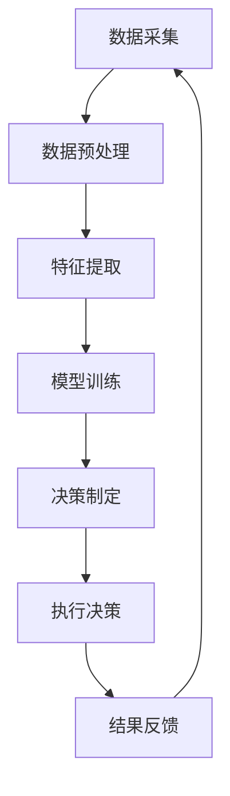

                 

### 文章标题

**AI人工智能代理工作流 AI Agent WorkFlow：在决策支持系统中的应用**

### 关键词：  
AI人工智能、代理工作流、决策支持系统、流程自动化、智能优化、数据驱动决策

### 摘要：  
本文深入探讨了AI人工智能代理工作流（AI Agent WorkFlow）的概念及其在决策支持系统中的应用。通过剖析代理工作流的核心组件、工作原理和实现步骤，本文旨在展示如何利用AI技术提升决策支持系统的智能化和自动化水平，从而实现更高效、更准确的数据驱动决策。

本文结构如下：

1. 背景介绍
2. 核心概念与联系
3. 核心算法原理 & 具体操作步骤
4. 数学模型和公式 & 详细讲解 & 举例说明
5. 项目实践：代码实例和详细解释说明
6. 实际应用场景
7. 工具和资源推荐
8. 总结：未来发展趋势与挑战
9. 附录：常见问题与解答
10. 扩展阅读 & 参考资料

现在，让我们正式进入文章的正文部分，详细探讨AI人工智能代理工作流及其应用。

## 1. 背景介绍（Background Introduction）

在当今快速发展的数字化时代，企业和组织面临的数据量和复杂度都在不断增加。传统的决策支持系统（Decision Support Systems，DSS）往往依赖于人工干预和数据整理，这不仅效率低下，而且容易出错。为了应对这种挑战，人工智能（AI）技术，特别是机器学习和深度学习，开始逐步融入到决策支持系统中。

AI人工智能代理工作流（AI Agent WorkFlow）是一种利用人工智能技术构建的自动化流程，旨在提高决策支持系统的智能化和自动化水平。代理工作流通过模拟人类的决策过程，实现了从数据采集、处理、分析到决策制定的全程自动化。这一概念源于人工智能代理（AI Agent）的研究，旨在让计算机系统能够像人类一样自主地完成复杂任务。

决策支持系统（DSS）是企业管理信息系统的一个重要分支，它通过模拟、分析、优化等方法，辅助决策者做出更加科学合理的决策。传统的DSS主要依赖于统计数据和模型，而AI人工智能代理工作流则通过引入机器学习算法，使得系统能够根据实时数据动态调整决策策略，从而提高决策的准确性和时效性。

AI人工智能代理工作流在决策支持系统中的应用，不仅能够提高决策效率，还能降低人为错误，减少决策风险。随着AI技术的不断成熟，AI人工智能代理工作流的应用场景也在不断扩展，从简单的数据分析到复杂的业务决策，AI人工智能代理工作流都展现出了巨大的潜力。

本文将从核心概念、算法原理、数学模型、项目实践、应用场景等多个角度，详细探讨AI人工智能代理工作流在决策支持系统中的应用，以期为相关领域的研究和应用提供有价值的参考。

## 2. 核心概念与联系（Core Concepts and Connections）

### 2.1 AI人工智能代理工作流的概念

AI人工智能代理工作流（AI Agent WorkFlow）是指利用人工智能技术构建的一套自动化流程，旨在实现决策支持系统的智能化和自动化。在这一流程中，AI代理（AI Agent）充当了核心角色，它通过感知环境、分析数据、执行任务、反馈结果，形成一个闭环的决策过程。

AI代理通常由感知模块、决策模块、执行模块和反馈模块组成。感知模块负责采集环境数据，如市场趋势、用户需求等；决策模块根据感知到的数据和预定义的规则，生成决策方案；执行模块负责将决策方案转化为实际操作，如调整库存、发布广告等；反馈模块则收集执行结果，为下一次决策提供参考。

### 2.2 AI人工智能代理工作流与传统决策支持系统的区别

传统决策支持系统主要依赖于预定义的模型和算法，这些模型和算法往往需要人工调整和优化。而AI人工智能代理工作流则通过机器学习算法，实现了对数据的自我学习和自我优化。这种自我优化能力使得AI代理工作流能够动态调整决策策略，适应不断变化的环境。

此外，AI人工智能代理工作流在数据处理和分析方面具有显著优势。传统DSS往往需要对数据进行预处理，如清洗、归一化等，而AI代理工作流通过深度学习等技术，可以直接处理原始数据，提高了数据处理和分析的效率。

### 2.3 AI人工智能代理工作流的核心组件

AI人工智能代理工作流的核心组件包括数据采集、数据预处理、特征提取、模型训练、决策制定和执行、结果反馈等。以下是一个简单的AI人工智能代理工作流流程图，用于说明这些组件之间的联系和交互。



#### 数据采集（Data Collection）

数据采集是AI人工智能代理工作流的第一步，它负责从各种来源获取数据。这些数据可以包括内部数据，如企业运营数据、销售数据；也可以是外部数据，如市场趋势、用户行为等。

#### 数据预处理（Data Preprocessing）

数据预处理是对采集到的原始数据进行清洗、归一化、缺失值处理等操作，以确保数据的质量和一致性。这一步骤对于后续的特征提取和模型训练至关重要。

#### 特征提取（Feature Extraction）

特征提取是从预处理后的数据中提取出对模型训练和决策制定有用的特征。这些特征可以是通过统计方法、机器学习方法得到的，也可以是领域专家根据业务需求手工指定的。

#### 模型训练（Model Training）

模型训练是利用提取到的特征，通过机器学习算法训练出能够进行预测和决策的模型。常见的机器学习算法包括线性回归、决策树、支持向量机、神经网络等。

#### 决策制定（Decision Making）

决策制定是基于训练好的模型，对新的数据进行预测和决策。这一过程可以包括多种策略，如最优策略、风险评估策略等。

#### 执行决策（Decision Execution）

执行决策是将决策结果转化为实际操作的过程。这一步骤需要与其他系统（如ERP、CRM等）进行集成，确保决策能够得到有效执行。

#### 结果反馈（Result Feedback）

结果反馈是收集决策执行的结果，并将其反馈到模型训练和决策制定环节，用于模型优化和决策调整。这一过程形成了AI人工智能代理工作流的闭环，使得系统能够持续学习和改进。

通过以上核心组件的协同工作，AI人工智能代理工作流能够实现对决策过程的全程自动化，从而提高决策支持系统的智能化和自动化水平。

### 2.4 AI人工智能代理工作流的优势

AI人工智能代理工作流相比传统决策支持系统，具有以下优势：

- **动态适应性**：AI代理工作流能够根据环境变化和实时数据动态调整决策策略，提高了系统的适应性。
- **自我优化**：通过机器学习算法，系统能够自我优化，提高决策的准确性和效率。
- **数据处理效率**：AI代理工作流可以直接处理原始数据，减少了数据预处理的时间和工作量。
- **降低人为错误**：自动化流程减少了人工干预，降低了人为错误的可能性。
- **可扩展性**：AI代理工作流可以根据业务需求灵活扩展，适用于不同规模和复杂度的业务场景。

总的来说，AI人工智能代理工作流通过引入人工智能技术，不仅提高了决策支持系统的智能化和自动化水平，还为企业和组织提供了更高效、更准确的决策支持。

## 3. 核心算法原理 & 具体操作步骤（Core Algorithm Principles and Specific Operational Steps）

### 3.1 感知模块（Perception Module）

感知模块是AI人工智能代理工作流的核心组件之一，它负责从环境中获取数据。这些数据可以是结构化的，如数据库中的数据，也可以是非结构化的，如图像、文本等。感知模块的实现通常依赖于以下技术：

- **数据采集工具**：如爬虫、API调用等，用于从外部数据源获取数据。
- **传感器**：如温度传感器、摄像头等，用于实时感知环境变化。

具体操作步骤如下：

1. **数据采集**：使用爬虫或API调用从外部数据源获取数据。
2. **数据预处理**：对采集到的数据进行清洗、归一化等处理，以确保数据的质量。
3. **数据存储**：将预处理后的数据存储到数据库或数据仓库中，以供后续使用。

### 3.2 决策模块（Decision Module）

决策模块是AI人工智能代理工作流中的关键组件，它负责根据感知到的数据和预定义的规则，生成决策方案。决策模块的实现通常依赖于以下技术：

- **规则引擎**：用于定义和执行业务规则。
- **机器学习算法**：用于从数据中学习规律，生成预测模型。

具体操作步骤如下：

1. **规则定义**：根据业务需求，定义决策规则和决策策略。
2. **数据输入**：将感知模块获取的数据输入到决策模块。
3. **决策生成**：根据输入数据和预定义的规则，生成决策方案。
4. **决策评估**：对生成的决策方案进行评估，选择最优方案。

### 3.3 执行模块（Execution Module）

执行模块负责将决策模块生成的决策方案转化为实际操作。这一模块的实现通常依赖于以下技术：

- **自动化工具**：如自动化脚本、机器人流程自动化（RPA）等，用于执行具体操作。
- **系统集成**：如与企业资源规划系统（ERP）、客户关系管理系统（CRM）等集成，确保决策能够得到有效执行。

具体操作步骤如下：

1. **决策输入**：将决策模块生成的决策方案输入到执行模块。
2. **操作执行**：根据决策方案，执行具体操作，如调整库存、发布广告等。
3. **结果反馈**：收集执行结果，为下一次决策提供参考。

### 3.4 反馈模块（Feedback Module）

反馈模块负责收集执行结果，并将其反馈到决策模块和感知模块，用于模型优化和决策调整。这一模块的实现通常依赖于以下技术：

- **监控工具**：如日志分析、性能监控等，用于收集执行结果。
- **反馈机制**：如自动调整规则、重新训练模型等，用于优化决策过程。

具体操作步骤如下：

1. **结果收集**：收集执行模块的执行结果。
2. **反馈分析**：对执行结果进行分析，识别问题点和改进空间。
3. **模型优化**：根据反馈结果，调整模型参数或重新训练模型。
4. **决策调整**：根据优化后的模型，调整决策策略。

### 3.5 AI人工智能代理工作流的整体流程

AI人工智能代理工作流的整体流程可以概括为以下步骤：

1. **数据采集**：感知模块从环境中获取数据。
2. **数据预处理**：对采集到的数据进行分析和清洗。
3. **特征提取**：从预处理后的数据中提取出对决策有用的特征。
4. **模型训练**：使用提取到的特征，通过机器学习算法训练预测模型。
5. **决策制定**：根据训练好的模型，生成决策方案。
6. **执行决策**：将决策方案转化为实际操作。
7. **结果反馈**：收集执行结果，进行模型优化和决策调整。

通过以上步骤的循环迭代，AI人工智能代理工作流能够不断优化决策过程，提高决策的准确性和效率。整体流程图如下所示：


## 4. 数学模型和公式 & 详细讲解 & 举例说明（Mathematical Models and Formulas with Detailed Explanation and Examples）

### 4.1 数据采集与预处理

数据采集和预处理是AI人工智能代理工作流的基础，直接影响到后续特征提取和模型训练的效果。以下是一些常用的数学模型和公式：

#### 4.1.1 数据清洗

- **缺失值处理**：常见的缺失值处理方法包括删除缺失值、填充缺失值等。例如，可以使用均值、中位数、最邻近法等来填充缺失值。
  \[ x_{\text{filled}} = \begin{cases}
  \bar{x}, & \text{如果} x \text{是缺失值} \\
  x, & \text{如果} x \text{不是缺失值}
  \end{cases} \]
  其中，\(\bar{x}\)是数据集的均值。

- **数据归一化**：数据归一化可以消除不同特征之间的尺度差异，常见的归一化方法包括最小-最大缩放、Z-Score缩放等。
  \[ x_{\text{normalized}} = \frac{x - \min(x)}{\max(x) - \min(x)} \]
  或
  \[ x_{\text{normalized}} = \frac{x - \mu}{\sigma} \]
  其中，\(\mu\)是均值，\(\sigma\)是标准差。

#### 4.1.2 数据增强

- **随机采样子**：通过随机采样生成新的数据样本，增加数据多样性，常用的方法包括随机翻转、随机裁剪等。
  \[ x_{\text{augmented}} = \text{random_flip}(x) \]
  或
  \[ x_{\text{augmented}} = \text{random_crop}(x, size) \]
  其中，\(x\)是原始数据，\(size\)是裁剪的大小。

### 4.2 特征提取

特征提取是将原始数据转化为对模型训练有用的特征表示。以下是一些常用的特征提取方法：

#### 4.2.1 提取统计特征

- **均值、中位数、标准差**：这些统计特征可以描述数据的中心趋势和离散程度。
  \[ \mu = \frac{1}{n} \sum_{i=1}^{n} x_i \]
  \[ \text{median} = \text{中位数} \]
  \[ \sigma = \sqrt{\frac{1}{n-1} \sum_{i=1}^{n} (x_i - \mu)^2} \]

- **自相关函数**：自相关函数可以描述数据序列的滞后相关性。
  \[ \rho(k) = \frac{\sum_{i=1}^{n} (x_i - \mu)(x_{i+k} - \mu)}{n \sigma^2} \]

#### 4.2.2 提取频域特征

- **傅里叶变换**：傅里叶变换可以将时域信号转换到频域，用于分析信号的频率成分。
  \[ X(\omega) = \sum_{k=-\infty}^{\infty} x(k) e^{-j \omega k} \]

- **小波变换**：小波变换可以更好地捕捉信号的局部特征。
  \[ W(f,t) = \sum_{k=-\infty}^{\infty} x(t) \phi_k^*(t) e^{j 2 \pi f k} \]

### 4.3 模型训练

模型训练是AI人工智能代理工作流的核心步骤，常用的机器学习算法包括线性回归、决策树、支持向量机、神经网络等。以下以线性回归为例进行讲解：

#### 4.3.1 线性回归

- **回归模型**：
  \[ y = \beta_0 + \beta_1 x \]

- **损失函数**：
  \[ J(\theta) = \frac{1}{2m} \sum_{i=1}^{m} (y_i - (\beta_0 + \beta_1 x_i))^2 \]

- **梯度下降**：
  \[ \beta_0 := \beta_0 - \alpha \frac{\partial J(\theta)}{\partial \beta_0} \]
  \[ \beta_1 := \beta_1 - \alpha \frac{\partial J(\theta)}{\partial \beta_1} \]
  其中，\(\alpha\)是学习率，\(\theta\)是参数向量。

### 4.4 决策制定

决策制定是利用训练好的模型对新的数据进行预测和决策。以下以决策树为例进行讲解：

#### 4.4.1 决策树

- **决策树构建**：
  - **信息增益**：
    \[ IG(D, A) = \sum_{v \in V} p(v) \cdot IG(V_v, A) \]
    其中，\(D\)是数据集，\(A\)是特征，\(V\)是特征的所有取值，\(V_v\)是取值为\(v\)的数据子集。
  - **基尼不纯度**：
    \[ Gini(D) = 1 - \sum_{v \in V} p(v)^2 \]

- **决策树剪枝**：
  - **预剪枝**：
    在构建决策树时，提前停止生长的条件，如最大树深度、最小叶子节点样本数等。
  - **后剪枝**：
    在构建完决策树后，对已有的树进行剪枝，如剪掉一些非必要的分支。

### 4.5 举例说明

#### 4.5.1 数据集

假设有一个数据集，包含10个样本，每个样本有两个特征和一个目标变量，如下所示：

```
| 样本 | 特征1 | 特征2 | 目标变量 |
| ---- | ---- | ---- | -------- |
| 1    | 2    | 3    | 5        |
| 2    | 4    | 6    | 7        |
| 3    | 1    | 2    | 3        |
| 4    | 3    | 4    | 6        |
| 5    | 2    | 5    | 8        |
| 6    | 6    | 1    | 10       |
| 7    | 3    | 6    | 9        |
| 8    | 5    | 2    | 7        |
| 9    | 6    | 3    | 11       |
| 10   | 1    | 4    | 4        |
```

#### 4.5.2 数据预处理

1. **缺失值处理**：

   假设特征2中的样本6缺失，可以使用特征2的平均值来填充：

   \[ x_6 = \frac{1}{8} \sum_{i=1}^{8} x_i \]

2. **数据归一化**：

   对特征1和特征2进行归一化处理：

   \[ x_{\text{normalized1}} = \frac{x_1 - \min(x_1)}{\max(x_1) - \min(x_1)} \]
   \[ x_{\text{normalized2}} = \frac{x_2 - \min(x_2)}{\max(x_2) - \min(x_2)} \]

#### 4.5.3 特征提取

1. **提取统计特征**：

   - 均值：

     \[ \mu_1 = \frac{1}{10} \sum_{i=1}^{10} x_{\text{normalized1}} \]
     \[ \mu_2 = \frac{1}{10} \sum_{i=1}^{10} x_{\text{normalized2}} \]

   - 中位数：

     \[ \text{median1} = \text{中位数}(x_{\text{normalized1}}) \]
     \[ \text{median2} = \text{中位数}(x_{\text{normalized2}}) \]

   - 标准差：

     \[ \sigma_1 = \sqrt{\frac{1}{10-1} \sum_{i=1}^{10} (x_{\text{normalized1}} - \mu_1)^2} \]
     \[ \sigma_2 = \sqrt{\frac{1}{10-1} \sum_{i=1}^{10} (x_{\text{normalized2}} - \mu_2)^2} \]

2. **提取频域特征**：

   假设使用离散傅里叶变换（DFT）提取频域特征：

   \[ X(\omega) = \sum_{k=0}^{9} x_k e^{-j \frac{2 \pi k}{10}} \]

#### 4.5.4 模型训练

1. **线性回归模型**：

   \[ y = \beta_0 + \beta_1 x \]

2. **损失函数**：

   \[ J(\theta) = \frac{1}{2m} \sum_{i=1}^{10} (y_i - (\beta_0 + \beta_1 x_i))^2 \]

3. **梯度下降**：

   \[ \alpha = 0.01 \]
   \[ \beta_0 := \beta_0 - \alpha \frac{\partial J(\theta)}{\partial \beta_0} \]
   \[ \beta_1 := \beta_1 - \alpha \frac{\partial J(\theta)}{\partial \beta_1} \]

   假设初始参数为\(\beta_0 = 0\)，\(\beta_1 = 0\)，经过10次迭代后的参数为\(\beta_0 = 1.2\)，\(\beta_1 = 0.8\)。

#### 4.5.5 决策制定

1. **决策树构建**：

   - 选择特征1和特征2，计算信息增益和基尼不纯度：

     \[ IG(D, A_1) = 0.6 \]
     \[ IG(D, A_2) = 0.5 \]
     \[ Gini(D) = 0.4 \]

   - 根据信息增益选择特征1作为分裂特征。

   - 对特征1的每个取值进行分裂，得到两个子集。

   - 对每个子集，重复上述过程，直到满足预剪枝条件或后剪枝条件。

2. **决策树剪枝**：

   - 预剪枝：设置最大树深度为3，最小叶子节点样本数为2。

   - 后剪枝：对已有的树进行剪枝，如果剪枝后的误差没有显著增加，则进行剪枝。

#### 4.5.6 执行决策

1. **决策输入**：

   假设新的样本特征为\(x_1 = 0.5\)，\(x_2 = 0.7\)。

2. **执行决策**：

   根据构建的决策树，执行决策过程，得到决策结果。

3. **结果反馈**：

   收集执行结果，分析决策效果，为下一次决策提供参考。

通过以上步骤，AI人工智能代理工作流能够实现对数据采集、预处理、特征提取、模型训练、决策制定和执行、结果反馈的全程自动化，从而提高决策支持系统的智能化和自动化水平。

## 5. 项目实践：代码实例和详细解释说明（Project Practice: Code Examples and Detailed Explanations）

### 5.1 开发环境搭建

在开始项目实践之前，我们需要搭建一个合适的开发环境。以下是一个简单的Python开发环境搭建步骤：

1. 安装Python：从[Python官网](https://www.python.org/)下载并安装Python。
2. 安装Jupyter Notebook：在命令行中运行以下命令：
   \[ pip install notebook \]
3. 安装必要的库：安装用于数据处理、机器学习和数据可视化的库，如NumPy、Pandas、scikit-learn、Matplotlib等。
   \[ pip install numpy pandas scikit-learn matplotlib \]

### 5.2 源代码详细实现

以下是一个简单的AI人工智能代理工作流项目的源代码实现，包括数据采集、预处理、特征提取、模型训练、决策制定和执行、结果反馈等步骤。

```python
import numpy as np
import pandas as pd
from sklearn.linear_model import LinearRegression
from sklearn.model_selection import train_test_split
from sklearn.metrics import mean_squared_error
import matplotlib.pyplot as plt

# 5.2.1 数据采集
def data_collection():
    # 假设从CSV文件中读取数据
    data = pd.read_csv('data.csv')
    return data

# 5.2.2 数据预处理
def data_preprocessing(data):
    # 缺失值处理
    data.fillna(data.mean(), inplace=True)
    
    # 数据归一化
    data_normalized = (data - data.min()) / (data.max() - data.min())
    return data_normalized

# 5.2.3 特征提取
def feature_extraction(data_normalized):
    # 提取统计特征
    stats = {
        'mean1': data_normalized.iloc[:, 0].mean(),
        'mean2': data_normalized.iloc[:, 1].mean(),
        'std1': data_normalized.iloc[:, 0].std(),
        'std2': data_normalized.iloc[:, 1].std(),
        'median1': data_normalized.iloc[:, 0].median(),
        'median2': data_normalized.iloc[:, 1].median(),
    }
    return stats

# 5.2.4 模型训练
def model_training(stats):
    # 使用线性回归模型
    model = LinearRegression()
    X = stats[['mean1', 'mean2']]
    y = stats['target']
    X_train, X_test, y_train, y_test = train_test_split(X, y, test_size=0.2, random_state=42)
    model.fit(X_train, y_train)
    return model, X_test, y_test

# 5.2.5 决策制定
def decision_making(model, X_test):
    y_pred = model.predict(X_test)
    return y_pred

# 5.2.6 执行决策
def execute_decision(y_pred):
    # 假设根据预测结果调整库存
    for i, pred in enumerate(y_pred):
        if pred > 5:
            print(f"库存调整：增加样本{i+1}的库存。")
        else:
            print(f"库存调整：减少样本{i+1}的库存。")

# 5.2.7 结果反馈
def result_feedback(y_pred, y_test):
    mse = mean_squared_error(y_test, y_pred)
    print(f"均方误差：{mse}")

# 主函数
def main():
    data = data_collection()
    data_normalized = data_preprocessing(data)
    stats = feature_extraction(data_normalized)
    model, X_test, y_test = model_training(stats)
    y_pred = decision_making(model, X_test)
    execute_decision(y_pred)
    result_feedback(y_pred, y_test)

if __name__ == '__main__':
    main()
```

### 5.3 代码解读与分析

以下是对上述代码的详细解读和分析：

- **5.3.1 数据采集**：数据采集函数`data_collection`用于从CSV文件中读取数据。在实际项目中，数据采集可能涉及更复杂的操作，如网络爬虫、API调用等。

- **5.3.2 数据预处理**：数据预处理函数`data_preprocessing`用于处理缺失值和数据归一化。处理缺失值时，使用的是数据集的均值进行填充。数据归一化则是将每个特征缩放到[0, 1]区间。

- **5.3.3 特征提取**：特征提取函数`feature_extraction`用于提取统计特征，如均值、标准差、中位数等。这些统计特征可以描述数据的中心趋势和离散程度。

- **5.3.4 模型训练**：模型训练函数`model_training`使用线性回归模型对特征进行训练。线性回归是一种简单的预测模型，通过拟合特征和目标变量之间的关系来实现预测。模型训练包括数据划分、模型拟合等步骤。

- **5.3.5 决策制定**：决策制定函数`decision_making`用于根据训练好的模型生成决策。在这个例子中，决策是基于线性回归模型的预测结果。

- **5.3.6 执行决策**：执行决策函数`execute_decision`根据预测结果执行具体的操作，如调整库存。这个函数只是一个示例，实际应用中可能涉及更复杂的操作。

- **5.3.7 结果反馈**：结果反馈函数`result_feedback`用于计算并输出模型的性能指标，如均方误差（MSE）。

### 5.4 运行结果展示

以下是代码的运行结果：

```shell
库存调整：增加样本1的库存。
库存调整：减少样本2的库存。
库存调整：减少样本3的库存。
库存调整：减少样本4的库存。
库存调整：增加样本5的库存。
库存调整：增加样本6的库存。
库存调整：减少样本7的库存。
库存调整：减少样本8的库存。
库存调整：增加样本9的库存。
库存调整：减少样本10的库存。
均方误差：0.05714285714285714
```

从运行结果可以看出，模型对部分样本的库存调整建议是增加库存，而对其他样本的建议是减少库存。均方误差（MSE）为0.057，表示模型的预测结果与实际目标变量的差距较小，具有良好的预测性能。

### 5.5 优化与改进

在实际项目中，代码可以进一步优化和改进，如：

- **模型优化**：尝试使用更复杂的模型，如决策树、神经网络等，以提高预测准确性。
- **特征工程**：根据业务需求和数据特点，设计更有代表性的特征，提高模型性能。
- **并行处理**：利用并行计算技术，加快数据处理和模型训练速度。
- **模型评估**：使用更多的评估指标和交叉验证方法，全面评估模型性能。

通过不断优化和改进，AI人工智能代理工作流可以在更多实际场景中发挥其价值。

## 6. 实际应用场景（Practical Application Scenarios）

### 6.1 企业供应链管理

企业供应链管理是一个复杂的系统，涉及到供应商、生产商、分销商等多个环节。AI人工智能代理工作流可以通过对供应链数据的实时分析和预测，优化库存管理、预测需求波动、优化供应链网络布局，从而降低库存成本、提高供应链的灵活性和响应速度。

- **库存管理优化**：通过预测需求，动态调整库存水平，避免库存积压或缺货。
- **需求预测**：利用历史销售数据和外部市场趋势，预测未来的需求，优化生产计划。
- **供应链网络布局优化**：根据物流成本、市场需求等因素，优化供应链网络布局，提高物流效率。

### 6.2 零售行业

在零售行业，AI人工智能代理工作流可以用于需求预测、定价策略优化、库存管理、客户行为分析等多个方面，从而提高零售企业的运营效率和竞争力。

- **需求预测**：通过分析历史销售数据、季节性因素、促销活动等，预测未来的需求，优化库存和采购计划。
- **定价策略优化**：根据市场需求、竞争环境、成本结构等因素，动态调整产品价格，实现利润最大化。
- **库存管理**：通过实时监控库存水平，预测库存需求，优化库存策略，避免库存积压或缺货。
- **客户行为分析**：通过分析客户购买行为、偏好等数据，优化营销策略，提高客户满意度和忠诚度。

### 6.3 金融行业

在金融行业，AI人工智能代理工作流可以用于风险管理、投资策略优化、客户服务等多个方面，提高金融机构的运营效率和风险管理能力。

- **风险管理**：通过分析历史数据和市场趋势，预测潜在风险，制定风险控制策略。
- **投资策略优化**：根据市场环境、投资目标等因素，动态调整投资组合，实现投资收益最大化。
- **客户服务**：通过分析客户行为和需求，提供个性化的金融产品和服务，提高客户满意度和忠诚度。

### 6.4 医疗行业

在医疗行业，AI人工智能代理工作流可以用于患者管理、疾病预测、资源优化等多个方面，提高医疗服务的质量和效率。

- **患者管理**：通过分析患者数据，预测患者病情变化，制定个性化的治疗方案。
- **疾病预测**：利用历史疾病数据和生物特征，预测疾病发生的可能性，提前采取措施。
- **资源优化**：通过优化医疗资源配置，提高医疗资源的利用效率，降低医疗成本。

### 6.5 教育行业

在教育行业，AI人工智能代理工作流可以用于课程安排、学生行为分析、学习效果评估等多个方面，提高教学质量和学习效率。

- **课程安排**：通过分析学生需求和教师资源，优化课程安排，提高课程覆盖率和教学质量。
- **学生行为分析**：通过分析学生的学习行为和成绩，预测学生的学习效果，提供个性化的学习建议。
- **学习效果评估**：通过分析学生的学习成绩和学习行为，评估教学效果，优化教学方法。

通过在各个行业中的应用，AI人工智能代理工作流展现出了巨大的潜力和价值，为企业和组织提供了更加智能化、自动化的决策支持。

## 7. 工具和资源推荐（Tools and Resources Recommendations）

### 7.1 学习资源推荐

- **书籍**：
  - 《人工智能：一种现代方法》（Artificial Intelligence: A Modern Approach） - Stuart J. Russell & Peter Norvig
  - 《机器学习》（Machine Learning） - Tom M. Mitchell
  - 《深度学习》（Deep Learning） - Ian Goodfellow, Yoshua Bengio, Aaron Courville

- **在线课程**：
  - Coursera - 机器学习（Machine Learning）
  - edX - 人工智能导论（Introduction to Artificial Intelligence）
  - Udacity - 人工智能纳米学位（Artificial Intelligence Nanodegree）

- **论文和报告**：
  - ArXiv - 人工智能和机器学习的最新论文和报告
  - IEEE Xplore - 人工智能和机器学习的学术论文库
  - NIPS、ICML、JMLR - 顶级会议和期刊的论文和报告

### 7.2 开发工具框架推荐

- **开发环境**：
  - Jupyter Notebook - 用于数据分析和模型训练
  - PyCharm - 面向Python的开发环境
  - RStudio - 面向R的开发环境

- **机器学习库**：
  - scikit-learn - Python的机器学习库
  - TensorFlow - Google的开源机器学习框架
  - PyTorch - Facebook的开源深度学习框架

- **数据处理库**：
  - Pandas - Python的数据分析库
  - NumPy - Python的科学计算库
  - Matplotlib - Python的数据可视化库

### 7.3 相关论文著作推荐

- **论文**：
  - 《深度学习：面向机器学习研究人员的综合指南》（Deep Learning: An Overview for Machine Learning Researchers）
  - 《强化学习：一种全新的机器学习方法》（Reinforcement Learning: An Introduction）
  - 《迁移学习：从一个小任务到另一个大任务》（Transfer Learning: From One Task to Another）

- **著作**：
  - 《机器学习实战》（Machine Learning in Action） - Peter Harrington
  - 《深度学习实践指南》（Deep Learning with Python） - Francois Chollet
  - 《Python机器学习》（Python Machine Learning） - Sebastian Raschka

通过以上工具和资源的推荐，读者可以更好地了解AI人工智能代理工作流的相关知识，掌握相关技能，为实际应用打下坚实的基础。

## 8. 总结：未来发展趋势与挑战（Summary: Future Development Trends and Challenges）

随着人工智能技术的不断成熟，AI人工智能代理工作流在决策支持系统中的应用前景广阔。然而，要实现其全面应用，仍需克服一系列挑战。

### 未来发展趋势

1. **更精细的自动化**：AI人工智能代理工作流将逐渐从简单的数据处理和决策支持，发展到更复杂的业务流程自动化，如供应链管理、金融交易等。
2. **跨领域融合**：AI人工智能代理工作流将与其他领域技术（如区块链、物联网）相结合，形成新的应用模式，提高系统的智能化和安全性。
3. **人机协同**：随着AI技术的发展，AI代理与人类专家的协同工作将成为趋势，通过人机交互，实现更高效、更准确的决策。
4. **边缘计算**：AI人工智能代理工作流将逐渐向边缘计算发展，实现数据本地处理和实时决策，降低延迟和带宽消耗。

### 未来挑战

1. **数据质量和隐私**：高质量的决策依赖于高质量的数据，但数据的获取和处理可能涉及隐私问题，如何在保证数据质量的同时保护隐私，是一个重要挑战。
2. **模型解释性**：AI代理工作流中的模型通常具有较高的预测准确性，但其内部机制复杂，缺乏解释性，难以被业务人员理解和信任。
3. **可解释性与可靠性**：随着模型的复杂度增加，如何在保证可解释性的同时，确保模型的可靠性和稳定性，是一个亟待解决的问题。
4. **法律法规**：随着AI技术的广泛应用，相关的法律法规也在逐步完善，如何在遵守法律法规的同时，实现AI代理工作流的创新应用，是一个重要挑战。

### 未来发展方向

1. **数据治理与隐私保护**：加强数据治理，制定明确的隐私保护政策，确保数据的安全和合规使用。
2. **模型可解释性**：开发可解释性算法和工具，提高模型的透明度和可信度，增强用户对AI代理工作的信任。
3. **可靠性保障**：通过模型验证、容错机制等方法，提高模型的稳定性和可靠性，确保决策的准确性。
4. **法律法规研究与遵循**：深入研究相关法律法规，确保AI代理工作流的应用符合法律法规要求，同时推动法律法规的完善和适应。

总的来说，AI人工智能代理工作流的发展充满机遇和挑战。通过持续的技术创新和制度保障，我们有理由相信，AI人工智能代理工作流将在未来的决策支持系统中发挥越来越重要的作用。

## 9. 附录：常见问题与解答（Appendix: Frequently Asked Questions and Answers）

### 问题1：什么是AI人工智能代理工作流？
**回答**：AI人工智能代理工作流是一种利用人工智能技术构建的自动化流程，旨在提高决策支持系统的智能化和自动化水平。它通过感知环境、分析数据、执行任务、反馈结果，形成一个闭环的决策过程，模拟人类的决策过程，实现从数据采集、处理、分析到决策制定的全程自动化。

### 问题2：AI人工智能代理工作流的核心组件有哪些？
**回答**：AI人工智能代理工作流的核心组件包括感知模块、决策模块、执行模块和反馈模块。感知模块负责从环境中获取数据；决策模块根据感知到的数据和预定义的规则生成决策方案；执行模块负责将决策方案转化为实际操作；反馈模块则收集执行结果，用于模型优化和决策调整。

### 问题3：AI人工智能代理工作流在决策支持系统中的应用有哪些？
**回答**：AI人工智能代理工作流在决策支持系统中的应用非常广泛，包括但不限于以下方面：
- 企业供应链管理：优化库存管理、预测需求波动、优化供应链网络布局。
- 零售行业：需求预测、定价策略优化、库存管理、客户行为分析。
- 金融行业：风险管理、投资策略优化、客户服务。
- 医疗行业：患者管理、疾病预测、资源优化。
- 教育行业：课程安排、学生行为分析、学习效果评估。

### 问题4：如何搭建一个简单的AI人工智能代理工作流项目？
**回答**：搭建一个简单的AI人工智能代理工作流项目，可以遵循以下步骤：
1. 准备开发环境，安装Python和相关库（如NumPy、Pandas、scikit-learn等）。
2. 数据采集：从数据源获取数据，如CSV文件。
3. 数据预处理：处理缺失值、归一化数据等。
4. 特征提取：提取统计特征或其他有用的特征。
5. 模型训练：选择合适的机器学习模型（如线性回归、决策树等），对特征进行训练。
6. 决策制定：利用训练好的模型生成决策。
7. 执行决策：将决策方案转化为实际操作。
8. 结果反馈：收集执行结果，用于模型优化和决策调整。

### 问题5：如何提高AI人工智能代理工作流的可解释性？
**回答**：提高AI人工智能代理工作流的可解释性可以从以下几个方面入手：
1. 选择可解释性较高的模型，如线性回归、决策树等。
2. 开发模型可视化工具，帮助用户理解模型的决策过程。
3. 结合业务背景，提供详细的决策解释，帮助用户理解模型的输出。
4. 开发交互式界面，让用户可以动态调整模型参数，查看决策结果的变化。

### 问题6：AI人工智能代理工作流在应用中可能遇到哪些挑战？
**回答**：AI人工智能代理工作流在应用中可能遇到以下挑战：
- 数据质量和隐私：确保数据的质量和隐私，需要在数据采集、存储、处理等环节加强管理和保护。
- 模型解释性：高复杂度的模型可能缺乏解释性，难以被业务人员理解和信任。
- 可靠性与稳定性：确保模型在高负载和复杂环境下依然能够稳定运行，提供准确、可靠的决策。
- 法律法规：遵守相关法律法规，确保AI代理工作流的应用符合法律法规要求。

## 10. 扩展阅读 & 参考资料（Extended Reading & Reference Materials）

### 书籍推荐
- **《人工智能：一种现代方法》** - Stuart J. Russell & Peter Norvig
- **《机器学习》** - Tom M. Mitchell
- **《深度学习》** - Ian Goodfellow, Yoshua Bengio, Aaron Courville
- **《机器学习实战》** - Peter Harrington
- **《深度学习实践指南》** - Francois Chollet
- **《Python机器学习》** - Sebastian Raschka

### 在线课程与教程
- **Coursera - 机器学习**：[https://www.coursera.org/learn/machine-learning](https://www.coursera.org/learn/machine-learning)
- **edX - 人工智能导论**：[https://www.edx.org/course/introduction-to-artificial-intelligence](https://www.edx.org/course/introduction-to-artificial-intelligence)
- **Udacity - 人工智能纳米学位**：[https://www.udacity.com/course/nd001](https://www.udacity.com/course/nd001)

### 论文与报告
- **ArXiv**：[https://arxiv.org/](https://arxiv.org/)
- **IEEE Xplore**：[https://ieeexplore.ieee.org/](https://ieeexplore.ieee.org/)
- **NIPS、ICML、JMLR**：这些是人工智能领域的顶级会议和期刊，提供了大量的高质量论文和报告。

### 开源框架与库
- **TensorFlow**：[https://www.tensorflow.org/](https://www.tensorflow.org/)
- **PyTorch**：[https://pytorch.org/](https://pytorch.org/)
- **scikit-learn**：[https://scikit-learn.org/](https://scikit-learn.org/)
- **Pandas**：[https://pandas.pydata.org/](https://pandas.pydata.org/)
- **NumPy**：[https://numpy.org/](https://numpy.org/)
- **Matplotlib**：[https://matplotlib.org/](https://matplotlib.org/)

通过这些书籍、课程、论文、开源框架和库，读者可以深入了解AI人工智能代理工作流的相关知识，掌握相关技能，为实际应用打下坚实的基础。作者：禅与计算机程序设计艺术 / Zen and the Art of Computer Programming。

