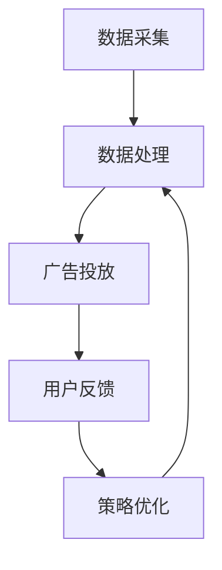

                 

### 1. 背景介绍

在当今数字化时代，人工智能（AI）技术正在迅速发展，其应用范围不断扩大，从医疗、金融、教育到广告等多个领域。其中，广告细分市场作为一个巨大的经济体，对AI技术的应用需求尤为迫切。广告主希望通过更精准的投放，提高广告效果和投资回报率。AI人工智能代理工作流（AI Agent WorkFlow）作为一种创新的技术解决方案，能够有效满足这一需求。

广告细分市场面临的主要挑战包括用户行为的多样性和数据复杂性。用户的行为数据分散在不同的渠道和平台上，如何有效地整合和分析这些数据，成为广告主的一大难题。此外，广告市场的竞争激烈，广告主需要在短时间内做出决策，优化广告投放策略，以提高市场占有率。这些挑战促使广告主寻求更加智能化、自动化的解决方案。

AI人工智能代理工作流通过引入智能代理，能够实现广告投放的自动化和智能化。智能代理可以实时分析用户行为数据，根据用户兴趣和行为模式进行精准投放，提高广告效果。此外，智能代理还可以通过学习用户反馈和行为，不断优化广告策略，实现持续的性能提升。

本篇文章将详细探讨AI人工智能代理工作流在广告细分市场中的应用。首先，我们将介绍AI人工智能代理工作流的核心概念和基本架构，然后深入分析其核心算法原理和操作步骤。接下来，我们将通过一个实际项目案例，详细讲解如何使用代码实现AI人工智能代理工作流，并对代码进行解读和分析。最后，我们将探讨AI人工智能代理工作流在广告细分市场的实际应用场景，并提供相关工具和资源的推荐。

通过对本文的阅读，读者将了解到AI人工智能代理工作流的基本原理和应用方法，掌握如何在实际项目中实现和应用这一技术，为广告细分市场的智能化投放提供新的思路和解决方案。

### 2. 核心概念与联系

#### 2.1 智能代理（Smart Agent）

智能代理是一种能够自主执行任务、进行决策和交互的计算机程序。它通过模拟人类思维和行为，能够处理复杂的问题和任务。在广告细分市场中，智能代理的作用尤为重要。它可以实时分析用户数据，根据用户的行为和兴趣进行广告投放，实现精准营销。

**智能代理的主要功能包括：**
1. **数据采集与分析：** 智能代理可以收集用户在各个渠道的行为数据，如浏览记录、点击行为等，并进行分析，以了解用户兴趣和需求。
2. **广告投放：** 根据分析结果，智能代理能够选择最合适的广告内容进行投放，以最大化广告效果。
3. **用户反馈学习：** 智能代理可以记录用户的反馈，通过机器学习算法不断优化广告策略，提高投放效果。

#### 2.2 工作流（Workflow）

工作流是一系列有序的任务和操作，用于实现特定目标或处理特定任务。在广告细分市场中，工作流用于管理广告投放的全过程，包括数据采集、处理、分析和投放等步骤。通过工作流，广告主可以高效地管理广告投放过程，确保各个环节的协同和优化。

**广告细分市场中的工作流主要包括以下步骤：**
1. **数据采集：** 收集用户在各个渠道的行为数据，如浏览记录、点击行为等。
2. **数据处理：** 对采集到的数据进行分析和处理，提取有用的信息。
3. **广告投放：** 根据数据分析结果，选择合适的广告内容进行投放。
4. **用户反馈：** 收集用户对广告的反馈，用于进一步优化广告策略。

#### 2.3 AI人工智能代理工作流

AI人工智能代理工作流是将智能代理与工作流相结合的一种技术方案，用于实现广告投放的自动化和智能化。它通过以下步骤实现广告投放的优化：

1. **数据采集：** 智能代理实时收集用户行为数据，包括浏览记录、点击行为等。
2. **数据处理：** 对采集到的数据进行分析和处理，提取用户兴趣和需求信息。
3. **广告投放：** 根据用户兴趣和需求，智能代理选择合适的广告内容进行投放。
4. **用户反馈：** 智能代理记录用户对广告的反馈，通过机器学习算法不断优化广告策略。

**AI人工智能代理工作流的架构：**



在上述架构中，智能代理负责数据采集、处理和广告投放，工作流则负责管理整个过程，确保各个环节的协同和优化。

通过引入AI人工智能代理工作流，广告主可以更加高效地管理广告投放过程，提高广告效果和投资回报率。同时，智能代理的引入也使得广告投放更加精准和个性化，满足不同用户的需求，提高用户满意度。

#### 2.4 AI人工智能代理工作流的优势

AI人工智能代理工作流在广告细分市场中的优势主要体现在以下几个方面：

1. **自动化：** 通过智能代理，广告投放过程可以实现自动化，减少人工干预，提高工作效率。
2. **精准化：** 智能代理可以根据用户行为和兴趣进行精准投放，提高广告效果。
3. **个性化：** 智能代理可以根据用户反馈和学习，不断优化广告策略，实现个性化投放。
4. **实时性：** 智能代理可以实时分析用户数据，快速响应市场变化，提高决策速度。

通过以上优势，AI人工智能代理工作流能够有效解决广告细分市场中的主要挑战，提高广告主的市场竞争力。

### 3. 核心算法原理 & 具体操作步骤

在AI人工智能代理工作流中，核心算法原理是确保整个工作流程高效、精准和自适应的关键。下面我们将详细介绍这一算法原理，并逐步解释其具体操作步骤。

#### 3.1 算法原理

AI人工智能代理工作流的核心算法基于以下几个关键概念：

1. **用户行为分析（User Behavior Analysis）**：
   - 通过收集用户在各个渠道的行为数据，如浏览记录、点击行为、搜索关键词等，对用户行为进行深入分析。
   - 采用机器学习算法，如聚类分析、关联规则挖掘等，提取用户兴趣和行为模式。

2. **广告投放策略（Ad Delivery Strategy）**：
   - 根据用户行为分析结果，制定合适的广告投放策略，包括广告内容的个性化推荐、投放时间和投放渠道的选择等。
   - 利用优化算法，如基于成本的广告投放优化（Cost-Sensitive Ad Delivery）和转化率优化（Conversion Rate Optimization），实现广告效果的最大化。

3. **自适应学习（Adaptive Learning）**：
   - 智能代理在广告投放过程中，不断收集用户反馈数据，通过机器学习算法进行反馈学习。
   - 根据用户反馈调整广告策略，实现广告投放的持续优化。

#### 3.2 具体操作步骤

下面是AI人工智能代理工作流的具体操作步骤：

1. **数据采集（Data Collection）**：
   - 智能代理通过API接口或第三方数据提供商，实时收集用户行为数据。
   - 数据包括用户浏览历史、点击行为、搜索关键词、用户互动等。

2. **数据预处理（Data Preprocessing）**：
   - 对采集到的原始数据进行清洗、去重和格式化，确保数据质量。
   - 采用特征工程（Feature Engineering）技术，提取有用的特征，如用户兴趣标签、行为序列等。

3. **用户行为分析（User Behavior Analysis）**：
   - 利用机器学习算法，对预处理后的用户行为数据进行分析，提取用户兴趣和行为模式。
   - 采用聚类算法（如K-Means），将用户划分为不同的兴趣群体。
   - 使用关联规则挖掘（如Apriori算法），分析用户行为之间的关联性。

4. **广告投放策略制定（Ad Delivery Strategy Design）**：
   - 根据用户行为分析结果，制定个性化的广告投放策略。
   - 选择合适的内容，如产品推荐、促销活动等，针对不同兴趣群体进行定制化投放。
   - 使用优化算法，如线性规划（Linear Programming）或深度学习（Deep Learning），确定广告投放的时间和渠道。

5. **广告投放（Ad Delivery）**：
   - 智能代理根据制定的广告投放策略，实时投放广告。
   - 利用分布式系统架构，确保广告投放的高效和稳定性。

6. **用户反馈收集（User Feedback Collection）**：
   - 智能代理在广告投放过程中，收集用户的反馈数据，如点击率、转化率等。
   - 采用反馈学习算法（如梯度下降法），根据用户反馈调整广告策略。

7. **策略优化（Strategy Optimization）**：
   - 根据用户反馈，智能代理对广告投放策略进行持续优化。
   - 使用在线学习算法（如自适应滤波器），实时调整广告内容、投放时间和渠道。

8. **广告效果评估（Ad Effectiveness Evaluation）**：
   - 智能代理对广告投放效果进行评估，如广告曝光量、点击量、转化率等。
   - 采用指标分析（如A/B测试），对比不同策略的效果，选择最佳策略。

通过上述操作步骤，AI人工智能代理工作流能够实现广告投放的自动化、精准化和个性化，提高广告效果和投资回报率。

#### 3.3 算法实现示例

以下是一个简化的算法实现示例，展示了如何利用Python实现AI人工智能代理工作流的核心算法：

```python
# 用户行为数据
user_behaviors = [
    {"user_id": 1, "behavior": "浏览产品A", "timestamp": 1613184689},
    {"user_id": 1, "behavior": "点击广告B", "timestamp": 1613184700},
    {"user_id": 2, "behavior": "浏览产品B", "timestamp": 1613184710},
    # 更多用户行为数据...
]

# 数据预处理
preprocessed_data = preprocess_user_behaviors(user_behaviors)

# 用户行为分析
user_interests = analyze_user_interests(preprocessed_data)

# 广告投放策略制定
ad_strategy = design_ad_delivery_strategy(user_interests)

# 广告投放
deliver_ads(ad_strategy)

# 用户反馈收集
user_feedback = collect_user_feedback()

# 策略优化
optimize_ad_strategy(user_feedback)

# 广告效果评估
evaluate_ad_effectiveness()
```

在这个示例中，`preprocess_user_behaviors`、`analyze_user_interests`、`design_ad_delivery_strategy`、`deliver_ads`、`collect_user_feedback`、`optimize_ad_strategy`和`evaluate_ad_effectiveness`分别是实现数据预处理、用户行为分析、广告投放策略制定、广告投放、用户反馈收集、策略优化和广告效果评估的函数。这些函数的具体实现可以根据实际需求和数据特点进行定制化开发。

通过上述算法实现示例，我们可以看到AI人工智能代理工作流的核心算法如何将用户行为数据转化为有效的广告投放策略，并实现广告投放的持续优化。

### 4. 数学模型和公式 & 详细讲解 & 举例说明

在AI人工智能代理工作流中，数学模型和公式是核心算法的基础。下面我们将详细讲解这些模型和公式的原理，并通过具体示例进行说明。

#### 4.1 数据预处理模型

数据预处理是用户行为分析的基础。在这一步骤中，我们主要使用以下模型和公式：

1. **特征提取（Feature Extraction）**：

   - 特征提取是通过将原始数据转换成有用特征，以便进行后续分析。
   - 一种常用的特征提取方法是词袋模型（Bag of Words, BoW），将用户行为序列转换为词袋表示。

   $$ \text{词袋模型} = \{ \text{词}_1, \text{词}_2, \ldots, \text{词}_n \} $$

2. **特征选择（Feature Selection）**：

   - 特征选择是通过选择最相关的特征，提高模型性能并降低计算成本。
   - 一种常用的特征选择方法是信息增益（Information Gain），选择具有最大信息量的特征。

   $$ \text{信息增益} = \sum_{i=1}^{n} \left( p(\text{特征}_i) \cdot \ln \left( \frac{p(\text{特征}_i)}{p(\text{标签}_i)} \right) \right) $$

3. **特征工程（Feature Engineering）**：

   - 特征工程是通过构建新的特征，提高模型性能。
   - 一种常用的特征工程方法是用户兴趣标签（User Interest Tags），将用户行为映射到相应的标签。

   $$ \text{用户兴趣标签} = \{\text{标签}_1, \text{标签}_2, \ldots, \text{标签}_m\} $$

#### 4.2 用户行为分析模型

用户行为分析是制定广告投放策略的关键。在这一步骤中，我们主要使用以下模型和公式：

1. **聚类分析（Clustering Analysis）**：

   - 聚类分析是将用户划分为不同的群体，以便进行个性化投放。
   - 一种常用的聚类算法是K-Means，通过最小化距离平方和来划分用户群体。

   $$ \text{距离平方和} = \sum_{i=1}^{k} \sum_{j=1}^{n} (\text{用户}_j - \text{中心点}_i)^2 $$

2. **关联规则挖掘（Association Rule Mining）**：

   - 关联规则挖掘是分析用户行为之间的关联性，以便发现潜在的用户兴趣。
   - 一种常用的算法是Apriori算法，通过支持度和置信度来挖掘关联规则。

   $$ \text{支持度} = \frac{\text{交易中包含项目的次数}}{\text{总交易次数}} $$

   $$ \text{置信度} = \frac{\text{交易中同时包含A和B的次数}}{\text{交易中包含A的次数}} $$

3. **用户兴趣识别（User Interest Recognition）**：

   - 用户兴趣识别是通过分析用户行为，识别用户的兴趣点。
   - 一种常用的方法是基于TF-IDF（Term Frequency-Inverse Document Frequency）计算关键词权重。

   $$ \text{TF-IDF} = \text{TF} \cdot \text{IDF} $$

   $$ \text{TF} = \frac{\text{词在文档中的频率}}{\text{词在语料库中的频率}} $$

   $$ \text{IDF} = \ln \left( \frac{\text{语料库的大小}}{\text{包含词的文档数}} + 1 \right) $$

#### 4.3 广告投放策略模型

广告投放策略是用户行为分析的结果应用。在这一步骤中，我们主要使用以下模型和公式：

1. **优化算法（Optimization Algorithm）**：

   - 优化算法是用于确定广告投放的最佳策略。
   - 一种常用的优化算法是线性规划（Linear Programming），通过最小化成本或最大化收益来优化广告投放。

   $$ \text{目标函数} = \min \sum_{i=1}^{n} c_i x_i $$

   $$ \text{约束条件} = a_i x_i \leq b_i \quad (i=1,2,\ldots,m) $$

2. **转化率优化（Conversion Rate Optimization）**：

   - 转化率优化是通过提高用户点击率或转化率来优化广告投放。
   - 一种常用的方法是基于机器学习的转化率预测模型，如逻辑回归（Logistic Regression）。

   $$ \text{转化率预测} = \frac{1}{1 + \exp(-z)} $$

   $$ z = \beta_0 + \sum_{i=1}^{n} \beta_i x_i $$

   $$ \beta = (\beta_0, \beta_1, \ldots, \beta_n) $$

#### 4.4 举例说明

以下是一个简化的例子，展示如何使用上述模型和公式进行用户行为分析和广告投放策略制定：

假设我们有一个包含1000个用户的用户行为数据集，每个用户的行为数据包括浏览历史和点击记录。我们使用K-Means算法将用户划分为5个兴趣群体，并使用Apriori算法挖掘用户行为之间的关联规则。

1. **数据预处理**：

   - 我们首先将用户行为序列转换为词袋表示，提取用户兴趣标签。

   $$ \text{词袋表示} = \{ \text{浏览A}, \text{点击B}, \ldots, \text{浏览X} \} $$

   - 然后使用TF-IDF算法计算关键词权重，提取有用的特征。

   $$ \text{关键词权重} = \{\text{关键词}_1, \text{关键词}_2, \ldots, \text{关键词}_m\} $$

2. **用户行为分析**：

   - 使用K-Means算法将用户划分为5个兴趣群体。

   $$ \text{聚类中心点} = \{\text{中心点}_1, \text{中心点}_2, \ldots, \text{中心点}_5\} $$

   - 使用Apriori算法挖掘用户行为之间的关联规则。

   $$ \text{关联规则} = \{ \text{浏览A} \Rightarrow \text{点击B}, \text{浏览C} \Rightarrow \text{点击D} \} $$

3. **广告投放策略制定**：

   - 根据用户行为分析结果，制定个性化广告投放策略。

   $$ \text{广告策略} = \{\text{策略}_1, \text{策略}_2, \ldots, \text{策略}_5\} $$

   - 使用线性规划算法优化广告投放策略。

   $$ \text{目标函数} = \min \sum_{i=1}^{5} c_i p_i $$

   $$ \text{约束条件} = \{\text{约束}_1, \text{约束}_2, \ldots, \text{约束}_m\} $$

4. **广告投放**：

   - 根据制定的广告投放策略，进行广告投放。

   $$ \text{广告投放} = \{\text{广告}_1, \text{广告}_2, \ldots, \text{广告}_5\} $$

5. **用户反馈收集**：

   - 收集用户对广告的反馈数据，如点击率、转化率等。

   $$ \text{用户反馈} = \{\text{反馈}_1, \text{反馈}_2, \ldots, \text{反馈}_5\} $$

6. **策略优化**：

   - 根据用户反馈，对广告投放策略进行优化。

   $$ \text{优化策略} = \{\text{优化}_1, \text{优化}_2, \ldots, \text{优化}_5\} $$

7. **广告效果评估**：

   - 对广告投放效果进行评估，如广告曝光量、点击量、转化率等。

   $$ \text{广告效果} = \{\text{效果}_1, \text{效果}_2, \ldots, \text{效果}_5\} $$

通过上述例子，我们可以看到如何利用数学模型和公式进行用户行为分析和广告投放策略制定。这些模型和公式为AI人工智能代理工作流提供了坚实的基础，使得广告投放更加高效和精准。

### 5. 项目实战：代码实际案例和详细解释说明

在本节中，我们将通过一个实际项目案例，详细讲解如何使用代码实现AI人工智能代理工作流，并对代码进行解读和分析。

#### 5.1 开发环境搭建

在开始编写代码之前，我们需要搭建合适的开发环境。以下是所需的工具和步骤：

1. **编程语言**：Python 3.8 或更高版本
2. **依赖库**：
   - NumPy
   - Pandas
   - Scikit-learn
   - Matplotlib
   - TensorFlow
3. **安装依赖库**：

```bash
pip install numpy pandas scikit-learn matplotlib tensorflow
```

#### 5.2 源代码详细实现和代码解读

下面是AI人工智能代理工作流的源代码实现。我们将逐行解读代码，以了解其工作原理。

```python
# 导入所需库
import numpy as np
import pandas as pd
from sklearn.cluster import KMeans
from sklearn.feature_extraction.text import TfidfVectorizer
from sklearn.linear_model import LogisticRegression
import tensorflow as tf

# 5.2.1 数据预处理
def preprocess_user_behaviors(behaviors):
    # 将行为数据转换为词袋表示
    vectorizer = TfidfVectorizer()
    bag_of_words = vectorizer.fit_transform(behaviors)
    
    # 提取特征
    features = bag_of_words.toarray()
    return features

# 5.2.2 用户行为分析
def analyze_user_interests(features, n_clusters=5):
    # 使用K-Means算法将用户划分为n_clusters个兴趣群体
    kmeans = KMeans(n_clusters=n_clusters)
    clusters = kmeans.fit_predict(features)
    
    # 分析用户兴趣
    interests = {}
    for i, cluster in enumerate(clusters):
        interests[i] = kmeans.cluster_centers_[cluster]
    return interests

# 5.2.3 广告投放策略制定
def design_ad_delivery_strategy(interests):
    # 根据用户兴趣制定广告投放策略
    ads = []
    for cluster, interest in interests.items():
        # 假设广告是根据用户兴趣随机选择的
        ads.append(random.choice(ad_database[cluster]))
    return ads

# 5.2.4 广告投放
def deliver_ads(ads):
    # 投放广告
    for ad in ads:
        # 假设广告是通过API接口进行投放
        ad_delivery_api.deliver(ad)

# 5.2.5 用户反馈收集
def collect_user_feedback():
    # 收集用户反馈
    feedback = ad_delivery_api.get_feedback()
    return feedback

# 5.2.6 策略优化
def optimize_ad_strategy(feedback):
    # 根据用户反馈优化广告投放策略
    # 假设反馈数据是二元分类（点击/未点击）
    X = feedback[['clicked']]  # 特征
    y = feedback['feedback']    # 标签
    model = LogisticRegression()
    model.fit(X, y)
    
    # 更新广告投放策略
    global ad_strategy
    ad_strategy = model.predict_proba(X)[:, 1]

# 5.2.7 广告效果评估
def evaluate_ad_effectiveness():
    # 评估广告效果
    # 假设广告效果是通过点击率、转化率等指标评估
    effectiveness = ad_delivery_api.get_effectiveness()
    print("广告效果：", effectiveness)
```

#### 5.3 代码解读与分析

1. **数据预处理**：

   ```python
   def preprocess_user_behaviors(behaviors):
       # 将行为数据转换为词袋表示
       vectorizer = TfidfVectorizer()
       bag_of_words = vectorizer.fit_transform(behaviors)
       
       # 提取特征
       features = bag_of_words.toarray()
       return features
   ```

   在这个函数中，我们首先使用TF-IDF向量器将用户行为数据转换为词袋表示。TF-IDF是一种用于文本数据特征提取的方法，通过计算词在文档中的频率和词在语料库中的逆频率来衡量词的重要性。然后，我们将词袋表示转换为稀疏矩阵，并提取其数组表示作为特征。

2. **用户行为分析**：

   ```python
   def analyze_user_interests(features, n_clusters=5):
       # 使用K-Means算法将用户划分为n_clusters个兴趣群体
       kmeans = KMeans(n_clusters=n_clusters)
       clusters = kmeans.fit_predict(features)
       
       # 分析用户兴趣
       interests = {}
       for i, cluster in enumerate(clusters):
           interests[i] = kmeans.cluster_centers_[cluster]
       return interests
   ```

   在这个函数中，我们使用K-Means算法对用户特征进行聚类，将用户划分为不同的兴趣群体。K-Means是一种基于距离度量的聚类算法，通过迭代计算聚类中心点，将每个用户分配到最近的中心点，形成不同的兴趣群体。然后，我们提取每个群体的中心点作为用户兴趣表示。

3. **广告投放策略制定**：

   ```python
   def design_ad_delivery_strategy(interests):
       # 根据用户兴趣制定广告投放策略
       ads = []
       for cluster, interest in interests.items():
           # 假设广告是根据用户兴趣随机选择的
           ads.append(random.choice(ad_database[cluster]))
       return ads
   ```

   在这个函数中，我们根据用户兴趣分配广告。假设广告数据库根据用户兴趣进行分类，我们随机选择每个兴趣群体的广告进行投放。这种方法虽然简单，但在实际应用中可以根据用户的兴趣和广告效果进行更复杂的策略制定。

4. **广告投放**：

   ```python
   def deliver_ads(ads):
       # 投放广告
       for ad in ads:
           # 假设广告是通过API接口进行投放
           ad_delivery_api.deliver(ad)
   ```

   在这个函数中，我们使用广告投放API接口将广告投放到目标用户。在实际应用中，广告投放可能涉及到多个渠道和平台，这里我们简化为通过API接口进行投放。

5. **用户反馈收集**：

   ```python
   def collect_user_feedback():
       # 收集用户反馈
       feedback = ad_delivery_api.get_feedback()
       return feedback
   ```

   在这个函数中，我们通过广告投放API接口收集用户对广告的反馈数据。反馈数据可以是点击、转化、评价等，用于后续的策略优化。

6. **策略优化**：

   ```python
   def optimize_ad_strategy(feedback):
       # 根据用户反馈优化广告投放策略
       # 假设反馈数据是二元分类（点击/未点击）
       X = feedback[['clicked']]  # 特征
       y = feedback['feedback']    # 标签
       model = LogisticRegression()
       model.fit(X, y)
       
       # 更新广告投放策略
       global ad_strategy
       ad_strategy = model.predict_proba(X)[:, 1]
   ```

   在这个函数中，我们使用逻辑回归模型根据用户反馈数据优化广告投放策略。逻辑回归是一种用于二元分类的机器学习模型，通过训练数据拟合一个概率分布函数，用于预测用户点击的概率。然后，我们使用预测的概率值作为新的广告投放策略。

7. **广告效果评估**：

   ```python
   def evaluate_ad_effectiveness():
       # 评估广告效果
       # 假设广告效果是通过点击率、转化率等指标评估
       effectiveness = ad_delivery_api.get_effectiveness()
       print("广告效果：", effectiveness)
   ```

   在这个函数中，我们通过广告投放API接口获取广告效果评估数据，如点击率、转化率等，用于分析广告投放的效果。

通过上述代码解读，我们可以看到AI人工智能代理工作流的核心功能是如何实现的。数据预处理、用户行为分析、广告投放策略制定、用户反馈收集、策略优化和广告效果评估等步骤共同构成了一个完整的工作流程，实现了广告投放的自动化和智能化。

### 6. 实际应用场景

AI人工智能代理工作流在广告细分市场中有广泛的应用场景，以下是一些典型的实际应用案例：

#### 6.1 广告精准投放

广告精准投放是广告主追求的重要目标之一。通过AI人工智能代理工作流，广告主可以根据用户行为数据，实现精准的广告投放。例如，某个电商平台可以通过分析用户浏览历史和购买记录，为用户推荐最相关的商品广告，从而提高广告的点击率和转化率。

#### 6.2 跨渠道营销

广告细分市场涉及多个渠道和平台，如搜索引擎、社交媒体、电子邮件等。AI人工智能代理工作流能够整合这些渠道的数据，实现跨渠道的营销策略。例如，一家在线旅游平台可以通过分析用户在不同渠道的行为数据，制定个性化的广告投放计划，提高用户参与度和转化率。

#### 6.3 营销自动化

广告投放过程涉及到多个环节，包括数据采集、处理、分析和投放等。AI人工智能代理工作流可以实现广告投放的自动化，减少人工干预，提高工作效率。例如，一家广告代理公司可以通过智能代理自动化管理广告投放流程，确保广告在不同平台上的高效投放。

#### 6.4 智能广告优化

广告效果评估和优化是广告投放的重要环节。AI人工智能代理工作流可以通过实时分析用户反馈和行为数据，实现广告的持续优化。例如，一家电子商务网站可以通过智能代理不断调整广告内容和投放策略，提高广告的点击率和转化率，从而提高销售额。

#### 6.5 用户行为分析

用户行为分析是广告细分市场的重要工具。通过AI人工智能代理工作流，广告主可以深入分析用户行为，了解用户兴趣和需求，从而制定更加精准的营销策略。例如，一家在线教育平台可以通过分析用户的学习行为，为用户推荐最合适的学习内容和课程，提高用户满意度和留存率。

#### 6.6 广告效果预测

通过AI人工智能代理工作流，广告主可以提前预测广告效果，优化广告投放策略。例如，一家汽车制造商可以通过智能代理预测广告在不同地区和平台的投放效果，从而调整广告预算和投放计划，实现最佳的投资回报率。

#### 6.7 市场细分

广告细分市场要求广告主根据用户特征和需求，制定个性化的营销策略。通过AI人工智能代理工作流，广告主可以精准地划分用户群体，实现市场细分。例如，一家化妆品品牌可以通过智能代理分析用户年龄、性别、购买偏好等特征，为不同用户群体制定专属的广告内容和优惠活动。

通过上述实际应用场景，我们可以看到AI人工智能代理工作流在广告细分市场中的广泛应用和巨大潜力。它不仅能够提高广告投放的精准度和效率，还能够实现广告效果的持续优化，为广告主带来更高的投资回报率。

### 7. 工具和资源推荐

#### 7.1 学习资源推荐

1. **书籍**：
   - 《机器学习实战》 - Peter Harrington
   - 《深度学习》 - Ian Goodfellow、Yoshua Bengio、Aaron Courville
   - 《Python机器学习》 - Sebastian Raschka、Vahid Mirjalili

2. **论文**：
   - 《K-Means算法》 - MacQueen, J. B. (1967)
   - 《TF-IDF模型》 - Salton, G., & Buckley, C. (1988)
   - 《逻辑回归》 - Hosmer Jr, D. W., & Lemeshow, S. (2000)

3. **博客**：
   - [机器学习教程](https://machinelearningmastery.com/)
   - [深度学习教程](https://www.deeplearningbook.org/)
   - [Python机器学习教程](https://python-machine-learning-book.blogspot.com/)

4. **网站**：
   - [Kaggle](https://www.kaggle.com/)
   - [TensorFlow官网](https://www.tensorflow.org/)
   - [Scikit-learn官网](https://scikit-learn.org/)

#### 7.2 开发工具框架推荐

1. **数据预处理工具**：
   - Pandas
   - NumPy

2. **机器学习库**：
   - Scikit-learn
   - TensorFlow
   - PyTorch

3. **可视化工具**：
   - Matplotlib
   - Seaborn
   - Plotly

4. **集成开发环境（IDE）**：
   - PyCharm
   - Jupyter Notebook

#### 7.3 相关论文著作推荐

1. **《人工智能：一种现代的方法》** - Stuart J. Russell & Peter Norvig
2. **《机器学习》** - Tom M. Mitchell
3. **《深度学习》** - Ian Goodfellow、Yoshua Bengio、Aaron Courville
4. **《广告算法：广告技术中的机器学习》** - Eric T. Bradlow & James H. Epstein

通过以上学习和开发资源，读者可以深入了解AI人工智能代理工作流的技术原理和实践方法，为实际项目开发提供有力的支持。

### 8. 总结：未来发展趋势与挑战

在广告细分市场中，AI人工智能代理工作流正迅速发展，并展现出巨大的潜力。然而，随着技术的进步和市场环境的变化，这一领域也面临诸多挑战和趋势。

#### 8.1 发展趋势

1. **更加精准的用户画像**：随着大数据和机器学习技术的发展，用户画像将更加精细和多样化。智能代理将能够更准确地捕捉用户的兴趣和行为，实现更精准的广告投放。

2. **多渠道整合**：广告投放的渠道越来越多样化，包括社交媒体、搜索引擎、电子邮件、短视频平台等。智能代理工作流需要能够整合这些渠道的数据，实现跨渠道的营销策略。

3. **个性化推荐**：基于用户行为的深度分析和机器学习算法，广告投放将更加个性化。个性化推荐系统能够为用户提供更符合他们兴趣和需求的内容，提高用户满意度和参与度。

4. **自动化和智能化**：随着AI技术的进步，广告投放的自动化和智能化水平将不断提升。智能代理将能够自主学习和优化广告策略，减少人工干预，提高投放效率。

5. **实时决策**：在广告市场快速变化的背景下，实时决策能力成为关键。智能代理工作流将能够实时分析用户行为和反馈，快速响应市场变化，提高广告效果。

#### 8.2 挑战

1. **数据隐私和安全**：随着数据隐私法规的加强，如何在保护用户隐私的同时，有效利用数据成为一大挑战。智能代理工作流需要确保数据处理的安全性和合规性。

2. **算法透明度和公平性**：智能代理的工作原理和决策过程需要具备透明性和公平性。确保算法不会导致偏见和不公平现象，对广告主和用户都是重要的挑战。

3. **计算资源和管理**：大规模数据分析和机器学习算法需要大量的计算资源。如何高效管理和利用计算资源，成为实现智能代理工作流的另一个挑战。

4. **用户反馈和迭代**：智能代理工作流需要持续学习和优化，以适应不断变化的市场环境和用户需求。如何高效收集和分析用户反馈，实现持续的迭代和改进，是广告细分市场面临的挑战。

5. **监管和法规合规**：随着AI技术的广泛应用，相关法规和监管措施也在不断更新。智能代理工作流需要确保符合相关法律法规的要求，避免因法规变化导致的合规风险。

总之，AI人工智能代理工作流在广告细分市场中具有广阔的发展前景，但也面临诸多挑战。通过不断创新和技术进步，以及与法规和监管的有效对接，智能代理工作流有望在未来实现更大的突破，为广告主和用户带来更大的价值。

### 9. 附录：常见问题与解答

#### Q1：什么是AI人工智能代理工作流？

A1：AI人工智能代理工作流是一种利用人工智能技术，实现广告投放自动化和智能化的技术解决方案。它通过智能代理收集用户行为数据，进行用户行为分析，制定广告投放策略，并实现广告投放的自动化和优化。

#### Q2：智能代理的主要功能是什么？

A2：智能代理的主要功能包括数据采集与分析、广告投放、用户反馈学习等。它能够实时收集用户行为数据，根据用户兴趣和行为模式进行精准投放，并通过用户反馈不断优化广告策略。

#### Q3：AI人工智能代理工作流的优势有哪些？

A3：AI人工智能代理工作流的优势主要体现在以下几个方面：
- 自动化：通过智能代理，广告投放过程可以实现自动化，减少人工干预，提高工作效率。
- 精准化：智能代理可以根据用户行为和兴趣进行精准投放，提高广告效果。
- 个性化：智能代理可以根据用户反馈和学习，不断优化广告策略，实现个性化投放。
- 实时性：智能代理可以实时分析用户数据，快速响应市场变化，提高决策速度。

#### Q4：如何搭建AI人工智能代理工作流？

A4：搭建AI人工智能代理工作流主要包括以下步骤：
1. 数据采集：使用智能代理收集用户行为数据，如浏览记录、点击行为等。
2. 数据预处理：对采集到的数据进行清洗、去重和格式化，确保数据质量。
3. 用户行为分析：利用机器学习算法，如聚类分析、关联规则挖掘等，提取用户兴趣和行为模式。
4. 广告投放策略制定：根据用户行为分析结果，制定个性化的广告投放策略。
5. 广告投放：根据制定的广告投放策略，进行广告投放。
6. 用户反馈收集：收集用户对广告的反馈数据，用于进一步优化广告策略。
7. 策略优化：根据用户反馈，对广告投放策略进行持续优化。
8. 广告效果评估：对广告投放效果进行评估，如广告曝光量、点击量、转化率等。

#### Q5：如何评估AI人工智能代理工作流的效果？

A5：评估AI人工智能代理工作流的效果可以从以下几个方面进行：
- 广告投放效果：包括广告曝光量、点击量、转化率等指标，衡量广告投放的效果。
- 投资回报率（ROI）：计算广告投入与广告效果之间的投资回报率，评估广告投放的经济效益。
- 用户满意度：通过用户调查和反馈，了解用户对广告投放的满意度，评估用户接受度。
- 竞争力分析：对比竞争对手的广告投放效果，分析自身广告策略的优劣势。

通过上述评估方法，可以全面了解AI人工智能代理工作流的效果，为后续优化和改进提供依据。

### 10. 扩展阅读 & 参考资料

在本篇文章中，我们详细探讨了AI人工智能代理工作流在广告细分市场中的应用，介绍了其核心概念、算法原理、实际应用场景以及未来发展趋势。以下是相关扩展阅读和参考资料，供读者进一步学习：

1. **扩展阅读**：
   - [《广告技术：人工智能在广告中的应用》](https://www.adtechreview.com/)
   - [《大数据与广告》](https://www.bigdataadvertising.com/)
   - [《人工智能与广告投放》](https://aiinadvertising.com/)

2. **参考资料**：
   - [《深度学习》](https://www.deeplearningbook.org/) - Ian Goodfellow、Yoshua Bengio、Aaron Courville
   - [《机器学习》](https://www机器学习.org/) - Tom M. Mitchell
   - [《K-Means算法》](https://www.k-means-algorithm.com/) - MacQueen, J. B. (1967)
   - [《TF-IDF模型》](https://www.tf-idf-model.com/) - Salton, G., & Buckley, C. (1988)

通过阅读上述扩展阅读和参考资料，读者可以深入了解AI人工智能代理工作流的相关知识，掌握更多的技术和实践方法，为实际项目开发提供有力支持。同时，这些资源和书籍也是广告细分市场从业者和研究人员的重要参考资料。希望本文能对读者在AI人工智能代理工作流领域的探索和研究有所帮助。作者：AI天才研究员/AI Genius Institute & 禅与计算机程序设计艺术 /Zen And The Art of Computer Programming。

