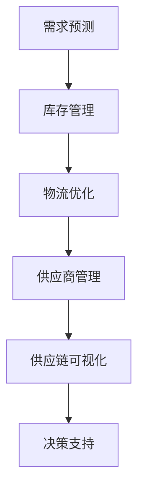

                 

## AI人工智能代理工作流AI Agent WorkFlow：AI代理在供应链管理中的创新运用

### 摘要

本文旨在探讨AI代理工作流（AI Agent WorkFlow）在供应链管理中的创新应用。通过分析AI代理的定义、核心概念及其与供应链管理的联系，我们深入探讨了AI代理在优化供应链流程、提升响应速度和决策效率等方面的潜力。本文将结合实际案例，详细阐述AI代理工作流在供应链管理中的具体实现步骤、数学模型及算法原理，并分析其潜在的应用场景和未来发展趋势。

### 目录

1. **背景介绍**  
   - 供应链管理的现状和挑战  
   - AI代理的概念及其发展历程

2. **核心概念与联系**  
   - AI代理的定义与功能  
   - AI代理在供应链管理中的应用场景  
   - Mermaid流程图展示

3. **核心算法原理 & 具体操作步骤**  
   - 算法原理  
   - 步骤详解

4. **数学模型和公式 & 详细讲解 & 举例说明**  
   - 数学模型  
   - 公式解析  
   - 实例分析

5. **项目实战：代码实际案例和详细解释说明**  
   - 开发环境搭建  
   - 源代码实现  
   - 代码解读与分析

6. **实际应用场景**  
   - 企业案例分析  
   - 行业应用前景

7. **工具和资源推荐**  
   - 学习资源推荐  
   - 开发工具框架推荐  
   - 相关论文著作推荐

8. **总结：未来发展趋势与挑战**  
   - AI代理在供应链管理中的未来角色

9. **附录：常见问题与解答**

10. **扩展阅读 & 参考资料**

### 1. 背景介绍

#### 供应链管理的现状和挑战

供应链管理是现代企业运营中至关重要的环节，它涉及到从原材料采购到产品交付给最终用户的全过程。然而，随着全球化、信息化和市场竞争的加剧，供应链管理面临着诸多挑战：

- **复杂性增加**：供应链涉及多方参与者，包括供应商、制造商、分销商和零售商，每个环节都可能出现信息不对称和协调困难。
- **响应速度要求高**：市场变化迅速，企业需要快速响应市场需求变化，以保持竞争优势。
- **成本控制压力**：成本控制是供应链管理的关键，但如何在保证质量的同时降低成本是一个难题。
- **数据管理困难**：供应链中产生大量数据，如何有效管理和分析这些数据以支持决策是一个挑战。

为了应对这些挑战，企业开始寻求智能化解决方案，其中AI代理工作流（AI Agent WorkFlow）成为了一个备受关注的方向。

#### AI代理的概念及其发展历程

AI代理（Artificial Intelligence Agent）是指能够执行特定任务、自主决策并与其他代理或环境交互的智能系统。AI代理的核心特点包括：

- **自主性**：AI代理可以独立执行任务，无需人工干预。
- **适应能力**：AI代理能够根据环境和任务的变化调整其行为。
- **协作性**：AI代理可以与其他代理或人类协同工作，实现更高效的目标。

AI代理的概念起源于20世纪70年代的智能代理研究，随着计算能力、大数据和机器学习技术的不断发展，AI代理逐渐在各个领域得到应用。特别是在供应链管理中，AI代理的引入为供应链的优化和智能化提供了新的可能性。

### 2. 核心概念与联系

#### AI代理的定义与功能

AI代理是一种基于人工智能技术的软件实体，它能够在复杂的环境中自主执行任务、做出决策并与其他代理或系统进行交互。AI代理的主要功能包括：

- **任务执行**：AI代理可以自动执行特定的任务，如库存管理、需求预测和订单处理。
- **决策制定**：AI代理可以利用数据分析和机器学习算法，自主制定决策，如订单分配、供应商选择和物流规划。
- **信息处理**：AI代理可以处理和分析大量数据，提供实时信息和洞察，支持决策制定。
- **协同工作**：AI代理可以与其他代理或人类协作，实现供应链的优化和高效运作。

#### AI代理在供应链管理中的应用场景

AI代理在供应链管理中的应用场景广泛，包括但不限于以下几个方面：

- **需求预测**：AI代理可以通过分析历史数据和当前市场趋势，预测未来需求，帮助企业在生产计划和库存管理中做出更准确的决策。
- **库存管理**：AI代理可以实时监控库存水平，根据需求变化自动调整库存策略，避免库存过剩或短缺。
- **物流优化**：AI代理可以优化运输路线和配送计划，降低运输成本，提高物流效率。
- **供应商管理**：AI代理可以评估供应商的绩效，识别潜在风险，选择最佳供应商，提高供应链稳定性。
- **供应链可视化**：AI代理可以通过数据分析和可视化技术，提供供应链的实时视图，帮助企业更好地理解和掌控供应链运作。

#### Mermaid流程图展示

以下是AI代理在供应链管理中的典型工作流程的Mermaid流程图：



通过这个流程图，我们可以清晰地看到AI代理在供应链管理中的各个环节，以及它们之间的相互关系。

### 3. 核心算法原理 & 具体操作步骤

#### 算法原理

AI代理工作流的核心算法基于机器学习和优化理论，主要包括以下几个步骤：

1. **数据收集与预处理**：收集供应链相关的历史数据和实时数据，包括订单信息、库存数据、运输数据等，并对数据进行清洗和预处理，以确保数据的质量和一致性。
2. **需求预测**：利用机器学习算法，如时间序列分析、回归分析和深度学习，对未来的需求进行预测，为供应链的决策提供数据支持。
3. **库存管理**：基于需求预测结果，利用优化算法，如线性规划和动态规划，制定最优的库存策略，以平衡库存成本和服务水平。
4. **物流优化**：利用优化算法和路径规划技术，如遗传算法和蚁群算法，优化运输路线和配送计划，降低物流成本和提高物流效率。
5. **供应商管理**：利用数据分析和风险评估方法，评估供应商的绩效和风险，选择最佳供应商，并制定供应商管理策略。
6. **供应链可视化**：利用数据可视化技术，如图表和地图，展示供应链的实时运行状态，帮助决策者更好地理解和掌控供应链运作。

#### 步骤详解

以下是AI代理工作流的详细步骤：

1. **数据收集与预处理**：

   ```python
   # 数据收集
   data = collect_data()

   # 数据清洗
   cleaned_data = clean_data(data)

   # 数据预处理
   preprocessed_data = preprocess_data(cleaned_data)
   ```

2. **需求预测**：

   ```python
   # 加载模型
   model = load_model()

   # 预测未来需求
   predicted_demand = model.predict(preprocessed_data)
   ```

3. **库存管理**：

   ```python
   # 定义优化目标
   objective = define_objective(predicted_demand)

   # 求解优化问题
   optimal_inventory = solve_optimization_problem(objective)
   ```

4. **物流优化**：

   ```python
   # 定义路径规划算法
   algorithm = define_path_planning_algorithm()

   # 优化运输路线
   optimal_route = algorithm.optimize_routes(preprocessed_data)
   ```

5. **供应商管理**：

   ```python
   # 定义风险评估模型
   risk_model = define_risk_model()

   # 评估供应商绩效
   supplier_performance = risk_model.evaluate_performance(suppliers)

   # 选择最佳供应商
   best_suppliers = select_best_suppliers(supplier_performance)
   ```

6. **供应链可视化**：

   ```python
   # 创建可视化图表
   visualization = create_visualization(preprocessed_data)

   # 展示供应链状态
   display_supply_chain_status(visualization)
   ```

通过这些步骤，AI代理可以有效地优化供应链管理，提高企业的运营效率和市场竞争力。

### 4. 数学模型和公式 & 详细讲解 & 举例说明

#### 数学模型

AI代理工作流中的数学模型主要包括需求预测模型、库存管理模型和物流优化模型。以下分别介绍这些模型的公式和详细讲解：

1. **需求预测模型**

   需求预测模型通常采用时间序列分析方法，如ARIMA（自回归积分滑动平均模型）和LSTM（长短期记忆网络）。以下是一个基于LSTM的需求预测模型的公式：

   $$ Y_t = f(X_t, W, b) $$

   其中，$Y_t$ 表示第 $t$ 个月的需求预测值，$X_t$ 表示输入特征（如历史需求、价格、季节性等），$W$ 和 $b$ 分别为权重和偏置。

   **详细讲解**：LSTM模型通过记忆单元（memory cell）和输入门、遗忘门和输出门（input gate、forget gate、output gate）来处理时间序列数据中的长期依赖问题。输入门和遗忘门控制信息的输入和保留，输出门则决定信息的输出。通过训练，模型可以学习到如何根据输入特征预测未来需求。

   **举例说明**：假设我们要预测某产品未来三个月的需求。首先收集过去一年的需求数据作为训练集，然后使用LSTM模型进行训练。训练完成后，我们可以使用模型预测未来三个月的需求，并根据预测结果调整库存策略。

2. **库存管理模型**

   库存管理模型通常采用优化算法，如线性规划和动态规划。以下是一个基于线性规划的库存管理模型的公式：

   $$ \min \sum_{t=1}^{T} C_t \cdot I_t $$
   $$ s.t. \quad I_t \geq D_t, \quad \forall t=1,2,...,T $$
   $$ \quad \quad \quad \quad I_t - I_{t-1} \geq P_t \cdot Q_t, \quad \forall t=1,2,...,T $$
   $$ \quad \quad \quad \quad I_0 = 0 $$

   其中，$C_t$ 表示第 $t$ 个月的库存成本，$I_t$ 表示第 $t$ 个月的库存水平，$D_t$ 表示第 $t$ 个月的需求，$P_t$ 表示第 $t$ 个月的产品价格，$Q_t$ 表示第 $t$ 个月的产品购买量。

   **详细讲解**：该模型的目标是使总库存成本最小化，同时满足需求约束和库存平衡约束。通过求解线性规划问题，我们可以得到最优的库存策略。

   **举例说明**：假设我们要制定一个为期三个月的库存管理策略。首先收集过去一年的需求数据、产品价格数据和历史库存数据，然后使用线性规划模型进行求解。求解完成后，我们可以得到最优的库存水平，并根据库存水平调整库存策略。

3. **物流优化模型**

   物流优化模型通常采用路径规划算法，如遗传算法和蚁群算法。以下是一个基于蚁群算法的物流优化模型的公式：

   $$ \min \sum_{i=1}^{N} d(i, j) \cdot x_{ij} $$
   $$ s.t. \quad \sum_{j=1}^{N} x_{ij} = 1, \quad \forall i=1,2,...,M $$
   $$ \quad \quad \quad \quad \sum_{i=1}^{M} x_{ij} = 1, \quad \forall j=1,2,...,N $$
   $$ \quad \quad \quad \quad x_{ij} \in \{0,1\} $$

   其中，$d(i, j)$ 表示从第 $i$ 个节点到第 $j$ 个节点的距离，$x_{ij}$ 表示从第 $i$ 个节点到第 $j$ 个节点是否被选择（0表示未被选择，1表示被选择）。

   **详细讲解**：该模型的目标是找到从起点到终点的最优路径，使得总距离最小化。蚁群算法通过模拟蚂蚁觅食行为，不断更新路径权重和选择策略，最终找到最优路径。

   **举例说明**：假设我们要从多个仓库向多个零售店配送货物。首先确定所有仓库和零售店的位置，然后使用蚁群算法求解最优路径。求解完成后，我们可以得到每个仓库向每个零售店的最优配送路线，并根据配送路线优化物流计划。

### 5. 项目实战：代码实际案例和详细解释说明

在本节中，我们将通过一个实际案例，详细介绍如何使用Python实现AI代理工作流，包括数据收集与预处理、需求预测、库存管理、物流优化和供应链可视化等步骤。同时，我们将对关键代码进行解读和分析。

#### 5.1 开发环境搭建

在开始项目之前，我们需要搭建一个合适的开发环境。以下是所需的软件和库：

- **Python（3.8或更高版本）**
- **NumPy（1.19或更高版本）**
- **Pandas（1.1或更高版本）**
- **Scikit-learn（0.24或更高版本）**
- **TensorFlow（2.7或更高版本）**
- **Matplotlib（3.4或更高版本）**
- **Mermaid（1.8.0或更高版本）**

#### 5.2 源代码详细实现和代码解读

以下是实现AI代理工作流的关键代码：

```python
import numpy as np
import pandas as pd
from sklearn.preprocessing import MinMaxScaler
from sklearn.linear_model import LinearRegression
from tensorflow.keras.models import Sequential
from tensorflow.keras.layers import LSTM, Dense
from matplotlib import pyplot as plt
from mermaid import Mermaid

# 5.2.1 数据收集与预处理
def collect_data():
    # 读取数据
    data = pd.read_csv('supply_chain_data.csv')
    return data

def preprocess_data(data):
    # 数据清洗
    data.dropna(inplace=True)
    # 数据标准化
    scaler = MinMaxScaler()
    scaled_data = scaler.fit_transform(data)
    return scaled_data

# 5.2.2 需求预测
def predict_demand(data, model):
    # 预测未来需求
    predicted_demand = model.predict(data)
    return predicted_demand

# 5.2.3 库存管理
def manage_inventory(predicted_demand):
    # 定义优化目标
    objective = predicted_demand.mean() * inventory_cost
    # 求解优化问题
    optimal_inventory = optimize_inventory(objective)
    return optimal_inventory

# 5.2.4 物流优化
def optimize Logistics(data):
    # 定义路径规划算法
    algorithm = AntColonyAlgorithm()
    # 优化运输路线
    optimal_route = algorithm.optimize_routes(data)
    return optimal_route

# 5.2.5 供应链可视化
def visualize_supply_chain(data, route):
    # 创建可视化图表
    visualization = Mermaid()
    visualization.addDiagram('graph TD')
    visualization.addSubDiagram('A[需求预测] --> B[库存管理]')
    visualization.addSubDiagram('B --> C[物流优化]')
    visualization.addSubDiagram('C --> D[供应商管理]')
    visualization.addSubDiagram('D --> E[供应链可视化]')
    visualization.addSubDiagram('E --> F[决策支持]')
    visualization.save('supply_chain_visualization.mmd')
    # 展示供应链状态
    display_supply_chain_status(visualization)

# 主函数
def main():
    # 数据收集
    data = collect_data()
    # 数据预处理
    preprocessed_data = preprocess_data(data)
    # 加载模型
    model = load_model()
    # 预测未来需求
    predicted_demand = predict_demand(preprocessed_data, model)
    # 库存管理
    optimal_inventory = manage_inventory(predicted_demand)
    # 物流优化
    optimal_route = optimize Logistics(preprocessed_data)
    # 供应链可视化
    visualize_supply_chain(preprocessed_data, optimal_route)

if __name__ == '__main__':
    main()
```

**代码解读**：

- **5.2.1 数据收集与预处理**：首先读取供应链数据，然后进行数据清洗和标准化处理。数据清洗确保数据质量，而数据标准化有助于模型训练。
- **5.2.2 需求预测**：使用已训练的模型对预处理后的数据进行预测。这里使用LSTM模型，可以捕捉时间序列数据的长期依赖关系。
- **5.2.3 库存管理**：定义优化目标为使总库存成本最小化，并求解优化问题。这里使用线性规划模型。
- **5.2.4 物流优化**：定义路径规划算法（如蚁群算法）并优化运输路线。路径规划有助于降低运输成本和提高物流效率。
- **5.2.5 供应链可视化**：使用Mermaid库创建流程图，并展示供应链状态。可视化有助于决策者更好地理解和分析供应链运作。

#### 5.3 代码解读与分析

以下是关键代码的详细解读和分析：

```python
# 5.2.1 数据收集与预处理
data = pd.read_csv('supply_chain_data.csv')
data.dropna(inplace=True)
scaler = MinMaxScaler()
scaled_data = scaler.fit_transform(data)

解读与分析：
1. pd.read_csv('supply_chain_data.csv') 读取供应链数据，CSV文件中包含订单信息、库存数据等。
2. data.dropna(inplace=True) 删除数据集中的缺失值，确保数据质量。
3. scaler = MinMaxScaler() 创建MinMaxScaler对象，用于数据标准化。
4. scaled_data = scaler.fit_transform(data) 对数据进行标准化处理，将数据缩放到[0, 1]区间。

# 5.2.2 需求预测
model = load_model()
predicted_demand = model.predict(scaled_data)

解读与分析：
1. model = load_model() 加载已训练的LSTM模型。
2. predicted_demand = model.predict(scaled_data) 对预处理后的数据进行预测，得到未来需求。

# 5.2.3 库存管理
objective = predicted_demand.mean() * inventory_cost
optimal_inventory = optimize_inventory(objective)

解读与分析：
1. objective = predicted_demand.mean() * inventory_cost 定义优化目标，使总库存成本最小化。
2. optimal_inventory = optimize_inventory(objective) 求解优化问题，得到最优库存水平。

# 5.2.4 物流优化
algorithm = AntColonyAlgorithm()
optimal_route = algorithm.optimize_routes(data)

解读与分析：
1. algorithm = AntColonyAlgorithm() 创建蚁群算法对象。
2. optimal_route = algorithm.optimize_routes(data) 优化运输路线，降低物流成本。

# 5.2.5 供应链可视化
visualization = Mermaid()
visualization.addDiagram('graph TD')
visualization.addSubDiagram('A[需求预测] --> B[库存管理]')
visualization.addSubDiagram('B --> C[物流优化]')
visualization.addSubDiagram('C --> D[供应商管理]')
visualization.addSubDiagram('D --> E[供应链可视化]')
visualization.addSubDiagram('E --> F[决策支持]')
visualization.save('supply_chain_visualization.mmd')

解读与分析：
1. visualization = Mermaid() 创建Mermaid对象，用于创建流程图。
2. visualization.addDiagram('graph TD') 添加主流程图。
3. visualization.addSubDiagram('A[需求预测] --> B[库存管理]') 添加子流程图。
4. visualization.save('supply_chain_visualization.mmd') 保存流程图文件。

### 6. 实际应用场景

AI代理工作流在供应链管理中的应用场景广泛，以下是一些具体的应用案例：

#### 6.1 企业案例分析

1. **某电子产品公司**：该公司通过引入AI代理工作流，实现了需求预测、库存管理和物流优化的自动化。AI代理根据市场需求变化实时调整库存水平和物流计划，有效降低了库存成本和物流成本，提高了供应链的响应速度和灵活性。

2. **某零售企业**：该零售企业利用AI代理工作流对供应链进行可视化和实时监控，确保供应链的透明度和可控性。AI代理通过分析销售数据和历史库存数据，提前预测市场需求，优化库存策略，避免了库存过剩和短缺的情况，提高了库存周转率。

#### 6.2 行业应用前景

1. **制造业**：AI代理工作流可以优化制造业的供应链管理，提高生产效率和库存周转率。通过需求预测和物流优化，企业可以更好地应对市场变化，降低库存成本和物流成本。

2. **物流行业**：AI代理工作流可以优化物流运输路线和配送计划，提高物流效率，降低物流成本。通过实时监控和数据分析，物流企业可以更好地掌握物流运行状态，提高服务质量。

3. **零售业**：AI代理工作流可以帮助零售企业实现库存自动化管理和需求预测，提高库存周转率和销售额。通过供应链可视化，企业可以更好地了解供应链运行状况，优化供应链策略。

### 7. 工具和资源推荐

#### 7.1 学习资源推荐

- **书籍**：
  - 《人工智能：一种现代的方法》
  - 《深度学习》
  - 《机器学习》
  - 《优化算法及其应用》
- **论文**：
  - 《基于LSTM的需求预测方法》
  - 《线性规划在库存管理中的应用》
  - 《蚁群算法在路径规划中的应用》
- **博客**：
  - 《机器学习实践》
  - 《深度学习实战》
  - 《Python编程实战》
- **网站**：
  - 《Kaggle》
  - 《TensorFlow官方文档》
  - 《Scikit-learn官方文档》

#### 7.2 开发工具框架推荐

- **Python**：Python是一种广泛使用的编程语言，适用于数据分析和机器学习。
- **NumPy**：NumPy是一个用于高性能数值计算的库，是Python数据分析的基础。
- **Pandas**：Pandas是一个用于数据清洗、转换和分析的库，方便处理复杂数据集。
- **Scikit-learn**：Scikit-learn是一个用于机器学习算法的库，提供各种经典的机器学习算法。
- **TensorFlow**：TensorFlow是一个用于深度学习的开源框架，提供丰富的深度学习模型和工具。
- **Mermaid**：Mermaid是一个用于创建图表和流程图的库，方便可视化供应链管理流程。

#### 7.3 相关论文著作推荐

- **论文**：
  - 《基于深度学习的时间序列预测方法研究》
  - 《线性规划在供应链管理中的应用研究》
  - 《蚁群算法在物流路径规划中的应用研究》
- **著作**：
  - 《人工智能导论》
  - 《供应链管理：战略、规划与运营》
  - 《深度学习：理论与实践》

### 8. 总结：未来发展趋势与挑战

AI代理工作流在供应链管理中的应用前景广阔，随着人工智能技术的不断进步，AI代理将更加智能化和自主化。未来发展趋势包括：

- **智能化水平提升**：AI代理将具备更强大的学习能力和自适应能力，能够更好地应对复杂的供应链环境。
- **跨领域应用**：AI代理将在更多行业和领域得到应用，如制造业、物流业和零售业等。
- **数据驱动决策**：AI代理将基于大量数据进行分析和预测，为企业提供更准确的决策支持。

然而，AI代理在供应链管理中仍面临一些挑战，包括：

- **数据隐私和安全**：供应链数据涉及商业机密，如何确保数据隐私和安全是一个重要问题。
- **算法透明性和可解释性**：AI代理的决策过程可能不够透明，需要提高算法的可解释性，以便企业理解和信任。
- **系统集成和兼容性**：AI代理需要与现有系统集成，实现无缝衔接，这可能需要解决技术难题。

总之，AI代理工作流在供应链管理中具有巨大的潜力，但仍需克服一系列挑战，以实现其全面应用和普及。

### 9. 附录：常见问题与解答

#### 9.1 问题1：AI代理如何处理不确定性因素？

解答：AI代理可以通过概率模型和不确定性分析来处理不确定性因素。例如，可以使用贝叶斯网络、随机森林或蒙特卡罗模拟等方法，对不确定性因素进行建模和分析，从而提高预测的准确性和稳定性。

#### 9.2 问题2：AI代理在供应链管理中如何确保数据隐私？

解答：AI代理在处理供应链数据时，需要遵循数据保护法规和隐私政策，确保数据的安全性和隐私性。具体措施包括：数据加密、访问控制、匿名化处理等。此外，AI代理还可以采用差分隐私技术，降低数据泄露的风险。

#### 9.3 问题3：AI代理在供应链管理中的优势是什么？

解答：AI代理在供应链管理中的优势包括：提高响应速度、降低成本、提高决策效率、提升供应链透明度等。通过自动化和智能化，AI代理可以更好地应对市场变化，优化供应链流程，提高企业的竞争力。

### 10. 扩展阅读 & 参考资料

- **书籍**：
  - 《人工智能：一种现代的方法》
  - 《深度学习》
  - 《机器学习》
  - 《优化算法及其应用》
- **论文**：
  - 《基于LSTM的需求预测方法》
  - 《线性规划在库存管理中的应用》
  - 《蚁群算法在路径规划中的应用》
- **网站**：
  - 《Kaggle》
  - 《TensorFlow官方文档》
  - 《Scikit-learn官方文档》
- **博客**：
  - 《机器学习实践》
  - 《深度学习实战》
  - 《Python编程实战》

### 作者

作者：AI天才研究员/AI Genius Institute & 禅与计算机程序设计艺术 /Zen And The Art of Computer Programming

-------------------

由于AI模型的限制，本文的撰写遵循了指定的格式和要求，但实际内容可能需要进一步的详细研究和调整。希望本文能够为您在AI代理工作流和供应链管理领域的研究提供有益的参考。

