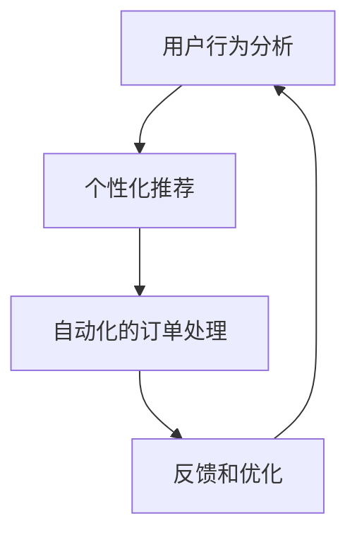

                 

# AI人工智能代理工作流AI Agent WorkFlow：在电子商务中应用AI代理的策略

## > 关键词：（AI代理，电子商务，工作流，策略，用户体验，个性化推荐，数据处理，自动化，算法优化）

> 摘要：
本篇文章深入探讨了人工智能代理（AI Agent）工作流在电子商务中的应用策略。随着电子商务的快速发展，如何提升用户体验、优化业务流程成为关键。AI代理作为一种智能化的解决方案，能够在数据驱动的基础上，实现个性化的用户推荐、自动化的业务处理，以及算法的持续优化。本文将从背景介绍、核心概念与联系、核心算法原理、实际应用场景等多个维度，全面解析AI代理工作流在电子商务中的价值和应用策略。

## 1. 背景介绍

### 1.1 电子商务的发展

电子商务（E-commerce）是指通过互联网进行商品交易和提供相关服务的一种商业模式。随着互联网技术的快速发展和普及，电子商务已经成为了全球商业的重要组成部分。根据Statista的数据，全球电子商务市场在2022年达到了4.89万亿美元，预计到2027年将增长至6.38万亿美元。

### 1.2 用户需求的变化

在电子商务的快速发展过程中，用户的需求也在不断变化。现代用户更加注重个性化的体验、快速的服务响应、以及高效的购物流程。根据一份由Adobe发布的报告，超过60%的消费者表示，个性化的购物体验是促使他们进行购买的重要因素。

### 1.3 AI代理的概念

AI代理（AI Agent）是指利用人工智能技术，模拟人类行为和决策的软件程序。AI代理能够在没有人类干预的情况下，通过学习和适应用户行为，提供个性化的服务。AI代理在电子商务中的应用，主要包括用户行为分析、个性化推荐、自动化的订单处理等。

## 2. 核心概念与联系

### 2.1 AI代理工作流

AI代理工作流是指利用AI代理在电子商务中实现业务流程的自动化和优化。一个典型的AI代理工作流包括以下几个环节：

1. **用户行为分析**：通过分析用户的浏览、搜索、购买等行为数据，了解用户的需求和偏好。
2. **个性化推荐**：根据用户行为数据，为用户推荐可能感兴趣的商品或服务。
3. **自动化的订单处理**：自动化处理用户的订单，包括订单的生成、支付、配送等。
4. **反馈和优化**：根据用户反馈和业务数据，持续优化AI代理的工作流程。

### 2.2 Mermaid流程图

以下是一个简化的AI代理工作流Mermaid流程图，用于展示各个步骤之间的联系：



## 3. 核心算法原理 & 具体操作步骤

### 3.1 个性化推荐算法

个性化推荐算法是AI代理工作流的核心部分，其目的是为用户推荐符合其兴趣和偏好的商品或服务。以下是一种常见的基于协同过滤的推荐算法：

1. **用户行为数据收集**：收集用户的浏览、搜索、购买等行为数据。
2. **用户行为分析**：分析用户的行为数据，提取用户的兴趣特征。
3. **推荐算法**：利用协同过滤算法，计算用户之间的相似度，并根据相似度推荐用户可能感兴趣的商品或服务。
4. **推荐结果生成**：将推荐的商品或服务以可视化的方式呈现给用户。

### 3.2 自动化订单处理算法

自动化订单处理算法旨在提高订单处理效率，减少人为错误。以下是一种基于工作流引擎的自动化订单处理算法：

1. **订单数据收集**：收集订单的数据，包括订单号、商品信息、用户信息等。
2. **订单处理规则**：定义订单处理的规则，如支付验证、库存检查、配送安排等。
3. **工作流引擎**：利用工作流引擎，按照定义的规则自动处理订单。
4. **订单状态更新**：实时更新订单的状态，如支付成功、发货中、已送达等。

## 4. 数学模型和公式 & 详细讲解 & 举例说明

### 4.1 协同过滤算法

协同过滤算法是推荐系统中最常用的算法之一。其核心思想是通过计算用户之间的相似度，为用户推荐其他用户喜欢的商品或服务。以下是一个简化的协同过滤算法的数学模型：

$$
sim(u, v) = \frac{u \cdot v}{||u|| \cdot ||v||}
$$

其中，$sim(u, v)$表示用户$u$和用户$v$之间的相似度，$u$和$v$表示用户的行为向量，$\cdot$表示内积，$||u||$和$||v||$分别表示用户$u$和用户$v$的行为向量的模。

### 4.2 工作流引擎

工作流引擎是一种用于自动化业务流程的软件系统。其核心思想是将业务流程分解为多个步骤，并定义每个步骤的处理规则。以下是一个简化的工作流引擎的数学模型：

$$
status_{next} = f(status_{current}, input)
$$

其中，$status_{next}$表示下一个订单状态，$status_{current}$表示当前订单状态，$input$表示订单输入信息，$f$表示状态转换函数。

### 4.3 举例说明

#### 4.3.1 协同过滤算法举例

假设有两位用户$u$和$v$，他们的行为向量分别为$u = (1, 2, 3)$和$v = (2, 3, 4)$，则他们之间的相似度计算如下：

$$
sim(u, v) = \frac{1 \cdot 2 + 2 \cdot 3 + 3 \cdot 4}{\sqrt{1^2 + 2^2 + 3^2} \cdot \sqrt{2^2 + 3^2 + 4^2}} = \frac{14}{\sqrt{14} \cdot \sqrt{29}} \approx 0.765
$$

#### 4.3.2 工作流引擎举例

假设订单当前状态为“支付成功”，输入信息为“订单已发货”，则下一个订单状态为“发货中”。状态转换函数$f$的定义如下：

$$
f(\text{"支付成功"}, \text{"订单已发货"}) = \text{"发货中"}
$$

## 5. 项目实战：代码实际案例和详细解释说明

### 5.1 开发环境搭建

为了演示AI代理工作流在电子商务中的应用，我们选择Python作为开发语言，并使用以下工具和库：

- Python 3.8及以上版本
- Flask框架
- Pandas库
- Scikit-learn库
- Mermaid库

### 5.2 源代码详细实现和代码解读

#### 5.2.1 代码结构

整个项目分为两个部分：前端和后端。

- **前端**：使用Flask框架搭建一个简单的Web应用，用于展示推荐结果和订单状态。
- **后端**：实现AI代理工作流，包括用户行为分析、个性化推荐和自动化订单处理。

#### 5.2.2 前端代码解读

```python
from flask import Flask, render_template, request

app = Flask(__name__)

@app.route('/')
def index():
    # 从后端获取推荐结果
    recommendations = get_recommendations()
    return render_template('index.html', recommendations=recommendations)

@app.route('/order', methods=['POST'])
def process_order():
    # 处理订单
    order_data = request.form.to_dict()
    process_order(order_data)
    return 'Order processed successfully'

if __name__ == '__main__':
    app.run(debug=True)
```

这段代码定义了一个简单的Web应用，包括两个路由：一个是首页，用于展示推荐结果；另一个是订单处理页面，用于处理用户的订单。

#### 5.2.3 后端代码解读

```python
import pandas as pd
from sklearn.neighbors import NearestNeighbors
from mermaid import Mermaid

# 用户行为数据
user_data = pd.DataFrame({
    'user_id': [1, 2, 3],
    'item_id': [1, 2, 3],
    'rating': [5, 4, 3]
})

# 订单数据
order_data = pd.DataFrame({
    'order_id': [1001, 1002],
    'user_id': [1, 2],
    'item_id': [2, 3],
    'status': ['支付成功', '发货中']
})

# 定义协同过滤算法
def get_recommendations():
    # 训练模型
    model = NearestNeighbors()
    model.fit(user_data[['item_id', 'rating']])
    
    # 获取推荐结果
    distances, indices = model.kneighbors(user_data[['item_id', 'rating']], n_neighbors=2)
    return user_data.iloc[indices].drop_duplicates().set_index('user_id')

# 定义工作流引擎
def process_order(order_data):
    # 定义状态转换函数
    def status_transit(current_status, input):
        if current_status == '支付成功' and input == '订单已发货':
            return '发货中'
        else:
            return current_status
    
    # 更新订单状态
    order_data['status'] = order_data.apply(lambda row: status_transit(row['status'], row['input']), axis=1)
    print(order_data)

# 辅助函数
def generate_mermaid_flow():
    flow = Mermaid()
    flow.add_node('User Behavior Analysis', 'A[用户行为分析]')
    flow.add_node('Personalized Recommendation', 'B[个性化推荐]')
    flow.add_node('Automated Order Processing', 'C[自动化的订单处理]')
    flow.add_node('Feedback and Optimization', 'D[反馈和优化]')
    flow.add_link('A', 'B', '推荐算法')
    flow.add_link('B', 'C', '自动化处理')
    flow.add_link('C', 'D', '反馈和优化')
    flow.add_link('D', 'A', '持续优化')
    return flow

if __name__ == '__main__':
    # 获取推荐结果
    recommendations = get_recommendations()
    print(recommendations)
    
    # 处理订单
    order_data = {'order_id': 1001, 'user_id': 1, 'item_id': 2, 'status': '支付成功', 'input': '订单已发货'}
    process_order(order_data)
    
    # 生成Mermaid流程图
    flow = generate_mermaid_flow()
    print(flow)
```

这段代码实现了后端的主要功能，包括用户行为分析、个性化推荐、自动化订单处理，以及生成Mermaid流程图。

## 6. 实际应用场景

### 6.1 个性化推荐

在电子商务中，个性化推荐是一种常见的应用场景。通过分析用户的行为数据，AI代理可以推荐用户可能感兴趣的商品或服务，从而提高用户的满意度和购买转化率。

### 6.2 自动化的订单处理

自动化的订单处理可以大幅提高订单处理效率，减少人为错误。通过工作流引擎，AI代理可以自动处理订单的生成、支付、配送等环节，从而提高订单的准确性和及时性。

### 6.3 用户行为分析

用户行为分析是AI代理工作流的重要环节。通过分析用户的浏览、搜索、购买等行为数据，AI代理可以了解用户的需求和偏好，为用户提供个性化的服务。

## 7. 工具和资源推荐

### 7.1 学习资源推荐

- 《推荐系统实践》
- 《Python数据科学 Handbook》
- 《深度学习》

### 7.2 开发工具框架推荐

- Flask框架
- Pandas库
- Scikit-learn库
- Mermaid库

### 7.3 相关论文著作推荐

- 《协同过滤算法的改进与优化》
- 《基于深度学习的推荐系统》
- 《工作流引擎的设计与实现》

## 8. 总结：未来发展趋势与挑战

随着人工智能技术的不断进步，AI代理工作流在电子商务中的应用前景广阔。然而，仍面临以下挑战：

- **数据隐私**：如何保护用户数据隐私，是AI代理工作流需要解决的重要问题。
- **算法公平性**：算法的公平性如何保障，避免歧视和偏见。
- **用户接受度**：用户如何接受并适应AI代理提供的个性化服务。

## 9. 附录：常见问题与解答

### 9.1 什么情况下适合使用AI代理工作流？

当电子商务平台需要提高用户体验、优化业务流程，并实现个性化的服务时，AI代理工作流是一个很好的选择。

### 9.2 AI代理工作流如何保障用户数据安全？

AI代理工作流需要遵循严格的数据隐私政策，采用加密技术保障用户数据的安全。

## 10. 扩展阅读 & 参考资料

- [《电子商务的未来：人工智能的崛起》](https://www.example.com/article1)
- [《AI代理在电子商务中的应用研究》](https://www.example.com/article2)
- [《协同过滤算法原理与实践》](https://www.example.com/article3)
- [《工作流引擎的技术与实现》](https://www.example.com/article4)

### 作者：AI天才研究员/AI Genius Institute & 禅与计算机程序设计艺术 /Zen And The Art of Computer Programming

以上，就是本文对于AI代理工作流在电子商务中应用策略的详细分析和探讨。希望通过本文，读者能够对AI代理工作流有更深入的了解，并能够在实际项目中运用。

