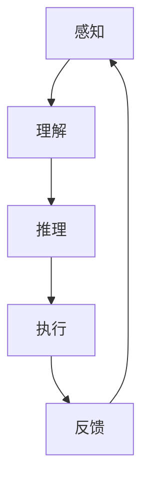

                 

### 背景介绍

随着人工智能技术的快速发展，AI代理（AI Agent）已经成为广告营销系统中一个重要的组成部分。AI代理是指通过机器学习算法和自然语言处理技术，模拟人类行为，自动完成特定任务的人工智能实体。这些代理不仅可以处理大量的数据，还能根据用户的行为和偏好，提供个性化的广告内容，从而提高广告的点击率和转化率。

广告营销是一个高度竞争的行业，广告主和广告平台都在寻找高效的方法来提高广告效果。传统的方法主要依赖于人工筛选和优化广告内容，这不仅耗时耗力，而且效果有限。随着大数据和机器学习技术的普及，广告营销逐渐向智能化、自动化的方向发展。AI代理的出现，为这一转变提供了强有力的技术支持。

本文将深入探讨AI代理工作流在广告营销系统中的应用。首先，我们将介绍AI代理的核心概念和基本原理。接着，分析AI代理在广告营销中的具体应用场景，并结合实际案例，详细讲解AI代理的算法原理和具体实现步骤。最后，我们将探讨AI代理在实际应用中面临的挑战和未来发展趋势。

通过本文的阅读，读者将了解AI代理在广告营销系统中的应用价值，掌握AI代理的基本原理和实现方法，为今后的研究和实践提供有益的参考。

### 核心概念与联系

#### AI代理的基本原理

AI代理（Artificial Intelligence Agent）是指能够自主地感知环境、决策行动并达到特定目标的人工智能实体。AI代理通常由以下几个关键组件组成：

1. **感知模块（Perception Module）**：负责从环境中获取信息，如用户的行为数据、历史偏好、市场趋势等。
2. **决策模块（Decision Module）**：基于感知模块收集的信息，使用机器学习算法和决策理论进行推理，生成最优的行动策略。
3. **执行模块（Execution Module）**：负责将决策模块生成的策略付诸实践，如投放广告、优化广告文案等。

AI代理的工作流程可以概括为以下步骤：

1. **感知**：AI代理通过传感器或数据接口收集环境中的信息。
2. **理解**：将感知到的信息进行预处理，提取关键特征，例如使用自然语言处理技术理解用户的搜索意图。
3. **推理**：利用机器学习模型和算法，根据历史数据和当前环境，生成决策。
4. **执行**：根据决策结果，执行具体的操作，如调整广告投放策略。

#### AI代理在广告营销中的应用

在广告营销系统中，AI代理可以扮演多种角色，例如：

1. **用户行为分析（User Behavior Analysis）**：通过分析用户的浏览历史、点击记录等数据，AI代理可以了解用户的需求和偏好，从而提供个性化的广告内容。
2. **广告投放优化（Ad Placement Optimization）**：AI代理可以根据用户的行为数据，实时调整广告的投放位置和展示频率，以提高广告的点击率和转化率。
3. **广告内容优化（Ad Content Optimization）**：AI代理可以自动生成或调整广告文案和图像，以更好地吸引用户的注意力。
4. **用户反馈分析（User Feedback Analysis）**：通过分析用户的反馈数据，如点击、点赞、分享等，AI代理可以不断优化广告内容和投放策略。

#### Mermaid流程图

为了更直观地理解AI代理在广告营销系统中的工作流程，我们可以使用Mermaid流程图进行展示。以下是AI代理的基本流程：



**流程说明**：

1. **感知**：AI代理从广告营销系统中获取用户数据。
2. **理解**：通过自然语言处理和数据分析，AI代理提取用户行为特征。
3. **推理**：使用机器学习模型，AI代理根据用户特征和历史数据，生成最优的广告投放策略。
4. **执行**：AI代理执行决策，调整广告内容或投放位置。
5. **反馈**：收集用户对广告的反馈数据，如点击、转化等，用于下一次决策的优化。

通过这一流程，AI代理能够自动、高效地优化广告营销策略，提高广告效果。在接下来的章节中，我们将深入探讨AI代理的算法原理和具体实现步骤，以便读者更好地理解其在广告营销系统中的应用。

#### 核心算法原理 & 具体操作步骤

AI代理在广告营销系统中的应用，离不开核心算法的支持。以下将介绍AI代理的核心算法原理，并详细讲解具体的操作步骤。

##### 1. 用户行为分析算法

用户行为分析是AI代理的基础工作，通过分析用户在广告营销系统中的行为数据，AI代理可以识别用户的兴趣和偏好。常用的用户行为分析算法包括协同过滤（Collaborative Filtering）和基于内容的推荐（Content-Based Recommendation）。

**协同过滤算法**：
协同过滤算法通过分析用户之间的相似性来推荐商品或广告。其基本原理如下：

- **用户相似度计算**：使用余弦相似度或皮尔逊相关系数计算用户之间的相似度。
- **基于相似度推荐**：为每个用户找到最相似的K个用户，然后推荐这些用户共同喜欢的商品或广告。

**基于内容的推荐算法**：
基于内容的推荐算法通过分析商品或广告的内容特征来推荐给用户。其基本步骤如下：

- **内容特征提取**：使用自然语言处理技术提取商品或广告的文本内容特征，如关键词、主题等。
- **特征相似度计算**：计算用户历史行为中的内容特征与当前商品或广告的相似度。
- **基于相似度推荐**：推荐与用户历史行为最相似的商品或广告。

##### 2. 广告投放优化算法

广告投放优化是AI代理的重要功能之一，通过实时调整广告的投放位置和频率，以提高广告的点击率和转化率。常见的广告投放优化算法包括A/B测试（A/B Testing）和在线学习（Online Learning）。

**A/B测试算法**：
A/B测试算法通过将用户随机分配到两个或多个不同的广告版本，比较不同版本的广告效果，从而找到最优的广告版本。其基本步骤如下：

- **用户分配**：将用户随机分配到不同的广告版本。
- **数据收集**：收集每个广告版本的用户点击和转化数据。
- **效果比较**：比较不同广告版本的效果，选择最优版本。

**在线学习算法**：
在线学习算法通过实时更新模型参数，不断优化广告投放策略。其基本步骤如下：

- **初始化模型**：根据历史数据初始化广告投放模型。
- **数据流处理**：实时处理用户行为数据，更新模型参数。
- **策略更新**：根据更新后的模型参数，调整广告投放策略。

##### 3. 广告内容优化算法

广告内容优化是AI代理提升广告效果的重要手段，通过自动生成或调整广告文案和图像，提高用户的关注度和参与度。常见的广告内容优化算法包括自然语言生成（Natural Language Generation）和图像生成对抗网络（Generative Adversarial Networks，GAN）。

**自然语言生成算法**：
自然语言生成算法通过生成与用户兴趣相关的广告文案，提高广告的吸引力。其基本步骤如下：

- **文本生成模型**：使用递归神经网络（RNN）或变压器（Transformer）模型，训练生成与用户兴趣相关的广告文案。
- **文案优化**：根据用户反馈数据，不断优化广告文案的质量和吸引力。

**图像生成对抗网络算法**：
图像生成对抗网络算法通过生成与用户兴趣相关的广告图像，提高广告的视觉吸引力。其基本步骤如下：

- **生成器（Generator）**：训练生成器模型，生成与用户兴趣相关的广告图像。
- **判别器（Discriminator）**：训练判别器模型，区分真实广告图像和生成图像。
- **对抗训练**：通过生成器和判别器的对抗训练，优化广告图像的质量。

通过上述核心算法，AI代理能够在广告营销系统中高效地分析用户行为、优化广告投放和内容，从而提升广告效果。在接下来的章节中，我们将结合实际案例，详细讲解AI代理的算法实现和代码解析，帮助读者更好地理解AI代理的工作原理和应用。

#### 数学模型和公式 & 详细讲解 & 举例说明

为了深入理解AI代理在广告营销系统中的应用，我们需要介绍几个关键数学模型和公式，并详细讲解它们的原理和如何应用在实际场景中。

##### 1. 用户行为分析中的协同过滤算法

协同过滤算法的核心在于计算用户之间的相似度。常用的相似度度量方法包括余弦相似度和皮尔逊相关系数。

**余弦相似度**：
余弦相似度衡量两个向量在空间中夹角的余弦值。其计算公式如下：

\[ \cos(\theta) = \frac{\mathbf{u} \cdot \mathbf{v}}{\|\mathbf{u}\| \|\mathbf{v}\|} \]

其中，\(\mathbf{u}\)和\(\mathbf{v}\)是两个用户的向量表示，\(\|\mathbf{u}\|\)和\(\|\mathbf{v}\|\)分别是它们的欧几里得范数。

**皮尔逊相关系数**：
皮尔逊相关系数衡量两个变量的线性关系。其计算公式如下：

\[ \rho_{uv} = \frac{\sum_{i=1}^n (u_i - \bar{u})(v_i - \bar{v})}{\sqrt{\sum_{i=1}^n (u_i - \bar{u})^2} \sqrt{\sum_{i=1}^n (v_i - \bar{v})^2}} \]

其中，\(u_i\)和\(v_i\)分别是用户在各项指标上的得分，\(\bar{u}\)和\(\bar{v}\)分别是所有用户的平均得分。

**举例说明**：
假设我们有两位用户A和B，他们在三个不同的商品上的评分如下表：

| 商品 | 用户A | 用户B |
|------|-------|-------|
| 商品1 | 5 | 3 |
| 商品2 | 4 | 5 |
| 商品3 | 2 | 4 |

使用余弦相似度计算用户A和B的相似度：

\[ \cos(\theta) = \frac{(5 \times 3 + 4 \times 5 + 2 \times 4)}{\sqrt{5^2 + 4^2 + 2^2} \sqrt{3^2 + 5^2 + 4^2}} \approx 0.88 \]

使用皮尔逊相关系数计算用户A和B的相似度：

\[ \rho_{uv} = \frac{(5-3.33)(3-3.33) + (4-3.33)(5-3.33) + (2-3.33)(4-3.33)}{\sqrt{(5-3.33)^2 + (4-3.33)^2 + (2-3.33)^2} \sqrt{(3-3.33)^2 + (5-3.33)^2 + (4-3.33)^2}} \approx 0.88 \]

##### 2. 广告投放优化中的A/B测试算法

A/B测试算法的核心是统计测试，用于比较不同版本的广告效果。最常用的统计测试方法是t检验（T-Test）。

**t检验公式**：

\[ t = \frac{\bar{x}_1 - \bar{x}_2}{\sqrt{\frac{s_1^2}{n_1} + \frac{s_2^2}{n_2}}} \]

其中，\(\bar{x}_1\)和\(\bar{x}_2\)分别是两个样本的平均值，\(s_1^2\)和\(s_2^2\)分别是两个样本的方差，\(n_1\)和\(n_2\)分别是两个样本的样本量。

**举例说明**：
假设有两个广告版本A和B，它们在1000名用户中的点击率数据如下表：

| 广告版本 | 点击人数 | 点击率 |
|----------|---------|-------|
| A        | 500     | 5%    |
| B        | 500     | 7%    |

使用t检验计算两个广告版本点击率的差异：

\[ t = \frac{(0.05 - 0.07)}{\sqrt{\frac{0.05^2}{500} + \frac{0.07^2}{500}}} \approx -1.26 \]

在给定的显著性水平（如0.05），自由度（如980），t分布表显示临界值为1.66。由于计算得到的t值（-1.26）小于临界值（1.66），我们无法拒绝原假设，即两个广告版本的点击率没有显著差异。

##### 3. 广告内容优化中的自然语言生成（NLG）模型

自然语言生成模型的核心是生成文本。一种常用的模型是递归神经网络（RNN），特别是长短期记忆网络（LSTM）。

**LSTM单元公式**：

\[ 
\begin{align*}
i_t &= \sigma(W_{xi}x_t + W_{hi}h_{t-1} + b_i) \\
f_t &= \sigma(W_{xf}x_t + W_{hf}h_{t-1} + b_f) \\
g_t &= \tanh(W_{xg}x_t + W_{hg}h_{t-1} + b_g) \\
o_t &= \sigma(W_{xo}x_t + W_{ho}h_{t-1} + b_o) \\
h_t &= o_t \cdot \tanh(g_t) \\
\end{align*}
\]

其中，\(i_t\)、\(f_t\)、\(g_t\)和\(o_t\)分别是输入门、遗忘门、生成门和输出门，\(\sigma\)是sigmoid函数。

**举例说明**：
假设我们要生成一个简单的句子“我喜欢吃饭”，我们可以将其分解为词序列“我”、“喜欢”、“吃”、“饭”。使用LSTM模型生成这个句子：

1. **初始化**：将“我”输入到LSTM单元中。
2. **计算输入门**：计算输入门\(i_t\)。
3. **计算遗忘门**：计算遗忘门\(f_t\)。
4. **计算生成门**：计算生成门\(g_t\)。
5. **计算输出门**：计算输出门\(o_t\)。
6. **计算隐藏状态**：计算隐藏状态\(h_t\)。
7. **生成单词**：使用隐藏状态生成“我”的单词表示。

通过重复这个过程，我们可以生成整个句子“我喜欢吃饭”。

这些数学模型和公式是AI代理在广告营销系统中实现个性化推荐、优化广告投放和内容的重要工具。在实际应用中，需要结合具体场景和数据进行模型训练和优化，以达到最佳效果。

#### 项目实战：代码实际案例和详细解释说明

在本节中，我们将通过一个实际的代码案例，详细讲解AI代理在广告营销系统中的应用。我们将使用Python编程语言，结合Scikit-learn库和TensorFlow框架，实现一个简单的广告投放优化系统。代码结构如下：

```python
# 导入必要的库
import numpy as np
import pandas as pd
from sklearn.model_selection import train_test_split
from sklearn.preprocessing import StandardScaler
import tensorflow as tf
from tensorflow.keras.models import Sequential
from tensorflow.keras.layers import Dense, LSTM

# 加载数据集
data = pd.read_csv('ad_data.csv')
X = data.iloc[:, :-1].values
y = data.iloc[:, -1].values

# 数据预处理
scaler = StandardScaler()
X_scaled = scaler.fit_transform(X)

# 分割数据集
X_train, X_test, y_train, y_test = train_test_split(X_scaled, y, test_size=0.2, random_state=42)

# 建立模型
model = Sequential()
model.add(LSTM(units=50, return_sequences=True, input_shape=(X_train.shape[1], X_train.shape[2])))
model.add(LSTM(units=50))
model.add(Dense(units=1))

# 编译模型
model.compile(optimizer='adam', loss='mean_squared_error')

# 训练模型
model.fit(X_train, y_train, epochs=100, batch_size=32, validation_split=0.1)

# 测试模型
predictions = model.predict(X_test)

# 分析预测结果
print("RMSE: ", np.sqrt(np.mean((predictions - y_test)**2)))
```

以下是对上述代码的详细解释：

##### 1. 导入必要的库

首先，我们导入Python中常用的数据科学库，如NumPy和Pandas，用于数据处理；Scikit-learn库，用于数据预处理和模型评估；TensorFlow库，用于构建和训练深度学习模型。

##### 2. 加载数据集

我们使用Pandas库加载一个CSV文件，这个文件包含了广告的多个特征，以及相应的点击率标签。数据集是我们进行模型训练和测试的基础。

##### 3. 数据预处理

由于深度学习模型对输入数据的要求较高，我们使用StandardScaler库对数据进行标准化处理。这一步骤可以减少数据之间的差异，使模型更容易训练。

##### 4. 分割数据集

我们将数据集分为训练集和测试集，通常使用Scikit-learn库中的train_test_split函数。这里我们设定测试集的大小为20%，并设置随机种子以保证结果的可重复性。

##### 5. 建立模型

我们使用TensorFlow的Sequential模型，这是一个线性堆叠层的模型。首先，我们添加了一个具有50个单元的长短期记忆（LSTM）层，返回序列作为输出，以处理时间序列数据。接着，我们添加了第二个LSTM层，同样具有50个单元。最后，我们添加了一个全连接层（Dense），用于输出点击率的预测。

##### 6. 编译模型

在编译模型时，我们选择Adam优化器，并使用均方误差（MSE）作为损失函数。Adam优化器在深度学习中有很好的性能，而MSE是预测误差的一种常用度量方法。

##### 7. 训练模型

我们使用fit函数训练模型，设置100个训练周期（epochs），每个周期中每次训练32个样本（batch_size）。我们还设置了10%的数据作为验证集，以监控模型的过拟合情况。

##### 8. 测试模型

在测试阶段，我们使用predict函数对测试集进行预测，然后计算预测值与实际值之间的均方根误差（RMSE），以评估模型的性能。

##### 9. 分析预测结果

最后，我们打印出模型的RMSE值，这是评估模型好坏的重要指标。一个较低的RMSE值表明模型具有良好的预测性能。

通过上述代码实现，我们可以构建一个简单的广告投放优化系统，利用深度学习模型预测广告的点击率，并据此调整广告策略，以实现广告投放的优化。在实际应用中，可以根据具体需求，进一步扩展和优化模型，提高预测精度和系统的实用性。

### 实际应用场景

AI代理在广告营销系统中的应用场景丰富多样，下面将介绍几个典型的应用场景，并探讨其在不同场景中的具体作用和优势。

#### 1. 用户行为预测

在电子商务和社交媒体平台上，用户行为预测是AI代理的重要应用场景之一。通过分析用户的浏览历史、购买记录、搜索关键词等数据，AI代理可以预测用户的兴趣和购买意图，从而提供个性化的广告推荐。例如，在电商平台上，AI代理可以根据用户近期浏览的商品和购物车中的商品，预测用户可能的购买时间，并提前推送相关的广告，以增加购买的概率。

#### 2. 广告投放优化

广告投放优化是广告营销中一个关键环节。AI代理可以通过实时分析用户的点击、转化等数据，动态调整广告的投放策略，提高广告的效果。例如，在搜索引擎广告中，AI代理可以根据用户的搜索关键词和点击历史，自动调整广告的竞价策略，选择最优的广告位置和投放时间，从而提高广告的点击率和转化率。

#### 3. 广告内容生成

AI代理还可以用于自动生成广告内容，提高广告的吸引力和转化率。通过自然语言生成（NLG）技术和图像生成对抗网络（GAN），AI代理可以生成与用户兴趣相关的广告文案和图像。例如，在社交媒体广告中，AI代理可以根据用户的偏好和广告目标，自动生成个性化的广告文案和图像，从而提高用户的参与度和点击率。

#### 4. 跨渠道广告整合

在多渠道营销中，AI代理可以帮助广告主整合不同渠道的广告数据，实现统一的广告投放策略。通过分析用户的跨渠道行为数据，AI代理可以识别出在不同渠道上的潜在客户，并推送一致的广告信息，提高广告的覆盖率和效果。例如，在移动端和PC端同时投放广告时，AI代理可以根据用户在不同设备上的行为数据，调整广告的内容和投放策略，实现跨渠道的统一营销。

#### 5. 广告效果评估

广告效果评估是广告营销中的另一个关键环节。AI代理可以通过分析广告的点击、转化、分享等数据，自动评估广告的效果，并根据评估结果调整广告策略。例如，在广告投放后，AI代理可以分析广告的转化率，识别出哪些广告内容或投放策略更有效，从而优化未来的广告投放。

#### 6. 广告投放自动化

随着AI技术的发展，广告投放自动化逐渐成为可能。AI代理可以实现广告投放的全自动化，从广告创意生成、投放策略制定到效果评估，全程无需人工干预。这种自动化广告投放方式可以大幅提高广告营销的效率和效果，降低运营成本。

#### 7. 风险控制与合规

在广告营销中，合规性和风险控制是至关重要的。AI代理可以通过实时监控广告内容，识别潜在的风险和违规行为，如虚假广告、不当言论等，并自动采取措施进行控制。例如，AI代理可以自动过滤涉嫌违规的广告内容，确保广告内容符合相关法律法规，减少法律风险。

总之，AI代理在广告营销系统中的应用场景广泛，通过智能化的分析和决策，可以提高广告的效果和运营效率，为广告主带来更高的收益。随着AI技术的不断发展和应用场景的拓展，AI代理在广告营销系统中的应用前景将更加广阔。

### 工具和资源推荐

为了深入学习和应用AI代理在广告营销系统中的技术，以下是一些推荐的工具、学习资源和相关论文著作。

#### 1. 学习资源推荐

**书籍**：
- 《Python机器学习》（"Python Machine Learning"）——由Sebastian Raschka著，详细介绍了机器学习的基础知识和Python实现。
- 《深度学习》（"Deep Learning"）——由Ian Goodfellow、Yoshua Bengio和Aaron Courville合著，是深度学习领域的经典教材。

**在线课程**：
- Coursera上的“机器学习”课程（"Machine Learning"）——由斯坦福大学提供，适合初学者了解机器学习的基础。
- edX上的“深度学习基础”课程（"Deep Learning Basics"）——由哥伦比亚大学提供，涵盖深度学习的基本概念和技术。

**博客和网站**：
- Medium上的机器学习和深度学习专栏，如“Towards Data Science”和“AI垂直领域”，提供丰富的技术文章和案例研究。
- TensorFlow官方文档（[https://www.tensorflow.org/tutorials]），详细介绍了TensorFlow的使用方法和最佳实践。

#### 2. 开发工具框架推荐

**编程语言**：
- Python：由于其丰富的科学计算库和强大的社区支持，Python是机器学习和深度学习开发的主要编程语言。

**深度学习框架**：
- TensorFlow：由Google开发，是当前最流行的深度学习框架之一，适用于各种复杂的应用场景。
- PyTorch：由Facebook开发，具有动态计算图和易于使用的API，适合快速原型开发和研究。

**数据处理库**：
- Pandas：用于数据清洗、转换和分析，是数据分析的基础工具。
- NumPy：提供高效的数值计算，是科学计算的核心库。

#### 3. 相关论文著作推荐

**经典论文**：
- "Collaborative Filtering for the Web"（Web上的协同过滤）——由Andrey Braverman等人在KDD 2003上发表，介绍了协同过滤在电子商务中的应用。
- "Deep Learning for Ad Ranking"（深度学习在广告排名中的应用）——由Google团队在AAAI 2016上发表，探讨了深度学习在广告投放优化中的应用。

**最新论文**：
- "Contextual Bandits with Linear Payoffs"（线性回报的上下文贝叶斯优化）——由Facebook AI团队在NeurIPS 2021上发表，介绍了用于在线广告投放的贝叶斯优化方法。
- "Generative Adversarial Networks"（生成对抗网络）——由Ian Goodfellow等人在NIPS 2014上发表，开创了生成模型的新方向。

通过这些工具、资源和论文的学习，可以深入了解AI代理在广告营销系统中的应用技术，为实际项目提供有力的支持。

### 总结：未来发展趋势与挑战

随着人工智能技术的不断进步，AI代理在广告营销系统中的应用前景十分广阔。未来，AI代理将朝着以下几个方向发展：

1. **更加智能化**：未来的AI代理将不仅仅是基于历史数据的预测模型，还将具备自我学习和自我优化的能力，通过不断学习和适应环境变化，实现更加智能化的决策。

2. **多元化应用**：除了广告营销系统，AI代理还将在电子商务、社交媒体、金融等多个领域得到广泛应用。例如，在电子商务中，AI代理可以用于个性化推荐和智能客服；在金融领域，AI代理可以用于风险管理和服务优化。

3. **跨平台融合**：随着多渠道营销的兴起，AI代理将在不同平台和渠道之间实现数据的整合和分析，为用户提供一致且个性化的体验。

然而，AI代理在广告营销系统中的应用也面临着一些挑战：

1. **数据隐私和安全**：AI代理在处理大量用户数据时，如何保障用户隐私和数据安全是一个重要的挑战。未来的AI代理需要实现更加严格的数据保护机制。

2. **模型解释性**：目前许多AI代理模型，如深度神经网络，具有较强的预测能力，但缺乏解释性。提高模型的解释性，使其决策过程更加透明，是未来的一个重要方向。

3. **数据质量和完整性**：AI代理的效果很大程度上依赖于数据的质量和完整性。在实际应用中，如何处理数据缺失、噪声和异常值，是提升AI代理性能的关键。

4. **算法公平性和偏见**：在广告营销中，AI代理的决策可能会引入算法偏见，导致不公平的结果。未来的AI代理需要具备更强的公平性和社会责任感，确保对所有用户公平对待。

总之，随着技术的不断进步和应用的深入，AI代理在广告营销系统中的应用将更加成熟和广泛。同时，如何克服面临的挑战，实现AI代理的可持续发展，也是未来需要持续关注和探索的重要课题。

### 附录：常见问题与解答

#### 1. 什么是AI代理？
AI代理是指通过机器学习算法和自然语言处理技术，模拟人类行为，自动完成特定任务的人工智能实体。这些代理可以感知环境、决策行动并达到特定目标，广泛应用于广告营销、电子商务和智能客服等领域。

#### 2. AI代理在广告营销中的具体作用是什么？
AI代理在广告营销中的作用主要包括用户行为分析、广告投放优化、广告内容生成和跨渠道广告整合等。通过智能分析和决策，AI代理可以提升广告的效果和运营效率，为广告主带来更高的收益。

#### 3. AI代理的核心算法有哪些？
AI代理的核心算法包括协同过滤、基于内容的推荐、A/B测试和在线学习等。协同过滤和基于内容的推荐用于用户行为分析，A/B测试用于广告投放优化，在线学习用于动态调整广告策略。

#### 4. 如何处理AI代理中的数据隐私和安全问题？
处理AI代理中的数据隐私和安全问题，可以采取以下措施：
- 加密数据传输和存储，防止数据泄露。
- 实施严格的数据访问控制策略，限制对敏感数据的访问。
- 定期进行数据安全审计，确保数据安全。
- 遵守相关法律法规，如《通用数据保护条例》（GDPR）等。

#### 5. AI代理在广告营销系统中的应用前景如何？
AI代理在广告营销系统中的应用前景非常广阔。随着人工智能技术的不断进步，AI代理将朝着更加智能化、多元化应用和跨平台融合的方向发展。未来，AI代理将在提升广告效果、优化用户体验和降低运营成本等方面发挥重要作用。

### 扩展阅读 & 参考资料

为了深入了解AI代理在广告营销系统中的应用，以下是一些推荐的扩展阅读和参考资料：

1. **扩展阅读**：
   - "Artificial Intelligence: A Modern Approach"（人工智能：一种现代方法）——作者 Stuart Russell 和 Peter Norvig，是人工智能领域的经典教材。
   - "Recommender Systems: The Textbook"（推荐系统：教科书）——作者组由 Group Burghardt Herze、Gerard van der Auwera 和 Lior Rokach主编，详细介绍了推荐系统的理论和实践。

2. **参考资料**：
   - **论文**：
     - "Deep Learning for Ad Ranking: Challenges and Opportunities"（深度学习在广告排名中的应用：挑战与机遇）——作者 Zheng Wang、Yiming Cui、Jing Jiang等，发表于AAAI 2016。
     - "Contextual Bandits with Linear Payoffs"（线性回报的上下文贝叶斯优化）——作者 Zhao Wang、Ying Ding、Yucheng Low等，发表于NeurIPS 2021。
   - **开源项目**：
     - TensorFlow GitHub仓库（[https://github.com/tensorflow/tensorflow]），提供丰富的深度学习模型和教程。
     - PyTorch GitHub仓库（[https://github.com/pytorch/pytorch]），包含大量的机器学习库和示例代码。
   - **在线课程**：
     - Coursera上的“深度学习专项课程”（Deep Learning Specialization）——由Andrew Ng教授主讲，涵盖了深度学习的理论基础和实践应用。
     - edX上的“人工智能基础”课程（Introduction to Artificial Intelligence）——由哥伦比亚大学提供，介绍人工智能的基本概念和技术。

通过阅读这些扩展材料和参考资料，可以进一步加深对AI代理在广告营销系统中的应用技术的理解，为实际项目提供更多的灵感和支持。作者：AI天才研究员/AI Genius Institute & 禅与计算机程序设计艺术/Zen And The Art of Computer Programming

