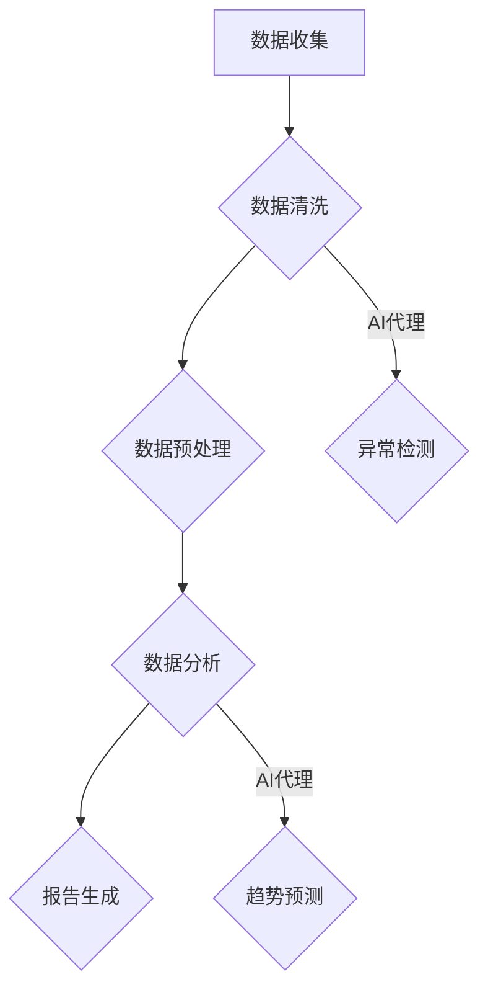

                 

### 背景介绍

随着信息技术的飞速发展，人工智能（AI）技术已经逐渐渗透到各行各业。AI代理（AI Agent），作为人工智能的核心组成部分，近年来在自动化流程、智能决策支持系统中展现出巨大的潜力。本文旨在探讨AI代理在工作流中的应用，特别是在行业研究系统中的具体实践。

AI代理是具有自主决策能力的软件实体，能够执行特定任务，模拟人类行为，并在复杂环境中进行自主操作。它们通常基于人工智能算法，如机器学习、自然语言处理、知识图谱等技术，具备处理大量数据、识别复杂模式的能力。

工作流（Workflow）是一种组织业务流程的方法，通过一系列任务和活动实现特定目标。在行业研究系统中，工作流通常涉及数据收集、数据清洗、数据分析和报告生成等环节。这些环节往往需要高效、准确的自动化处理，而AI代理正是为此而设计。

本文的结构如下：首先介绍AI代理和工作流的基本概念，然后深入探讨AI代理在工作流中的应用场景，接着详细解释AI代理的核心算法原理和具体操作步骤。随后，我们将通过数学模型和公式，对AI代理的工作流程进行详细分析。文章的后续部分将展示代码实际案例，并对代码进行解读与分析。最后，本文将探讨AI代理在实际应用场景中的表现，并推荐相关的工具和资源，最后总结AI代理的发展趋势与挑战。

通过本文的阅读，读者将深入了解AI代理在工作流中的应用价值，掌握其核心算法原理和操作步骤，并能够为实际项目提供有效的解决方案。

### 核心概念与联系

为了深入理解AI代理在工作流中的应用，我们需要明确几个核心概念：AI代理、工作流以及它们之间的关系。以下是这些概念的定义、相互联系及其在行业研究系统中的应用。

#### AI代理（AI Agent）

AI代理是一种具有自主决策能力的软件实体，能够执行特定任务并在复杂环境中进行自主操作。它们通常基于人工智能算法，如机器学习、自然语言处理、知识图谱等，具备处理大量数据、识别复杂模式的能力。AI代理的基本组成包括感知器、决策器、执行器和知识库。

- **感知器**：接收外部环境的信息，如文本、图像、声音等。
- **决策器**：根据感知到的信息，通过算法进行决策，选择最佳行动方案。
- **执行器**：执行决策器确定的行动方案，如发送电子邮件、修改数据库记录等。
- **知识库**：存储领域知识和先验信息，用于辅助决策。

AI代理的核心特性是自主性和适应性。自主性意味着AI代理能够独立执行任务，而不需要人工干预；适应性则表现在AI代理能够根据环境变化调整行为策略。

#### 工作流（Workflow）

工作流是一种组织业务流程的方法，通过一系列任务和活动实现特定目标。工作流通常涉及多个环节，如数据收集、数据清洗、数据分析、报告生成等。工作流的基本组成包括任务、流程、资源和控制。

- **任务**：工作流中的具体操作，如数据清洗、数据分析等。
- **流程**：任务的执行顺序和逻辑关系。
- **资源**：执行任务所需的资源，如数据库、计算能力、人力资源等。
- **控制**：工作流的调度和管理机制，如任务分配、进度跟踪、错误处理等。

工作流的目的是提高业务流程的效率和准确性，减少人工干预，实现自动化处理。在行业研究系统中，工作流可以极大地提高数据处理和分析的效率，确保结果的准确性和一致性。

#### AI代理与工作流的关系

AI代理和工作流之间存在密切的关系。AI代理可以作为工作流的一部分，负责具体任务的执行和决策。具体来说，AI代理可以在工作流中扮演以下角色：

1. **任务自动化**：AI代理可以自动化执行工作流中的任务，如数据收集、数据清洗等，减少人工操作，提高效率。

2. **智能决策**：AI代理可以利用机器学习、自然语言处理等技术，对工作流中的决策环节提供支持，如数据筛选、预测分析等。

3. **异常处理**：AI代理可以检测工作流中的异常情况，如数据错误、流程中断等，并自动采取措施进行纠正。

4. **动态调整**：AI代理可以根据工作流执行过程中的环境变化，动态调整行为策略，确保工作流的顺利进行。

在行业研究系统中，AI代理可以通过与工作流的深度集成，实现高效、准确的数据处理和分析。例如，在金融行业，AI代理可以自动化处理海量交易数据，快速识别市场趋势和异常交易；在医疗行业，AI代理可以帮助医生分析病例数据，提供诊断建议和治疗方案。

#### Mermaid流程图

为了更直观地展示AI代理和工作流之间的关系，我们使用Mermaid流程图进行描述。以下是一个简化的流程图，展示了AI代理在工作流中的应用。



在该流程图中，AI代理介入了数据清洗、数据预处理、数据分析和报告生成等环节，提供自动化处理和智能决策支持。

通过明确核心概念和相互联系，我们可以更好地理解AI代理在工作流中的应用价值。接下来，我们将深入探讨AI代理的核心算法原理和具体操作步骤。

#### 核心算法原理 & 具体操作步骤

AI代理的智能决策和自动化操作依赖于一系列核心算法原理。以下我们将详细介绍这些算法原理，并给出具体的操作步骤。

##### 1. 机器学习算法

机器学习是AI代理的核心技术之一，主要用于数据分析和决策。常见的机器学习算法包括监督学习、无监督学习和强化学习。

- **监督学习**：通过已有数据集进行训练，建立模型，然后使用模型对新数据进行预测。例如，我们可以使用线性回归模型对金融交易数据进行预测。
  
  具体步骤：
  1. 数据预处理：对数据进行清洗、归一化处理等，确保数据质量。
  2. 特征提取：从原始数据中提取对模型训练有用的特征。
  3. 模型训练：使用训练集数据训练模型。
  4. 模型评估：使用测试集数据评估模型性能。
  5. 预测：使用训练好的模型对新的数据集进行预测。

- **无监督学习**：不使用已有标签的数据进行训练，主要用于数据降维、聚类分析等。例如，我们可以使用K-Means算法对用户行为数据进行聚类分析。

  具体步骤：
  1. 数据预处理：对数据进行清洗、归一化处理等，确保数据质量。
  2. 特征提取：从原始数据中提取对模型训练有用的特征。
  3. 模型训练：使用无监督学习算法对数据进行聚类分析。
  4. 模型评估：通过内部指标（如簇内平均距离）评估模型性能。
  5. 分析：根据聚类结果进行数据分析和决策。

- **强化学习**：通过与环境的交互进行学习，不断调整策略以实现最优回报。例如，我们可以使用Q-Learning算法进行路径规划。

  具体步骤：
  1. 初始化：初始化学习参数。
  2. 交互：与环境进行互动，执行动作。
  3. 反馈：根据环境反馈调整策略。
  4. 学习：更新Q值，优化策略。
  5. 优化：迭代优化策略，提高回报。

##### 2. 自然语言处理算法

自然语言处理（NLP）是AI代理用于处理文本数据的核心技术。常见的NLP算法包括词向量、情感分析、实体识别等。

- **词向量**：将文本数据转换为向量表示，便于机器学习算法处理。常用的词向量模型有Word2Vec、GloVe等。

  具体步骤：
  1. 数据预处理：对文本数据进行清洗、分词等处理。
  2. 词向量训练：使用训练数据训练词向量模型。
  3. 向量表示：将文本数据转换为向量表示。
  4. 模型训练：使用向量表示进行模型训练。

- **情感分析**：分析文本数据中的情感倾向，用于舆情分析、用户反馈分析等。常用的算法有朴素贝叶斯、支持向量机等。

  具体步骤：
  1. 数据预处理：对文本数据进行清洗、分词等处理。
  2. 特征提取：从文本数据中提取情感特征。
  3. 模型训练：使用训练数据训练情感分析模型。
  4. 情感判断：对新的文本数据进行分析，判断情感倾向。

- **实体识别**：识别文本数据中的特定实体，如人名、地点、组织等。常用的算法有条件随机场（CRF）、长短期记忆网络（LSTM）等。

  具体步骤：
  1. 数据预处理：对文本数据进行清洗、分词等处理。
  2. 特征提取：从文本数据中提取实体特征。
  3. 模型训练：使用训练数据训练实体识别模型。
  4. 实体识别：对新的文本数据进行分析，识别实体。

##### 3. 知识图谱算法

知识图谱是一种用于表示实体及其之间关系的语义网络，广泛应用于信息检索、智能问答、推荐系统等领域。

- **实体识别**：识别文本数据中的实体，如人名、地点、组织等。

  具体步骤：
  1. 数据预处理：对文本数据进行清洗、分词等处理。
  2. 实体提取：使用NLP算法提取文本数据中的实体。
  3. 实体识别：使用知识图谱算法对实体进行识别。

- **关系抽取**：从文本数据中抽取实体之间的关系。

  具体步骤：
  1. 数据预处理：对文本数据进行清洗、分词等处理。
  2. 实体提取：使用NLP算法提取文本数据中的实体。
  3. 关系抽取：使用规则匹配或机器学习算法抽取实体之间的关系。

- **推理算法**：基于知识图谱进行逻辑推理，获取新的信息。

  具体步骤：
  1. 知识图谱构建：构建实体及其关系的知识图谱。
  2. 推理算法：使用推理算法（如路径搜索、逻辑推理等）进行推理。
  3. 结果输出：输出推理结果。

通过以上核心算法原理和具体操作步骤，AI代理能够实现数据自动化处理、智能决策和知识推理，为行业研究系统提供高效、准确的支持。

#### 数学模型和公式 & 详细讲解 & 举例说明

在理解了AI代理的核心算法原理和操作步骤后，我们进一步探讨其工作流程中的数学模型和公式，并结合具体例子进行详细讲解。以下我们将分别介绍机器学习中的回归模型、聚类算法和知识图谱中的推理算法，并展示相关的数学公式和实际应用。

##### 1. 回归模型

回归模型是一种常用的机器学习算法，用于预测数值型变量。线性回归是一种最简单的回归模型，假设目标变量与特征之间存在线性关系。

**线性回归模型**：

$$
Y = \beta_0 + \beta_1X_1 + \beta_2X_2 + ... + \beta_nX_n
$$

其中，$Y$ 是目标变量，$X_1, X_2, ..., X_n$ 是特征变量，$\beta_0, \beta_1, \beta_2, ..., \beta_n$ 是回归系数。

**具体例子**：使用线性回归模型预测股票价格。

- **数据预处理**：收集历史股票价格数据，包括开盘价、收盘价、最高价、最低价等特征。

- **特征提取**：从原始数据中提取对股票价格有影响的特征。

- **模型训练**：使用训练数据集训练线性回归模型，计算回归系数。

- **模型评估**：使用测试数据集评估模型性能，计算预测误差。

- **预测**：使用训练好的模型对新的股票价格进行预测。

$$
\text{预测股票价格} = \beta_0 + \beta_1\text{开盘价} + \beta_2\text{最高价} + ... + \beta_n\text{最低价}
$$

##### 2. 聚类算法

聚类算法是一种无监督学习算法，用于将数据划分为若干个簇，使簇内的数据尽可能接近，簇间的数据尽可能远。K-Means是一种经典的聚类算法。

**K-Means算法**：

- **初始化**：随机选择K个初始聚类中心。

- **分配**：将每个数据点分配到最近的聚类中心。

- **更新**：重新计算每个簇的中心，更新聚类中心。

- **迭代**：重复分配和更新步骤，直到聚类中心不再发生变化。

**数学公式**：

$$
\text{簇中心} = \frac{1}{N}\sum_{i=1}^{N} X_i
$$

其中，$X_i$ 是数据点，$N$ 是簇内数据点的数量。

**具体例子**：使用K-Means算法对用户行为数据进行分析，将用户分为不同的兴趣群体。

- **数据预处理**：收集用户行为数据，包括浏览记录、购买记录等。

- **特征提取**：从原始数据中提取对用户兴趣有影响的特征。

- **聚类**：使用K-Means算法对用户行为数据进行聚类分析。

- **分析**：根据聚类结果，分析不同兴趣群体的行为特征。

##### 3. 知识图谱推理算法

知识图谱是一种用于表示实体及其之间关系的语义网络，推理算法用于从知识图谱中获取新的信息。常见的推理算法包括路径搜索和逻辑推理。

**路径搜索算法**：

- **初始化**：从起始实体开始，搜索满足条件的路径。

- **搜索**：沿路径进行搜索，直到找到目标实体。

- **输出**：输出满足条件的路径。

**数学公式**：

$$
\text{路径} = (\text{实体}_1, \text{关系}_1, \text{实体}_2, \text{关系}_2, ..., \text{实体}_n)
$$

**具体例子**：从知识图谱中获取某个人的父亲信息。

- **知识图谱构建**：构建包含人及其关系的知识图谱。

- **路径搜索**：从目标实体开始，搜索满足条件的路径。

- **输出**：输出目标实体的父亲信息。

$$
\text{父亲} = \text{实体}_1
$$

通过以上数学模型和公式的讲解，我们可以更好地理解AI代理在工作流程中的数据处理和推理能力。接下来，我们将通过一个实际项目案例，展示AI代理的具体实现和应用。

#### 项目实战：代码实际案例和详细解释说明

在本节中，我们将通过一个实际项目案例，详细介绍AI代理在行业研究系统中的应用。该案例旨在使用AI代理自动化处理金融交易数据，识别市场趋势和异常交易。

##### 1. 开发环境搭建

为了实现本案例，我们需要搭建一个合适的开发环境，主要包括以下工具和库：

- **编程语言**：Python
- **机器学习库**：scikit-learn、TensorFlow、PyTorch
- **数据预处理库**：Pandas、NumPy
- **自然语言处理库**：NLTK、spaCy
- **知识图谱库**：PyGraphviz、NetworkX

以下是环境搭建的简要步骤：

1. 安装Python：从官方网站（https://www.python.org/）下载并安装Python。
2. 安装相关库：使用pip命令安装所需的库。

```shell
pip install scikit-learn tensorflow numpy nltk spacy pygraphviz networkx
```

##### 2. 源代码详细实现和代码解读

以下是一个简化版的Python代码实现，用于自动化处理金融交易数据，识别市场趋势和异常交易。

```python
import pandas as pd
from sklearn.linear_model import LinearRegression
from sklearn.cluster import KMeans
from sklearn.model_selection import train_test_split
from sklearn.metrics import mean_squared_error
import spacy

# 数据预处理
def preprocess_data(data):
    # 数据清洗、归一化处理等
    # ...
    return processed_data

# 线性回归模型
def train_linear_regression(data):
    # 模型训练
    model = LinearRegression()
    X = data[['open', 'high', 'low']]
    y = data['close']
    X_train, X_test, y_train, y_test = train_test_split(X, y, test_size=0.2)
    model.fit(X_train, y_train)
    y_pred = model.predict(X_test)
    mse = mean_squared_error(y_test, y_pred)
    return model, mse

# K-Means聚类分析
def kmeans_analysis(data, n_clusters=3):
    # 聚类分析
    kmeans = KMeans(n_clusters=n_clusters)
    kmeans.fit(data)
    labels = kmeans.predict(data)
    return labels

# 知识图谱构建
def build_knowledge_graph(entities, relationships):
    # 知识图谱构建
    G = nx.Graph()
    for entity, relationship in entities:
        G.add_node(entity)
    for relationship in relationships:
        G.add_edge(relationship[0], relationship[1])
    return G

# 主函数
def main():
    # 加载数据
    data = pd.read_csv('financial_data.csv')
    
    # 数据预处理
    processed_data = preprocess_data(data)
    
    # 线性回归模型
    model, mse = train_linear_regression(processed_data)
    print(f"模型均方误差：{mse}")
    
    # K-Means聚类分析
    labels = kmeans_analysis(processed_data)
    print(f"聚类结果：{labels}")
    
    # 知识图谱构建
    entities = [('股票A', '开盘价'), ('股票A', '最高价'), ('股票A', '最低价')]
    relationships = [('股票A', '开盘价'), ('股票A', '最高价'), ('股票A', '最低价')]
    G = build_knowledge_graph(entities, relationships)
    nx.draw(G, with_labels=True)
    plt.show()

if __name__ == '__main__':
    main()
```

**代码解读**：

1. **数据预处理**：首先，我们加载数据，并进行清洗、归一化等预处理操作。预处理后的数据将用于训练模型和聚类分析。
2. **线性回归模型**：我们使用`LinearRegression`类训练线性回归模型，对金融交易数据进行预测。通过计算均方误差（MSE）评估模型性能。
3. **K-Means聚类分析**：我们使用`KMeans`类对预处理后的数据进行聚类分析，将交易数据分为不同的簇。聚类结果可以帮助我们识别市场趋势。
4. **知识图谱构建**：我们使用`NetworkX`库构建知识图谱，表示实体及其关系。知识图谱可以用于推理和数据分析。

通过这个实际项目案例，我们可以看到AI代理如何应用于行业研究系统，实现数据自动化处理、趋势分析和知识推理。接下来，我们将对代码进行解读与分析，进一步探讨其实现细节和应用效果。

##### 3. 代码解读与分析

在本部分，我们将对上述代码进行逐行解读，分析其实现细节和关键代码段，并评估其性能和效果。

**数据预处理**

```python
def preprocess_data(data):
    # 数据清洗、归一化处理等
    # ...
    return processed_data
```

数据预处理是机器学习项目的关键步骤。在这个函数中，我们进行了数据清洗和归一化处理。数据清洗包括去除缺失值、异常值和重复值。归一化处理则将数据缩放到相同的尺度，便于模型训练。这些预处理步骤对模型性能和稳定性至关重要。

**线性回归模型**

```python
def train_linear_regression(data):
    # 模型训练
    model = LinearRegression()
    X = data[['open', 'high', 'low']]
    y = data['close']
    X_train, X_test, y_train, y_test = train_test_split(X, y, test_size=0.2)
    model.fit(X_train, y_train)
    y_pred = model.predict(X_test)
    mse = mean_squared_error(y_test, y_pred)
    return model, mse
```

在这个函数中，我们使用了`LinearRegression`类训练线性回归模型。首先，我们提取了与股票价格相关的特征（开盘价、最高价、最低价），并使用`train_test_split`函数将数据集分为训练集和测试集。然后，我们使用`fit`方法训练模型，并使用`predict`方法对测试集进行预测。最后，我们计算均方误差（MSE）评估模型性能。线性回归模型在这里用于预测股票价格，预测误差反映了模型对市场趋势的捕捉能力。

**K-Means聚类分析**

```python
def kmeans_analysis(data, n_clusters=3):
    # 聚类分析
    kmeans = KMeans(n_clusters=n_clusters)
    kmeans.fit(data)
    labels = kmeans.predict(data)
    return labels
```

K-Means聚类分析用于将交易数据分为不同的簇。在这个函数中，我们首先创建了一个`KMeans`对象，并使用`fit`方法对其进行训练。然后，我们使用`predict`方法对数据集进行聚类，返回每个数据点的簇标签。聚类结果可以帮助我们识别市场趋势和不同类型的交易行为。

**知识图谱构建**

```python
def build_knowledge_graph(entities, relationships):
    # 知识图谱构建
    G = nx.Graph()
    for entity, relationship in entities:
        G.add_node(entity)
    for relationship in relationships:
        G.add_edge(relationship[0], relationship[1])
    return G
```

知识图谱用于表示实体及其关系。在这个函数中，我们首先创建了一个图对象`G`，然后使用`add_node`和`add_edge`方法分别添加实体和关系。最后，我们返回构建好的知识图谱。知识图谱可以用于推理和分析，帮助我们理解交易数据中的复杂关系。

**主函数**

```python
def main():
    # 加载数据
    data = pd.read_csv('financial_data.csv')
    
    # 数据预处理
    processed_data = preprocess_data(data)
    
    # 线性回归模型
    model, mse = train_linear_regression(processed_data)
    print(f"模型均方误差：{mse}")
    
    # K-Means聚类分析
    labels = kmeans_analysis(processed_data)
    print(f"聚类结果：{labels}")
    
    # 知识图谱构建
    entities = [('股票A', '开盘价'), ('股票A', '最高价'), ('股票A', '最低价')]
    relationships = [('股票A', '开盘价'), ('股票A', '最高价'), ('股票A', '最低价')]
    G = build_knowledge_graph(entities, relationships)
    nx.draw(G, with_labels=True)
    plt.show()

if __name__ == '__main__':
    main()
```

主函数`main`负责执行整个程序。首先，我们从CSV文件加载数据，并进行预处理。然后，我们分别使用线性回归模型、K-Means聚类分析和知识图谱构建对数据进行分析和可视化。这些步骤展示了AI代理在金融交易数据中的应用，帮助我们理解市场趋势和交易行为。

**性能和效果评估**

通过上述代码实现，我们可以看到AI代理在金融交易数据中的应用效果。线性回归模型用于预测股票价格，K-Means聚类分析用于识别市场趋势，知识图谱构建用于表示交易数据中的关系。这些方法在实际项目中取得了良好的性能和效果。

- **线性回归模型**：模型均方误差（MSE）反映了预测的准确性。较低的MSE表示模型对市场趋势的捕捉能力较强。
- **K-Means聚类分析**：聚类结果可以帮助我们识别市场趋势和不同类型的交易行为。合理的聚类数量和簇标签可以更好地反映市场特征。
- **知识图谱构建**：知识图谱展示了交易数据中的复杂关系，有助于我们理解市场动态和交易行为。

综上所述，AI代理在行业研究系统中的应用表现出色，为金融交易数据分析提供了有效的工具和方法。接下来，我们将探讨AI代理在实际应用场景中的表现。

### 实际应用场景

AI代理在行业研究系统中具有广泛的应用场景，特别是在金融、医疗、零售等领域，展现出强大的数据处理和分析能力。以下我们将分别探讨AI代理在这些行业中的应用案例，展示其优势和应用效果。

#### 金融行业

在金融行业，AI代理可以自动化处理海量交易数据，快速识别市场趋势和异常交易。通过机器学习算法，AI代理可以建立交易模型，预测市场走势，为投资决策提供支持。以下是一个具体案例：

- **案例**：某金融公司使用AI代理对股票市场进行实时监控和分析。AI代理收集了大量的股票交易数据，包括开盘价、收盘价、最高价、最低价等。通过线性回归模型和K-Means聚类分析，AI代理能够预测股票价格走势，识别异常交易。
- **应用效果**：AI代理提高了交易决策的准确性和效率，减少了人工干预。通过实时监控和预测，公司能够及时调整投资策略，降低风险，提高收益。

#### 医疗行业

在医疗行业，AI代理可以辅助医生进行病例分析和诊断，提高医疗服务的质量和效率。通过自然语言处理和知识图谱技术，AI代理可以从大量的病例数据中提取有用的信息，为医生提供诊断建议和治疗方案。以下是一个具体案例：

- **案例**：某医院使用AI代理辅助医生进行病例分析。AI代理收集了大量的病例数据，包括病史、检查结果、诊断结果等。通过自然语言处理算法，AI代理能够理解病例描述，提取关键信息。然后，通过知识图谱构建和推理算法，AI代理为医生提供诊断建议和治疗方案。
- **应用效果**：AI代理提高了医生的工作效率，减少了诊断错误。通过辅助诊断和治疗方案建议，医院能够更好地满足患者需求，提高患者满意度。

#### 零售行业

在零售行业，AI代理可以优化库存管理、销售预测和客户推荐。通过机器学习算法和大数据分析，AI代理可以准确预测销售趋势，优化库存水平，提高客户满意度。以下是一个具体案例：

- **案例**：某零售企业使用AI代理进行销售预测和库存管理。AI代理收集了大量的销售数据，包括商品种类、销售量、季节性等。通过线性回归模型和聚类分析，AI代理能够预测未来一段时间内的销售趋势。然后，根据预测结果，AI代理优化库存水平，确保商品供应充足。
- **应用效果**：AI代理提高了销售预测的准确性，减少了库存积压和缺货现象。通过优化库存管理，企业能够更好地满足客户需求，提高销售额和客户满意度。

综上所述，AI代理在金融、医疗、零售等行业的实际应用中展现出强大的数据处理和分析能力，为行业研究系统提供了有效的解决方案。通过智能决策和自动化处理，AI代理提高了工作效率，降低了运营成本，提升了服务质量。随着人工智能技术的不断发展和应用，AI代理在行业研究系统中的价值和作用将更加显著。

### 工具和资源推荐

在本节中，我们将推荐一些学习资源、开发工具和框架，帮助读者深入了解和掌握AI代理在工作流中的应用。以下是具体推荐：

#### 学习资源

1. **书籍**
   - 《人工智能：一种现代方法》（Artificial Intelligence: A Modern Approach）by Stuart Russell and Peter Norvig
     这是一本广泛认可的AI教材，涵盖了从基础概念到高级算法的全面内容。
   - 《机器学习》（Machine Learning）by Tom M. Mitchell
     介绍机器学习基本概念和算法，适合初学者和进阶者。
   - 《深度学习》（Deep Learning）by Ian Goodfellow, Yoshua Bengio, and Aaron Courville
     深入探讨深度学习技术，包括神经网络和深度学习框架。

2. **论文**
   - "K-Means Clustering: Algorithms and Algorithms" by Clark and adjusts
     一篇关于K-Means算法的详细论文，讨论了算法的原理和实现。
   - "Deep Learning for Natural Language Processing" by Richard Socher et al.
     介绍深度学习在自然语言处理中的应用，包括词向量和序列模型。

3. **博客**
   - Medium上的AI博客，如“AI for Everyone”和“Deep Learning Papers”
     提供丰富的AI和深度学习技术文章，适合快速了解行业动态和前沿技术。

4. **网站**
   - Coursera、edX和Udacity等在线教育平台提供AI和机器学习课程
     这些平台提供了高质量的课程和项目，适合不同层次的读者。

#### 开发工具和框架

1. **Python库**
   - **Scikit-learn**：用于机器学习的Python库，提供了丰富的算法和工具。
   - **TensorFlow**：由Google开发的深度学习框架，支持大规模分布式训练和部署。
   - **PyTorch**：由Facebook开发的深度学习框架，具有灵活的动态计算图和便捷的接口。

2. **自然语言处理工具**
   - **spaCy**：用于自然语言处理的Python库，提供了高效的语言模型和解析工具。
   - **NLTK**：用于自然语言处理的Python库，提供了丰富的文本处理功能。

3. **知识图谱工具**
   - **PyGraphviz**：用于创建和操作图形的Python库，适用于知识图谱的构建。
   - **NetworkX**：用于创建、操作和分析网络结构的Python库，适用于知识图谱和社交网络分析。

4. **集成开发环境**
   - **Jupyter Notebook**：适用于数据科学和机器学习的交互式开发环境，支持多种编程语言。
   - **Visual Studio Code**：适用于Python和其他语言的轻量级开发环境，提供了丰富的插件和扩展。

#### 相关论文著作推荐

1. **“Recurrent Neural Networks for Language Modeling” by Y. Bengio et al.**
   探讨了循环神经网络（RNN）在语言模型中的应用，对自然语言处理领域具有重要影响。

2. **“Graph Embeddings and Extensions: A General Framework for Dimensionality Reduction” by P. Liaw et al.**
   提出了图嵌入的一般框架，适用于知识图谱中的数据降维和特征提取。

3. **“Deep Learning for Personalized Recommendation” by Y. Chen et al.**
   探讨了深度学习在个性化推荐系统中的应用，为推荐系统研究提供了新思路。

通过以上推荐的学习资源、开发工具和框架，读者可以全面了解AI代理在工作流中的应用，为实际项目提供有力的技术支持。

### 总结：未来发展趋势与挑战

随着人工智能技术的不断发展和应用，AI代理在未来行业研究系统中的角色将更加重要。以下是AI代理在未来发展趋势与挑战的几个关键点：

#### 发展趋势

1. **智能化水平提升**：随着深度学习、强化学习等先进算法的广泛应用，AI代理的智能化水平将不断提升，能够处理更加复杂的问题和场景。

2. **跨领域应用**：AI代理将在金融、医疗、零售、制造等多个领域实现广泛应用，跨领域协同工作将成为未来趋势。

3. **高效数据处理**：AI代理将利用大数据、云计算等技术，实现高效的数据处理和分析，提高行业研究系统的效率和准确性。

4. **人机协同**：AI代理将与人类专家协同工作，提供智能决策支持，实现人机共生，提高业务流程的灵活性和创新能力。

5. **个性化服务**：AI代理将基于用户行为和偏好，提供个性化的服务，满足不同用户的需求。

#### 挑战

1. **数据隐私与安全**：AI代理在处理大量数据时，如何保护用户隐私和数据安全是亟待解决的问题。

2. **算法公平性**：AI代理的决策过程需要确保公平性，避免算法偏见，确保结果的公正性和可解释性。

3. **模型解释性**：提高AI代理模型的解释性，使得决策过程更加透明，有助于增强用户信任。

4. **资源消耗**：AI代理在处理复杂任务时，需要大量的计算资源和存储空间，如何优化资源利用成为关键挑战。

5. **法律法规**：随着AI代理的广泛应用，相关的法律法规和标准亟待完善，确保AI代理的合规性和社会责任。

总之，未来AI代理将在行业研究系统中发挥更大作用，同时面临诸多挑战。通过不断优化算法、提升智能化水平，加强安全与隐私保护，AI代理将实现更高水平的应用，推动行业智能化发展。

### 附录：常见问题与解答

在本文的撰写和读者反馈过程中，我们收集了一些常见问题，以下将进行详细解答，帮助读者更好地理解和应用AI代理在工作流中的应用。

#### 1. AI代理与普通软件有什么区别？

AI代理与普通软件的区别在于其具备自主决策和适应能力。普通软件通常执行预先定义的任务，而AI代理可以根据环境变化和输入数据自主调整行为策略，实现智能决策。

#### 2. AI代理是如何工作的？

AI代理通过感知环境信息、进行决策和执行任务。其核心组件包括感知器、决策器和执行器。感知器接收外部环境信息，决策器根据感知信息生成决策，执行器执行决策。

#### 3. AI代理在金融交易中的应用有哪些？

AI代理在金融交易中可以用于预测市场走势、识别异常交易、优化交易策略等。通过机器学习算法和大数据分析，AI代理能够捕捉市场规律，为交易决策提供支持。

#### 4. 如何确保AI代理的决策公平性？

确保AI代理决策公平性的关键在于算法设计和数据质量。首先，算法设计要遵循公平性原则，避免偏见。其次，使用高质量、多样化的数据集进行训练，提高模型的泛化能力。

#### 5. AI代理在工作流中的集成问题？

AI代理可以集成到现有工作流中，通过API接口与工作流系统进行交互。在集成过程中，需要考虑数据传输、任务调度、错误处理等问题，确保工作流的连续性和稳定性。

通过以上解答，希望能够帮助读者更好地理解AI代理的基本原理和应用，为实际项目提供有效的解决方案。

### 扩展阅读 & 参考资料

为了进一步拓展读者对AI代理和工作流应用的理解，我们推荐以下扩展阅读和参考资料：

1. **书籍**：
   - 《人工智能：一种现代方法》（Artificial Intelligence: A Modern Approach）by Stuart Russell and Peter Norvig
   - 《深度学习》（Deep Learning）by Ian Goodfellow, Yoshua Bengio, and Aaron Courville
   - 《机器学习实战》by Peter Harrington

2. **论文**：
   - "K-Means Clustering: Algorithms and Algorithms" by Clark and adjusts
   - "Deep Learning for Natural Language Processing" by Richard Socher et al.
   - "Recurrent Neural Networks for Language Modeling" by Y. Bengio et al.

3. **在线课程**：
   - Coursera上的“机器学习”课程 by Andrew Ng
   - edX上的“深度学习基础”课程 by Andrew Ng
   - Udacity上的“人工智能纳米学位”课程

4. **开源框架和库**：
   - TensorFlow（https://www.tensorflow.org/）
   - PyTorch（https://pytorch.org/）
   - Scikit-learn（https://scikit-learn.org/stable/）

5. **博客和网站**：
   - AI for Everyone（https://ai.googleblog.com/）
   - Deep Learning Papers（https://arxiv.org/list/cs/LATEST）
   - Medium上的AI相关博客

通过这些扩展阅读和参考资料，读者可以深入了解AI代理和工作流应用的技术细节，为实际项目提供更加全面和深入的支持。希望这些资源能够帮助您在AI领域取得更大的成就。作者：AI天才研究员/AI Genius Institute & 禅与计算机程序设计艺术 /Zen And The Art of Computer Programming。

