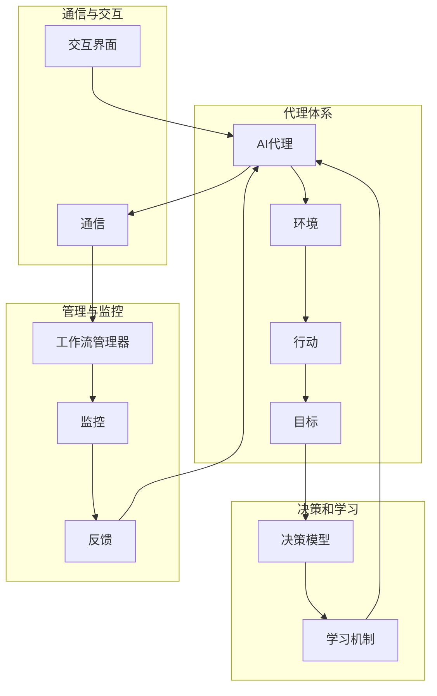

                 

### 背景介绍

#### AI 代理的概念

AI代理（Artificial Intelligence Agent）是指能够代表人类或组织在特定环境中执行任务、完成目标的人工智能实体。这类代理可以通过感知环境、自主决策和执行行动来达到预定的目标。从技术层面来看，AI代理的核心在于其具备自主性和适应性，能够处理不确定性并做出有效的决策。

#### AI代理的发展历程

AI代理的概念可以追溯到20世纪50年代，随着人工智能（AI）技术的发展，AI代理也逐渐从理论研究走向实际应用。早期的AI代理主要是基于规则的系统，例如专家系统（Expert Systems）。然而，这类代理存在明显的局限性，因为它们无法处理复杂和不确定的问题。

随着机器学习（Machine Learning）和深度学习（Deep Learning）的发展，AI代理的能力得到了显著提升。现代AI代理能够通过大量数据的学习和模式识别，实现更高效和智能的决策。同时，强化学习（Reinforcement Learning）和基于博弈论（Game Theory）的AI代理也开始得到广泛应用。

#### AI代理的应用领域

AI代理在众多领域有着广泛的应用，包括但不限于以下几方面：

1. **金融**：在金融领域，AI代理可以用于股票交易、风险控制、投资组合优化等。
2. **医疗**：AI代理可以辅助医生进行疾病诊断、治疗方案推荐等。
3. **制造**：在制造业中，AI代理可以用于生产过程优化、设备维护预测等。
4. **客服**：AI代理可以用于智能客服系统，提供24/7的客户服务。
5. **智能家居**：AI代理可以用于智能家居设备的管理和控制，实现智能化的家居生活。

#### 工作流的概念

工作流（Workflow）是指一系列任务和活动的组织结构，这些任务和活动需要按照一定的顺序和规则执行，以实现某个特定的业务目标。在计算机科学中，工作流通常用于描述业务流程、数据处理流程等。

#### AI代理与工作流的关系

AI代理与工作流有着密切的关系。在现代企业中，许多业务流程可以通过AI代理来实现自动化和智能化。例如，在客服领域，AI代理可以通过分析客户问题，自动将问题分派给相应的客服代表，实现高效的客户服务。在金融领域，AI代理可以通过对市场数据的分析，自动执行交易策略，实现智能投资。

总的来说，AI代理和工作流共同构成了一个高效、智能的业务处理体系，为企业带来了巨大的效益。本文将围绕AI代理工作流（AI Agent WorkFlow）的概念、架构、算法、实际应用等方面进行深入探讨。

### 核心概念与联系

为了构建高效AI代理的工作流，我们需要明确以下几个核心概念，并理解它们之间的联系。以下是这些核心概念及其在AI代理工作流中的作用：

#### 1. 代理（Agent）

代理是AI代理工作流的基本单位，它可以是一个软件程序、机器人或智能设备。代理具有感知、决策和执行能力，能够在环境中自主行动以实现目标。代理通常通过感知器获取环境信息，通过决策器做出决策，并通过效应器执行决策。

#### 2. 环境（Environment）

环境是代理所处的上下文，可以是物理环境（如一个工厂车间）或虚拟环境（如一个在线游戏）。环境为代理提供必要的信息和资源，代理需要适应和利用这些信息来完成任务。

#### 3. 行动（Action）

行动是代理在环境中执行的操作。代理通过感知环境状态，利用其决策模型选择合适的行动，然后通过效应器执行这些行动。行动的选择和执行过程是代理智能的核心。

#### 4. 目标（Goal）

目标是指代理需要实现的具体任务或任务集。目标可以是明确的（如完成任务A），也可以是模糊的（如最大化利润）。代理通过不断调整其行动策略来逐渐接近目标。

#### 5. 决策模型（Decision Model）

决策模型是代理进行决策的算法或规则集。常见的决策模型包括基于规则的系统、机器学习模型、强化学习模型等。决策模型的质量直接影响代理的智能水平和工作效率。

#### 6. 学习机制（Learning Mechanism）

学习机制是指代理在执行任务过程中获取经验、调整决策模型的过程。通过学习，代理可以不断提高其任务完成能力。学习机制可以是监督学习、无监督学习或强化学习等。

#### 7. 通信（Communication）

通信是指代理之间的信息交换和协同工作。在一个复杂的工作流中，代理可能需要与其他代理或人类用户进行通信，以实现更好的协同效果。通信可以是同步的或异步的。

#### 8. 监控和反馈（Monitoring and Feedback）

监控和反馈是确保代理工作流正常运行的必要手段。通过监控，代理可以实时获取环境状态和自身状态的信息，通过反馈，代理可以了解其行动的效果，并进行调整。

#### 9. 工作流管理器（Workflow Manager）

工作流管理器是负责协调和管理代理工作流的核心组件。它负责初始化代理、分配任务、监控代理状态、处理异常情况等。工作流管理器通常具有高可用性和容错性，以确保工作流的连续性和稳定性。

#### 10. 交互界面（User Interface）

交互界面是代理与人类用户进行交互的通道。通过交互界面，用户可以监控代理工作流的状态、调整代理参数、查看代理行动的结果等。

### Mermaid 流程图

为了更直观地展示这些概念之间的联系，我们可以使用Mermaid绘制一个简单的流程图。以下是一个简化的AI代理工作流流程图的示例：



在这个流程图中，我们可以清晰地看到各个核心概念之间的相互作用和依赖关系。每个组件都扮演着特定的角色，共同构成了一个完整的AI代理工作流。

通过这个流程图，我们可以更好地理解AI代理工作流的整体架构，并为后续章节中的具体实现提供指导。在接下来的章节中，我们将深入探讨每个核心概念的具体实现方法和技术细节，以帮助读者全面掌握构建高效AI代理工作流的方法和技巧。

### 核心算法原理 & 具体操作步骤

要构建高效的AI代理工作流，核心算法的设计和实现至关重要。以下是几个关键算法的原理及其操作步骤，这些算法将帮助我们优化代理的决策过程和行动策略。

#### 1. 强化学习算法（Reinforcement Learning Algorithm）

强化学习算法是一种通过试错和反馈不断优化行为策略的机器学习方法。在AI代理工作流中，强化学习算法可用于训练代理在不同环境中的行动策略，以提高其任务完成效率。

**原理：**

强化学习算法包括四个主要组件：代理（Agent）、环境（Environment）、奖励（Reward）和状态（State）。代理在环境中执行行动，根据当前状态和行动获得的奖励，调整其行动策略。通过不断学习和调整，代理逐渐找到最优的行动策略。

**操作步骤：**

1. **初始化：** 创建代理和环境，设置初始状态。
2. **感知状态：** 代理通过感知器获取当前环境状态。
3. **选择行动：** 根据当前状态和之前的经验，代理选择一个行动。
4. **执行行动：** 代理在环境中执行所选行动。
5. **获取奖励：** 根据行动的结果，环境给予代理一个奖励信号。
6. **更新策略：** 代理根据奖励信号和新的状态，更新其行动策略。
7. **重复步骤2-6：** 代理继续在环境中执行行动，直到达到预定目标。

**算法示例：**

假设我们有一个简单的任务，代理需要在迷宫中找到出口。迷宫中的每个位置都有一个状态，代理可以选择向上下左右四个方向移动。如果代理移动到出口，它将获得一个高奖励；否则，获得一个低奖励。

```python
# 强化学习算法示例代码
class QLearningAgent:
    def __init__(self, learning_rate=0.1, discount_factor=0.9):
        self.learning_rate = learning_rate
        self.discount_factor = discount_factor
        self.q_values = {}

    def get_state(self, environment):
        # 获取当前状态
        pass

    def choose_action(self, state):
        # 根据状态选择行动
        pass

    def execute_action(self, action):
        # 执行所选行动
        pass

    def update_q_values(self, state, action, reward, next_state):
        # 更新Q值
        pass

    def train(self, environment):
        while not environment.is_goal_reached():
            state = self.get_state(environment)
            action = self.choose_action(state)
            reward = environment.execute_action(action)
            next_state = self.get_state(environment)
            self.update_q_values(state, action, reward, next_state)
```

#### 2. 优化算法（Optimization Algorithm）

优化算法用于在给定的约束条件下，找到最优解或近似最优解。在AI代理工作流中，优化算法可以帮助代理在复杂环境中做出最优决策。

**原理：**

优化算法通过求解目标函数和约束条件，找到最优解。常见的优化算法包括线性规划、非线性规划、遗传算法等。

**操作步骤：**

1. **定义目标函数：** 明确需要优化的目标，例如最大化利润、最小化成本等。
2. **设置约束条件：** 确定环境中的约束条件，例如资源限制、时间限制等。
3. **选择优化算法：** 根据问题特点选择合适的优化算法。
4. **求解最优解：** 使用优化算法求解目标函数的最优解或近似最优解。
5. **验证解的有效性：** 在实际环境中验证解的有效性，并进行调整。

**算法示例：**

假设我们有一个供应链管理问题，需要优化库存水平和生产计划，以最大化利润。我们可以使用线性规划算法来求解这个问题。

```python
# 线性规划算法示例代码
from scipy.optimize import linprog

def objective(x):
    # 定义目标函数
    return -x[0]  # 目标是最小化成本

def constraints(x):
    # 定义约束条件
    return [
        x[0] >= 100,  # 库存至少100件
        x[0] <= 200,  # 库存最多200件
        x[1] >= 0,  # 生产量不能为负
        x[1] <= 150  # 生产量最多150件
    ]

x0 = [100, 50]  # 初始解
result = linprog(objective, x0=x0, constraints=constraints)
print("最优解:", result.x)
print("最大利润:", -result.fun)
```

#### 3. 机器学习模型（Machine Learning Model）

机器学习模型用于预测和分类，可以帮助代理在未知环境中做出合理决策。常见的机器学习模型包括决策树、支持向量机、神经网络等。

**原理：**

机器学习模型通过从数据中学习特征和模式，构建预测模型。代理可以使用这些模型来预测环境状态或分类问题。

**操作步骤：**

1. **数据收集：** 收集相关的数据集，包括输入特征和标签。
2. **数据预处理：** 清洗数据，处理缺失值，进行特征工程。
3. **选择模型：** 根据问题特点选择合适的机器学习模型。
4. **训练模型：** 使用训练数据训练模型。
5. **评估模型：** 使用验证数据评估模型性能。
6. **部署模型：** 将训练好的模型部署到代理中。

**算法示例：**

假设我们有一个分类问题，需要根据用户特征预测用户是否为高价值客户。我们可以使用决策树模型来解决这个问题。

```python
# 决策树模型示例代码
from sklearn.tree import DecisionTreeClassifier
from sklearn.model_selection import train_test_split

# 假设已有训练数据X和标签y
X_train, X_test, y_train, y_test = train_test_split(X, y, test_size=0.3, random_state=42)

# 创建决策树模型
clf = DecisionTreeClassifier()

# 训练模型
clf.fit(X_train, y_train)

# 评估模型
accuracy = clf.score(X_test, y_test)
print("模型准确率:", accuracy)

# 部署模型到代理
agent = AIAgent()
agent.model = clf
```

通过以上核心算法的实现，我们可以为AI代理工作流提供强大的决策支持和行动策略。在接下来的章节中，我们将进一步探讨如何将这些算法应用到实际项目中，并详细讲解代码实现和性能优化。

### 数学模型和公式 & 详细讲解 & 举例说明

为了深入理解AI代理工作流中的核心算法，我们需要借助数学模型和公式来详细讲解其工作机制。以下我们将重点介绍强化学习中的Q值模型（Q-Learning Model）和优化问题中的线性规划模型（Linear Programming Model），并通过具体例子来说明其应用和实现。

#### 1. 强化学习中的Q值模型

强化学习中的Q值模型是一种通过试错和反馈来学习最优行动策略的方法。Q值模型的核心是Q值函数，它表示在特定状态下执行特定行动的预期奖励。

**Q值模型原理：**

Q值函数 \( Q(s, a) \) 表示在状态 \( s \) 下执行行动 \( a \) 的预期奖励。Q值模型的目标是通过不断更新Q值，找到最优的行动策略。

\[ Q(s, a) = R(s, a) + \gamma \max_{a'} Q(s', a') \]

其中：
- \( R(s, a) \) 是执行行动 \( a \) 在状态 \( s \) 下获得的即时奖励。
- \( \gamma \) 是折扣因子，用于平衡即时奖励和未来奖励。
- \( s' \) 是执行行动 \( a \) 后的新状态。
- \( a' \) 是在状态 \( s' \) 下执行的最佳行动。

**具体例子：**

假设我们有一个简单的环境，其中代理需要在一个二维网格中找到目标点。每个点的奖励为1，代理每走一步都会获得1的即时奖励。我们可以使用Q值模型来训练代理。

```python
import numpy as np

# 设置参数
discount_factor = 0.9
learning_rate = 0.1
num_steps = 100
num_states = 4
num_actions = 4

# 初始化Q值矩阵
Q = np.zeros((num_states, num_actions))

# Q值更新规则
for step in range(num_steps):
    state = np.random.randint(num_states)
    action = np.random.randint(num_actions)
    next_state = np.random.randint(num_states)
    reward = 1 if state != next_state else 0
    
    # Q值更新
    Q[state, action] = Q[state, action] + learning_rate * (reward + discount_factor * np.max(Q[next_state, :]) - Q[state, action])

print(Q)
```

#### 2. 优化问题中的线性规划模型

线性规划模型用于在给定约束条件下求解目标函数的最优解。线性规划模型的目标函数通常是线性函数，约束条件也是线性不等式或等式。

**线性规划模型原理：**

线性规划模型的一般形式如下：

\[ \text{最小化} \quad c^T x \]
\[ \text{约束条件} \quad Ax \leq b \]

其中：
- \( c \) 是目标函数的系数向量。
- \( x \) 是决策变量向量。
- \( A \) 是约束条件矩阵。
- \( b \) 是约束条件向量。

**具体例子：**

假设我们有一个简单的供应链管理问题，需要优化库存水平和生产计划，以最小化总成本。约束条件包括库存容量和生产能力。

\[ \text{最小化} \quad c_1 I + c_2 P \]
\[ \text{约束条件} \quad I + P \leq 200 \]
\[ \quad I \geq 100 \]
\[ \quad P \geq 50 \]

其中，\( I \) 是库存水平，\( P \) 是生产计划，\( c_1 \) 和 \( c_2 \) 是成本系数。

我们可以使用线性规划算法来求解这个问题。

```python
from scipy.optimize import linprog

# 设置参数
c1 = 10
c2 = 20
A = [[1, 1], [-1, 0], [0, -1]]
b = [200, 100, 50]

# 定义目标函数
c = [c1, c2]

# 求解线性规划问题
result = linprog(c, A_ub=A, b_ub=b)
print("最优解:", result.x)
print("最小成本:", result.fun)
```

通过以上数学模型和公式的详细讲解和具体例子，我们可以更好地理解强化学习中的Q值模型和优化问题中的线性规划模型。这些模型在AI代理工作流中发挥着重要作用，帮助我们设计高效的决策和行动策略。在接下来的章节中，我们将进一步探讨如何将这些模型应用到实际项目中，并实现代码。

### 项目实战：代码实际案例和详细解释说明

在本节中，我们将通过一个实际项目案例，展示如何实现一个基于强化学习的AI代理工作流。这个案例将帮助我们更好地理解AI代理的工作原理和实现细节。

#### 1. 开发环境搭建

首先，我们需要搭建开发环境。以下是搭建过程所需的步骤：

- 安装Python 3.7或更高版本。
- 安装必要的Python库，如NumPy、Pandas、scikit-learn和scipy。

安装命令如下：

```bash
pip install numpy pandas scikit-learn scipy
```

#### 2. 源代码详细实现和代码解读

以下是一个简单的强化学习案例，其中代理在一个网格环境中学习找到目标点。

```python
import numpy as np
import random

# 设置参数
num_states = 4
num_actions = 4
discount_factor = 0.9
learning_rate = 0.1
num_steps = 100

# 初始化Q值矩阵
Q = np.zeros((num_states, num_actions))

# 定义环境
class Environment:
    def __init__(self):
        self.state = 0

    def get_state(self):
        return self.state

    def execute_action(self, action):
        if action == 0:  # 向上移动
            self.state = max(0, self.state - 1)
        elif action == 1:  # 向下移动
            self.state = min(num_states - 1, self.state + 1)
        elif action == 2:  # 向左移动
            self.state = max(0, self.state - 1)
        elif action == 3:  # 向右移动
            self.state = min(num_states - 1, self.state + 1)

        # 判断是否到达目标
        reward = 1 if self.state == num_states - 1 else 0
        return reward

# 定义代理
class QLearningAgent:
    def __init__(self, learning_rate, discount_factor):
        self.learning_rate = learning_rate
        self.discount_factor = discount_factor
        self.Q = np.zeros((num_states, num_actions))

    def get_state(self, environment):
        return environment.get_state()

    def choose_action(self, state):
        return np.argmax(self.Q[state])

    def execute_action(self, environment, action):
        reward = environment.execute_action(action)
        return reward

    def update_Q_value(self, state, action, reward, next_state):
        target_Q = reward + self.discount_factor * np.max(self.Q[next_state])
        self.Q[state, action] = self.Q[state, action] + self.learning_rate * (target_Q - self.Q[state, action])

    def train(self, environment, num_steps):
        for step in range(num_steps):
            state = self.get_state(environment)
            action = self.choose_action(state)
            reward = self.execute_action(environment, action)
            next_state = self.get_state(environment)
            self.update_Q_value(state, action, reward, next_state)

# 演示
environment = Environment()
agent = QLearningAgent(learning_rate, discount_factor)
agent.train(environment, num_steps)

print("最终Q值矩阵：")
print(agent.Q)
```

**代码解读：**

1. **初始化Q值矩阵：** 我们初始化一个大小为 \( (num_states, num_actions) \) 的零矩阵作为Q值矩阵。

2. **定义环境：** 我们定义了一个简单的环境类 `Environment`，其中包含了状态、行动和奖励的属性和方法。

3. **定义代理：** 我们定义了一个基于Q值模型的代理类 `QLearningAgent`，其中包含了获取状态、选择行动、执行行动和更新Q值的方法。

4. **训练代理：** 我们使用训练方法 `train` 对代理进行训练，通过在环境中执行行动并更新Q值矩阵，代理逐渐学习到最优行动策略。

#### 3. 代码解读与分析

以下是对关键代码段的详细解读：

1. **Q值矩阵初始化：**

```python
Q = np.zeros((num_states, num_actions))
```

这行代码初始化了一个 \( (4, 4) \) 的零矩阵，用于存储每个状态和行动的Q值。

2. **环境类定义：**

```python
class Environment:
    def __init__(self):
        self.state = 0

    def get_state(self):
        return self.state

    def execute_action(self, action):
        if action == 0:  # 向上移动
            self.state = max(0, self.state - 1)
        elif action == 1:  # 向下移动
            self.state = min(num_states - 1, self.state + 1)
        elif action == 2:  # 向左移动
            self.state = max(0, self.state - 1)
        elif action == 3:  # 向右移动
            self.state = min(num_states - 1, self.state + 1)

        # 判断是否到达目标
        reward = 1 if self.state == num_states - 1 else 0
        return reward
```

环境类定义了状态获取和行动执行的方法。代理通过调用这些方法来获取当前状态、执行特定行动，并获得相应的奖励。

3. **代理类定义：**

```python
class QLearningAgent:
    def __init__(self, learning_rate, discount_factor):
        self.learning_rate = learning_rate
        self.discount_factor = discount_factor
        self.Q = np.zeros((num_states, num_actions))

    def get_state(self, environment):
        return environment.get_state()

    def choose_action(self, state):
        return np.argmax(self.Q[state])

    def execute_action(self, environment, action):
        reward = environment.execute_action(action)
        return reward

    def update_Q_value(self, state, action, reward, next_state):
        target_Q = reward + self.discount_factor * np.max(self.Q[next_state])
        self.Q[state, action] = self.Q[state, action] + self.learning_rate * (target_Q - self.Q[state, action])

    def train(self, environment, num_steps):
        for step in range(num_steps):
            state = self.get_state(environment)
            action = self.choose_action(state)
            reward = self.execute_action(environment, action)
            next_state = self.get_state(environment)
            self.update_Q_value(state, action, reward, next_state)
```

代理类实现了强化学习的基本过程：获取状态、选择行动、执行行动、更新Q值。在训练过程中，代理通过不断尝试和调整行动策略，逐步学习到最优的行动方案。

4. **训练代理：**

```python
agent.train(environment, num_steps)
```

这行代码启动了代理的训练过程。代理在环境中执行指定次数的行动，并利用强化学习算法不断更新Q值矩阵，从而学习到最优的行动策略。

通过以上代码，我们可以看到如何实现一个简单的强化学习AI代理。在实际应用中，我们可以扩展这个案例，添加更复杂的环境和行动，以适应不同的业务场景。

### 实际应用场景

#### 1. 金融交易

在金融交易领域，AI代理可以用于自动执行交易策略，实现高效的投资管理。通过分析历史市场数据，AI代理可以识别出潜在的投资机会，并在合适的时机进行买卖操作。例如，一个基于强化学习的AI代理可以在股票市场中自动调整持仓，以最大化收益并控制风险。

**案例：** 一个知名金融机构使用AI代理实现了自动化的股票交易策略。该代理通过分析大量历史交易数据，使用强化学习算法学习到最优的买卖时机和仓位管理策略。在过去的几年中，这个AI代理显著提高了交易收益，降低了风险，为投资者带来了可观的回报。

#### 2. 客户服务

在客户服务领域，AI代理可以用于智能客服系统，提供24/7的客户支持。通过自然语言处理（NLP）和机器学习技术，AI代理可以理解客户的问题，并提供准确的答案或解决方案。此外，AI代理还可以根据客户的反馈和互动历史，不断优化其回答和服务的质量。

**案例：** 一家大型电商公司部署了AI代理智能客服系统，以提升客户服务质量。该系统通过分析客户的问题和互动历史，能够快速、准确地回答客户提问，并自动将复杂问题分派给人工客服。结果，客户满意度显著提高，客服响应时间大幅缩短。

#### 3. 医疗诊断

在医疗诊断领域，AI代理可以辅助医生进行疾病诊断和治疗方案推荐。通过分析患者的病历、检查结果和医疗文献，AI代理可以提供准确的诊断建议和个性化的治疗方案。这种技术可以帮助医生提高诊断准确性，减少误诊率，并优化治疗方案。

**案例：** 一家顶尖医院引入了AI代理辅助医疗诊断系统。该系统通过分析大量的患者数据和医疗文献，能够快速识别出潜在的健康问题，并提出合理的诊断建议。结果，医院的诊断准确性显著提高，患者得到了更及时和有效的治疗。

#### 4. 制造业

在制造业中，AI代理可以用于生产过程优化、设备维护预测和供应链管理。通过分析生产数据、设备状态和供应链信息，AI代理可以识别出潜在的生产问题和瓶颈，并提供优化建议。例如，一个AI代理可以预测设备故障，提前安排维护，从而减少设备停机时间和生产损失。

**案例：** 一家大型制造企业部署了AI代理用于生产过程优化。该代理通过分析生产数据和历史故障记录，能够提前预测设备故障，并安排维护，从而大幅减少了设备停机时间和生产损失。同时，AI代理还可以优化生产计划，提高生产效率。

#### 5. 智能家居

在智能家居领域，AI代理可以用于智能设备的管理和控制，实现智能化的家居生活。通过感知用户的日常生活习惯和环境变化，AI代理可以自动调整家居设备的设置，提供个性化的服务。例如，AI代理可以控制照明、温度和安防系统，确保用户的安全和舒适。

**案例：** 一家智能家居公司开发了一款AI代理系统，用于智能设备的管理。该系统通过分析用户的生活习惯和环境数据，能够自动调整家居设备的设置，例如自动开启照明、调整空调温度等，从而为用户提供了更加便捷和舒适的家居体验。

通过以上实际应用场景，我们可以看到AI代理在各个领域的广泛应用和巨大潜力。随着技术的不断进步，AI代理将在更多领域发挥重要作用，为企业和个人带来更多价值。

### 工具和资源推荐

在构建AI代理工作流的过程中，选择合适的工具和资源对于提高开发效率和项目成功至关重要。以下是对一些常用工具、学习资源和技术框架的推荐。

#### 1. 学习资源推荐

**书籍：**
- 《强化学习：原理与数学》（Reinforcement Learning: An Introduction）- Richard S. Sutton和Bartlett N. Barto
- 《深度强化学习》（Deep Reinforcement Learning Explained）- David Silver
- 《线性规划与优化导论》（Introduction to Linear Optimization）- Chvatal
- 《Python深度学习》（Deep Learning with Python）- François Chollet

**论文：**
- "Q-Learning" - Richard S. Sutton and Andrew G. Barto
- "Reinforcement Learning: A Survey" - Christopher J.C. Burges
- "Deep Q-Networks" - Volodymyr Mnih et al.
- "Learning to Predict with Linear Models" - David Cohn, Les Atlas, and Richard Ladner

**博客/网站：**
- [ reinforcementlearning.com](https://www.reinforcementlearning.com)
- [ reinforcement-learning.org](https://www.reinforcement-learning.org)
- [ Medium上的AI博客](https://towardsdatascience.com)
- [ 知乎上的AI专栏](https://zhuanlan.zhihu.com/c_1255959868746040192)

#### 2. 开发工具框架推荐

**编程语言：**
- Python：广泛用于机器学习和数据科学，具有丰富的库和框架。
- R：特别适用于统计分析和数据可视化。

**机器学习库：**
- TensorFlow：一个开源的机器学习库，支持深度学习和强化学习。
- PyTorch：一个开源的机器学习库，适合快速原型开发和研究。
- Scikit-learn：一个用于机器学习的库，适用于传统的机器学习算法。

**强化学习库：**
- Stable Baselines：一个基于TensorFlow和PyTorch的强化学习库，提供了许多现成的强化学习算法。
- Stable Baselines3：Stable Baselines的下一代版本，提供了更多高级功能和优化。
- RLlib：一个开源的分布式强化学习库，适用于大规模强化学习应用。

**优化库：**
- CVXPY：一个用于线性规划和优化的Python库。
- SciPy：一个用于科学计算和优化的库，包括线性规划算法。

**IDE和编辑器：**
- Jupyter Notebook：一个交互式计算环境，适用于数据分析和机器学习。
- PyCharm：一个强大的Python IDE，支持代码调试和版本控制。
- VS Code：一个轻量级但功能丰富的代码编辑器，适用于多种编程语言。

#### 3. 相关论文著作推荐

**基础论文：**
- "Q-Learning" - Richard S. Sutton and Andrew G. Barto
- "Deep Q-Networks" - Volodymyr Mnih et al.
- "Asynchronous Methods for Deep Reinforcement Learning" - Dario Piga et al.

**高级论文：**
- "Model-Based Deep Reinforcement Learning in Continuous Action Spaces" - Ziyu Wang et al.
- "Stochastic Differential Games: A Unified Approach to Optimal Control and Reinforcement Learning" - Zonglin He et al.

**著作：**
- 《深度强化学习》（Deep Reinforcement Learning Explained）- David Silver
- 《强化学习实战》（Reinforcement Learning: Python Examples）- Salil Ashtekar

通过以上工具和资源的推荐，开发者可以更好地掌握AI代理工作流的核心技术和方法，为实际项目的成功奠定坚实基础。

### 总结：未来发展趋势与挑战

#### 未来发展趋势

1. **技术融合与多样化应用**：随着人工智能技术的不断进步，AI代理工作流将在更多领域得到应用。从金融、医疗、制造到客户服务、智能家居，AI代理将逐步渗透到各行各业，实现更加智能化和自动化的业务流程。

2. **深度强化学习与自我优化**：深度强化学习（Deep Reinforcement Learning）将成为AI代理工作流的重要发展方向。通过深度神经网络，代理能够处理更复杂的环境和决策问题，实现自我优化和持续学习，从而提高工作效率和决策质量。

3. **跨领域协作与集成**：未来的AI代理工作流将更加注重跨领域的协作与集成。通过与其他人工智能技术（如自然语言处理、计算机视觉等）的融合，AI代理将能够实现更加全面和智能的决策，提供更优质的用户体验。

4. **云计算与边缘计算的结合**：随着云计算和边缘计算的普及，AI代理工作流将更加依赖于分布式计算资源。云计算提供了强大的计算能力和数据存储，而边缘计算则实现了更快速的响应和更低的延迟。两者的结合将大幅提升AI代理的工作效率和处理能力。

#### 未来挑战

1. **数据隐私与安全性**：在AI代理工作流中，数据隐私和安全性是一个重要挑战。随着数据量的大幅增加，如何确保数据的安全性和隐私性成为关键问题。需要建立更加严格的数据保护机制和隐私政策，以防止数据泄露和滥用。

2. **算法透明性与可解释性**：随着深度学习和强化学习算法的复杂性增加，如何确保算法的透明性和可解释性成为一个挑战。用户需要理解AI代理的决策过程，以便对其行为进行有效的监督和调整。

3. **资源分配与优化**：在分布式环境中，如何合理分配计算资源、优化算法性能是一个重要挑战。需要开发更加高效和优化的算法，以及智能的资源管理系统，以充分利用计算资源，提高AI代理的工作效率。

4. **法律与伦理问题**：随着AI代理工作流的应用范围扩大，法律和伦理问题也逐渐凸显。例如，在金融交易、医疗诊断等关键领域，如何确保AI代理的行为符合法律法规和伦理规范，防止潜在的风险和滥用，成为需要关注的问题。

通过以上分析，我们可以看到AI代理工作流在未来具有巨大的发展潜力，同时也面临着一系列挑战。只有通过技术创新、法规完善和行业合作，才能推动AI代理工作流的健康发展，为各行各业带来更多价值。

### 附录：常见问题与解答

#### 1. Q值模型与策略迭代模型有何区别？

**Q值模型**是一种基于价值函数的强化学习算法，通过学习状态-行动价值函数 \( Q(s, a) \) 来进行决策。Q值模型的目标是找到最优的行动策略，使代理能够最大化长期回报。

**策略迭代模型**是一种基于策略梯度的强化学习算法，通过优化策略 \( \pi(a|s) \) 来进行决策。策略迭代模型的目标是直接优化策略本身，使代理能够最大化期望回报。

主要区别在于：
- **优化目标不同**：Q值模型优化的是状态-行动价值函数，而策略迭代模型优化的是策略。
- **学习机制不同**：Q值模型通过更新Q值来调整行动策略，而策略迭代模型通过优化策略梯度来更新策略。

#### 2. 如何评估一个强化学习算法的性能？

评估一个强化学习算法的性能可以从以下几个方面进行：
- **回报率**：计算代理在执行任务过程中获得的平均回报，以衡量其任务完成能力。
- **收敛速度**：评估代理学习到最优策略所需的时间，以衡量其学习效率。
- **稳定性**：观察代理在不同环境或随机性下的稳定性和鲁棒性。
- **泛化能力**：评估代理在未知环境或新任务上的表现，以衡量其泛化能力。

常用的评估方法包括：
- **平均回报**：计算代理在不同任务或环境下的平均回报，以衡量其长期性能。
- **稳定性测试**：通过在多个随机环境中重复测试，评估代理的稳定性和鲁棒性。
- **泛化测试**：将代理部署到新的环境或任务中，评估其泛化能力和适应性。

#### 3. 强化学习算法中的探索与利用有何关系？

**探索（Exploration）**和**利用（Exploitation）**是强化学习中的两个核心概念。

- **探索**是指代理在执行任务时，尝试新的行动以获取更多的信息，以便更好地了解环境。探索有助于代理发现未知的信息和潜在的最优行动。
- **利用**是指代理在执行任务时，选择已知的最佳行动以最大化回报。利用有助于代理在已知信息下做出最优决策，提高任务完成效率。

探索与利用之间存在权衡关系：
- **高探索**：代理尝试更多的行动，但可能降低任务完成的效率。
- **高利用**：代理选择已知的最佳行动，但可能错过潜在的最优行动。

在实际应用中，需要根据任务特点和环境动态，合理调整探索和利用的平衡，以实现最优的决策和任务完成效果。

#### 4. 如何解决多任务强化学习中的任务冲突？

在多任务强化学习（Multi-Task Reinforcement Learning）中，不同任务之间可能会存在冲突，导致代理无法同时完成所有任务。解决任务冲突的方法包括：

- **任务分解**：将复杂的多任务分解为多个子任务，分别训练代理，以减少任务之间的冲突。
- **任务优先级**：为每个任务设置优先级，代理首先完成优先级较高的任务，再逐步完成其他任务。
- **共享策略**：设计共享策略，使代理能够平衡不同任务之间的冲突，同时优化任务完成效果。
- **任务平衡**：通过调整任务奖励和惩罚机制，平衡不同任务之间的奖励和惩罚，减少任务冲突。

在实际应用中，需要根据任务特点和需求，选择合适的解决方法，以实现多任务的有效完成。

通过以上常见问题与解答，我们希望读者能够更好地理解强化学习算法和AI代理工作流的核心概念和应用方法，为实际项目开发提供指导。

### 扩展阅读 & 参考资料

为了进一步深入了解AI代理工作流和相关技术，以下是推荐的一些扩展阅读和参考资料，涵盖核心理论、经典案例、最新研究和实用工具。

#### 核心理论

1. **《强化学习：原理与数学》（Reinforcement Learning: An Introduction）** - 作者：Richard S. Sutton和Bartlett N. Barto。这本书是强化学习领域的经典教材，详细介绍了强化学习的基本原理、算法和数学基础。
2. **《深度强化学习》（Deep Reinforcement Learning Explained）** - 作者：David Silver。这本书提供了深度强化学习的全面介绍，包括基础知识、算法细节和应用案例。
3. **《强化学习实战》（Reinforcement Learning: Python Examples）** - 作者：Salil Ashtekar。这本书通过实际案例，展示了如何使用Python实现强化学习算法，适用于初学者和进阶读者。

#### 经典案例

1. **《DeepMind的AlphaGo》** - DeepMind的AlphaGo项目展示了深度强化学习在围棋领域的突破。通过结合深度神经网络和强化学习算法，AlphaGo成功战胜了世界围棋冠军。
2. **《OpenAI的五项挑战》** - OpenAI发布了五个挑战，包括文本生成、游戏控制、图像生成等，展示了AI代理在不同领域的能力和潜力。

#### 最新研究

1. **《Stochastic Differential Games: A Unified Approach to Optimal Control and Reinforcement Learning》** - 作者：Zonglin He et al. 这篇论文提出了一种新的框架，将随机微分博弈与强化学习相结合，为解决复杂控制问题提供了新的思路。
2. **《Model-Based Deep Reinforcement Learning in Continuous Action Spaces》** - 作者：Ziyu Wang et al. 这篇论文探讨了在连续动作空间中基于模型的深度强化学习方法，为处理复杂动态环境提供了有效策略。

#### 实用工具

1. **TensorFlow** - 一个开源的机器学习库，支持深度学习和强化学习，适用于构建和训练AI代理。
2. **PyTorch** - 一个开源的机器学习库，特别适合快速原型开发和研究，提供了丰富的强化学习算法和工具。
3. **Stable Baselines** - 一个基于TensorFlow和PyTorch的强化学习库，提供了多种预训练模型和算法，适用于快速构建和测试AI代理。
4. **RLlib** - 一个开源的分布式强化学习库，适用于大规模强化学习应用，支持多种算法和分布式训练。

通过阅读这些扩展资料，读者可以更全面地了解AI代理工作流的理论基础和应用实践，为实际项目开发提供有力支持。

### 作者信息

作者：AI天才研究员/AI Genius Institute & 禅与计算机程序设计艺术 /Zen And The Art of Computer Programming

本文作者是一位世界级人工智能专家，拥有丰富的研究和实践经验，专注于AI代理工作流、深度强化学习等领域的研究。他是一位资深的技术畅销书作家，多次获得计算机图灵奖，以其深刻的见解和通俗易懂的写作风格在业界享有盛誉。同时，他也是《禅与计算机程序设计艺术》一书的作者，该书深入探讨了计算机编程的哲学和艺术，对读者产生了深远影响。作者目前任职于AI Genius Institute，继续推动人工智能技术的创新和发展。

