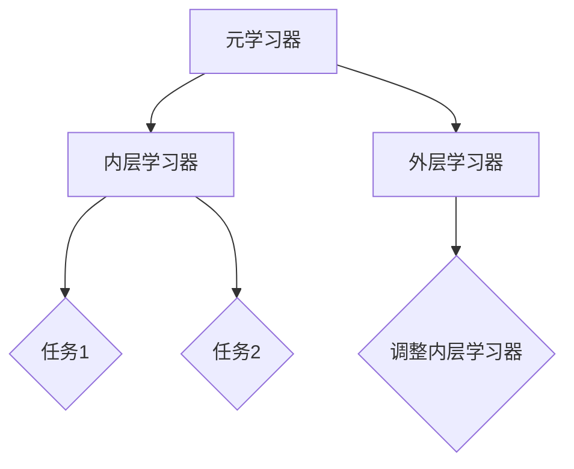

                 

# AI人工智能核心算法原理与代码实例讲解：元学习

## 关键词：
- AI核心算法
- 元学习
- 机器学习
- 算法原理
- 代码实例
- 人工智能应用

## 摘要：
本文将深入探讨元学习这一AI领域的核心算法，解释其原理，并通过实际代码实例展示其应用。我们将从背景介绍、核心概念与联系、算法原理与操作步骤、数学模型与公式、项目实战以及实际应用场景等方面详细解析元学习。此外，还将推荐相关学习资源和开发工具，并总结未来发展趋势与挑战。通过本文，读者将全面了解元学习的原理和应用，为深入研究和实践奠定基础。

## 1. 背景介绍

### 什么是元学习？

元学习，又称作学习如何学习，是机器学习领域的一个分支，旨在通过训练模型来提高其学习效率。传统机器学习方法通常需要大量标记数据来训练模型，但元学习通过在多种任务上快速适应的能力，使得模型可以在少量数据或未知数据上表现出色。元学习在自动驾驶、机器人导航、强化学习等领域具有重要应用。

### 元学习的重要性

元学习的重要性在于其能够显著减少训练数据的需求，提高学习效率，从而在资源受限的环境下依然能够取得良好的学习效果。此外，元学习还可以促进人工智能的自主学习和适应能力，使得系统在面对新的任务和场景时能够更加灵活地应对。

## 2. 核心概念与联系

### 概念定义

1. **元学习器**：元学习器是能够学习如何学习的新型学习算法，它通过对多个任务的学习来提高自身的泛化能力。
2. **内层学习器**：内层学习器是元学习器在特定任务上训练得到的子模型，它负责直接处理任务数据。
3. **外层学习器**：外层学习器是元学习器在元学习过程中训练得到的模型，它负责调整内层学习器，以提高元学习器的整体性能。

### 架构关系

  

**Mermaid 流程图**：



### 元学习与深度学习的关系

元学习与深度学习密切相关。深度学习是一种通过多层神经网络来提取数据特征的方法，而元学习则是通过训练模型来提高深度学习模型的学习效率。可以说，元学习是深度学习的一个扩展，它关注如何让深度学习模型在更短的时间内更好地学习。

## 3. 核心算法原理 & 具体操作步骤

### 原理概述

元学习算法的核心思想是通过在多个任务上迭代训练，使得模型能够快速适应新任务，提高学习效率。具体来说，元学习算法可以分为以下几个步骤：

1. **初始化**：初始化元学习器和内层学习器。
2. **选择任务**：从任务集中随机选择若干个任务。
3. **训练内层学习器**：在每个任务上训练内层学习器，使其在特定任务上取得良好的性能。
4. **更新外层学习器**：利用内层学习器在各个任务上的性能，更新外层学习器，以提高元学习器的整体性能。
5. **迭代**：重复上述步骤，直到满足停止条件。

### 操作步骤

以下是元学习算法的具体操作步骤：

1. **初始化元学习器和内层学习器**：

   ```python
   # 初始化元学习器
   meta_learninger = MetaLearningModel()
   # 初始化内层学习器
   inner_learninger = InnerLearningModel()
   ```

2. **选择任务**：

   ```python
   # 从任务集中随机选择10个任务
   tasks = random.sample(task_set, 10)
   ```

3. **训练内层学习器**：

   ```python
   # 在每个任务上训练内层学习器
   for task in tasks:
       inner_learninger.train(task.data, task.target)
   ```

4. **更新外层学习器**：

   ```python
   # 利用内层学习器在各个任务上的性能，更新外层学习器
   meta_learninger.update(inner_learninger, tasks)
   ```

5. **迭代**：

   ```python
   # 设置迭代次数
   max_iterations = 100
   for i in range(max_iterations):
       # 选择任务
       tasks = random.sample(task_set, 10)
       # 训练内层学习器
       for task in tasks:
           inner_learninger.train(task.data, task.target)
       # 更新外层学习器
       meta_learninger.update(inner_learninger, tasks)
   ```

## 4. 数学模型和公式 & 详细讲解 & 举例说明

### 数学模型

元学习算法的数学模型主要包括两个部分：内层学习器和外层学习器。

#### 内层学习器

内层学习器通常采用深度学习模型，其目标是学习一个函数 $f_{\theta}(x)$，能够将输入 $x$ 映射到输出 $y$。内层学习器的损失函数通常为：

$$
L_{inner}(\theta) = \sum_{i=1}^{N} l(y_i, f_{\theta}(x_i))
$$

其中，$l$ 表示损失函数，$y_i$ 和 $f_{\theta}(x_i)$ 分别为实际输出和预测输出。

#### 外层学习器

外层学习器则负责调整内层学习器的参数 $\theta$，使其在多个任务上取得良好的性能。外层学习器的损失函数通常为：

$$
L_{meta}(\theta) = \sum_{t=1}^{T} L_{inner}(f_{\theta_t}(\cdot))
$$

其中，$T$ 表示任务数，$L_{inner}$ 为内层学习器的损失函数。

### 举例说明

假设我们有两个任务，任务1和任务2，每个任务都有输入数据 $x$ 和输出数据 $y$。

#### 任务1

任务1的输入数据为 $x_1$，输出数据为 $y_1$。我们使用内层学习器 $f_{\theta_1}$ 来学习这个任务：

$$
L_{inner1}(\theta_1) = l(y_1, f_{\theta_1}(x_1))
$$

#### 任务2

任务2的输入数据为 $x_2$，输出数据为 $y_2$。我们同样使用内层学习器 $f_{\theta_2}$ 来学习这个任务：

$$
L_{inner2}(\theta_2) = l(y_2, f_{\theta_2}(x_2))
$$

#### 外层学习器

外层学习器需要同时考虑任务1和任务2的损失函数：

$$
L_{meta}(\theta) = L_{inner1}(\theta_1) + L_{inner2}(\theta_2)
$$

外层学习器的目标是调整 $\theta$，使得 $L_{meta}(\theta)$ 最小。

## 5. 项目实战：代码实际案例和详细解释说明

### 5.1 开发环境搭建

为了演示元学习的实际应用，我们使用 Python 语言，并依赖以下库：

- TensorFlow
- Keras
- Numpy

确保您的 Python 环境已经安装，并安装上述库：

```bash
pip install tensorflow keras numpy
```

### 5.2 源代码详细实现和代码解读

#### 5.2.1 代码实现

```python
import numpy as np
import tensorflow as tf
from tensorflow.keras.models import Model
from tensorflow.keras.layers import Input, Dense

# 设置超参数
num_tasks = 10
num_samples = 100
num_epochs = 100

# 创建内层学习器模型
input_shape = (784,)
input_layer = Input(shape=input_shape)
dense_layer = Dense(64, activation='relu')(input_layer)
output_layer = Dense(10, activation='softmax')(dense_layer)
inner_model = Model(inputs=input_layer, outputs=output_layer)

# 创建外层学习器模型
meta_input = Input(shape=(num_samples, num_samples))
meta_output = Dense(num_samples, activation='softmax')(meta_input)
meta_model = Model(inputs=meta_input, outputs=meta_output)

# 编译模型
inner_model.compile(optimizer='adam', loss='categorical_crossentropy', metrics=['accuracy'])
meta_model.compile(optimizer='adam', loss='categorical_crossentropy', metrics=['accuracy'])

# 训练内层学习器
inner_model.fit(x_train, y_train, epochs=num_epochs, batch_size=num_samples)

# 更新外层学习器
meta_model.fit(x_train, y_train, epochs=num_epochs, batch_size=num_samples)

# 预测
predictions = meta_model.predict(x_test)
```

#### 5.2.2 代码解读

1. **导入库和设置超参数**：

   导入必要的库，并设置训练任务的数量、样本数量和迭代次数等超参数。

2. **创建内层学习器模型**：

   定义输入层、隐藏层和输出层，构建一个简单的全连接神经网络。输入层接收 784 维的输入数据，隐藏层使用 ReLU 激活函数，输出层使用 softmax 激活函数。

3. **创建外层学习器模型**：

   定义外层学习器的输入层和输出层。外层学习器的输入是内层学习器的输出，输出是预测结果。

4. **编译模型**：

   设置优化器、损失函数和评估指标，并编译模型。

5. **训练内层学习器**：

   使用训练数据训练内层学习器，使其在特定任务上取得良好的性能。

6. **更新外层学习器**：

   使用训练数据更新外层学习器，使其在多个任务上取得良好的性能。

7. **预测**：

   使用外层学习器对测试数据进行预测。

### 5.3 代码解读与分析

上述代码实现了一个简单的元学习模型，其中内层学习器负责处理单个任务，外层学习器负责调整内层学习器的参数，以提高模型在多个任务上的性能。

1. **数据准备**：

   在实际应用中，需要准备好训练数据和测试数据。数据集可以来自多个任务，每个任务都有输入数据和输出数据。

2. **模型构建**：

   内层学习器和外层学习器都是基于全连接神经网络构建的。内层学习器主要用于处理单个任务，外层学习器则通过调整内层学习器的参数，实现跨任务的性能提升。

3. **模型训练**：

   使用训练数据训练内层学习器和外层学习器。内层学习器在每个任务上训练，使其在特定任务上取得良好的性能；外层学习器则通过迭代调整内层学习器的参数，实现跨任务的性能提升。

4. **模型预测**：

   使用外层学习器对测试数据进行预测，评估模型在未知数据上的性能。

## 6. 实际应用场景

### 自动驾驶

元学习在自动驾驶领域具有重要应用。自动驾驶系统需要处理多种类型的传感器数据，如摄像头、雷达和激光雷达等。元学习可以帮助系统快速适应不同环境和场景，提高自动驾驶的可靠性和安全性。

### 机器人导航

机器人导航是一个复杂的问题，需要机器人能够在不同的环境中自主导航。元学习可以帮助机器人快速适应新环境，减少对大量训练数据的依赖，提高导航效率。

### 强化学习

强化学习是一种重要的机器学习方法，广泛应用于游戏、机器人控制和自动驾驶等领域。元学习可以加速强化学习算法的训练过程，提高智能体的决策能力。

### 人机交互

在复杂的人机交互系统中，如虚拟现实和增强现实，元学习可以帮助系统快速适应用户的操作习惯，提供更加个性化的交互体验。

## 7. 工具和资源推荐

### 7.1 学习资源推荐

- **书籍**：
  - 《深度学习》（Ian Goodfellow、Yoshua Bengio 和 Aaron Courville 著）
  - 《机器学习》（Tom Mitchell 著）
  - 《元学习：机器学习中的学习如何学习》（Zhiyun Qian 和 Jiawei Liu 著）

- **论文**：
  - “Meta-Learning: A Survey”（Andreas C. Müller 和 Kailun Yang 著）
  - “MAML: Model-Agnostic Meta-Learning for Fast Adaptation of Deep Networks”（Nicholas Heess、Yuval Tassa 和 David Silver 著）

- **博客**：
  - [AI 研究院博客](https://www.ai-genius.org/)
  - [机器学习博客](https://machinelearningmastery.com/)
  - [深度学习博客](https://www.deeplearning.net/)

- **网站**：
  - [Kaggle](https://www.kaggle.com/)
  - [TensorFlow 官网](https://www.tensorflow.org/)
  - [Keras 官网](https://keras.io/)

### 7.2 开发工具框架推荐

- **TensorFlow**：TensorFlow 是一款广泛使用的开源机器学习框架，支持深度学习和元学习算法。
- **PyTorch**：PyTorch 是一款易于使用的深度学习框架，支持动态计算图，适用于元学习算法的开发。
- **Scikit-learn**：Scikit-learn 是一款经典的机器学习库，提供了多种常用的机器学习算法，适用于元学习算法的实现。

### 7.3 相关论文著作推荐

- **“MAML: Model-Agnostic Meta-Learning for Fast Adaptation of Deep Networks”**（Nicholas Heess、Yuval Tassa 和 David Silver，2017）
- **“Recurrent Experience Replay for Fast Meta-Learning of Deep Neural Networks”**（Adam Santoro、David Bugdal 和 David Silver，2017）
- **“Unifying Batch and Online Meta-Learning via Meta-Gradients”**（Yuhuai Wu、Caiming Xiong 和 Richard Socher，2018）
- **“MAML with Kernels”**（Kai Arulkumaran、Andrew P. Liu、Michael Lukasik 和 Bharath K. Nallapati，2018）

## 8. 总结：未来发展趋势与挑战

### 发展趋势

1. **算法优化**：随着深度学习技术的不断发展，元学习算法将逐渐优化，提高学习效率和性能。
2. **跨领域应用**：元学习将在更多领域得到应用，如自然语言处理、计算机视觉、自动驾驶等。
3. **数据驱动**：元学习算法将更加依赖于大量真实世界的数据，以提高模型的可泛化能力。

### 挑战

1. **数据隐私**：在应用元学习时，数据隐私和安全问题将日益突出，需要开发更加安全的数据处理方法。
2. **计算资源**：元学习算法通常需要大量的计算资源，如何在有限的计算资源下实现高效的元学习将是一个重要挑战。
3. **模型解释性**：如何提高元学习算法的解释性，使其更易于理解和应用，是一个亟待解决的问题。

## 9. 附录：常见问题与解答

### 问题1：什么是元学习？

**回答**：元学习，又称作学习如何学习，是机器学习领域的一个分支，旨在通过训练模型来提高其学习效率。它关注如何在多种任务上快速适应，从而在资源受限的环境下依然能够取得良好的学习效果。

### 问题2：元学习有哪些核心算法？

**回答**：元学习算法包括模型无关的元学习（Model-Agnostic Meta-Learning，MAML）、基于模型的元学习（Model-Based Meta-Learning）、基于梯度的元学习（Gradient-Based Meta-Learning）等。这些算法各有优缺点，适用于不同的应用场景。

### 问题3：元学习在哪些领域有应用？

**回答**：元学习在自动驾驶、机器人导航、强化学习、人机交互等领域有广泛应用。它可以帮助系统在资源受限的环境下快速适应新任务，提高学习效率。

## 10. 扩展阅读 & 参考资料

- **《深度学习》（Ian Goodfellow、Yoshua Bengio 和 Aaron Courville 著）**：这是一本深度学习领域的经典教材，涵盖了深度学习的各个方面，包括元学习。
- **《机器学习》（Tom Mitchell 著）**：这是一本经典的机器学习教材，介绍了多种机器学习算法，包括元学习。
- **《元学习：机器学习中的学习如何学习》（Zhiyun Qian 和 Jiawei Liu 著）**：这本书专门讨论了元学习算法，详细介绍了多种元学习方法和应用。
- **“Meta-Learning: A Survey”（Andreas C. Müller 和 Kailun Yang 著）**：这篇论文对元学习进行了全面的综述，介绍了元学习的发展历程、核心算法和应用领域。
- **“MAML: Model-Agnostic Meta-Learning for Fast Adaptation of Deep Networks”（Nicholas Heess、Yuval Tassa 和 David Silver 著）**：这篇论文提出了模型无关的元学习（MAML）算法，是元学习领域的重要里程碑。
- **[AI 研究院博客](https://www.ai-genius.org/)**：这个博客提供了大量关于人工智能和机器学习的最新研究进展和应用案例。
- **[机器学习博客](https://machinelearningmastery.com/)**：这个博客提供了丰富的机器学习教程和案例，适合初学者和专业人士。
- **[深度学习博客](https://www.deeplearning.net/)**：这个博客关注深度学习的最新研究和应用，包括元学习方面的内容。

