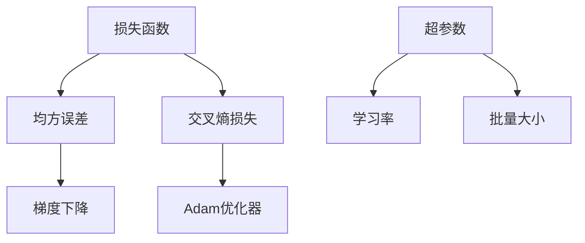
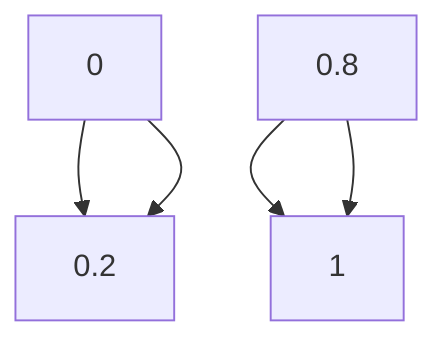

                 

# AI人工智能核心算法原理与代码实例讲解：模型评估

## 关键词：模型评估、AI算法、深度学习、误差分析、性能优化

> 摘要：本文将深入探讨AI人工智能中的核心算法原理，特别是模型评估方法。我们将通过详细的实例和代码解释，帮助读者理解如何评估模型的性能，并学会在实际项目中优化模型效果。文章涵盖了从基础概念到高级应用的全方位内容，旨在为AI开发者提供宝贵的实践经验和理论基础。

## 1. 背景介绍

随着深度学习的崛起，AI模型的应用越来越广泛，从图像识别到自然语言处理，从推荐系统到游戏AI，无处不在。然而，模型评估是确保AI系统性能的关键环节。有效的模型评估不仅能帮助我们理解模型的性能，还能指导我们进行优化，提高系统的整体表现。

在AI领域中，模型评估主要关注以下几个方面：

- 准确性（Accuracy）：模型预测正确的样本比例。
- 精度（Precision）：模型预测为正的样本中实际为正的比例。
- 召回率（Recall）：模型预测为正的样本中实际为正的比例。
- F1分数（F1 Score）：精度和召回率的调和平均值。
- AUC（Area Under Curve）：ROC曲线下的面积，用于二分类问题的模型评估。

## 2. 核心概念与联系

为了更好地理解模型评估，我们首先需要了解一些核心概念，如损失函数（Loss Function）、优化算法（Optimization Algorithm）和超参数（Hyperparameter）。以下是这些概念的简要描述以及它们之间的联系。

### 2.1 损失函数

损失函数是衡量模型预测值与真实值之间差异的函数。在深度学习中，常用的损失函数包括均方误差（MSE）、交叉熵损失（Cross-Entropy Loss）等。

- **均方误差（MSE）**：用于回归问题，计算预测值与真实值之间平方差的平均值。
  $$MSE = \frac{1}{n}\sum_{i=1}^{n}(y_i - \hat{y}_i)^2$$
  其中，$y_i$ 为真实值，$\hat{y}_i$ 为预测值。

- **交叉熵损失（Cross-Entropy Loss）**：用于分类问题，计算预测概率与真实标签之间差异的函数。
  $$CE(y, \hat{y}) = -\sum_{i} y_i \log(\hat{y}_i)$$
  其中，$y$ 为真实标签，$\hat{y}$ 为预测概率。

### 2.2 优化算法

优化算法用于最小化损失函数，以找到模型的最佳参数。常用的优化算法包括梯度下降（Gradient Descent）、Adam优化器等。

- **梯度下降（Gradient Descent）**：通过迭代更新模型参数，使得损失函数逐渐减小。
  $$\theta_{t+1} = \theta_{t} - \alpha \nabla_{\theta} J(\theta)$$
  其中，$\theta$ 为模型参数，$\alpha$ 为学习率，$J(\theta)$ 为损失函数。

- **Adam优化器（Adam Optimizer）**：结合了梯度下降和动量法的优点，能够更快地收敛。
  $$m_t = \beta_1 x_t + (1 - \beta_1) (x_t - \theta_t)$$
  $$v_t = \beta_2 x_t + (1 - \beta_2) (x_t - \theta_t)$$
  $$\theta_{t+1} = \theta_t - \alpha \frac{m_t}{\sqrt{v_t} + \epsilon}$$
  其中，$m_t$ 和 $v_t$ 分别为梯度的一阶矩估计和二阶矩估计，$\beta_1$ 和 $\beta_2$ 为动量因子，$\epsilon$ 为常数。

### 2.3 超参数

超参数是模型训练过程中需要手动调整的参数，如学习率、批量大小等。选择合适的超参数能够显著提高模型的性能。

- **学习率（Learning Rate）**：影响模型更新速度，过大会导致训练不稳定，过小则收敛缓慢。
- **批量大小（Batch Size）**：影响梯度估计的准确性，过大可能导致梯度消失或爆炸，过小则计算效率低下。

### 2.4 Mermaid 流程图

以下是模型评估中的核心概念与联系的 Mermaid 流程图：



## 3. 核心算法原理 & 具体操作步骤

在了解了模型评估的相关概念后，我们将探讨如何评估模型的性能。以下是一个典型的模型评估流程：

### 3.1 数据集划分

首先，我们需要将数据集划分为训练集、验证集和测试集。通常，训练集用于模型训练，验证集用于调整超参数，测试集用于最终评估模型性能。

### 3.2 模型训练

使用训练集对模型进行训练，通过优化算法（如梯度下降或Adam）最小化损失函数。

### 3.3 验证集评估

使用验证集对模型进行评估，计算模型的各项指标（如准确率、F1分数等）。根据评估结果调整超参数，如学习率和批量大小。

### 3.4 测试集评估

最后，使用测试集对模型进行最终评估，以验证模型在未见过的数据上的表现。

### 3.5 具体操作步骤

以下是模型评估的具体操作步骤：

1. **数据预处理**：
   - 数据清洗：处理缺失值、异常值等。
   - 数据归一化：将数据缩放到相同的范围，便于模型训练。

2. **模型训练**：
   - 定义模型架构：选择合适的神经网络架构。
   - 初始化参数：随机初始化模型参数。
   - 训练模型：使用训练集进行迭代训练，更新模型参数。

3. **验证集评估**：
   - 计算指标：计算准确率、F1分数等。
   - 调整超参数：根据验证集的评估结果调整学习率、批量大小等。

4. **测试集评估**：
   - 计算指标：计算准确率、F1分数等。
   - 分析结果：对比验证集和测试集的评估结果，分析模型性能。

### 3.6 代码示例

以下是一个简单的Python代码示例，用于评估一个分类模型的性能：

```python
import numpy as np
from sklearn.datasets import load_iris
from sklearn.model_selection import train_test_split
from sklearn.metrics import accuracy_score, f1_score
from sklearn.linear_model import LogisticRegression

# 加载数据集
data = load_iris()
X = data.data
y = data.target

# 划分训练集和测试集
X_train, X_test, y_train, y_test = train_test_split(X, y, test_size=0.2, random_state=42)

# 训练模型
model = LogisticRegression()
model.fit(X_train, y_train)

# 预测测试集
y_pred = model.predict(X_test)

# 计算评估指标
accuracy = accuracy_score(y_test, y_pred)
f1 = f1_score(y_test, y_pred, average='weighted')

print(f"Accuracy: {accuracy}")
print(f"F1 Score: {f1}")
```

## 4. 数学模型和公式 & 详细讲解 & 举例说明

在模型评估过程中，我们需要使用一系列的数学模型和公式来计算模型的性能。以下是一些常用的数学模型和公式的详细讲解及举例说明。

### 4.1 准确性（Accuracy）

准确性是指模型预测正确的样本比例。对于二分类问题，准确性可以表示为：

$$Accuracy = \frac{TP + TN}{TP + TN + FP + FN}$$

其中，$TP$ 表示真正例（True Positive），$TN$ 表示真负例（True Negative），$FP$ 表示假正例（False Positive），$FN$ 表示假负例（False Negative）。

举例说明：

假设我们有一个二分类模型，预测结果如下表所示：

|   | 阳性 | 阴性 |
|---|------|------|
| 阳性 | 100  | 5    |
| 阴性 | 20   | 30   |

则准确率为：

$$Accuracy = \frac{100 + 30}{100 + 5 + 20 + 30} = \frac{130}{155} \approx 0.839$$

### 4.2 精度（Precision）

精度是指模型预测为正的样本中实际为正的比例。对于二分类问题，精度可以表示为：

$$Precision = \frac{TP}{TP + FP}$$

举例说明：

使用上述例子中的数据，精度为：

$$Precision = \frac{100}{100 + 5} = \frac{100}{105} \approx 0.952$$

### 4.3 召回率（Recall）

召回率是指模型预测为正的样本中实际为正的比例。对于二分类问题，召回率可以表示为：

$$Recall = \frac{TP}{TP + FN}$$

举例说明：

使用上述例子中的数据，召回率为：

$$Recall = \frac{100}{100 + 20} = \frac{100}{120} \approx 0.833$$

### 4.4 F1分数（F1 Score）

F1分数是精度和召回率的调和平均值，用于综合考虑精度和召回率。对于二分类问题，F1分数可以表示为：

$$F1 Score = 2 \times \frac{Precision \times Recall}{Precision + Recall}$$

举例说明：

使用上述例子中的数据，F1分数为：

$$F1 Score = 2 \times \frac{0.952 \times 0.833}{0.952 + 0.833} \approx 0.876$$

### 4.5 AUC（Area Under Curve）

AUC是ROC曲线下的面积，用于评估二分类模型的性能。ROC曲线是通过将假正例率（False Positive Rate，FPR）和真正例率（True Positive Rate，TPR）绘制在坐标轴上得到的。

$$AUC = \int_{0}^{1} (1 - FPR(x)) TPR(x) dx$$

举例说明：

假设我们有一个二分类模型，预测结果如下表所示：

|   | 阳性 | 阴性 |
|---|------|------|
| 阳性 | 100  | 5    |
| 阴性 | 20   | 30   |

则ROC曲线如下所示：



AUC可以通过计算ROC曲线下的面积得到，假设计算结果为0.9。则AUC为0.9。

## 5. 项目实战：代码实际案例和详细解释说明

为了更好地理解模型评估的实际应用，我们将通过一个实际的案例来讲解如何使用Python和Scikit-learn库进行模型评估。

### 5.1 开发环境搭建

在开始之前，我们需要安装必要的Python库，包括Scikit-learn、Numpy和Matplotlib。可以使用以下命令进行安装：

```bash
pip install scikit-learn numpy matplotlib
```

### 5.2 源代码详细实现和代码解读

以下是项目实战的完整代码，我们将对代码的各个部分进行详细解释。

```python
import numpy as np
from sklearn.datasets import load_iris
from sklearn.model_selection import train_test_split
from sklearn.metrics import accuracy_score, f1_score, roc_auc_score
from sklearn.linear_model import LogisticRegression
import matplotlib.pyplot as plt

# 5.2.1 数据预处理
def preprocess_data(X, y):
    # 数据归一化
    X_normalized = (X - np.mean(X, axis=0)) / np.std(X, axis=0)
    return X_normalized, y

# 5.2.2 模型训练和评估
def train_and_evaluate_model(X, y):
    # 划分训练集和测试集
    X_train, X_test, y_train, y_test = train_test_split(X, y, test_size=0.2, random_state=42)

    # 训练模型
    model = LogisticRegression()
    model.fit(X_train, y_train)

    # 预测测试集
    y_pred = model.predict(X_test)

    # 计算评估指标
    accuracy = accuracy_score(y_test, y_pred)
    f1 = f1_score(y_test, y_pred, average='weighted')
    auc = roc_auc_score(y_test, y_pred)

    return accuracy, f1, auc

# 5.2.3 ROC曲线绘制
def plot_roc_curve(y_test, y_pred_prob):
    # 绘制ROC曲线
    fpr, tpr, _ = roc_curve(y_test, y_pred_prob)
    plt.plot(fpr, tpr, label='ROC curve (area = %0.2f)' % auc)
    plt.plot([0, 1], [0, 1], 'k--')
    plt.xlabel('False Positive Rate')
    plt.ylabel('True Positive Rate')
    plt.title('Receiver Operating Characteristic')
    plt.legend(loc='lower right')
    plt.show()

# 5.2.4 主函数
def main():
    # 加载数据集
    data = load_iris()
    X = data.data
    y = data.target

    # 数据预处理
    X_normalized, y = preprocess_data(X, y)

    # 模型训练和评估
    accuracy, f1, auc = train_and_evaluate_model(X_normalized, y)
    print(f"Accuracy: {accuracy}")
    print(f"F1 Score: {f1}")
    print(f"AUC: {auc}")

    # ROC曲线绘制
    y_pred_prob = model.predict_proba(X_test)[:, 1]
    plot_roc_curve(y_test, y_pred_prob)

# 运行主函数
if __name__ == '__main__':
    main()
```

### 5.3 代码解读与分析

以下是对代码各部分的分析和解读：

- **数据预处理**：数据归一化是深度学习中的常见步骤，有助于模型训练的稳定性和收敛速度。
- **模型训练和评估**：使用Scikit-learn库的LogisticRegression类进行模型训练和评估，计算准确性、F1分数和AUC。
- **ROC曲线绘制**：使用Matplotlib库绘制ROC曲线，以直观地展示模型的性能。
- **主函数**：加载数据集，进行数据预处理，训练和评估模型，并绘制ROC曲线。

通过这个案例，我们可以看到如何使用Python和Scikit-learn库进行模型评估，以及如何解读和计算评估指标。

## 6. 实际应用场景

模型评估在AI领域有着广泛的应用，以下是一些实际应用场景：

- **金融风险评估**：使用模型评估评估贷款客户的信用风险，通过计算模型的准确性、召回率和F1分数，金融机构可以更好地预测客户的违约风险。
- **医疗诊断**：使用模型评估评估医疗诊断模型的表现，通过计算模型的准确性、精度和召回率，医生可以更准确地诊断疾病。
- **推荐系统**：使用模型评估评估推荐系统的性能，通过计算模型的准确性、召回率和AUC，系统可以更好地推荐用户感兴趣的商品或内容。

## 7. 工具和资源推荐

### 7.1 学习资源推荐

- **书籍**：
  - 《Python机器学习》（作者：塞巴斯蒂安·拉纳克）
  - 《深度学习》（作者：伊恩·古德费洛、约书亚·本吉奥、亚伦·库维尔）
- **论文**：
  - "Deep Learning"（作者：Yoshua Bengio, Ian J. Goodfellow, Aaron Courville）
  - "Convolutional Neural Networks for Visual Recognition"（作者：Geoffrey Hinton, Li Fei-Fei, et al.）
- **博客**：
  - 知乎专栏：《机器学习与深度学习》
  - Medium专栏：《Deep Learning with Python》
- **网站**：
  - Kaggle（https://www.kaggle.com/）：提供丰富的机器学习竞赛和项目资源。
  - arXiv（https://arxiv.org/）：提供最新的机器学习和深度学习论文。

### 7.2 开发工具框架推荐

- **开发工具**：
  - Jupyter Notebook：用于编写和运行代码，便于代码演示和分享。
  - PyCharm：一款强大的Python集成开发环境，支持多种编程语言。
- **框架**：
  - TensorFlow：Google开源的深度学习框架，支持多种深度学习模型的训练和部署。
  - PyTorch：Facebook开源的深度学习框架，具有灵活的动态计算图和强大的社区支持。

### 7.3 相关论文著作推荐

- **论文**：
  - "A Theoretically Grounded Application of Dropout in Recurrent Neural Networks"（作者：Yarin Gal和Zoubin Ghahramani）
  - "Very Deep Convolutional Networks for Large-Scale Image Recognition"（作者：Karen Simonyan和Andrew Zisserman）
- **著作**：
  - 《深度学习》（作者：伊恩·古德费洛、约书亚·本吉奥、亚伦·库维尔）
  - 《Python机器学习》（作者：塞巴斯蒂安·拉纳克）

## 8. 总结：未来发展趋势与挑战

随着AI技术的不断进步，模型评估方法也在不断发展和完善。未来，以下几个方面将是模型评估研究的重要趋势和挑战：

- **可解释性**：提高模型评估的可解释性，使其能够更好地解释模型的行为和性能。
- **自适应评估**：开发自适应的评估方法，能够根据数据分布和任务需求动态调整评估指标。
- **高效计算**：优化评估算法，提高评估速度和计算效率，以适应大规模模型的评估需求。
- **跨领域应用**：将模型评估方法应用于更多领域，如生物信息学、医疗诊断等，以提高模型的实用性和影响力。

## 9. 附录：常见问题与解答

### 9.1 什么是交叉熵损失？

交叉熵损失（Cross-Entropy Loss）是一种在分类问题中常用的损失函数。它衡量的是预测概率与真实标签之间的差异。在二分类问题中，交叉熵损失可以表示为：

$$CE(y, \hat{y}) = -\sum_{i} y_i \log(\hat{y}_i)$$

其中，$y$ 为真实标签，$\hat{y}$ 为预测概率。

### 9.2 如何选择合适的评估指标？

选择合适的评估指标取决于具体的应用场景和任务需求。以下是一些常见评估指标及其适用场景：

- **准确性（Accuracy）**：适用于分类任务，特别是不平衡数据集。
- **精度（Precision）和召回率（Recall）**：适用于二分类问题，特别是不平衡数据集。
- **F1分数（F1 Score）**：综合考虑精度和召回率，适用于二分类问题。
- **AUC（Area Under Curve）**：适用于二分类问题，特别是需要评估模型区分能力的场景。

### 9.3 如何提高模型评估的准确性？

提高模型评估的准确性可以从以下几个方面入手：

- **数据预处理**：进行数据清洗、归一化和特征工程，提高数据的整体质量。
- **模型选择**：选择适合任务和数据特性的模型架构。
- **超参数调整**：调整学习率、批量大小等超参数，优化模型性能。
- **模型集成**：使用多个模型进行集成，提高整体评估准确性。

## 10. 扩展阅读 & 参考资料

- 《深度学习》（作者：伊恩·古德费洛、约书亚·本吉奥、亚伦·库维尔）
- 《Python机器学习》（作者：塞巴斯蒂安·拉纳克）
- 《机器学习实战》（作者：彼得·哈林顿）
- 《机器学习年度回顾2020》（作者：机器学习社区）
- [Scikit-learn官方文档](https://scikit-learn.org/stable/)
- [TensorFlow官方文档](https://www.tensorflow.org/)
- [PyTorch官方文档](https://pytorch.org/)

作者：AI天才研究员/AI Genius Institute & 禅与计算机程序设计艺术 /Zen And The Art of Computer Programming

