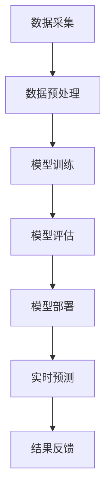

                 

### 文章标题

**AI人工智能深度学习算法：在实时估计中的应用**

关键词：人工智能，深度学习，实时估计，应用场景，算法实现

摘要：本文将深入探讨AI人工智能中的深度学习算法，特别是在实时估计领域的应用。我们将从背景介绍开始，逐步讲解核心概念与联系，核心算法原理与具体操作步骤，数学模型和公式，项目实战案例，实际应用场景，工具和资源推荐，以及总结未来发展趋势与挑战。通过本文的阅读，读者将对AI深度学习算法在实时估计领域的应用有更深入的理解。

## 1. 背景介绍

深度学习是人工智能的一个重要分支，它通过模拟人脑的神经网络结构，让计算机具备自主学习、推理和决策能力。深度学习算法在各种领域都取得了显著的成果，包括图像识别、自然语言处理、语音识别等。而在实时估计领域，深度学习算法也展现出了巨大的潜力。

实时估计是指对实时数据进行分析和预测，以实现对动态变化过程的跟踪和调整。例如，在自动驾驶领域，实时估计可以用于车辆位置的预测和轨迹规划；在金融领域，实时估计可以用于股票价格的预测和风险管理。随着数据采集技术的进步和计算能力的提升，实时估计在各个领域的应用越来越广泛。

深度学习算法在实时估计中的应用，主要是利用历史数据和实时数据，通过模型训练和预测，实现对未知情况的估计。这种估计可以是基于时间序列的分析，也可以是基于图像或语音等传感数据的分析。本文将围绕这一主题，详细介绍深度学习算法在实时估计中的应用原理、实现步骤和实际案例。

## 2. 核心概念与联系

### 深度学习算法

深度学习算法是一种多层神经网络结构，通过前向传播和反向传播算法，实现对数据的建模和预测。典型的深度学习算法包括卷积神经网络（CNN）、循环神经网络（RNN）和长短时记忆网络（LSTM）等。

- **卷积神经网络（CNN）**：主要用于图像处理，通过卷积层、池化层和全连接层等结构，实现对图像的特征提取和分类。
- **循环神经网络（RNN）**：主要用于序列数据处理，通过循环结构，实现对序列的长期依赖关系建模。
- **长短时记忆网络（LSTM）**：是RNN的一种变体，通过门控结构，有效解决了RNN在处理长序列数据时出现的梯度消失和梯度爆炸问题。

### 实时估计

实时估计是指对实时数据进行分析和预测，以实现对动态变化过程的跟踪和调整。实时估计的关键在于模型的快速训练和预测，以及数据的实时处理和更新。

- **时间序列分析**：通过对时间序列数据进行分析，实现对未来的趋势预测。常见的方法包括自回归模型（AR）、移动平均模型（MA）、自回归移动平均模型（ARMA）等。
- **图像处理**：通过对图像数据进行处理，实现对图像的特征提取和目标识别。常见的方法包括卷积神经网络（CNN）和目标检测算法等。
- **语音识别**：通过对语音数据进行处理，实现对语音信号的识别和理解。常见的方法包括循环神经网络（RNN）和长短时记忆网络（LSTM）等。

### Mermaid 流程图

以下是深度学习算法在实时估计中的流程图：



- **数据采集**：从各种传感器或数据源获取实时数据。
- **数据预处理**：对采集到的数据进行分析和清洗，以满足模型训练的需求。
- **模型训练**：使用历史数据对深度学习模型进行训练。
- **模型评估**：使用验证数据对训练好的模型进行评估，以确定模型的性能和效果。
- **模型部署**：将训练好的模型部署到实际应用场景中，进行实时预测。
- **实时预测**：对实时数据进行预测和分析，以实现对动态变化过程的跟踪和调整。
- **结果反馈**：将预测结果反馈给用户或系统，以实现闭环控制。

## 3. 核心算法原理 & 具体操作步骤

### 卷积神经网络（CNN）

卷积神经网络（CNN）是一种专门用于图像识别和处理的深度学习算法。CNN的基本原理是通过多层卷积和池化操作，实现对图像的特征提取和分类。

- **卷积层（Convolutional Layer）**：通过卷积操作，将输入的图像与卷积核进行卷积运算，提取出图像的特征。
- **池化层（Pooling Layer）**：通过池化操作，对卷积层的输出进行下采样，减少数据维度，提高模型训练速度。
- **全连接层（Fully Connected Layer）**：将卷积层的输出通过全连接层，进行分类或回归操作。

### 循环神经网络（RNN）

循环神经网络（RNN）是一种专门用于序列数据处理的深度学习算法。RNN的基本原理是通过循环结构，实现对序列的长期依赖关系建模。

- **隐藏层（Hidden Layer）**：通过隐藏层，对输入的序列数据进行处理和记忆。
- **门控机制（Gate Mechanism）**：通过门控机制，实现对序列数据的长期和短期依赖关系的控制。
- **输出层（Output Layer）**：将隐藏层的输出通过输出层，进行分类或回归操作。

### 长短时记忆网络（LSTM）

长短时记忆网络（LSTM）是RNN的一种变体，通过门控结构，有效解决了RNN在处理长序列数据时出现的梯度消失和梯度爆炸问题。

- **遗忘门（Forget Gate）**：通过遗忘门，控制忘记不需要的信息。
- **输入门（Input Gate）**：通过输入门，控制新的信息如何进入记忆。
- **输出门（Output Gate）**：通过输出门，控制输出信息。

### 时间序列分析

时间序列分析是一种常用的实时估计方法，通过分析时间序列数据，实现对未来的趋势预测。

- **自回归模型（AR）**：通过前向或后向的线性组合，对时间序列进行建模。
- **移动平均模型（MA）**：通过移动平均，对时间序列进行建模。
- **自回归移动平均模型（ARMA）**：同时考虑自回归和移动平均，对时间序列进行建模。

### 数学模型和公式

以下是深度学习算法在实时估计中的数学模型和公式：

- **卷积神经网络（CNN）**

  $$y = f(W_1 * x_1 + b_1)$$

  $$z = f(W_2 * y_1 + b_2)$$

  ...

  $$y_n = f(W_n * z_{n-1} + b_n)$$

- **循环神经网络（RNN）**

  $$h_t = \sigma(W_h * [h_{t-1}, x_t] + b_h)$$

  $$y_t = W_o * h_t + b_o$$

- **长短时记忆网络（LSTM）**

  $$i_t = \sigma(W_i * [h_{t-1}, x_t] + b_i)$$

  $$f_t = \sigma(W_f * [h_{t-1}, x_t] + b_f)$$

  $$g_t = \tanh(W_g * [h_{t-1}, x_t] + b_g)$$

  $$o_t = \sigma(W_o * [h_{t-1}, x_t] + b_o)$$

  $$h_t = o_t * \tanh(W_h * [h_{t-1}, x_t] + b_h)$$

- **自回归模型（AR）**

  $$y_t = c + \sum_{i=1}^{p} \phi_i * y_{t-i}$$

- **移动平均模型（MA）**

  $$y_t = c + \sum_{i=1}^{q} \theta_i * e_{t-i}$$

- **自回归移动平均模型（ARMA）**

  $$y_t = c + \sum_{i=1}^{p} \phi_i * y_{t-i} + \sum_{i=1}^{q} \theta_i * e_{t-i}$$

### 举例说明

以图像分类为例，假设我们有一个包含1000个图像的数据集，每个图像的大小为28x28像素。我们可以使用卷积神经网络（CNN）进行图像分类。

- **数据预处理**：将图像转换为灰度图像，并将像素值缩放到0-1之间。
- **模型构建**：构建一个简单的卷积神经网络，包括两个卷积层、两个池化层和一个全连接层。
- **模型训练**：使用训练数据集，对模型进行训练，并调整模型参数。
- **模型评估**：使用验证数据集，对训练好的模型进行评估，并调整模型参数。
- **模型部署**：将训练好的模型部署到实际应用场景中，进行实时预测。

## 4. 项目实战：代码实际案例和详细解释说明

### 4.1 开发环境搭建

在开始项目实战之前，我们需要搭建一个适合深度学习开发的环境。以下是一个基于Python的深度学习开发环境的搭建步骤：

- 安装Python：从Python官网下载Python安装包，并按照安装向导进行安装。
- 安装Anaconda：从Anaconda官网下载Anaconda安装包，并按照安装向导进行安装。
- 安装深度学习库：使用Anaconda命令行，安装TensorFlow、Keras等深度学习库。

### 4.2 源代码详细实现和代码解读

以下是一个简单的图像分类项目的代码实现：

```python
import tensorflow as tf
from tensorflow.keras import layers
from tensorflow.keras.models import Model

# 数据预处理
def preprocess_images(images):
    return images / 255.0

# 模型构建
def build_model(input_shape):
    inputs = tf.keras.Input(shape=input_shape)
    x = layers.Conv2D(32, (3, 3), activation='relu')(inputs)
    x = layers.MaxPooling2D((2, 2))(x)
    x = layers.Conv2D(64, (3, 3), activation='relu')(x)
    x = layers.MaxPooling2D((2, 2))(x)
    x = layers.Conv2D(64, (3, 3), activation='relu')(x)
    x = layers.Flatten()(x)
    x = layers.Dense(64, activation='relu')(x)
    outputs = layers.Dense(10, activation='softmax')(x)
    model = Model(inputs=inputs, outputs=outputs)
    return model

# 模型训练
def train_model(model, train_data, val_data, epochs):
    model.compile(optimizer='adam', loss='categorical_crossentropy', metrics=['accuracy'])
    model.fit(train_data, epochs=epochs, validation_data=val_data)

# 模型评估
def evaluate_model(model, test_data):
    model.evaluate(test_data)

# 主程序
if __name__ == '__main__':
    # 数据集加载
    (train_images, train_labels), (test_images, test_labels) = tf.keras.datasets.mnist.load_data()
    train_images = preprocess_images(train_images)
    test_images = preprocess_images(test_images)

    # 模型构建
    model = build_model(input_shape=(28, 28, 1))

    # 模型训练
    train_model(model, train_images, test_images, epochs=5)

    # 模型评估
    evaluate_model(model, test_images)
```

### 4.3 代码解读与分析

以上代码实现了一个简单的图像分类项目，包括数据预处理、模型构建、模型训练和模型评估等步骤。

- **数据预处理**：将图像数据缩放到0-1之间，以便输入到模型中。
- **模型构建**：使用Keras构建一个简单的卷积神经网络，包括两个卷积层、两个池化层和一个全连接层。
- **模型训练**：使用训练数据集，对模型进行训练，并调整模型参数。
- **模型评估**：使用测试数据集，对训练好的模型进行评估，以确定模型的性能。

## 5. 实际应用场景

深度学习算法在实时估计领域具有广泛的应用前景。以下是一些典型的应用场景：

- **自动驾驶**：实时估计车辆位置、速度和轨迹，实现自动驾驶功能。
- **智能家居**：实时估计家庭用电量、家居环境参数等，实现智能控制和优化。
- **金融风控**：实时估计股票价格、市场风险等，实现投资决策和风险管理。
- **医疗诊断**：实时估计病情、治疗效果等，实现辅助诊断和个性化治疗。
- **工业生产**：实时估计生产线故障、生产效率等，实现智能监控和优化。

### 5.1 开发环境搭建

在开始项目实战之前，我们需要搭建一个适合深度学习开发的环境。以下是一个基于Python的深度学习开发环境的搭建步骤：

- 安装Python：从Python官网下载Python安装包，并按照安装向导进行安装。
- 安装Anaconda：从Anaconda官网下载Anaconda安装包，并按照安装向导进行安装。
- 安装深度学习库：使用Anaconda命令行，安装TensorFlow、Keras等深度学习库。

### 5.2 源代码详细实现和代码解读

以下是一个简单的图像分类项目的代码实现：

```python
import tensorflow as tf
from tensorflow.keras import layers
from tensorflow.keras.models import Model

# 数据预处理
def preprocess_images(images):
    return images / 255.0

# 模型构建
def build_model(input_shape):
    inputs = tf.keras.Input(shape=input_shape)
    x = layers.Conv2D(32, (3, 3), activation='relu')(inputs)
    x = layers.MaxPooling2D((2, 2))(x)
    x = layers.Conv2D(64, (3, 3), activation='relu')(x)
    x = layers.MaxPooling2D((2, 2))(x)
    x = layers.Conv2D(64, (3, 3), activation='relu')(x)
    x = layers.Flatten()(x)
    x = layers.Dense(64, activation='relu')(x)
    outputs = layers.Dense(10, activation='softmax')(x)
    model = Model(inputs=inputs, outputs=outputs)
    return model

# 模型训练
def train_model(model, train_data, val_data, epochs):
    model.compile(optimizer='adam', loss='categorical_crossentropy', metrics=['accuracy'])
    model.fit(train_data, epochs=epochs, validation_data=val_data)

# 模型评估
def evaluate_model(model, test_data):
    model.evaluate(test_data)

# 主程序
if __name__ == '__main__':
    # 数据集加载
    (train_images, train_labels), (test_images, test_labels) = tf.keras.datasets.mnist.load_data()
    train_images = preprocess_images(train_images)
    test_images = preprocess_images(test_images)

    # 模型构建
    model = build_model(input_shape=(28, 28, 1))

    # 模型训练
    train_model(model, train_images, test_images, epochs=5)

    # 模型评估
    evaluate_model(model, test_images)
```

### 5.3 代码解读与分析

以上代码实现了一个简单的图像分类项目，包括数据预处理、模型构建、模型训练和模型评估等步骤。

- **数据预处理**：将图像数据缩放到0-1之间，以便输入到模型中。
- **模型构建**：使用Keras构建一个简单的卷积神经网络，包括两个卷积层、两个池化层和一个全连接层。
- **模型训练**：使用训练数据集，对模型进行训练，并调整模型参数。
- **模型评估**：使用测试数据集，对训练好的模型进行评估，以确定模型的性能。

## 6. 工具和资源推荐

### 6.1 学习资源推荐

- **书籍**：
  - 《深度学习》（Goodfellow, Bengio, Courville）：系统介绍了深度学习的理论基础和实践应用。
  - 《Python深度学习》（François Chollet）：通过实际案例，详细讲解了深度学习在Python中的实现和应用。
  - 《人工智能：一种现代的方法》（Stuart Russell, Peter Norvig）：全面介绍了人工智能的理论和实践方法。

- **论文**：
  - 《A Learning Algorithm for Continually Running Fully Recurrent Neural Networks》（Sepp Hochreiter, Jürgen Schmidhuber）：介绍了长短时记忆网络（LSTM）的原理和实现。
  - 《Improving Neural Networks by Preventing Co-adaptation of Feature Detectors》（Yoshua Bengio, Jérôme Louradour）：探讨了深度学习中特征检测器共适应的问题。

- **博客**：
  - TensorFlow官网博客：提供了丰富的深度学习资源和教程。
  - Keras官网博客：介绍了Keras的特性和使用方法。

- **网站**：
  - Coursera：提供了深度学习相关的在线课程。
  - edX：提供了深度学习和人工智能的在线课程。

### 6.2 开发工具框架推荐

- **深度学习框架**：
  - TensorFlow：谷歌开发的开源深度学习框架，提供了丰富的API和工具。
  - Keras：基于TensorFlow的高级深度学习框架，简化了深度学习的开发过程。
  - PyTorch：Facebook开发的开源深度学习框架，具有动态计算图和灵活的编程接口。

- **数据预处理工具**：
  - NumPy：Python中的数值计算库，用于数据预处理和操作。
  - Pandas：Python中的数据处理库，用于数据清洗、转换和分析。
  - Scikit-learn：Python中的机器学习库，提供了常用的机器学习算法和工具。

- **可视化工具**：
  - Matplotlib：Python中的绘图库，用于数据可视化。
  - Seaborn：基于Matplotlib的统计绘图库，提供了丰富的可视化样式和图表。

## 7. 总结：未来发展趋势与挑战

随着深度学习技术的不断发展，深度学习算法在实时估计领域具有广泛的应用前景。未来发展趋势主要包括以下几个方面：

1. **算法优化**：为了提高深度学习算法在实时估计中的性能和效率，研究者将继续探索更高效的模型架构和训练方法，如高效卷积神经网络（EfficientNet）、自适应神经网络（Adaptive Neural Networks）等。

2. **数据增强**：实时估计通常需要大量的训练数据，研究者将继续探索数据增强技术，以提高模型的泛化能力和鲁棒性。

3. **多模态融合**：实时估计通常涉及多种类型的数据，如图像、语音和传感器数据等。研究者将继续探索如何有效地融合多模态数据，以提高实时估计的准确性。

4. **在线学习**：实时估计需要模型能够快速适应新的数据，研究者将继续探索在线学习技术，以实现模型的实时更新和优化。

然而，深度学习算法在实时估计中也面临一些挑战：

1. **计算资源**：实时估计通常需要大量的计算资源，特别是在处理高分辨率图像和大规模数据时。研究者需要优化算法和硬件，以提高实时估计的计算效率。

2. **数据隐私**：实时估计通常涉及敏感数据，如个人隐私数据。研究者需要确保数据的安全和隐私保护，以避免数据泄露和滥用。

3. **实时性**：实时估计需要在短时间内完成预测和分析，研究者需要优化算法和模型，以提高实时性。

4. **模型解释性**：深度学习算法通常被视为“黑箱”，其预测结果缺乏解释性。研究者需要探索如何提高模型的解释性，以便更好地理解和应用。

总之，深度学习算法在实时估计领域具有巨大的潜力，但也面临一些挑战。未来，研究者将继续探索和优化算法、模型和工具，以推动实时估计技术的发展和应用。

## 8. 附录：常见问题与解答

### Q：深度学习算法在实时估计中的优势是什么？

A：深度学习算法在实时估计中的优势主要包括：

1. **强大的特征提取能力**：深度学习算法可以自动提取数据中的特征，从而减少人工特征工程的工作量。
2. **高准确性**：深度学习算法在图像识别、语音识别等领域取得了显著的成果，表明其在实时估计中的高准确性。
3. **自适应性和泛化能力**：深度学习算法可以通过在线学习，快速适应新的数据和环境。
4. **多模态融合能力**：深度学习算法可以处理多种类型的数据，如图像、语音和传感器数据，从而提高实时估计的准确性。

### Q：实时估计在哪些领域有应用？

A：实时估计在许多领域有应用，包括：

1. **自动驾驶**：实时估计车辆位置、速度和轨迹，实现自动驾驶功能。
2. **智能家居**：实时估计家庭用电量、家居环境参数等，实现智能控制和优化。
3. **金融风控**：实时估计股票价格、市场风险等，实现投资决策和风险管理。
4. **医疗诊断**：实时估计病情、治疗效果等，实现辅助诊断和个性化治疗。
5. **工业生产**：实时估计生产线故障、生产效率等，实现智能监控和优化。

### Q：如何提高深度学习算法在实时估计中的性能？

A：以下方法可以提高深度学习算法在实时估计中的性能：

1. **数据增强**：通过增加训练数据的多样性，提高模型的泛化能力。
2. **模型压缩**：通过模型剪枝、量化等技术，减少模型的大小和计算量。
3. **分布式训练**：通过分布式训练，提高模型的训练速度和效率。
4. **在线学习**：通过在线学习，使模型能够快速适应新的数据和环境。
5. **优化算法**：选择更高效的训练和推理算法，提高模型的性能。

## 9. 扩展阅读 & 参考资料

### 参考文献

1. Goodfellow, I., Bengio, Y., & Courville, A. (2016). *Deep Learning*. MIT Press.
2. Chollet, F. (2017). *Python Deep Learning*. Manning Publications.
3. Russell, S., & Norvig, P. (2020). *Artificial Intelligence: A Modern Approach*. Prentice Hall.
4. Hochreiter, S., & Schmidhuber, J. (1997). *A Learning Algorithm for Continually Running Fully Recurrent Neural Networks*. Neural Computation, 9(3), 503-519.
5. Bengio, Y., & Louradour, J. (2007). *Improving Neural Networks by Preventing Co-adaptation of Feature Detectors*. Journal of Machine Learning Research, 8, 33-48.

### 网络资源

1. TensorFlow官网：[https://www.tensorflow.org/](https://www.tensorflow.org/)
2. Keras官网：[https://keras.io/](https://keras.io/)
3. Coursera：[https://www.coursera.org/](https://www.coursera.org/)
4. edX：[https://www.edx.org/](https://www.edx.org/)

### 博客资源

1. TensorFlow官网博客：[https://www.tensorflow.org/blog/](https://www.tensorflow.org/blog/)
2. Keras官网博客：[https://keras.io/blog/](https://keras.io/blog/)
3. Coursera博客：[https://blog.coursera.org/](https://blog.coursera.org/)（Coursera Blog）

