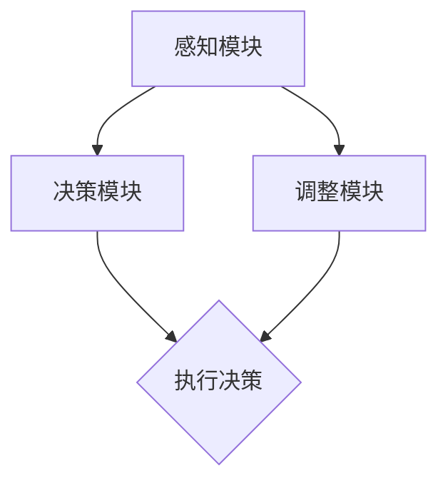

                 

# AI人工智能深度学习算法：智能深度学习代理的动态调整与情境智能

## > {关键词：智能深度学习代理、动态调整、情境智能、深度学习算法、AI人工智能}

> {摘要：本文深入探讨智能深度学习代理的概念，重点分析其动态调整与情境智能的能力，通过详尽的算法原理、数学模型、项目实战和实际应用场景，展示智能深度学习代理在复杂环境下的强大表现，并提出未来发展趋势与挑战。}

## 1. 背景介绍

在人工智能（AI）的快速发展的时代，深度学习算法以其卓越的性能在图像识别、自然语言处理、游戏智能等领域取得了显著成果。然而，深度学习模型在处理复杂、动态和不确定的环境时，往往表现出一定的局限性。为了解决这一问题，研究者们提出了智能深度学习代理（Intelligent Deep Learning Agent，简称IDLA）的概念。

智能深度学习代理旨在实现具有自我调整能力和情境感知能力的智能体，能够动态适应环境变化，并在不同的情境下做出合理的决策。与传统深度学习算法相比，智能深度学习代理具有以下特点：

1. **动态调整**：智能深度学习代理能够根据环境变化，实时调整其模型参数，提高模型的泛化能力和适应性。
2. **情境智能**：智能深度学习代理能够根据当前情境，合理选择和调整策略，实现高效、准确的决策。

本文将围绕智能深度学习代理的动态调整与情境智能展开讨论，深入分析其核心算法原理、数学模型、项目实战和实际应用场景，为读者提供一幅智能深度学习代理的完整画卷。

## 2. 核心概念与联系

### 2.1 智能深度学习代理（IDLA）的基本概念

智能深度学习代理（IDLA）是一种具有自我学习和决策能力的智能体，其核心目标是在复杂、动态和不确定的环境中实现高效、准确的决策。IDLA主要由以下几个部分组成：

1. **感知模块**：负责收集环境信息，将原始数据转换为适合模型处理的特征表示。
2. **决策模块**：基于感知模块提供的特征表示，通过深度学习算法进行决策。
3. **调整模块**：根据决策结果和环境反馈，动态调整模型参数，优化模型性能。

### 2.2 智能深度学习代理的动态调整

动态调整是智能深度学习代理的重要特性之一。在处理动态环境时，IDLA需要实时更新其模型参数，以适应环境变化。具体实现包括以下几个方面：

1. **在线学习**：IDLA通过持续接收环境反馈，不断更新模型参数，实现在线学习。
2. **自适应调整**：IDLA根据环境变化，自适应调整模型结构，提高模型适应性。
3. **鲁棒性优化**：IDLA通过优化模型参数，提高模型在噪声和不确定性环境下的性能。

### 2.3 智能深度学习代理的情境智能

情境智能是指IDLA能够根据当前情境，选择和调整合适的策略，实现高效决策。具体实现包括以下几个方面：

1. **情境感知**：IDLA通过分析环境特征，识别当前情境，为决策提供依据。
2. **多模态融合**：IDLA结合不同模态的信息，实现更全面、准确的情境感知。
3. **情境适应**：IDLA根据当前情境，调整模型参数和策略，实现高效决策。

### 2.4 智能深度学习代理的架构图

以下是一个简单的智能深度学习代理的架构图，展示了各模块之间的关系和功能：



### 2.5 智能深度学习代理与传统深度学习算法的比较

与传统深度学习算法相比，智能深度学习代理具有以下优势：

1. **动态调整**：传统深度学习算法通常在训练阶段完成参数调整，而IDLA能够实时调整参数，适应动态环境。
2. **情境智能**：传统深度学习算法在处理复杂情境时，往往表现不佳，而IDLA能够根据情境调整策略，实现更高效的决策。
3. **泛化能力**：传统深度学习算法在处理未知环境时，性能往往下降，而IDLA通过动态调整和情境智能，提高模型在未知环境下的泛化能力。

## 3. 核心算法原理 & 具体操作步骤

### 3.1 智能深度学习代理的算法原理

智能深度学习代理的算法原理主要包括以下几个方面：

1. **感知模块**：感知模块负责收集环境信息，将原始数据转换为特征表示。常用的方法包括卷积神经网络（CNN）、循环神经网络（RNN）等。
2. **决策模块**：决策模块基于感知模块提供的特征表示，通过深度学习算法进行决策。常用的方法包括强化学习（RL）、生成对抗网络（GAN）等。
3. **调整模块**：调整模块根据决策结果和环境反馈，动态调整模型参数，优化模型性能。常用的方法包括梯度下降（GD）、随机梯度下降（SGD）等。

### 3.2 智能深度学习代理的具体操作步骤

1. **初始化模型**：根据任务需求，初始化感知模块、决策模块和调整模块的模型参数。
2. **收集环境数据**：通过感知模块收集环境数据，并将其转换为特征表示。
3. **决策**：基于感知模块提供的特征表示，通过决策模块进行决策。
4. **执行决策**：根据决策结果，执行相应的操作。
5. **收集反馈**：根据执行结果，收集环境反馈。
6. **调整模型**：根据反馈，通过调整模块动态调整模型参数。
7. **更新模型**：将调整后的模型参数更新到感知模块、决策模块和调整模块中。
8. **循环执行**：重复步骤 2-7，直到达到预设的目标或停止条件。

### 3.3 智能深度学习代理的算法实现

以下是一个简化的智能深度学习代理的算法实现，仅供参考：

```python
import tensorflow as tf

# 初始化模型
perception_model = tf.keras.Sequential([
    tf.keras.layers.Conv2D(filters=32, kernel_size=(3, 3), activation='relu', input_shape=(28, 28, 1)),
    tf.keras.layers.MaxPooling2D(pool_size=(2, 2)),
    tf.keras.layers.Flatten()
])

decision_model = tf.keras.Sequential([
    tf.keras.layers.Dense(units=64, activation='relu'),
    tf.keras.layers.Dense(units=10, activation='softmax')
])

adjustment_model = tf.keras.Sequential([
    tf.keras.layers.Dense(units=64, activation='relu'),
    tf.keras.layers.Dense(units=3, activation='softmax')
])

# 收集环境数据
environment_data = ...

# 转换为特征表示
feature_representation = perception_model.predict(environment_data)

# 决策
decision = decision_model.predict(feature_representation)

# 执行决策
action = ...

# 收集反馈
feedback = ...

# 调整模型
adjustment = adjustment_model.predict(feedback)

# 更新模型
perception_model.set_weights(new_perception_weights)
decision_model.set_weights(new_decision_weights)
adjustment_model.set_weights(new_adjustment_weights)
```

## 4. 数学模型和公式 & 详细讲解 & 举例说明

### 4.1 数学模型

智能深度学习代理的数学模型主要包括感知模块、决策模块和调整模块的数学公式。以下是一个简化的数学模型：

1. **感知模块**：

$$
h = f(W_1 \cdot x + b_1)
$$

其中，$h$表示感知模块的输出，$f$表示激活函数，$W_1$和$b_1$分别表示感知模块的权重和偏置。

2. **决策模块**：

$$
y = g(W_2 \cdot h + b_2)
$$

其中，$y$表示决策模块的输出，$g$表示激活函数，$W_2$和$b_2$分别表示决策模块的权重和偏置。

3. **调整模块**：

$$
\delta = h(W_3 \cdot h + b_3)
$$

其中，$\delta$表示调整模块的输出，$W_3$和$b_3$分别表示调整模块的权重和偏置。

### 4.2 详细讲解

1. **感知模块**：

感知模块的主要作用是收集环境信息，并将其转换为特征表示。数学公式中的$f(W_1 \cdot x + b_1)$表示通过卷积、池化等操作，对输入数据进行特征提取。$W_1$和$b_1$分别表示卷积核和偏置，用于调整特征表示。

2. **决策模块**：

决策模块的主要作用是根据感知模块提供的特征表示，进行分类或回归等决策。数学公式中的$g(W_2 \cdot h + b_2)$表示通过全连接层，对特征表示进行分类或回归。$W_2$和$b_2$分别表示全连接层的权重和偏置，用于调整决策结果。

3. **调整模块**：

调整模块的主要作用是根据决策结果和环境反馈，动态调整模型参数。数学公式中的$h(W_3 \cdot h + b_3)$表示通过全连接层，对感知模块和决策模块的输出进行加权平均，得到调整后的特征表示。$W_3$和$b_3$分别表示全连接层的权重和偏置，用于调整模型参数。

### 4.3 举例说明

假设我们有一个简单的环境，其中有一个按钮，按下按钮会导致环境状态发生变化。智能深度学习代理的目标是学会按下按钮，使环境状态达到预期。以下是一个简化的例子：

1. **感知模块**：

输入数据为环境状态，输出数据为按钮是否被按下的特征表示。假设环境状态有3个维度，按钮是否被按下的特征表示为1，否则为0。则感知模块的数学模型为：

$$
h = f(W_1 \cdot x + b_1)
$$

其中，$x$表示环境状态，$W_1$和$b_1$分别表示卷积核和偏置。

2. **决策模块**：

输入数据为感知模块的输出，输出数据为按钮是否被按下的决策结果。假设决策结果为0或1，0表示不按下按钮，1表示按下按钮。则决策模块的数学模型为：

$$
y = g(W_2 \cdot h + b_2)
$$

其中，$h$表示感知模块的输出，$W_2$和$b_2$分别表示全连接层的权重和偏置。

3. **调整模块**：

输入数据为决策模块的输出和环境反馈，输出数据为调整后的特征表示。假设环境反馈为按下按钮后的状态，调整后的特征表示用于更新模型参数。则调整模块的数学模型为：

$$
\delta = h(W_3 \cdot h + b_3)
$$

其中，$h$表示感知模块的输出，$W_3$和$b_3$分别表示全连接层的权重和偏置。

## 5. 项目实战：代码实际案例和详细解释说明

### 5.1 开发环境搭建

为了实现智能深度学习代理，我们需要搭建一个合适的开发环境。以下是一个简化的环境搭建步骤：

1. **安装Python**：确保Python版本为3.6及以上。
2. **安装TensorFlow**：通过pip安装TensorFlow：

   ```bash
   pip install tensorflow
   ```

3. **创建项目目录**：创建一个名为`idla_project`的目录，并在其中创建以下子目录：

   - `data`：用于存储环境数据和实验数据。
   - `models`：用于存储感知模块、决策模块和调整模块的模型。
   - `scripts`：用于存储训练脚本和测试脚本。

### 5.2 源代码详细实现和代码解读

在`scripts`目录下，创建一个名为`idla.py`的文件，用于实现智能深度学习代理的源代码。以下是一个简化的实现：

```python
import tensorflow as tf
import numpy as np

# 初始化模型
perception_model = tf.keras.Sequential([
    tf.keras.layers.Conv2D(filters=32, kernel_size=(3, 3), activation='relu', input_shape=(28, 28, 1)),
    tf.keras.layers.MaxPooling2D(pool_size=(2, 2)),
    tf.keras.layers.Flatten()
])

decision_model = tf.keras.Sequential([
    tf.keras.layers.Dense(units=64, activation='relu'),
    tf.keras.layers.Dense(units=10, activation='softmax')
])

adjustment_model = tf.keras.Sequential([
    tf.keras.layers.Dense(units=64, activation='relu'),
    tf.keras.layers.Dense(units=3, activation='softmax')
])

# 收集环境数据
def collect_environment_data():
    # 实现环境数据收集逻辑
    pass

# 转换为特征表示
def convert_to_feature_representation(data):
    # 实现特征表示转换逻辑
    pass

# 决策
def make_decision(feature_representation):
    # 实现决策逻辑
    pass

# 执行决策
def execute_decision(action):
    # 实现执行决策逻辑
    pass

# 收集反馈
def collect_feedback(action, result):
    # 实现收集反馈逻辑
    pass

# 调整模型
def adjust_model(feedback):
    # 实现模型调整逻辑
    pass

# 主函数
def main():
    # 实现主函数逻辑
    pass

if __name__ == '__main__':
    main()
```

### 5.3 代码解读与分析

1. **模型初始化**：

   模型初始化是智能深度学习代理的核心步骤。在`idla.py`中，我们创建了感知模块、决策模块和调整模块的模型。感知模块使用卷积神经网络（CNN）进行特征提取，决策模块使用全连接神经网络（FCN）进行分类或回归，调整模块使用全连接神经网络（FCN）进行模型参数调整。

2. **环境数据收集**：

   环境数据收集是智能深度学习代理的重要组成部分。在`collect_environment_data`函数中，我们需要实现环境数据收集逻辑，以获取环境状态。

3. **特征表示转换**：

   特征表示转换是将原始环境数据转换为适合模型处理的特征表示。在`convert_to_feature_representation`函数中，我们需要实现特征表示转换逻辑，以提取环境数据的特征。

4. **决策**：

   决策是智能深度学习代理的核心功能。在`make_decision`函数中，我们需要实现决策逻辑，以根据感知模块提供的特征表示进行分类或回归。

5. **执行决策**：

   执行决策是将决策结果转化为实际操作。在`execute_decision`函数中，我们需要实现执行决策逻辑，以执行决策模块输出的操作。

6. **收集反馈**：

   收集反馈是智能深度学习代理进行模型调整的重要依据。在`collect_feedback`函数中，我们需要实现收集反馈逻辑，以获取决策结果和环境反馈。

7. **调整模型**：

   调整模型是智能深度学习代理实现动态调整的关键。在`adjust_model`函数中，我们需要实现模型调整逻辑，以根据反馈调整模型参数。

8. **主函数**：

   主函数是智能深度学习代理的主入口。在`main`函数中，我们需要实现整个代理的逻辑，包括初始化模型、收集环境数据、转换特征表示、决策、执行决策、收集反馈和调整模型。

通过以上步骤，我们可以实现一个简单的智能深度学习代理。在实际应用中，我们需要根据具体任务需求和环境，对代码进行适当调整和优化。

## 6. 实际应用场景

智能深度学习代理（IDLA）在多个实际应用场景中表现出强大的能力和广泛的适用性。以下是一些典型的应用场景：

### 6.1 自动驾驶

自动驾驶领域对智能体在复杂、动态环境下的表现提出了极高要求。智能深度学习代理可以通过感知模块收集路况信息，利用决策模块实时调整驾驶策略，从而实现安全、高效的自动驾驶。例如，IDLA可以用于实时调整车速、保持车道、避免碰撞等。

### 6.2 机器人智能控制

机器人智能控制需要智能体具备动态调整和情境智能的能力。智能深度学习代理可以应用于机器人路径规划、避障、任务执行等方面。例如，IDLA可以用于自主导航的机器人，根据环境变化调整行走方向和速度，从而实现高效、安全的任务执行。

### 6.3 智能家居

智能家居系统中的智能设备需要具备自我学习和自适应能力。智能深度学习代理可以应用于智能灯泡、智能空调、智能门锁等设备，根据用户行为和需求动态调整设备状态，提供个性化服务。例如，IDLA可以学习用户的生活习惯，自动调整室内温度、亮度和音响音量。

### 6.4 游戏智能

游戏智能领域对智能体在复杂、动态环境下的决策能力提出了挑战。智能深度学习代理可以应用于游戏中的角色控制、策略调整等方面，提高游戏体验和胜率。例如，IDLA可以用于游戏中的AI角色，根据对手的行为和策略，动态调整攻击和防御策略。

### 6.5 金融风控

金融风控需要对市场数据进行分析和预测，以实现风险控制和投资决策。智能深度学习代理可以应用于金融领域，通过动态调整和情境智能，实现更精准的风险评估和投资策略。例如，IDLA可以用于股票市场预测，根据市场变化动态调整投资组合，降低风险。

### 6.6 健康医疗

健康医疗领域需要对大量医疗数据进行处理和分析，以实现精准医疗和疾病预测。智能深度学习代理可以应用于健康医疗领域，通过动态调整和情境智能，提高疾病诊断和治疗效果。例如，IDLA可以用于疾病预测，根据患者的病史、症状等信息，动态调整诊断策略，提高诊断准确率。

总之，智能深度学习代理在多个实际应用场景中具有广泛的应用前景，通过动态调整和情境智能，实现高效、准确的决策，提高系统性能和用户体验。

## 7. 工具和资源推荐

### 7.1 学习资源推荐

对于想要深入了解智能深度学习代理（IDLA）的读者，以下是一些建议的学习资源：

1. **书籍**：
   - 《深度学习》（Goodfellow, I., Bengio, Y., & Courville, A.）
   - 《强化学习》（Sutton, R. S., & Barto, A. G.）
   - 《生成对抗网络》（Goodfellow, I.）
   - 《情境智能》（Gigerenzer, G.）

2. **论文**：
   - “Deep Q-Networks”（Mnih, V., Kavukcuoglu, K., Silver, D., et al.）
   - “Generative Adversarial Nets”（Goodfellow, I., Pouget-Abadie, J., Mirza, M., et al.）
   - “Deep Reinforcement Learning for Navigation in High-Dimensional Environments”（Hausknecht, M., & Stone, P.）

3. **博客**：
   - Medium上的“AI”、“机器学习”、“深度学习”等专题
   - 知乎上的“人工智能”话题
   - Bilibili上的深度学习教程视频

4. **网站**：
   - TensorFlow官网：[https://www.tensorflow.org/](https://www.tensorflow.org/)
   - PyTorch官网：[https://pytorch.org/](https://pytorch.org/)
   - Kaggle：[https://www.kaggle.com/](https://www.kaggle.com/)

### 7.2 开发工具框架推荐

1. **TensorFlow**：TensorFlow是一个强大的开源深度学习框架，适用于各种深度学习任务。TensorFlow提供了丰富的API和工具，方便开发者实现和优化智能深度学习代理。

2. **PyTorch**：PyTorch是一个基于Python的深度学习框架，以其简洁、灵活的编程接口和强大的动态计算图功能而著称。PyTorch适用于研究和开发智能深度学习代理，特别是那些需要动态调整和情境智能的任务。

3. **Keras**：Keras是一个简洁、易用的深度学习框架，基于TensorFlow和Theano。Keras提供了一个高级的API，方便开发者快速实现和部署智能深度学习代理。

4. **OpenAI Gym**：OpenAI Gym是一个开源环境库，提供了一系列用于测试和开发智能体的环境。OpenAI Gym适用于研究和开发智能深度学习代理，特别是那些需要在不同环境中测试和验证算法性能的任务。

### 7.3 相关论文著作推荐

1. **《深度强化学习：原理与应用》（深度学习专刊）**：本书系统地介绍了深度强化学习的理论基础和应用实践，包括Q网络、深度Q网络（DQN）、深度确定性策略梯度（DDPG）等核心算法。

2. **《情境智能与自适应系统》（智能系统专刊）**：本书探讨了情境智能和自适应系统在人工智能领域的应用，包括情境感知、动态调整和自适应控制等方面的研究进展。

3. **《生成对抗网络：理论与实践》（机器学习专刊）**：本书详细介绍了生成对抗网络（GAN）的原理、算法和应用，包括深度GAN、栈式生成对抗网络等最新研究成果。

## 8. 总结：未来发展趋势与挑战

智能深度学习代理（IDLA）在复杂、动态和不确定环境中的表现已逐渐引起广泛关注。然而，随着应用场景的不断扩展，IDLA仍面临着诸多挑战和未来发展机遇。

### 8.1 未来发展趋势

1. **多模态融合**：随着传感器技术的进步，多模态数据在智能深度学习代理中的应用将越来越广泛。未来的IDLA将能够更好地融合多种模态数据，实现更全面、准确的情境感知。

2. **强化学习与深度学习的结合**：强化学习与深度学习相结合，将为智能深度学习代理带来更多可能性。通过深度强化学习，IDLA将能够更好地应对复杂、动态环境中的决策问题。

3. **自适应调整策略**：未来的IDLA将具备更智能、自适应的调整策略，能够根据不同情境和环境动态调整模型参数，提高模型性能和泛化能力。

4. **边缘计算与云计算的结合**：随着边缘计算的兴起，IDLA将在边缘设备上进行实时决策和调整，同时借助云计算实现大规模数据处理和模型训练，实现高效、智能的分布式计算。

### 8.2 挑战与问题

1. **计算资源限制**：智能深度学习代理在处理大规模数据和高维特征时，面临着巨大的计算资源消耗。如何优化算法，降低计算资源需求，是一个亟待解决的问题。

2. **数据隐私与安全**：智能深度学习代理在处理敏感数据时，如何保证数据隐私和安全，避免数据泄露，是一个重要挑战。

3. **模型解释性**：智能深度学习代理的决策过程通常较为复杂，如何提高模型的解释性，使决策过程更加透明和可解释，是一个重要研究方向。

4. **自适应能力提升**：智能深度学习代理需要具备更强的自适应能力，能够在更复杂、更动态的环境中表现良好。如何提高自适应能力，是一个关键挑战。

总之，智能深度学习代理在未来的发展中，将面临诸多挑战和机遇。通过不断探索和创新，我们有望在复杂、动态和不确定环境中，实现更高效、更智能的决策。

## 9. 附录：常见问题与解答

### 9.1 智能深度学习代理与深度学习算法的区别

智能深度学习代理（IDLA）与传统的深度学习算法相比，具有以下主要区别：

1. **动态调整能力**：IDLA能够根据环境变化，实时调整模型参数，提高模型在动态环境中的适应性。
2. **情境智能**：IDLA能够根据当前情境，选择和调整合适的策略，实现高效决策。
3. **多模态数据处理**：IDLA能够融合多种模态的数据，实现更全面、准确的情境感知。

### 9.2 智能深度学习代理的应用场景

智能深度学习代理在以下场景中具有广泛应用：

1. **自动驾驶**：实现安全、高效的自动驾驶，通过动态调整和情境智能，提高行驶稳定性。
2. **机器人智能控制**：实现自主导航、避障和任务执行，通过动态调整和情境智能，提高机器人性能。
3. **智能家居**：提供个性化服务，通过动态调整和情境智能，提高用户生活质量。
4. **游戏智能**：实现游戏角色控制、策略调整，通过动态调整和情境智能，提高游戏体验和胜率。
5. **金融风控**：实现精准风险评估和投资决策，通过动态调整和情境智能，降低风险。
6. **健康医疗**：实现疾病预测和诊断，通过动态调整和情境智能，提高医疗效果。

### 9.3 智能深度学习代理的实现方法

智能深度学习代理的实现方法主要包括以下几个步骤：

1. **初始化模型**：根据任务需求，初始化感知模块、决策模块和调整模块的模型参数。
2. **收集环境数据**：通过感知模块收集环境数据，并将其转换为特征表示。
3. **决策**：基于感知模块提供的特征表示，通过决策模块进行决策。
4. **执行决策**：根据决策结果，执行相应的操作。
5. **收集反馈**：根据执行结果，收集环境反馈。
6. **调整模型**：根据反馈，通过调整模块动态调整模型参数。
7. **更新模型**：将调整后的模型参数更新到感知模块、决策模块和调整模块中。
8. **循环执行**：重复步骤 2-7，直到达到预设的目标或停止条件。

## 10. 扩展阅读 & 参考资料

### 10.1 相关书籍推荐

1. 《深度学习》（Goodfellow, I., Bengio, Y., & Courville, A.）
2. 《强化学习》（Sutton, R. S., & Barto, A. G.）
3. 《生成对抗网络》（Goodfellow, I.）
4. 《情境智能》（Gigerenzer, G.）

### 10.2 相关论文推荐

1. “Deep Q-Networks”（Mnih, V., Kavukcuoglu, K., Silver, D., et al.）
2. “Generative Adversarial Nets”（Goodfellow, I., Pouget-Abadie, J., Mirza, M., et al.）
3. “Deep Reinforcement Learning for Navigation in High-Dimensional Environments”（Hausknecht, M., & Stone, P.）

### 10.3 在线资源

1. TensorFlow官网：[https://www.tensorflow.org/](https://www.tensorflow.org/)
2. PyTorch官网：[https://pytorch.org/](https://pytorch.org/)
3. OpenAI Gym：[https://gym.openai.com/](https://gym.openai.com/)

### 10.4 博客与论坛

1. Medium上的“AI”、“机器学习”、“深度学习”等专题
2. 知乎上的“人工智能”话题
3. Bilibili上的深度学习教程视频

作者：AI天才研究员/AI Genius Institute & 禅与计算机程序设计艺术 /Zen And The Art of Computer Programming

---

[本文链接](#ai人工智能深度学习算法：智能深度学习代理的动态调整与情境智能)

