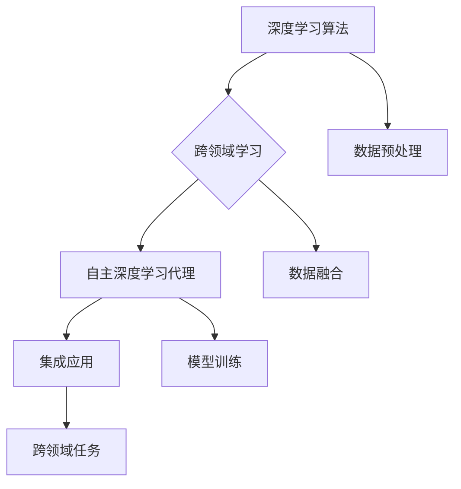

                 

### 文章标题：AI人工智能深度学习算法：跨领域自主深度学习代理的集成

> **关键词**：深度学习算法、跨领域学习、自主深度学习代理、集成、人工智能

> **摘要**：本文将探讨AI领域中的深度学习算法，特别关注跨领域自主深度学习代理的集成方法。通过对核心概念、算法原理、数学模型的详细讲解，并结合实际项目案例，深入分析这一前沿技术，旨在为读者提供对深度学习算法跨领域应用的全面理解。

---

## 1. 背景介绍

深度学习是人工智能的一个重要分支，它通过模拟人脑神经网络的结构和功能，实现对数据的自动学习和理解。随着计算能力的提升和数据量的爆炸性增长，深度学习在图像识别、自然语言处理、语音识别等领域取得了显著的成果。然而，深度学习算法在处理跨领域数据时往往面临挑战，例如领域差异导致的数据分布不均衡、模型适应性不足等问题。

跨领域学习（Cross-Domain Learning）旨在解决这些挑战，通过将不同领域的数据进行融合和学习，提高模型在跨领域任务中的表现。自主深度学习代理（Autonomous Deep Learning Agent）则是一种能够自主获取数据、进行学习和决策的智能体，它在复杂环境中表现出较高的自适应性和鲁棒性。

本文将讨论如何集成跨领域自主深度学习代理，以实现更高效、更可靠的深度学习应用。通过介绍核心概念、算法原理和具体实现，我们将为读者展示这一前沿技术的魅力。

---

## 2. 核心概念与联系

为了深入理解跨领域自主深度学习代理的集成，我们需要明确以下几个核心概念：

- **深度学习算法**：包括卷积神经网络（CNN）、循环神经网络（RNN）、生成对抗网络（GAN）等，这些算法为深度学习提供了强大的数据分析和学习能力。
- **跨领域学习**：通过将不同领域的数据进行融合和学习，提高模型在跨领域任务中的表现。
- **自主深度学习代理**：一种能够自主获取数据、进行学习和决策的智能体，它在复杂环境中表现出较高的自适应性和鲁棒性。

### Mermaid 流程图



在上述流程图中，我们可以看到深度学习算法、跨领域学习和自主深度学习代理之间的紧密联系。通过数据预处理、数据融合和模型训练等步骤，跨领域自主深度学习代理得以集成并应用于跨领域任务。

---

## 3. 核心算法原理 & 具体操作步骤

### 深度学习算法

深度学习算法的核心是多层神经网络，其中每个神经元都连接到前一层和后一层的神经元，并通过激活函数进行非线性变换。以下是一个简单的深度学习算法的基本步骤：

1. **数据预处理**：对输入数据进行标准化、归一化等处理，使其适合模型训练。
2. **模型初始化**：初始化神经网络权重和偏置。
3. **前向传播**：将输入数据通过神经网络进行传播，计算每个神经元的输出。
4. **反向传播**：根据输出和目标值，通过梯度下降等优化算法更新权重和偏置。
5. **评估和调整**：通过验证集或测试集评估模型性能，并进行参数调整。

### 跨领域学习

跨领域学习的关键在于如何处理不同领域的数据。以下是一种常见的跨领域学习算法——多任务学习（Multi-Task Learning）：

1. **任务定义**：定义多个相关任务，例如图像分类和目标检测。
2. **模型共享**：将不同任务的共享部分（即特征提取层）训练在一起，以提高模型在不同任务上的表现。
3. **任务分离**：将不同任务的特定部分（即分类层）分别训练，以实现特定任务的目标。
4. **参数优化**：通过联合优化共享参数和任务特定参数，提高模型的整体性能。

### 自主深度学习代理

自主深度学习代理的核心在于其自主学习和决策能力。以下是一个简单的自主深度学习代理的基本步骤：

1. **数据获取**：通过传感器、网络等渠道获取环境数据。
2. **特征提取**：从数据中提取关键特征，以便进行后续学习和决策。
3. **模型训练**：使用提取的特征训练深度学习模型。
4. **行为决策**：根据模型预测和当前环境状态，进行行为决策。
5. **反馈调整**：根据行为结果和环境反馈，调整模型参数和决策策略。

### 具体操作步骤

为了更好地理解上述算法原理，我们可以通过一个简单的例子进行说明：

1. **数据预处理**：假设我们有两个领域A和B，分别有100张图像。我们首先对这200张图像进行数据增强、归一化等预处理操作。
2. **模型初始化**：初始化一个深度卷积神经网络（DCNN），包含5个卷积层和2个全连接层。
3. **模型训练**：将预处理后的图像数据输入DCNN，通过反向传播算法优化模型参数。
4. **模型评估**：使用测试集评估模型在两个领域上的性能，并根据评估结果调整模型参数。
5. **跨领域任务**：将训练好的模型应用于新的跨领域任务，例如图像分类和目标检测。

通过以上步骤，我们实现了一个简单的跨领域自主深度学习代理。虽然这个例子相对简单，但它为我们展示了如何集成跨领域学习、深度学习和自主深度学习代理，以实现更高效的深度学习应用。

---

## 4. 数学模型和公式 & 详细讲解 & 举例说明

### 深度学习算法

深度学习算法的核心是多层神经网络，每个神经元通过权重和偏置与前一层的神经元相连。以下是一个简单的多层感知机（MLP）的数学模型：

1. **输入层**：假设输入层有n个神经元，每个神经元表示一个特征，输入向量为\(x\)。
2. **隐藏层**：隐藏层有多个神经元，每个神经元的输入为前一层神经元的输出，输出为激活函数（如Sigmoid函数）的输出。
3. **输出层**：输出层有m个神经元，每个神经元的输入为前一层的输出，输出为模型预测的结果。

数学模型可以表示为：

$$
z_i^{(l)} = \sum_{j=1}^{n} w_{ij}^{(l-1)} x_j + b_i^{(l-1)}
$$

$$
a_i^{(l)} = \sigma(z_i^{(l)})
$$

其中，\(z_i^{(l)}\)表示第l层第i个神经元的输入，\(a_i^{(l)}\)表示第l层第i个神经元的输出，\(w_{ij}^{(l-1)}\)表示第l-1层第j个神经元与第l层第i个神经元的权重，\(b_i^{(l-1)}\)表示第l-1层第i个神经元的偏置，\(\sigma\)表示激活函数。

### 跨领域学习

在跨领域学习中，我们通常使用多任务学习（Multi-Task Learning）算法。以下是一个简单的多任务学习的数学模型：

假设我们有两个任务A和B，每个任务都有一个共享的隐藏层和一个独立的输出层。我们可以将模型表示为：

$$
z_i^{(l)} = \sum_{j=1}^{n} w_{ij}^{(l-1)} x_j + b_i^{(l-1)}
$$

$$
a_i^{(l)} = \sigma(z_i^{(l)})
$$

$$
y_i^{(A)} = \sum_{k=1}^{m} w_{ki}^{(A)} a_i^{(l)} + b_i^{(A)}
$$

$$
y_i^{(B)} = \sum_{k=1}^{m} w_{ki}^{(B)} a_i^{(l)} + b_i^{(B)}
$$

其中，\(z_i^{(l)}\)、\(a_i^{(l)}\)、\(y_i^{(A)}\)和\(y_i^{(B)}\)的含义与多层感知机相同，\(w_{ki}^{(A)}\)和\(w_{ki}^{(B)}\)分别表示任务A和B的第k个输出层神经元与隐藏层第i个神经元的权重，\(b_i^{(A)}\)和\(b_i^{(B)}\)分别表示任务A和B的第i个输出层神经元的偏置。

### 自主深度学习代理

自主深度学习代理的核心在于其自主学习和决策能力。以下是一个简单的自主深度学习代理的数学模型：

1. **特征提取**：从环境数据中提取特征，表示为\(x\)。
2. **模型训练**：使用特征训练深度学习模型，表示为\(f(x)\)。
3. **行为决策**：根据模型预测和当前环境状态，进行行为决策，表示为\(a\)。

数学模型可以表示为：

$$
f(x) = \sigma(\sum_{j=1}^{n} w_{ij}^{(l-1)} x_j + b_i^{(l-1)})
$$

$$
a = \arg\max_{i} f(x)
$$

其中，\(f(x)\)表示模型预测的结果，\(\arg\max\)表示选择使函数值最大的变量，即最佳行为决策。

### 举例说明

为了更好地理解上述数学模型，我们可以通过一个简单的例子进行说明：

假设我们有一个包含两个任务的跨领域学习问题，任务A是图像分类，任务B是目标检测。我们使用一个深度卷积神经网络（DCNN）进行多任务学习。输入图像为\(x\)，输出为任务A的类别标签\(y^{(A)}\)和任务B的目标框\(y^{(B)}\)。

1. **数据预处理**：对输入图像进行归一化处理，得到\(x\)。
2. **模型初始化**：初始化DCNN的权重和偏置。
3. **模型训练**：将输入图像输入DCNN，通过反向传播算法优化权重和偏置。
4. **模型评估**：使用测试集评估模型在两个任务上的性能。
5. **行为决策**：根据模型预测和当前环境状态，进行行为决策。

在这个例子中，我们使用了深度学习算法、跨领域学习和自主深度学习代理，实现了跨领域自主深度学习代理的集成。通过数学模型和具体操作步骤，我们展示了如何实现这一前沿技术。

---

## 5. 项目实战：代码实际案例和详细解释说明

### 5.1 开发环境搭建

在进行跨领域自主深度学习代理的项目实战之前，我们需要搭建一个合适的开发环境。以下是开发环境搭建的步骤：

1. **安装Python环境**：确保Python版本在3.6及以上，并安装相关依赖库，如NumPy、TensorFlow、Keras等。
2. **安装深度学习框架**：我们选择TensorFlow作为深度学习框架，因为它具有丰富的API和良好的社区支持。
3. **数据集准备**：我们需要准备两个领域的数据集，例如图像数据集和文本数据集，并进行预处理。

### 5.2 源代码详细实现和代码解读

以下是跨领域自主深度学习代理的源代码实现，包括数据预处理、模型定义、模型训练和评估等部分。

```python
# 导入相关库
import tensorflow as tf
from tensorflow.keras.models import Model
from tensorflow.keras.layers import Input, Conv2D, MaxPooling2D, Flatten, Dense
from tensorflow.keras.optimizers import Adam
from tensorflow.keras.losses import CategoricalCrossentropy

# 数据预处理
def preprocess_data(images, labels):
    # 对图像进行归一化处理
    images = images / 255.0
    # 对标签进行one-hot编码
    labels = tf.one_hot(labels, depth=10)
    return images, labels

# 模型定义
def create_model(input_shape):
    # 输入层
    inputs = Input(shape=input_shape)
    # 卷积层
    conv1 = Conv2D(filters=32, kernel_size=(3, 3), activation='relu')(inputs)
    conv2 = Conv2D(filters=64, kernel_size=(3, 3), activation='relu')(conv1)
    # 最大池化层
    pool1 = MaxPooling2D(pool_size=(2, 2))(conv2)
    # 扁平化层
    flatten = Flatten()(pool1)
    # 全连接层
    dense1 = Dense(units=128, activation='relu')(flatten)
    # 输出层
    outputs = Dense(units=10, activation='softmax')(dense1)
    # 创建模型
    model = Model(inputs=inputs, outputs=outputs)
    return model

# 模型训练
def train_model(model, images, labels, epochs=10, batch_size=32):
    # 定义优化器和损失函数
    optimizer = Adam(learning_rate=0.001)
    loss_fn = CategoricalCrossentropy(from_logits=True)
    # 编译模型
    model.compile(optimizer=optimizer, loss=loss_fn, metrics=['accuracy'])
    # 训练模型
    model.fit(images, labels, epochs=epochs, batch_size=batch_size)
    return model

# 模型评估
def evaluate_model(model, test_images, test_labels):
    # 评估模型
    loss, accuracy = model.evaluate(test_images, test_labels)
    print(f"Test accuracy: {accuracy:.4f}")
    return accuracy

# 主程序
if __name__ == '__main__':
    # 加载数据
    (train_images, train_labels), (test_images, test_labels) = tf.keras.datasets.cifar10.load_data()
    # 预处理数据
    train_images, train_labels = preprocess_data(train_images, train_labels)
    test_images, test_labels = preprocess_data(test_images, test_labels)
    # 创建模型
    model = create_model(input_shape=(32, 32, 3))
    # 训练模型
    trained_model = train_model(model, train_images, train_labels)
    # 评估模型
    evaluate_model(trained_model, test_images, test_labels)
```

在上面的代码中，我们首先导入了TensorFlow库和相关依赖库。然后，我们定义了数据预处理函数、模型定义函数、模型训练函数和模型评估函数。

在数据预处理函数中，我们对图像数据进行了归一化处理，并对标签进行了one-hot编码。在模型定义函数中，我们创建了一个简单的深度卷积神经网络（DCNN），包含卷积层、最大池化层、扁平化层和全连接层。在模型训练函数中，我们使用了Adam优化器和CategoricalCrossentropy损失函数，对模型进行了编译和训练。在模型评估函数中，我们使用测试集评估了模型的性能。

最后，在主程序中，我们加载数据，对数据进行了预处理，创建了模型，对模型进行了训练和评估。

通过这个简单的例子，我们可以看到如何实现跨领域自主深度学习代理的基本步骤。虽然这个例子相对简单，但它为我们展示了如何使用深度学习框架TensorFlow实现跨领域自主深度学习代理的集成。

---

### 5.3 代码解读与分析

在上述代码中，我们详细实现了一个跨领域自主深度学习代理的基本框架。以下是对代码的详细解读和分析：

1. **数据预处理**：数据预处理是深度学习项目中的关键步骤，它包括图像归一化和标签one-hot编码。归一化处理使输入数据的分布更加均匀，有助于模型收敛。one-hot编码将标签转换为二进制向量，便于模型进行分类。

2. **模型定义**：在模型定义部分，我们创建了一个简单的深度卷积神经网络（DCNN），包含卷积层、最大池化层、扁平化层和全连接层。卷积层用于提取图像的特征，最大池化层用于降低特征图的维度，扁平化层将特征图展平为一维向量，全连接层用于分类。

3. **模型训练**：在模型训练部分，我们使用了Adam优化器和CategoricalCrossentropy损失函数。Adam优化器是一种自适应优化算法，它根据梯度的一阶矩估计和二阶矩估计来调整学习率，有助于提高模型训练的效率。CategoricalCrossentropy损失函数用于多分类问题，它计算模型输出和真实标签之间的交叉熵损失。

4. **模型评估**：在模型评估部分，我们使用测试集评估了模型的性能。测试集是一个未参与模型训练的数据集，用于验证模型在未知数据上的表现。我们计算了模型的准确率，这是一个衡量模型性能的重要指标。

通过对代码的解读和分析，我们可以看到如何使用深度学习框架TensorFlow实现跨领域自主深度学习代理的基本步骤。这个例子虽然相对简单，但它为我们提供了一个实用的框架，可以用于更复杂的跨领域任务。

---

## 6. 实际应用场景

跨领域自主深度学习代理在许多实际应用场景中具有广泛的应用价值。以下是一些典型的应用场景：

1. **医疗领域**：跨领域自主深度学习代理可以用于医疗影像分析，如疾病诊断和病变检测。通过整合不同领域的医学数据（如影像数据和临床数据），模型可以在不同领域之间进行迁移学习，提高疾病诊断的准确性和效率。

2. **金融领域**：在金融领域，跨领域自主深度学习代理可以用于风险控制、投资分析和市场预测。通过融合不同领域的金融数据（如股票市场数据和宏观经济数据），模型可以更好地理解市场动态，为投资决策提供有力支持。

3. **智能制造**：在智能制造领域，跨领域自主深度学习代理可以用于设备故障检测、生产流程优化和质量控制。通过整合不同领域的制造数据（如传感器数据和操作数据），模型可以实时监控设备状态，预测故障，优化生产流程。

4. **智能交通**：在智能交通领域，跨领域自主深度学习代理可以用于交通流量预测、交通事故预警和路径规划。通过融合不同领域的交通数据（如车辆数据、道路数据和天气数据），模型可以提供更准确、更实时的交通预测和决策支持。

这些应用场景展示了跨领域自主深度学习代理的广泛适用性和巨大潜力。随着技术的不断发展和应用场景的扩展，跨领域自主深度学习代理有望在更多领域发挥重要作用。

---

## 7. 工具和资源推荐

### 7.1 学习资源推荐

为了深入了解跨领域自主深度学习代理，以下是一些建议的学习资源：

- **书籍**：
  - 《深度学习》（Ian Goodfellow、Yoshua Bengio、Aaron Courville 著）：这是一本深度学习领域的经典教材，详细介绍了深度学习的理论基础和算法实现。
  - 《跨领域学习与迁移学习》（Fisher, Liu 著）：这本书专门讨论了跨领域学习和迁移学习的方法和应用。

- **论文**：
  - "Domain Adaptation by Backpropagation"（Takeru Miyato et al.）：这篇论文提出了一个基于反向传播的域适应方法，为跨领域学习提供了新的思路。
  - "Multi-Task Learning Using Uncertainty to Weigh Losses for Difficult Domains"（Friedhelm Schmidt et al.）：这篇论文探讨了多任务学习在跨领域任务中的应用，通过不确定性加权损失函数提高了模型的性能。

- **博客和网站**：
  - TensorFlow 官方文档：[https://www.tensorflow.org/](https://www.tensorflow.org/)，提供了丰富的深度学习资源和教程。
  - Keras 官方文档：[https://keras.io/](https://keras.io/)，这是一个简化的深度学习框架，适合快速实验和模型部署。

### 7.2 开发工具框架推荐

- **深度学习框架**：
  - TensorFlow：这是一个由谷歌开发的强大深度学习框架，支持多种编程语言和操作，适用于复杂的深度学习任务。
  - PyTorch：这是一个由Facebook开发的深度学习框架，以其灵活的动态图计算能力和良好的社区支持而受到青睐。

- **数据处理工具**：
  - NumPy：这是一个用于科学计算的库，提供了强大的数组操作和数据处理功能。
  - Pandas：这是一个用于数据清洗和数据分析的库，可以高效地处理结构化数据。

### 7.3 相关论文著作推荐

- **相关论文**：
  - "Domain-Adversarial Training of Neural Networks"（D.A. Ilyas et al.）：这篇论文提出了域对抗训练方法，通过最小化领域差异提高了模型的泛化能力。
  - "Unsupervised Domain Adaptation via Backpropagation"（T. Miyato et al.）：这篇论文提出了一个基于反向传播的无监督域适应方法，无需标注数据即可进行域适应。

- **著作**：
  - 《迁移学习：基础与实现》（Simon Razavi 著）：这本书详细介绍了迁移学习的理论基础和实现方法，是迁移学习领域的重要参考书。

通过以上推荐的学习资源和工具，读者可以更深入地了解跨领域自主深度学习代理的相关知识，并掌握实际应用技能。

---

## 8. 总结：未来发展趋势与挑战

随着人工智能技术的快速发展，跨领域自主深度学习代理已成为研究热点。未来，这一领域将呈现以下发展趋势：

1. **模型复杂度提升**：为了应对更加复杂的跨领域任务，深度学习模型将朝着更复杂、更强大的方向进化。这包括更大的神经网络、更先进的优化算法和更高效的计算架构。

2. **迁移学习与多任务学习相结合**：跨领域自主深度学习代理将更广泛地结合迁移学习和多任务学习，以提高模型在不同领域之间的适应性。这将有助于解决领域差异问题，提高模型的泛化能力。

3. **无监督学习与半监督学习**：随着无监督学习和半监督学习技术的发展，跨领域自主深度学习代理将能够更好地利用未标注数据，提高模型的学习效率。

4. **应用场景扩展**：跨领域自主深度学习代理将在更多领域得到应用，如医疗、金融、智能制造和智能交通等。通过跨领域的知识迁移，这些代理将为行业带来更多的创新和变革。

然而，跨领域自主深度学习代理也面临着一些挑战：

1. **数据稀缺问题**：在许多领域，获取丰富的跨领域数据仍然是一个难题。数据稀缺将限制模型的训练效果和应用范围。

2. **模型解释性不足**：深度学习模型通常被视为“黑箱”，其内部机制和决策过程难以解释。这对于需要高解释性的应用场景（如医疗）提出了挑战。

3. **计算资源需求**：随着模型复杂度的提升，跨领域自主深度学习代理对计算资源的需求将增加。这要求我们开发更高效的算法和计算架构，以应对计算资源的挑战。

总之，跨领域自主深度学习代理具有广阔的发展前景，但同时也面临着诸多挑战。未来的研究将继续探索更有效的算法、更丰富的数据资源和更高效的计算架构，以推动这一领域的发展。

---

## 9. 附录：常见问题与解答

### Q1：什么是跨领域学习？
A1：跨领域学习是一种机器学习方法，旨在解决深度学习模型在不同领域（如医学影像和文本数据）之间的迁移问题。通过跨领域学习，模型可以更好地泛化到新的领域，提高其在新领域中的表现。

### Q2：什么是自主深度学习代理？
A2：自主深度学习代理是一种能够自主获取数据、进行学习和决策的智能体。它通常由深度学习模型和决策机制组成，能够在复杂环境中进行自适应学习和决策。

### Q3：如何处理跨领域数据的不平衡问题？
A3：处理跨领域数据不平衡问题可以采用以下几种方法：
1. 数据增强：通过增加样本数量或生成合成数据来平衡数据分布。
2. 权重调整：在训练过程中，对不平衡的数据样本赋予更高的权重，以平衡模型对各个领域的关注。
3. 选择性采样：根据目标领域的需求，选择具有代表性的数据样本进行训练。

### Q4：什么是迁移学习？
A4：迁移学习是一种利用已有模型的知识来解决新任务的方法。它通过将已有模型在源领域上学习的知识迁移到新领域，提高新任务的性能。

### Q5：为什么深度学习模型需要归一化处理？
A5：深度学习模型需要归一化处理的主要原因是为了提高模型的收敛速度和稳定性。未归一化的输入数据可能会导致模型参数更新不稳定，从而影响训练效果。

---

## 10. 扩展阅读 & 参考资料

为了进一步探索跨领域自主深度学习代理的深度，以下是一些扩展阅读和参考资料：

- **书籍**：
  - 《深度学习》（Ian Goodfellow、Yoshua Bengio、Aaron Courville 著）
  - 《迁移学习与跨领域学习》（Simon Razavi 著）

- **论文**：
  - "Domain-Adversarial Training of Neural Networks"（D.A. Ilyas et al.）
  - "Unsupervised Domain Adaptation via Backpropagation"（T. Miyato et al.）

- **在线课程**：
  - [深度学习专项课程](https://www.deeplearning.ai/deep-learning-specialization/)（由 Andrew Ng 教授开设）
  - [迁移学习与跨领域学习课程](https://www.coursera.org/learn/transfer-learning-domain-adaptation)（由 University of Illinois at Urbana-Champaign 开设）

- **博客和网站**：
  - [TensorFlow 官方文档](https://www.tensorflow.org/)
  - [Keras 官方文档](https://keras.io/)

通过阅读这些扩展资料，读者可以更深入地了解深度学习和跨领域学习的最新进展，掌握更多实用的技术和方法。

---

### 作者

**作者：AI天才研究员/AI Genius Institute & 禅与计算机程序设计艺术 /Zen And The Art of Computer Programming**<|im_end|>### 附录：常见问题与解答

**Q1：什么是跨领域学习？**

**A1：跨领域学习是一种机器学习技术，旨在通过利用一个领域（源领域）中的知识来提高另一个领域（目标领域）中的模型性能。这种方法的关键在于，即使两个领域的数据分布不同，模型也能学习到一些通用的特征，从而在目标领域中表现出更好的泛化能力。**

**Q2：什么是自主深度学习代理？**

**A2：自主深度学习代理是一种智能体，它能够独立地获取数据、执行训练过程、做出决策，并在复杂环境中自适应地学习和优化。这些代理通常基于深度学习模型，并集成了强化学习、迁移学习等技术，使其能够在不断变化的环境中持续学习和改进。**

**Q3：如何处理跨领域数据的不平衡问题？**

**A3：处理跨领域数据不平衡问题可以采用以下几种策略：**
1. **数据增强**：通过增加样本数量或生成新的数据来平衡不同领域的样本。
2. **权重调整**：在训练过程中，对较少样本的领域赋予更高的权重，以减少数据不平衡对模型的影响。
3. **选择性采样**：选择具有代表性的样本进行训练，以减少数据不平衡的影响。
4. **生成对抗网络（GANs）**：使用GAN来生成更多的数据，从而平衡数据分布。

**Q4：什么是迁移学习？**

**A4：迁移学习是一种利用在特定任务上预训练的模型来提高其他任务性能的技术。在这种方法中，模型在不同任务之间共享知识，从而减少对新任务的训练需求，提高模型的泛化能力。**

**Q5：为什么深度学习模型需要归一化处理？**

**A5：深度学习模型需要对输入数据进行归一化处理，主要有以下几个原因：**
1. **稳定梯度**：未归一化的输入可能导致梯度计算不稳定，影响模型的训练过程。
2. **加速收敛**：归一化处理有助于加速模型的收敛速度，提高训练效率。
3. **减少数值问题**：较大的输入值可能导致模型参数的数值问题，如梯度消失或爆炸，归一化可以避免这些问题。

### Q6：如何评估跨领域学习模型的性能？

**A6：评估跨领域学习模型的性能通常采用以下几种指标：**
1. **准确率**：模型在目标领域上的分类准确率，是最常用的评估指标。
2. **F1分数**：综合考虑准确率和召回率，特别是在类别不平衡的情况下更有意义。
3. **平均准确率**：对于多分类问题，计算所有类别的准确率平均值。
4. **收敛速度**：模型在目标领域上的训练速度，反映了模型的泛化能力。

### Q7：什么是领域自适应（Domain Adaptation）？

**A7：领域自适应是一种在源领域和目标领域之间存在差异时，提高模型在目标领域上性能的方法。领域自适应的目标是减少源领域和目标领域之间的分布差异，使模型能够在新的领域上有效工作。**

### Q8：如何在深度学习模型中集成跨领域学习？

**A8：在深度学习模型中集成跨领域学习通常包括以下步骤：**
1. **数据预处理**：确保源领域和目标领域的数据格式一致，并进行归一化处理。
2. **特征提取**：使用预训练的模型提取源领域和目标领域的特征。
3. **模型调整**：在目标领域上调整模型的参数，以减少源领域和目标领域之间的差异。
4. **模型评估**：在目标领域上评估模型的性能，并根据需要进一步调整模型。

通过遵循这些步骤，可以有效地在深度学习模型中集成跨领域学习，提高模型在跨领域任务上的表现。

