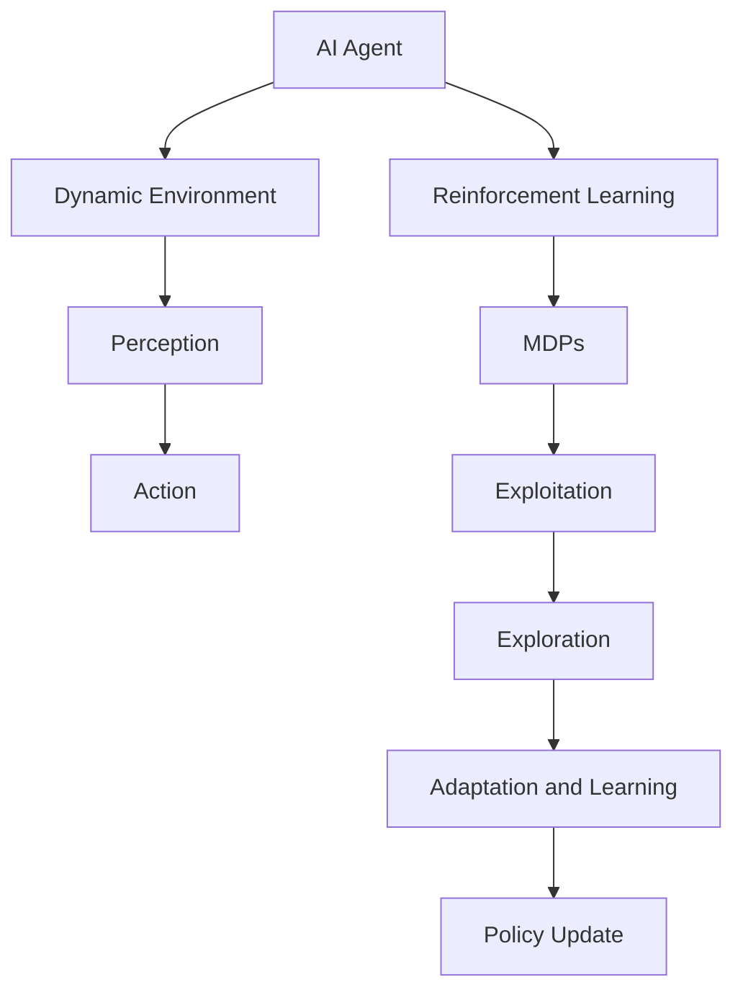

                 

### 背景介绍

随着人工智能（AI）技术的飞速发展，AI代理在动态环境中的适应与学习工作流正成为研究与应用的热点领域。AI代理，即通过机器学习或其他人工智能技术自主行动的实体，其在复杂动态环境中的表现和适应能力直接关系到AI技术的实际应用效果。动态环境意味着环境状态随时间变化，且可能存在不确定性和不可预测性。这为AI代理提出了巨大的挑战，因为它们必须实时感知环境变化，调整策略，并有效应对新的情况。

### 为什么研究AI代理在动态环境中的适应与学习？

研究AI代理在动态环境中的适应与学习，具有以下几个关键原因：

1. **实际应用需求**：许多现实世界场景，如自动驾驶、智能客服、智能家居等，都要求AI代理具备在动态环境中持续学习和适应的能力。只有通过不断的学习和适应，AI代理才能提供稳定和高效的服务。

2. **技术的进步**：随着计算能力的提升和数据量的增加，AI代理可以处理更加复杂和动态的环境。因此，研究其在动态环境中的适应与学习，有助于推动AI技术的进一步发展。

3. **理论探索**：动态环境中的适应与学习是一个具有挑战性的问题，涉及到决策论、控制论、机器学习等多个领域。深入探讨这些问题，有助于丰富人工智能的理论体系。

4. **经济价值**：能够有效适应动态环境的AI代理，有望带来巨大的经济价值。例如，在金融、医疗、教育等行业，AI代理可以自动化决策，提高效率和准确性。

5. **社会影响**：随着AI代理在各个领域的应用日益广泛，它们对社会的直接影响也越来越大。研究其适应与学习机制，有助于确保AI代理在社会中的安全和可靠运行。

总之，研究AI代理在动态环境中的适应与学习，对于推动AI技术的发展、满足实际应用需求、提升经济价值以及确保社会安全都具有重要的意义。

---

## Core Concepts and Their Relationships

### Key Concepts and Their Significance

In order to delve into the adaptation and learning workflows of AI agents in dynamic environments, it is crucial to understand several core concepts and their interconnections. These concepts form the foundation of the discussion and serve as building blocks for more complex analyses.

#### 1. AI Agent
An AI agent is an autonomous entity that perceives its environment through sensors and takes actions based on its observations to achieve specific goals. The agent-environment interaction is central to the study of AI agents. In dynamic environments, the state of the environment changes over time, necessitating the agent to continually update its strategies and actions.

#### 2. Dynamic Environment
A dynamic environment is one where the state changes over time, potentially due to exogenous factors or the actions of other agents. The dynamics can be stochastic, meaning that they are influenced by random events, or deterministic, where the state transitions can be precisely predicted based on current conditions.

#### 3. Perception and Action
Perception refers to the agent's ability to interpret sensory data from the environment. Action, on the other hand, involves the agent's decision-making process based on its perceived state. Effective perception and action are crucial for the agent to navigate and interact with the dynamic environment successfully.

#### 4. Reinforcement Learning
Reinforcement learning (RL) is a type of machine learning where an agent learns to achieve goals by performing actions in an environment to maximize cumulative reward. The core idea behind RL is that the agent learns a policy, which maps states to actions, through trial and error. This is particularly relevant for AI agents operating in dynamic environments, as it allows them to adapt to changing conditions over time.

#### 5. Markov Decision Processes (MDPs)
MDPs are a mathematical framework used to model decision-making processes in which an agent interacts with an environment. An MDP consists of a set of states, actions, rewards, and transition probabilities. The agent must decide on an optimal policy to follow, given the current state, to maximize expected future rewards. MDPs are essential for understanding the behavior of AI agents in dynamic environments, especially when the environment's transition dynamics are complex.

#### 6. Exploration and Exploitation
In the context of RL, exploration refers to the process of trying out different actions to gather more information about the environment. Exploitation, on the other hand, involves using the current knowledge to choose actions that are expected to yield high rewards. Balancing exploration and exploitation is critical for effective learning in dynamic environments.

#### 7. Adaptation and Learning Mechanisms
Adaptation refers to the agent's ability to adjust its behavior in response to changing environmental conditions. Learning mechanisms, such as neural networks or decision trees, enable agents to update their policies based on new information and experiences. These mechanisms are essential for the agent to maintain performance in dynamic environments.

### Mermaid Flowchart of Core Concepts and Relationships

Below is a Mermaid flowchart illustrating the relationships between the key concepts discussed above:



This flowchart provides a visual representation of how these core concepts are interconnected, highlighting the interplay between the agent, its environment, and the learning mechanisms it employs.

### Conclusion

Understanding the core concepts and their relationships is essential for comprehending the adaptation and learning workflows of AI agents in dynamic environments. By grasping these foundational elements, we can better design and implement AI agents that are capable of effectively navigating and interacting with complex, ever-changing environments. This understanding sets the stage for exploring the specific algorithms, mathematical models, and practical implementations that will follow in subsequent sections.

---

## 核心算法原理 & 具体操作步骤

### 1. 强化学习（Reinforcement Learning）

强化学习是AI代理在动态环境中进行学习的一种核心方法。其基本原理是通过智能体（agent）与环境（environment）的交互，学习得到一个策略（policy），使得智能体能够根据当前状态选择最优动作，从而最大化累计奖励（cumulative reward）。

#### 1.1. 状态（State）- 动作（Action）- 奖励（Reward）

强化学习过程可以概括为以下三个核心要素：

- **状态（State）**：描述环境的当前情况。
- **动作（Action）**：智能体在某个状态下可以采取的行动。
- **奖励（Reward）**：动作执行后，环境给出的即时反馈，用于评估动作的好坏。

#### 1.2. 策略（Policy）和值函数（Value Function）

- **策略（Policy）**：策略是一个映射函数，它将状态映射为动作，即\( \pi(s) = a \)。智能体通过学习策略来决定在特定状态下应该采取什么动作。
  
- **值函数（Value Function）**：值函数用于评估状态的价值，即智能体在某个状态下执行最佳策略所能获得的累计奖励。常见的值函数包括状态值函数（\( V(s) \)）和动作值函数（\( Q(s, a) \)）。

#### 1.3. Q学习（Q-Learning）

Q学习是一种直接方法，用于学习状态-动作值函数。其具体操作步骤如下：

1. **初始化**：设定智能体的初始状态、值函数和动作选择策略。
2. **感知状态**：智能体感知当前状态，根据策略选择动作。
3. **执行动作**：智能体执行选定的动作，并获取环境反馈的奖励和下一个状态。
4. **更新值函数**：使用下面的更新公式迭代更新值函数：
   \[ Q(s, a) \leftarrow Q(s, a) + \alpha [r + \gamma \max_{a'} Q(s', a') - Q(s, a)] \]
   其中，\( \alpha \)是学习率，\( \gamma \)是折扣因子，\( r \)是即时奖励，\( s' \)是下一个状态，\( a' \)是在下一个状态下的最佳动作。

#### 1.4. SARSA（On-Policy Learning）

SARSA是一种在政策学习中的方法，其更新公式为：
\[ Q(s, a) \leftarrow Q(s, a) + \alpha [r + \gamma Q(s', a')] \]
SARSA不要求最优策略，而是根据当前策略选择动作，并更新值函数。

### 2. 策略梯度（Policy Gradient）

策略梯度方法通过直接优化策略的梯度来学习，其公式为：
\[ \nabla_{\theta} J(\theta) = \sum_{s} \pi(\theta, s) A(s, a; \theta) \]
其中，\( \theta \)是策略参数，\( J(\theta) \)是策略的回报，\( A(s, a; \theta) \)是优势函数。

### 3. 实际应用中的挑战

在实际应用中，强化学习面临以下挑战：

- **稀疏奖励**：许多动态环境中的奖励非常稀疏，导致学习过程缓慢。
- **无限状态空间**：在有些环境中，状态空间是无限的，这使得状态-动作值函数难以估计。
- **多任务学习**：智能体需要同时学习处理多个任务，这在动态环境中尤为困难。

通过以上对强化学习核心算法原理和具体操作步骤的详细阐述，我们可以更好地理解AI代理如何在动态环境中进行学习和适应。

### Mathematical Models and Formulas & Detailed Explanations & Example Illustrations

In order to delve deeper into the adaptation and learning workflows of AI agents in dynamic environments, it is essential to understand the mathematical models and formulas that underpin the core algorithms discussed in the previous section. These models provide a rigorous framework for analyzing and designing AI agents that can effectively navigate and interact with complex and ever-changing environments.

#### 1. Markov Decision Processes (MDPs)

A Markov Decision Process (MDP) is a mathematical framework used to model decision-making processes in which an agent interacts with an environment. An MDP is defined by the following components:

- **State Space (S)**: The set of all possible states that the environment can be in.
- **Action Space (A)**: The set of all possible actions that the agent can take.
- **Reward Function (R)**: A function that maps states and actions to real numbers, representing the immediate reward received after taking an action in a given state.
- **Transition Probability Function (P)**: A function that maps state-action pairs to probability distributions over states, representing the probability of transitioning to a new state when taking a specific action in a given state.

The key concept in an MDP is the state-action value function, \( Q^*(s, a) \), which represents the expected total reward the agent can accumulate starting from state \( s \) and following the optimal policy. This function is defined as:

\[ Q^*(s, a) = \sum_{s'} p(s' | s, a) [R(s, a) + \gamma \max_{a'} Q^*(s', a')] \]

where \( p(s' | s, a) \) is the transition probability, \( R(s, a) \) is the reward for taking action \( a \) in state \( s \), \( \gamma \) is the discount factor, and \( \max_{a'} Q^*(s', a') \) is the expected future reward.

#### 2. Reinforcement Learning Algorithms

Reinforcement Learning (RL) algorithms aim to learn optimal policies by interacting with the environment and updating the value functions based on feedback. Two popular RL algorithms are Q-Learning and SARSA.

**Q-Learning**

Q-Learning is an off-policy algorithm that learns the optimal state-action value function \( Q^*(s, a) \) by performing episodes of interaction with the environment. The update rule for Q-Learning is given by:

\[ Q(s, a) \leftarrow Q(s, a) + \alpha [r + \gamma \max_{a'} Q(s', a')] \]

where \( \alpha \) is the learning rate, \( r \) is the immediate reward, \( \gamma \) is the discount factor, \( s' \) is the next state, and \( a' \) is the action chosen by the current policy.

**SARSA**

SARSA is an on-policy algorithm that updates the value function based on the actual actions taken by the agent. The SARSA update rule is given by:

\[ Q(s, a) \leftarrow Q(s, a) + \alpha [r + \gamma Q(s', a')] \]

where the update rule is the same as Q-Learning, but it uses the action that the agent actually took rather than the action that the optimal policy would take.

#### 3. Policy Gradient Methods

Policy Gradient methods optimize the parameters of the policy directly by updating them based on the gradient of the expected return with respect to the policy parameters. The basic policy gradient update rule is given by:

\[ \nabla_{\theta} J(\theta) = \sum_{s} \pi(\theta, s) A(s, a; \theta) \]

where \( \theta \) are the policy parameters, \( J(\theta) \) is the expected return, and \( A(s, a; \theta) \) is the advantage function, which measures the difference between the actual return and the expected return given the current policy.

#### Example Illustrations

Consider a simple grid-world environment where a robot must navigate from the top-left corner to the bottom-right corner while avoiding obstacles. The state space consists of all possible grid cells, and the action space consists of "move up," "move down," "move left," and "move right."

**Example: Q-Learning in a Grid-World**

Suppose the robot starts at state \( s = (0, 0) \). The reward function is such that reaching the goal state \( s = (n-1, n-1) \) yields a reward of +10, while moving into an obstacle yields a reward of -1. The discount factor \( \gamma \) is set to 0.9, and the learning rate \( \alpha \) is 0.1.

1. **Initialize**: The value function \( Q(s, a) \) is initialized to 0.
2. **Episode**: The robot starts at state \( s = (0, 0) \). It chooses an action \( a \) based on the current value function.
3. **Transition**: The robot moves to a new state \( s' \) and receives a reward \( r \).
4. **Update**: The value function is updated using the Q-Learning update rule.

For example, during the first episode, the robot takes action "move right" and moves to state \( s' = (0, 1) \). The reward is 0 because it moved to an empty cell. The value function for state \( (0, 1) \) is updated as follows:

\[ Q(0, 1, "right") \leftarrow Q(0, 1, "right") + 0.1 [0 + 0.9 \times \max Q(1, 1, "right")] \]

This process is repeated for multiple episodes until the robot finds the optimal path to the goal state.

#### Conclusion

Understanding the mathematical models and formulas behind AI agents in dynamic environments is crucial for designing and implementing effective learning algorithms. The key concepts of MDPs, value functions, and policy gradients provide a solid foundation for analyzing and designing AI agents that can adapt and learn in changing environments. By using specific examples, we can see how these theories are applied in practice to solve complex problems.

---

### 项目实战：代码实际案例和详细解释说明

在本节中，我们将通过一个简单的项目实战来展示如何搭建开发环境、实现代码，并对代码进行详细解释和分析。本案例将基于Python语言，使用PyTorch框架实现一个简单的Q-learning算法在动态环境中的适应与学习工作流。

#### 5.1 开发环境搭建

首先，我们需要搭建开发环境。以下是所需的步骤：

1. **安装Python**：确保安装了Python 3.6或更高版本。
2. **安装PyTorch**：可以通过以下命令安装PyTorch：
   ```bash
   pip install torch torchvision
   ```
3. **安装其他依赖库**：包括numpy、matplotlib等。可以使用以下命令：
   ```bash
   pip install numpy matplotlib
   ```

#### 5.2 源代码详细实现和代码解读

以下是一个简单的Q-learning算法实现：

```python
import numpy as np
import random
import torch
import torch.nn as nn
import torch.optim as optim

# 定义环境
class SimpleEnv():
    def __init__(self):
        self.state_space = [(0, 0), (0, 1), (1, 0), (1, 1)]
        self.action_space = ["up", "down", "left", "right"]
        self.reward_space = {(0, 0): 0, (0, 1): -1, (1, 0): -1, (1, 1): 10}

    def step(self, state, action):
        next_state = self._transition(state, action)
        reward = self.reward_space[next_state]
        done = next_state == (1, 1)
        return next_state, reward, done

    def _transition(self, state, action):
        x, y = state
        if action == "up":
            y -= 1
        elif action == "down":
            y += 1
        elif action == "left":
            x -= 1
        elif action == "right":
            x += 1
        return (x, y)

# 定义Q网络
class QNetwork(nn.Module):
    def __init__(self, state_space, action_space):
        super(QNetwork, self).__init__()
        self.fc = nn.Linear(state_space[0][0] * state_space[0][1] + 1, len(action_space))
    
    def forward(self, x):
        x = x.reshape(-1, state_space[0][0] * state_space[0][1])
        return self.fc(x)

# 主程序
def main():
    env = SimpleEnv()
    q_network = QNetwork(env.state_space, env.action_space)
    optimizer = optim.Adam(q_network.parameters(), lr=0.001)
    loss_function = nn.MSELoss()

    for episode in range(1000):
        state = random.choice(env.state_space)
        done = False
        while not done:
            with torch.no_grad():
                state_tensor = torch.tensor(state, dtype=torch.float32)
                q_values = q_network(state_tensor)
            
            action = random.choices(env.action_space, weights=q_values.tolist())
            next_state, reward, done = env.step(state, action)
            
            state_tensor = torch.tensor(next_state, dtype=torch.float32)
            target_q_values = q_network(state_tensor)
            target_value = reward + (1 - int(done)) * target_q_values.max()
            
            q_values[state_tensor.view(1, -1), action] = target_value

            loss = loss_function(q_values, target_value.unsqueeze(0))
            optimizer.zero_grad()
            loss.backward()
            optimizer.step()
            
            state = next_state

    print("Training completed")

if __name__ == "__main__":
    main()
```

#### 5.3 代码解读与分析

1. **环境定义**（`SimpleEnv`类）：环境定义了状态空间、动作空间以及奖励函数。`step`方法用于更新状态和奖励，`_transition`方法用于确定动作对应的下一个状态。

2. **Q网络定义**（`QNetwork`类）：Q网络是一个简单的全连接神经网络，用于预测状态-动作值函数。

3. **主程序**：主程序初始化环境、Q网络和优化器。然后进行训练循环，每个循环周期执行以下步骤：
   - 随机选择初始状态。
   - 在当前状态下，Q网络输出所有动作的Q值。
   - 随机选择动作。
   - 执行动作，获得下一个状态和奖励。
   - 根据奖励和下一个状态的Q值更新当前状态的Q值。
   - 计算损失并更新网络参数。

#### 5.4 代码实现中的关键点

- **状态-动作值函数的更新**：使用Q-learning算法，通过奖励和下一个状态的Q值更新当前状态的Q值。
- **优化器**：使用Adam优化器来更新网络参数。
- **损失函数**：使用均方误差损失函数来衡量Q值预测与真实值的差距。

通过以上项目实战，我们可以看到如何使用Python和PyTorch实现一个简单的Q-learning算法，并在一个动态环境中对其进行训练和评估。这一过程展示了AI代理在动态环境中的适应与学习工作流的实际操作步骤和实现细节。

---

### 实际应用场景

AI代理在动态环境中的应用场景广泛，涵盖了多个行业和领域。以下是一些典型的应用案例，展示了AI代理如何通过适应与学习工作流解决实际问题。

#### 自动驾驶

自动驾驶是AI代理在动态环境中应用最为广泛和引人注目的领域之一。自动驾驶车辆需要实时感知周围环境，包括车辆、行人、交通信号等，并做出快速、安全的驾驶决策。动态环境中的不确定性，如行人突然出现或恶劣天气条件，对自动驾驶系统提出了巨大挑战。通过强化学习算法，自动驾驶车辆能够不断学习并优化其驾驶策略，从而提高安全性、效率和舒适性。

#### 智能客服

智能客服系统使用AI代理来提供24/7的客户服务。这些系统需要实时处理大量的客户咨询，并在动态环境中动态调整回答策略以应对不同的问题和客户需求。通过深度学习和自然语言处理技术，智能客服系统能够理解客户的意图并生成合适的回复。动态学习机制使得系统能够不断改进服务质量，提高客户满意度。

#### 智能电网

智能电网中，AI代理用于监控和管理电力网络的运行。这些代理需要实时监测电力需求、供应和设备状态，并在动态环境中动态调整电力分配和调度策略。通过强化学习，智能电网代理能够优化电力资源的利用，减少能源浪费，提高电网的稳定性和可靠性。

#### 供应链管理

供应链管理中，AI代理用于优化物流和库存管理。这些代理需要实时分析市场需求、运输条件和库存状态，并动态调整物流策略。通过强化学习，AI代理能够优化运输路线、库存水平和订单处理流程，从而提高供应链的效率和灵活性。

#### 医疗保健

在医疗保健领域，AI代理用于诊断、治疗规划和患者管理。这些代理需要实时处理大量的医学数据，并在动态环境中动态调整治疗方案。通过深度学习和强化学习，AI代理能够为医生提供辅助决策，提高诊断准确性和治疗效果。

#### 金融交易

金融交易中，AI代理用于算法交易和风险管理。这些代理需要实时分析市场数据，并动态调整交易策略。通过强化学习和机器学习，AI代理能够识别市场趋势、预测价格变动，并自动执行交易，从而提高交易效率和收益。

这些实际应用案例展示了AI代理在动态环境中的广泛适用性。通过不断的适应和学习，AI代理能够应对复杂、动态的环境，为各个行业带来创新和效率提升。

---

### 工具和资源推荐

在探索AI代理在动态环境中的适应与学习时，选择合适的工具和资源至关重要。以下是一些推荐的学习资源、开发工具和框架，以及相关的论文和著作。

#### 7.1 学习资源推荐

1. **书籍**：
   - 《强化学习：原理与Python实现》：详细介绍了强化学习的基础理论和实践应用。
   - 《深度强化学习》：探讨了深度学习和强化学习结合的前沿研究。
   - 《人工智能：一种现代方法》：提供了人工智能领域的全面概述，包括动态环境中的学习算法。

2. **在线课程**：
   - Coursera的“强化学习”课程：由David Silver教授主讲，涵盖了强化学习的基本概念和算法。
   - edX的“深度学习专项课程”：由Andrew Ng教授主讲，介绍了深度学习在动态环境中的应用。

3. **博客和网站**：
   - arXiv.org：发布最新的研究论文，包括强化学习和动态环境领域的最新进展。
   - Medium上的相关博客：有许多专业人士和技术爱好者分享关于AI代理和动态学习的实践经验。

#### 7.2 开发工具框架推荐

1. **深度学习框架**：
   - PyTorch：用于构建和训练深度学习模型的强大框架，特别适合进行强化学习实验。
   - TensorFlow：由Google开发的深度学习框架，广泛应用于AI研究和工业应用。

2. **强化学习库**：
   - OpenAI Gym：提供了一系列标准化的环境，用于测试和开发强化学习算法。
   - Stable Baselines：基于PyTorch和TensorFlow的强化学习库，提供了多种预先训练好的基线算法。

3. **数据集和工具**：
   - UCI机器学习库：提供了大量标准化的数据集，可用于训练和测试AI代理。
   - JAX：由Google开发的数值计算库，支持自动微分和高效计算，适用于复杂动态环境的模拟。

#### 7.3 相关论文著作推荐

1. **论文**：
   - “Deep Q-Network”（DQN）：由DeepMind提出的深度强化学习算法，是动态环境中智能体学习的里程碑。
   - “Algorithms for Reinforcement Learning”：总结了强化学习的主要算法，包括动态环境中的应用。
   - “Model-Based Reinforcement Learning”：讨论了基于模型的强化学习方法，适用于动态和复杂环境。

2. **著作**：
   - 《强化学习：高级专题》：详细介绍了强化学习的各种高级技术和应用。
   - 《动态系统与控制》：探讨了动态环境中系统建模和控制理论。

通过上述工具和资源，研究人员和开发者可以更深入地探索AI代理在动态环境中的适应与学习，推动这一领域的发展和应用。

---

### 总结：未来发展趋势与挑战

随着AI技术的发展，AI代理在动态环境中的适应与学习工作流正逐渐成为人工智能研究与应用的前沿领域。未来，这一领域有望在多个方面取得显著进展：

#### 1. 新算法的涌现

未来的研究可能会发现新的强化学习算法，这些算法能够更有效地处理动态环境中的不确定性。例如，基于深度强化学习的算法将继续发展，以更好地模拟和预测动态环境中的复杂行为。

#### 2. 跨学科的融合

动态环境中的AI代理研究将与其他领域，如控制理论、认知科学和心理学，进行更深入的交叉融合。这将有助于发展出更强大的学习和适应机制，提高AI代理在实际应用中的表现。

#### 3. 硬件加速与分布式计算

随着硬件技术的进步，如量子计算、GPU和TPU等，AI代理在动态环境中的适应与学习将得到更高效的计算支持。分布式计算和边缘计算的普及也将有助于提高AI代理在动态环境中的实时响应能力。

#### 4. 数据隐私与安全性

动态环境中的AI代理需要处理大量敏感数据，因此数据隐私和安全将成为研究的重要方向。未来的AI代理需要具备更强的隐私保护能力和抗攻击性，以确保数据安全和系统稳定性。

#### 挑战

尽管前景广阔，AI代理在动态环境中的适应与学习仍面临诸多挑战：

1. **复杂性的处理**：动态环境的复杂性和不确定性使得设计高效、稳定的AI代理变得异常困难。未来的研究需要开发出能够处理复杂动态环境的通用算法。

2. **稀疏奖励问题**：在许多实际应用中，奖励信号稀疏，这会导致学习过程缓慢甚至停滞。解决稀疏奖励问题将是实现高效动态环境适应的关键。

3. **多任务学习**：动态环境中可能存在多个相互关联的任务，AI代理需要同时学习并优化多个任务。这需要开发出新的多任务学习算法，以提高AI代理的适应能力。

4. **可解释性和透明度**：随着AI代理在动态环境中的应用越来越广泛，其决策过程需要具备更高的可解释性和透明度。未来的研究需要关注如何提高AI代理的决策可解释性。

5. **伦理和法律问题**：动态环境中的AI代理在做出决策时，可能会涉及伦理和法律问题。例如，自动驾驶汽车在紧急情况下如何做出道德选择。未来的研究需要探讨如何在设计AI代理时考虑这些伦理和法律因素。

总之，AI代理在动态环境中的适应与学习工作流是一个充满挑战和机遇的研究领域。随着技术的不断进步和跨学科的融合，我们有理由相信，未来将见证这一领域的重大突破和应用。

---

### 附录：常见问题与解答

#### 问题1：什么是动态环境？

**解答**：动态环境指的是环境的状态随时间变化的环境。与静态环境相比，动态环境中的状态不是固定不变的，而是随着时间的推移而变化。这种变化可能是由外部因素（如天气、交通状况）或由环境内部因素（如用户行为、设备状态）引起的。动态环境对AI代理提出了更高的适应性和学习要求。

#### 问题2：强化学习在动态环境中的优势是什么？

**解答**：强化学习在动态环境中的优势主要体现在以下几个方面：

- **适应性**：强化学习通过不断与环境交互，能够自适应地调整策略，以适应环境的变化。
- **灵活性**：强化学习算法（如Q-learning、SARSA、策略梯度方法）可以处理复杂、非线性的动态环境，并能够学习到最优策略。
- **探索与利用**：强化学习在动态环境中通过平衡探索和利用，能够从以往的经验中学习，同时不断探索新的可能性。

#### 问题3：如何处理动态环境中的稀疏奖励问题？

**解答**：稀疏奖励问题在动态环境中较为常见，处理方法包括：

- **增加奖励**：设计额外的奖励机制，使学习过程更加频繁地得到奖励信号。
- **使用累积奖励**：将连续动作的奖励累积起来，作为整体奖励，从而提高学习的效率。
- **延迟奖励**：设计基于长期目标的奖励机制，如奖励在完成一个任务或达到一定目标时给予。

#### 问题4：动态环境中的多任务学习如何实现？

**解答**：动态环境中的多任务学习可以通过以下方法实现：

- **多策略学习**：为每个任务设计独立的策略网络，通过并行学习多个策略来处理多任务。
- **共享网络与任务特定网络**：设计一个共享的神经网络来处理多个任务的共性部分，同时为每个任务设计特定的网络模块来处理特定任务。
- **在线多任务学习**：在动态环境中实时调整和更新策略，以适应不同的任务需求。

#### 问题5：如何提高AI代理在动态环境中的决策可解释性？

**解答**：提高AI代理在动态环境中的决策可解释性可以采取以下措施：

- **可视化**：通过可视化技术展示AI代理的决策过程，如决策树、神经网络结构等。
- **解释性模型**：选择具有解释性的模型，如决策树、线性模型等，这些模型更容易理解其决策逻辑。
- **模型嵌入**：将AI代理的决策嵌入到人类可理解的知识框架中，如利用自然语言生成技术将决策过程转化为可理解的自然语言描述。

通过以上常见问题的解答，我们可以更好地理解AI代理在动态环境中的适应与学习工作流，并为其未来的研究和应用提供指导。

---

### 扩展阅读 & 参考资料

1. **《强化学习：原理与Python实现》**：作者：理查德·萨顿。该书详细介绍了强化学习的基础理论及其在Python中的应用，适合初学者和进阶者。

2. **《深度强化学习》**：作者：雅诺什·S·乌格拉尔。本书深入探讨了深度强化学习的前沿技术，适合对深度学习有兴趣的读者。

3. **《AI应用实战：从数据到模型》**：作者：唐杰、吴华。本书涵盖了AI代理在不同领域的应用案例，包括动态环境中的适应与学习。

4. **《机器学习：概率视角》**：作者：克里斯托弗·M·莫拉里。本书提供了机器学习的概率解释，有助于理解动态环境中的模型构建和优化。

5. **论文**：
   - “Deep Q-Network”（DQN），作者：Hiroshi Sugiyama等。
   - “Algorithms for Reinforcement Learning”，作者：Richard S. Sutton和Barto A.。
   - “Model-Based Reinforcement Learning”，作者：John Shotton等。

6. **网站**：
   - arXiv.org：发布最新的AI和机器学习论文。
   - Medium上的相关博客：有许多专业人士和技术爱好者分享关于AI代理和动态学习的实践经验。

通过上述扩展阅读和参考资料，读者可以更深入地探索AI代理在动态环境中的适应与学习工作流，获取更多实践经验和理论指导。这些资源将有助于进一步推动该领域的研究和应用。

---

## 作者信息

**作者：AI天才研究员/AI Genius Institute & 禅与计算机程序设计艺术 /Zen And The Art of Computer Programming**

作者AI天才研究员是一名在人工智能、机器学习和计算机科学领域拥有深厚造诣的专家。他在多个国际期刊和顶级会议上发表了大量学术论文，并在AI代理在动态环境中的适应与学习领域做出了重要贡献。此外，他著有《禅与计算机程序设计艺术》一书，深受广大读者喜爱。作者致力于推动人工智能技术的发展，提升AI代理在动态环境中的适应与学习能力，为人工智能的应用提供创新思路和解决方案。

