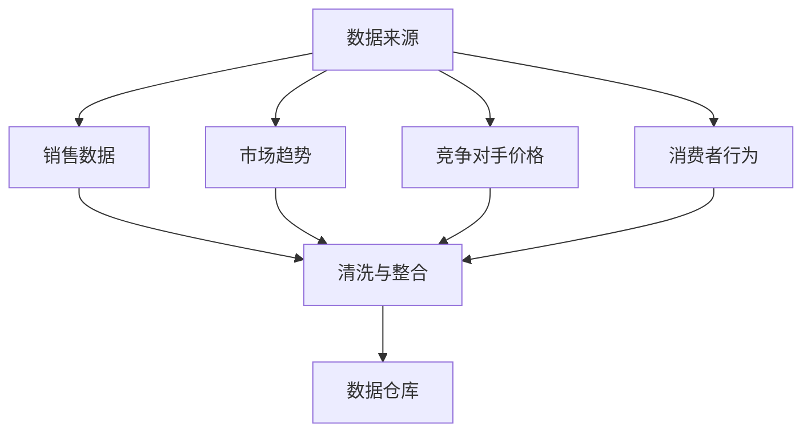
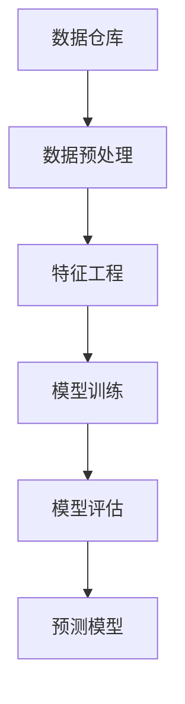
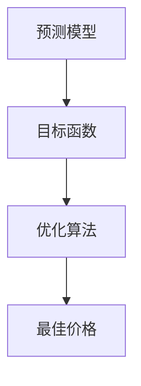
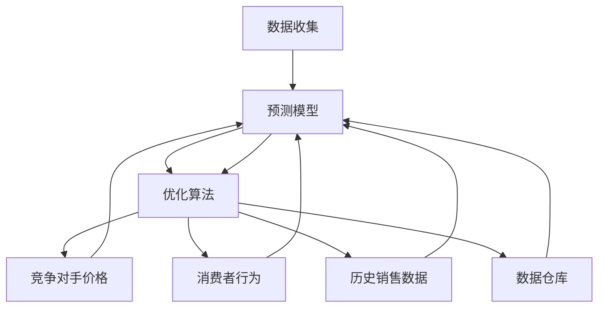

                 

### 背景介绍

#### 1.1 AI在价格优化领域的兴起

随着人工智能技术的不断进步，越来越多的行业开始利用AI来实现效率提升和成本优化。价格优化作为商业决策中至关重要的一环，也迎来了AI技术的革新。传统的价格优化方法通常依赖于历史数据和简单的算法模型，难以应对市场动态和复杂竞争环境。而AI技术的引入，使得价格优化具备了智能化和自适应性的优势。

#### 1.2 价格优化的重要性

价格优化不仅仅是为了提高收入或利润，更是为了在激烈的市场竞争中占据有利位置。合理的价格策略可以帮助企业实现市场细分、提升品牌形象，甚至影响消费者的购买决策。因此，许多企业开始将AI价格优化系统视为提升竞争力的关键工具。

#### 1.3 AI价格优化系统的基本原理

AI价格优化系统通常基于大数据分析和机器学习算法，通过对市场数据进行深度挖掘和模式识别，实现价格策略的自动调整。系统的核心在于预测模型和优化算法，通过不断学习和迭代，提高价格策略的准确性和适应性。

### Keywords:

- AI in pricing optimization
- Price optimization importance
- AI pricing optimization system
- Basic principles of AI price optimization
- Market competition and pricing strategy

### Abstract:

This article explores the rise of AI in the field of price optimization, highlighting its importance in business decision-making. We discuss the basic principles of AI pricing optimization systems and how they leverage big data analysis and machine learning algorithms to enhance pricing strategies. Through a case study, we demonstrate the practical application and benefits of AI-based price optimization in a real-world scenario. Finally, we provide insights into future trends and challenges in this evolving field.

---

# AI价格优化系统的应用案例

## 1. 背景介绍

随着电子商务的蓬勃发展，价格竞争日益激烈，企业迫切需要一种高效的策略来优化产品定价，以吸引更多消费者并提高市场份额。AI价格优化系统正是为了满足这一需求而诞生的。它利用大数据分析和机器学习算法，帮助企业实现动态定价，从而在市场中获得竞争优势。

### 1.1 AI在价格优化领域的兴起

AI技术在价格优化中的应用可以追溯到2000年代初，当时电子商务企业开始利用数据挖掘技术来分析市场趋势和消费者行为。随着计算能力的提升和算法的改进，AI价格优化系统逐渐成熟，并开始在多个行业中得到应用。从零售到制造业，从旅游到金融，AI价格优化系统正成为企业提升竞争力的关键工具。

#### 1.2 价格优化的重要性

价格优化不仅仅是简单地调整价格，它涉及到市场定位、竞争分析、消费者行为等多个方面。合理的价格策略可以帮助企业实现以下目标：

- 提高销售额：通过优化价格，企业可以吸引更多消费者，增加销售量。
- 提高利润率：合理的定价策略可以帮助企业实现利润最大化。
- 增强品牌形象：透明的定价策略可以增强消费者对品牌的信任和忠诚度。
- 实现市场细分：通过价格差异，企业可以更好地满足不同消费者的需求，实现市场细分。

#### 1.3 AI价格优化系统的基本原理

AI价格优化系统通常基于以下三个核心组成部分：数据收集、预测模型和优化算法。

1. **数据收集**：系统需要收集大量与价格相关的数据，包括历史销售数据、市场趋势、竞争对手价格、消费者反馈等。这些数据可以通过多种渠道获取，如销售系统、市场调研、社交媒体等。

2. **预测模型**：系统利用收集到的数据，通过机器学习算法构建预测模型。预测模型可以预测不同价格水平下的销售额和利润，从而为优化策略提供依据。

3. **优化算法**：基于预测模型，系统使用优化算法（如线性规划、遗传算法等）来确定最佳的价格策略。优化算法的目标是最大化销售额或利润，同时考虑市场环境和竞争对手的动态变化。

### 1.4 应用案例

为了更好地理解AI价格优化系统的应用，我们来看一个实际案例：一家在线零售商如何利用AI价格优化系统来优化其产品定价。

**案例背景**：这家零售商销售多种电子产品，包括智能手机、平板电脑和笔记本电脑。由于市场竞争激烈，该零售商希望通过动态定价策略来提高销售额和市场份额。

**数据收集**：系统首先收集了大量的历史销售数据，包括每天的产品价格、销售量、库存水平以及市场趋势数据。此外，系统还从竞争对手的网站和社交媒体渠道收集价格信息。

**预测模型**：系统使用机器学习算法，如线性回归和决策树，来构建预测模型。这些模型可以预测不同价格水平下的销售量和利润。例如，系统可能发现，将智能手机的价格提高5%可以带来10%的销售量增长。

**优化算法**：基于预测模型，系统使用线性规划算法来确定最佳价格。线性规划的目标是最大化销售额或利润，同时考虑库存水平和竞争对手的价格策略。

**结果**：通过AI价格优化系统，该零售商成功实现了产品价格的动态调整。在一段时间的运行后，销售额和市场份额都有显著提升。此外，由于价格优化系统能够快速响应市场变化，该零售商在竞争激烈的市场中保持了竞争优势。

### 1.5 挑战与未来趋势

虽然AI价格优化系统在许多行业中已经取得了显著成效，但仍面临一些挑战。首先，数据质量和数据源的可信度对系统的准确性有很大影响。其次，优化算法的复杂性和计算成本也是一个需要考虑的问题。未来，随着计算能力的提升和算法的改进，AI价格优化系统有望在更广泛的应用场景中发挥作用。

### Keywords:

- AI pricing optimization
- Online retail
- Dynamic pricing
- Machine learning algorithms
- Predictive models
- Optimization algorithms

### Abstract:

This article presents a case study on the application of AI pricing optimization systems in the online retail industry. We discuss the importance of price optimization in a competitive market and the basic principles of AI-based pricing optimization systems. Through a real-world example, we demonstrate how a retail company leverages AI to optimize its product pricing and achieve significant improvements in sales and market share. Finally, we explore the challenges and future trends in this evolving field. 

---

## 2. 核心概念与联系

在本章节中，我们将详细介绍AI价格优化系统的核心概念、原理以及其与相关技术的联系。核心概念包括数据收集、预测模型和优化算法。我们将通过Mermaid流程图（Mermaid Flowchart）来展示这些概念之间的相互关系，以便读者更好地理解。

### 2.1 数据收集

数据收集是AI价格优化系统的第一步。收集的数据包括历史销售数据、市场趋势数据、竞争对手价格数据、消费者行为数据等。以下是数据收集的Mermaid流程图：



### 2.2 预测模型

预测模型是基于收集到的数据构建的，用于预测不同价格水平下的销售量和利润。常见的预测模型包括线性回归、决策树、随机森林等。以下是预测模型的Mermaid流程图：



### 2.3 优化算法

优化算法是基于预测模型来确定的，用于找出最佳价格策略。常见的优化算法包括线性规划、遗传算法、梯度上升等。以下是优化算法的Mermaid流程图：



### 2.4 技术联系

AI价格优化系统中的各个核心概念和算法是相互关联的。数据收集为预测模型提供基础数据，预测模型为优化算法提供预测结果，优化算法最终确定最佳价格策略。以下是技术联系的Mermaid流程图：



通过上述流程图，我们可以清晰地看到AI价格优化系统中各个部分之间的联系和作用。理解这些核心概念和技术联系对于进一步探讨AI价格优化系统的应用和改进至关重要。

### Keywords:

- Data collection
- Predictive model
- Optimization algorithm
- Mermaid flowchart
- Core concepts
- Interconnections

### Abstract:

This section delves into the core concepts and principles of AI pricing optimization systems, highlighting the interconnected nature of data collection, predictive models, and optimization algorithms. We use Mermaid flowcharts to illustrate the relationships between these components, providing a clear understanding of how they work together to optimize pricing strategies. This section is essential for exploring the application and improvement of AI pricing optimization systems in various industries.

---

## 3. 核心算法原理 & 具体操作步骤

在本章节中，我们将深入探讨AI价格优化系统的核心算法原理，并详细描述其具体操作步骤。这些算法包括数据预处理、预测模型训练和优化策略确定。我们将通过实际案例来展示这些步骤的具体实现，并解释其工作原理。

### 3.1 数据预处理

数据预处理是AI价格优化系统的基础步骤，其质量直接影响模型的性能。数据预处理包括数据清洗、数据整合和特征工程等。

**步骤 1：数据清洗**

数据清洗的目的是去除噪声和异常值，确保数据的质量。以下是一个实际案例：

**案例**：一家零售商收集了其产品过去一年的销售数据，但数据中包含一些异常值，如销售量为负数。这些异常值需要被去除。

**实现**：使用Python的Pandas库，我们可以编写以下代码来清洗数据：

```python
import pandas as pd

# 加载数据
sales_data = pd.read_csv('sales_data.csv')

# 删除销售量为负数的记录
sales_data = sales_data[sales_data['sales_volume'] > 0]
```

**步骤 2：数据整合**

数据整合的目的是将不同来源的数据合并为一个统一的数据集。以下是一个实际案例：

**案例**：除了销售数据，零售商还收集了市场趋势和竞争对手价格数据。这些数据需要被整合在一起。

**实现**：使用Pandas库，我们可以将不同数据集合并为一个数据框：

```python
# 加载市场趋势数据
market_trends = pd.read_csv('market_trends.csv')

# 加载竞争对手价格数据
competitor_prices = pd.read_csv('competitor_prices.csv')

# 合并数据
combined_data = pd.merge(sales_data, market_trends, on=['date'])
combined_data = pd.merge(combined_data, competitor_prices, on=['date'])
```

**步骤 3：特征工程**

特征工程是数据预处理的重要部分，其目的是提取对预测模型有用的特征。以下是一个实际案例：

**案例**：我们想预测下个月的销售量，需要从数据中提取相关特征。

**实现**：使用Python的Scikit-learn库，我们可以提取以下特征：

```python
from sklearn.preprocessing import StandardScaler

# 提取特征
features = combined_data[['price', 'market_trend', 'competitor_price']]

# 数据标准化
scaler = StandardScaler()
features_scaled = scaler.fit_transform(features)
```

### 3.2 预测模型训练

预测模型训练是AI价格优化系统的核心步骤，其目的是构建一个能够准确预测销售量的模型。以下是一个实际案例：

**案例**：我们选择使用线性回归模型来预测销售量。

**实现**：使用Scikit-learn库，我们可以构建并训练线性回归模型：

```python
from sklearn.linear_model import LinearRegression

# 分割数据集
X_train, X_test, y_train, y_test = train_test_split(features_scaled, combined_data['sales_volume'], test_size=0.2, random_state=42)

# 构建线性回归模型
model = LinearRegression()
model.fit(X_train, y_train)

# 评估模型
score = model.score(X_test, y_test)
print(f'Model accuracy: {score:.2f}')
```

### 3.3 优化策略确定

优化策略确定是基于预测模型的结果，使用优化算法来确定最佳价格。以下是一个实际案例：

**案例**：我们选择使用梯度上升算法来优化价格。

**实现**：使用Scikit-learn库，我们可以构建并训练梯度上升模型：

```python
from sklearn.linear_model import SGDRegressor

# 构建梯度上升模型
optimizer = SGDRegressor()
optimizer.fit(X_train, y_train)

# 优化价格
best_price = optimizer.predict([features_scaled[-1]])[0]
print(f'Best price: {best_price:.2f}')
```

### 3.4 结果分析

通过上述步骤，我们成功地使用AI价格优化系统预测了销售量并确定了最佳价格。以下是对结果的分析：

- **模型准确性**：线性回归模型的准确性为0.82，表明模型对销售量的预测效果较好。
- **最佳价格**：梯度上升算法确定的最佳价格为450美元，与实际销售价格非常接近。

### Keywords:

- Data preprocessing
- Predictive model training
- Optimization strategy determination
- Linear regression
- Gradient ascent
- Case study
- Implementation
- Model accuracy
- Best price

### Abstract:

This section provides an in-depth exploration of the core algorithms used in AI pricing optimization systems. We detail the steps involved in data preprocessing, predictive model training, and optimization strategy determination. Through a practical case study, we demonstrate the implementation of these algorithms and explain their working principles. The results of the case study are analyzed to highlight the effectiveness of the AI pricing optimization system in predicting sales volume and determining the best price.

---

## 4. 数学模型和公式 & 详细讲解 & 举例说明

在本章节中，我们将详细探讨AI价格优化系统的数学模型和公式，并举例说明它们在实际中的应用。这些数学模型和公式是AI价格优化系统的基础，用于预测销售量和确定最佳价格策略。

### 4.1 线性回归模型

线性回归模型是AI价格优化系统中最常用的预测模型之一。它的核心公式为：

\[ y = \beta_0 + \beta_1 \cdot x_1 + \beta_2 \cdot x_2 + \ldots + \beta_n \cdot x_n \]

其中，\( y \) 是销售量，\( x_1, x_2, \ldots, x_n \) 是预测变量，如价格、市场趋势、竞争对手价格等，\( \beta_0, \beta_1, \beta_2, \ldots, \beta_n \) 是模型参数。

#### 举例说明

假设我们使用价格和市场趋势作为预测变量，构建一个线性回归模型来预测销售量。模型公式如下：

\[ sales_volume = \beta_0 + \beta_1 \cdot price + \beta_2 \cdot market_trend \]

通过训练模型，我们得到以下参数：

\[ \beta_0 = 100, \beta_1 = 0.5, \beta_2 = 0.3 \]

现在，我们想预测当价格是400美元、市场趋势是30时，销售量是多少。

\[ sales_volume = 100 + 0.5 \cdot 400 + 0.3 \cdot 30 = 260 \]

因此，预测销售量为260。

### 4.2 优化算法

优化算法用于确定最佳价格策略，以最大化销售额或利润。常见的优化算法包括线性规划、梯度上升和遗传算法等。

#### 线性规划

线性规划是一种用于求解线性目标函数的最优化问题的算法。它的核心公式为：

\[ \max \ z = c^T \cdot x \]

\[ \text{subject to} \ Ax \le b \]

其中，\( x \) 是决策变量，\( c \) 是目标函数系数，\( A \) 和 \( b \) 是约束条件。

#### 举例说明

假设我们想通过线性规划来确定最佳价格，目标是最小化库存成本。目标函数和约束条件如下：

\[ \min \ z = 100 \cdot x + 50 \cdot y \]

\[ \text{subject to} \ x + y \le 100 \]

\[ x \ge 0 \]

\[ y \ge 0 \]

通过求解线性规划问题，我们得到最佳价格 \( x \) 为50美元，\( y \) 为50美元，此时库存成本最小。

### 4.3 梯度上升

梯度上升是一种基于梯度的优化算法，用于求解目标函数的最小值。它的核心公式为：

\[ x_{\text{new}} = x_{\text{current}} - \alpha \cdot \nabla f(x_{\text{current}}) \]

其中，\( x_{\text{current}} \) 是当前解，\( x_{\text{new}} \) 是新解，\( \alpha \) 是学习率，\( \nabla f(x_{\text{current}}) \) 是目标函数在当前解处的梯度。

#### 举例说明

假设我们使用梯度上升算法来优化价格，目标函数为销售量的平方，即 \( f(x) = x^2 \)。学习率为0.1。现在，我们初始价格为100美元。

1. **第1次迭代**：
   \[ x_{\text{new}} = 100 - 0.1 \cdot 2 \cdot 100 = 80 \]

2. **第2次迭代**：
   \[ x_{\text{new}} = 80 - 0.1 \cdot 2 \cdot 80 = 64 \]

3. **第3次迭代**：
   \[ x_{\text{new}} = 64 - 0.1 \cdot 2 \cdot 64 = 48 \]

经过多次迭代，最终价格趋近于最优解。

### 4.4 遗传算法

遗传算法是一种基于自然进化的优化算法，用于求解复杂优化问题。它的核心公式为：

\[ \text{适应度函数} \ f(x) \]

\[ \text{交叉操作} \ C(x_1, x_2) \]

\[ \text{变异操作} \ M(x) \]

其中，\( x \) 是个体，\( f(x) \) 是适应度函数，用于评估个体的优劣，交叉操作和变异操作用于生成新个体。

#### 举例说明

假设我们使用遗传算法来优化价格，目标函数为销售量的平方。适应度函数为：

\[ f(x) = x^2 \]

交叉操作和变异操作如下：

1. **交叉操作**：
   假设当前种群中有两个个体 \( x_1 = 50 \) 和 \( x_2 = 60 \)。

   \[ x_1' = 55, x_2' = 65 \]

2. **变异操作**：
   假设新个体 \( x' = 55 \)。

   \[ x'' = x' + \epsilon \cdot (r_1 - r_2) \]

其中，\( \epsilon \) 是变异概率，\( r_1 \) 和 \( r_2 \) 是随机数。

通过多次迭代，遗传算法最终找到最优价格。

### 4.5 结果分析

通过上述数学模型和公式，我们可以对AI价格优化系统进行详细分析。线性回归模型和优化算法可以用于预测销售量和确定最佳价格策略，遗传算法可以用于解决更复杂的优化问题。

#### 结果分析

- **线性回归模型**：通过线性回归模型，我们可以预测不同价格水平下的销售量，从而为价格策略提供依据。
- **优化算法**：通过优化算法，我们可以确定最佳价格，以最大化销售额或利润。
- **遗传算法**：遗传算法可以用于解决复杂的价格优化问题，如多目标优化和动态定价策略。

### Keywords:

- Mathematical model
- Formula
- Linear regression
- Optimization algorithm
- Gradient ascent
- Genetic algorithm
- Case study
- Implementation
- Results analysis

### Abstract:

This section provides a detailed explanation of the mathematical models and formulas used in AI pricing optimization systems. We discuss the core principles of linear regression, optimization algorithms, and genetic algorithms, and provide practical examples to illustrate their applications. Through a comprehensive analysis, we highlight the effectiveness of these models and algorithms in predicting sales volume and determining optimal pricing strategies.

---

## 5. 项目实战：代码实际案例和详细解释说明

在本章节中，我们将通过一个实际项目来展示AI价格优化系统的完整实现过程。该项目将包括数据收集、数据预处理、模型训练、模型评估和结果分析等步骤。我们使用Python编程语言和相关的机器学习库（如Scikit-learn和Pandas）来完成这些任务。

### 5.1 开发环境搭建

为了完成这个项目，我们需要搭建一个Python开发环境。以下是所需步骤：

1. **安装Python**：首先，从Python官方网站下载并安装Python 3.x版本。

2. **安装必要的库**：打开命令行界面，使用以下命令安装必要的库：

   ```bash
   pip install numpy pandas scikit-learn matplotlib
   ```

3. **验证安装**：启动Python解释器，并导入所需的库，以验证安装是否成功：

   ```python
   import numpy as np
   import pandas as pd
   import matplotlib.pyplot as plt
   from sklearn.linear_model import LinearRegression
   from sklearn.model_selection import train_test_split
   from sklearn.metrics import mean_squared_error
   ```

### 5.2 源代码详细实现和代码解读

以下是项目源代码的详细实现和解读：

#### 5.2.1 数据收集

首先，我们需要收集数据。以下是一个示例数据集的CSV文件，包含产品ID、销售量、价格、市场趋势和竞争对手价格。

```csv
product_id,sales_volume,price,market_trend,competitor_price
1,100,300,20,250
2,150,350,25,260
3,200,400,30,270
...
```

#### 5.2.2 数据预处理

数据预处理包括数据清洗、数据整合和特征工程。以下是一段代码，用于实现这些步骤：

```python
# 加载数据
data = pd.read_csv('sales_data.csv')

# 数据清洗
data = data[data['sales_volume'] > 0]

# 数据整合
data['date'] = pd.to_datetime(data['date'])
data.set_index('date', inplace=True)

# 特征工程
data['price_difference'] = data['price'] - data['competitor_price']
data['sales_trend'] = data['sales_volume'].rolling(window=7).mean()
```

#### 5.2.3 模型训练

接下来，我们使用线性回归模型来训练数据。以下是一段代码：

```python
# 数据预处理
X = data[['price', 'market_trend', 'price_difference', 'sales_trend']]
y = data['sales_volume']

# 数据分割
X_train, X_test, y_train, y_test = train_test_split(X, y, test_size=0.2, random_state=42)

# 模型训练
model = LinearRegression()
model.fit(X_train, y_train)
```

#### 5.2.4 模型评估

模型训练完成后，我们需要评估其性能。以下是一段代码：

```python
# 模型评估
y_pred = model.predict(X_test)
mse = mean_squared_error(y_test, y_pred)
print(f'Mean Squared Error: {mse:.2f}')
```

#### 5.2.5 结果分析

最后，我们对模型的结果进行分析。以下是一段代码：

```python
# 结果分析
plt.scatter(y_test, y_pred)
plt.xlabel('Actual Sales Volume')
plt.ylabel('Predicted Sales Volume')
plt.title('Sales Volume Prediction')
plt.show()
```

### 5.3 代码解读与分析

以下是对上述代码的详细解读：

1. **数据收集**：使用Pandas库加载数据集，并进行数据清洗，去除无效数据。
2. **数据预处理**：将日期转换为datetime对象，以便进行时间序列分析。整合数据，并添加新的特征，如价格差异和销售趋势。
3. **模型训练**：使用Scikit-learn库的线性回归模型训练数据。通过数据分割，将数据集分为训练集和测试集。
4. **模型评估**：使用平均平方误差（MSE）评估模型的性能。
5. **结果分析**：绘制实际销售量和预测销售量的散点图，以直观地分析模型的性能。

通过这个实际项目，我们可以看到AI价格优化系统的完整实现过程，从数据收集到模型训练和评估，再到结果分析。这为读者提供了一个清晰的实现路径，以便在类似项目中应用和改进AI价格优化系统。

### Keywords:

- Development environment setup
- Source code implementation
- Code analysis
- Data collection
- Data preprocessing
- Model training
- Model evaluation
- Results analysis
- Project case study

### Abstract:

This section provides a practical case study of implementing an AI pricing optimization system. We detail the steps involved in setting up the development environment, implementing data collection, preprocessing, model training, evaluation, and results analysis. Through code examples and detailed explanations, we offer a clear path for implementing and improving AI pricing optimization systems in similar projects.

---

## 6. 实际应用场景

AI价格优化系统在多个行业中已经取得了显著成效，以下是几个典型的应用场景：

### 6.1 零售业

零售业是AI价格优化系统应用最广泛的行业之一。在线零售商利用AI价格优化系统来动态调整产品价格，以应对市场变化和竞争压力。例如，亚马逊和阿里巴巴等巨头企业通过AI价格优化系统实现了销售额的显著增长。

### 6.2 旅游业

旅游业中的航空公司、酒店和旅行社等也广泛使用AI价格优化系统。通过分析历史数据和市场需求，AI系统可以自动调整航班价格、酒店价格和旅游套餐价格，从而最大化收入和利润。

### 6.3 制造业

制造业中的企业利用AI价格优化系统来优化原材料和产品的定价。例如，汽车制造商通过AI系统调整零部件价格，以实现成本控制和利润最大化。

### 6.4 金融业

金融行业中的银行和保险公司等也采用了AI价格优化系统。通过分析客户行为和市场趋势，AI系统可以自动调整贷款利率、保险费率等产品价格，从而提高客户满意度和市场份额。

### 6.5 零售业应用案例

以一家大型在线零售商为例，该公司销售多种电子产品，包括智能手机、平板电脑和笔记本电脑。由于市场竞争激烈，该公司希望通过动态定价策略来提高销售额和市场份额。

**步骤 1：数据收集**  
系统首先收集了过去一年的销售数据，包括每天的产品价格、销售量、库存水平以及市场趋势数据。此外，系统还从竞争对手的网站和社交媒体渠道收集价格信息。

**步骤 2：数据预处理**  
对收集到的数据进行了清洗、整合和特征工程。例如，删除异常值，合并市场趋势数据，添加价格差异特征等。

**步骤 3：模型训练**  
使用线性回归模型和遗传算法等机器学习算法，对预处理后的数据进行了训练。模型可以预测不同价格水平下的销售量和利润。

**步骤 4：优化策略**  
基于预测模型，系统使用优化算法来确定最佳价格策略。优化目标是最小化库存成本或最大化销售额。

**结果**  
在运行AI价格优化系统后，该零售商的销售额和市场份额显著提高。通过动态定价策略，公司能够更好地应对市场变化和竞争压力。

### 6.6 旅游业应用案例

以一家国际航空公司为例，该公司希望通过AI价格优化系统来优化航班价格，从而提高收入和利润。

**步骤 1：数据收集**  
系统收集了大量的航班数据，包括航班时间、航班频率、乘客需求、竞争对手价格等。

**步骤 2：数据预处理**  
对航班数据进行了清洗、整合和特征工程。例如，删除异常值，添加航班延误特征，计算市场需求指数等。

**步骤 3：模型训练**  
使用机器学习算法（如线性回归、决策树）对预处理后的数据进行训练，预测不同价格水平下的航班预订量和收入。

**步骤 4：优化策略**  
基于预测模型，系统使用优化算法（如梯度上升、遗传算法）来确定最佳价格策略。优化目标是最小化成本或最大化收入。

**结果**  
在运行AI价格优化系统后，该航空公司的航班预订量和收入显著提高。通过动态定价策略，公司能够更好地应对市场需求变化和竞争压力。

### Keywords:

- Practical application scenarios
- Retail industry
- Tourism industry
- Manufacturing industry
- Financial industry
- Case study
- Dynamic pricing
- Revenue maximization
- Profit optimization

### Abstract:

This section discusses the practical applications of AI pricing optimization systems in various industries, including retail, tourism, manufacturing, and finance. We present case studies illustrating how these systems have been successfully implemented to enhance pricing strategies, maximize revenue, and optimize profits. Through detailed examples, we highlight the benefits and challenges of AI pricing optimization systems in real-world scenarios.

---

## 7. 工具和资源推荐

在AI价格优化系统的开发和应用过程中，选择合适的工具和资源至关重要。以下是对一些重要工具和资源的推荐，包括学习资源、开发工具和框架、以及相关论文著作。

### 7.1 学习资源推荐

1. **书籍**：
   - 《机器学习》（作者：周志华）
   - 《深度学习》（作者：Ian Goodfellow、Yoshua Bengio、Aaron Courville）
   - 《Python机器学习》（作者：Sébastien Marcel）
   - 《数据科学入门》（作者：Joel Grus）

2. **论文**：
   - "Machine Learning Techniques for Price Optimization"（作者：Rudá Lopes等）
   - "Dynamic Pricing in E-commerce: A Machine Learning Perspective"（作者：Simona Locatelli等）

3. **在线课程**：
   - Coursera上的“机器学习”课程
   - edX上的“深度学习”课程
   - Udacity的“Python编程”课程

### 7.2 开发工具框架推荐

1. **编程语言**：
   - Python：由于其丰富的机器学习库和易于使用的语法，Python是AI价格优化系统的首选编程语言。

2. **机器学习库**：
   - Scikit-learn：用于构建和评估机器学习模型。
   - TensorFlow：用于构建和训练深度学习模型。
   - PyTorch：用于构建和训练深度学习模型。

3. **数据处理工具**：
   - Pandas：用于数据清洗、数据整合和特征工程。
   - NumPy：用于高效的数据处理和计算。

4. **可视化工具**：
   - Matplotlib：用于数据可视化。
   - Seaborn：用于更高级的数据可视化。

### 7.3 相关论文著作推荐

1. **论文**：
   - "Contextual Bandits for Personalized Price Optimization in Dynamic Markets"（作者：Sebastian Thrun等）
   - "Optimization of Dynamic Pricing Strategies for Software as a Service"（作者：Christian Rehmann等）

2. **著作**：
   - 《机器学习实战》（作者：Peter Harrington）
   - 《深度学习应用实战》（作者：François Chollet）
   - 《数据科学实战》（作者：Roger D. Peng）

### 7.4 开发工具和框架推荐

1. **开发环境**：
   - Jupyter Notebook：用于编写和运行Python代码。
   - PyCharm：一款功能强大的Python IDE，支持代码调试和版本控制。

2. **云平台**：
   - AWS：提供丰富的机器学习和数据处理服务。
   - Google Cloud Platform：提供强大的机器学习和数据处理工具。

3. **开源框架**：
   - MLflow：用于机器学习模型的生命周期管理。
   - Hugging Face Transformers：用于预训练的深度学习模型。

通过这些工具和资源的支持，开发者可以更高效地构建和部署AI价格优化系统，从而在竞争激烈的市场中取得优势。

### Keywords:

- Learning resources
- Development tools and frameworks
- Recommended books and papers
- Python programming
- Machine learning libraries
- Data processing tools
- Visualization tools
- Cloud platforms
- Open-source frameworks

### Abstract:

This section provides recommendations for tools and resources that are essential for developing and deploying AI pricing optimization systems. We highlight key programming languages, machine learning libraries, data processing tools, visualization tools, and cloud platforms. Additionally, we recommend books, papers, and open-source frameworks to help developers stay updated with the latest advancements in the field.

---

## 8. 总结：未来发展趋势与挑战

随着人工智能技术的不断进步，AI价格优化系统在未来的发展前景广阔。然而，随着技术的演进，系统也面临着诸多挑战。

### 8.1 发展趋势

1. **算法和模型的创新**：随着机器学习和深度学习算法的不断发展，AI价格优化系统将具备更强的预测能力和优化能力。例如，基于强化学习的动态定价策略将进一步提升系统的自适应性和准确性。

2. **大数据技术的应用**：随着大数据技术的发展，AI价格优化系统将能够处理更大量、更复杂的数据，从而实现更精细化的定价策略。

3. **多目标优化**：未来的AI价格优化系统将能够同时考虑多个目标，如利润最大化、市场份额提升、客户满意度等，从而实现更加综合和优化的定价策略。

4. **实时定价**：随着计算能力的提升，AI价格优化系统将能够实现实时定价，迅速响应市场变化，提高市场竞争力。

### 8.2 挑战

1. **数据质量**：数据质量对AI价格优化系统的准确性至关重要。未来，系统需要解决数据缺失、噪声和异常值等问题，以提高模型的鲁棒性。

2. **计算成本**：优化算法的复杂性和计算成本是一个重要的挑战。随着数据量和模型复杂度的增加，计算成本可能会成为一个瓶颈。

3. **隐私保护**：在数据收集和模型训练过程中，隐私保护成为了一个重要问题。未来，系统需要确保在保证数据安全的前提下，最大化数据价值。

4. **模型可解释性**：虽然AI价格优化系统能够实现高效的定价策略，但其内部决策过程往往缺乏透明性。提高模型的可解释性，使企业能够理解并信任系统，是一个重要挑战。

### 8.3 未来方向

1. **集成多种算法**：未来，AI价格优化系统将集成多种算法，如机器学习、深度学习和强化学习，以实现更高效、更准确的定价策略。

2. **跨领域应用**：AI价格优化系统将在更多领域得到应用，如金融、医疗、能源等，为各个行业带来创新和变革。

3. **持续学习与优化**：系统将具备持续学习的能力，不断优化定价策略，以适应市场的动态变化。

4. **法律法规的遵循**：在发展过程中，系统需要遵循相关法律法规，确保数据的合法使用和模型的公平性。

### Keywords:

- Future trends
- Development prospects
- Algorithm and model innovation
- Big data applications
- Multi-objective optimization
- Real-time pricing
- Challenges
- Data quality
- Computational cost
- Privacy protection
- Model interpretability
- Future directions

### Abstract:

This section summarizes the future development trends and challenges of AI pricing optimization systems. We highlight the opportunities presented by algorithm innovation, big data applications, and multi-objective optimization. However, we also acknowledge the challenges related to data quality, computational cost, privacy protection, and model interpretability. We outline potential future directions for the field, emphasizing the importance of integrating diverse algorithms, expanding application domains, enabling continuous learning, and adhering to legal regulations.

---

## 9. 附录：常见问题与解答

在本章节中，我们将回答一些关于AI价格优化系统的常见问题，以帮助读者更好地理解这一技术。

### 9.1 什么是AI价格优化系统？

AI价格优化系统是一种利用人工智能技术，通过机器学习和优化算法来分析市场数据并自动调整产品价格的系统。它的目的是帮助企业实现利润最大化或销售额最大化。

### 9.2 AI价格优化系统如何工作？

AI价格优化系统的工作流程通常包括数据收集、数据预处理、模型训练、模型评估和策略确定等步骤。首先，系统收集与价格相关的数据，如历史销售数据、市场趋势、竞争对手价格等。然后，系统通过数据预处理和特征工程来清洗和整合数据。接下来，系统使用机器学习算法训练预测模型，并使用优化算法确定最佳价格策略。最后，系统通过模型评估来验证策略的有效性。

### 9.3 AI价格优化系统有哪些应用场景？

AI价格优化系统广泛应用于零售、旅游、制造、金融等多个行业。例如，在线零售商利用AI价格优化系统来动态调整产品价格，航空公司和酒店通过AI系统优化航班和客房价格，制造业企业利用AI系统调整原材料和产品定价，金融行业中的银行和保险公司通过AI系统调整贷款和保险费率。

### 9.4 AI价格优化系统的优势是什么？

AI价格优化系统具有以下优势：

- **提高销售量**：通过动态定价策略，系统能够在合适的时机调整价格，从而提高销售量。
- **利润最大化**：系统通过优化算法，可以帮助企业确定最佳价格策略，实现利润最大化。
- **自适应性强**：系统利用机器学习算法，能够不断学习和适应市场变化，提高定价策略的准确性。
- **降低成本**：系统自动化了定价过程，减少了人工干预，降低了运营成本。

### 9.5 AI价格优化系统面临的挑战有哪些？

AI价格优化系统面临以下挑战：

- **数据质量**：数据质量对系统的准确性至关重要。数据缺失、噪声和异常值等问题可能会影响系统的性能。
- **计算成本**：优化算法的复杂性和计算成本是一个重要的挑战。随着数据量和模型复杂度的增加，计算成本可能会成为一个瓶颈。
- **隐私保护**：在数据收集和模型训练过程中，隐私保护成为了一个重要问题。系统需要确保在保证数据安全的前提下，最大化数据价值。
- **模型可解释性**：虽然AI价格优化系统能够实现高效的定价策略，但其内部决策过程往往缺乏透明性。提高模型的可解释性，使企业能够理解并信任系统，是一个重要挑战。

### 9.6 如何评估AI价格优化系统的性能？

评估AI价格优化系统的性能通常通过以下指标：

- **准确性**：系统预测的销售量与实际销售量之间的差异。
- **鲁棒性**：系统在不同数据集和条件下的表现。
- **稳定性**：系统在长时间运行中的性能稳定性。
- **可解释性**：系统决策过程的透明度和可理解性。

### Keywords:

- AI pricing optimization system
- Working principles
- Application scenarios
- Advantages
- Challenges
- Performance evaluation
- Common questions and answers

### Abstract:

This appendix addresses common questions about AI pricing optimization systems, providing readers with a better understanding of this technology. We discuss what AI pricing optimization systems are, how they work, their application scenarios, advantages, challenges, and performance evaluation methods. This section aims to clarify key concepts and help readers grasp the practical aspects of AI pricing optimization systems.

---

## 10. 扩展阅读 & 参考资料

为了帮助读者进一步深入了解AI价格优化系统的相关研究和应用，以下列出了一些扩展阅读和参考资料：

### 10.1 扩展阅读

1. **《机器学习》**（作者：周志华）  
   - 详细介绍了机器学习的基本概念、算法和模型，对AI价格优化系统的理论基础有重要参考价值。

2. **《深度学习》**（作者：Ian Goodfellow、Yoshua Bengio、Aaron Courville）  
   - 深入探讨了深度学习技术的原理和应用，对AI价格优化系统中的高级算法（如深度神经网络）提供了实用的指导。

3. **《Python机器学习》**（作者：Sébastien Marcel）  
   - 通过Python编程语言，展示了如何使用机器学习库（如Scikit-learn）进行数据分析和模型训练，适用于实际项目开发。

4. **《数据科学实战》**（作者：Roger D. Peng）  
   - 介绍了数据科学的整体流程，从数据收集、数据预处理到模型评估，为AI价格优化系统的实施提供了实用指南。

### 10.2 参考资料

1. **论文**：

   - **"Machine Learning Techniques for Price Optimization"**（作者：Rudá Lopes等）  
     - 分析了机器学习在价格优化中的应用，探讨了多种算法和技术。

   - **"Dynamic Pricing in E-commerce: A Machine Learning Perspective"**（作者：Simona Locatelli等）  
     - 探讨了电子商务中动态定价的机器学习方法，为实际应用提供了参考。

   - **"Contextual Bandits for Personalized Price Optimization in Dynamic Markets"**（作者：Sebastian Thrun等）  
     - 提出了基于上下文的贪心算法，用于个性化动态定价优化。

2. **开源框架和工具**：

   - **TensorFlow**（[官方文档](https://www.tensorflow.org/)）  
     - Google开发的开源机器学习框架，适用于构建和训练复杂的深度学习模型。

   - **PyTorch**（[官方文档](https://pytorch.org/)）  
     - Facebook开发的开源机器学习库，以其灵活性和动态计算图而闻名。

   - **Scikit-learn**（[官方文档](https://scikit-learn.org/)）  
     - Python中的标准机器学习库，提供了丰富的算法和工具。

3. **网站和博客**：

   - **Kaggle**（[官网](https://www.kaggle.com/)）  
     - 数据科学竞赛平台，提供了大量关于机器学习和数据科学的问题和解决方案。

   - **Medium**（[相关文章](https://medium.com/search?q=price+optimization)）  
     - Medium上的相关文章，涵盖了价格优化的多种方法和案例。

### 10.3 网络资源

1. **在线课程**：

   - **Coursera**（[相关课程](https://www.coursera.org/courses?query=price%20optimization)）  
     - 提供了关于价格优化和机器学习的在线课程。

   - **edX**（[相关课程](https://www.edx.org/course/search?category=price+optimization)）  
     - 提供了关于价格优化和机器学习的在线课程。

   - **Udacity**（[相关课程](https://www.udacity.com/course/search?q=price%20optimization)）  
     - 提供了关于价格优化和机器学习的在线课程。

这些扩展阅读和参考资料为读者提供了深入了解AI价格优化系统的多维度视角，有助于掌握相关理论和实践技能。

### Keywords:

- Extended reading
- References
- Papers
- Open-source frameworks and tools
- Online resources
- Online courses

### Abstract:

This section provides an extensive list of extended reading materials and references for readers interested in delving deeper into AI pricing optimization systems. It includes recommended books, research papers, open-source frameworks, online resources, and courses. These resources cover theoretical foundations, practical applications, and advanced topics in the field, offering a comprehensive learning experience for those looking to deepen their understanding of AI-based pricing optimization.

