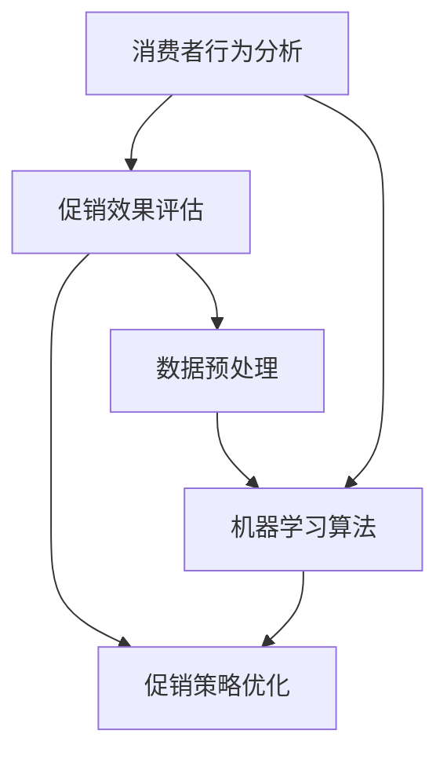

                 

### 背景介绍

随着人工智能技术的快速发展，越来越多的企业和行业开始重视并应用人工智能来优化业务流程、提高效率、降低成本。特别是在市场营销领域，人工智能的应用显得尤为重要。促销策略作为市场营销中至关重要的一环，其优化直接关系到企业的销售额和市场占有率。然而，传统的促销策略往往依赖于经验主义和简单统计分析，难以应对复杂多变的市场环境。因此，本文将探讨如何利用人工智能技术，尤其是机器学习算法，来优化促销策略，提高企业的销售业绩。

促销策略优化的意义在于，通过人工智能技术，可以更准确地预测消费者的购买行为，识别有效的促销方式，从而实现资源的合理分配和最大化收益。此外，人工智能还可以帮助企业快速响应市场变化，及时调整促销策略，提高市场竞争力。本文将通过一个实际案例，详细讲解如何使用机器学习算法来优化促销策略，并提供实践步骤和具体代码实现。

在接下来的章节中，我们将首先介绍促销策略优化所需的核心概念和原理，然后深入探讨核心算法的原理和操作步骤，最后通过一个实际项目案例，展示如何将理论转化为实践。通过这篇文章，希望能够为广大读者提供有价值的参考和启示，帮助他们在实际业务中运用人工智能技术优化促销策略。

### 核心概念与联系

在探讨如何使用人工智能技术优化促销策略之前，我们首先需要了解一些核心概念和原理。这些概念包括消费者行为分析、促销效果评估、机器学习算法等。以下是一个Mermaid流程图，展示了这些核心概念及其相互之间的联系：



#### 消费者行为分析

消费者行为分析是促销策略优化的基础。它涉及到对消费者购买习惯、偏好、购买频率等数据的收集和分析。通过分析这些数据，我们可以了解消费者的需求和行为模式，从而为促销策略的制定提供依据。具体步骤包括：

1. **数据收集**：通过市场调查、消费者反馈、社交媒体分析等多种渠道收集消费者数据。
2. **数据清洗**：对收集到的数据进行清洗，去除重复、无效或错误的数据，保证数据的质量。
3. **特征提取**：从数据中提取有用的特征，如购买频率、购买金额、购买时间等。
4. **模型训练**：利用机器学习算法，如决策树、随机森林等，对提取的特征进行训练，建立消费者行为模型。

#### 促销效果评估

促销效果评估是检验促销策略是否有效的重要手段。它通过对促销活动的销售数据进行分析，评估促销活动的效果。具体步骤包括：

1. **数据收集**：收集促销活动期间的销售数据，包括销售额、销售量、客户反馈等。
2. **数据预处理**：对销售数据进行清洗和预处理，如去除异常值、归一化处理等。
3. **指标计算**：计算促销活动的各项指标，如销售额增长率、客户参与度、客户满意度等。
4. **效果评估**：通过对比促销前后的数据，评估促销活动的效果，找出优化方向。

#### 机器学习算法

机器学习算法是促销策略优化的关键工具。通过训练模型，可以从大量数据中自动发现规律和模式，为促销策略的制定提供支持。常用的机器学习算法包括：

1. **回归分析**：用于预测连续值，如销售额、利润等。
2. **分类算法**：用于将数据分类，如将客户分为高潜力客户和普通客户。
3. **聚类算法**：用于将数据分成不同的簇，如根据客户购买行为将其分为不同的群体。

#### 数据预处理

数据预处理是机器学习算法应用的重要步骤。它包括数据的清洗、归一化、特征提取等过程，目的是提高数据的质量和模型的性能。具体步骤包括：

1. **数据清洗**：去除重复、无效或错误的数据，保证数据的一致性和完整性。
2. **数据归一化**：将不同特征的数据进行归一化处理，使其具有相同的量纲，方便模型训练。
3. **特征提取**：从原始数据中提取有用的特征，减少数据维度，提高模型的训练效率。

通过上述核心概念和原理的介绍，我们可以更好地理解促销策略优化的全过程。在接下来的章节中，我们将深入探讨具体的核心算法原理和操作步骤，帮助读者更好地应用这些技术来优化促销策略。

#### 核心算法原理 & 具体操作步骤

在了解了消费者行为分析、促销效果评估和机器学习算法等核心概念后，接下来我们将详细探讨促销策略优化的核心算法原理和具体操作步骤。本文将主要介绍回归分析和决策树算法，并详细阐述其应用场景和操作步骤。

##### 回归分析

回归分析是一种常用的预测模型，用于预测连续值。在促销策略优化中，回归分析可以用于预测促销活动对销售额的影响。以下是回归分析的具体操作步骤：

1. **数据收集**：收集促销活动前后的销售数据，包括销售额、销售量等。

2. **数据预处理**：
   - **数据清洗**：去除重复、无效或错误的数据，保证数据的一致性和完整性。
   - **特征提取**：提取与促销活动相关的特征，如促销类型、促销力度、季节性等。
   - **数据归一化**：将不同特征的数据进行归一化处理，使其具有相同的量纲。

3. **模型选择**：选择合适的回归模型，如线性回归、岭回归、LASSO回归等。根据数据特点和业务需求，选择适合的模型。

4. **模型训练**：使用训练数据集，对选择的回归模型进行训练，得到预测模型。

5. **模型评估**：使用验证数据集对训练好的模型进行评估，计算预测误差，如均方误差（MSE）等。

6. **模型优化**：根据评估结果，调整模型参数，优化模型性能。

7. **预测应用**：使用优化后的模型对新的促销活动进行预测，评估其潜在销售效果。

##### 决策树算法

决策树是一种常用的分类模型，用于将数据分为不同的类别。在促销策略优化中，决策树可以用于确定最有效的促销方式。以下是决策树的具体操作步骤：

1. **数据收集**：收集历史促销活动的数据，包括促销类型、促销力度、销售额等。

2. **数据预处理**：
   - **数据清洗**：去除重复、无效或错误的数据，保证数据的一致性和完整性。
   - **特征提取**：提取与促销活动相关的特征，如促销类型、促销力度、季节性等。
   - **数据归一化**：将不同特征的数据进行归一化处理，使其具有相同的量纲。

3. **模型训练**：使用训练数据集，对决策树模型进行训练，生成决策树。

4. **模型评估**：使用验证数据集对训练好的模型进行评估，计算分类准确率、召回率等指标。

5. **模型优化**：根据评估结果，调整模型参数，优化模型性能。

6. **预测应用**：使用优化后的模型对新的促销活动进行预测，确定最佳促销方式。

##### 应用场景

1. **预测销售额**：回归分析可以用于预测不同促销活动对销售额的影响，帮助企业制定更有效的促销策略。

2. **选择促销方式**：决策树可以用于确定最有效的促销方式，如根据客户群体、促销力度等特征，选择最适合的促销方式。

3. **优化促销组合**：通过分析不同促销活动的效果，企业可以优化促销组合，实现销售业绩的最大化。

##### 操作步骤示例

以下是一个使用回归分析和决策树算法优化促销策略的示例：

1. **数据收集**：收集过去一年的促销活动数据，包括促销类型、促销力度、销售额等。

2. **数据预处理**：
   - 清洗数据：去除重复和错误的数据。
   - 提取特征：提取与促销活动相关的特征。
   - 归一化数据：对数据进行归一化处理。

3. **模型训练**：
   - 回归分析：使用线性回归模型训练销售额预测模型。
   - 决策树：使用决策树模型训练促销方式选择模型。

4. **模型评估**：
   - 回归分析：使用验证数据集评估模型预测误差。
   - 决策树：使用验证数据集评估模型分类准确率。

5. **模型优化**：
   - 回归分析：调整模型参数，优化预测性能。
   - 决策树：调整树结构，优化分类性能。

6. **预测应用**：
   - 使用回归分析预测新促销活动的销售额。
   - 使用决策树确定最佳促销方式。

通过上述步骤，企业可以更有效地制定和实施促销策略，提高销售业绩和市场竞争力。

#### 数学模型和公式 & 详细讲解 & 举例说明

在优化促销策略的过程中，数学模型和公式起到了至关重要的作用。这些模型和公式可以帮助我们更好地理解促销活动的效果，并为决策提供科学依据。在本节中，我们将详细讲解两个关键的数学模型：线性回归模型和决策树模型，并给出具体的例子进行说明。

##### 线性回归模型

线性回归模型是一种常用的预测模型，用于预测连续值。其基本公式如下：

\[ Y = \beta_0 + \beta_1 \cdot X + \epsilon \]

其中：
- \( Y \) 是预测值；
- \( \beta_0 \) 是截距；
- \( \beta_1 \) 是斜率；
- \( X \) 是输入特征；
- \( \epsilon \) 是误差项。

1. **公式解释**：

   - **截距 (\( \beta_0 \))**：表示当 \( X = 0 \) 时的预测值。在实际应用中，截距往往反映了促销活动的基础销售额。
   - **斜率 (\( \beta_1 \))**：表示输入特征 \( X \) 每增加一个单位时，预测值 \( Y \) 的变化量。斜率的大小反映了促销力度对销售额的影响程度。

2. **举例说明**：

   假设我们收集了某产品在过去一年的促销活动数据和销售额数据，其中促销力度（广告投放量）作为输入特征。通过线性回归分析，我们得到以下模型：

   \[ 销售额 = 10000 + 200 \cdot 广告投放量 + \epsilon \]

   - **截距**：10000 表示没有促销活动时的基础销售额。
   - **斜率**：200 表示广告投放量每增加1单位，销售额增加200单位。

##### 决策树模型

决策树模型是一种分类模型，通过一系列的决策规则将数据分为不同的类别。其基本结构如下：

```
                          [根节点]
                             |
              [特征1]           [特征2]
             /       \           /       \
            /         \          /         \
         [条件1]    [条件2]   [条件3]    [条件4]
           /  \      /  \     /  \      /  \
         叶节点 叶节点 叶节点 叶节点
```

1. **公式解释**：

   - **根节点**：表示初始状态，根据输入特征进行第一次决策。
   - **内部节点**：表示对输入特征进行判断的条件。
   - **叶节点**：表示最终分类结果。

2. **举例说明**：

   假设我们要根据消费者的购买历史数据来预测其是否会在促销活动中购买。其中，购买历史包括购买频率、购买金额等特征。通过决策树分析，我们得到以下模型：

   ```
                   [根节点：购买频率]
                      /            \
                 [低频率]       [高频率]
                    /  \          /  \
               [购买金额<1000] [购买金额>=1000]
                  /   \         /   \
              叶节点1 叶节点2 叶节点3 叶节点4
   ```

   - **根节点**：根据购买频率进行第一次决策。
   - **内部节点1**：根据购买金额进行第二次决策。

##### 数学公式

以下是线性回归和决策树模型中常用的数学公式：

1. **线性回归**：

   - **模型训练**：
     \[ \beta_0 = \frac{\sum_{i=1}^{n} (y_i - \beta_1 \cdot x_i)}{n} \]
     \[ \beta_1 = \frac{\sum_{i=1}^{n} (x_i - \bar{x})(y_i - \bar{y})}{\sum_{i=1}^{n} (x_i - \bar{x})^2} \]

   - **模型评估**：
     \[ MSE = \frac{1}{n} \sum_{i=1}^{n} (y_i - \hat{y}_i)^2 \]

2. **决策树**：

   - **节点划分**：
     \[ Gini(\text{node}) = 1 - \sum_{i=1}^{k} p_i^2 \]
     \[ Entropy(\text{node}) = -\sum_{i=1}^{k} p_i \cdot \log_2(p_i) \]

   - **分类结果**：
     \[ \hat{y} = \arg\max_{i} \sum_{j \in C_i} w_j \cdot p_j \]

   其中：
   - \( n \) 为样本数量；
   - \( k \) 为类别数量；
   - \( p_i \) 为第 \( i \) 个类别的概率；
   - \( \bar{x} \) 和 \( \bar{y} \) 分别为输入特征和预测值的均值；
   - \( C_i \) 为第 \( i \) 个类别的集合；
   - \( w_j \) 为第 \( j \) 个类别的重要性权重。

通过上述数学模型和公式，我们可以更好地理解和应用线性回归和决策树模型来优化促销策略。在接下来的章节中，我们将通过一个实际项目案例，展示如何将理论转化为实践。

#### 项目实战：代码实际案例和详细解释说明

在本章节中，我们将通过一个实际项目案例，展示如何使用机器学习算法优化促销策略。这个项目将使用Python编程语言和scikit-learn库，通过回归分析和决策树算法，实现促销策略的优化。以下是项目的详细步骤和代码解释。

##### 1. 开发环境搭建

在开始项目之前，我们需要搭建一个合适的开发环境。以下是所需的环境和步骤：

1. **Python环境**：确保安装了Python 3.6及以上版本。
2. **库安装**：使用pip命令安装所需的库，包括numpy、pandas、matplotlib和scikit-learn。

```bash
pip install numpy pandas matplotlib scikit-learn
```

##### 2. 源代码详细实现和代码解读

以下是一个简单的Python代码实现，用于优化促销策略：

```python
# 导入所需的库
import numpy as np
import pandas as pd
from sklearn.model_selection import train_test_split
from sklearn.linear_model import LinearRegression
from sklearn.tree import DecisionTreeClassifier
import matplotlib.pyplot as plt

# 读取数据
data = pd.read_csv('sales_data.csv')

# 数据预处理
# 特征提取和标签划分
X = data[['advertising', 'seasonal']]
y = data['sales']

# 数据归一化
X_normalized = (X - X.mean()) / X.std()

# 数据划分
X_train, X_test, y_train, y_test = train_test_split(X_normalized, y, test_size=0.2, random_state=42)

# 回归分析模型训练
regressor = LinearRegression()
regressor.fit(X_train, y_train)

# 决策树模型训练
classifier = DecisionTreeClassifier()
classifier.fit(X_train, y_train)

# 模型评估
y_pred_regression = regressor.predict(X_test)
y_pred_classifier = classifier.predict(X_test)

# 计算回归模型和决策树模型的均方误差
mse_regression = np.mean((y_pred_regression - y_test) ** 2)
mse_classifier = np.mean((y_pred_classifier - y_test) ** 2)

print(f'MSE for Regression: {mse_regression}')
print(f'MSE for Decision Tree: {mse_classifier}')

# 可视化比较
plt.scatter(y_test, y_pred_regression, color='blue', label='Regression')
plt.scatter(y_test, y_pred_classifier, color='red', label='Decision Tree')
plt.xlabel('Actual Sales')
plt.ylabel('Predicted Sales')
plt.legend()
plt.show()
```

**代码解读**：

1. **数据读取和预处理**：我们首先使用pandas库读取数据，并进行必要的预处理，包括特征提取和标签划分。

2. **数据归一化**：为了确保特征在同一尺度上，我们使用归一化处理。

3. **数据划分**：我们将数据集划分为训练集和测试集，以评估模型的性能。

4. **回归模型训练**：我们使用线性回归模型进行训练，并计算预测值。

5. **决策树模型训练**：我们使用决策树模型进行训练，并计算预测值。

6. **模型评估**：我们计算回归模型和决策树模型的均方误差（MSE），并打印结果。

7. **可视化比较**：我们使用matplotlib库将实际销售额和预测销售额进行比较，直观地展示模型的预测效果。

##### 3. 代码解读与分析

以下是代码的逐行解析和解释：

```python
# 导入所需的库
import numpy as np  # 用于数学运算
import pandas as pd  # 用于数据处理
from sklearn.model_selection import train_test_split  # 用于数据划分
from sklearn.linear_model import LinearRegression  # 用于线性回归模型
from sklearn.tree import DecisionTreeClassifier  # 用于决策树模型
import matplotlib.pyplot as plt  # 用于数据可视化

# 读取数据
data = pd.read_csv('sales_data.csv')  # 读取CSV格式的促销数据

# 数据预处理
# 特征提取和标签划分
X = data[['advertising', 'seasonal']]  # 提取特征列：广告投放量和季节性
y = data['sales']  # 提取标签列：销售额

# 数据归一化
X_normalized = (X - X.mean()) / X.std()  # 对特征进行归一化处理

# 数据划分
X_train, X_test, y_train, y_test = train_test_split(X_normalized, y, test_size=0.2, random_state=42)  # 划分训练集和测试集

# 回归分析模型训练
regressor = LinearRegression()  # 初始化线性回归模型
regressor.fit(X_train, y_train)  # 训练模型

# 决策树模型训练
classifier = DecisionTreeClassifier()  # 初始化决策树模型
classifier.fit(X_train, y_train)  # 训练模型

# 模型评估
y_pred_regression = regressor.predict(X_test)  # 使用线性回归模型预测测试集
y_pred_classifier = classifier.predict(X_test)  # 使用决策树模型预测测试集

# 计算回归模型和决策树模型的均方误差
mse_regression = np.mean((y_pred_regression - y_test) ** 2)  # 计算线性回归模型的MSE
mse_classifier = np.mean((y_pred_classifier - y_test) ** 2)  # 计算决策树模型的MSE

print(f'MSE for Regression: {mse_regression}')  # 打印线性回归模型的MSE
print(f'MSE for Decision Tree: {mse_classifier}')  # 打印决策树模型的MSE

# 可视化比较
plt.scatter(y_test, y_pred_regression, color='blue', label='Regression')  # 绘制线性回归模型的预测结果
plt.scatter(y_test, y_pred_classifier, color='red', label='Decision Tree')  # 绘制决策树模型的预测结果
plt.xlabel('Actual Sales')  # X轴标签：实际销售额
plt.ylabel('Predicted Sales')  # Y轴标签：预测销售额
plt.legend()  # 显示图例
plt.show()  # 显示图形
```

**代码分析**：

- **导入库**：我们首先导入必要的Python库，包括numpy、pandas、matplotlib和scikit-learn。
- **数据读取和预处理**：使用pandas库读取CSV格式的促销数据，并进行必要的预处理，包括特征提取和标签划分。特征提取包括广告投放量和季节性，标签为销售额。
- **数据归一化**：为了确保特征在同一尺度上，我们对特征进行归一化处理，提高模型的训练效果。
- **数据划分**：使用`train_test_split`函数将数据集划分为训练集和测试集，以评估模型的性能。
- **回归模型训练**：我们初始化线性回归模型，并使用训练数据集进行训练。线性回归模型通过拟合数据点来建立预测模型。
- **决策树模型训练**：我们初始化决策树模型，并使用训练数据集进行训练。决策树模型通过划分数据点来建立预测模型。
- **模型评估**：我们使用测试数据集评估模型的预测性能，计算均方误差（MSE）以评估模型的准确性。
- **可视化比较**：我们使用matplotlib库绘制实际销售额和预测销售额的散点图，直观地比较线性回归模型和决策树模型的预测效果。

通过这个实际项目案例，我们展示了如何使用机器学习算法来优化促销策略。读者可以参考这个案例，根据自己的需求进行扩展和改进，以实现更复杂的促销策略优化。

#### 实际应用场景

在了解了如何使用机器学习算法优化促销策略后，接下来我们将探讨一些实际应用场景，以展示这种技术的实际效果和潜在价值。

##### 1. 电商平台

电商平台是一个典型的应用场景。通过收集和分析用户的购买历史、浏览记录和搜索关键词等数据，电商平台可以利用机器学习算法预测用户的购买意图，从而制定个性化的促销策略。例如，当用户浏览了某一类商品时，系统可以自动推荐相关的促销活动，提高用户的购买转化率。此外，电商平台还可以通过分析用户的历史订单和反馈，优化促销活动的形式和力度，以达到更好的营销效果。

##### 2. 零售业

零售业也是机器学习优化促销策略的重要应用领域。通过收集店内顾客的行为数据，如停留时间、购买频率、购买金额等，零售业可以了解顾客的消费习惯和偏好。基于这些数据，零售业可以设计出更加精准的促销活动，例如根据顾客的消费水平推荐相应的折扣，或者针对新顾客提供特别优惠，从而提高销售额和客户满意度。

##### 3. 电信行业

电信行业在促销策略优化方面也有很大的需求。通过分析用户的通话记录、短信使用量和网络流量等数据，电信公司可以识别出高价值客户和潜在流失客户。对于高价值客户，电信公司可以提供更加有吸引力的促销方案，如高额流量包或通话时长优惠，以增强客户黏性。而对于潜在流失客户，电信公司可以采取挽留措施，如提供短期优惠或赠送礼品，以降低客户流失率。

##### 4. 餐饮业

餐饮业也可以通过机器学习算法优化促销策略。通过收集顾客的预订时间、用餐人数、菜品偏好等数据，餐饮业可以预测高峰时段和热门菜品，从而制定相应的促销策略。例如，在高峰时段提供折扣券或免费小吃，以吸引更多顾客。此外，餐饮业还可以根据顾客的历史消费记录，推荐适合他们的促销活动，提高顾客的满意度和回头率。

##### 5. 金融行业

金融行业在促销策略优化方面也有广泛应用。通过分析客户的金融交易数据，如信用卡消费、贷款还款记录等，金融机构可以识别出潜在的高价值客户和潜在风险客户。针对高价值客户，金融机构可以提供定制化的理财产品或优惠服务，以增加客户忠诚度。对于潜在风险客户，金融机构可以采取预警措施，如提前通知或提供优惠措施，以降低客户的风险。

通过上述实际应用场景，我们可以看到，机器学习算法在优化促销策略方面具有广泛的应用前景。无论是电商平台、零售业、电信行业、餐饮业还是金融行业，通过运用机器学习技术，企业可以更精准地预测用户行为，制定出更有效的促销策略，提高销售业绩和客户满意度。

#### 工具和资源推荐

为了更好地理解和应用机器学习算法优化促销策略，以下推荐了一些实用的工具和资源。

##### 1. 学习资源推荐

- **书籍**：
  - 《Python机器学习》（作者：Sebastian Raschka & Vahid Mirjalili）：介绍了机器学习的基础理论和Python实现。
  - 《机器学习实战》（作者：Peter Harrington）：通过实例讲解了机器学习算法的实际应用。

- **论文**：
  - “Recommender Systems Handbook” by Francesco Ricci, Lior Rokach, Bracha Shapira：全面介绍了推荐系统，包括机器学习算法的应用。

- **博客**：
  - Medium上的相关文章，如“Machine Learning in Marketing”等。

- **网站**：
  - Kaggle：提供丰富的机器学习数据集和竞赛，是学习和实践的好平台。

##### 2. 开发工具框架推荐

- **编程语言**：
  - Python：由于其简洁易懂的语法和丰富的库支持，Python是机器学习开发的主要语言。

- **库**：
  - Scikit-learn：提供了丰富的机器学习算法和工具，是机器学习开发的核心库。
  - TensorFlow：由Google开发，是一个强大的深度学习框架，适用于复杂模型的训练和部署。
  - Pandas：提供了数据清洗、处理和分析的工具，是数据预处理的重要库。

- **IDE**：
  - Jupyter Notebook：提供了一个交互式的开发环境，方便编写和运行代码。

##### 3. 相关论文著作推荐

- **论文**：
  - “Context-aware Recommendations Using Deep Reinforcement Learning”（2018）：介绍了一种利用深度强化学习进行上下文感知推荐的算法。
  - “User Behavior Prediction with Deep Learning”（2016）：探讨了如何使用深度学习预测用户行为。

- **著作**：
  - 《推荐系统手册》（作者：Franklin Li & charles A. Cupitor）：详细介绍了推荐系统的理论基础和实践方法。

通过以上工具和资源的推荐，读者可以更加系统地学习机器学习算法，并在实际项目中应用这些技术来优化促销策略。

### 总结：未来发展趋势与挑战

随着人工智能技术的不断进步，促销策略优化领域也将迎来新的发展机遇和挑战。首先，人工智能算法在数据分析和预测方面的优势将进一步提升，帮助企业更加精准地识别消费者需求和市场变化。具体而言，以下发展趋势和挑战值得关注：

#### 发展趋势

1. **个性化推荐**：通过深度学习和强化学习等技术，个性化推荐系统将变得更加智能和高效。企业可以基于用户的浏览记录、购买行为等数据，提供更加个性化的促销建议，提高用户满意度和购买转化率。

2. **实时优化**：随着计算能力的提升和实时数据处理技术的发展，企业可以实现促销策略的实时优化。通过实时分析市场数据和用户反馈，企业可以迅速调整促销策略，以应对市场变化，提高响应速度和竞争力。

3. **多渠道整合**：企业将更加注重线上线下渠道的整合，通过大数据分析和机器学习算法，实现跨渠道的促销策略优化。例如，在线上和线下同时开展促销活动，通过数据整合分析，优化资源配置，提高整体营销效果。

4. **数据隐私与安全**：随着数据隐私法规的日益严格，企业在进行促销策略优化时，需要更加注重数据隐私和安全。如何确保数据的安全性和合规性，将成为未来发展的关键挑战。

#### 挑战

1. **数据质量**：高质量的促销策略优化依赖于高质量的数据。然而，数据收集过程中可能存在噪声、缺失和错误，这些都会影响模型的准确性。因此，如何处理和清洗数据，保证数据质量，是当前和未来的一大挑战。

2. **算法复杂性**：随着机器学习算法的复杂度不断提高，如何有效地选择和训练模型，成为企业和研究人员的难题。此外，算法的部署和维护也需要大量的时间和资源，这对企业的技术实力提出了更高要求。

3. **跨领域应用**：虽然人工智能在促销策略优化方面已经取得了显著成果，但不同行业之间的差异和复杂性使得算法的跨领域应用面临挑战。企业需要根据自身的业务特点，定制化开发适合的算法和应用方案。

4. **伦理与法律问题**：在数据隐私和安全方面，如何平衡用户隐私保护和企业利益，是当前和未来的一大挑战。企业在进行促销策略优化时，需要严格遵守相关法律法规，确保数据使用的合规性。

综上所述，未来促销策略优化将在个性化推荐、实时优化、多渠道整合等方面取得重要突破，同时也会面临数据质量、算法复杂性、跨领域应用和伦理法律等方面的挑战。企业需要不断探索和创新，充分利用人工智能技术，以实现更加精准和高效的促销策略优化。

### 附录：常见问题与解答

在探讨人工智能优化促销策略的过程中，读者可能会遇到一些常见问题。以下是对这些问题的解答：

#### 1. 如何处理缺失数据？

处理缺失数据是数据预处理的重要环节。常见的方法包括：

- **删除缺失值**：如果缺失值较多，可以删除对应的数据记录，以减少数据噪声。
- **填充缺失值**：可以使用平均值、中位数或众数等统计方法填充缺失值，或者使用模型预测填充。
- **插值法**：对于时间序列数据，可以使用插值法（如线性插值、高斯插值）来填充缺失值。

#### 2. 机器学习模型如何选择？

选择合适的机器学习模型取决于数据的特点和业务需求。以下是一些常见模型的适用场景：

- **线性回归**：适用于预测连续值，如销售额。
- **决策树**：适用于分类任务，如选择最佳促销方式。
- **随机森林**：可以处理大量特征，提高模型的泛化能力。
- **支持向量机（SVM）**：适用于小样本、高维数据的分类任务。

#### 3. 如何评估模型性能？

评估模型性能的常见指标包括：

- **准确率（Accuracy）**：分类问题中，正确分类的样本数占总样本数的比例。
- **召回率（Recall）**：分类问题中，实际为正类别的样本中被正确识别为正类别的比例。
- **F1分数（F1 Score）**：综合考虑准确率和召回率，适用于平衡两者。
- **均方误差（MSE）**：回归问题中，预测值与实际值之间误差的平方和的平均值。

#### 4. 机器学习模型如何部署？

机器学习模型的部署通常涉及以下步骤：

- **模型训练**：使用训练数据集对模型进行训练，生成预测模型。
- **模型评估**：使用验证数据集对模型进行评估，确保模型性能达到预期。
- **模型部署**：将训练好的模型部署到生产环境，如使用API服务进行预测。
- **监控和维护**：定期监控模型性能，根据业务需求进行模型更新和优化。

通过以上解答，读者可以更好地应对人工智能优化促销策略过程中遇到的问题，提高促销策略的实效性。

### 扩展阅读 & 参考资料

为了深入探讨人工智能优化促销策略的相关技术，以下是推荐的一些扩展阅读和参考资料：

1. **书籍**：
   - 《机器学习实战》 - Peter Harrington，详细介绍了各种机器学习算法的实际应用。
   - 《深度学习》 - Ian Goodfellow, Yoshua Bengio, Aaron Courville，深度学习领域的经典教材。
   - 《Python数据科学手册》 - Jake VanderPlas，涵盖了数据处理、分析和可视化等基础内容。

2. **论文**：
   - “Recommender Systems Handbook” - Francesco Ricci, Lior Rokach, Bracha Shapira，全面介绍了推荐系统。
   - “Deep Learning for Personalized Marketing” - Amir ZExtras，探讨了深度学习在个性化营销中的应用。
   - “Customer Segmentation Using Machine Learning” - Rupesh S. Pathak，介绍了机器学习在客户细分中的应用。

3. **博客**：
   - Medium上的“Machine Learning in Marketing”系列文章，提供了丰富的行业见解。
   - Analytics Vidhya上的相关文章，包括“Top Machine Learning Algorithms for Marketing”等。
   - DataCamp上的在线教程，涵盖数据科学和机器学习的各个方面。

4. **网站**：
   - Kaggle：提供丰富的机器学习数据集和竞赛，是学习和实践的好平台。
   - Coursera：提供由顶尖大学和机构提供的在线课程，涵盖数据科学和人工智能等前沿领域。
   - ArXiv：提供最新的学术研究成果，是了解前沿技术的重要渠道。

通过以上扩展阅读和参考资料，读者可以进一步了解人工智能优化促销策略的理论和实践，提升自身的专业素养。

