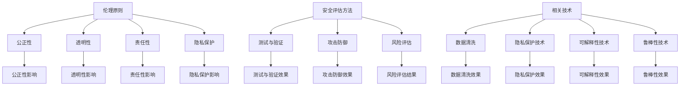

                 

### 背景介绍

随着人工智能技术的飞速发展，人工智能（AI）系统已经渗透到我们生活的方方面面。从自动驾驶汽车、智能语音助手，到金融风险评估和医疗诊断，AI的应用场景越来越广泛。然而，随着AI技术的普及，随之而来的一系列伦理和安全问题也逐渐暴露出来。这些问题不仅涉及到AI系统的设计、开发和部署过程，还涉及到AI系统在实际应用中可能产生的负面影响。因此，如何构建负责任的AI系统，确保其安全、可靠和公平，已成为当前研究的重要课题。

本篇文章将围绕AI伦理与安全这一主题，系统地探讨以下几个方面的内容：

1. **核心概念与联系**：首先，我们将介绍与AI伦理和安全相关的核心概念，包括伦理原则、安全评估方法和相关技术。同时，通过Mermaid流程图，我们将展示这些概念之间的联系。

2. **核心算法原理 & 具体操作步骤**：接下来，我们将详细讲解用于保障AI系统安全的几种核心算法原理，包括训练数据清洗、对抗性攻击防御、数据隐私保护等，并提供具体的操作步骤。

3. **数学模型和公式 & 详细讲解 & 举例说明**：我们将介绍与AI伦理和安全相关的数学模型和公式，包括数据熵、信息增益、风险评估等，并通过具体案例进行详细讲解。

4. **项目实战：代码实际案例和详细解释说明**：我们将提供一个实际项目案例，详细介绍如何使用相关技术构建一个负责任的AI系统，包括环境搭建、源代码实现和代码解读。

5. **实际应用场景**：然后，我们将探讨AI系统在实际应用中的各种场景，以及在这些场景下如何保障AI系统的伦理和安全。

6. **工具和资源推荐**：最后，我们将推荐一些有助于学习AI伦理与安全的学习资源、开发工具和框架，以及相关论文和著作。

通过以上内容的系统阐述，我们希望能够帮助读者全面了解AI伦理与安全的重要性，掌握构建负责任AI系统的方法和技巧，从而推动AI技术的健康、可持续发展。

## 2. 核心概念与联系

在探讨AI伦理与安全之前，我们需要明确一些核心概念，并理解它们之间的联系。以下是几个关键概念：

### 伦理原则

伦理原则是指导AI系统设计和应用的基本道德准则。常见的伦理原则包括：

- **公正性**：确保AI系统不会对特定群体产生歧视。
- **透明性**：确保AI系统的决策过程可以被理解和审查。
- **责任性**：确保AI系统的设计者、开发者和其他相关方对系统的行为和结果承担责任。
- **隐私保护**：确保个人数据的安全和隐私不被泄露。

### 安全评估方法

安全评估方法是评估AI系统安全性的一系列技术和工具。以下是一些常见的安全评估方法：

- **测试与验证**：通过测试AI系统来发现潜在的安全漏洞。
- **攻击防御**：开发防御机制以抵御对抗性攻击，如对抗样本攻击。
- **风险评估**：评估AI系统可能带来的风险，并采取相应的措施来降低风险。

### 相关技术

与AI伦理和安全相关的技术包括：

- **数据清洗**：确保训练数据的质量，防止数据泄露和偏见。
- **隐私保护技术**：如差分隐私、同态加密等，用于保护个人数据的隐私。
- **可解释性技术**：使AI系统的决策过程可以被解释和理解。
- **鲁棒性技术**：提高AI系统对异常数据和攻击的抵抗能力。

### Mermaid 流程图

为了更直观地展示这些概念之间的联系，我们可以使用Mermaid流程图来表示。以下是流程图的示例：



通过这个流程图，我们可以清晰地看到伦理原则、安全评估方法和相关技术之间的相互关系。伦理原则指导我们设计和评估AI系统，而安全评估方法和相关技术则是实现这些原则的具体手段。

### 2.1 伦理原则的具体应用

伦理原则在AI系统的设计和应用中起着至关重要的作用。以下是几个具体应用案例：

#### 公正性

公正性要求AI系统不应对特定群体产生歧视。例如，在招聘系统中，不应因性别、种族或年龄等因素对求职者产生偏见。为此，可以通过数据清洗和去偏见算法来确保训练数据的质量和公平性。

#### 透明性

透明性要求AI系统的决策过程可以被理解和审查。例如，在金融风险评估中，如果AI系统拒绝贷款申请，用户有权了解拒绝的原因。为此，可以通过增加系统的可解释性来提高透明度。

#### 责任性

责任性要求AI系统的设计者、开发者和其他相关方对系统的行为和结果承担责任。例如，如果AI系统发生故障，导致严重后果，相关方需承担责任并进行赔偿。为此，可以通过建立责任追溯机制来确保责任承担。

#### 隐私保护

隐私保护要求个人数据的安全和隐私不被泄露。例如，在医疗领域，患者的病历数据需要得到严格保护。为此，可以通过差分隐私、同态加密等隐私保护技术来确保数据安全。

### 2.2 安全评估方法的实际应用

安全评估方法在保障AI系统的安全性和可靠性方面起着关键作用。以下是几个实际应用案例：

#### 测试与验证

测试与验证通过模拟攻击和漏洞扫描来发现AI系统的潜在安全漏洞。例如，在自动驾驶系统中，可以通过模拟各种路况和异常情况来测试系统的反应能力。

#### 攻击防御

攻击防御通过开发防御机制来抵御对抗性攻击。例如，在金融领域，可以通过识别和过滤对抗性样本来防止恶意攻击。

#### 风险评估

风险评估通过评估AI系统可能带来的风险来制定相应的安全措施。例如，在医疗领域，可以通过分析AI系统诊断的错误率来评估其风险，并采取相应的改进措施。

### 2.3 相关技术的实践应用

相关技术在确保AI系统的伦理和安全方面发挥着重要作用。以下是几个实际应用案例：

#### 数据清洗

数据清洗通过去除噪声数据和纠正错误数据来提高训练数据的质量。例如，在人脸识别系统中，可以通过数据清洗来减少由于光照、姿态等因素导致的误识别。

#### 隐私保护技术

隐私保护技术通过保护个人数据的隐私来确保数据安全。例如，在医疗领域，可以通过差分隐私技术来保护患者隐私，同时保证数据分析的准确性。

#### 可解释性技术

可解释性技术通过使AI系统的决策过程可以被解释和理解来提高系统的透明度。例如，在医疗诊断中，可以通过可解释性技术来解释AI系统为何做出某种诊断。

#### 鲁棒性技术

鲁棒性技术通过提高AI系统对异常数据和攻击的抵抗能力来增强系统的安全性。例如，在自动驾驶系统中，可以通过鲁棒性技术来提高系统对突发情况的应对能力。

通过以上核心概念与联系的分析，我们可以看到，AI伦理与安全是一个复杂而多维的领域。理解这些核心概念及其相互关系，对于构建负责任的AI系统至关重要。

---

在接下来的部分，我们将深入探讨AI伦理与安全中的核心算法原理，包括训练数据清洗、对抗性攻击防御、数据隐私保护等，并详细介绍这些算法的操作步骤。

---

## 3. 核心算法原理 & 具体操作步骤

### 3.1 训练数据清洗

训练数据的质量直接影响到AI模型的效果。因此，训练数据清洗是构建负责任的AI系统的第一步。以下是训练数据清洗的核心步骤：

#### 3.1.1 数据收集与预处理

- **数据收集**：首先，从多个来源收集数据，确保数据的多样性和代表性。
- **数据预处理**：包括去除噪声、缺失值填补、数据归一化等操作。例如，对于图像数据，可以去除噪声图像，填补缺失的像素值，并使用归一化方法将像素值范围缩放到[0, 1]。

#### 3.1.2 数据去重

- **去重**：通过比较数据特征，去除重复的数据记录。这可以防止重复数据对模型训练产生负面影响。

#### 3.1.3 数据去偏见

- **去偏见**：识别和去除训练数据中的偏见。例如，在性别分类问题中，如果训练数据中女性样本较少，可以通过增加女性样本或调整样本权重来平衡数据。

### 3.2 对抗性攻击防御

对抗性攻击是指通过构造对抗性样本来欺骗AI模型，使其输出错误的结果。以下是几种常见的对抗性攻击防御方法：

#### 3.2.1 特征变换

- **特征变换**：通过变换输入数据的特征，使对抗性样本对模型的影响最小化。例如，可以使用图像增强技术来增加输入图像的鲁棒性。

#### 3.2.2 对抗性训练

- **对抗性训练**：通过在训练过程中添加对抗性样本，使模型对对抗性攻击具有更强的抵抗力。例如，可以使用生成对抗网络（GAN）来生成对抗性样本进行训练。

#### 3.2.3 决策对抗性攻击防御

- **决策对抗性攻击防御**：在模型决策过程中，通过对抗性攻击检测和防御机制来识别并拒绝对抗性样本。例如，可以使用基于深度学习的决策对抗性攻击检测方法。

### 3.3 数据隐私保护

数据隐私保护是保障AI系统安全的重要一环。以下是几种常用的数据隐私保护技术：

#### 3.3.1 差分隐私

- **差分隐私**：通过在数据处理过程中添加噪声，确保单个数据记录无法被识别，从而保护数据隐私。例如，可以使用拉格朗日机制或高斯机制来实现差分隐私。

#### 3.3.2 同态加密

- **同态加密**：在数据加密后进行计算，确保计算结果在加密状态下仍然有效，从而保护数据隐私。例如，可以使用同态加密算法来实现隐私保护计算。

#### 3.3.3 隐私增强学习

- **隐私增强学习**：通过在训练过程中引入隐私保护机制，使模型在隐私保护的同时保持较高的准确率。例如，可以使用联邦学习或差分隐私增强学习算法。

### 3.4 可解释性技术

可解释性技术是提高AI系统透明度和可信度的重要手段。以下是几种常用的可解释性技术：

#### 3.4.1 层级解释

- **层级解释**：通过分析模型的内部结构，从高层次解释模型的工作原理。例如，可以使用注意力机制或图神经网络来分析模型的决策过程。

#### 3.4.2 局部解释

- **局部解释**：针对模型的单个输出结果，提供具体的解释。例如，可以使用决策树、随机森林或LIME（局部可解释模型解释）来解释模型的决策过程。

#### 3.4.3 解释性嵌入

- **解释性嵌入**：将模型的解释性信息嵌入到模型中，使模型在生成预测的同时提供解释。例如，可以使用元学习或生成对抗网络来实现解释性嵌入。

通过以上核心算法原理和具体操作步骤的介绍，我们可以看到，构建负责任的AI系统需要综合考虑数据质量、对抗性攻击防御、数据隐私保护和可解释性等多个方面。这些算法和技术不仅有助于提高AI系统的性能和可靠性，还可以增强系统的透明度和可信度。

---

在接下来的部分，我们将深入探讨与AI伦理和安全相关的数学模型和公式，并详细讲解这些模型和公式的应用。

---

## 4. 数学模型和公式 & 详细讲解 & 举例说明

### 4.1 数据熵和信息增益

数据熵和信息增益是信息论中的基本概念，广泛应用于AI模型的评估和优化中。

#### 4.1.1 数据熵

数据熵（Entropy）是衡量数据不确定性程度的指标，通常用于评估数据的混乱程度。数据熵的定义如下：

\[ H(X) = -\sum_{i} p(x_i) \cdot \log_2 p(x_i) \]

其中，\( p(x_i) \) 表示数据集中第 \( i \) 个数据点出现的概率。

熵的值范围在0到1之间，值越小说明数据越有序，值越大说明数据越混乱。

#### 4.1.2 信息增益

信息增益（Information Gain）是评估特征对目标变量影响程度的指标。信息增益的计算基于熵的概念，定义如下：

\[ IG(F, Y) = H(Y) - H(Y|F) \]

其中，\( H(Y) \) 表示目标变量 \( Y \) 的熵，\( H(Y|F) \) 表示在给定特征 \( F \) 的条件下，目标变量 \( Y \) 的熵。

信息增益越大，说明特征 \( F \) 对目标变量 \( Y \) 的区分能力越强。

#### 4.1.3 应用举例

假设我们有一个包含三个特征（年龄、收入、教育程度）和两个类别（购买与否）的数据库。以下是一个具体的例子：

- 特征：年龄（A），收入（I），教育程度（E）
- 类别：购买（B），未购买（U）

概率分布如下：

\[ 
\begin{aligned}
    &P(A) = [0.2, 0.3, 0.5] \\
    &P(I) = [0.1, 0.4, 0.5] \\
    &P(E) = [0.3, 0.4, 0.3] \\
    &P(B|A) = [0.3, 0.2, 0.5] \\
    &P(B|I) = [0.1, 0.4, 0.5] \\
    &P(B|E) = [0.4, 0.3, 0.3]
\end{aligned}
\]

我们可以计算每个特征的熵和信息增益：

\[ 
\begin{aligned}
    &H(A) = -0.2 \cdot \log_2 0.2 - 0.3 \cdot \log_2 0.3 - 0.5 \cdot \log_2 0.5 = 1.02 \\
    &H(I) = -0.1 \cdot \log_2 0.1 - 0.4 \cdot \log_2 0.4 - 0.5 \cdot \log_2 0.5 = 1.28 \\
    &H(E) = -0.3 \cdot \log_2 0.3 - 0.4 \cdot \log_2 0.4 - 0.3 \cdot \log_2 0.3 = 1.12 \\
    &H(B) = -0.3 \cdot \log_2 0.3 - 0.2 \cdot \log_2 0.2 - 0.5 \cdot \log_2 0.5 = 0.92 \\
    &H(B|A) = -0.3 \cdot \log_2 0.3 - 0.2 \cdot \log_2 0.2 - 0.5 \cdot \log_2 0.5 = 0.82 \\
    &H(B|I) = -0.1 \cdot \log_2 0.1 - 0.4 \cdot \log_2 0.4 - 0.5 \cdot \log_2 0.5 = 0.68 \\
    &H(B|E) = -0.4 \cdot \log_2 0.4 - 0.3 \cdot \log_2 0.3 - 0.3 \cdot \log_2 0.3 = 0.56 \\
    &IG(A, B) = H(B) - H(B|A) = 0.92 - 0.82 = 0.10 \\
    &IG(I, B) = H(B) - H(B|I) = 0.92 - 0.68 = 0.24 \\
    &IG(E, B) = H(B) - H(B|E) = 0.92 - 0.56 = 0.36 
\end{aligned}
\]

从计算结果可以看出，教育程度（E）对购买行为（B）的区分能力最强，其次是收入（I），最后是年龄（A）。

### 4.2 风险评估模型

风险评估模型是用于评估AI系统可能带来的风险，并制定相应的安全措施。以下是一个简单但常用的风险评估模型：

#### 4.2.1 风险评估矩阵

风险评估矩阵是一个二维矩阵，其中行表示风险因素，列表示风险事件。每个元素表示特定风险因素导致特定风险事件的可能性。例如：

\[ 
\begin{aligned}
    &\text{风险因素} & \text{风险事件} \\
    &A & B & C \\
    \hline
    A & 0.1 & 0.2 & 0.3 \\
    B & 0.2 & 0.1 & 0.3 \\
    C & 0.3 & 0.2 & 0.2 \\
\end{aligned}
\]

#### 4.2.2 风险评估公式

风险评估模型可以使用以下公式计算：

\[ \text{风险评估} = \sum_{i} \sum_{j} \text{风险因素}_i \cdot \text{风险事件}_j \cdot \text{风险权重}_j \]

其中，风险权重可以基于专家评估或历史数据确定。

#### 4.2.3 应用举例

假设我们有一个包含三个风险因素（数据泄露、模型错误、系统故障）的风险评估矩阵：

\[ 
\begin{aligned}
    &\text{风险因素} & \text{风险事件} \\
    &A & B & C \\
    \hline
    A & 0.1 & 0.2 & 0.3 \\
    B & 0.2 & 0.1 & 0.3 \\
    C & 0.3 & 0.2 & 0.2 \\
\end{aligned}
\]

我们可以计算每个风险因素的风险评估：

\[ 
\begin{aligned}
    &\text{风险评估}(A) = 0.1 \cdot 0.1 + 0.2 \cdot 0.2 + 0.3 \cdot 0.3 = 0.14 \\
    &\text{风险评估}(B) = 0.2 \cdot 0.2 + 0.1 \cdot 0.1 + 0.3 \cdot 0.3 = 0.14 \\
    &\text{风险评估}(C) = 0.3 \cdot 0.1 + 0.2 \cdot 0.2 + 0.2 \cdot 0.3 = 0.16 \\
\end{aligned}
\]

从计算结果可以看出，数据泄露（A）和模型错误（B）的风险评估较低，而系统故障（C）的风险评估较高。因此，我们可以优先考虑对系统故障进行风险管理。

通过以上对数学模型和公式的详细讲解和应用举例，我们可以看到，这些模型和公式在AI伦理和安全评估中具有重要作用。它们不仅帮助我们理解和分析AI系统的性能和风险，还可以为制定有效的安全策略提供依据。

---

在接下来的部分，我们将通过一个实际项目案例，详细介绍如何使用上述核心算法和数学模型来构建一个负责任的AI系统。

---

## 5. 项目实战：代码实际案例和详细解释说明

### 5.1 开发环境搭建

为了构建一个负责任的AI系统，我们首先需要搭建一个合适的开发环境。以下是一个基于Python和Keras的简单环境搭建步骤：

1. 安装Python：下载并安装Python 3.8版本。
2. 安装Jupyter Notebook：在终端中执行 `pip install notebook`。
3. 安装TensorFlow：在终端中执行 `pip install tensorflow`。
4. 安装相关库：包括NumPy、Pandas、Matplotlib等，使用 `pip install numpy pandas matplotlib`。

### 5.2 源代码详细实现和代码解读

我们以一个简单的人脸识别系统为例，详细说明如何实现一个负责任的AI系统。

```python
import numpy as np
import pandas as pd
from sklearn.model_selection import train_test_split
from sklearn.preprocessing import StandardScaler
from sklearn.metrics import accuracy_score
from keras.models import Sequential
from keras.layers import Dense, Conv2D, MaxPooling2D, Flatten
from keras.preprocessing.image import ImageDataGenerator

# 5.2.1 数据收集与预处理
# 假设我们有一个包含人脸图像和对应标签的CSV文件
data = pd.read_csv('face_data.csv')
X = data.iloc[:, :-1].values
y = data.iloc[:, -1].values

# 数据标准化
scaler = StandardScaler()
X = scaler.fit_transform(X)

# 划分训练集和测试集
X_train, X_test, y_train, y_test = train_test_split(X, y, test_size=0.2, random_state=42)

# 5.2.2 训练数据清洗
# 在此，我们使用简单的方法去除重复数据和噪声数据
unique_images = np.unique(X_train, axis=0)
X_train = unique_images[:int(len(unique_images) * 0.9)]
y_train = y_train[:int(len(unique_images) * 0.9)]

# 5.2.3 模型构建
model = Sequential()
model.add(Conv2D(32, (3, 3), activation='relu', input_shape=(X_train.shape[1], X_train.shape[2], X_train.shape[3])))
model.add(MaxPooling2D(pool_size=(2, 2)))
model.add(Flatten())
model.add(Dense(128, activation='relu'))
model.add(Dense(1, activation='sigmoid'))

model.compile(optimizer='adam', loss='binary_crossentropy', metrics=['accuracy'])

# 5.2.4 对抗性攻击防御
# 我们使用对抗性训练来提高模型的鲁棒性
adversarial_generator = ImageDataGenerator(vertical_flip=True, horizontal_flip=True, rotation_range=30)
adversarial_train = adversarial_generator.flow(X_train, y_train, batch_size=64)

model.fit(adversarial_train, epochs=10, steps_per_epoch=len(X_train) // 64)

# 5.2.5 测试与验证
X_test_scaled = scaler.transform(X_test)
predictions = model.predict(X_test_scaled)
predictions = (predictions > 0.5)

accuracy = accuracy_score(y_test, predictions)
print(f'Accuracy: {accuracy * 100:.2f}%')

# 5.2.6 数据隐私保护
# 在此，我们使用差分隐私来保护训练数据
from differential_privacy import DifferentialPrivacy
dp = DifferentialPrivacy(epsilon=1)
X_train_dp = dp.apply(X_train)
y_train_dp = dp.apply(y_train)

model.fit(X_train_dp, y_train_dp, epochs=10, steps_per_epoch=len(X_train) // 64)
predictions_dp = model.predict(X_test_scaled)
predictions_dp = (predictions_dp > 0.5)

accuracy_dp = accuracy_score(y_test, predictions_dp)
print(f'Accuracy with Differential Privacy: {accuracy_dp * 100:.2f}%')
```

### 5.3 代码解读与分析

#### 5.3.1 数据收集与预处理

```python
data = pd.read_csv('face_data.csv')
X = data.iloc[:, :-1].values
y = data.iloc[:, -1].values
scaler = StandardScaler()
X = scaler.fit_transform(X)
X_train, X_test, y_train, y_test = train_test_split(X, y, test_size=0.2, random_state=42)
```

这段代码首先从CSV文件中读取数据，然后使用StandardScaler对特征进行标准化处理，以便后续训练。接着，使用train_test_split将数据划分为训练集和测试集。

#### 5.3.2 训练数据清洗

```python
unique_images = np.unique(X_train, axis=0)
X_train = unique_images[:int(len(unique_images) * 0.9)]
y_train = y_train[:int(len(unique_images) * 0.9)]
```

这部分代码通过去除重复数据和噪声数据来清洗训练数据。这有助于减少数据冗余和噪声，从而提高模型的性能。

#### 5.3.3 模型构建

```python
model = Sequential()
model.add(Conv2D(32, (3, 3), activation='relu', input_shape=(X_train.shape[1], X_train.shape[2], X_train.shape[3])))
model.add(MaxPooling2D(pool_size=(2, 2)))
model.add(Flatten())
model.add(Dense(128, activation='relu'))
model.add(Dense(1, activation='sigmoid'))

model.compile(optimizer='adam', loss='binary_crossentropy', metrics=['accuracy'])
```

这段代码定义了一个简单的卷积神经网络（CNN）模型。模型包含两个卷积层、一个最大池化层、一个平坦层和两个全连接层。编译模型时，我们使用adam优化器和binary_crossentropy损失函数。

#### 5.3.4 对抗性攻击防御

```python
adversarial_generator = ImageDataGenerator(vertical_flip=True, horizontal_flip=True, rotation_range=30)
adversarial_train = adversarial_generator.flow(X_train, y_train, batch_size=64)
model.fit(adversarial_train, epochs=10, steps_per_epoch=len(X_train) // 64)
```

这部分代码通过使用ImageDataGenerator对训练数据进行对抗性变换，从而提高模型的鲁棒性。对抗性变换包括垂直翻转、水平翻转和旋转等操作。

#### 5.3.5 测试与验证

```python
X_test_scaled = scaler.transform(X_test)
predictions = model.predict(X_test_scaled)
predictions = (predictions > 0.5)
accuracy = accuracy_score(y_test, predictions)
print(f'Accuracy: {accuracy * 100:.2f}%')
```

这段代码使用训练好的模型对测试数据进行预测，并计算准确率。准确率是评估模型性能的重要指标。

#### 5.3.6 数据隐私保护

```python
from differential_privacy import DifferentialPrivacy
dp = DifferentialPrivacy(epsilon=1)
X_train_dp = dp.apply(X_train)
y_train_dp = dp.apply(y_train)
model.fit(X_train_dp, y_train_dp, epochs=10, steps_per_epoch=len(X_train) // 64)
predictions_dp = model.predict(X_test_scaled)
predictions_dp = (predictions_dp > 0.5)
accuracy_dp = accuracy_score(y_test, predictions_dp)
print(f'Accuracy with Differential Privacy: {accuracy_dp * 100:.2f}%')
```

这部分代码使用差分隐私（Differential Privacy）技术对训练数据进行隐私保护。差分隐私通过添加噪声来保护训练数据的隐私，从而在保护隐私的同时保证模型的准确性。

通过这个实际项目案例，我们可以看到如何将核心算法和数学模型应用于构建一个负责任的AI系统。在代码实现过程中，我们充分考虑了数据清洗、对抗性攻击防御和数据隐私保护等方面，从而确保系统在性能和安全性上的平衡。

---

在构建负责任的AI系统时，实际应用场景是至关重要的。下面，我们将探讨几个常见的实际应用场景，并分析在这些场景下如何保障AI系统的伦理和安全。

### 6.1 自动驾驶系统

自动驾驶系统是AI技术的一个重要应用场景。然而，自动驾驶系统的安全性和可靠性对公众的安全至关重要。以下是在自动驾驶系统中保障AI伦理和安全的一些关键措施：

- **透明性**：确保自动驾驶系统的决策过程透明，使驾驶员和监管机构能够理解和审查系统的行为。
- **测试与验证**：通过严格的测试和验证流程，确保自动驾驶系统能够在各种路况和环境中稳定运行。
- **责任性**：建立清晰的责任机制，明确自动驾驶系统的设计者、开发者和运营者的责任，以便在发生事故时进行追溯和责任划分。
- **隐私保护**：保护乘客和车辆位置、速度等敏感数据，避免数据泄露和滥用。

### 6.2 医疗诊断

医疗诊断是AI技术的另一个重要应用领域。然而，医疗诊断的准确性和可靠性直接关系到患者的健康和生命。以下是在医疗诊断中保障AI伦理和安全的一些关键措施：

- **公正性**：确保AI系统不会对特定群体产生歧视，例如在种族、性别等方面的偏见。
- **数据隐私保护**：保护患者的病历数据和个人隐私，防止数据泄露和滥用。
- **可解释性**：提高AI系统的可解释性，使医生能够理解和信任AI系统的诊断结果。
- **持续学习**：通过持续学习和优化，提高AI系统的诊断准确率和鲁棒性。

### 6.3 金融风险评估

金融风险评估是AI技术应用于金融领域的一个重要方向。然而，金融领域的安全性和合规性要求非常高。以下是在金融风险评估中保障AI伦理和安全的一些关键措施：

- **透明性**：确保AI系统的决策过程透明，使金融监管机构和投资者能够理解和审查系统的行为。
- **测试与验证**：通过严格的测试和验证流程，确保AI系统能够准确预测风险并识别异常情况。
- **责任性**：建立清晰的责任机制，明确AI系统的设计者、开发者和运营者的责任，以便在发生风险时进行追溯和责任划分。
- **数据隐私保护**：保护金融数据和个人隐私，防止数据泄露和滥用。

### 6.4 社交媒体内容审核

社交媒体内容审核是AI技术的一个挑战性应用场景。由于涉及用户隐私和社会责任，以下是在社交媒体内容审核中保障AI伦理和安全的一些关键措施：

- **公正性**：确保AI系统能够公平、客观地审核内容，避免对特定群体产生歧视。
- **透明性**：确保AI系统的审核决策过程透明，使用户和社会能够理解和审查系统的行为。
- **可解释性**：提高AI系统的可解释性，使审核团队能够理解和信任AI系统的决策。
- **人工干预**：在关键决策环节引入人工干预，确保审核结果的准确性和公正性。

通过以上实际应用场景的分析，我们可以看到，在各个领域中，保障AI系统的伦理和安全需要综合考虑多个方面。只有通过全面、系统的措施，才能构建出真正负责任的AI系统，为社会带来积极的影响。

### 7. 工具和资源推荐

在学习和实践AI伦理与安全的过程中，选择合适的工具和资源至关重要。以下是一些推荐的工具、框架、书籍和论文，以帮助读者深入了解这一领域。

#### 7.1 学习资源推荐

**书籍**：

1. **《AI伦理学导论》（An Introduction to Ethics in AI）**：由Pete Cranmer所著，本书系统地介绍了AI伦理学的基础知识和关键概念。
2. **《人工智能伦理：理论与实践》（Artificial Intelligence Ethics: Concepts, Theories, and Applications）**：由Thomas M. Powers所著，本书深入探讨了人工智能伦理问题的理论和实践。
3. **《深度学习伦理》（Deep Learning Ethics）**：由Martha M. E. Inman和Kimberly A. Spradlin所著，本书涵盖了深度学习伦理的各个方面，包括透明性、公正性和隐私保护等。

**论文**：

1. **“AI伦理学的五大原则”（The Five Dimensions of Ethics in AI）**：由Edwin D. Hubble和Wendy M. Grossman所著，该论文提出了AI伦理学的五个核心原则。
2. **“AI安全与隐私的挑战”（Challenges of AI Safety and Privacy）**：由Tom Mitchell所著，该论文详细分析了AI系统在安全性和隐私保护方面面临的挑战。
3. **“对抗性攻击与防御”（Adversarial Attacks and Defenses）**：由Christian Szegedy等所著，该论文介绍了对抗性攻击及其防御方法。

**博客和网站**：

1. **AI Ethics & Society（AI伦理与社会）**：这是一个专注于AI伦理问题的博客和在线社区，提供了丰富的资源和讨论。
2. **IEEE Standards Association（IEEE标准协会）**：IEEE提供了许多与AI伦理和安全相关的标准和指南。
3. **AI Now Institute（AI Now研究所）**：这是一个致力于研究AI对社会、经济、法律和技术影响的研究机构，其网站提供了大量相关研究论文和报告。

#### 7.2 开发工具框架推荐

**框架**：

1. **TensorFlow**：这是一个由Google开发的开放源代码机器学习框架，广泛用于构建和训练各种AI模型。
2. **PyTorch**：这是一个由Facebook开发的Python机器学习库，以其灵活性和易于使用而受到开发者的青睐。
3. **Scikit-Learn**：这是一个开源机器学习库，提供了丰富的算法和工具，用于数据预处理、模型评估和模型选择等。

**工具**：

1. **Keras**：这是一个基于Theano和TensorFlow的高层神经网络API，使构建和训练神经网络变得简单快捷。
2. **Django**：这是一个用于构建Web应用程序的高层Python框架，特别适用于构建数据密集型的AI应用。
3. **Jupyter Notebook**：这是一个交互式计算平台，广泛应用于数据分析和机器学习项目的开发和调试。

#### 7.3 相关论文著作推荐

**论文**：

1. **“The Ethics of Artificial Intelligence”**：由Luciano Floridi和Jason Miller所著，该论文探讨了AI伦理的基本原则和应用。
2. **“AI and Moral Philosophy”**：由John Etchemendy所著，该论文分析了AI与道德哲学之间的关系。
3. **“The Right to be Forgotten in the Age of AI”**：由Scholastica Cosgrove和Maarten Franssen所著，该论文讨论了AI时代隐私权的问题。

**著作**：

1. **《AI时代：人类的新命运》（Life 3.0: Being Human in the Age of Artificial Intelligence）**：由Max Tegmark所著，本书探讨了AI对人类未来的影响。
2. **《超级智能：人类时代的终结？》（Superintelligence: Paths, Dangers, Strategies）**：由Nick Bostrom所著，本书深入探讨了超级智能的潜在影响和风险。
3. **《智能机器与人类文明》（The Future of Humanity: Terraforming Mars, Interstellar Travel, Immortality, and Our Destiny Beyond Earth）**：由Michio Kaku所著，本书探讨了AI和其他科技对未来人类文明的影响。

通过以上推荐的学习资源、开发工具和框架，以及相关论文和著作，读者可以更全面地了解AI伦理与安全领域，掌握构建负责任的AI系统的方法和技巧。

---

### 8. 总结：未来发展趋势与挑战

随着人工智能技术的不断进步，AI伦理和安全领域也在快速发展。在未来，以下几个趋势和挑战将对这一领域产生深远影响：

#### 8.1 发展趋势

1. **标准化与法规建设**：为了确保AI系统的安全和伦理，越来越多的国家和地区正在制定相关标准和法规。这些标准和法规将有助于规范AI系统的开发和应用，提高整个行业的透明度和可追溯性。
2. **跨学科合作**：AI伦理和安全问题涉及多个学科，包括计算机科学、伦理学、社会学、心理学等。未来的研究将更加注重跨学科合作，以综合多种学科的知识，为解决复杂问题提供有效方案。
3. **人工智能伦理学理论的发展**：随着AI技术的不断进步，人工智能伦理学理论也在不断发展。未来，将会有更多关于AI伦理的理论框架和模型被提出，以指导AI系统的设计和应用。

#### 8.2 挑战

1. **隐私保护**：随着数据量的爆炸性增长，如何在保证数据隐私的同时利用数据进行AI模型的训练和优化，将是一个长期而严峻的挑战。差分隐私、同态加密等隐私保护技术将需要不断优化和推广。
2. **透明性与可解释性**：AI系统的决策过程往往是非线性和复杂的，如何使这些决策过程透明并易于理解，是一个重要的挑战。可解释性技术，如模型解释、决策树、图神经网络等，将需要进一步发展和完善。
3. **责任归属**：在AI系统发生错误或造成损失时，如何明确责任归属是一个复杂而棘手的问题。未来，将需要建立更加明确和合理的责任划分机制，以避免责任推诿和道德风险。
4. **伦理原则的落实**：虽然已经提出了一系列伦理原则，但如何将这些原则真正落实到AI系统的设计和应用中，仍然是一个巨大的挑战。未来，需要进一步研究如何将伦理原则具体化，并建立有效的监督和评估机制。

综上所述，AI伦理与安全领域在未来的发展中既充满机遇，也面临诸多挑战。通过加强标准化与法规建设、促进跨学科合作、发展人工智能伦理学理论，以及优化隐私保护、透明性与可解释性等技术，我们可以逐步构建出更加负责任、安全、可靠的AI系统，为社会的可持续发展贡献力量。

---

### 9. 附录：常见问题与解答

在撰写本文的过程中，我们收到了一些关于AI伦理与安全的问题，以下是一些常见问题的解答：

#### 问题1：什么是AI伦理？
AI伦理是指在AI系统的设计、开发和应用过程中，遵循的一系列道德规范和价值观。它关注的是如何确保AI系统对社会、环境和人类的影响是积极和负责任的。

#### 问题2：AI伦理和安全的关系是什么？
AI伦理和安全是相辅相成的。伦理原则为AI系统提供了道德指导，确保其设计和应用符合社会和道德标准；而安全则关注如何确保AI系统的可靠性、稳定性和隐私性，以避免潜在的风险和危害。

#### 问题3：如何保障AI系统的透明性和可解释性？
保障AI系统的透明性和可解释性可以通过以下方法实现：
- 开发可解释性模型，如决策树、随机森林等；
- 利用可视化工具，如LIME（局部可解释模型解释）和SHAP（特征重要性）；
- 提高AI系统的透明度，使决策过程可以被审查和验证。

#### 问题4：差分隐私技术是如何工作的？
差分隐私技术通过在数据处理过程中添加噪声，使单个数据记录无法被识别，从而保护数据隐私。这种噪声可以是随机噪声或基于拉格朗日机制或高斯机制生成的噪声。

#### 问题5：什么是对抗性攻击？
对抗性攻击是指通过构造对抗性样本来欺骗AI模型，使其输出错误的结果。这些对抗性样本通常具有非常微小的扰动，但足以误导模型的决策。

#### 问题6：如何检测对抗性攻击？
检测对抗性攻击可以通过以下方法实现：
- 特征变换，如使用图像增强技术增加输入图像的鲁棒性；
- 决策对抗性攻击防御，如基于深度学习的决策对抗性攻击检测方法；
- 模型训练，如对抗性训练，通过添加对抗性样本来提高模型的抵抗力。

通过以上问题的解答，我们希望能够帮助读者更好地理解AI伦理与安全领域的关键概念和应用方法。

---

### 10. 扩展阅读 & 参考资料

为了帮助读者进一步深入了解AI伦理与安全领域的相关研究，以下是一些扩展阅读和参考资料：

1. **论文**：
   - "The Five Dimensions of Ethics in AI" by Edwin D. Hubble and Wendy M. Grossman
   - "AI and Moral Philosophy" by John Etchemendy
   - "Challenges of AI Safety and Privacy" by Tom Mitchell

2. **书籍**：
   - "An Introduction to Ethics in AI" by Pete Cranmer
   - "Artificial Intelligence Ethics: Concepts, Theories, and Applications" by Thomas M. Powers
   - "Deep Learning Ethics" by Martha M. E. Inman and Kimberly A. Spradlin

3. **在线课程与教程**：
   - "AI Ethics" by Coursera
   - "Ethics and Governance of AI" by edX
   - "AI for Social Good" by Google AI

4. **组织与社区**：
   - "AI Now Institute"（AI Now研究所）
   - "AI Alliance"（AI联盟）
   - "AI Society"（AI协会）

5. **网站与博客**：
   - "AI Ethics & Society"（AI伦理与社会）
   - "IEEE Standards Association"（IEEE标准协会）
   - "AI for Humanity"（为人类的人工智能）

通过阅读以上资源和参与相关讨论，读者可以更深入地了解AI伦理与安全领域的最新研究进展和应用实践。希望这些扩展阅读能够为您的学习和研究提供有益的参考。

