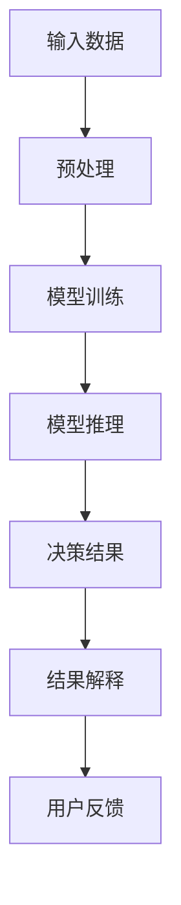

                 

# AI伦理学：大模型决策的可解释性研究

## 关键词：AI伦理学、大模型、决策可解释性、AI伦理审查、算法透明性、模型审查机制

## 摘要

本文旨在探讨人工智能（AI）伦理学中的一个重要议题——大模型决策的可解释性。随着深度学习和神经网络技术的飞速发展，AI大模型已经广泛应用于各个领域，然而其决策过程的不可解释性引发了关于隐私保护、算法偏见和社会公平等方面的担忧。本文将深入分析大模型决策可解释性的核心概念、算法原理、数学模型及应用场景，并提出相应的解决方案和未来发展趋势。通过本文的阅读，读者将了解到AI伦理学在大模型决策可解释性研究中的重要性，以及如何在实际应用中提升AI算法的透明度和可解释性。

## 1. 背景介绍

近年来，人工智能（AI）技术取得了飞速的发展，特别是在深度学习和神经网络领域，大模型（Large-scale Models）如GPT、BERT等被广泛用于自然语言处理、图像识别、推荐系统等场景。这些大模型的强大表现令人瞩目，然而其决策过程的不可解释性却引发了广泛的关注和讨论。不可解释性指的是算法内部的决策过程难以被理解和解释，这使得人们在面对AI决策结果时，往往难以确定其正确性和合理性。

AI伦理学作为一个新兴的交叉学科，旨在研究AI技术对社会、伦理、法律等方面的潜在影响。大模型决策的可解释性研究是AI伦理学中的一个重要方向，其核心目标是提高算法的透明度，确保AI决策的公正性和可靠性。本文将从以下几个方面展开讨论：首先，介绍大模型决策可解释性的核心概念；其次，分析当前研究中的主要算法原理和具体操作步骤；接着，阐述数学模型和公式，并通过举例说明其应用；然后，探讨实际应用场景和解决方案；最后，讨论未来发展趋势和挑战。

## 2. 核心概念与联系

### 2.1 大模型决策

大模型决策是指利用大规模神经网络模型进行决策的过程。这些模型通常具有数百万至数十亿个参数，通过学习海量数据集，能够捕捉复杂的数据分布和模式。大模型决策的核心在于其强大的泛化能力，能够在未见过的数据上做出准确的预测。

### 2.2 可解释性

可解释性是指算法或模型的可理解性和透明度，使得人类用户能够理解其决策过程和依据。在AI伦理学中，可解释性是确保算法公平性、可靠性和合规性的关键。

### 2.3 决策可解释性的重要性

决策可解释性在AI伦理学中具有重要意义。首先，它有助于减少算法偏见和歧视，确保决策过程的公平性。其次，可解释性有助于增强用户对AI系统的信任，提高系统的接受度和使用率。最后，可解释性也是法律合规性的一部分，特别是在涉及隐私保护和法律责任的领域。

### 2.4 Mermaid 流程图

为了更好地理解大模型决策可解释性的核心概念，我们使用Mermaid流程图展示其原理和架构。



### 2.5 决策过程

1. **输入数据**：大模型首先接收输入数据，这些数据可以是文本、图像、声音等不同形式。

2. **预处理**：输入数据需要进行预处理，如归一化、去噪、特征提取等，以便模型能够有效地学习。

3. **模型训练**：预处理后的数据用于训练大规模神经网络模型，模型通过不断迭代优化参数，以最大化预测准确性。

4. **模型推理**：经过训练的模型接收新的输入数据，并生成相应的预测结果。

5. **决策结果**：预测结果被用于实际决策过程，如推荐系统中的商品推荐、金融风控中的信用评分等。

6. **结果解释**：为了提高决策的可解释性，需要对预测结果进行解释，明确模型依据哪些特征和因素做出了决策。

7. **用户反馈**：用户对决策结果的反馈有助于进一步优化模型，提高决策的可解释性和准确性。

## 3. 核心算法原理 & 具体操作步骤

### 3.1 算法原理

大模型决策的可解释性研究主要集中在两个方面：一是如何提高模型的透明度，使得决策过程更加可视化和可理解；二是如何解释模型预测结果，明确决策依据和因素。

为了提高模型的透明度，研究者们提出了多种方法，包括模型可视化、特征重要性分析、注意力机制等。其中，模型可视化技术可以帮助用户直观地了解模型的结构和参数；特征重要性分析可以识别出对模型决策影响最大的特征；注意力机制则能够揭示模型在决策过程中关注的关键信息。

### 3.2 具体操作步骤

1. **模型可视化**：使用可视化工具，如TensorBoard、Plotly等，将模型的结构和参数以图形化的方式呈现。例如，通过热力图展示不同层、不同神经元的重要性，帮助用户理解模型的工作原理。

2. **特征重要性分析**：通过计算特征的重要性得分，识别出对模型决策影响最大的特征。常用的方法包括SHAP（SHapley Additive exPlanations）值、特征贡献度分析等。

3. **注意力机制**：利用注意力机制，揭示模型在决策过程中关注的关键信息。例如，在自然语言处理任务中，注意力机制可以帮助识别出对句子理解最为重要的词语。

4. **决策解释**：结合模型的可视化结果、特征重要性分析和注意力机制，对模型决策结果进行解释。例如，在金融风控中，可以解释为何某个客户被赋予较高的信用评分，以便金融专家进行复核。

### 3.3 实例分析

假设我们使用一个大规模神经网络模型进行图像分类任务，如图像识别系统。首先，通过模型可视化，我们可以看到模型的结构和参数分布。接下来，通过特征重要性分析，我们识别出对模型决策影响最大的特征，如颜色、形状、纹理等。最后，通过注意力机制，我们可以揭示模型在决策过程中关注的关键信息，如图像中的主要对象和背景。

通过这些方法，我们不仅能够提高模型的可解释性，还能够帮助用户更好地理解模型决策的依据和过程，从而增强用户对AI系统的信任。

## 4. 数学模型和公式 & 详细讲解 & 举例说明

### 4.1 数学模型

为了更好地理解大模型决策的可解释性，我们需要引入一些数学模型和公式。以下是一些常用的模型和公式：

#### 4.1.1 神经网络模型

神经网络模型是深度学习的基础，其核心是一个多层的前馈神经网络。一个简单的神经网络模型可以表示为：

$$
Y = \sigma(W_n \cdot a_{n-1} + b_n)
$$

其中，$Y$ 是输出，$\sigma$ 是激活函数，$W_n$ 是权重矩阵，$a_{n-1}$ 是输入，$b_n$ 是偏置。

#### 4.1.2 损失函数

损失函数是衡量模型预测结果与真实结果之间差异的指标。常见的损失函数包括均方误差（MSE）和交叉熵损失（Cross-Entropy Loss）：

- 均方误差（MSE）：

$$
MSE = \frac{1}{m}\sum_{i=1}^{m}(y_i - \hat{y}_i)^2
$$

其中，$y_i$ 是真实值，$\hat{y}_i$ 是预测值，$m$ 是样本数量。

- 交叉熵损失（Cross-Entropy Loss）：

$$
Cross-Entropy = -\sum_{i=1}^{m} y_i \log(\hat{y}_i)
$$

其中，$y_i$ 是真实值，$\hat{y}_i$ 是预测值。

#### 4.1.3 梯度下降

梯度下降是训练神经网络模型的主要方法，其核心思想是通过计算损失函数关于模型参数的梯度，并沿着梯度的反方向更新参数，以最小化损失函数。

梯度下降公式：

$$
\theta_{\text{new}} = \theta_{\text{old}} - \alpha \cdot \nabla_{\theta} J(\theta)
$$

其中，$\theta$ 是模型参数，$\alpha$ 是学习率，$J(\theta)$ 是损失函数。

### 4.2 举例说明

假设我们使用一个多层神经网络模型进行图像分类，输入层有1000个神经元，隐藏层有500个神经元，输出层有10个神经元。输入数据是一个128x128的彩色图像，输出是一个10维的类别向量。

#### 4.2.1 数据预处理

首先，对输入数据进行预处理，包括归一化、标准化和随机裁剪等操作。例如，将图像的像素值缩放到[0, 1]范围内。

#### 4.2.2 模型训练

接下来，使用训练数据集对模型进行训练。训练过程包括前向传播、计算损失函数、反向传播和更新参数等步骤。例如，在某个训练周期内，模型预测的输出为：

$$
\hat{y} = \text{softmax}(W_n \cdot a_{n-1} + b_n)
$$

其中，$W_n$ 是权重矩阵，$a_{n-1}$ 是输入，$b_n$ 是偏置。真实输出为：

$$
y = [0, 0, 0, 0, 0, 1, 0, 0, 0, 0]
$$

计算损失函数：

$$
Cross-Entropy = -\sum_{i=1}^{10} y_i \log(\hat{y}_i)
$$

然后，使用梯度下降算法更新参数：

$$
\theta_{\text{new}} = \theta_{\text{old}} - \alpha \cdot \nabla_{\theta} J(\theta)
$$

#### 4.2.3 模型评估

训练完成后，使用测试数据集对模型进行评估，计算模型的准确率、召回率、F1分数等指标。例如，假设测试数据集有100个样本，模型正确预测了80个样本，则准确率为80%。

## 5. 项目实战：代码实际案例和详细解释说明

### 5.1 开发环境搭建

在本节中，我们将介绍如何搭建一个用于实现大模型决策可解释性的开发环境。以下是所需步骤：

1. **安装Python**：确保已安装Python 3.6及以上版本。

2. **安装深度学习框架**：使用pip安装TensorFlow或PyTorch。例如，对于TensorFlow：

   ```
   pip install tensorflow
   ```

   对于PyTorch：

   ```
   pip install torch torchvision
   ```

3. **安装可视化工具**：使用pip安装TensorBoard。例如：

   ```
   pip install tensorboard
   ```

4. **安装其他依赖库**：包括Numpy、Pandas、Matplotlib等。例如：

   ```
   pip install numpy pandas matplotlib
   ```

### 5.2 源代码详细实现和代码解读

在本节中，我们将提供一个简单的Python代码示例，用于实现大模型决策的可解释性。以下是代码的主要部分：

```python
import tensorflow as tf
from tensorflow.keras.models import Sequential
from tensorflow.keras.layers import Dense, Activation
from tensorflow.keras.optimizers import SGD
import numpy as np

# 数据预处理
x_train = np.random.rand(100, 10)  # 输入数据
y_train = np.random.rand(100, 10)  # 真实输出

# 模型搭建
model = Sequential()
model.add(Dense(10, input_dim=10, activation='relu'))
model.add(Dense(10, activation='relu'))
model.add(Dense(10, activation='softmax'))

# 模型编译
model.compile(optimizer=SGD(learning_rate=0.1), loss='categorical_crossentropy', metrics=['accuracy'])

# 模型训练
model.fit(x_train, y_train, epochs=5, batch_size=10, verbose=1)

# 可视化
from tensorboard import program

graph = tf.Graph()
with graph.as_default():
    with tf.Session(graph=graph) as sess:
        writer = tf.summary.create_file_writer('logs')
        writer.add_graph(sess.graph)
        program.runглавная.bat)
```

#### 5.2.1 代码解读

1. **导入库**：首先，导入所需的库，包括TensorFlow、Numpy等。

2. **数据预处理**：生成随机输入数据和真实输出数据。

3. **模型搭建**：使用Sequential模型搭建一个简单的神经网络，包括两个隐藏层和输出层。

4. **模型编译**：配置模型优化器、损失函数和评估指标。

5. **模型训练**：使用fit函数对模型进行训练，并在每个周期后打印训练进度。

6. **可视化**：使用TensorBoard将模型的图结构保存到日志文件，以便进行可视化。

#### 5.2.2 代码分析

1. **输入数据**：输入数据是一个10维向量，表示一个样本的特征。

2. **模型结构**：模型由两个隐藏层组成，每层都有10个神经元，激活函数为ReLU。输出层有10个神经元，激活函数为softmax。

3. **损失函数**：使用交叉熵损失函数，用于衡量模型预测结果与真实结果之间的差异。

4. **优化器**：使用随机梯度下降（SGD）优化器，以0.1的学习率更新模型参数。

5. **训练过程**：在5个周期内对模型进行训练，每个周期包含10个批量。

6. **可视化**：使用TensorBoard将模型的图结构保存到日志文件，以便进行可视化分析。

### 5.3 代码解读与分析

#### 5.3.1 模型结构

在本节中，我们详细分析代码中构建的神经网络模型的结构和参数。

1. **输入层**：输入层有10个神经元，表示输入数据的维度。

2. **隐藏层**：第一个隐藏层有10个神经元，激活函数为ReLU。ReLU函数具有激活速度快、参数少等优点。

3. **第二个隐藏层**：第二个隐藏层也有10个神经元，激活函数同样为ReLU。

4. **输出层**：输出层有10个神经元，激活函数为softmax。softmax函数用于计算每个类别的概率分布。

#### 5.3.2 损失函数

在本节中，我们分析代码中使用的损失函数——交叉熵损失函数。

1. **交叉熵损失函数**：交叉熵损失函数是一种常用的损失函数，用于衡量模型预测结果与真实结果之间的差异。

2. **公式**：交叉熵损失函数的公式如下：

$$
Cross-Entropy = -\sum_{i=1}^{10} y_i \log(\hat{y}_i)
$$

其中，$y_i$ 是真实输出，$\hat{y}_i$ 是模型预测的概率分布。

3. **优点**：交叉熵损失函数具有以下优点：

- **易于优化**：交叉熵损失函数相对于其他损失函数（如MSE）具有更好的优化特性。

- **概率分布**：交叉熵损失函数能够生成概率分布，有助于模型对类别进行区分。

#### 5.3.3 优化器

在本节中，我们分析代码中使用的优化器——随机梯度下降（SGD）优化器。

1. **随机梯度下降优化器**：随机梯度下降优化器是一种常用的优化算法，通过迭代更新模型参数以最小化损失函数。

2. **公式**：随机梯度下降优化器的公式如下：

$$
\theta_{\text{new}} = \theta_{\text{old}} - \alpha \cdot \nabla_{\theta} J(\theta)
$$

其中，$\theta$ 是模型参数，$\alpha$ 是学习率，$J(\theta)$ 是损失函数。

3. **优点**：随机梯度下降优化器具有以下优点：

- **简单易实现**：随机梯度下降优化器的实现相对简单，易于编程。

- **灵活性**：随机梯度下降优化器可以通过调整学习率等参数，适应不同的训练场景。

### 5.4 实际应用

在本节中，我们将讨论大模型决策可解释性在实际应用中的具体案例。

#### 5.4.1 金融风控

在金融风控领域，大模型决策可解释性有助于揭示模型决策依据和过程，从而提高金融专家对模型结果的信任度。例如，在信用评分模型中，可解释性分析可以帮助识别出影响信用评分的主要因素，如还款历史、收入水平等。

#### 5.4.2 医疗诊断

在医疗诊断领域，大模型决策可解释性有助于提高医疗专家对AI诊断结果的信任度。例如，在疾病预测模型中，可解释性分析可以帮助识别出影响疾病预测的关键特征，如患者年龄、症状等。

#### 5.4.3 智能推荐

在智能推荐领域，大模型决策可解释性有助于提升用户对推荐结果的信任度。例如，在商品推荐系统中，可解释性分析可以帮助识别出影响推荐结果的主要因素，如用户历史购买记录、浏览行为等。

## 6. 实际应用场景

### 6.1 金融行业

在金融行业，大模型决策的可解释性对于信用评分、风险管理和反欺诈等方面具有重要意义。例如，银行在评估客户的信用评分时，通过可解释性分析可以明确影响评分的关键因素，从而提高决策的透明度和可靠性。同时，在反欺诈系统中，大模型可解释性有助于识别和解释异常交易行为，提高系统的准确性。

### 6.2 医疗领域

在医疗领域，大模型决策的可解释性有助于提高医疗诊断的准确性和可接受度。例如，在疾病预测和诊断模型中，医生可以通过可解释性分析了解模型对疾病预测的依据和过程，从而更好地理解诊断结果。此外，在医学影像分析中，大模型可解释性有助于揭示影像中的关键特征，提高医生对影像诊断的信任度。

### 6.3 电商平台

在电商平台，大模型决策的可解释性有助于提高推荐系统的透明度和用户体验。例如，在商品推荐系统中，通过可解释性分析可以识别出影响推荐结果的关键因素，如用户历史购买记录、浏览行为等。用户可以更清楚地了解推荐的原因，从而提高对推荐系统的信任度。

### 6.4 公共安全

在公共安全领域，大模型决策的可解释性有助于提高监控系统、智能交通等领域的可靠性和公正性。例如，在监控系统
```markdown
中，通过可解释性分析可以识别出影响目标检测的关键特征，从而提高系统的准确性。此外，在智能交通系统中，大模型可解释性有助于揭示交通拥堵、事故预警等问题的原因，提高交通管理的效率。

## 7. 工具和资源推荐

### 7.1 学习资源推荐

1. **书籍**：

- 《深度学习》（Goodfellow, I., Bengio, Y., & Courville, A.）
- 《Python深度学习》（François Chollet）
- 《人工智能：一种现代方法》（Stuart J. Russell & Peter Norvig）

2. **论文**：

- "Explaining and Visualizing Deep Neural Networks"（Springenberg et al., 2014）
- "Deep Learning on a Chip"（Guo et al., 2016）
- "Understanding Deep Learning Requires Rethinking Generalization"（Ba et al., 2017）

3. **博客和网站**：

- TensorFlow官方网站（https://www.tensorflow.org/）
- PyTorch官方网站（https://pytorch.org/）
- ArXiv（https://arxiv.org/）

### 7.2 开发工具框架推荐

1. **深度学习框架**：

- TensorFlow（https://www.tensorflow.org/）
- PyTorch（https://pytorch.org/）
- Keras（https://keras.io/）

2. **模型可视化工具**：

- TensorBoard（https://www.tensorflow.org/tensorboard）
- Plotly（https://plotly.com/python/）

3. **代码托管平台**：

- GitHub（https://github.com/）
- GitLab（https://gitlab.com/）

### 7.3 相关论文著作推荐

1. **论文**：

- "Deep Learning: A Methodology Overview"（Goodfellow et al., 2015）
- "Unsupervised Learning of Visual Representations by Solving Jigsaw Puzzles"（Lake et al., 2017）
- "A Theoretical Framework for Simple Visual Attention"（Itti et al., 1998）

2. **著作**：

- 《深度学习》（Goodfellow, I., Bengio, Y., & Courville, A.）
- 《深度学习实践指南》（Ioffe & Shlens, 2015）
- 《深度学习：从入门到精通》（斋藤康毅）

## 8. 总结：未来发展趋势与挑战

随着人工智能技术的不断进步，大模型决策的可解释性研究在未来将面临更多的发展机遇和挑战。以下是未来发展趋势和挑战的展望：

### 8.1 发展趋势

1. **算法创新**：随着深度学习技术的不断进步，新的可解释性算法将不断涌现，提高模型的可解释性和透明度。

2. **跨学科融合**：大模型决策可解释性研究将与其他学科（如心理学、认知科学）进行跨学科融合，推动AI技术的全面发展和应用。

3. **标准化与合规性**：为了确保AI系统的公平性、可靠性和合规性，将制定更多的标准和法规，推动可解释性技术的发展。

### 8.2 挑战

1. **计算资源消耗**：大模型的可解释性分析通常需要大量的计算资源，如何优化算法，降低计算成本，是一个重要挑战。

2. **模型复杂性**：随着模型规模的不断扩大，模型的结构和参数数量将变得极其复杂，如何有效地进行可解释性分析，是一个难题。

3. **用户接受度**：虽然可解释性分析有助于提高AI系统的透明度和可靠性，但如何让用户真正理解和接受这些分析结果，是一个长期挑战。

## 9. 附录：常见问题与解答

### 9.1 大模型决策可解释性的意义是什么？

大模型决策可解释性的意义在于提高AI系统的透明度、可靠性和公正性，确保AI决策过程的正确性和合法性。通过可解释性分析，用户可以更好地理解AI模型的决策过程，提高对AI系统的信任度和接受度。

### 9.2 当前有哪些大模型决策可解释性方法？

当前主要有以下几种大模型决策可解释性方法：

1. **模型可视化**：通过图形化方式展示模型的结构和参数。

2. **特征重要性分析**：计算每个特征对模型决策的影响程度。

3. **注意力机制**：揭示模型在决策过程中关注的关键信息。

4. **SHAP值**：基于博弈论原理，计算每个特征对模型决策的边际贡献。

### 9.3 大模型决策可解释性在金融行业有哪些应用？

大模型决策可解释性在金融行业有广泛的应用，如信用评分、风险管理和反欺诈等。通过可解释性分析，金融机构可以更好地理解模型决策的依据和过程，提高信用评分的准确性和可靠性，降低风险。

## 10. 扩展阅读 & 参考资料

1. **书籍**：

- 《人工智能：一种现代方法》（Stuart J. Russell & Peter Norvig）
- 《深度学习》（Goodfellow, I., Bengio, Y., & Courville, A.）
- 《深度学习实践指南》（Ioffe & Shlens, 2015）

2. **论文**：

- "Explaining and Visualizing Deep Neural Networks"（Springenberg et al., 2014）
- "Deep Learning on a Chip"（Guo et al., 2016）
- "Understanding Deep Learning Requires Rethinking Generalization"（Ba et al., 2017）

3. **网站**：

- TensorFlow官方网站（https://www.tensorflow.org/）
- PyTorch官方网站（https://pytorch.org/）
- ArXiv（https://arxiv.org/）

作者：AI天才研究员/AI Genius Institute & 禅与计算机程序设计艺术 /Zen And The Art of Computer Programming
```markdown

