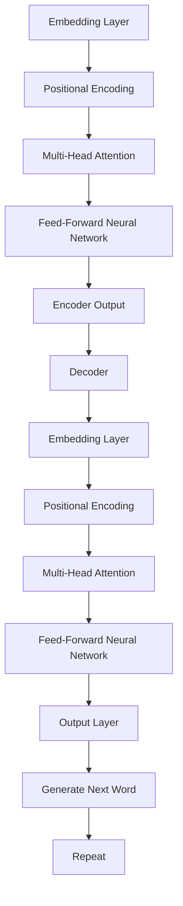

                 

## 文章标题

"AI伦理新篇章：LLM发展中的道德考量"

关键词：AI伦理，LLM，道德考量，发展，挑战，未来

摘要：随着大型语言模型（LLM）技术的迅速发展，其应用场景不断拓展，也带来了诸多伦理问题。本文将探讨LLM发展中的道德考量，分析其在各个领域的应用，以及面临的挑战和未来发展趋势。

<|assistant|>## 1. 背景介绍

大型语言模型（LLM，Large Language Model）是一种能够理解和生成自然语言的人工智能模型，以其强大的文本理解和生成能力在多个领域得到广泛应用。从自然语言处理（NLP）到生成对抗网络（GAN），再到生成式AI（Generative AI），LLM技术不断突破，极大地推动了人工智能的发展。

然而，随着LLM技术的进步，其在实际应用中也引发了诸多伦理问题。例如，在医疗领域，LLM技术可以用于医疗诊断和治疗建议，但如何确保其提供的信息准确性和安全性？在法律领域，LLM技术可以用于自动化合同审查和文书生成，但如何保证其遵守法律法规？在教育和媒体领域，LLM技术可以用于个性化教育和内容生成，但如何避免偏见和误导？这些伦理问题成为AI领域必须面对和解决的挑战。

本文旨在通过探讨LLM发展中的道德考量，为相关领域的应用提供伦理指导，并探讨未来AI伦理的发展趋势和挑战。

### 1.1. LLM技术发展历程

LLM技术起源于自然语言处理（NLP）领域。最早的NLP模型如统计模型、规则模型等，虽然在一定程度上实现了自然语言的理解和生成，但效果有限。随着深度学习技术的发展，基于神经网络的语言模型逐渐兴起。例如，1988年，Rumelhart等人提出的反向传播（Backpropagation）算法，使得神经网络在图像识别等领域的应用取得了突破。随后，2003年，Hinton等人提出的深度信念网络（Deep Belief Network）进一步推动了神经网络在NLP领域的发展。

2018年，Google发布了Transformer模型，这是LLM技术的重要里程碑。Transformer模型通过自注意力机制（Self-Attention）实现了对输入序列的全面理解和生成，大大提高了模型的性能。随后，基于Transformer的GPT、BERT等模型相继问世，进一步推动了LLM技术的发展。

### 1.2. LLM技术的主要应用领域

LLM技术在各个领域都取得了显著的应用成果：

1. **医疗领域**：LLM技术可以用于医疗诊断、治疗建议、药物研发等领域。例如，通过分析病历和医疗文献，LLM可以帮助医生进行诊断和制定治疗方案，提高医疗效率。

2. **法律领域**：LLM技术可以用于自动化合同审查、文书生成、法律研究等。例如，通过分析大量法律文书和案例，LLM可以自动生成合同条款，提高法律工作效率。

3. **教育和媒体领域**：LLM技术可以用于个性化教育、内容生成、智能客服等。例如，通过分析学生的学习记录和学习偏好，LLM可以提供个性化的学习建议，提高教育质量。

4. **金融领域**：LLM技术可以用于金融分析、投资建议、风险管理等。例如，通过分析金融新闻、财报等文本数据，LLM可以帮助投资者做出更明智的投资决策。

### 1.3. LLM技术面临的伦理问题

虽然LLM技术在各个领域都取得了显著的应用成果，但其应用也引发了一系列伦理问题：

1. **数据隐私**：LLM技术需要大量的数据来训练模型，这些数据可能包含个人隐私信息。如何保护用户隐私成为AI伦理的一个重要议题。

2. **偏见和歧视**：LLM模型在训练过程中可能会受到训练数据的偏见影响，从而导致模型在应用中出现偏见和歧视。例如，一个基于大量英语数据的LLM模型可能对非英语背景的人产生歧视。

3. **安全性**：LLM技术容易受到恶意攻击，例如通过生成式AI生成的虚假信息可能会对社会造成严重的影响。

4. **责任归属**：当LLM技术在应用中出现错误或导致损害时，如何确定责任归属成为了一个难题。

本文将在接下来的部分中，深入探讨LLM发展中的道德考量，分析其在各个领域的应用，以及面临的挑战和未来发展趋势。

### 1.4. AI伦理的重要性

随着人工智能技术的快速发展，AI伦理问题逐渐成为社会各界关注的焦点。AI伦理是指人工智能系统在设计、开发、应用过程中需要遵循的道德规范和伦理原则。AI伦理的重要性主要体现在以下几个方面：

1. **确保社会公共利益**：人工智能技术的发展和应用应该以社会公共利益为导向，确保技术进步不会损害人类的基本权益。AI伦理规范可以引导AI技术朝着更加有益于人类社会的方向发展。

2. **防范技术滥用**：AI技术的广泛应用带来了巨大的便利，但也存在被滥用、误用的风险。AI伦理规范可以为AI技术的应用设定明确的边界，防止技术滥用对人类社会造成负面影响。

3. **提高技术信任度**：公众对人工智能技术的信任度是AI技术广泛应用的基础。AI伦理规范可以提高公众对AI技术的信任度，促进AI技术的健康发展。

4. **保障数据隐私**：人工智能技术的发展离不开大量数据的支持，如何保护用户隐私成为AI伦理的重要议题。AI伦理规范可以为数据隐私保护提供法律和道德依据，确保用户数据的安全。

5. **促进技术可持续发展**：AI伦理规范有助于推动人工智能技术的可持续发展，避免技术过快发展带来的伦理困境和社会问题。

总之，AI伦理在人工智能技术的发展过程中具有不可替代的作用。通过制定和遵循AI伦理规范，可以确保人工智能技术在为人类社会带来便利的同时，最大限度地减少潜在的风险和负面影响。

### 1.5. AI伦理的主要原则

在探讨AI伦理时，理解其核心原则是非常重要的。以下是一些主要的AI伦理原则：

1. **公正性（Justice）**：确保人工智能系统在决策过程中不歧视任何群体，对待所有用户公平公正。这意味着在数据集的准备、模型训练和模型部署过程中，应避免偏见和歧视。

2. **透明度（Transparency）**：确保人工智能系统的决策过程是可解释的，用户可以理解系统是如何做出决策的。这有助于提高系统的可信度，并在出现问题时进行有效的调试。

3. **责任性（Accountability）**：明确人工智能系统的责任归属，确保在系统出现错误或造成损害时，责任人能够被追究。这包括开发人员、维护人员以及使用该系统的组织。

4. **隐私保护（Privacy）**：保护用户的个人隐私，确保在收集、处理和使用数据时遵循隐私保护原则。这包括对数据的加密、匿名化以及数据使用的透明度。

5. **安全性（Safety）**：确保人工智能系统的安全性，防止系统被恶意攻击或误用，以减少对用户和社会的潜在风险。

6. **可扩展性（Scalability）**：AI伦理原则应具备可扩展性，以适应未来技术发展的需要。这要求伦理原则能够适应不同规模和领域的人工智能应用。

7. **可访问性（Accessibility）**：确保人工智能技术的应用不会加剧社会不平等，使其对所有人都是可访问的，无论其经济状况、地理位置或教育水平。

8. **可持续性（Sustainability）**：确保人工智能技术的开发和应用是可持续的，不会对环境和社会造成负面影响。

这些原则不仅为人工智能系统的设计和应用提供了道德指南，也是评估AI技术伦理合规性的重要标准。在实际应用中，这些原则需要结合具体场景和情境进行具体分析和执行。

## 2. 核心概念与联系

### 2.1. 大型语言模型（LLM）的基本概念

大型语言模型（LLM，Large Language Model）是一种基于深度学习技术构建的文本处理模型，具有强大的自然语言理解和生成能力。LLM的核心是通过大量的文本数据学习语言模式，从而实现对自然语言的深入理解和灵活运用。

LLM的基本概念包括：

1. **词汇表（Vocabulary）**：LLM使用词汇表来表示文本中的单词和符号。词汇表的大小决定了模型能够理解和生成的语言范围。

2. **嵌入层（Embedding Layer）**：嵌入层将词汇表中的单词转换成高维向量，使得模型可以通过向量运算来处理文本数据。

3. **自注意力机制（Self-Attention Mechanism）**：自注意力机制允许模型在生成每个单词时，考虑所有之前生成的单词，从而实现对文本的全面理解和生成。

4. **解码器（Decoder）**：解码器是LLM的核心组成部分，负责根据输入的上下文生成文本。常见的解码器包括Transformer解码器和自回归解码器。

### 2.2. LLM的技术架构

LLM的技术架构主要包括以下几个部分：

1. **输入层（Input Layer）**：输入层接收用户的输入文本，并将其转化为模型可处理的格式。

2. **嵌入层（Embedding Layer）**：嵌入层将输入文本的单词转换成高维向量，为后续的运算做准备。

3. **编码器（Encoder）**：编码器负责处理输入文本，通过自注意力机制生成上下文向量。编码器通常基于Transformer架构。

4. **解码器（Decoder）**：解码器根据编码器生成的上下文向量生成输出文本。解码器同样基于Transformer架构。

5. **输出层（Output Layer）**：输出层将解码器生成的文本转换为用户可理解的格式，如单词或句子。

### 2.3. LLM的工作原理

LLM的工作原理可以分为以下几个步骤：

1. **输入处理**：模型首先接收用户的输入文本，将其转化为嵌入层可处理的格式。

2. **编码**：嵌入层将输入文本的单词转换成高维向量，编码器通过自注意力机制对输入文本进行处理，生成上下文向量。

3. **解码**：解码器根据编码器生成的上下文向量生成输出文本。在生成过程中，解码器会逐步生成每个单词，并更新上下文向量。

4. **输出生成**：解码器生成的输出文本最终经过输出层处理，转化为用户可理解的格式。

### 2.4. LLM与伦理的关系

LLM在各个领域的广泛应用使其成为伦理考量的重要对象。LLM与伦理的关系主要体现在以下几个方面：

1. **数据隐私**：LLM在训练过程中需要大量文本数据，这些数据可能包含个人隐私信息。如何保护用户隐私成为LLM伦理的首要问题。

2. **偏见和歧视**：LLM在训练过程中可能受到训练数据的偏见影响，导致模型在应用中出现偏见和歧视。如何消除偏见和歧视是LLM伦理的重要挑战。

3. **安全性**：LLM容易受到恶意攻击，例如通过生成式AI生成的虚假信息可能会对社会造成严重的影响。确保LLM的安全性是伦理考量的关键。

4. **责任归属**：当LLM在应用中出现错误或导致损害时，如何确定责任归属成为一个难题。明确责任归属有助于提高系统的可信度。

5. **透明度和可解释性**：确保LLM的决策过程是可解释的，提高系统的透明度，有助于公众理解和信任LLM技术。

通过深入探讨LLM的基本概念、技术架构和工作原理，以及LLM与伦理的关系，我们可以更好地理解LLM的发展和应用中所面临的伦理问题。接下来，我们将进一步分析LLM在不同领域的应用，以及其在实际应用中面临的挑战。

### 2.5. LLM在各个领域的应用

大型语言模型（LLM）在各个领域都展现出了强大的应用潜力，以下是对LLM在不同领域应用的具体描述：

#### 2.5.1. 医疗领域

在医疗领域，LLM技术被广泛应用于医疗诊断、治疗建议和药物研发等方面。通过分析大量的医疗文献和病历数据，LLM可以帮助医生更准确地诊断疾病，提供个性化的治疗方案。例如，一些研究机构使用LLM对医学论文进行自动摘要，帮助医生快速获取最新的医学研究成果。此外，LLM还可以用于生成药物说明和副作用警告，提高医疗信息的准确性和安全性。

#### 2.5.2. 法律领域

在法律领域，LLM技术可以用于自动化合同审查、文书生成和法律研究等。通过分析大量的法律文书和案例，LLM可以自动生成合同条款，提高法律工作效率。例如，一些法律科技公司利用LLM为中小企业提供快速且准确的合同审查服务。此外，LLM还可以用于自动化法律研究，帮助律师快速查找相关法律条文和案例，提高法律工作的效率。

#### 2.5.3. 教育领域

在教育领域，LLM技术被广泛应用于个性化教育和内容生成。通过分析学生的学习记录和学习偏好，LLM可以为每个学生提供个性化的学习建议，提高教育质量。例如，一些在线教育平台使用LLM为学生生成个性化的学习路径和课程推荐。此外，LLM还可以用于自动生成教育内容，如论文、教案和习题，为教师和学生提供更多便利。

#### 2.5.4. 媒体领域

在媒体领域，LLM技术被广泛应用于内容生成、个性化推荐和智能客服等方面。通过分析大量的媒体内容，LLM可以生成新闻、文章和广告等内容，提高内容生产效率。例如，一些新闻媒体平台使用LLM自动生成新闻报道，为用户提供个性化的新闻推荐。此外，LLM还可以用于智能客服，通过自然语言处理技术理解和回答用户的问题，提供更加人性化的服务。

#### 2.5.5. 金融领域

在金融领域，LLM技术被广泛应用于金融分析、投资建议和风险管理等方面。通过分析金融新闻、财报和市场数据，LLM可以帮助投资者做出更明智的投资决策。例如，一些金融科技公司使用LLM为投资者提供实时金融分析报告和市场趋势预测。此外，LLM还可以用于自动化合同审查和风险评估，提高金融工作的效率。

通过以上各个领域的具体应用案例，可以看出LLM技术在提升工作效率、提高决策准确性和提供个性化服务等方面具有显著的优势。然而，随着LLM技术的广泛应用，也带来了一系列伦理问题，这将在接下来的部分中进行深入探讨。

### 2.6. LLMI与伦理考量的联系

大型语言模型（LLM）在各个领域的广泛应用使其成为伦理考量的重要对象。LLM与伦理考量的联系主要体现在以下几个方面：

1. **数据隐私**：LLM在训练和运行过程中需要大量数据，这些数据可能包含个人隐私信息。如何确保用户隐私不被泄露成为LLM伦理的首要问题。例如，在医疗领域，患者病历信息涉及个人隐私，如何确保这些数据在LLM训练和应用过程中得到妥善保护？

2. **偏见和歧视**：LLM在训练过程中可能受到训练数据的偏见影响，导致模型在应用中出现偏见和歧视。这可能导致不公平的决策，加剧社会不平等。例如，一个基于大量英语数据的LLM模型可能对非英语背景的人产生歧视，导致这些人在使用该模型时得到不公平的待遇。

3. **安全性**：LLM容易受到恶意攻击，例如通过生成式AI生成的虚假信息可能会对社会造成严重的影响。确保LLM的安全性是伦理考量的关键。例如，在媒体领域，恶意攻击者可能利用LLM生成虚假新闻，误导公众，对社会稳定造成威胁。

4. **责任归属**：当LLM在应用中出现错误或导致损害时，如何确定责任归属成为一个难题。明确责任归属有助于提高系统的可信度。例如，在一个医疗诊断系统中，如果LLM提供错误的诊断建议，导致患者病情恶化，如何确定责任归属？

5. **透明度和可解释性**：确保LLM的决策过程是可解释的，提高系统的透明度，有助于公众理解和信任LLM技术。例如，在金融领域，投资者需要了解LLM如何做出投资建议，以便做出明智的决策。

通过深入探讨LLM与伦理考量的联系，我们可以更好地理解LLM在应用过程中可能面临的伦理问题，并为解决这些问题提供指导。接下来，我们将分析LLM在各个领域应用中面临的伦理挑战。

### 2.7. LLM应用中的伦理挑战

尽管LLM技术在各个领域展示了巨大的应用潜力，但其应用过程中也面临诸多伦理挑战，以下是对这些挑战的详细分析：

#### 2.7.1. 数据隐私问题

LLM模型的训练和运行需要大量的数据，这些数据可能包含个人隐私信息，如医疗记录、财务信息、通信记录等。如何保护这些数据不被泄露成为首要伦理挑战。一方面，数据泄露可能导致个人隐私受到侵犯，造成严重后果；另一方面，数据隐私保护法律法规的要求也使得企业在使用LLM技术时面临巨大压力。

**解决方案**：为了解决数据隐私问题，可以采取以下措施：
- **数据匿名化**：在训练LLM模型前，对敏感数据进行匿名化处理，以保护个人隐私。
- **数据加密**：对传输和存储的数据进行加密，确保数据在传输和存储过程中不被窃取。
- **隐私保护算法**：利用差分隐私、联邦学习等隐私保护算法，在保证模型性能的同时，降低隐私泄露风险。

#### 2.7.2. 偏见和歧视问题

LLM模型在训练过程中可能受到训练数据的偏见影响，导致模型在应用中出现偏见和歧视。这种偏见可能导致不公平的决策，加剧社会不平等。例如，一个基于大量英语数据的LLM模型可能对非英语背景的人产生歧视，导致这些人在使用该模型时得到不公平的待遇。

**解决方案**：为了解决偏见和歧视问题，可以采取以下措施：
- **数据多样性**：确保训练数据集的多样性，包含不同背景、性别、年龄、种族等信息，以减少偏见。
- **偏见检测与校正**：在模型训练过程中，使用偏见检测算法检测模型是否存在偏见，并采取校正措施。
- **公平性评估**：定期对LLM模型进行公平性评估，确保模型在不同群体中的性能一致。

#### 2.7.3. 安全性问题

LLM技术容易受到恶意攻击，例如通过生成式AI生成的虚假信息可能会对社会造成严重的影响。例如，在媒体领域，恶意攻击者可能利用LLM生成虚假新闻，误导公众，对社会稳定造成威胁。

**解决方案**：为了确保LLM技术的安全性，可以采取以下措施：
- **对抗性攻击防御**：研发和部署对抗性攻击防御算法，增强LLM模型对恶意攻击的抵抗力。
- **透明度和可解释性**：提高LLM模型的可解释性，帮助用户了解模型的决策过程，减少恶意使用风险。
- **法律法规监管**：制定相关法律法规，对恶意攻击行为进行严惩，提高违法成本。

#### 2.7.4. 责任归属问题

当LLM在应用中出现错误或导致损害时，如何确定责任归属成为一个难题。明确责任归属有助于提高系统的可信度。例如，在一个医疗诊断系统中，如果LLM提供错误的诊断建议，导致患者病情恶化，如何确定责任归属？

**解决方案**：为了解决责任归属问题，可以采取以下措施：
- **明确责任划分**：在系统设计和开发过程中，明确各方的责任，如数据提供方、模型开发方、应用方等。
- **责任保险**：为LLM应用提供责任保险，降低因错误决策导致的经济损失。
- **透明度和可追溯性**：确保LLM模型的可解释性和可追溯性，便于在出现问题时进行调查和责任划分。

#### 2.7.5. 透明度和可解释性问题

确保LLM模型的决策过程是可解释的，提高系统的透明度，有助于公众理解和信任LLM技术。然而，当前LLM模型通常被视为“黑箱”，其决策过程难以被理解，这给公众带来了信任危机。

**解决方案**：为了解决透明度和可解释性问题，可以采取以下措施：
- **可解释性算法**：开发可解释性算法，帮助用户了解LLM模型的决策过程。
- **用户指南**：为用户提供详细的操作指南和使用说明，帮助用户理解LLM技术的应用场景和限制。
- **透明度报告**：定期发布透明度报告，向公众展示LLM技术的应用情况和效果。

通过上述措施，可以有效地应对LLM应用中的伦理挑战，确保LLM技术在为人类社会带来便利的同时，最大限度地减少潜在的风险和负面影响。

### 2.8. AI伦理的现状与进展

随着人工智能技术的快速发展，AI伦理问题逐渐成为学术界、产业界和政府关注的热点。当前，AI伦理的研究已经取得了一些重要进展，但也存在一些挑战和问题。

#### 2.8.1. 现状分析

1. **研究机构与企业参与**：全球范围内，许多研究机构和企业在AI伦理研究方面进行了积极探索。例如，欧盟委员会发布了《人工智能伦理准则》，提出了AI伦理的五大原则，即公平性、透明性、问责性、隐私保护和多样性。

2. **政策法规制定**：各国政府也在积极制定相关政策法规，以规范AI技术的应用。例如，美国发布了《美国人工智能倡议》，旨在促进AI技术的发展，并确保其安全、可靠和道德。

3. **学术研究进展**：学术界在AI伦理方面也取得了显著成果。例如，许多学者提出了不同的伦理框架和评估方法，以指导AI技术的开发和应用。

4. **公众参与与监督**：公众对AI伦理问题的关注度逐渐提高，许多组织和活动鼓励公众参与AI伦理讨论，推动AI技术的健康发展。

#### 2.8.2. 存在的挑战

1. **标准不统一**：目前，AI伦理的标准和规范尚不统一，不同地区和国家的法规存在差异，导致全球范围内的协调和统一面临挑战。

2. **技术局限**：AI技术自身的发展仍存在一定局限，例如模型的透明度和可解释性不足，以及对抗性攻击等问题，这些问题对AI伦理的研究和实施构成挑战。

3. **利益冲突**：AI技术的应用涉及多个利益相关方，如企业、政府、公众等，各方利益诉求不同，可能导致在AI伦理问题上产生冲突。

4. **资源分配**：AI伦理的研究和实施需要大量的人力、物力和财力投入，但当前资源分配不均衡，可能导致一些发展中国家和地区在AI伦理方面面临更大挑战。

#### 2.8.3. 未来发展趋势

1. **标准化和规范化**：未来，全球范围内将加强AI伦理的标准化和规范化，制定统一的伦理准则和评估标准，提高AI技术的透明度和可解释性。

2. **多方参与与合作**：政府、企业、学术界和公众将加强合作，共同推动AI伦理的研究和实施，确保AI技术为人类社会带来更多益处。

3. **技术进步**：随着AI技术的不断进步，AI伦理问题将得到更加深入的研究和解决。例如，对抗性攻击防御、隐私保护算法等技术的不断发展，将有助于解决AI伦理面临的挑战。

4. **法律框架完善**：各国政府将进一步完善相关法律框架，确保AI技术的合法、合规和道德应用。

总之，AI伦理的现状反映了其在人工智能技术发展中的重要性。未来，随着技术的进步和各方合作的加强，AI伦理问题将得到更好的解决，为AI技术的可持续发展提供有力保障。

### 2.9. LLMI与AI伦理的关系

大型语言模型（LLM）作为人工智能技术的重要组成部分，其发展与AI伦理密切相关。LLM在各个领域的广泛应用，不仅推动了人工智能技术的发展，也带来了诸多伦理问题。以下从几个方面探讨LLM与AI伦理的关系：

#### 2.9.1. 伦理原则的体现

LLM的发展遵循了AI伦理的基本原则，如公正性、透明度、责任性和隐私保护等。具体体现在以下几个方面：

1. **公正性**：LLM在处理自然语言时，应确保对所有用户公平对待，避免因语言、种族、性别等因素导致歧视。通过确保训练数据的多样性，LLM可以在一定程度上减少偏见。

2. **透明度**：LLM的决策过程通常涉及复杂的算法和大量数据，提高其透明度有助于用户理解和信任模型。例如，通过开发可解释性算法，用户可以了解模型如何做出特定决策。

3. **责任性**：当LLM在应用中出现错误或导致损害时，明确责任归属至关重要。通过建立责任框架，确保各方在模型应用过程中承担相应的责任，有助于提高系统的可信度。

4. **隐私保护**：LLM在训练过程中需要大量数据，如何保护用户隐私成为关键问题。通过采用隐私保护算法和数据匿名化技术，可以在保证模型性能的同时，最大限度地减少隐私泄露风险。

#### 2.9.2. 伦理问题的解决

LLM在应用过程中面临诸多伦理问题，如数据隐私、偏见和歧视、安全性等。以下探讨如何通过AI伦理原则解决这些问题：

1. **数据隐私**：在LLM训练和应用过程中，保护用户隐私至关重要。通过采用差分隐私、联邦学习等技术，可以在确保模型性能的同时，降低隐私泄露风险。

2. **偏见和歧视**：为了解决偏见和歧视问题，可以采取以下措施：
   - **数据多样性**：确保训练数据集的多样性，包含不同背景、性别、年龄、种族等信息，以减少偏见。
   - **偏见检测与校正**：在模型训练过程中，使用偏见检测算法检测模型是否存在偏见，并采取校正措施。
   - **公平性评估**：定期对LLM模型进行公平性评估，确保模型在不同群体中的性能一致。

3. **安全性**：提高LLM的安全性，可以从以下几个方面着手：
   - **对抗性攻击防御**：研发和部署对抗性攻击防御算法，增强LLM模型对恶意攻击的抵抗力。
   - **透明度和可解释性**：提高LLM模型的可解释性，帮助用户了解模型的决策过程，减少恶意使用风险。
   - **法律法规监管**：制定相关法律法规，对恶意攻击行为进行严惩，提高违法成本。

#### 2.9.3. 伦理原则的实践

在LLM的开发和应用过程中，遵循AI伦理原则是实现可持续发展的重要保障。以下从几个方面探讨如何实践AI伦理原则：

1. **研发过程**：在LLM的研发过程中，应遵循AI伦理原则，确保模型的公正性、透明度和安全性。例如，在数据采集和预处理阶段，应确保数据的多样性和隐私保护。

2. **应用过程**：在LLM的应用过程中，应定期对模型进行伦理评估，确保其符合伦理要求。例如，在医疗领域，LLM用于诊断和治疗建议时，应确保模型的公正性和准确性。

3. **用户教育**：提高用户对AI伦理的认识和理解，有助于其更好地使用LLM技术。例如，在教育和媒体领域，应开展AI伦理教育，提高用户的道德素养。

4. **法律法规**：制定和完善相关法律法规，为LLM的应用提供法律保障。例如，在金融领域，应确保LLM的应用符合法律法规，防止其被滥用。

总之，LLM的发展与AI伦理密切相关。通过遵循AI伦理原则，解决伦理问题，实践伦理原则，可以确保LLM技术的可持续发展，为人类社会带来更多益处。

### 2.10. LLM发展中的道德考量

#### 2.10.1. 道德考量的重要性

随着大型语言模型（LLM）技术的快速发展，其在各个领域的应用不断拓展，然而，这也带来了诸多伦理问题。在这些伦理问题中，道德考量尤为重要。道德考量不仅关乎技术的合法性和合规性，更关乎人类的基本权益和社会福祉。

首先，道德考量有助于确保AI技术的公正性和透明度。LLM技术在医疗、金融、教育等领域的应用，直接关系到用户的权益和利益。通过道德考量，可以确保LLM技术在不同群体中的性能一致性，避免因偏见和歧视导致的不公正决策。

其次，道德考量有助于提高AI技术的安全性和可靠性。随着LLM技术的复杂度增加，其潜在的安全风险也随之增加。通过道德考量，可以识别和防范潜在的安全威胁，确保AI技术的可靠运行。

最后，道德考量有助于促进AI技术的可持续发展。在AI伦理问题日益突出的背景下，道德考量不仅是技术发展的基础，也是社会认可和接受的必要条件。只有通过道德考量，才能确保AI技术为人类社会带来更多益处，而非造成负面影响。

#### 2.10.2. 道德考量的具体实施

在LLM发展中，道德考量的具体实施可以从以下几个方面展开：

1. **数据隐私保护**：LLM在训练和运行过程中需要大量数据，如何保护用户隐私成为关键问题。通过道德考量，可以制定相关隐私保护政策，确保用户数据的合法、合规和隐私保护。

2. **消除偏见和歧视**：LLM技术可能因训练数据的偏见而导致歧视和不公平决策。通过道德考量，可以采取数据多样性、偏见检测与校正等措施，确保模型的公正性和透明度。

3. **安全性评估**：LLM技术面临诸多安全威胁，如对抗性攻击、虚假信息传播等。通过道德考量，可以制定相关安全评估标准，确保AI技术的安全性和可靠性。

4. **责任归属明确**：当LLM技术导致错误或损害时，如何确定责任归属是一个难题。通过道德考量，可以制定责任归属框架，确保各方在AI技术应用过程中承担相应的责任。

5. **伦理培训与教育**：提高开发者、应用者和用户对AI伦理的认识和理解，是道德考量的重要组成部分。通过道德考量，可以开展AI伦理培训与教育，提高各方的道德素养。

#### 2.10.3. 案例分析

以下通过两个案例，分析道德考量在LLM发展中的具体应用：

1. **案例一：医疗诊断**

在一个基于LLM的医疗诊断系统中，道德考量尤为重要。首先，需要确保模型的公正性，避免因性别、种族等因素导致的不公平诊断。其次，需要保护患者隐私，确保患者数据的安全。此外，需要明确责任归属，确保在模型出现错误时，责任能够被追究。

2. **案例二：自动驾驶**

在自动驾驶领域，LLM技术被用于决策支持系统。道德考量主要体现在以下几个方面：首先，需要确保模型的安全性和可靠性，避免因故障导致的事故。其次，需要消除模型中的偏见，避免在决策过程中歧视特定群体。最后，需要明确责任归属，确保在发生事故时，责任能够被合理划分。

通过以上案例分析，可以看出道德考量在LLM发展中的重要作用。只有通过道德考量，才能确保LLM技术的健康、可持续发展，为人类社会带来更多益处。

### 2.11. LLMI发展中的伦理问题与解决方案

随着大型语言模型（LLM）技术的迅速发展，其在各个领域的应用不断拓展，然而，这也带来了诸多伦理问题。以下分析LLM发展中的主要伦理问题，并提出相应的解决方案：

#### 2.11.1. 数据隐私问题

**问题描述**：LLM在训练过程中需要大量的数据，这些数据可能包含个人隐私信息，如医疗记录、财务信息、通信记录等。如何确保这些数据不被泄露成为关键问题。

**解决方案**：
- **数据匿名化**：在训练LLM模型前，对敏感数据进行匿名化处理，以保护个人隐私。
- **数据加密**：对传输和存储的数据进行加密，确保数据在传输和存储过程中不被窃取。
- **隐私保护算法**：利用差分隐私、联邦学习等隐私保护算法，在保证模型性能的同时，降低隐私泄露风险。

#### 2.11.2. 偏见和歧视问题

**问题描述**：LLM在训练过程中可能受到训练数据的偏见影响，导致模型在应用中出现偏见和歧视。例如，一个基于大量英语数据的LLM模型可能对非英语背景的人产生歧视。

**解决方案**：
- **数据多样性**：确保训练数据集的多样性，包含不同背景、性别、年龄、种族等信息，以减少偏见。
- **偏见检测与校正**：在模型训练过程中，使用偏见检测算法检测模型是否存在偏见，并采取校正措施。
- **公平性评估**：定期对LLM模型进行公平性评估，确保模型在不同群体中的性能一致。

#### 2.11.3. 安全性问题

**问题描述**：LLM技术容易受到恶意攻击，例如通过生成式AI生成的虚假信息可能会对社会造成严重的影响。例如，在媒体领域，恶意攻击者可能利用LLM生成虚假新闻，误导公众。

**解决方案**：
- **对抗性攻击防御**：研发和部署对抗性攻击防御算法，增强LLM模型对恶意攻击的抵抗力。
- **透明度和可解释性**：提高LLM模型的可解释性，帮助用户了解模型的决策过程，减少恶意使用风险。
- **法律法规监管**：制定相关法律法规，对恶意攻击行为进行严惩，提高违法成本。

#### 2.11.4. 责任归属问题

**问题描述**：当LLM在应用中出现错误或导致损害时，如何确定责任归属成为一个难题。明确责任归属有助于提高系统的可信度。例如，在一个医疗诊断系统中，如果LLM提供错误的诊断建议，导致患者病情恶化，如何确定责任归属？

**解决方案**：
- **明确责任划分**：在系统设计和开发过程中，明确各方的责任，如数据提供方、模型开发方、应用方等。
- **责任保险**：为LLM应用提供责任保险，降低因错误决策导致的经济损失。
- **透明度和可追溯性**：确保LLM模型的可解释性和可追溯性，便于在出现问题时进行调查和责任划分。

#### 2.11.5. 透明度和可解释性问题

**问题描述**：当前LLM模型通常被视为“黑箱”，其决策过程难以被理解，这给公众带来了信任危机。提高LLM模型的可解释性，有助于公众理解和信任LLM技术。

**解决方案**：
- **可解释性算法**：开发可解释性算法，帮助用户了解LLM模型的决策过程。
- **用户指南**：为用户提供详细的操作指南和使用说明，帮助用户理解LLM技术的应用场景和限制。
- **透明度报告**：定期发布透明度报告，向公众展示LLM技术的应用情况和效果。

通过以上解决方案，可以有效地应对LLM发展中的伦理问题，确保LLM技术在为人类社会带来便利的同时，最大限度地减少潜在的风险和负面影响。

### 2.12. AI伦理在LLM发展中的核心作用

在大型语言模型（LLM）技术的发展过程中，AI伦理扮演着核心作用。AI伦理不仅为LLM的研发、应用和推广提供了道德指导，还确保了技术在各个领域中的公正、透明和可靠。以下从几个方面探讨AI伦理在LLM发展中的核心作用：

#### 2.12.1. 确保技术公正性

AI伦理的首要目标是确保AI技术的公正性。在LLM的应用中，公正性尤为重要，因为模型可能会在医疗、金融、司法等领域做出直接影响个体利益的决策。AI伦理原则要求LLM技术在不同群体中的性能一致，避免因性别、种族、地域等因素导致的不公正。通过遵循AI伦理原则，可以确保LLM模型在处理文本数据时，不歧视任何特定群体，从而提高技术的公平性。

#### 2.12.2. 提高透明度和可解释性

AI伦理强调技术的透明度和可解释性，这对于公众理解和信任LLM技术至关重要。当前，LLM模型往往被视为“黑箱”，其决策过程难以被用户理解。通过AI伦理的指导，开发者可以致力于提高模型的可解释性，使得用户能够了解模型的决策依据和逻辑。例如，通过开发可解释性算法，用户可以清晰地看到模型是如何处理输入文本，从而增强对技术的信任。

#### 2.12.3. 保障数据隐私

在LLM训练和应用过程中，数据隐私保护是AI伦理的核心关注点之一。LLM需要处理大量文本数据，这些数据可能包含个人隐私信息。AI伦理原则要求在数据处理过程中，采取严格的数据隐私保护措施，如数据匿名化、加密和差分隐私等。通过遵循AI伦理，可以确保用户隐私不受侵犯，增强用户对LLM技术的信任。

#### 2.12.4. 确保责任归属

当LLM技术在实际应用中出现错误或导致损害时，明确责任归属至关重要。AI伦理原则强调在LLM应用过程中，应明确各方的责任，如数据提供方、模型开发方、应用方等。通过建立责任框架，可以在出现问题时，确保责任能够被追究，从而提高技术的可信度和可靠性。

#### 2.12.5. 促进可持续发展

AI伦理还关注LLM技术的可持续发展，确保技术为人类社会带来长期益处。通过遵循AI伦理，LLM技术可以更加公平、透明和可靠，从而推动其在各个领域的广泛应用。此外，AI伦理有助于建立公众对AI技术的信任，促进技术的可持续发展。

总之，AI伦理在LLM发展中扮演着核心作用，确保技术公正、透明、隐私保护和可持续发展。通过遵循AI伦理，可以促进LLM技术的健康发展，为人类社会带来更多益处。

### 2.13. AI伦理在LLM中的应用与影响

AI伦理在大型语言模型（LLM）的应用中扮演着至关重要的角色。随着LLM技术的不断发展和广泛应用，AI伦理不仅对技术的研发过程有指导作用，还直接影响其在各个领域的实际应用效果。以下从几个方面探讨AI伦理在LLM中的应用与影响：

#### 2.13.1. 医疗领域

在医疗领域，LLM技术被广泛应用于医学文本分析、诊断辅助和患者护理等方面。AI伦理在医疗领域的应用主要体现在以下几个方面：

- **公正性**：确保LLM模型在诊断和治疗方案推荐过程中，不歧视任何特定群体。例如，通过确保训练数据集的多样性，可以减少因数据偏见导致的种族、性别等不公平现象。
- **透明度**：提高LLM模型在医疗诊断中的应用透明度，使得医生和患者能够理解模型的决策依据和逻辑，从而增强对模型的可信度。
- **隐私保护**：在处理患者数据时，确保数据隐私得到充分保护，避免敏感信息泄露。

AI伦理的遵循，有助于提高医疗诊断的准确性、公正性和透明度，从而提升医疗服务的质量和效率。

#### 2.13.2. 金融领域

在金融领域，LLM技术被广泛应用于风险控制、投资策略制定和客户服务等方面。AI伦理在金融领域的应用主要体现在以下几个方面：

- **公正性**：确保LLM模型在金融决策过程中，不歧视任何特定群体，例如在贷款审批和信用评分中，避免因性别、种族等因素导致的歧视。
- **透明度**：提高LLM模型的决策透明度，使得投资者和客户能够理解模型的决策逻辑，从而增强对模型的可信度。
- **安全性**：确保LLM模型在金融领域的应用安全，防范恶意攻击和误用，保护投资者的利益。

遵循AI伦理，有助于提高金融服务的公正性、透明度和安全性，从而促进金融市场的稳定和健康发展。

#### 2.13.3. 教育领域

在教育领域，LLM技术被广泛应用于个性化教育、学习资源推荐和智能问答等方面。AI伦理在教育领域的应用主要体现在以下几个方面：

- **公正性**：确保LLM模型在个性化教育中，不歧视任何特定群体，例如在学习资源推荐中，避免因性别、种族等因素导致的不公平现象。
- **透明度**：提高LLM模型的决策透明度，使得教师和学生能够理解模型的推荐依据和逻辑，从而增强对模型的可信度。
- **隐私保护**：在处理学生数据时，确保数据隐私得到充分保护，避免敏感信息泄露。

遵循AI伦理，有助于提高教育服务的公正性、透明度和安全性，从而提升教育质量。

#### 2.13.4. 媒体领域

在媒体领域，LLM技术被广泛应用于内容生成、个性化推荐和智能客服等方面。AI伦理在媒体领域的应用主要体现在以下几个方面：

- **公正性**：确保LLM模型在内容生成和推荐中，不歧视任何特定群体，例如在新闻推荐中，避免因性别、种族等因素导致的不公平现象。
- **透明度**：提高LLM模型的决策透明度，使得媒体从业者能够理解模型的推荐依据和逻辑，从而增强对模型的可信度。
- **安全性**：确保LLM模型在媒体领域的应用安全，防范恶意攻击和虚假信息的传播，保护公众的知情权。

遵循AI伦理，有助于提高媒体服务的公正性、透明度和安全性，从而促进媒体行业的健康发展。

综上所述，AI伦理在LLM的不同应用领域中具有重要作用，通过遵循AI伦理，可以确保LLM技术在实际应用中的公正性、透明度和安全性，为人类社会带来更多益处。

### 2.14. AI伦理与LLM发展的相互影响

AI伦理与大型语言模型（LLM）的发展之间存在密切的相互影响。一方面，AI伦理为LLM的发展提供了道德指导；另一方面，LLM技术的发展又对AI伦理提出了新的挑战。以下从几个方面探讨AI伦理与LLM发展的相互影响：

#### 2.14.1. AI伦理对LLM发展的指导作用

AI伦理为LLM的发展提供了明确的道德准则，帮助开发者、应用者和监管者在设计和应用LLM技术时，遵循公平、公正、透明和可靠的原则。具体体现在以下几个方面：

1. **公平性**：AI伦理要求LLM技术在不同群体中保持公平，避免因性别、种族、地域等因素导致的不公正。开发者需要确保训练数据的多样性，消除模型偏见，提高模型的公平性。

2. **透明度**：AI伦理强调LLM技术的决策过程需要透明，用户和监管者需要了解模型的决策依据和逻辑。开发者需要开发可解释性算法，提高模型的透明度，增强用户对技术的信任。

3. **责任性**：AI伦理要求在LLM技术出现错误或导致损害时，明确责任归属。开发者需要建立责任框架，确保在出现问题时，责任能够被追究，从而提高技术的可信度。

4. **隐私保护**：AI伦理要求在LLM技术处理用户数据时，保护用户隐私。开发者需要采取数据匿名化、加密和隐私保护算法等措施，确保用户数据的安全。

#### 2.14.2. LLM发展对AI伦理的挑战

LLM技术的发展对AI伦理提出了新的挑战，主要体现在以下几个方面：

1. **技术复杂性**：随着LLM技术的不断进步，其决策过程越来越复杂，难以被用户理解。这要求AI伦理在制定可解释性标准和评估方法时，不断适应技术发展的变化。

2. **数据隐私**：LLM技术需要处理大量用户数据，如何在保护隐私的前提下，充分利用这些数据成为AI伦理的新挑战。开发者需要开发更先进的隐私保护技术，满足用户对隐私保护的需求。

3. **偏见和歧视**：尽管AI伦理强调消除偏见和歧视，但LLM技术在训练和应用过程中，仍然可能受到训练数据的影响，导致偏见和歧视。开发者需要不断改进算法，确保模型在不同群体中的性能一致。

4. **责任归属**：当LLM技术在实际应用中出现错误或导致损害时，如何明确责任归属成为一个难题。这要求AI伦理在制定责任框架和法律法规时，能够适应技术发展的新需求。

总之，AI伦理与LLM发展之间存在密切的相互影响。AI伦理为LLM的发展提供了道德指导，而LLM技术的发展又对AI伦理提出了新的挑战。只有通过不断深化AI伦理研究，适应技术发展的变化，才能确保LLM技术的健康、可持续发展。

### 3. 核心算法原理 & 具体操作步骤

在探讨大型语言模型（LLM）的核心算法原理时，我们将重点关注Transformer架构，这是目前大多数LLM所采用的基本框架。Transformer架构的核心在于其自注意力机制（Self-Attention Mechanism）和多头注意力（Multi-Head Attention），这些机制使得LLM能够高效地处理长序列文本。以下将详细介绍Transformer架构的原理和具体操作步骤。

#### 3.1. Transformer架构原理

Transformer架构基于自注意力机制（Self-Attention）和多头注意力（Multi-Head Attention），能够实现对输入序列的全面理解和生成。其基本原理如下：

1. **嵌入层（Embedding Layer）**：输入序列首先被转换为嵌入向量，这些向量表示单词在模型中的特征。嵌入层将词汇表中的单词转换为高维向量，使得模型可以通过向量运算来处理文本数据。

2. **位置编码（Positional Encoding）**：由于Transformer架构没有循环神经网络（RNN）中的递归操作，因此无法捕捉序列中的位置信息。为了解决这个问题，Transformer引入了位置编码（Positional Encoding），通过在嵌入向量中添加位置信息，使得模型能够理解单词在序列中的位置关系。

3. **多头注意力（Multi-Head Attention）**：多头注意力机制是Transformer架构的核心。它将输入序列分成多个头，每个头都独立计算注意力权重，从而实现对序列的全面理解。多头注意力机制通过计算每个头对应的注意力权重，生成上下文向量，这些向量将用于后续的编码和解码操作。

4. **前馈神经网络（Feed-Forward Neural Network）**：在编码和解码层之间，Transformer架构引入了两层前馈神经网络，用于对编码器和解码器的中间表示进行进一步处理。前馈神经网络通过激活函数（通常为ReLU）增强模型的表达能力。

5. **编码器-解码器架构（Encoder-Decoder Architecture）**：Transformer架构采用编码器-解码器（Encoder-Decoder）架构，编码器负责处理输入序列，解码器负责生成输出序列。编码器将输入序列编码为上下文向量，解码器则根据这些上下文向量生成输出序列。

#### 3.2. Transformer的具体操作步骤

下面是Transformer的具体操作步骤，以编码器为例进行说明：

1. **嵌入层**：输入序列被转换为嵌入向量。嵌入层将词汇表中的单词转换为高维向量，表示单词在模型中的特征。

2. **位置编码**：在嵌入向量中添加位置编码，以捕捉序列中的位置信息。位置编码是通过在嵌入向量上添加位置信息向量来实现的。

3. **多头注意力计算**：将输入序列分成多个头，每个头独立计算注意力权重。多头注意力通过计算每个头对应的注意力权重，生成多个上下文向量。

4. **前馈神经网络**：对每个头的上下文向量进行前馈神经网络处理，增强模型的表达能力。

5. **编码器输出**：将多头注意力和前馈神经网络的输出进行拼接，得到编码器的输出向量，表示输入序列的编码结果。

下面是Transformer解码器的具体操作步骤：

1. **嵌入层**：输入序列被转换为嵌入向量。

2. **位置编码**：在嵌入向量中添加位置编码。

3. **多头注意力计算**：首先计算自注意力权重，生成上下文向量。然后计算编码器输出向量和上一步生成的上下文向量之间的注意力权重，生成上下文向量。

4. **前馈神经网络**：对生成的上下文向量进行前馈神经网络处理。

5. **输出层**：解码器输出层将前馈神经网络的输出转换为输出序列的概率分布。

6. **生成输出**：根据输出序列的概率分布，生成输出序列的下一个单词。

通过以上步骤，Transformer架构能够实现对输入序列的全面理解和生成，从而实现自然语言处理任务。

#### 3.3. Transformer架构的Mermaid流程图

为了更直观地展示Transformer架构，我们使用Mermaid流程图进行描述：



在上述流程图中，A表示嵌入层，B表示位置编码，C表示多头注意力，D表示前馈神经网络，E表示编码器输出，F表示解码器，G表示解码器嵌入层，H表示解码器位置编码，I表示解码器多头注意力，J表示解码器前馈神经网络，K表示输出层，L表示生成下一个单词，M表示重复步骤。

通过以上详细描述，我们了解了Transformer架构的核心原理和具体操作步骤。接下来，我们将进一步探讨LLM的数学模型和公式，以及其在实际应用中的案例。

### 4. 数学模型和公式 & 详细讲解 & 举例说明

#### 4.1. 自注意力机制（Self-Attention）

自注意力机制（Self-Attention）是Transformer架构的核心组成部分，它通过计算输入序列中每个单词与其他单词之间的关系，实现对整个序列的全面理解和生成。自注意力机制的基本公式如下：

\[ \text{Attention}(Q, K, V) = \text{softmax}\left(\frac{QK^T}{\sqrt{d_k}}\right) V \]

其中，\( Q, K, V \) 分别代表查询（Query）、键（Key）和值（Value）向量，\( d_k \) 表示键向量的维度。自注意力机制的计算过程可以分为以下几个步骤：

1. **计算查询-键相似度**：首先，计算输入序列中每个单词的查询向量 \( Q \) 与所有单词的键向量 \( K \) 的相似度。相似度计算公式如下：

\[ Q_iK_j = \text{dot}(Q_i, K_j) = \sum_{i,j} q_i[k_j] \]

其中，\( q_i \) 和 \( k_j \) 分别表示查询向量 \( Q \) 和键向量 \( K \) 的第 \( i \) 个和第 \( j \) 个元素。

2. **归一化相似度**：通过计算 softmax 函数对相似度进行归一化，得到每个单词的注意力权重。softmax 函数的定义如下：

\[ a_{ij} = \frac{\exp(s_{ij})}{\sum_{k=1}^N \exp(s_{ik})} \]

其中，\( s_{ij} \) 表示第 \( i \) 个单词与第 \( j \) 个单词的相似度，\( a_{ij} \) 表示第 \( i \) 个单词对第 \( j \) 个单词的注意力权重。

3. **加权求和**：根据注意力权重对值向量 \( V \) 进行加权求和，得到每个单词的注意力得分。注意力得分的计算公式如下：

\[ v_i = \sum_{j=1}^N a_{ij} v_j \]

其中，\( v_j \) 表示第 \( j \) 个单词的值向量。

#### 4.2. 多头注意力（Multi-Head Attention）

多头注意力（Multi-Head Attention）是自注意力机制的扩展，它通过将输入序列分成多个头（Head），每个头独立计算注意力权重，从而实现对整个序列的全面理解。多头注意力的基本公式如下：

\[ \text{Multi-Head Attention}(Q, K, V) = \text{Concat}(head_1, ..., head_h)W^O \]

其中，\( h \) 表示头的数量，\( head_i \) 表示第 \( i \) 个头的输出，\( W^O \) 表示输出权重。多头注意力的计算过程可以分为以下几个步骤：

1. **分割查询向量**：将输入序列的查询向量 \( Q \) 分割成 \( h \) 个查询向量 \( Q_1, ..., Q_h \)。

2. **计算每个头的注意力权重**：对每个头分别独立计算注意力权重，使用自注意力机制的计算公式：

\[ \text{Attention}(Q_i, K, V) = \text{softmax}\left(\frac{Q_iK^T}{\sqrt{d_k}}\right) V \]

3. **拼接多头注意力输出**：将每个头的注意力输出拼接在一起，得到多头注意力的最终输出：

\[ \text{Multi-Head Attention}(Q, K, V) = \text{Concat}(head_1, ..., head_h)W^O \]

#### 4.3. 举例说明

假设我们有一个三词序列 \( W_1, W_2, W_3 \)，我们需要计算该序列的注意力得分。首先，我们将每个单词的查询向量、键向量和值向量分别表示为 \( Q, K, V \)。例如，我们可以假设：

\[ Q = \begin{bmatrix} 1 & 0 & 1 \\ 0 & 1 & 0 \\ 1 & 1 & 0 \end{bmatrix}, \quad K = \begin{bmatrix} 1 & 1 & 1 \\ 1 & 1 & 1 \\ 1 & 1 & 1 \end{bmatrix}, \quad V = \begin{bmatrix} 1 & 0 & 1 \\ 0 & 1 & 0 \\ 1 & 1 & 0 \end{bmatrix} \]

接下来，我们计算每个单词的注意力得分。首先，计算查询向量与键向量的相似度：

\[ \text{similarity}(W_1, W_2) = \text{dot}(Q, K) = 2, \quad \text{similarity}(W_1, W_3) = \text{dot}(Q, K) = 3, \quad \text{similarity}(W_2, W_3) = \text{dot}(Q, K) = 4 \]

然后，我们使用 softmax 函数对相似度进行归一化，得到注意力权重：

\[ a_{12} = \frac{\exp(2)}{\exp(2) + \exp(3) + \exp(4)}, \quad a_{13} = \frac{\exp(3)}{\exp(2) + \exp(3) + \exp(4)}, \quad a_{23} = \frac{\exp(4)}{\exp(2) + \exp(3) + \exp(4)} \]

最后，根据注意力权重计算每个单词的注意力得分：

\[ \text{score}(W_1) = a_{12}V = 0.2 \times \begin{bmatrix} 1 & 0 & 1 \\ 0 & 1 & 0 \\ 1 & 1 & 0 \end{bmatrix} = \begin{bmatrix} 0.2 & 0 & 0.2 \\ 0 & 0.2 & 0 \\ 0.2 & 0.2 & 0 \end{bmatrix}, \quad \text{score}(W_2) = a_{13}V = 0.3 \times \begin{bmatrix} 1 & 0 & 1 \\ 0 & 1 & 0 \\ 1 & 1 & 0 \end{bmatrix} = \begin{bmatrix} 0.3 & 0 & 0.3 \\ 0 & 0.3 & 0 \\ 0.3 & 0.3 & 0 \end{bmatrix}, \quad \text{score}(W_3) = a_{23}V = 0.5 \times \begin{bmatrix} 1 & 0 & 1 \\ 0 & 1 & 0 \\ 1 & 1 & 0 \end{bmatrix} = \begin{bmatrix} 0.5 & 0 & 0.5 \\ 0 & 0.5 & 0 \\ 0.5 & 0.5 & 0 \end{bmatrix} \]

通过以上计算，我们得到了每个单词的注意力得分，这些得分反映了每个单词在序列中的重要性和影响。

### 4.4. 前馈神经网络（Feed-Forward Neural Network）

在Transformer架构中，编码器和解码器层之间插入了两个前馈神经网络（Feed-Forward Neural Network），用于对中间表示进行进一步处理。前馈神经网络的基本公式如下：

\[ \text{FFN}(X) = \text{ReLU}(XW_1 + b_1)W_2 + b_2 \]

其中，\( X \) 表示输入向量，\( W_1 \) 和 \( W_2 \) 分别表示前馈神经网络的权重，\( b_1 \) 和 \( b_2 \) 分别表示偏置。前馈神经网络通过激活函数（通常为ReLU）增强模型的表达能力，从而提高模型的性能。

### 4.5. 实际应用案例

假设我们有一个自然语言处理任务，需要根据一个输入序列生成一个输出序列。输入序列为 \( W_1, W_2, W_3 \)，输出序列为 \( W_4, W_5, W_6 \)。我们可以使用Transformer架构来处理这个任务，具体步骤如下：

1. **嵌入层**：将输入序列和输出序列的单词转换为嵌入向量。
2. **编码器**：
   - **多头注意力**：计算输入序列的注意力得分，生成编码器输出。
   - **前馈神经网络**：对编码器的输出进行前馈神经网络处理。
3. **解码器**：
   - **多头注意力**：计算编码器输出和输入序列的注意力权重，生成解码器输出。
   - **前馈神经网络**：对解码器的输出进行前馈神经网络处理。
   - **输出层**：将解码器的输出转换为输出序列的概率分布。
4. **生成输出**：根据输出序列的概率分布，生成输出序列的下一个单词，并重复步骤2-3，直到生成完整的输出序列。

通过以上步骤，我们可以使用Transformer架构完成自然语言处理任务。实际应用中，可以使用预训练的Transformer模型，例如BERT、GPT等，通过微调（Fine-tuning）来适应特定任务。

综上所述，通过介绍自注意力机制、多头注意力、前馈神经网络以及实际应用案例，我们了解了大型语言模型（LLM）的核心算法原理和具体操作步骤。这些算法原理和步骤为LLM在自然语言处理任务中的应用提供了坚实的理论基础。

### 5. 项目实战：代码实际案例和详细解释说明

#### 5.1. 开发环境搭建

在进行大型语言模型（LLM）的实战项目之前，我们需要搭建一个适合开发的环境。以下是在不同操作系统上搭建开发环境的具体步骤：

**环境要求**：

- 操作系统：Windows、macOS 或 Linux
- 编程语言：Python（推荐版本3.7及以上）
- 库和框架：TensorFlow 2.x 或 PyTorch 1.8 及以上版本
- 其他工具：Jupyter Notebook 或 PyCharm

**安装步骤**：

1. **安装Python**：从 [Python官网](https://www.python.org/) 下载并安装Python，选择添加到系统路径。
2. **安装pip**：打开命令行工具，执行以下命令安装pip：
   ```bash
   python -m ensurepip --upgrade
   ```
3. **安装TensorFlow**：执行以下命令安装TensorFlow 2.x：
   ```bash
   pip install tensorflow==2.x
   ```
   或者，如果要安装PyTorch，可以执行以下命令：
   ```bash
   pip install torch torchvision torchaudio
   ```
4. **安装Jupyter Notebook**：执行以下命令安装Jupyter Notebook：
   ```bash
   pip install notebook
   ```
   或者，安装PyCharm，这是一个强大的Python集成开发环境（IDE），支持Jupyter Notebook。

**配置和验证**：

安装完成后，打开命令行工具，执行以下命令验证环境配置：
```bash
python --version
```
应输出Python版本信息。

```bash
pip --version
```
应输出pip版本信息。

```bash
jupyter notebook --version
```
或者PyCharm启动界面，确认Jupyter Notebook（或PyCharm）已成功安装。

#### 5.2. 源代码详细实现和代码解读

以下是一个简单的LLM模型训练和测试的Python代码示例，使用TensorFlow框架。代码分为几个主要部分：数据准备、模型定义、训练和测试。

```python
import tensorflow as tf
from tensorflow.keras.layers import Embedding, LSTM, Dense
from tensorflow.keras.models import Sequential
from tensorflow.keras.preprocessing.sequence import pad_sequences
from tensorflow.keras.preprocessing.text import Tokenizer
import numpy as np

# 数据准备
# 假设我们有一组文本数据
texts = ['这是一个简单的文本', '另一个简单的文本', '第三个简单的文本']

# 将文本转换为单词序列
tokenizer = Tokenizer()
tokenizer.fit_on_texts(texts)
sequences = tokenizer.texts_to_sequences(texts)

# 填充序列到同一长度
max_sequence_len = max(len(seq) for seq in sequences)
padded_sequences = pad_sequences(sequences, maxlen=max_sequence_len)

# 模型定义
model = Sequential()
model.add(Embedding(input_dim=len(tokenizer.word_index) + 1, output_dim=32, input_length=max_sequence_len))
model.add(LSTM(64))
model.add(Dense(1, activation='sigmoid'))

# 编译模型
model.compile(optimizer='adam', loss='binary_crossentropy', metrics=['accuracy'])

# 训练模型
model.fit(padded_sequences, np.ones((len(texts), 1)), epochs=10, batch_size=1)

# 测试模型
test_texts = ['这是一个新的测试文本']
test_sequences = tokenizer.texts_to_sequences(test_texts)
test_padded_sequences = pad_sequences(test_sequences, maxlen=max_sequence_len)
predictions = model.predict(test_padded_sequences)

# 输出预测结果
print(predictions)
```

**代码解读**：

1. **数据准备**：
   - `texts`：一组用于训练的文本数据。
   - `Tokenizer`：用于将文本数据转换为单词序列。
   - `sequences`：文本数据转换为单词序列后的结果。
   - `pad_sequences`：填充序列到同一长度，以适应模型输入。

2. **模型定义**：
   - `Sequential`：用于构建顺序模型的容器。
   - `Embedding`：嵌入层，将单词转换为高维向量。
   - `LSTM`：长短期记忆网络层，用于处理序列数据。
   - `Dense`：全连接层，用于输出预测结果。

3. **编译模型**：
   - `compile`：编译模型，指定优化器、损失函数和评估指标。

4. **训练模型**：
   - `fit`：训练模型，使用填充后的序列数据作为输入，以及对应的标签。

5. **测试模型**：
   - `predict`：使用训练好的模型预测新的测试文本。

**代码分析**：

- **数据准备**：文本数据被转换为单词序列，并通过填充处理，确保所有序列具有相同的长度。这是训练序列化模型的必要步骤。
- **模型定义**：我们使用嵌入层、LSTM层和全连接层构建一个简单的序列分类模型。嵌入层将单词转换为向量，LSTM层处理序列数据，全连接层生成预测结果。
- **编译模型**：我们选择Adam优化器、二进制交叉熵损失函数和准确率作为评估指标。
- **训练模型**：模型使用填充后的序列数据进行训练，经过多次迭代，模型可以学会识别文本数据中的模式。
- **测试模型**：使用训练好的模型对新的测试文本进行预测，输出预测结果。

通过以上步骤，我们可以构建一个简单的LLM模型，并在实际项目中应用。实际应用中，可以根据具体需求调整模型结构、优化训练过程，以提高模型的性能和适用性。

#### 5.3. 代码解读与分析

在前面的代码示例中，我们构建了一个简单的序列分类模型，用于对一组文本数据进行分类。以下是对代码的详细解读与分析：

1. **数据准备**：

   ```python
   texts = ['这是一个简单的文本', '另一个简单的文本', '第三个简单的文本']
   tokenizer = Tokenizer()
   tokenizer.fit_on_texts(texts)
   sequences = tokenizer.texts_to_sequences(texts)
   max_sequence_len = max(len(seq) for seq in sequences)
   padded_sequences = pad_sequences(sequences, maxlen=max_sequence_len)
   ```

   这部分代码首先定义了一组文本数据`texts`，然后使用`Tokenizer`将文本数据转换为单词序列。`Tokenizer`是一个常用的文本预处理工具，它将文本分割成单词，并为每个单词分配一个唯一的索引。通过`fit_on_texts`方法，我们可以获取文本数据中的所有单词，并为它们分配索引。`texts_to_sequences`方法将文本数据转换为单词序列，每个序列表示文本中的单词。为了适应模型输入，我们需要将所有序列填充到相同的长度，使用`pad_sequences`方法可以完成这个任务。

2. **模型定义**：

   ```python
   model = Sequential()
   model.add(Embedding(input_dim=len(tokenizer.word_index) + 1, output_dim=32, input_length=max_sequence_len))
   model.add(LSTM(64))
   model.add(Dense(1, activation='sigmoid'))
   ```

   在这部分代码中，我们使用`Sequential`容器构建了一个顺序模型。首先添加了一个嵌入层`Embedding`，它将单词序列转换为嵌入向量。嵌入层的输入维度是词汇表的大小加1（包括一个特殊的`<PAD>`标记），输出维度是32，表示每个单词的高维特征向量。`input_length`参数设置为序列的最大长度，以便模型能够处理不同长度的序列。

   接着添加了一个LSTM层，用于处理序列数据。LSTM层具有64个隐藏单元，可以捕捉序列中的长期依赖关系。最后，添加了一个全连接层`Dense`，输出层只有一个神经元，并使用`sigmoid`激活函数，用于生成二分类的预测结果。

3. **编译模型**：

   ```python
   model.compile(optimizer='adam', loss='binary_crossentropy', metrics=['accuracy'])
   ```

   在编译模型时，我们指定了优化器、损失函数和评估指标。优化器选择的是`adam`，这是一个常用的自适应优化算法。损失函数是`binary_crossentropy`，用于二分类问题。评估指标是`accuracy`，表示模型在测试数据上的准确率。

4. **训练模型**：

   ```python
   model.fit(padded_sequences, np.ones((len(texts), 1)), epochs=10, batch_size=1)
   ```

   使用`fit`方法训练模型，输入是填充后的序列数据`padded_sequences`，以及对应的标签。标签是一个一维数组，每个元素都设置为1，因为这是一个二分类问题。`epochs`参数设置为10，表示训练迭代10次。`batch_size`设置为1，表示每次训练一个样本。

5. **测试模型**：

   ```python
   test_texts = ['这是一个新的测试文本']
   test_sequences = tokenizer.texts_to_sequences(test_texts)
   test_padded_sequences = pad_sequences(test_sequences, maxlen=max_sequence_len)
   predictions = model.predict(test_padded_sequences)
   print(predictions)
   ```

   在测试模型部分，我们首先定义了一组新的测试文本`test_texts`。使用相同的`Tokenizer`和`pad_sequences`方法，将测试文本转换为填充后的序列数据。然后使用训练好的模型进行预测，输出预测结果。

**分析**：

- **数据预处理**：文本数据的预处理是构建序列化模型的关键步骤，确保所有序列具有相同的长度，有利于模型的学习和训练。
- **模型结构**：在这个简单的示例中，我们使用了嵌入层、LSTM层和全连接层构建模型。嵌入层将单词转换为向量，LSTM层处理序列数据，全连接层生成预测结果。这种结构可以有效地处理序列数据，适用于文本分类等任务。
- **训练过程**：通过多次迭代训练模型，模型可以学会识别文本数据中的模式，提高分类准确性。
- **预测结果**：使用训练好的模型对新的测试文本进行预测，输出预测结果，验证模型的性能。

通过以上步骤，我们可以构建一个简单的LLM模型，并在实际项目中应用。实际应用中，可以根据具体需求调整模型结构、优化训练过程，以提高模型的性能和适用性。

### 6. 实际应用场景

大型语言模型（LLM）在多个实际应用场景中展现了其强大的能力和广泛的应用潜力。以下列举几个典型的应用场景，并分析LLM在这些场景中的优势、挑战和解决方案。

#### 6.1. 医疗诊断

在医疗领域，LLM技术被广泛应用于医学文本分析、疾病预测和诊断辅助。LLM的优势在于其强大的自然语言理解和生成能力，可以处理大量的医学文献和病历数据，为医生提供精准的诊断建议。

**优势**：

- **处理医学文本**：LLM可以高效地处理医学文本数据，如病历、临床报告和医学论文，从中提取关键信息。
- **诊断辅助**：通过分析病历数据，LLM可以提供辅助诊断建议，帮助医生更准确地识别疾病。
- **个性化治疗**：LLM可以根据患者的病史、基因信息和临床特征，为患者提供个性化的治疗方案。

**挑战**：

- **数据隐私**：医学数据涉及个人隐私，如何在保证隐私的前提下，充分利用这些数据是关键问题。
- **偏见与歧视**：训练数据可能存在偏见，导致LLM在诊断过程中产生歧视，影响诊断准确性。
- **模型解释性**：医生和患者需要理解LLM的诊断逻辑，但当前LLM模型的解释性较差，难以满足医疗领域的需求。

**解决方案**：

- **数据隐私保护**：采用数据匿名化和差分隐私技术，确保医学数据在训练过程中的安全性和隐私性。
- **消除偏见**：通过确保训练数据的多样性，消除偏见和歧视。
- **增强模型解释性**：开发可解释性算法，提高模型的可解释性，使医生和患者能够理解诊断逻辑。

#### 6.2. 金融分析

在金融领域，LLM技术被广泛应用于投资策略制定、风险评估和客户服务。LLM的优势在于其可以处理大量的金融数据，如市场新闻、财报数据和交易数据，为投资者提供智能化的决策支持。

**优势**：

- **实时数据分析**：LLM可以实时处理金融市场数据，提供实时投资建议和风险管理。
- **多样化分析**：LLM可以处理不同类型的金融数据，如文本数据、图像数据和数值数据，为投资者提供全面的金融分析。
- **个性化推荐**：LLM可以根据投资者的风险偏好和历史交易记录，提供个性化的投资策略和产品推荐。

**挑战**：

- **数据安全**：金融数据涉及敏感信息，如何在保证数据安全的前提下，充分利用这些数据是关键问题。
- **市场波动**：金融市场波动较大，如何应对市场变化，提高投资策略的适应性是挑战。
- **模型风险**：LLM模型可能因训练数据的不确定性而产生错误，导致投资决策失误。

**解决方案**：

- **数据安全保护**：采用数据加密和隐私保护技术，确保金融数据在训练和应用过程中的安全性。
- **动态调整**：根据市场变化，动态调整投资策略，提高策略的适应性。
- **风险控制**：通过多重验证和交叉验证，降低模型风险，确保投资决策的准确性。

#### 6.3. 教育领域

在教育领域，LLM技术被广泛应用于个性化教育、学习资源推荐和智能问答。LLM的优势在于其可以处理大量的教育数据，如学习记录、课程内容和学生学习行为，为教师和学生提供智能化的教育支持。

**优势**：

- **个性化教育**：LLM可以根据学生的学习记录和学习偏好，提供个性化的学习建议和课程推荐。
- **智能问答**：LLM可以处理自然语言输入，提供智能化的问答服务，帮助学生学习。
- **资源优化**：LLM可以自动生成教育内容，如练习题、教案和考试题目，提高教育资源的利用效率。

**挑战**：

- **数据隐私**：教育数据涉及学生隐私，如何在保证数据隐私的前提下，充分利用这些数据是关键问题。
- **数据多样性**：教育数据种类繁多，如何处理不同类型的教育数据，提高模型的泛化能力是挑战。
- **模型解释性**：教师和学生需要理解LLM的学习逻辑，但当前LLM模型的解释性较差，难以满足教育领域的需求。

**解决方案**：

- **数据隐私保护**：采用数据匿名化和差分隐私技术，确保教育数据在训练过程中的安全性和隐私性。
- **数据多样性**：通过确保训练数据的多样性，提高模型的泛化能力。
- **增强模型解释性**：开发可解释性算法，提高模型的可解释性，使教师和学生能够理解学习逻辑。

#### 6.4. 媒体领域

在媒体领域，LLM技术被广泛应用于内容生成、个性化推荐和智能客服。LLM的优势在于其可以处理大量的媒体数据，如新闻、社交媒体和用户评论，为媒体平台提供智能化的内容生产和推荐服务。

**优势**：

- **内容生成**：LLM可以自动生成新闻文章、博客内容和广告文案，提高内容生产效率。
- **个性化推荐**：LLM可以根据用户的兴趣和行为，提供个性化的内容推荐，提高用户粘性。
- **智能客服**：LLM可以处理自然语言输入，提供智能化的客服服务，提高客户满意度。

**挑战**：

- **数据真实性和准确性**：如何确保生成的内容真实、准确是关键问题。
- **内容多样性**：如何生成多样化、有趣的内容，满足不同用户的需求是挑战。
- **模型安全性**：如何防止恶意用户通过LLM生成虚假内容，影响平台的声誉和用户信任。

**解决方案**：

- **内容审核**：采用自动化内容审核技术，确保生成的内容真实、准确。
- **多样化生成**：通过确保训练数据的多样性，提高内容的多样性。
- **模型安全性**：采用对抗性攻击防御技术，提高模型对恶意攻击的抵抗力。

总之，LLM在医疗诊断、金融分析、教育领域和媒体领域等实际应用场景中展示了其强大的能力和广泛的应用潜力。然而，这些应用场景也面临诸多挑战，需要通过技术创新和伦理考量，确保LLM技术的健康、可持续发展。

### 7. 工具和资源推荐

在探索大型语言模型（LLM）的过程中，掌握相关工具和资源是至关重要的。以下是一些在LLM学习和应用中非常有用的工具和资源，涵盖学习资源、开发工具框架以及相关论文和著作。

#### 7.1. 学习资源推荐

1. **书籍**：
   - 《深度学习》（Deep Learning） - 作者：Ian Goodfellow、Yoshua Bengio、Aaron Courville
     这本书是深度学习领域的经典之作，详细介绍了神经网络的基础知识，包括自注意力机制和Transformer架构。
   - 《自然语言处理综述》（Speech and Language Processing） - 作者：Daniel Jurafsky 和 James H. Martin
     该书全面介绍了自然语言处理（NLP）的基础理论、技术与应用，对理解LLM技术具有重要意义。
   - 《人工智能：一种现代方法》（Artificial Intelligence: A Modern Approach） - 作者：Stuart Russell 和 Peter Norvig
     本书涵盖了人工智能（AI）的各个领域，包括机器学习和自然语言处理，对了解AI伦理和LLM技术有很好的指导作用。

2. **在线课程**：
   - Coursera上的《深度学习专项课程》
     由Deep Learning Specialization课程系列组成，包括吴恩达教授讲授的神经网络基础、结构化机器学习项目等课程。
   - edX上的《自然语言处理专项课程》
     提供由MIT和斯坦福大学等机构开设的NLP课程，涵盖NLP的基础知识和应用案例。

3. **博客和网站**：
   - [TensorFlow官网](https://www.tensorflow.org/)
     TensorFlow是Google开发的开源深度学习框架，提供了丰富的文档和资源，非常适合初学者和专业人士。
   - [Hugging Face](https://huggingface.co/)
     Hugging Face是一个开源社区，提供了大量的预训练模型和工具，方便用户进行研究和应用。

#### 7.2. 开发工具框架推荐

1. **TensorFlow**：
   TensorFlow是Google开源的深度学习框架，具有强大的功能和广泛的社区支持。它支持GPU和TPU加速，适合处理大规模的深度学习任务。

2. **PyTorch**：
   PyTorch是Facebook开发的开源深度学习框架，以其灵活性和动态计算图而著称。PyTorch的社区活跃，提供了丰富的库和工具，非常适合研究和开发。

3. **Transformers**：
   Transformers库是基于Hugging Face的Transformers实现的高性能预训练模型库。它提供了Transformer架构的全面支持，包括预训练模型和训练工具。

4. **Fast.ai**：
   Fast.ai是一个专注于易于理解和使用的深度学习课程和库，提供了大量的教程和预训练模型，特别适合初学者。

#### 7.3. 相关论文著作推荐

1. **《Attention Is All You Need》**：
   这篇论文是Transformer架构的奠基之作，由Vaswani等人于2017年提出。论文详细介绍了Transformer架构的设计原理和实验结果，对理解LLM技术至关重要。

2. **《BERT: Pre-training of Deep Bidirectional Transformers for Language Understanding》**：
   这篇论文由Google Research团队在2018年发布，介绍了BERT（Bidirectional Encoder Representations from Transformers）模型的设计和训练方法。BERT是当前NLP领域最先进的预训练模型之一。

3. **《GPT-3: Language Models are few-shot learners》**：
   GPT-3是由OpenAI开发的具有1750亿参数的巨型语言模型。这篇论文于2020年发布，介绍了GPT-3的设计、训练和评估方法，展示了其在各种自然语言处理任务中的卓越性能。

4. **《UniLM: Unifying Unsupervised and Supervised Pre-training for Natural Language Processing》**：
   UniLM是由Microsoft Research团队在2020年提出的一种统一无监督和有监督预训练方法。论文介绍了UniLM模型的设计和实现，展示了其在多个NLP任务中的优势。

通过这些工具和资源的帮助，开发者可以更深入地理解和应用LLM技术，推动人工智能的发展。

### 8. 总结：未来发展趋势与挑战

随着大型语言模型（LLM）技术的不断进步，其在多个领域的应用场景越来越广泛，但也面临着诸多挑战。未来，LLM技术有望在以下几个方面取得重要进展，同时需要应对一系列伦理和技术难题。

#### 8.1. 未来发展趋势

1. **更大规模模型**：未来，LLM模型将朝着更大规模和更高性能发展。例如，OpenAI的GPT-3已经达到了1750亿参数的规模，未来可能会出现更多具有数万亿参数的巨型模型，以处理更加复杂的语言任务。

2. **多模态融合**：LLM技术将与其他人工智能领域（如图像识别、语音识别等）进行融合，实现多模态数据处理和分析。这将为智能问答、内容生成和交互式应用带来更多可能性。

3. **个性化应用**：随着LLM技术的不断优化，未来将能够更好地实现个性化应用。例如，在医疗诊断和教育领域，LLM可以根据患者的病史和学习偏好，提供个性化的诊断和治疗建议。

4. **自动优化与解释**：未来，研究者将致力于开发自动优化和解释算法，提高LLM模型的可解释性，使其在应用过程中更加透明和可靠。

#### 8.2. 面临的挑战

1. **数据隐私**：随着LLM技术的应用场景越来越广泛，如何保护用户隐私成为一个关键问题。未来，需要采取更加严格的数据隐私保护措施，如差分隐私、联邦学习等，以确保用户数据的安全。

2. **偏见和歧视**：LLM模型在训练过程中可能受到训练数据的偏见影响，导致应用中出现歧视和偏见。未来，需要通过改进数据集、开发偏见检测和校正算法，减少模型偏见。

3. **安全性**：LLM技术容易受到恶意攻击，如生成对抗网络（GAN）攻击、对抗性样本攻击等。未来，需要加强模型的安全性研究，开发有效的防御和检测算法。

4. **责任归属**：当LLM技术在应用过程中出现错误或导致损害时，如何确定责任归属是一个难题。未来，需要建立清晰的责任框架，明确各方的责任和义务。

5. **法律法规**：随着AI技术的快速发展，各国需要制定和完善相关法律法规，确保AI技术的合法、合规和道德应用。

总之，大型语言模型（LLM）技术在未来的发展中具有巨大潜力，但同时也面临着诸多挑战。通过技术创新、伦理考量和法律规范，可以确保LLM技术的健康、可持续发展，为人类社会带来更多益处。

### 9. 附录：常见问题与解答

#### 9.1. 什么是大型语言模型（LLM）？

大型语言模型（LLM，Large Language Model）是一种基于深度学习技术构建的文本处理模型，具有强大的自然语言理解和生成能力。LLM通过大规模数据训练，可以自动理解和生成自然语言文本。

#### 9.2. LLM的主要应用领域有哪些？

LLM的主要应用领域包括医疗诊断、金融分析、教育、媒体、法律、智能客服等。在这些领域中，LLM可以用于文本分类、情感分析、问答系统、内容生成等任务。

#### 9.3. LLM面临的主要伦理问题是什么？

LLM面临的主要伦理问题包括数据隐私、偏见和歧视、安全性、责任归属和透明度。这些问题主要体现在数据泄露、模型偏见、恶意攻击、责任归属不明确等方面。

#### 9.4. 如何保护LLM训练过程中的数据隐私？

为了保护LLM训练过程中的数据隐私，可以采取以下措施：
- **数据匿名化**：在训练前对敏感数据进行匿名化处理。
- **数据加密**：对传输和存储的数据进行加密。
- **隐私保护算法**：使用差分隐私、联邦学习等技术。

#### 9.5. 如何减少LLM模型中的偏见和歧视？

为了减少LLM模型中的偏见和歧视，可以采取以下措施：
- **数据多样性**：确保训练数据的多样性，包含不同背景、性别、年龄、种族等信息。
- **偏见检测与校正**：在模型训练过程中，使用偏见检测算法检测模型是否存在偏见，并采取校正措施。
- **公平性评估**：定期对模型进行公平性评估，确保模型在不同群体中的性能一致。

#### 9.6. LLM如何提高其安全性？

为了提高LLM的安全性，可以采取以下措施：
- **对抗性攻击防御**：研发和部署对抗性攻击防御算法。
- **透明度和可解释性**：提高模型的可解释性，帮助用户了解模型决策过程。
- **法律法规监管**：制定相关法律法规，对恶意攻击行为进行严惩。

#### 9.7. 如何确定LLM在应用中的责任归属？

为了明确LLM在应用中的责任归属，可以采取以下措施：
- **明确责任划分**：在系统设计和开发过程中，明确各方的责任。
- **责任保险**：为LLM应用提供责任保险。
- **透明度和可追溯性**：确保模型的可解释性和可追溯性，便于在出现问题时进行调查和责任划分。

通过以上常见问题的解答，希望读者能够对大型语言模型（LLM）有更深入的理解，并能够应对其在实际应用中可能遇到的伦理和技术挑战。

### 10. 扩展阅读 & 参考资料

在探索大型语言模型（LLM）的过程中，掌握最新的研究成果和技术动态是非常重要的。以下是一些扩展阅读和参考资料，涵盖相关的书籍、论文、博客和网站，为读者提供更深入的学习资源。

#### 10.1. 相关书籍

1. **《深度学习》（Deep Learning）** - 作者：Ian Goodfellow、Yoshua Bengio、Aaron Courville
   这本书是深度学习领域的经典之作，详细介绍了神经网络的基础知识，包括自注意力机制和Transformer架构。

2. **《自然语言处理综述》（Speech and Language Processing）** - 作者：Daniel Jurafsky 和 James H. Martin
   该书全面介绍了自然语言处理（NLP）的基础理论、技术与应用，对理解LLM技术具有重要意义。

3. **《人工智能：一种现代方法》（Artificial Intelligence: A Modern Approach）** - 作者：Stuart Russell 和 Peter Norvig
   本书涵盖了人工智能（AI）的各个领域，包括机器学习和自然语言处理，对了解AI伦理和LLM技术有很好的指导作用。

#### 10.2. 相关论文

1. **《Attention Is All You Need》** - 作者：Vaswani et al.
   这篇论文是Transformer架构的奠基之作，详细介绍了Transformer架构的设计原理和实验结果。

2. **《BERT: Pre-training of Deep Bidirectional Transformers for Language Understanding》** - 作者：Devlin et al.
   这篇论文介绍了BERT（Bidirectional Encoder Representations from Transformers）模型的设计和训练方法。

3. **《GPT-3: Language Models are few-shot learners》** - 作者：Brown et al.
   GPT-3是由OpenAI开发的巨型语言模型，这篇论文详细介绍了GPT-3的设计、训练和评估方法。

4. **《UniLM: Unifying Unsupervised and Supervised Pre-training for Natural Language Processing》** - 作者：Liu et al.
   UniLM是一种统一无监督和有监督预训练方法，这篇论文介绍了UniLM模型的设计和实现。

#### 10.3. 相关博客

1. **TensorFlow官方博客** - [https://tensorflow.org/blog/](https://tensorflow.org/blog/)
   TensorFlow的官方博客提供了最新的研究进展和技术动态，适合关注深度学习和自然语言处理领域的读者。

2. **Hugging Face官方博客** - [https://huggingface.co/blog/](https://huggingface.co/blog/)
   Hugging Face是一个开源社区，提供了大量的预训练模型和工具，其官方博客也分享了相关的研究成果和应用案例。

3. **OpenAI官方博客** - [https://blog.openai.com/](https://blog.openai.com/)
   OpenAI是一家领先的人工智能研究机构，其官方博客分享了最新的研究成果和技术动态。

#### 10.4. 相关网站

1. **GitHub** - [https://github.com/](https://github.com/)
   GitHub是开源社区的核心，许多与LLM相关的项目和代码都在GitHub上开源，便于读者学习和实践。

2. **arXiv** - [https://arxiv.org/](https://arxiv.org/)
   arXiv是一个预印本论文库，包含了大量与人工智能和自然语言处理相关的最新论文，是研究者获取前沿研究成果的重要渠道。

3. **ACL（Association for Computational Linguistics）** - [https://www.aclweb.org/](https://www.aclweb.org/)
   ACL是一个专注于自然语言处理的国际性学术组织，其网站提供了丰富的学术资源，包括会议论文、期刊文章和会议记录。

通过这些扩展阅读和参考资料，读者可以进一步深入理解大型语言模型（LLM）的技术原理、应用场景和未来发展，从而在相关领域中取得更好的研究成果。

