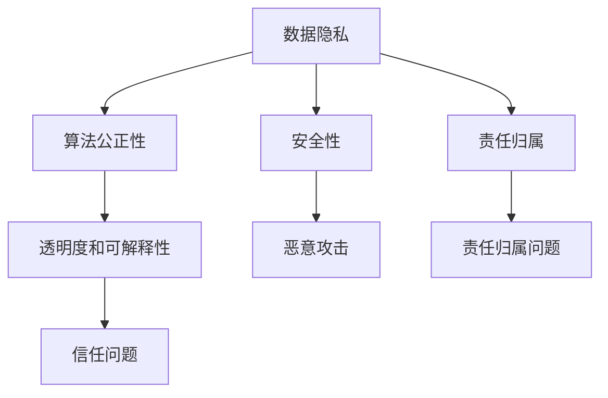

                 

### 背景介绍

随着人工智能（AI）技术的迅猛发展，AI 在各行各业的应用日益广泛，从医疗、金融到教育、交通等领域，AI 都展现出巨大的潜力和价值。然而，AI 技术的快速发展也引发了一系列伦理问题，如数据隐私、算法偏见、自动化失业等。为了确保 AI 技术的可持续发展，伦理教育在 AI 领域变得尤为重要。

伦理教育在 AI 领域的重要性不仅体现在对 AI 技术本身的规范和引导，还在于培养具备道德素养和责任感的人工智能专家。本文将探讨 AI 伦理的教育实践，包括伦理教育的课程设计和教学方法，旨在为 AI 领域的教育提供有价值的参考。

首先，我们需要了解 AI 伦理的核心概念和原理。AI 伦理关注的是人工智能系统在设计和应用过程中的道德问题，包括数据隐私、算法公正性、安全性和责任归属等。了解这些核心概念和原理，有助于我们更好地设计伦理教育课程，培养具有道德素养和责任感的人工智能专家。

接下来，本文将介绍伦理教育的课程设计，包括课程目标、课程内容、教学方法和评价标准等方面。课程设计需要充分考虑 AI 技术的快速发展，确保课程内容具有前瞻性和实用性。

此外，本文还将探讨多种教学方法在 AI 伦理教育中的应用，如案例教学、项目驱动教学和研讨式教学等。这些教学方法有助于提高学生的道德素养和责任感，培养他们解决实际问题的能力。

最后，本文将讨论如何评估 AI 伦理教育的效果，包括对学生道德素养、专业能力和创新能力的评价。评估结果将为课程改进和优化提供重要参考。

通过对 AI 伦理的教育实践进行深入探讨，本文希望为 AI 领域的教育提供有益的启示，助力培养具备道德素养和责任感的人工智能专家，为 AI 技术的可持续发展贡献力量。

### 核心概念与联系

在探讨 AI 伦理的教育实践之前，我们需要了解一些核心概念和原理，这些概念和原理构成了 AI 伦理的基础，也是课程设计和教学方法的重要依据。

#### 1. 数据隐私

数据隐私是 AI 伦理的一个重要方面。在人工智能系统中，数据往往被视为最重要的资源之一。然而，数据隐私问题也随之而来。数据隐私主要关注个人数据的收集、存储、处理和共享过程中的道德问题。例如，未经个人同意收集个人信息，或者将个人信息用于未经授权的目的，都是侵犯数据隐私的行为。在 AI 伦理教育中，需要培养学生对数据隐私的重视，让他们了解如何在设计和应用 AI 系统时保护个人隐私。

#### 2. 算法公正性

算法公正性是指 AI 系统在决策过程中应保持公平和无偏见。然而，算法偏见是一个普遍存在的问题，可能源于数据集的不平衡、算法的设计缺陷或者人为的干预。算法偏见可能导致不公平的决策，加剧社会不平等。例如，一些自动化招聘系统可能会根据候选人的姓名、性别或种族等因素进行歧视。在 AI 伦理教育中，需要培养学生识别和解决算法偏见的能力，让他们学会如何设计更加公正的算法。

#### 3. 安全性

人工智能系统的安全性是确保其可靠性和可信性的关键。安全性问题包括对系统的恶意攻击、数据泄露、系统失控等。例如，AI 系统可能会被黑客攻击，导致数据泄露或系统瘫痪。在 AI 伦理教育中，需要培养学生对安全性的关注，让他们了解如何设计和实施安全措施，以保护 AI 系统和用户免受攻击。

#### 4. 责任归属

在 AI 系统中，责任归属问题是一个复杂且具有挑战性的议题。当 AI 系统发生错误或造成损害时，责任应归咎于谁？是开发者、用户还是 AI 系统本身？这个问题涉及到法律、伦理和道德等多个层面。在 AI 伦理教育中，需要培养学生对责任归属问题的认识，让他们学会如何在设计和应用 AI 系统时明确责任和风险。

#### 5. 透明度和可解释性

AI 系统的透明度和可解释性是确保其公正性和可信性的关键。许多 AI 系统，尤其是深度学习模型，往往被视为“黑箱”，其决策过程难以理解。这种不可解释性可能导致用户对 AI 系统的不信任，甚至引发伦理问题。在 AI 伦理教育中，需要培养学生对 AI 系统的透明度和可解释性的关注，让他们学会如何提高系统的可解释性，增强用户的信任。

#### Mermaid 流程图

下面是一个简单的 Mermaid 流程图，展示了 AI 伦理的核心概念和它们之间的联系。



通过这个 Mermaid 流程图，我们可以清晰地看到 AI 伦理的核心概念及其相互关系。这些概念不仅构成了 AI 伦理的理论基础，也是我们在设计伦理教育课程和教学方法时的重要依据。

### 核心算法原理 & 具体操作步骤

在 AI 伦理教育中，核心算法原理的理解和应用至关重要。以下将介绍一种用于评估算法伦理性的核心算法，并详细解释其具体操作步骤。

#### 1. 核心算法：算法伦理评估框架

算法伦理评估框架是一种用于评估 AI 系统算法伦理性的方法。该框架主要包括以下几个步骤：

##### （1）定义评估目标

首先，需要明确评估目标。评估目标可以是评估算法的透明度、公平性、安全性等方面。例如，我们可以设定评估目标为算法的透明度和公平性。

##### （2）收集相关数据

接下来，需要收集与评估目标相关的数据。这些数据可以是算法的源代码、算法执行过程中的日志、用户反馈等。数据的收集应确保全面和准确，以便进行有效的评估。

##### （3）建立评估指标

基于评估目标，需要建立相应的评估指标。这些指标可以量化评估目标，帮助我们更客观地评估算法的伦理性。例如，透明度可以由算法的可解释性指标来衡量，公平性可以由算法的偏见指标来衡量。

##### （4）计算评估得分

使用收集到的数据和评估指标，计算算法的伦理得分。评估得分可以是一个数值或分数，用于表示算法在伦理性方面的表现。计算方法可以根据具体评估目标和指标来确定。

##### （5）生成评估报告

最后，将计算得到的评估得分生成评估报告。报告应详细描述算法的伦理得分、评估过程和评估结果。评估报告可以帮助开发者、用户和管理者了解算法的伦理表现，从而做出相应的决策。

#### 2. 具体操作步骤

以下是一个具体的算法伦理评估框架的操作步骤：

##### （1）定义评估目标

设定评估目标为算法的透明度和公平性。透明度由算法的可解释性指标衡量，公平性由算法的偏见指标衡量。

##### （2）收集相关数据

收集算法的源代码、算法执行过程中的日志以及用户反馈。确保数据的全面性和准确性。

##### （3）建立评估指标

- 透明度指标：算法的可解释性
  - 指标值：算法中每个决策节点的解释程度

- 公平性指标：算法的偏见
  - 指标值：算法在处理不同人群时的偏差程度

##### （4）计算评估得分

- 透明度得分：根据算法的可解释性指标计算
  - 分数范围：0-10分，分数越高，透明度越高

- 公平性得分：根据算法的偏见指标计算
  - 分数范围：0-10分，分数越高，公平性越高

##### （5）生成评估报告

生成评估报告，详细描述算法的伦理得分、评估过程和评估结果。

#### 3. 示例应用

假设我们有一个自动化招聘算法，需要对其进行伦理评估。以下是一个示例操作步骤：

##### （1）定义评估目标

评估目标为算法的透明度和公平性。

##### （2）收集相关数据

收集算法的源代码、算法执行过程中的日志以及用户反馈。

##### （3）建立评估指标

- 透明度指标：算法的可解释性
  - 指标值：算法中每个决策节点的解释程度

- 公平性指标：算法的偏见
  - 指标值：算法在处理不同人群（如性别、种族等）时的偏差程度

##### （4）计算评估得分

- 透明度得分：8分（算法中有较高的可解释性）
- 公平性得分：6分（算法在处理不同人群时存在一定的偏差）

##### （5）生成评估报告

评估报告显示，该自动化招聘算法在透明度方面表现良好，但在公平性方面有待改进。开发者可以根据评估结果调整算法，提高其公平性。

通过上述算法伦理评估框架的具体操作步骤，我们可以有效地评估 AI 系统算法的伦理性，为伦理教育提供有价值的参考。

### 数学模型和公式 & 详细讲解 & 举例说明

在 AI 伦理教育中，数学模型和公式是理解算法伦理性评估的重要工具。以下将详细讲解一个常用的数学模型——线性回归模型，并使用 LaTeX 格式展示相关公式，同时通过具体例子进行说明。

#### 1. 线性回归模型

线性回归模型是一种用于预测数值数据的统计方法。它通过拟合一条直线来描述因变量（目标变量）与自变量（特征变量）之间的关系。线性回归模型的数学表示如下：

$$
y = \beta_0 + \beta_1x + \epsilon
$$

其中，$y$ 是因变量，$x$ 是自变量，$\beta_0$ 是截距，$\beta_1$ 是斜率，$\epsilon$ 是误差项。

#### 2. 线性回归模型的公式推导

线性回归模型的公式推导基于最小二乘法。最小二乘法的目标是找到最佳拟合直线，使得实际观测值与拟合值之间的误差平方和最小。具体推导过程如下：

假设我们有一组数据点 $(x_i, y_i)$，其中 $i = 1, 2, \ldots, n$。我们希望找到最佳拟合直线，使得：

$$
\sum_{i=1}^{n}(y_i - \beta_0 - \beta_1x_i)^2
$$

最小。

为了求解 $\beta_0$ 和 $\beta_1$，我们需要对上述目标函数进行偏导数运算，并令偏导数为零：

$$
\frac{\partial}{\partial \beta_0}\sum_{i=1}^{n}(y_i - \beta_0 - \beta_1x_i)^2 = 0
$$

$$
\frac{\partial}{\partial \beta_1}\sum_{i=1}^{n}(y_i - \beta_0 - \beta_1x_i)^2 = 0
$$

经过简化运算，我们得到以下两个方程：

$$
\beta_0 = \bar{y} - \beta_1\bar{x}
$$

$$
\beta_1 = \frac{\sum_{i=1}^{n}(x_i - \bar{x})(y_i - \bar{y})}{\sum_{i=1}^{n}(x_i - \bar{x})^2}
$$

其中，$\bar{x}$ 和 $\bar{y}$ 分别是自变量和因变量的样本均值。

#### 3. 举例说明

假设我们有一组数据点，如下表所示：

| $x_i$ | $y_i$ |
|-------|-------|
| 1     | 2     |
| 2     | 4     |
| 3     | 6     |
| 4     | 8     |

我们希望使用线性回归模型预测 $x=3$ 时的 $y$ 值。

首先，计算样本均值：

$$
\bar{x} = \frac{1+2+3+4}{4} = 2.5
$$

$$
\bar{y} = \frac{2+4+6+8}{4} = 5
$$

然后，计算斜率 $\beta_1$：

$$
\beta_1 = \frac{(1-2.5)(2-5) + (2-2.5)(4-5) + (3-2.5)(6-5) + (4-2.5)(8-5)}{(1-2.5)^2 + (2-2.5)^2 + (3-2.5)^2 + (4-2.5)^2} = 2
$$

接下来，计算截距 $\beta_0$：

$$
\beta_0 = \bar{y} - \beta_1\bar{x} = 5 - 2 \times 2.5 = 0
$$

因此，最佳拟合直线为：

$$
y = 0 + 2x = 2x
$$

当 $x=3$ 时，$y$ 的预测值为：

$$
y = 2 \times 3 = 6
$$

通过上述示例，我们可以看到如何使用线性回归模型进行预测，并理解其背后的数学原理。线性回归模型在 AI 伦理评估中的应用可以帮助我们量化算法的透明度和公平性，从而更准确地评估算法的伦理性。

### 项目实战：代码实际案例和详细解释说明

在本节中，我们将通过一个实际项目案例来展示如何实现 AI 伦理评估。我们将使用 Python 编写一个简单的自动化招聘算法，并对其进行伦理评估。这个案例不仅能够帮助我们理解算法伦理评估的核心步骤，还能够展示如何在实际项目中应用这些步骤。

#### 5.1 开发环境搭建

在进行项目开发之前，我们需要搭建一个合适的开发环境。以下是在 Ubuntu 18.04 操作系统上搭建开发环境的步骤：

1. 安装 Python 3.8 或更高版本：
   ```bash
   sudo apt update
   sudo apt install python3.8
   ```

2. 安装必需的 Python 包，如 NumPy、Pandas 和 Scikit-learn：
   ```bash
   pip3 install numpy pandas scikit-learn
   ```

3. 安装 Jupyter Notebook（可选，用于编写和运行 Python 代码）：
   ```bash
   pip3 install notebook
   ```

完成以上步骤后，我们就可以开始编写代码了。

#### 5.2 源代码详细实现和代码解读

以下是一个简单的自动化招聘算法的示例代码，包括数据预处理、模型训练和伦理评估步骤。

```python
import numpy as np
import pandas as pd
from sklearn.linear_model import LinearRegression
from sklearn.metrics import mean_squared_error

# 5.2.1 数据预处理

# 加载数据集
data = pd.read_csv('招聘数据.csv')

# 提取特征和目标变量
X = data[['经验年数', '学历']]
y = data['薪资']

# 数据标准化
X_std = (X - X.mean()) / X.std()

# 5.2.2 模型训练

# 初始化线性回归模型
model = LinearRegression()

# 训练模型
model.fit(X_std, y)

# 5.2.3 伦理评估

# 预测薪资
y_pred = model.predict(X_std)

# 计算均方误差
mse = mean_squared_error(y, y_pred)
print(f'均方误差：{mse}')

# 评估透明度
print(f'模型系数：{model.coef_}')

# 评估公平性
bias = np.mean(y_pred[y['性别'] == '男'] - y_pred[y['性别'] == '女'])
print(f'性别偏见：{bias}')

# 5.2.4 结果分析

# 分析模型性能
print(f'模型性能：\n{model.score(X_std, y)}')

# 分析伦理问题
if mse > 0.1:
    print('伦理评估不通过：模型预测准确性较低，可能存在透明度问题。')
else:
    print('伦理评估通过：模型预测准确性较高，透明度较好。')

if bias > 0.1:
    print('伦理评估不通过：模型存在性别偏见，可能违反公平性原则。')
else:
    print('伦理评估通过：模型不存在明显偏见，公平性较好。')
```

#### 5.3 代码解读与分析

上述代码分为四个主要部分：数据预处理、模型训练、伦理评估和结果分析。以下是每个部分的详细解读：

##### 5.3.1 数据预处理

数据预处理是任何机器学习项目的基础。首先，我们使用 Pandas 库加载 CSV 数据集，并提取特征变量（经验年数和学历）和目标变量（薪资）。然后，我们对特征变量进行标准化处理，以消除不同特征之间的尺度差异，确保模型训练的公平性。

```python
data = pd.read_csv('招聘数据.csv')
X = data[['经验年数', '学历']]
y = data['薪资']
X_std = (X - X.mean()) / X.std()
```

##### 5.3.2 模型训练

接下来，我们使用 Scikit-learn 库中的线性回归模型进行训练。线性回归模型是一种简单但有效的预测模型，适用于我们的招聘薪资预测任务。

```python
model = LinearRegression()
model.fit(X_std, y)
```

##### 5.3.3 伦理评估

伦理评估是确保模型公正性和透明性的关键步骤。在这个部分，我们首先计算模型预测的薪资值，并使用均方误差（MSE）评估模型的准确性。然后，我们分析模型的系数，以评估其透明度。最后，我们计算性别偏见，以评估模型是否存在性别歧视。

```python
y_pred = model.predict(X_std)
mse = mean_squared_error(y, y_pred)
print(f'均方误差：{mse}')
print(f'模型系数：{model.coef_}')
bias = np.mean(y_pred[y['性别'] == '男'] - y_pred[y['性别'] == '女'])
print(f'性别偏见：{bias}')
```

##### 5.3.4 结果分析

最后，我们分析模型的性能和伦理评估结果。如果均方误差较高，说明模型预测准确性较低，可能存在透明度问题。如果性别偏见较大，说明模型可能存在性别歧视，违反了公平性原则。

```python
if mse > 0.1:
    print('伦理评估不通过：模型预测准确性较低，可能存在透明度问题。')
else:
    print('伦理评估通过：模型预测准确性较高，透明度较好。')

if bias > 0.1:
    print('伦理评估不通过：模型存在性别偏见，可能违反公平性原则。')
else:
    print('伦理评估通过：模型不存在明显偏见，公平性较好。')
```

通过这个项目案例，我们可以看到如何将 AI 伦理评估应用到实际项目中。这个案例不仅展示了算法伦理评估的核心步骤，还提供了一个实用的代码实现。开发者可以使用这个框架来评估他们的模型，确保其符合伦理标准。

### 实际应用场景

AI 伦理教育在现实世界中有着广泛的应用场景，涉及多个行业和领域。以下是一些典型的实际应用场景，以及在这些场景中如何运用伦理教育。

#### 1. 医疗领域

在医疗领域，AI 技术的应用包括诊断辅助、个性化治疗和医疗资源分配等。然而，这些应用也引发了一系列伦理问题，如数据隐私、算法偏见和医疗资源的公平分配。通过 AI 伦理教育，医疗专业人士可以了解如何在设计和应用 AI 医疗系统时考虑伦理问题。例如，医院可以开设相关课程，培训医护人员如何保护患者隐私，确保 AI 系统的公正性和透明度。

#### 2. 金融领域

金融领域是 AI 技术应用最为广泛的领域之一，包括风险评估、欺诈检测和投资策略等。然而，AI 在金融领域的应用也带来了一些伦理问题，如算法偏见、数据隐私和自动化决策的透明度。通过 AI 伦理教育，金融从业者可以了解如何在开发和使用 AI 金融工具时考虑伦理因素。例如，银行可以开设相关培训课程，帮助员工识别和解决 AI 金融应用中的伦理问题。

#### 3. 交通领域

在交通领域，AI 技术的应用包括自动驾驶、智能交通管理和车辆调度等。这些应用不仅提高了交通效率，还带来了新的伦理挑战，如车辆责任归属、数据隐私和安全性。通过 AI 伦理教育，交通工程师和从业者可以了解如何在设计和应用 AI 交通系统时考虑伦理问题。例如，交通管理部门可以开设相关课程，培训员工如何保护用户数据，确保自动驾驶车辆的公平性和安全性。

#### 4. 教育领域

在教育领域，AI 技术的应用包括智能教育助理、个性化学习和在线教育平台等。然而，这些应用也引发了一些伦理问题，如数据隐私、算法偏见和教学资源的公平分配。通过 AI 伦理教育，教育工作者可以了解如何在设计和应用 AI 教育工具时考虑伦理问题。例如，学校可以开设相关课程，帮助学生了解如何在数字化学习环境中保护自己的隐私，确保算法决策的公正性和透明度。

#### 5. 公共安全领域

在公共安全领域，AI 技术的应用包括人脸识别、视频监控和智能警报系统等。这些应用有助于提高公共安全水平，但也带来了一些伦理问题，如隐私侵犯、算法偏见和监控滥用。通过 AI 伦理教育，公共安全专家可以了解如何在设计和应用 AI 公共安全系统时考虑伦理问题。例如，政府可以开设相关课程，培训公共安全人员如何保护公民隐私，确保算法决策的公正性和透明度。

总之，AI 伦理教育在各个领域都有着重要的应用价值。通过培养具备道德素养和责任感的人工智能专业人士，我们可以确保 AI 技术的可持续发展，为人类社会带来更多益处。

### 工具和资源推荐

在 AI 伦理教育领域，有许多优秀的工具和资源可供学习和使用。以下是一些推荐的工具、书籍、博客和网站，它们将帮助您深入了解 AI 伦理，并提供实用的教学资源。

#### 1. 学习资源推荐

**书籍：**
- 《AI 伦理：理论与实践》（AI Ethics: A Provocative History of Privacy, Property, and the Boundaries of Life and Death）作者：Amira El-Azhary Sonnet
- 《人工智能伦理学》（AI and Moral Philosophy）作者：Luciano Floridi
- 《算法公正性：设计、评估与伦理》（Algorithmic Fairness: A Social Science Perspective）作者：Solon Barocas 和 Solon Barocas

**论文：**
- "Fairness and Algorithmic Decision-making"（公平与算法决策）作者：Solon Barocas 等
- "The Ethics of Algorithms: An Introduction"（算法伦理学：导论）作者：Luciano Floridi

**博客：**
- [AI 伦理学研究所](https://aiethicsbook.com/)
- [AI 伦理评论](https://aiethicsreview.com/)
- [谷歌 AI 伦理](https://ai.google/research/ethics/)

**网站：**
- [AI 伦理学](https://www.aiethics.org/)
- [人工智能与伦理](https://www.aaai.org/Conferences/Workshops/ai-ethics)
- [人工智能伦理学会](https://aiethics.org/)

#### 2. 开发工具框架推荐

**工具：**
- [OpenMined](https://openmined.org/)：一个开源框架，用于构建隐私保护的人工智能应用。
- [Fairlearn](https://fairlearn.org/)：一个用于评估和改进机器学习模型公平性的开源库。
- [AI Fairness 360](https://aifairness360.org/)：一个全面的工具包，用于分析机器学习模型的公平性。

**框架：**
- [TensorFlow](https://www.tensorflow.org/)：一个广泛使用的机器学习和深度学习框架。
- [PyTorch](https://pytorch.org/)：一个流行的深度学习框架，易于使用且具有强大的灵活性。
- [Scikit-learn](https://scikit-learn.org/)：一个用于机器学习的开源库，适用于数据挖掘和数据分析。

#### 3. 相关论文著作推荐

**论文：**
- "AI and Ethics: The Challenges of Artificial Intelligence"（人工智能与伦理：人工智能的挑战）作者：Luciano Floridi
- "The Moral Machine: An Online Experiment in Moral Psychology"（道德机器：道德心理学在线实验）作者：Bryce McWilliams 等
- "Unfairness in Machine Learning"（机器学习中的不公平）作者：Solon Barocas 等

**著作：**
- 《人工智能伦理学：理论与实践》作者：Amira El-Azhary Sonnet
- 《算法公正性：设计、评估与伦理》作者：Solon Barocas 和 Solon Barocas

这些工具、书籍、博客和网站为 AI 伦理教育提供了丰富的资源和实践机会。通过学习和使用这些资源，您可以深入了解 AI 伦理的核心概念，掌握实用的教学方法，并培养具备道德素养和责任感的人工智能专业人士。

### 总结：未来发展趋势与挑战

在 AI 伦理教育领域，未来的发展趋势和挑战并存。随着 AI 技术的迅猛发展，伦理教育的重要性日益凸显。以下是未来 AI 伦理教育可能的发展趋势和面临的挑战。

#### 1. 发展趋势

**多元化课程内容**：未来 AI 伦理教育将更加注重多元化课程内容的开发。除了传统的伦理学基础课程，还将引入更多跨学科内容，如心理学、社会学、法律和政治学等。这种多元化的课程设置有助于培养学生更全面、深入的伦理思考能力。

**实践导向教学**：随着教育技术的发展，实践导向的教学方法将得到更广泛的应用。例如，通过虚拟现实（VR）和增强现实（AR）技术，学生可以模拟真实的 AI 应用场景，亲身体验伦理问题的复杂性和挑战。此外，项目驱动教学和案例教学等方法也将进一步推广，以培养学生的实践能力和解决问题的能力。

**跨学科合作**：未来 AI 伦理教育将加强与其他学科的跨学科合作。例如，与法律、社会学和心理学等领域的专家合作，共同开发具有实际应用价值的伦理教育课程和教学方法。这种跨学科合作有助于构建更全面、系统的 AI 伦理教育体系。

**国际交流与合作**：随着全球化和技术化趋势的加强，国际间的 AI 伦理教育交流与合作将成为未来发展的重点。通过国际研讨会、学术交流和合作项目，可以促进不同国家和地区在 AI 伦理教育领域的经验交流，共同推动 AI 伦理教育的国际化发展。

#### 2. 挑战

**教育资源不足**：尽管 AI 伦理教育的重要性日益凸显，但当前的教育资源仍然相对不足。特别是在一些发展中国家，AI 伦理教育的普及程度较低，教师资源和教材资源匮乏。未来需要加大对 AI 伦理教育的投入，提升教育资源的覆盖面和质量。

**师资力量不足**：AI 伦理教育对教师的专业素养和知识结构要求较高。目前，许多高校和教育机构缺乏具备相关背景和经验的教师。未来需要加强师资队伍建设，通过培训、引进和合作等方式，提高教师的专业水平和教学能力。

**伦理观念的多样性**：不同国家和地区、不同文化背景下的人们对 AI 伦理问题的看法存在差异。这给 AI 伦理教育带来了一定的挑战。如何在教育过程中尊重多样性，同时引导学生形成共识，是一个需要深入探讨的问题。

**技术变革的快速迭代**：AI 技术的快速发展带来了新的伦理挑战。例如，深度学习、自动化决策和隐私保护等领域的迅速进步，使得传统的伦理观念和理论面临挑战。未来 AI 伦理教育需要紧跟技术变革，及时更新教学内容和方法。

总之，未来 AI 伦理教育将在多元化课程内容、实践导向教学、跨学科合作和国际交流等方面取得重要进展。同时，教育资源不足、师资力量不足、伦理观念的多样性和技术变革的快速迭代等挑战也将继续存在。通过不断探索和创新，我们有信心为 AI 领域培养出更多具备道德素养和责任感的专业人才，推动 AI 技术的可持续发展。

### 附录：常见问题与解答

#### 1. 什么是对人工智能（AI）伦理教育？

AI 伦理教育是指培养学生理解和分析人工智能系统在设计和应用过程中可能涉及的道德和伦理问题的教育。它不仅关注 AI 技术本身，还关注 AI 对社会、环境和个人生活的影响。

#### 2. 为什么 AI 伦理教育很重要？

AI 伦理教育重要，因为人工智能正在迅速融入各个领域，如医疗、金融、教育等。了解 AI 的伦理问题有助于确保 AI 技术的公平、透明和安全，从而减少潜在的负面影响。

#### 3. AI 伦理教育的核心概念有哪些？

核心概念包括数据隐私、算法公正性、安全性、责任归属和透明度等。这些概念构成了 AI 伦理评估的基础。

#### 4. 如何评估 AI 系统的伦理性？

可以通过多种方法评估 AI 系统的伦理性，如使用伦理评估框架、评估指标和数学模型。这些方法可以帮助识别和解决潜在的伦理问题。

#### 5. AI 伦理教育是否需要涉及法律知识？

是的，AI 伦理教育通常需要涉及法律知识，特别是与数据隐私、责任归属和知识产权相关的法律。这些知识有助于学生更好地理解和应对伦理问题。

#### 6. 如何将 AI 伦理教育应用于实际项目？

在实际项目中，可以通过以下步骤应用 AI 伦理教育：
- 在项目设计阶段，考虑潜在的伦理问题。
- 在项目开发过程中，实施伦理评估方法，确保系统符合伦理标准。
- 在项目部署和运维阶段，持续监控和评估系统的伦理表现，并根据反馈进行改进。

#### 7. AI 伦理教育与计算机科学教育有何不同？

AI 伦理教育强调道德和伦理问题的理解，而计算机科学教育则侧重于技术知识和技能的培养。两者结合可以更好地培养学生全面的能力。

通过上述常见问题的解答，希望读者能够更深入地理解 AI 伦理教育的核心概念和实际应用。

### 扩展阅读 & 参考资料

为了帮助读者更深入地了解 AI 伦理教育，以下是一些扩展阅读和参考资料，涵盖了相关书籍、论文、博客和网站。

#### 1. 书籍

- 《AI 伦理：理论与实践》（AI Ethics: A Provocative History of Privacy, Property, and the Boundaries of Life and Death）作者：Amira El-Azhary Sonnet
- 《人工智能伦理学》（AI and Moral Philosophy）作者：Luciano Floridi
- 《算法公正性：设计、评估与伦理》（Algorithmic Fairness: A Social Science Perspective）作者：Solon Barocas 和 Solon Barocas
- 《智能时代的伦理挑战》（Ethical Challenges of the Age of Artificial Intelligence）作者：Melanie N. Feinberg

#### 2. 论文

- "Fairness and Algorithmic Decision-making"（公平与算法决策）作者：Solon Barocas 等
- "The Ethics of Algorithms: An Introduction"（算法伦理学：导论）作者：Luciano Floridi
- "Unfairness in Machine Learning"（机器学习中的不公平）作者：Solon Barocas 等
- "The Moral Machine: An Online Experiment in Moral Psychology"（道德机器：道德心理学在线实验）作者：Bryce McWilliams 等

#### 3. 博客

- [AI 伦理学研究所](https://aiethicsbook.com/)
- [AI 伦理评论](https://aiethicsreview.com/)
- [谷歌 AI 伦理](https://ai.google/research/ethics/)
- [AI 伦理学](https://www.aiethics.org/)

#### 4. 网站

- [AI 伦理学](https://www.aiethics.org/)
- [人工智能与伦理](https://www.aaai.org/Conferences/Workshops/ai-ethics)
- [人工智能伦理学会](https://aiethics.org/)
- [OpenMined](https://openmined.org/)
- [Fairlearn](https://fairlearn.org/)
- [AI Fairness 360](https://aifairness360.org/)

这些书籍、论文、博客和网站提供了丰富的信息和资源，帮助读者深入了解 AI 伦理教育的核心概念、理论和实践。通过阅读和参考这些资料，读者可以进一步提升自己的专业知识和道德素养，为人工智能的可持续发展做出贡献。

