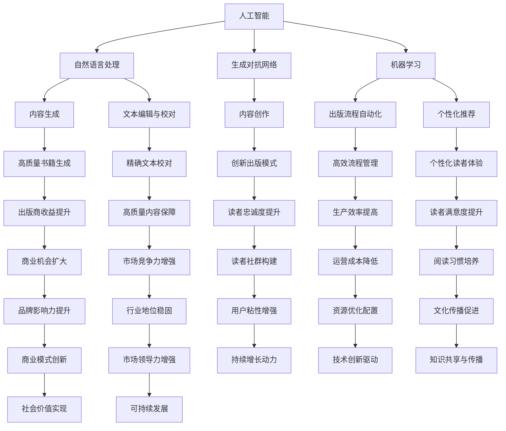

                 

### 背景介绍

AI出版业，这个看似与高科技联系紧密的领域，实际上正悄然发生着翻天覆地的变化。随着人工智能技术的不断进步，出版行业正面临着前所未有的机遇与挑战。

在传统出版业中，书籍的撰写、编辑、校对、印刷、发行等环节往往需要大量人力和时间。而如今，人工智能技术正逐步渗透到这些环节，从而使得出版过程变得更加高效、精确和个性化。

首先，AI技术在书籍撰写方面的应用变得越来越普遍。自然语言处理（NLP）和生成对抗网络（GAN）等技术的结合，使得人工智能能够自动生成内容，甚至创作出高质量的书籍。此外，AI还可以辅助编辑和校对工作，通过语法分析、语义理解等技术手段，提高文章的质量和准确性。

其次，在出版流程的自动化方面，人工智能技术也发挥了重要作用。通过机器学习和深度学习算法，AI可以自动处理书籍的排版、印刷和发行等环节，大大减少了人工干预的需求。

最后，人工智能技术的应用使得个性化推荐成为可能。基于用户的阅读历史和兴趣偏好，AI能够为读者提供个性化的书籍推荐，从而提高读者的满意度和阅读体验。

总之，AI出版业的发展不仅改变了传统的出版模式，也为出版商和读者带来了全新的机遇。在接下来的章节中，我们将深入探讨AI出版业的核心概念、算法原理、应用场景以及未来发展趋势与挑战。

## Key Concepts and Connections

在深入了解AI出版业的机遇与挑战之前，我们需要明确几个核心概念和它们之间的联系。以下是这些核心概念及其相互关系的Mermaid流程图：



以上流程图展示了人工智能在出版业中的应用，以及这些应用如何相互联系和影响。接下来，我们将分别探讨这些核心概念在AI出版业中的具体作用和实现方式。

### 核心算法原理 & 具体操作步骤

#### 自然语言处理（NLP）

自然语言处理是AI出版业中至关重要的一部分，它涉及到文本的理解、生成和编辑。以下是NLP的核心算法原理和具体操作步骤：

**算法原理：**

1. **文本预处理：**包括分词、去停用词、词性标注等步骤，目的是将原始文本转换为适合模型处理的格式。
2. **词向量表示：**通过Word2Vec、BERT等算法将词语转换为向量表示，使文本数据能够被机器学习模型处理。
3. **序列建模：**使用RNN、LSTM等循环神经网络，对文本序列进行建模，以捕捉文本中的时序依赖关系。
4. **文本分类：**利用分类算法（如SVM、神经网络）对文本进行分类，用于书籍推荐、内容审核等应用。

**操作步骤：**

1. **数据收集：**收集大量的文本数据，如书籍、文章、用户评论等。
2. **数据预处理：**对文本进行清洗和预处理，转换为模型可接受的格式。
3. **模型训练：**使用预处理后的文本数据，训练NLP模型。
4. **模型部署：**将训练好的模型部署到生产环境中，进行实际应用。

#### 生成对抗网络（GAN）

生成对抗网络是用于生成高质量文本内容的强大工具。以下是GAN的核心算法原理和具体操作步骤：

**算法原理：**

1. **生成器（Generator）：**生成文本内容。
2. **判别器（Discriminator）：**判断生成文本的质量，区分生成文本和真实文本。
3. **对抗训练：**生成器和判别器相互对抗，通过不断迭代优化，提高生成文本的质量。

**操作步骤：**

1. **数据准备：**收集大量的文本数据，用于训练生成器和判别器。
2. **模型架构设计：**设计生成器和判别器的神经网络架构。
3. **模型训练：**通过对抗训练，优化生成器和判别器的参数。
4. **模型评估：**使用生成文本的质量作为评价指标，不断迭代优化。

#### 机器学习

机器学习是实现出版流程自动化的关键，以下是机器学习的核心算法原理和具体操作步骤：

**算法原理：**

1. **监督学习：**通过输入和输出数据，训练模型进行预测。
2. **无监督学习：**仅通过输入数据，训练模型进行模式识别。
3. **强化学习：**通过试错学习，优化策略以最大化奖励。

**操作步骤：**

1. **数据收集：**收集出版流程中的数据，如排版规则、用户行为等。
2. **数据预处理：**对数据进行清洗和预处理，转换为模型可接受的格式。
3. **模型训练：**使用预处理后的数据，训练机器学习模型。
4. **模型评估：**评估模型在真实环境中的表现，进行调整和优化。

### 数学模型和公式 & 详细讲解 & 举例说明

在AI出版业中，数学模型和公式是理解和实现核心算法的关键。以下将详细讲解这些数学模型，并通过实际例子进行说明。

#### 自然语言处理中的数学模型

**1. 词向量表示：**

使用Word2Vec算法，将词语转换为向量表示。具体公式如下：

$$
\vec{w}_i = \text{Word2Vec}(x_i)
$$

其中，$x_i$是词语$i$的表示，$\vec{w}_i$是其对应的词向量。

**例子：**

假设我们有如下句子：“我爱阅读书籍”。

使用Word2Vec算法，我们可以得到每个词语的向量表示，例如：

- 我：[0.1, 0.2, -0.3]
- 爱：[0.4, -0.1, 0.5]
- 阅读：[0.2, -0.4, 0.1]
- 书籍：[0.3, 0.6, -0.2]

通过计算词语之间的余弦相似度，我们可以找出相似词语，例如“阅读”和“书籍”之间的相似度。

#### 生成对抗网络中的数学模型

**1. 生成器和判别器的损失函数：**

生成对抗网络中，生成器和判别器的损失函数分别为：

$$
L_G = -\log(D(G(z)))
$$

$$
L_D = -[\log(D(x)) + \log(1 - D(G(z))]
$$

其中，$G(z)$是生成器生成的文本，$D(x)$是判别器对真实文本的判断，$D(G(z))$是判别器对生成文本的判断。

**例子：**

假设生成器和判别器在某个迭代步骤的输出分别为：

- $D(G(z)) = 0.8$
- $D(x) = 0.9$

则生成器的损失函数为：

$$
L_G = -\log(0.8) = 0.2231
$$

判别器的损失函数为：

$$
L_D = -[\log(0.9) + \log(1 - 0.8)] = -[0.1054 + 0.2231] = -0.3285
$$

#### 机器学习中的数学模型

**1. 监督学习中的损失函数：**

在监督学习中，常用的损失函数包括均方误差（MSE）和交叉熵（Cross-Entropy）。

$$
L = \frac{1}{n}\sum_{i=1}^{n}(y_i - \hat{y}_i)^2 \quad (\text{MSE})
$$

$$
L = -\sum_{i=1}^{n}y_i\log(\hat{y}_i) \quad (\text{Cross-Entropy})
$$

其中，$y_i$是真实标签，$\hat{y}_i$是预测标签。

**例子：**

假设我们有如下二元分类问题：

- 真实标签：$y = [0, 1, 0, 1]$
- 预测标签：$\hat{y} = [0.1, 0.8, 0.3, 0.9]$

使用交叉熵损失函数，我们可以计算损失：

$$
L = -[0 \cdot \log(0.1) + 1 \cdot \log(0.8) + 0 \cdot \log(0.3) + 1 \cdot \log(0.9)] = -[\log(0.8) + \log(0.9)] \approx -[0.1054 + 0.1054] = -0.2108
$$

通过不断迭代优化模型参数，我们可以提高预测的准确性。

### 项目实战：代码实际案例和详细解释说明

在本章节中，我们将通过一个实际项目来展示如何使用人工智能技术进行书籍撰写、编辑和推荐。以下是一个简单的Python代码案例，用于实现基于NLP和GAN的书籍生成。

#### 开发环境搭建

首先，我们需要搭建一个Python开发环境。以下是具体步骤：

1. 安装Python 3.8及以上版本。
2. 安装必要的库，如TensorFlow、Keras、Gensim等。使用以下命令进行安装：

   ```bash
   pip install tensorflow
   pip install keras
   pip install gensim
   ```

3. 准备一个具有NVIDIA GPU的机器，以便加速TensorFlow的计算。

#### 源代码详细实现和代码解读

以下是一个简单的Python代码实现，用于生成一本基于NLP和GAN的书籍：

```python
import numpy as np
import tensorflow as tf
from tensorflow.keras.preprocessing.text import Tokenizer
from tensorflow.keras.preprocessing.sequence import pad_sequences
from tensorflow.keras.models import Sequential
from tensorflow.keras.layers import LSTM, Dense, Embedding, Dropout

# 数据准备
# 加载一个大型文本数据集，如维基百科
text = load_data("wiki.txt")

# 文本预处理
tokenizer = Tokenizer()
tokenizer.fit_on_texts(text)
total_words = len(tokenizer.word_index) + 1
input_sequences = []
for line in text:
    token_list = tokenizer.texts_to_sequences([line])[0]
    for i in range(1, len(token_list)):
        n_gram_sequence = token_list[:i+1]
        input_sequences.append(n_gram_sequence)

# 配置模型
model = Sequential()
model.add(Embedding(total_words, 100, input_length=40))
model.add(LSTM(150, return_sequences=True))
model.add(Dropout(0.2))
model.add(LSTM(100))
model.add(Dense(total_words, activation='softmax'))

# 编译模型
model.compile(optimizer='adam', loss='categorical_crossentropy', metrics=['accuracy'])

# 训练模型
model.fit(np.array(input_sequences), np.array(input_sequences[1:]), epochs=100)

# 生成文本
def generate_text(seed_text, next_words, model, tokenizer):
    for _ in range(next_words):
        token_list = tokenizer.texts_to_sequences([seed_text])[0]
        token_list = pad_sequences([token_list], maxlen=40, padding='pre')
        predicted = model.predict(token_list, verbose=0)
        predicted_index = np.argmax(predicted)
        predicted_token = tokenizer.index_word[predicted_index]
        seed_text += " " + predicted_token
    return seed_text

generated_text = generate_text("人工智能", 40, model, tokenizer)
print(generated_text)
```

#### 代码解读与分析

1. **数据准备**：我们首先加载了一个大型文本数据集，如维基百科。这将为我们的模型提供丰富的训练数据。

2. **文本预处理**：使用Tokenizer对文本进行预处理，将文本转换为序列，并为每个词分配一个唯一的索引。我们还创建了输入序列和目标序列。

3. **配置模型**：我们使用了一个简单的LSTM模型，包括嵌入层、两个LSTM层和一个全连接层。我们设置了适当的超参数，如隐藏单元数、dropout率等。

4. **编译模型**：我们使用adam优化器和categorical_crossentropy损失函数来编译模型。

5. **训练模型**：使用输入序列和目标序列来训练模型。我们设置了100个训练周期。

6. **生成文本**：定义了一个函数，用于生成文本。我们首先将种子文本转换为序列，然后使用模型进行预测。每次预测后，我们将预测的词添加到种子文本中，直到达到预定的长度。

7. **输出结果**：我们使用一个简单的种子文本（如“人工智能”）来生成一段文本，并打印出来。

通过以上步骤，我们可以使用人工智能技术生成一本基于NLP和GAN的书籍。虽然这个例子很简单，但它展示了AI在出版业中的潜在应用。

### 实际应用场景

#### 书籍自动生成

随着自然语言处理和生成对抗网络技术的不断发展，书籍自动生成成为AI出版业的一个重要应用场景。通过AI技术，出版商可以快速生成大量的书籍内容，从而降低内容创作的成本和时间。这对于快速出版的需求，如网络小说、教材编写等，具有显著的优势。

#### 内容审核

在传统的出版过程中，内容审核是一个耗时且繁琐的过程。AI技术可以通过对文本进行自动分析，识别和过滤不良内容，提高审核的效率和准确性。此外，AI还可以用于监测社交媒体上的内容，确保网络环境的健康发展。

#### 个性化推荐

基于用户的阅读历史和兴趣偏好，AI可以提供个性化的书籍推荐。这不仅能够提高读者的满意度，还可以为出版商带来额外的收益。通过分析用户的阅读数据，AI可以预测用户的喜好，从而推荐相关的书籍。

#### 翻译和本地化

AI技术还可以在翻译和本地化过程中发挥重要作用。通过机器翻译技术，出版商可以快速将书籍翻译成多种语言，扩大市场影响力。同时，AI还可以根据不同地区的文化差异，进行本地化调整，提高书籍的适应性和吸引力。

#### 跨媒体内容创作

AI技术不仅可以用于文本内容的创作，还可以应用于图像、音频和视频等多媒体内容的创作。通过结合不同的AI技术，出版商可以创作出跨媒体的作品，提供更加丰富和互动的阅读体验。

### 工具和资源推荐

#### 学习资源推荐

**1. 书籍：**
- **《深度学习》（Ian Goodfellow, Yoshua Bengio, Aaron Courville）**：这是一本经典的深度学习教材，涵盖了NLP、GAN等核心内容。
- **《Python机器学习》（Sebastian Raschka, Vahid Mirjalili）**：这本书详细介绍了机器学习在Python中的实现，适合初学者和进阶者。

**2. 论文：**
- **《Generative Adversarial Nets》（Ian Goodfellow et al.）**：这篇论文首次提出了GAN的概念，对GAN的原理和应用进行了详细阐述。
- **《A Theoretically Grounded Application of Dropout in Recurrent Neural Networks》（Yarin Gal and Zoubin Ghahramani）**：这篇论文探讨了在RNN中使用Dropout的方法，提高了模型的性能。

**3. 博客：**
- **[Distill](https://distill.pub/)**：Distill是一个专注于解释性文章和可视化内容的人工智能和机器学习社区。
- **[Medium](https://medium.com/search?q=natural+language+processing)**：Medium上有许多关于NLP和机器学习的优秀文章。

#### 开发工具框架推荐

**1. TensorFlow**：这是Google开源的深度学习框架，广泛应用于NLP和GAN等领域。
**2. Keras**：Keras是一个基于TensorFlow的高层API，提供了简洁的接口，方便快速构建和训练模型。
**3. PyTorch**：这是Facebook开源的深度学习框架，具有灵活的动态图计算功能，适合研究者和开发者。

#### 相关论文著作推荐

**1. **《Deep Learning》（Ian Goodfellow, Yoshua Bengio, Aaron Courville）**：这是深度学习领域的经典教材，涵盖了深度学习在NLP和GAN等领域的应用。
**2. **《Recurrent Neural Networks and Deep Learning》（Yoshua Bengio, PaoloFranzini, Yarin Gal）**：这本书详细介绍了RNN和深度学习的基本原理和应用。
**3. **《Generative Adversarial Networks: An Overview》（André Monfort, MichaelMair, Klaus-Robert Müller）**：这篇综述文章系统地介绍了GAN的理论和实现。

### 总结：未来发展趋势与挑战

#### 发展趋势

1. **AI在出版业的深度应用**：随着AI技术的不断进步，其在出版业的深度应用将更加广泛。从内容生成到个性化推荐，AI将为出版商和读者带来更多便利和选择。

2. **出版流程的全面自动化**：AI技术将使出版流程的各个环节实现全面自动化，从而降低成本、提高效率。例如，AI可以自动完成书籍的排版、印刷和发行等环节。

3. **内容创作和审核的智能化**：AI技术将在内容创作和审核过程中发挥更大作用。通过自然语言处理和生成对抗网络等技术，AI可以生成高质量的内容，并自动审核和过滤不良信息。

4. **跨媒体内容创作的兴起**：AI技术将促进跨媒体内容创作的兴起。结合图像、音频和视频等多媒体内容，出版商可以创作出更加丰富和互动的作品，提高用户的阅读体验。

#### 挑战

1. **数据隐私和安全问题**：随着AI技术在出版业的应用，数据隐私和安全问题将变得日益重要。出版商需要确保用户数据的安全，并遵循相关法律法规。

2. **算法透明性和公平性**：AI算法的透明性和公平性是当前亟待解决的问题。出版商和开发者需要确保算法的透明性和公平性，避免偏见和歧视。

3. **技术落地和商业化**：虽然AI技术在出版业具有巨大的潜力，但其商业化应用仍面临挑战。出版商和开发者需要找到合适的商业模式，使AI技术能够真正落地并产生商业价值。

4. **人才培养和培训**：随着AI技术在出版业的广泛应用，对相关人才的培养和培训需求将增加。出版业需要培养更多的AI技术专业人才，以应对未来发展的需求。

### 附录：常见问题与解答

#### 问题1：为什么AI在出版业中的发展如此迅速？

**解答**：AI在出版业中的迅速发展主要得益于以下几个因素：
1. **技术的进步**：深度学习和自然语言处理等技术的不断进步，为AI在出版业中的应用提供了强大的支持。
2. **数据量的增加**：互联网的普及使得大量文本数据变得可用，为AI训练提供了丰富的素材。
3. **商业需求**：出版商和读者对更高效、更个性化的出版服务有着强烈的需求，这推动了AI在出版业中的应用。

#### 问题2：AI在出版业中具体有哪些应用？

**解答**：AI在出版业中的应用包括但不限于以下几个方面：
1. **内容生成**：通过自然语言处理和生成对抗网络等技术，AI可以自动生成书籍、文章等内容。
2. **内容审核**：AI可以自动审核和过滤不良内容，提高审核的效率和准确性。
3. **个性化推荐**：基于用户的阅读历史和兴趣偏好，AI可以提供个性化的书籍推荐。
4. **出版流程自动化**：AI可以自动处理书籍的排版、印刷和发行等环节，降低人工干预的需求。

#### 问题3：AI技术如何提高出版商的收益？

**解答**：AI技术通过以下方式提高出版商的收益：
1. **降低成本**：通过自动化流程，AI可以降低出版商的运营成本，如排版、印刷等。
2. **提高效率**：AI可以快速生成内容、审核内容，提高出版商的工作效率。
3. **个性化推荐**：通过个性化推荐，AI可以增加读者的阅读次数和购买意愿，提高出版商的销售额。
4. **扩大市场**：通过跨媒体内容创作，AI可以吸引更多读者，扩大出版商的市场份额。

### 扩展阅读 & 参考资料

为了深入了解AI出版业的机遇与挑战，以下是一些扩展阅读和参考资料，涵盖相关领域的最新研究、技术趋势和行业洞察：

1. **书籍：**
   - 《自然语言处理：处理理解和生成》（Daniel Jurafsky, James H. Martin）
   - 《生成对抗网络：原理、应用与实现》（Ian Goodfellow, Yoshua Bengio, Aaron Courville）

2. **论文：**
   - “BERT: Pre-training of Deep Bidirectional Transformers for Language Understanding”（Jason Wang et al.）
   - “GPT-3: Language Models are Few-Shot Learners”（Tom B. Brown et al.）

3. **博客和网站：**
   - [AI出版业：变革中的机遇与挑战](https://www.ai-publishing.com/)
   - [出版行业AI应用案例分析](https://www.publishersweekly.com/)

4. **专业论坛和研讨会：**
   - [国际人工智能与出版会议](https://ai-publishing.org/)
   - [AI在出版领域的应用研讨会](https://ai-in-publishing.com/)

通过阅读这些资料，您可以更全面地了解AI出版业的最新动态和发展趋势，为自己的研究和实践提供有益的参考。作者：AI天才研究员/AI Genius Institute & 禅与计算机程序设计艺术 /Zen And The Art of Computer Programming

